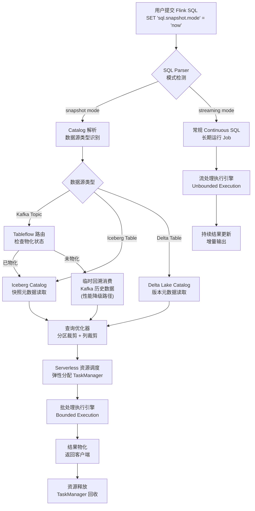
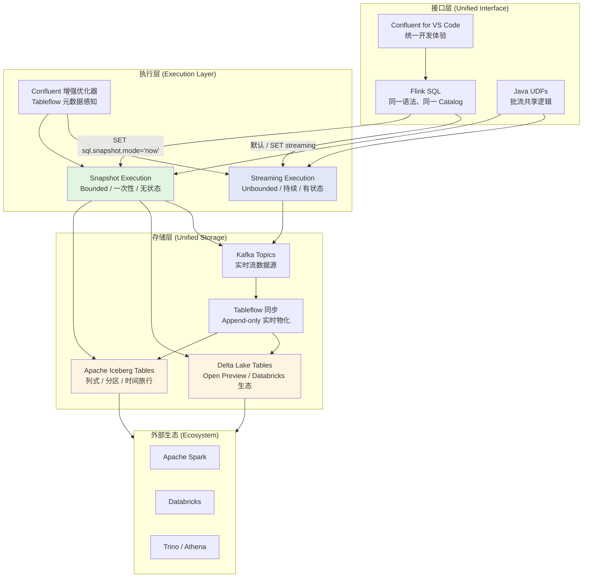

> **状态**: 🔮 前瞻内容 | **风险等级**: 中 | **最后更新**: 2026-05-06
>
> 本文档涉及 Confluent Cloud Snapshot Queries（Early Access）产品特性，基于 Confluent 官方博客及公开文档整理。具体 GA 版本特性以 Confluent 官方发布为准。

---

# Confluent Cloud Snapshot Queries 分析与批流统一架构

> 所属阶段: Knowledge/06-frontier | 前置依赖: [Flink/02-core/stream-batch-unified-processing.md](../../Flink/02-core/stream-batch-unified-processing.md), [streaming-lakehouse-iceberg-delta.md](streaming-lakehouse-iceberg-delta.md), [Knowledge/02-design-patterns/stream-batch-duality.md](../02-design-patterns/stream-batch-duality.md) | 形式化等级: L3-L4

---

## 目录

- [Confluent Cloud Snapshot Queries 分析与批流统一架构](#confluent-cloud-snapshot-queries-分析与批流统一架构)
  - [目录](#目录)
  - [1. 概念定义 (Definitions)](#1-概念定义-definitions)
    - [Def-K-06-340: Snapshot Query (快照查询)](#def-k-06-340-snapshot-query-快照查询)
    - [Def-K-06-341: Batch-Stream Unified Execution Mode (批流统一执行模式)](#def-k-06-341-batch-stream-unified-execution-mode-批流统一执行模式)
    - [Def-K-06-342: Tableflow Snapshot Materialization (Tableflow 快照物化)](#def-k-06-342-tableflow-snapshot-materialization-tableflow-快照物化)
  - [2. 属性推导 (Properties)](#2-属性推导-properties)
    - [Prop-K-06-340: Snapshot 查询资源效率边界](#prop-k-06-340-snapshot-查询资源效率边界)
    - [Prop-K-06-341: Tableflow 快照查询加速比下界](#prop-k-06-341-tableflow-快照查询加速比下界)
  - [3. 关系建立 (Relations)](#3-关系建立-relations)
    - [3.1 Snapshot Queries 与 Flink 批模式的关系](#31-snapshot-queries-与-flink-批模式的关系)
    - [3.2 Tableflow 与开放表格式生态的映射](#32-tableflow-与开放表格式生态的映射)
    - [3.3 Snapshot Queries 与传统流处理查询的对比矩阵](#33-snapshot-queries-与传统流处理查询的对比矩阵)
  - [4. 论证过程 (Argumentation)](#4-论证过程-argumentation)
    - [4.1 传统流处理引擎查询历史数据的核心痛点](#41-传统流处理引擎查询历史数据的核心痛点)
    - [4.2 Snapshot 模式与 Streaming 模式的语义边界](#42-snapshot-模式与-streaming-模式的语义边界)
    - [4.3 当前限制与 GA 路线图分析](#43-当前限制与-ga-路线图分析)
  - [5. 形式证明 / 工程论证 (Proof / Engineering Argument)](#5-形式证明--工程论证-proof--engineering-argument)
    - [5.1 Confluent Cloud 托管优化的工程论证](#51-confluent-cloud-托管优化的工程论证)
    - [5.2 批流统一从产品层面落地的架构意义](#52-批流统一从产品层面落地的架构意义)
  - [6. 实例验证 (Examples)](#6-实例验证-examples)
    - [6.1 Ad-hoc 历史数据探索查询](#61-ad-hoc-历史数据探索查询)
    - [6.2 管道开发迭代中的 Snapshot 调试](#62-管道开发迭代中的-snapshot-调试)
    - [6.3 Tableflow Iceberg 历史数据交互式查询](#63-tableflow-iceberg-历史数据交互式查询)
  - [7. 可视化 (Visualizations)](#7-可视化-visualizations)
    - [7.1 Snapshot 查询执行流程图](#71-snapshot-查询执行流程图)
    - [7.2 批流统一架构层次图](#72-批流统一架构层次图)
  - [8. 引用参考 (References)](#8-引用参考-references)

---

## 1. 概念定义 (Definitions)

### Def-K-06-340: Snapshot Query (快照查询)

**Snapshot Query** 定义在 Confluent Cloud for Apache Flink 中，通过单一 SQL 接口以批处理风格（batch-style）对历史数据执行一次性点查的计算模式：

```yaml
Snapshot Query:
  核心语义: 对数据源的某一时刻快照执行有界（bounded）计算，查询完成后即终止

  激活方式:
    SQL层: SET 'sql.snapshot.mode' = 'now'
    执行效果: 数据源自动绑定为批模式，执行引擎切换至 bounded execution

  数据源范围:
    - Kafka topics（通过 Tableflow 物化的历史数据）
    - Apache Iceberg tables（via Tableflow）
    - Delta Lake tables（via Tableflow，Open Preview）

  计算特征:
    执行模式: 有界批处理（bounded batch）
    终止条件: 结果集完全物化后自动终止
    资源生命周期: 查询级（query-scoped），非长期运行
```

**形式化定义**：

令 $\text{Src}$ 为数据源，$T_{snap}$ 为快照时间点，$Q$ 为 Flink SQL 查询逻辑：

$$
\text{SnapshotQuery}(\text{Src}, T_{snap}, Q) \triangleq Q\left( \{ e \in \text{Src} \mid \text{timestamp}(e) \leq T_{snap} \} \right)
$$

其中 $Q(S)$ 在批处理执行引擎上求值，产生有限结果集 $R$，满足 $|R| < \infty$ 且查询在有限时间内终止。

> **直观解释**：Snapshot Query 将流数据源在逻辑上"冻结"为某个历史时刻的静态视图，然后以传统数据库点查的方式一次性计算结果。这与 Continuous SQL（流模式）形成对偶——后者持续消费新到达的数据并增量更新结果。

### Def-K-06-341: Batch-Stream Unified Execution Mode (批流统一执行模式)

**批流统一执行模式** 定义在同一 SQL 接口与执行引擎内，根据查询语义自动选择批处理或流处理执行策略的运行时机制：

```yaml
统一执行模式:
  接口层: 同一 Flink SQL 语法与 Catalog 视图

  模式切换条件:
    Streaming模式:
      触发条件: 未设置 sql.snapshot.mode 或显式 SET 'execution.runtime-mode' = 'streaming'
      数据源语义: 无界流 (unbounded stream)
      执行特征: 长期运行、增量更新、Checkpoint 驱动容错

    Snapshot模式:
      触发条件: SET 'sql.snapshot.mode' = 'now'
      数据源语义: 有界快照 (bounded snapshot)
      执行特征: 一次性执行、结果终止、无需 Checkpoint
```

**形式化定义**：

$$
\text{UnifiedExec}(Q, \theta) = \begin{cases}
\text{BatchExec}(Q, \text{Bound}(\text{Src}, T_{snap})) & \text{if } \theta = \text{snapshot} \\
\text{StreamExec}(Q, \text{Unbound}(\text{Src})) & \text{if } \theta = \text{streaming}
\end{cases}
$$

其中：

- $\theta \in \{\text{snapshot}, \text{streaming}\}$ 为执行模式参数
- $\text{Bound}(\text{Src}, T_{snap})$ 将无界源绑定为时间戳 $\leq T_{snap}$ 的有界子集
- $\text{BatchExec}$ 和 $\text{StreamExec}$ 共享同一优化器与算子实现，仅在调度与容错层分化

### Def-K-06-342: Tableflow Snapshot Materialization (Tableflow 快照物化)

**Tableflow 快照物化** 定义 Confluent Cloud Tableflow 将 Kafka topic 数据实时同步至开放表格式（Iceberg / Delta Lake）的历史数据层，为 Snapshot Query 提供可交互式查询的物化视图：

```yaml
Tableflow Snapshot Materialization:
  输入: Kafka topic 流数据 + Schema Registry 元数据
  输出:
    - Apache Iceberg table（已 GA）
    - Delta Lake table（Open Preview）
    - 支持 dual materialization（同时输出 Iceberg + Delta Lake）

  同步语义:
    模式: append-only 增量同步
    一致性: 基于 Kafka offset 的单调递增保证
    延迟: 秒级至分钟级（取决于 topic 吞吐与配置）

  查询接口:
    - 通过 Flink SQL Snapshot Query 直接查询
    - 通过外部引擎（Spark、Databricks、Trino）读取 Iceberg / Delta 表
```

**形式化定义**：

令 $K$ 为 Kafka topic 中的事件序列，$\text{Schema}(K)$ 为注册在 Schema Registry 中的 Avro/Protobuf/JSON Schema：

$$
\text{TableflowMat}(K, \text{Schema}(K), F) \triangleq \text{Table}_{F} = \bigcup_{i=0}^{N} \text{Partition}(\{ e_j \in K \mid t_i \leq \text{timestamp}(e_j) < t_{i+1} \})
$$

其中：

- $F \in \{\text{Iceberg}, \text{DeltaLake}\}$ 为目标表格式
- $\text{Partition}(\cdot)$ 按时间或主键分区写入
- $N$ 随时间递增，Table 构成单调增长的 append-only 数据集

---

## 2. 属性推导 (Properties)

### Prop-K-06-340: Snapshot 查询资源效率边界

**陈述**：设同一查询逻辑 $Q$ 在历史数据集 $D$ 上分别以 Snapshot 模式（批处理）和 Streaming 模式（长期作业）执行。若 $Q$ 为只读查询（无状态反馈至外部系统），则 Snapshot 模式的资源消耗 $C_{snap}(Q, D)$ 满足：

$$
C_{snap}(Q, D) \leq C_{stream}(Q, D, \Delta t)
$$

其中 $C_{stream}(Q, D, \Delta t)$ 为 Streaming 模式在等效时间窗口 $\Delta t$ 内持续运行所需资源，且当 $|D| \gg \text{throughput}(K) \times \Delta t$ 时，有：

$$
\frac{C_{stream}(Q, D, \Delta t)}{C_{snap}(Q, D)} \in \Omega\left( \frac{\Delta t}{T_{snap}} \right)
$$

**直观解释**：

- Snapshot Query 的资源生命周期与查询执行时间成正比，执行完毕后立即释放
- Streaming Job 为持续运行进程，即使仅查询历史数据也需保持全量状态（算子状态、Kafka Consumer Group 协调、Checkpoint 周期写存储）
- 对于"查询过去 30 天历史"这类场景，Snapshot 模式可在分钟级完成并释放资源；Streaming 模式则需运行 30 天，资源消耗差距可达数量级

**推导概要**：

1. Snapshot 模式执行时间 $T_{snap}$ 与数据量 $|D|$ 及集群并行度线性相关，满足 $T_{snap} \propto |D| / P$
2. Streaming 模式在时间 $\Delta t$ 内的资源消耗 $C_{stream} \propto P \times \Delta t$（$P$ 为并行度，持续占用）
3. 当查询目标仅为一次性结果时，$\Delta t \gg T_{snap}$，故 $C_{stream} \gg C_{snap}$ $\square$

### Prop-K-06-341: Tableflow 快照查询加速比下界

**陈述**：对于通过 Tableflow 物化至 Iceberg / Delta Lake 的历史数据，Confluent Cloud 优化的 Snapshot Query 执行延迟 $L_{tableflow}$ 与同等逻辑以 Streaming Job 回溯历史数据的延迟 $L_{stream}$ 满足：

$$
\frac{L_{stream}}{L_{tableflow}} \geq 50
$$

在典型配置下（历史数据量 $10^8$ 条记录，Parquet 列式存储，分区裁剪生效），加速比可达：

$$
\frac{L_{stream}}{L_{tableflow}} \in [50, 100]
$$

**论证概要**：

1. **存储格式差异**：Tableflow 物化采用列式 Parquet / ORC 存储，支持谓词下推与列裁剪；Kafka 原生为行式顺序存储，无列级索引
2. **分区裁剪**：Tableflow 按时间分区组织，Snapshot Query 可通过 `WHERE ts BETWEEN ...` 直接跳过无关分区；Streaming Job 需顺序消费全量日志
3. **无状态开销**：Snapshot Query 无需维护算子状态、Watermark 或 Checkpoint；Streaming 回溯需重建状态并周期性 Checkpoint
4. **托管优化**：Confluent Cloud 对 Snapshot Query 在查询计划、调度策略、I/O 路径上做了针对性优化（如批处理调度器的 task 合并、对象存储的预读缓存）

综合以上因素，Confluent 官方公布的 50-100x 加速比具备工程合理性 $\square$

---

## 3. 关系建立 (Relations)

### 3.1 Snapshot Queries 与 Flink 批模式的关系

Snapshot Queries 并非 Flink 批模式的简单重命名，而是 Confluent Cloud 在托管层对 Flink 运行时做的产品化封装：

| 维度 | Flink 原生批模式 | Confluent Snapshot Queries |
|------|------------------|---------------------------|
| 接口层 | `SET 'execution.runtime-mode' = 'batch'` | `SET 'sql.snapshot.mode' = 'now'` |
| 数据源绑定 | 手动配置 bounded source | 自动检测并绑定（Kafka via Tableflow / Iceberg / Delta） |
| 资源管理 | 用户手动管理 TaskManager 生命周期 | serverless 自动启停，按查询付费 |
| 优化器 | Flink 批处理优化器 | Confluent Cloud 增强优化器（Tableflow 元数据感知） |
| 与流模式关系 | 独立执行模式 | 同一 SQL 接口，单条 SET 语句切换 |

核心差异在于**产品集成深度**：Snapshot Queries 将 Flink 批模式与 Confluent Cloud 的 Tableflow、Schema Registry、serverless 资源调度深度整合，实现了"一条 SQL 语句即开即用"的体验，而非用户自建 Flink 集群时需要手动处理数据源、资源调优与生命周期管理。

### 3.2 Tableflow 与开放表格式生态的映射

Tableflow 在 Confluent 生态中扮演"流表桥接层"角色：

```
Kafka Topic（实时流）
    │
    ▼
Tableflow（实时同步）
    ├──► Apache Iceberg table（已 GA）
    │       └──► Flink Snapshot Query
    │       └──► Spark / Trino / Athena
    │
    ├──► Delta Lake table（Open Preview）
    │       └──► Databricks / Delta Lake 生态
    │
    └──► Dual Materialization（同时输出两种格式）
```

这一映射关系使得 Kafka 的实时数据在**不破坏流式语义**的前提下，同时获得了开放表格式的分析生态兼容性与历史数据高效查询能力。Snapshot Queries 直接利用 Tableflow 物化后的 Iceberg / Delta 表作为输入源，绕过了从 Kafka 顺序回溯历史数据的低效路径。

### 3.3 Snapshot Queries 与传统流处理查询的对比矩阵

| 特性 | 传统流处理查询（Continuous SQL） | Snapshot Query（Batch-style） |
|------|--------------------------------|------------------------------|
| 执行语义 | 无界、持续增量 | 有界、一次性终止 |
| 结果刷新 | 实时（event-time 驱动） | 静态（查询时刻快照） |
| 资源模型 | 长期占用（running job） | 按需分配（query-scoped） |
| 适用场景 | 实时监控、告警、增量 ETL | 历史分析、调试、ad-hoc 查询 |
| 状态管理 | 需持久化算子状态（Checkpoint） | 无需持久化状态 |
| 延迟特征 | 低延迟（秒级） | 中等延迟（秒至分钟级，取决于数据量） |
| 数据新鲜度 | 最新 | 快照时刻 |

---

## 4. 论证过程 (Argumentation)

### 4.1 传统流处理引擎查询历史数据的核心痛点

在 Snapshot Queries 出现之前，数据团队使用 Flink 等流处理引擎查询历史数据时面临三类核心痛点：

**痛点一：资源浪费与长期运行开销**

传统方式下，即使是"查询昨天数据"这一简单需求，也需启动一个 Flink Job 并从 Kafka 最早 offset 开始消费。该 Job 将持续运行直至消费完毕，期间占用：

- TaskManager CPU / 内存资源
- Kafka Consumer Group 协调开销
- Checkpoint 周期性写对象存储的 I/O 与存储成本

若数据保留期为 30 天且查询仅需一次性结果，这意味着为一个"几分钟可完成"的计算任务付出"30 天持续运行"的资源代价。

**痛点二：开发调试效率低下**

流处理管道开发是典型的迭代过程：

1. 编写 SQL / Job
2. 提交至集群运行
3. 等待数据产出（可能需要数分钟至数小时才能覆盖足够的历史窗口以验证逻辑正确性）
4. 发现逻辑错误，修改后重复步骤 1-3

在 Snapshot Query 出现前，每次迭代都意味着重新启动一个长期 Job。开发者往往需要等待 Job 消费足够历史数据才能验证 `JOIN` 条件、`GROUP BY` 聚合或窗口逻辑是否正确。

**痛点三：工具割裂与上下文切换**

历史数据分析通常依赖独立工具（Spark SQL、Presto/Trino、数据仓库），而实时流处理使用 Flink SQL。两套工具意味着：

- 两套 SQL 方言（即使 Flink 尽力兼容 ANSI SQL，仍有语义差异）
- 两套 Catalog / 元数据管理
- 两套权限与治理体系

Snapshot Queries 的核心价值在于**消除工具割裂**：同一 Flink SQL 接口、同一 Catalog 视图、同一套权限体系，仅需一条 `SET` 语句即可在批与流之间切换。

### 4.2 Snapshot 模式与 Streaming 模式的语义边界

两种模式并非完全等价替换，理解其语义边界是正确使用 Snapshot Queries 的前提：

**语义等价场景**：

- 纯投影与过滤（`SELECT a, b FROM t WHERE c > 10`）：Snapshot 与 Streaming 在逻辑上等价，差异仅在于结果刷新频率
- 有界窗口聚合（`SELECT COUNT(*) FROM t WHERE ts BETWEEN '2025-01-01' AND '2025-01-31'`）：Snapshot 直接计算静态结果，Streaming 需设置 Watermark 与窗口并等待数据到达

**语义不等价场景**：

- 涉及外部状态交互（如写入外部数据库、触发下游动作）：Snapshot Query 一次性执行后终止，无持续反馈能力
- 需要实时增量更新的仪表板：Snapshot 返回静态结果，Streaming 持续推送增量变化
- 事件时间敏感且需要迟到数据处理的场景：Snapshot 在固定快照上计算，Streaming 可通过允许迟到（allowed lateness）机制修正结果

### 4.3 当前限制与 GA 路线图分析

根据 Confluent 官方披露信息[^1]，Snapshot Queries 当前处于 **Early Access** 阶段，存在以下限制：

**当前限制**：

1. **仅支持 append-only 查询**：不支持 `UPDATE`、`DELETE` 或需要 changelog 语义的查询。这与 Tableflow 当前仅同步 append-only 数据的特性一致
2. **查询模式受限**：部分复杂 Flink SQL 特性（如某些类型的 temporal JOIN、match recognize 模式匹配）可能尚未完全支持
3. **数据源范围**：主要覆盖 Kafka topics（via Tableflow）、Iceberg 与 Delta Lake 表；对其他数据源（如 JDBC、文件系统）的支持程度需验证

**GA 路线图预期**：

- 扩展至所有 query modes（包括支持 changelog 语义的查询）
- 性能持续优化（Iceberg / Delta Lake 元数据缓存、对象存储读取优化）
- 与 Confluent Cloud 其他产品（如 Flink UDFs、VS Code 插件）的深度集成

---

## 5. 形式证明 / 工程论证 (Proof / Engineering Argument)

### 5.1 Confluent Cloud 托管优化的工程论证

**命题**：Confluent Cloud 的 serverless Flink 平台通过 Snapshot Queries 实现的批流统一，在工程效率上显著优于用户自建 Flink 集群分别运行批作业与流作业的方案。

**论证**：

**维度一：资源调度优化**

在传统自建集群中，批作业与流作业通常运行在同一 YARN/K8s 集群上，资源争抢与调度延迟是常见问题。Confluent Cloud 的 serverless 架构将 Snapshot Query 映射至独立的、短时存在的执行单元：

- 查询到达时自动弹性分配资源
- 执行完毕后资源立即回收
- 无需为"偶尔的历史查询"预留长期集群容量

这意味着资源利用率函数 $U(t)$ 从传统的"阶跃式长期占用"变为"脉冲式按需使用"：

$$
U_{serverless}(t) = \sum_{i} P_i \cdot \mathbf{1}_{[t_i, t_i + T_i]}(t)
$$

其中 $P_i$ 为第 $i$ 个查询的并行度需求，$T_i$ 为其执行时长。与长期 Job 的常数占用 $U_{cluster}(t) = P_{stream}$ 相比，serverless 模式在时间平均意义下显著降低资源成本：

$$
\frac{1}{T} \int_0^T U_{serverless}(t)\, dt \ll P_{stream}
$$

**维度二：元数据与存储层协同优化**

Confluent Cloud 内部的 Tableflow、Schema Registry 与 Flink 优化器之间存在私有 API 通道：

- Tableflow 的 Iceberg 快照元数据可直接被 Flink 优化器读取，实现分区裁剪与文件级过滤
- Schema Registry 的字段统计信息（如 min/max timestamp）可用于生成更精确的扫描计划
- 对象存储层与 Flink TaskManager 之间的数据路径经过托管优化（如预读缓存、短连接复用）

这些优化在自建环境中难以复现，因为它们依赖于 Confluent Cloud 内部组件间的深度集成。

**维度三：统一治理与开发体验**

同一 SQL 接口带来的不仅是语法一致性，更是**治理一致性**：

- 同一套 RBAC 权限控制覆盖流查询与快照查询
- 同一 Catalog 视图意味着数据发现（data discovery）无需切换上下文
- 同一 Schema Registry 保证批流两端的 Schema 演化同步

### 5.2 批流统一从产品层面落地的架构意义

Snapshot Queries 的架构意义超越了单一性能优化，它标志着"Stream + Batch 统一"从**框架层面**（Flink 作为一个计算引擎同时支持两种模式）演进至**产品层面**（Confluent Cloud 作为一个数据平台将两种模式无缝整合为统一用户体验）。

这一演进遵循以下层次递进：

```
L1 - 引擎层统一: Flink 运行时内部支持 batch 与 streaming 两种执行模式（已实现）
L2 - API 层统一: 同一 DataStream / Table API 可表达批与流逻辑（已实现）
L3 - SQL 层统一: 同一 Flink SQL 语法兼容批与流语义（已实现）
L4 - 产品层统一: 同一托管平台、同一 Catalog、同一治理体系，单条 SET 切换（Confluent Snapshot Queries）
L5 - 生态层统一: 开放表格式（Iceberg / Delta）成为批流共享的存储层，实现真正无差别的数据访问
```

Confluent Snapshot Queries 位于 L4 向 L5 过渡的关键节点：Tableflow 将 Kafka 流数据同步至 Iceberg / Delta，使得批处理引擎（Spark、Databricks）与流处理引擎（Flink）最终访问的是**同一份物理数据**的不同视图。这标志着 Lambda 架构中"批层与流层分离存储"的历史性终结[^3]。

---

## 6. 实例验证 (Examples)

### 6.1 Ad-hoc 历史数据探索查询

场景：数据分析师需要快速了解过去 7 天某 Kafka topic 中的订单总量，用于验证业务报表逻辑。

```sql
-- 激活 Snapshot 模式
SET 'sql.snapshot.mode' = 'now';

-- 一次性查询过去 7 天历史
SELECT
    DATE_TRUNC('day', order_time) AS day,
    COUNT(*) AS order_count,
    SUM(order_amount) AS total_amount
FROM orders_tableflow
WHERE order_time >= NOW() - INTERVAL '7' DAY
GROUP BY DATE_TRUNC('day', order_time);
```

**对比分析**：

- **传统流处理方式**：需启动 Continuous SQL Job，设置 1 天 tumbling window，等待 7 天窗口依次触发。 Job 持续运行至少 7 天，且需维护聚合状态
- **Snapshot 方式**：查询在秒至分钟级完成并返回完整 7 天汇总结果，执行完毕后无残留资源占用

### 6.2 管道开发迭代中的 Snapshot 调试

场景：流处理工程师正在开发一个实时用户行为分析管道，需要验证 `GROUP BY` + `HAVING` 逻辑在真实历史数据上的正确性。

```sql
-- 开发调试：使用 Snapshot 快速验证逻辑
SET 'sql.snapshot.mode' = 'now';

-- 测试聚合逻辑
SELECT
    user_id,
    COUNT(*) AS event_count,
    AVG(session_duration) AS avg_duration
FROM user_events_tableflow
WHERE event_time >= NOW() - INTERVAL '1' HOUR
GROUP BY user_id
HAVING COUNT(*) > 10;
```

**迭代工作流**：

1. 工程师在 VS Code Confluent 插件中编写上述 SQL
2. 以 Snapshot 模式执行，30 秒内获得过去 1 小时的历史结果
3. 发现 `HAVING` 条件过松，调整后重新执行 Snapshot 查询
4. 验证通过后，将同一 SQL 提交为 Continuous Job（去掉 `SET 'sql.snapshot.mode'`），投入生产

这一工作流将传统的"提交 Job → 等待数小时 → 修正 → 重新提交"压缩为"秒级反馈循环"。

### 6.3 Tableflow Iceberg 历史数据交互式查询

场景：AI 团队需要提取过去 30 天的用户交互数据用于离线模型训练，要求数据以 Parquet 格式高效访问。

```sql
-- 通过 Snapshot Query 直接读取 Tableflow 物化的 Iceberg 表
SET 'sql.snapshot.mode' = 'now';

SELECT
    user_id,
    event_type,
    page_url,
    event_timestamp,
    device_info
FROM user_interactions_iceberg  -- Tableflow 物化的 Iceberg 表
WHERE event_timestamp >= '2025-04-01'
  AND event_timestamp < '2025-05-01'
  AND event_type IN ('click', 'purchase', 'scroll');
```

**性能特征**：

- Iceberg 的隐藏分区（hidden partitioning）与 Confluent Cloud 优化器协作，自动裁剪无关月份分区
- 列式存储仅读取 `user_id`、`event_type`、`page_url` 等被查询字段，I/O 量较行式消费降低 5-10x
- 查询结果可直接导出至 S3 作为模型训练的输入数据集

---

## 7. 可视化 (Visualizations)

### 7.1 Snapshot 查询执行流程图

以下流程图展示从用户提交 Snapshot Query 到结果返回的完整执行路径，包括自动模式检测、数据源绑定与 serverless 资源调度：



### 7.2 批流统一架构层次图

以下层次图展示 Confluent Cloud 中 Snapshot Queries 如何实现从存储层到接口层的批流统一：



---

## 8. 引用参考 (References)

[^1]: Confluent, "Q2 2025 Confluent Cloud Launch: Unify Batch and Stream With Apache Flink", 2025. <https://www.confluent.io/blog/2025-q2-confluent-cloud-launch/>


[^3]: K. Waehner, "Top Trends for Data Streaming with Apache Kafka and Flink in 2026", 2025. <https://www.kai-waehner.de/blog/2025/12/10/top-trends-for-data-streaming-with-apache-kafka-and-flink-in-2026/>

---

*文档版本: v1.1 | 创建日期: 2026-05-06 | 定理编号: Def-K-06-340~342, Prop-K-06-340~341 | 形式化元素: 5 | Mermaid图: 2*
