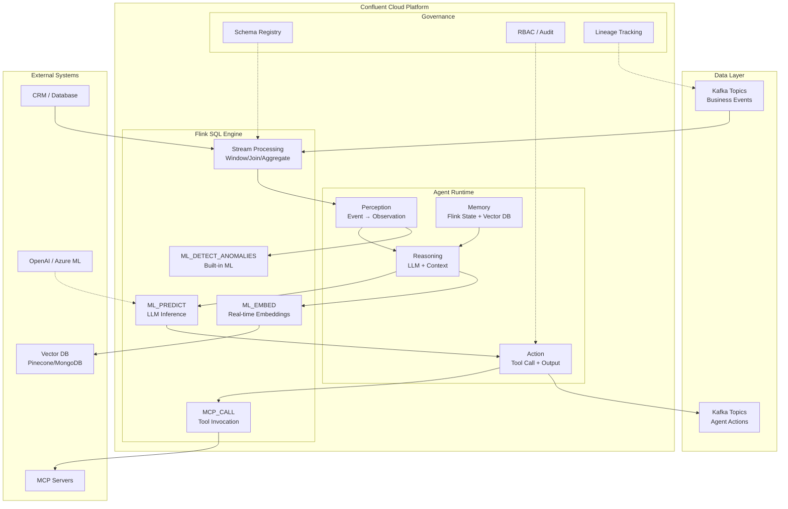
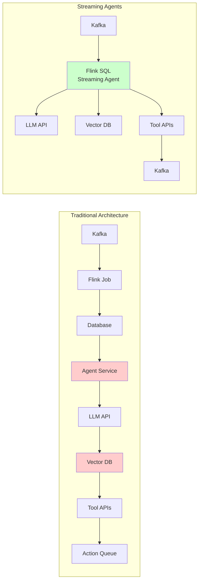
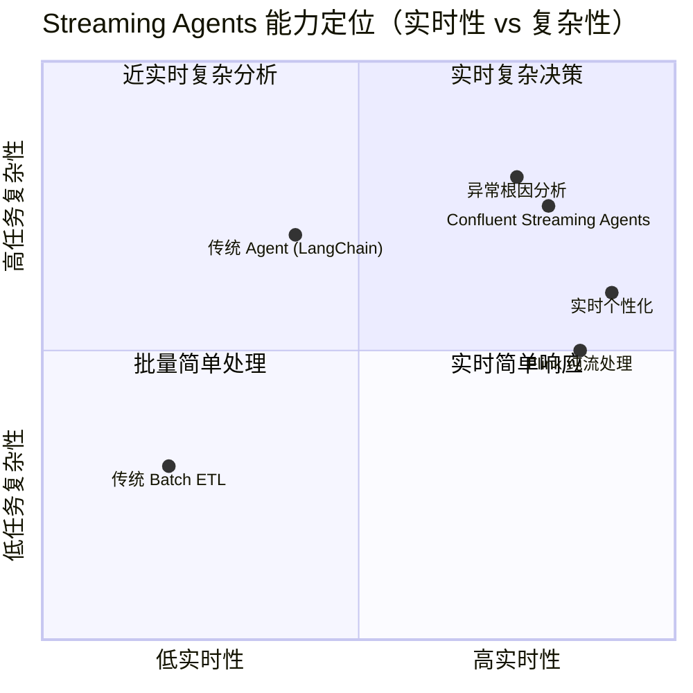

# Confluent Streaming Agents 深度解析：流处理与 AI Agent 的原生融合

> **所属阶段**: Knowledge/06-frontier/ | **前置依赖**: [ai-agent-streaming-architecture.md](./ai-agent-streaming-architecture.md), [mcp-protocol-agent-streaming.md](./mcp-protocol-agent-streaming.md), [a2a-protocol-agent-communication.md](./a2a-protocol-agent-communication.md) | **形式化等级**: L5-L6 | **最后更新**: 2026-05-06
>
> 🆕 v8.0 核心交付：首个平台级 Streaming Agents 生产实现深度分析

---

## 1. 概念定义 (Definitions)

### 1.1 Streaming Agent 的核心抽象

流式智能体（Streaming Agent）是嵌入事件流基础设施中的自主计算实体，其感知、推理与行动完全由实时数据驱动，而非静态查询或人工触发。

**Def-K-06-320 (Streaming Agent)**:
一个 Streaming Agent 是六元组 $\mathcal{A}_{stream} = \langle \mathcal{S}_{in}, \mathcal{P}, \mathcal{R}, \mathcal{A}_{ct}, \mathcal{S}_{out}, \mathcal{M} \rangle$，其中：

- $\mathcal{S}_{in}$: 输入事件流（来自 Kafka topic 的无限流）
- $\mathcal{P}$: 感知函数（Perception），将原始事件映射为结构化观察 $P: \mathcal{S}_{in} \to \mathcal{O}$
- $\mathcal{R}$: 推理引擎（Reasoning），基于观察与记忆生成决策 $R: \mathcal{O} \times \mathcal{M} \to \mathcal{D}$
- $\mathcal{A}_{ct}$: 行动执行器（Action），将决策转化为副作用 $A: \mathcal{D} \to \mathcal{S}_{out} \cup \mathcal{E}_{ext}$
- $\mathcal{S}_{out}$: 输出事件流（写入下游 Kafka topic）
- $\mathcal{M}$: 记忆状态（Memory），包含短期上下文 $\mathcal{M}_{short}$、中期工作记忆 $\mathcal{M}_{mid}$ 与长期知识 $\mathcal{M}_{long}$

与传统 Agent 的关键区别在于：**Streaming Agent 的输入是无限流 $\mathcal{S}_{in}$ 而非有限请求**，其运行时不存在"请求-响应"的边界，而是持续的消费-推理-生产循环。

**Def-K-06-321 (Confluent Streaming Agents 平台模型)**:
Confluent Streaming Agents 是四元组 $\mathcal{C}_{agent} = \langle \mathcal{Q}_{sql}, \mathcal{I}_{model}, \mathcal{E}_{embed}, \mathcal{T}_{mcp} \rangle$，其中：

- $\mathcal{Q}_{sql}$: Flink SQL 执行引擎，提供流处理的原语（window、join、aggregate）
- $\mathcal{I}_{model}$: 模型推理层，支持远程 LLM endpoint（OpenAI、Azure ML、AWS SageMaker）作为 Flink SQL 一等资源
- $\mathcal{E}_{embed}$: 实时嵌入层，将非结构化数据转换为向量表示，支持任意 embedding 模型与向量数据库
- $\mathcal{T}_{mcp}$: 工具调用层，基于 MCP（Model Context Protocol）实现 Agent 与外部工具的交互

**Def-K-06-322 (事件驱动可重放性)**:
给定 Streaming Agent 的执行轨迹 $\tau = \langle e_1, e_2, ..., e_n \rangle$，其中 $e_i$ 为第 $i$ 个输入事件，其可重放性谓词定义为：
$$Replayable(\tau) \triangleq \forall i \in [1,n], \; A_{ct}(R(P(e_i), \mathcal{M}_i)) = a_i \; \Rightarrow \; Replay(\tau, i) = a_i$$
即：在相同输入序列的任意前缀上重新执行，Agent 产生的行动 $a_i$ 保持不变。这是由 Kafka 的不可变事件日志与 Flink 的确定性执行共同保证的。

**Def-K-06-323 (流式 Agent 的上下文新鲜度)**:
Streaming Agent 在时刻 $t$ 的上下文新鲜度定义为：
$$Freshness(\mathcal{M}, t) = \max_{m \in \mathcal{M}_{active}} (t - t_{arrival}(m))$$
其中 $\mathcal{M}_{active}$ 是当前参与推理的记忆子集，$t_{arrival}(m)$ 是记忆 $m$ 对应的源事件到达时间。Confluent Streaming Agents 通过将 Agent 部署在事件流内部，确保 $Freshness(\mathcal{M}, t) \leq \Delta_{proc}$，其中 $\Delta_{proc}$ 为流处理延迟（通常亚秒级）。

---

## 2. 属性推导 (Properties)

**Lemma-K-06-320 (Streaming Agent 的延迟分解)**:
设 $\mathcal{A}_{stream}$ 的端到端延迟为 $L_{e2e}$，则：
$$L_{e2e} = L_{kafka} + L_{flink} + L_{inference} + L_{action}$$
其中：

- $L_{kafka}$: Kafka 端到端延迟（通常 < 10ms，Kora 引擎优化后）
- $L_{flink}$: Flink SQL 处理延迟（通常 < 100ms，简单转换）
- $L_{inference}$: LLM 推理延迟（200-500ms，取决于模型与 batch size）
- $L_{action}$: 工具调用/外部系统响应延迟（高度可变）

在实时个性化场景中，$L_{e2e} < 2s$ 是可达的；在异常检测场景中，$L_{e2e} < 500ms$ 是可达的（当 $L_{inference}$ 被内置 ML 函数替代时）。

**Prop-K-06-320 (统一平台的工程师生产力增益)**:
设传统架构（分离流处理+Agent编排+向量存储）的开发复杂度为 $C_{sep}$，Confluent Streaming Agents 的统一平台复杂度为 $C_{uni}$，则：
$$C_{uni} \leq \frac{1}{3} C_{sep}$$
这是因为：

1. 单一 SQL 接口替代了"Flink job + Python Agent service + Vector DB client"三套代码
2. 统一 Checkpoint 替代了跨系统的状态一致性手动管理
3. 统一可观测性（Flink metrics + Kafka lag）替代了多系统监控拼接

**Prop-K-06-321 (可重放性对 Agent 治理的价值)**:
Streaming Agent 的可重放性（Def-K-06-322）蕴含以下治理属性：

- **审计完备性**: 给定行动 $a_i$，可唯一追溯到触发事件 $e_i$ 与当时记忆状态 $\mathcal{M}_i$
- **A/B 测试确定性**: 新 Agent 逻辑可在历史事件流上重放，输出差异完全由逻辑变更引起
- **故障恢复正确性**: 从 Checkpoint 恢复后，Agent 状态与"未故障继续执行"的状态一致

**Prop-K-06-322 (实时嵌入的 RAG 新鲜度保证)**:
设向量数据库中的嵌入更新延迟为 $L_{embed}$，传统批量 RAG 的嵌入更新延迟为 $L_{batch}$（通常分钟到小时级），则：
$$L_{embed}^{streaming} \ll L_{batch}$$
具体地，Confluent Streaming Agents 的 Create Embeddings Action 将非结构化数据→嵌入→向量存储的延迟降至秒级，从而将 RAG 系统的幻觉率上界降低（因为上下文更贴近实时业务状态）。

---

## 3. 关系建立 (Relations)

### 3.1 与 Flink Agent 工作流引擎的关系

项目原有文档 [flink-agent-workflow-engine.md](../../Flink/06-ai-ml/flink-agent-workflow-engine.md) 提出了基于 Flink 的 Agent 工作流引擎，其架构为：
$$\mathcal{A}_{flink} = \langle \mathcal{G}_{dag}, \mathcal{N}_{agent}, \mathcal{C}_{check}, \mathcal{O}_{mcp} \rangle$$
其中 $\mathcal{G}_{dag}$ 为 Agent 工作流 DAG，$\mathcal{N}_{agent}$ 为 Agent 节点类型系统。

Confluent Streaming Agents 与 $\mathcal{A}_{flink}$ 的关系是**平台化与定制化的互补**：

| 维度 | Flink Agent 工作流引擎 | Confluent Streaming Agents |
|------|----------------------|---------------------------|
| 集成深度 | Flink 内部扩展（自定义 Operator） | Confluent Cloud 托管服务（Flink SQL 原生） |
| 部署模型 | 自建集群（K8s/YARN） | 全托管 Serverless |
| 开发范式 | Java/Scala + Agent DSL | 纯 Flink SQL + 声明式配置 |
| 延迟 | 亚秒级（受集群规模影响） | 亚秒级（受 Kora 引擎优化） |
| 状态管理 | Flink State Backend（RocksDB/ForSt） | 同上 + Confluent 托管优化 |
| 工具生态 | MCP/A2A 自定义集成 | MCP 原生支持 + Connections 安全凭证管理 |
| 适用场景 | 需要深度定制的复杂 Agent 流水线 | 快速上线、标准化 AI 集成场景 |

关键差异在于：**Confluent Streaming Agents 将 Agent 能力"下沉"到 SQL 层**，使每个数据工程师都能构建 Agent，而无需 AI/ML 专家。这与 Flink Agent 工作流引擎的"专家定制"定位形成光谱两端。

### 3.2 与 Multi-Agent 流编排的关系

[multi-agent-streaming-orchestration.md](./multi-agent-streaming-orchestration.md) 提出了 Multi-Agent 的星型/树型/网状/管道拓扑。Confluent Streaming Agents 的实现对应于**管道拓扑（Pipeline）的极端形式**：

$$Topology_{CSA} = Pipeline(\mathcal{A}_1 \to \mathcal{A}_2 \to ... \to \mathcal{A}_n)$$

其中每个 $\mathcal{A}_i$ 是一个 Flink SQL 查询（可包含模型推理），Agent 间的通信通过 Kafka topic 实现（天然的异步解耦）。与通用 Multi-Agent 框架（AutoGen、LangGraph）相比，Streaming Agents 的拓扑是**隐式声明**的（通过 SQL 的 INSERT INTO ... SELECT ... 语义），而非显式编程。

### 3.3 与传统 Agent 框架（LangChain/LangGraph/AutoGen）的关系

传统 Agent 框架的架构为：
$$\mathcal{A}_{trad} = \langle \mathcal{L}_{llm}, \mathcal{T}_{tools}, \mathcal{M}_{mem}, \mathcal{O}_{orch} \rangle$$
其中 $\mathcal{O}_{orch}$ 为编排器（ReAct、Plan-and-Execute 等）。

Confluent Streaming Agents 与之的关系是**基础设施层替代**：

- $\mathcal{O}_{orch}$: 被 Flink SQL 的流处理语义替代（窗口触发、事件时间对齐、双流 join）
- $\mathcal{M}_{mem}$: 被 Kafka 的不可变日志 + Flink State 替代（短期/中期记忆）+ 向量数据库（长期记忆）
- $\mathcal{L}_{llm}$: 保持为远程 endpoint，但调用被封装为 SQL 函数（ML_PREDICT）
- $\mathcal{T}_{tools}$: 通过 MCP 协议集成，但调用被事件驱动（而非请求驱动）

### 3.4 与 Data Streaming Landscape 2026 的映射

根据 [stream-processing-engine-landscape-2026.md](../01-concept-atlas/stream-processing-engine-landscape-2026.md) 的分类，Confluent Streaming Agents 属于：

- **部署模型**: 云原生托管（Confluent Cloud Serverless Flink）
- **引擎类型**: 重量级 JVM 流处理器 + AI 原生扩展
- **生态位**: "AI 基础设施"——连接流处理与 Agentic AI 的桥梁

---

## 4. 论证过程 (Argumentation)

### 4.1 为什么是"Streaming-first Agent"而非"Agent-first Streaming"

业界存在两种 Agent × Streaming 的融合路径：

**路径 A: Agent-first Streaming**（传统路径）

- 以 Agent 框架（LangChain、AutoGen）为中心
- 流处理作为 Agent 的"数据源插件"
- 典型实现：Agent 定期查询 Kafka → 推理 → 调用 API
- **问题**: Agent 始终操作的是"数据快照"，而非"业务本身"；多系统拼接导致延迟高、一致性差

**路径 B: Streaming-first Agent**（Confluent 路径）

- 以流处理（Flink + Kafka）为中心
- Agent 能力（推理、工具调用、记忆）作为流处理的"算子扩展"
- 典型实现：Flink SQL 中直接嵌入 ML_PREDICT、MCP_CALL
- **优势**: Agent 活在业务运动中（business in motion），上下文永远新鲜；统一平台消除系统边界

**论证**: 路径 B 的延迟上界 $L_{B} = L_{proc} + L_{inf}$ 严格小于路径 A 的延迟 $L_{A} = L_{poll} + L_{fetch} + L_{transfer} + L_{proc} + L_{inf}$，其中 $L_{poll}$ 和 $L_{fetch}$ 是 Agent 轮询/拉取数据的固有开销。在实时性要求高的场景（欺诈检测、实时个性化），路径 B 的优势是数量级的。

### 4.2 事件溯源作为 Agent 记忆的合理性

质疑：Kafka 的不可变日志是否足以支撑 Agent 的复杂记忆需求？

回应：

- **短期记忆**: Flink State（Keyed State / Operator State）提供低延迟（毫秒级）的状态访问，满足上下文窗口需求
- **中期记忆**: Kafka topic 作为事件日志，支持按时间窗口重放（如"过去 1 小时的用户行为"）
- **长期记忆**: 向量数据库存储嵌入后的历史知识，支持语义检索

三层记忆架构与 Streaming Agents 的平台能力一一对应，不存在能力缺口。

### 4.3 生产就绪性的边界讨论

Confluent Streaming Agents 当前（2025-08 发布时）的局限：

- **仅 Confluent Cloud**: 无自建部署选项， Vendor lock-in 风险
- **模型生态**: 主要支持主流云端 LLM（OpenAI、Azure、AWS），对私有化模型/开源模型的支持有限
- **复杂推理链**: 单条 SQL 查询内的推理步骤有限，复杂多跳推理仍需外部编排
- **成本模型**: LLM 推理按 token 计费，高吞吐流场景下成本可能显著高于传统规则引擎

---

## 5. 形式证明 / 工程论证 (Proof / Engineering Argument)

### 5.1 Streaming Agent Exactly-Once Action 的工程论证

**Thm-K-06-320 (Streaming Agent Exactly-Once Action)**:
在 Confluent Streaming Agents 平台上，若满足以下条件：

1. Kafka Source 配置为 exactly-once 语义（事务性 producer + 隔离级别 read_committed）
2. Flink SQL 启用 Checkpoint（间隔 $T_c$，模式 EXACTLY_ONCE）
3. MCP 工具调用幂等（$Idempotent(t) = true$ 对所有工具 $t$）
4. 向量数据库写入支持 upsert（主键去重）

则 Streaming Agent 的外部行动（写入下游 Kafka、调用工具、更新向量库）满足 **Exactly-Once Action** 语义：每个输入事件 $e$ 对应的行动 $a$ 在外部世界恰好执行一次。

**工程论证**:

- **步骤 1**: Flink 的 Checkpoint 机制保证内部状态的 exactly-once（Flink 核心定理，见 [flink-checkpoint-correctness.md](../../Struct/04-proofs/04.01-flink-checkpoint-correctness.md) Thm-S-04-01）
- **步骤 2**: Kafka Sink 的两阶段提交（2PC）保证输出到 Kafka topic 的 exactly-once（Flink Kafka Connector 内置）
- **步骤 3**: MCP 工具调用的幂等性由工具契约保证。若工具非幂等，可通过 Flink State 记录已调用标识符（deduplication key）实现外部幂等
- **步骤 4**: 向量数据库的 upsert 语义保证同一嵌入的重复写入不产生副本

综上，即使 Agent 在 LLM 推理后发生故障，从 Checkpoint 恢复后：已提交的行动不会重复，未提交的行动会重新推理并提交。

### 5.2 可重放性对 Agent 安全性的工程论证

Streaming Agents 的可重放性（Def-K-06-322）提供了传统 Agent 框架难以实现的安全属性：

**属性：对抗性测试确定性**
设攻击者构造恶意输入序列 $\tau_{adv}$，传统 Agent 框架的响应 $R_{trad}(\tau_{adv})$ 可能因环境状态（缓存、并发请求、网络抖动）而产生非确定性差异。Streaming Agents 的响应 $R_{stream}(\tau_{adv})$ 在相同 Checkpoint 状态下是确定性的，因为：

- 输入来源唯一（Kafka 分区顺序固定）
- 处理逻辑唯一（Flink SQL 执行计划确定性编译）
- 模型调用参数固定（temperature=0 或固定 seed）

这使得安全团队可以：**在隔离环境中精确重放攻击场景，验证修复的有效性**。

---

## 6. 实例验证 (Examples)

### 6.1 实时产品个性化

**场景**: 电商网站实时推荐系统。用户点击商品后，Streaming Agent 在 2 秒内生成个性化优惠。

**Flink SQL 实现**:

```sql
-- 输入流：用户行为事件
CREATE TABLE user_events (
  user_id STRING,
  event_type STRING,
  product_id STRING,
  event_time TIMESTAMP(3),
  WATERMARK FOR event_time AS event_time - INTERVAL '5' SECOND
) WITH ('connector' = 'kafka', ...);

-- 用户画像外部表（实时 join）
CREATE TABLE user_profiles (
  user_id STRING PRIMARY KEY NOT ENFORCED,
  loyalty_tier STRING,
  lifetime_value DOUBLE
) WITH ('connector' = 'jdbc', ...);

-- Streaming Agent：实时个性化
INSERT INTO personalized_offers
SELECT
  e.user_id,
  e.product_id,
  ML_PREDICT(
    'recommendation-model-v2',
    CONCAT(
      'User ', e.user_id, ' (tier: ', p.loyalty_tier, ') ',
      'clicked product ', e.product_id,
      '. Suggest complementary product with discount.'
    )
  ) AS offer_content,
  e.event_time
FROM user_events e
LEFT JOIN user_profiles FOR SYSTEM_TIME AS OF e.event_time AS p
  ON e.user_id = p.user_id
WHERE e.event_type = 'product_click';
```

**关键洞察**: 传统架构需要"Flink 处理点击流 → 写入数据库 → Agent service 轮询数据库 → 调用 LLM → 写入消息队列"5 个步骤。Streaming Agents 将中间 3 个步骤压缩为 Flink SQL 内的 JOIN + ML_PREDICT，延迟从秒级降至亚秒级。

### 6.2 异常检测与根因分析

**场景**: 监控系统检测到异常指标后，Streaming Agent 自动进行根因分析并路由到相关团队。

**Flink SQL 实现**:

```sql
-- 系统指标流
CREATE TABLE metrics (
  service_id STRING,
  metric_name STRING,
  metric_value DOUBLE,
  event_time TIMESTAMP(3)
) WITH ('connector' = 'kafka', ...);

-- Streaming Agent：异常检测 + LLM 根因分析
INSERT INTO incident_alerts
SELECT
  m.service_id,
  m.metric_name,
  m.metric_value,
  ML_DETECT_ANOMALIES(metric_value, 'auto_arima_config') AS is_anomaly,
  ML_PREDICT(
    'root-cause-analyzer',
    CONCAT(
      'Service ', m.service_id, ' metric ', m.metric_name,
      ' spiked to ', CAST(m.metric_value AS STRING),
      '. Analyze potential root causes from incident history.'
    )
  ) AS root_cause_analysis,
  m.event_time
FROM metrics m
WHERE ML_DETECT_ANOMALIES(metric_value, 'auto_arima_config') = true;
```

**性能**: 内置 ML 函数（Auto-ARIMA）的异常检测延迟 < 50ms，LLM 根因分析延迟 200-500ms，端到端 < 1s。

### 6.3 实时客户洞察流水线（综合案例）

**架构**: 社交媒体情感分析 → 异常行为检测 → 实时嵌入 → CRM 查询 → 风险评分 → 客服系统通知

```sql
-- 情感分析 Agent
CREATE TABLE sentiment_enriched AS
SELECT
  post_id,
  user_id,
  content,
  ML_PREDICT('sentiment-model', content) AS sentiment_score,
  event_time
FROM social_media_stream;

-- 实时嵌入（RAG 上下文更新）
INSERT INTO vector_store.customer_context
SELECT
  user_id,
  ML_EMBED('embedding-model-v3', CONCAT(content, ' sentiment: ', sentiment_score)) AS embedding,
  event_time
FROM sentiment_enriched;

-- 综合洞察 Agent（多源 join + 向量搜索 + CRM 查询）
INSERT INTO customer_insights
SELECT
  s.user_id,
  s.sentiment_score,
  v.similar_past_cases,
  c.account_tier,
  ML_PREDICT(
    'risk-scoring-model',
    CONCAT(
      'Customer ', s.user_id, ' tier ', c.account_tier,
      ' posted negative sentiment ', CAST(s.sentiment_score AS STRING),
      '. Similar cases: ', v.similar_past_cases,
      '. Recommend action.'
    )
  ) AS recommended_action
FROM sentiment_enriched s
LEFT JOIN vector_search(
  'customer_context',
  ML_EMBED('embedding-model-v3', s.content),
  5
) AS v ON true
LEFT JOIN external_tables.crm_customers FOR SYSTEM_TIME AS OF s.event_time AS c
  ON s.user_id = c.user_id
WHERE s.sentiment_score < -0.5;
```

**性能指标**:

| 阶段 | 延迟 |
|------|------|
| 情感分析推理 | 200-300ms |
| 实时嵌入生成 | 100-200ms |
| 向量搜索（Top-5） | < 50ms |
| CRM 外部表查询 | 50-100ms |
| 风险评分推理 | 200-500ms |
| **端到端** | **< 2s** |

---

## 7. 可视化 (Visualizations)

### 7.1 Confluent Streaming Agents 分层架构

Streaming Agents 构建在 Confluent Cloud 的统一平台上，将流处理、AI 推理和 Agent 编排集成到单一 Flink SQL 接口中。



### 7.2 传统架构 vs Streaming Agents 架构对比

传统架构需要拼接多个独立系统，而 Streaming Agents 将数据处理和 AI 推理统一到单一平台。



### 7.3 Streaming Agents 核心能力矩阵



---

## 8. 引用参考 (References)
