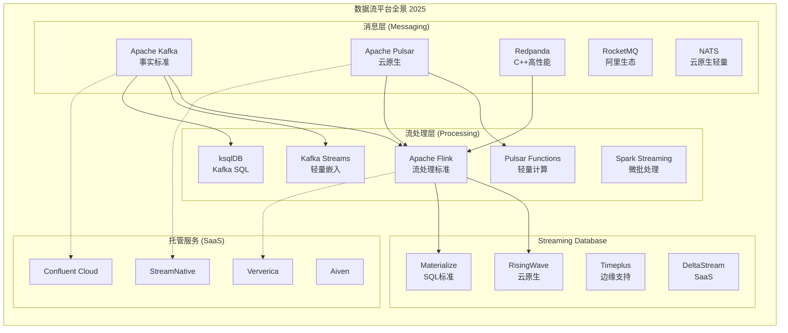
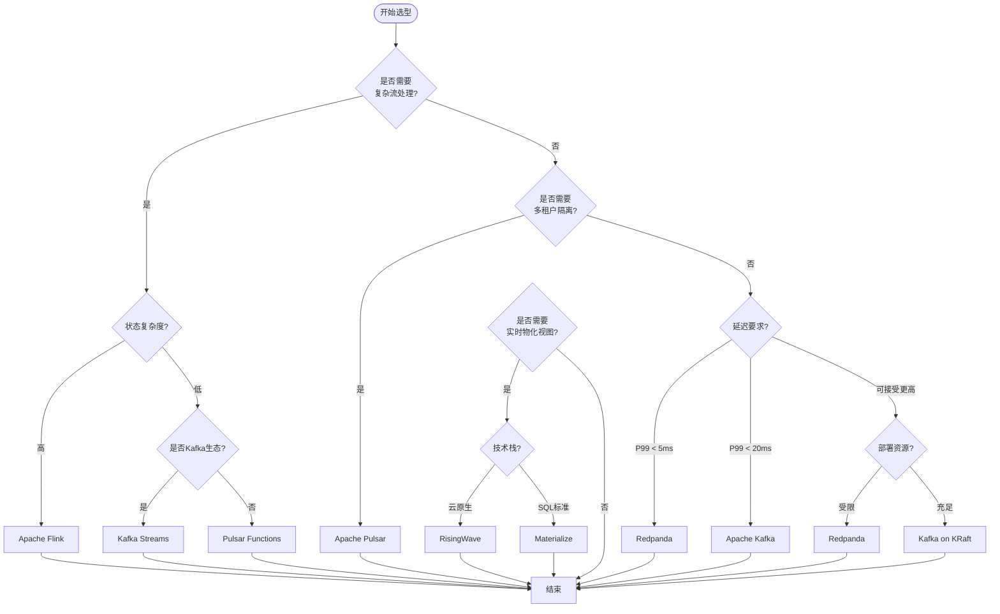
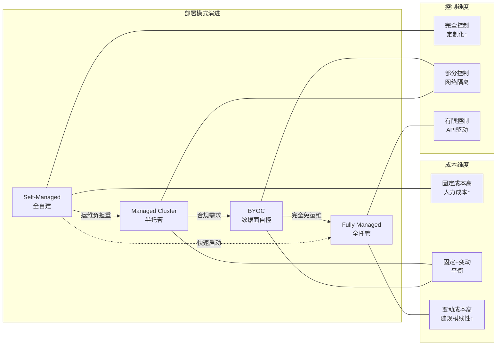
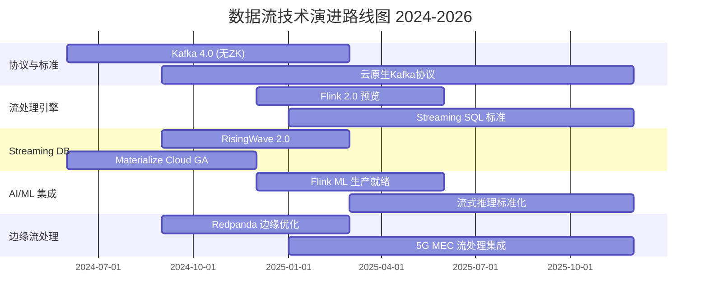

# 数据流平台全景对比 2025 —— Kafka vs Pulsar vs Flink

> **所属阶段**: Knowledge/Frontier | **前置依赖**: [Flink/ 全系列架构文档](../../Flink/00-INDEX.md), [Knowledge/04-patterns/stream-processing-patterns.md](../02-design-patterns/pattern-event-time-processing.md) | **形式化等级**: L4 (工程选型论证)

---

## 1. 概念定义 (Definitions)

### Def-K-06-250: 数据流平台 (Data Streaming Platform)

数据流平台是一种**以连续数据流为核心抽象**的分布式系统，提供实时数据的摄取、存储、处理和分发能力。

**形式化定义**:

```
DSP = ⟨P, S, C, F⟩
其中:
  P: Producer 集合 — 数据生产者
  S: Stream 集合 — 逻辑数据流 (Topic/Partition)
  C: Consumer 集合 — 数据消费者
  F: Function 集合 — 流处理算子 (可选)
```

### Def-K-06-251: 流处理语义分类

| 语义级别 | 定义 | 容错机制 |
|---------|------|----------|
| At-Most-Once | 消息最多处理一次，可能丢失 | 无重试 |
| At-Least-Once | 消息至少处理一次，可能重复 | 失败重试 |
| Exactly-Once | 消息精确处理一次 | 幂等 + 事务 |

### Def-K-06-252: 部署模式分类

**定义**: 数据流平台的部署拓扑与运维责任划分。

| 模式 | 控制面 | 数据面 | 适用场景 |
|-----|-------|-------|---------|
| Self-Managed | 用户 | 用户 | 强合规、定制化需求 |
| Managed Cluster | 服务商 | 用户VPC | 中等规模、可控成本 |
| Fully Managed SaaS | 服务商 | 服务商 | 快速启动、免运维 |
| BYOC | 服务商 | 用户VPC | 数据主权 + 托管便利 |

### Def-K-06-253: 存算分离架构 (Storage-Compute Separation)

**定义**: 将消息持久层 (BookKeeper/ S3) 与计算层 (Broker) 解耦的架构模式。

```
传统架构:    Producer → Broker(存储+计算) → Consumer

存算分离:    Producer → Broker(计算) → BookKeeper/S3(存储) → Consumer
                        ↕
                   Metadata (ZooKeeper/etcd)
```

### Def-K-06-254: 流处理引擎核心指标

| 指标 | 定义 | 典型范围 |
|-----|------|---------|
| 延迟 (Latency) | 事件产生到处理完成的时延 | ms ~ s 级 |
| 吞吐 (Throughput) | 单位时间处理事件数 | 10K ~ 10M+ events/s |
| 状态大小 (State Size) | 算子维护的状态数据量 | GB ~ TB 级 |
| 检查点间隔 (Checkpoint Interval) | 状态快照周期 | 1s ~ 10min |

### Def-K-06-255: Streaming Database

**定义**: 将流处理能力直接集成到数据库引擎中的新型系统，提供物化视图 (Materialized View) 的实时更新。

**特征**:

- 声明式 SQL 接口
- 持续查询 (Continuous Query)
- 增量计算 (Incremental Computation)
- 存储与计算一体化

---

## 2. 属性推导 (Properties)

### Lemma-K-06-160: Kafka 协议标准化效应

**命题**: Apache Kafka 协议已成为**事实上的行业标准**。

**推导依据**:

1. **Kafka Connect**: 300+ 连接器生态
2. **Kafka Streams**: 原生 Java/Scala 流处理
3. **兼容实现**: Redpanda, Pulsar (Kafka Protocol Handler), WarpStream
4. **云服务**: AWS MSK, Azure Event Hubs, Google Cloud Pub/Sub (Kafka API)

**工程含义**: 选择 Kafka 协议意味着选择最大的生态兼容性和人才储备。

### Lemma-K-06-161: 存算分离的权衡定律

**命题**: 存算分离架构在**弹性扩展**与**端到端延迟**之间存在固有权衡。

**形式化表述**:

```
设 T_broker 为 Broker 处理延迟, T_storage 为存储层写入延迟
则总延迟 L = T_broker + T_storage + T_metadata

存算分离: T_storage ↑ (网络IO), 但弹性系数 E ↑
存算一体: T_storage ↓ (本地IO), 但弹性系数 E ↓
```

**实例**:

| 系统 | 架构 | P99 延迟 | 弹性能力 |
|-----|------|---------|---------|
| Apache Kafka | 存算一体 | ~5ms | 分钟级扩容 |
| Apache Pulsar | 存算分离 | ~20ms | 秒级扩容 |
| Redpanda | 存算一体 | ~3ms | 分钟级扩容 |

### Lemma-K-06-162: 流处理引擎的状态复杂度边界

**命题**: 流处理引擎的状态管理能力与其**检查点开销**呈正相关。

| 引擎 | 状态后端 | 精确一次语义 | 状态大小上限 |
|-----|---------|------------|------------|
| Apache Flink | RocksDB/Heap | ✅ 原生支持 | TB 级 |
| Spark Streaming | 外部存储 | ⚠️ 需配合 Kafka | GB 级 |
| Kafka Streams | RocksDB | ✅ 事务支持 | 单节点限制 |
| ksqlDB | Kafka + RocksDB | ✅ 依赖底层 | 中等规模 |

---

## 3. 关系建立 (Relations)

### 3.1 核心平台架构映射

```
┌─────────────────────────────────────────────────────────────────────┐
│                        数据流平台生态全景                            │
├─────────────────────────────────────────────────────────────────────┤
│                                                                     │
│  ┌──────────────┐     ┌──────────────┐     ┌──────────────┐        │
│  │   消息队列    │     │  流处理引擎   │     │ Streaming DB │        │
│  │   (MQ)       │────▶│   (Engine)   │────▶│              │        │
│  └──────────────┘     └──────────────┘     └──────────────┘        │
│         │                    │                    │                │
│         ▼                    ▼                    ▼                │
│  ┌──────────────┐     ┌──────────────┐     ┌──────────────┐        │
│  │ Apache Kafka │     │Apache Flink  │     │ RisingWave   │        │
│  │ Apache Pulsar│     │Spark Streaming│    │ Materialize  │        │
│  │    Redpanda  │     │Kafka Streams │     │  Timeplus    │        │
│  │ Apache RocketMQ│   │  ksqlDB      │     │  DeltaStream │        │
│  └──────────────┘     └──────────────┘     └──────────────┘        │
│                                                                     │
└─────────────────────────────────────────────────────────────────────┘
```

### 3.2 平台能力矩阵

| 维度 | Kafka | Pulsar | Flink | Redpanda | ksqlDB |
|-----|-------|--------|-------|----------|--------|
| **核心定位** | 消息队列标准 | 云原生消息 | 流处理引擎 | C++ Kafka | Kafka SQL |
| **存储架构** | 存算一体 | 存算分离 | 状态后端 | 存算一体 | 依赖 Kafka |
| **多租户** | ❌ (KRaft改进中) | ✅ 原生 | ✅ 应用层 | ❌ | ❌ |
| **地理复制** | MirrorMaker | Geo-Replication | - | - | - |
| **流处理能力** | KStreams/ksqlDB | Pulsar Functions | 原生 | 有限 | 原生 |
| **延迟 (P99)** | ~5ms | ~20ms | 亚秒级 | ~3ms | ~10ms |
| **吞吐 (单节点)** | ~1M msg/s | ~500K msg/s | 依赖状态 | ~2M msg/s | ~500K msg/s |

### 3.3 部署模式与平台映射

```
┌─────────────────────────────────────────────────────────────────┐
│                     部署模式决策空间                              │
├─────────────────────────────────────────────────────────────────┤
│                                                                 │
│  Self-Managed          Managed Cluster         SaaS (Fully)     │
│  ├─ Apache Kafka       ├─ AWS EMR + Kafka      ├─ Confluent     │
│  ├─ Apache Pulsar      ├─ GCP Dataflow         ├─ Aiven         │
│  ├─ Apache Flink       ├─ Azure HDInsight      ├─ Ververica     │
│  └─ Redpanda           └─ Databricks           └─ Upstash       │
│                                                                 │
│  ───────────────────── BYOC (Bring Your Own Cloud) ─────────── │
│  ├─ Confluent BYOC     ├─ Ververica BYOC     ├─ StreamNative   │
│                                                                 │
└─────────────────────────────────────────────────────────────────┘
```

---

## 4. 论证过程 (Argumentation)

### 4.1 Kafka 的统治地位分析

**论据**:

1. **时间先发优势**: 2011年开源，成为流数据基础设施代名词
2. **生态网络效应**: LinkedIn → Confluent 商业化路径验证
3. **协议标准化**: Kafka Protocol 成为事实标准

**反方观点**: Kafka 的云原生改造滞后 (ZooKeeper → KRaft 迁移耗时多年)

**回应**: KRaft (Kafka Raft) 模式已在 3.3+ 版本中 GA，移除 ZooKeeper 依赖，简化运维。

### 4.2 Pulsar 的差异化价值

**核心优势论证**:

| 场景 | Pulsar 优势 | Kafka 局限 |
|-----|------------|-----------|
| 多租户隔离 | Namespace + 配额原生支持 | 需外部实现 |
| 分层存储 | 自动卸载到 S3，无限保留 | 需手动配置 |
| 地理复制 | 内置异地多活 | MirrorMaker 额外部署 |
| 函数计算 | Pulsar Functions 轻量级 | 需 Kafka Streams |

**劣势**: 运维复杂度高于 Kafka，社区规模约为 Kafka 的 1/10。

### 4.3 Flink 的流处理霸权

**技术论证**:

```
Spark Streaming (微批) vs Flink (原生流)

时间模型:
  Spark: Event Time ≈ Processing Time (微批窗口)
  Flink: Event Time ≠ Processing Time (Watermark机制)

状态管理:
  Spark: 依赖外部存储 (HBase, Redis)
  Flink: 内置 RocksDB 状态后端

容错机制:
  Spark: RDD Lineage + Checkpoint
  Flink: Chandy-Lamport 分布式快照 (Checkpoints)
```

### 4.4 Streaming Database 的崛起逻辑

**市场驱动力**:

1. **简化架构**: 从 Lambda/Kappa 到单一系统
2. **SQL 普及**: 降低流处理技术门槛
3. **实时分析**: 物化视图替代重复查询

**代表性系统对比**:

| 系统 | 核心特性 | 部署模式 | 状态 |
|-----|---------|---------|------|
| RisingWave | 云原生、存算分离 | Self/SaaS | 生产就绪 |
| Materialize | SQL 标准兼容、强一致性 | Self/Cloud | 生产就绪 |
| Timeplus | Proton 引擎、边缘支持 | Self/Cloud | 快速迭代 |
| DeltaStream | 无状态流处理 SaaS | SaaS only | 早期阶段 |

---

## 5. 形式证明 / 工程论证 (Proof / Engineering Argument)

### Thm-K-06-160: 流平台选型决策定理

**定理**: 对于给定业务场景 S，存在最优平台选择函数 Optimal(S) 使得综合成本 C 最小化。

**定义变量**:

```
C_total = C_infra + C_ops + C_dev + C_risk

其中:
  C_infra: 基础设施成本 (计算/存储/网络)
  C_ops: 运维人力成本
  C_dev: 开发适配成本
  C_risk: 技术债务/供应商锁定风险
```

**场景-平台匹配映射**:

| 场景特征 | 推荐平台 | 论证 |
|---------|---------|------|
| 高吞吐日志 (>1M/s) | Kafka / Redpanda | 顺序写优化、零拷贝 |
| 多租户 SaaS | Pulsar | Namespace 隔离、配额管理 |
| 复杂流处理 | Flink | 状态管理、CEP、窗口操作 |
| Kafka 生态 SQL | ksqlDB | 原生集成、无额外依赖 |
| 实时物化视图 | RisingWave/Materialize | SQL 语义、自动刷新 |
| 边缘/IoT 场景 | Redpanda / Pulsar | 轻量、低资源占用 |

### Thm-K-06-161: 部署模式成本边界定理

**定理**: 部署模式的总成本随数据规模呈非线性变化，存在规模阈值 T 使得 SaaS 模式成本低于 Self-Managed。

**证明框架**:

```
设数据量为 D (TB/月)

Self-Managed 成本:
  C_self = C_hardware(D) + C_engineers × T_ops

SaaS 成本:
  C_saas = k × D  (k 为单位数据价格)

临界点:
  C_self(D) = C_saas(D)
  → D_critical = C_engineers × T_ops / (k - c_hardware_unit)

工程经验值: D_critical ≈ 10-50 TB/月 (取决于团队规模)
```

### Thm-K-06-162: 流处理引擎能力完备性定理

**定理**: Apache Flink 在流处理功能完备性维度上构成偏序集的上确界。

**证明要点**:

1. **时间语义完备性**: Event Time + Watermark + Allow Lateness
2. **状态管理完备性**: Keyed State + Operator State + State TTL
3. **容错语义完备性**: Exactly-Once Checkpoint + Savepoint
4. **连接模式完备性**: Stream-Stream / Stream-Table / Table-Table Join
5. **部署模式完备性**: Session / Per-Job / Application Mode

**推论**: 对于需要复杂流处理的场景，Flink 是功能最完备的选择。

---

## 6. 实例验证 (Examples)

### 6.1 电商平台实时推荐系统

**场景**: 用户行为 → 实时特征 → 推荐模型

```
架构选择:
┌─────────────┐     ┌─────────────┐     ┌─────────────┐
│   Kafka     │────▶│    Flink    │────▶│  Redis/ML   │
│ (行为日志)   │     │(特征工程)    │     │ (在线服务)   │
└─────────────┘     └─────────────┘     └─────────────┘

选型理由:
- Kafka: 高吞吐行为日志采集 (10M+ events/s)
- Flink: 复杂窗口聚合、Session 识别、状态管理
- 部署: AWS MSK + Ververica Platform (托管 Flink)
```

### 6.2 金融风控实时决策

**场景**: 交易事件 → 规则引擎 → 风险评分

```
架构选择:
┌─────────────┐     ┌─────────────┐     ┌─────────────┐
│   Pulsar    │────▶│    Flink    │────▶│  风控引擎    │
│ (多租户隔离) │     │(CEP模式匹配) │     │ (决策输出)   │
└─────────────┘     └─────────────┘     └─────────────┘

选型理由:
- Pulsar: 强多租户隔离 (业务线独立 Namespace)
- Flink CEP: 复杂事件模式识别 (连续异常检测)
- 部署: StreamNative Cloud (Pulsar SaaS) + 自建 Flink
```

### 6.3 物联网边缘流处理

**场景**: 边缘设备 → 本地聚合 → 云端同步

```
架构选择:
┌─────────────┐     ┌─────────────┐     ┌─────────────┐
│  Redpanda   │────▶│    Flink    │────▶│   Kafka     │
│ (边缘轻量)   │     │(本地聚合)    │     │ (云端汇总)   │
└─────────────┘     └─────────────┘     └─────────────┘

选型理由:
- Redpanda: 单二进制、无 JVM、资源占用 < 1GB
- Flink MiniCluster: 边缘节点部署
- 部署: 边缘裸金属 + Confluent Cloud (云端)
```

### 6.4 实时数仓 Streaming Database 方案

**场景**: 业务数据库 CDC → 实时物化视图 → BI 查询

```
架构选择 (简化方案):
┌─────────────┐     ┌─────────────────┐     ┌─────────────┐
│   MySQL     │────▶│   RisingWave    │────▶│   BI 工具    │
│   (CDC)     │     │(物化视图实时刷新) │     │(直接查询)    │
└─────────────┘     └─────────────────┘     └─────────────┘

选型理由:
- RisingWave: 替代 Kafka+Flink+PostgreSQL 组合
- SQL 原生: BI 工具直接对接,无需额外 ETL
- 部署: RisingWave Cloud 或自建 Kubernetes
```

---

## 7. 可视化 (Visualizations)

### 7.1 2025 数据流生态全景图



### 7.2 平台选型决策树



### 7.3 部署模式对比矩阵



### 7.4 流处理引擎能力雷达图 (文字描述)

```
                    状态管理
                      5 |
                        |   4
          容错语义  3 ──┼── 3  时间语义
                  2     |     2
                        |
            5 ──────────┼────────── 5
                        |
                  2     |     4
          生态集成  4 ──┼── 5  吞吐能力
                        |   3
                      4 |
                   延迟优化

Apache Flink:   [5,5,5,3,4,5] - 全能型
Spark Streaming:[3,3,3,5,4,4] - 批流统一
Kafka Streams:  [4,3,4,4,2,3] - 轻量嵌入
ksqlDB:         [3,2,3,3,3,2] - SQL优先
```

### 7.5 2025 趋势时间线



---

## 8. 引用参考 (References)


---

## 附录: 选型检查清单

### A. 技术评估检查项

| 检查项 | 权重 | 评估方法 |
|-------|------|---------|
| 吞吐需求峰值 | High | 压力测试 |
| 延迟 SLA | High | P99/P999 测试 |
| 状态数据规模 | High | 容量规划 |
| 多租户需求 | Medium | 架构评审 |
| 地理复制需求 | Medium | 容灾演练 |
| SQL 接口需求 | Medium | 开发效率评估 |
| 生态兼容性 | Medium | 连接器评估 |
| 运维复杂度 | High | PoC 运维 |
| 团队技能储备 | High | 培训成本估算 |
| 长期路线图 | Medium | 社区活跃度分析 |

### B. 成本估算模板

```
三年 TCO 估算:

Self-Managed:
  基础设施: $____/年 × 3 = $____
  运维人力: $____/年 × 3 = $____
  培训成本: $____
  ─────────────────────────────
  总计: $____

SaaS:
  服务费用: $____/GB/月 × ____GB × 36 = $____
  数据传输: $____/月 × 36 = $____
  ─────────────────────────────
  总计: $____
```

---

*文档版本: 1.0 | 最后更新: 2025-04-03 | 状态: 生产就绪*

---

*文档版本: v1.0 | 创建日期: 2026-04-18*
