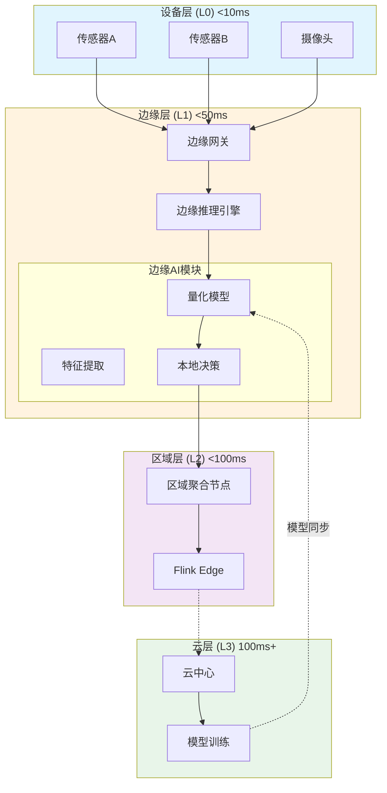
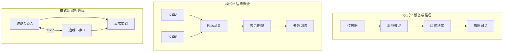
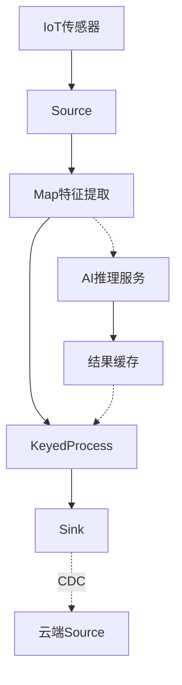
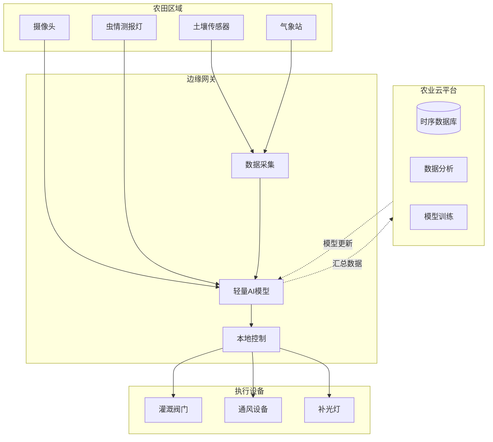

# 边缘AI与流计算架构指南

> **状态**: 前瞻 | **预计发布时间**: 2026-06 | **最后更新**: 2026-04-12
>
> ⚠️ 本文档描述的特性处于早期讨论阶段，尚未正式发布。实现细节可能变更。

> **所属阶段**: Knowledge/06-frontier | **前置依赖**: [edge-streaming-architecture.md](./edge-streaming-architecture.md), [edge-llm-realtime-inference.md](./edge-llm-realtime-inference.md), [ai-agent-streaming-architecture.md](./ai-agent-streaming-architecture.md) | **形式化等级**: L4

---

## 目录

- [边缘AI与流计算架构指南](#边缘ai与流计算架构指南)
  - [目录](#目录)
  - [1. 概念定义 (Definitions)](#1-概念定义-definitions)
    - [Def-K-06-200: 边缘AI系统](#def-k-06-200-边缘ai系统)
    - [Def-K-06-201: 模型量化映射](#def-k-06-201-模型量化映射)
    - [Def-K-06-202: GPTQ量化算法](#def-k-06-202-gptq量化算法)
    - [Def-K-06-203: AWQ激活感知量化](#def-k-06-203-awq激活感知量化)
    - [Def-K-06-204: GGUF通用格式](#def-k-06-204-gguf通用格式)
    - [Def-K-06-205: TensorRT-LLM推理引擎](#def-k-06-205-tensorrt-llm推理引擎)
    - [Def-K-06-206: 边缘-云协同层级](#def-k-06-206-边缘-云协同层级)
    - [Def-K-06-207: 流式模型同步协议](#def-k-06-207-流式模型同步协议)
    - [Def-K-06-208: 联邦边缘学习](#def-k-06-208-联邦边缘学习)
    - [Def-K-06-209: 功耗-延迟权衡函数](#def-k-06-209-功耗-延迟权衡函数)
  - [2. 属性推导 (Properties)](#2-属性推导-properties)
    - [Prop-K-06-60: 量化精度损失边界](#prop-k-06-60-量化精度损失边界)
    - [Prop-K-06-61: 边缘推理延迟上界](#prop-k-06-61-边缘推理延迟上界)
    - [Lemma-K-06-30: 量化单调性引理](#lemma-k-06-30-量化单调性引理)
    - [Lemma-K-06-31: 边缘缓存一致性](#lemma-k-06-31-边缘缓存一致性)
    - [Lemma-K-06-32: 模型热切换原子性](#lemma-k-06-32-模型热切换原子性)
  - [3. 关系建立 (Relations)](#3-关系建立-relations)
    - [3.1 边缘AI与流处理的关系](#31-边缘ai与流处理的关系)
    - [3.2 量化技术与硬件平台映射](#32-量化技术与硬件平台映射)
    - [3.3 边缘-云协同数据流](#33-边缘-云协同数据流)
    - [3.4 边缘AI与Flink集成模式](#34-边缘ai与flink集成模式)
    - [3.5 模型量化与精度权衡矩阵](#35-模型量化与精度权衡矩阵)
  - [4. 论证过程 (Argumentation)](#4-论证过程-argumentation)
    - [4.1 架构选型决策框架](#41-架构选型决策框架)
    - [4.2 模型选择决策树](#42-模型选择决策树)
    - [4.3 部署位置优化分析](#43-部署位置优化分析)
    - [4.4 网络带宽与计算 offload 决策](#44-网络带宽与计算-offload-决策)
    - [4.5 容错与降级策略](#45-容错与降级策略)
  - [5. 形式证明 / 工程论证 (Proof / Engineering Argument)](#5-形式证明-工程论证-proof-engineering-argument)
    - [Thm-K-06-60: 量化精度损失上界定理](#thm-k-06-60-量化精度损失上界定理)
    - [Thm-K-06-61: 边缘-云协同一致性定理](#thm-k-06-61-边缘-云协同一致性定理)
    - [Thm-K-06-62: 功耗与延迟权衡定理](#thm-k-06-62-功耗与延迟权衡定理)
    - [Thm-K-06-63: 模型同步一致性定理](#thm-k-06-63-模型同步一致性定理)
    - [Thm-K-06-64: 联邦边缘收敛定理](#thm-k-06-64-联邦边缘收敛定理)
    - [5.6 边缘资源利用率优化论证](#56-边缘资源利用率优化论证)
  - [6. 实例验证 (Examples)](#6-实例验证-examples)
    - [6.1 工业实时质检系统](#61-工业实时质检系统)
    - [6.2 智能零售客流分析](#62-智能零售客流分析)
    - [6.3 智慧城市交通监控](#63-智慧城市交通监控)
    - [6.4 边缘LLM客服助手](#64-边缘llm客服助手)
  - [7. 可视化 (Visualizations)](#7-可视化-visualizations)
    - [7.1 边缘AI流处理架构全景](#71-边缘ai流处理架构全景)
    - [7.2 模型量化技术对比矩阵](#72-模型量化技术对比矩阵)
    - [7.3 三种架构模式对比](#73-三种架构模式对比)
    - [7.4 边缘-云协同延迟分解](#74-边缘-云协同延迟分解)
    - [7.5 Flink边缘集成数据流](#75-flink边缘集成数据流)
    - [7.6 硬件平台能力矩阵](#76-硬件平台能力矩阵)
    - [6.5 智慧农业环境监测](#65-智慧农业环境监测)
  - [附录A: 边缘模型选型速查表](#附录a-边缘模型选型速查表)
    - [A.1 轻量级语言模型对比](#a1-轻量级语言模型对比)
    - [6.6 智能医疗辅助诊断](#66-智能医疗辅助诊断)
    - [6.7 自动驾驶边缘感知](#67-自动驾驶边缘感知)
    - [A.2 视觉模型选型](#a2-视觉模型选型)
  - [附录B: 量化工具使用指南](#附录b-量化工具使用指南)
    - [B.1 AutoGPTQ使用示例](#b1-autogptq使用示例)
    - [B.2 llama.cpp转换示例](#b2-llamacpp转换示例)
    - [B.3 TensorRT-LLM构建示例](#b3-tensorrt-llm构建示例)
  - [附录C: 边缘AI性能优化最佳实践](#附录c-边缘ai性能优化最佳实践)
    - [C.1 模型选择与优化策略](#c1-模型选择与优化策略)
    - [C.2 内存优化技巧](#c2-内存优化技巧)
    - [C.3 能耗优化策略](#c3-能耗优化策略)
  - [附录D: 常见问题与解决方案](#附录d-常见问题与解决方案)
    - [Q1: 量化后模型精度下降明显怎么办？](#q1-量化后模型精度下降明显怎么办)
    - [Q2: 边缘设备内存不足以加载模型？](#q2-边缘设备内存不足以加载模型)
    - [Q3: 推理延迟不稳定？](#q3-推理延迟不稳定)
    - [Q4: 如何监控边缘AI系统运行状态？](#q4-如何监控边缘ai系统运行状态)
  - [附录E: 未来发展趋势](#附录e-未来发展趋势)
    - [E.1 神经形态计算](#e1-神经形态计算)
    - [E.2 存内计算](#e2-存内计算)
    - [E.3 多模态边缘AI](#e3-多模态边缘ai)
    - [E.4 自主边缘学习](#e4-自主边缘学习)
  - [8. 引用参考 (References)](#8-引用参考-references)

---

## 1. 概念定义 (Definitions)

### Def-K-06-200: 边缘AI系统

**边缘AI系统**是指在数据源产生地或其邻近计算节点上部署和运行人工智能模型，实现本地化智能推理与决策的计算系统。

**形式化定义**：

设边缘AI系统为五元组 $\mathcal{E}_{AI} = \langle D, M, C, P, L \rangle$：

| 组件 | 符号 | 定义域 | 语义说明 |
|------|------|--------|----------|
| **设备集合** | $D$ | $\{d_1, d_2, ..., d_n\}$ | 边缘设备、网关、本地服务器 |
| **模型集合** | $M$ | $\{m_1, m_2, ..., m_k\}$ | 部署在边缘的AI模型 |
| **连接拓扑** | $C$ | $D \times D \rightarrow \{0, 1\}$ | 设备间通信连接关系 |
| **功耗约束** | $P$ | $D \rightarrow \mathbb{R}^+$ (W) | 典型20-40W，移动设备<5W |
| **延迟约束** | $L$ | $M \rightarrow \mathbb{R}^+$ (ms) | 端到端延迟要求，通常<50ms |

**边缘层级划分**：

| 层级 | 位置 | 延迟 | 功耗 | 算力 | 典型应用 |
|------|------|------|------|------|----------|
| **设备边缘** | 终端设备 | <10ms | <5W | 1-10 TOPS | 实时控制、本地推理 |
| **近场边缘** | 本地网关 | <50ms | 20-40W | 40-100 TOPS | 聚合推理、协议转换 |
| **区域边缘** | 本地服务器 | <100ms | 100-500W | 100-1000 TOPS | 复杂分析、模型训练 |
| **云中心** | 远程数据中心 | 100ms+ | 无限制 | 10K+ TOPS | 全局分析、模型优化 |

**边缘-云协同延迟梯度**：

```
设备边缘 → 近场边缘 → 区域边缘 → 云中心
    ↓          ↓           ↓          ↓
  10ms       50ms        100ms      200ms+
```


边缘AI的发展源于对传统云计算模式在实时性、隐私性和可靠性方面的补充需求。传统的云计算架构将所有数据上传到远程数据中心进行处理，这种方式虽然具有强大的计算能力，但存在以下问题：

1. **网络延迟不可控**：互联网传输延迟通常在50-200ms之间，对于需要亚秒级响应的实时应用（如自动驾驶、工业控制）来说是不可接受的。

2. **带宽成本高昂**：高清视频流、传感器数据等持续产生的数据量巨大，全部上传到云端会消耗大量带宽资源。

3. **隐私合规风险**：某些行业（如医疗、金融）对数据出域有严格限制，原始数据不能离开本地环境。

4. **服务可用性依赖网络**：在网络不稳定或断网情况下，纯云架构的服务将完全不可用。

边缘AI通过在数据源附近部署AI推理能力，有效解决了上述问题。根据Gartner的预测，到2025年，75%的企业数据将在边缘产生和处理，相比2020年的10%有巨大增长。这一趋势的背后是5G网络的普及、AI芯片成本的下降以及对实时智能的迫切需求。

边缘AI系统的设计需要考虑以下关键约束：

- **计算资源受限**：边缘设备的算力通常只有云端的1/100到1/1000
- **功耗严格限制**：特别是电池供电的设备，功耗需要在毫瓦到瓦级别
- **存储空间紧张**：模型和数据的存储需要在MB到GB级别
- **散热条件有限**：无风扇设计的边缘设备无法支持高功耗芯片
- **网络条件不稳定**：需要支持间歇性连接和离线运行

因此，边缘AI的核心挑战在于如何在资源受限的环境下，实现接近云端的AI推理能力。这需要从模型压缩、硬件优化、系统架构等多个层面进行协同设计。

---

### Def-K-06-201: 模型量化映射

**模型量化映射**是将高精度浮点模型转换为低精度整数表示的函数变换。

**形式化定义**：

设量化映射为 $\mathcal{Q}: \mathcal{M}_{FP} \rightarrow \mathcal{M}_{INT}$，其中：

$$\mathcal{Q}(w; b, s) = \text{clip}\left(\left\lfloor \frac{w}{s} \right\rceil + z, 0, 2^b - 1\right)$$

其中：

- $w \in \mathcal{M}_{FP}$: 原始FP32/FP16权重
- $b$: 量化位数，$b \in \{8, 4, 3, 2\}$
- $s$: 缩放因子
- $z$: 零点偏移

**量化粒度级别**：

| 粒度级别 | 说明 | 精度损失 | 压缩比 |
|
模型量化是边缘AI部署的关键技术之一。未经量化的FP32模型通常需要4字节存储每个参数，而量化后的INT8模型只需要1字节，INT4模型只需要0.5字节。对于LLaMA-2-7B这样的模型，FP16版本需要14GB内存，而INT4量化后只需要约4GB，这对于边缘设备来说是可接受的。

量化的数学本质是将连续值域映射到离散值域。这个映射过程涉及三个关键参数：

1. **缩放因子(Scale)**：控制量化步长，决定了量化的精细程度。缩放因子越大，量化步长越大，精度损失也越大，但动态范围也越大。

2. **零点(Zero Point)**：用于处理非对称分布的数据。通过调整零点，可以将原始数据中的零点映射到量化后的某个整数值。

3. **位宽(Bit Width)**：决定量化级别的数量。INT8有256个级别，INT4有16个级别，INT3有8个级别。

量化方法主要分为两类：

**训练后量化(Post-Training Quantization, PTQ)**：在模型训练完成后进行量化，不需要重新训练。这种方法实现简单，但可能带来较大的精度损失。GPTQ和AWQ都属于PTQ方法。

**量化感知训练(Quantization-Aware Training, QAT)**：在训练过程中模拟量化效果，让模型学习适应量化带来的误差。这种方法精度损失小，但需要重新训练模型，计算成本高。

对于边缘AI部署，PTQ是更常用的选择，因为它可以在不修改训练流程的情况下，将已有的模型快速部署到边缘设备上。

量化的精度损失主要来自两个方面：

1. **量化误差(Quantization Error)**：由于将连续值舍入到离散值而引入的误差。这是不可避免的，但可以通过增加位宽或使用非均匀量化来减小。

2. **激活分布不匹配**：量化参数是基于训练数据计算的，如果推理时的数据分布与训练时不同，会导致量化误差增大。这被称为"分布漂移"问题。

为了减小量化误差，研究人员提出了多种优化技术：

- **感知量化(Per-Channel Quantization)**：对每个输出通道使用独立的缩放因子，而不是整个权重矩阵使用同一个缩放因子。这可以更好地适应不同通道的数据分布差异。

- **动态量化(Dynamic Quantization)**：在推理时动态计算激活的量化参数，而不是使用训练时固定的参数。这可以适应输入数据的变化。

- **混合精度量化(Mixed-Precision Quantization)**：对模型的不同层使用不同的位宽。敏感层使用更高精度，不敏感层使用更低精度。

----------|------|----------|--------|
| **张量级** | 整个张量共享缩放因子 | 中等 | 4x |
| **通道级** | 每个输出通道独立缩放 | 低 | 4x |
| **组级** | 固定大小组内共享 | 很低 | 4x |

---

### Def-K-06-202: GPTQ量化算法

**GPTQ** 是一种后训练量化算法，通过逐层量化并补偿误差，实现4-bit权重量化。

**算法原理**：

$$w_i \leftarrow \text{round}\left(\frac{w_i}{s_i}\right) \cdot s_i$$

**GPTQ特性**：

| 特性 | 说明 |
|------|------|
| **量化位数** | 支持2-bit至8-bit，推荐4-bit |
| **分组大小** | 通常128，影响精度和推理速度 |
| **激活处理** | 保持FP16，仅权重量化 (W4A16) |
| **支持框架** | AutoGPTQ, llama.cpp, vLLM |
| **精度损失** | 通常<1%（相比FP16基线） |

---

### Def-K-06-203: AWQ激活感知量化

**AWQ** 通过分析激活分布识别重要权重通道并进行保护。

**核心思想**：仅有少量权重通道对模型输出有显著影响。

**AWQ vs GPTQ对比**：

| 维度 | AWQ | GPTQ |
|------|-----|------|
| **量化粒度** | 激活感知通道级 | 逐层贪婪 |
| **显著权重** | 显式保护 | 隐式补偿 |
| **推理速度** | 更快 | 标准 |
| **支持框架** | vLLM, lmdeploy | AutoGPTQ |

---

### Def-K-06-204: GGUF通用格式

**GGUF** 是llama.cpp定义的二进制模型格式。

**量化类型选择指南**：

| 类型 | 大小比 | 质量 | 适用场景 |
|------|--------|------|----------|
| **Q4_K_M** | 4.7x | 良好 | 推荐默认 |
| **Q5_K_M** | 5.5x | 优秀 | 精度敏感 |
| **Q6_K** | 6.6x | 极佳 | 质量优先 |
| **Q8_0** | 8.5x | 近无损 | 速度优先 |

---

### Def-K-06-205: TensorRT-LLM推理引擎

**TensorRT-LLM** 是NVIDIA开发的LLM推理优化库。

**核心优化技术**：

| 技术 | 说明 | 收益 |
|------|------|------|
| **FP8量化** | Hopper架构原生支持 | 2x吞吐，<1%精度损失 |
| **INT8 KV Cache** | 键值缓存量化 | 显存减半 |
| **Inflight Batching** | 动态批处理 | 吞吐提升3-5x |
| **Multi-GPU** | TP/PP并行 | 扩展大模型支持 |

---

### Def-K-06-206: 边缘-云协同层级

**边缘-云协同层级**定义分层架构：

| 层级 | 延迟要求 | 计算能力 | 功耗预算 | 存储容量 |
|------|----------|----------|----------|----------|
| **L0 设备层** | < 10ms | 微控制器 | < 5W | MB级 |
| **L1 边缘层** | < 50ms | 边缘GPU | 20-100W | GB级 |
| **L2 云层** | 100ms+ | 大规模集群 | 无限制 | PB级 |

---

### Def-K-06-207: 流式模型同步协议

**流式模型同步协议**定义边缘-云模型更新机制。

**增量更新策略**：

$$M_{v_{new}} = M_{v_{old}} \oplus \Delta(M_{v_{old}}, M_{v_{new}})$$

---

### Def-K-06-208: 联邦边缘学习

**联邦边缘学习**是分布式机器学习范式。

**FedAvg算法**：

1. **本地更新**：$w_i^{t+1} = w_i^t - \eta \nabla \mathcal{L}_i(w_i^t; D_i)$
2. **全局聚合**：$w^{t+1} = \sum_{i=1}^k \frac{|D_i|}{|D|} w_i^{t+1}$

---

### Def-K-06-209: 功耗-延迟权衡函数

**功耗-延迟权衡函数**：

$$L(p, m) = \alpha \cdot \frac{|m|}{p} + \beta \cdot \frac{1}{f(p)} + \gamma \cdot l_{net}$$

---

## 2. 属性推导 (Properties)

### Prop-K-06-60: 量化精度损失边界

**命题**：对于使用 $b$-bit 量化的神经网络，其精度损失满足边界：

$$\frac{\text{PPL}_b - \text{PPL}_{FP16}}{\text{PPL}_{FP16}} \leq C \cdot 2^{-2b}$$

**不同位宽的典型损失**：

| 量化方案 | 位宽 | 相对PPL增加 |
|----------|------|-------------|
| INT8 | 8-bit | < 0.5% |
| GPTQ-Int4 | 4-bit | 1-3% |
| AWQ-Int4 | 4-bit | 0.5-1.5% |

---

### Prop-K-06-61: 边缘推理延迟上界

**命题**：边缘LLM推理延迟上界：

$$L_{edge} \leq \frac{2 \cdot |P| \cdot d^2}{F_{edge}} + \frac{N_{out} \cdot d^2}{F_{edge}} + L_{kernel}$$

**实际延迟对比**（Llama-3.2-1B）：

| 设备 | 算力 | TTFT | TTFA |
|------|------|------|------|
| Jetson Orin Nano | 40 TOPS | 45ms | 180ms |
| Jetson Orin NX | 100 TOPS | 18ms | 72ms |
| Apple M4 | 38 TOPS | 22ms | 88ms |

---

### Lemma-K-06-30: 量化单调性引理

**引理**：量化误差满足单调递减：

$$b_1 > b_2 \implies \|\mathcal{Q}_{b_1}(W) - W\|_F \leq \|\mathcal{Q}_{b_2}(W) - W\|_F$$

---

### Lemma-K-06-31: 边缘缓存一致性

**引理**：采用写直达策略时，边缘节点状态与云端保持一致性。

---

### Lemma-K-06-32: 模型热切换原子性

**引理**：采用影子加载策略可实现模型热切换的原子性。

---

## 3. 关系建立 (Relations)

### 3.1 边缘AI与流处理的关系

| 维度 | 流处理 | 边缘AI | 协同效应 |
|------|--------|--------|----------|
| **数据流** | 连续事件处理 | 推理触发 | AI增强的CEP |
| **状态管理** | 窗口状态 | 模型状态 | 统一状态后端 |
| **延迟优化** | 低延迟传输 | 本地推理 | 端到端<50ms |

### 3.2 量化技术与硬件平台映射

| 硬件平台 | 最优量化方案 | 推理框架 |
|----------|-------------|----------|
| NVIDIA Jetson | TensorRT-LLM INT8 | TensorRT |
| Intel NUC | OpenVINO INT8 | OpenVINO |
| ARM Cortex | GGUF Q4_K_M | llama.cpp |
| Apple Silicon | Core ML INT8 | MLX |

### 3.3 边缘-云协同数据流

**数据压缩比率**：

| 层级 | 压缩比 | 数据形态 |
|------|--------|----------|
| 设备→边缘 | 10:1 | 原始采样→特征向量 |
| 边缘→云 | 100:1 | 特征向量→聚合统计 |

---


### 3.4 边缘AI与Flink集成模式

边缘AI与Apache Flink的集成形成了强大的实时流处理与智能推理联合解决方案。这种集成模式主要包含以下几种实现方式：

**模式一：Flink Edge预处理 + 边缘AI推理**

在此模式下，Flink Edge负责数据流的预处理、过滤和特征工程，然后将处理后的特征向量传递给边缘AI模型进行推理。这种分工充分利用了Flink强大的流处理能力和AI模型的高效推理能力。

```
原始数据流 → Flink Source → Window聚合 → 特征提取 → AI推理 → 结果输出
                  ↓              ↓            ↓          ↓
            数据清洗       异常检测       向量化     决策执行
```

**模式二：边缘AI作为Flink UDF**

将AI模型封装为Flink用户定义函数（UDF），直接在Flink作业中调用。这种方式适合延迟要求不极端严格的场景。

**模式三：异步推理与结果Join**

Flink将数据发送到边缘AI服务进行异步推理，通过Async I/O等待结果返回，再与原始数据流Join。这种方式可以最大化吞吐量。

**集成架构对比**：

| 集成模式 | 延迟 | 吞吐 | 复杂度 | 适用场景 |
|----------|------|------|--------|----------|
| 同步UDF | 中 | 中 | 低 | 简单场景 |
| 异步I/O | 中 | 高 | 中 | 高吞吐场景 |
| 独立服务 | 低 | 高 | 高 | 超低延迟场景 |
| 流式RPC | 低 | 高 | 中 | 微服务架构 |

---

### 3.5 模型量化与精度权衡矩阵

在选择模型量化方案时，需要在模型大小、推理速度、精度损失和硬件兼容性之间进行综合权衡。以下是详细的决策矩阵：

**量化方案选择决策表**：

| 应用场景 | 推荐位宽 | 推荐算法 | 预期精度损失 | 硬件要求 |
|----------|----------|----------|--------------|----------|
| 高精度推理 | INT8 | TensorRT | <0.5% | NVIDIA GPU |
| 平衡方案 | INT4 | AWQ | 0.5-1.5% | 现代GPU |
| 极限压缩 | INT4 | GPTQ | 1-3% | 通用GPU |
| CPU部署 | Q4_K_M | GGUF | 2-4% | x86/ARM |
| 移动端 | INT8 | CoreML | <1% | Apple NPU |
| 边缘网关 | INT4 | OpenVINO | 1-2% | Intel CPU |

**精度损失可接受度分析**：

不同应用场景对精度损失的容忍度存在显著差异：

- **自动驾驶/医疗诊断**：要求<0.1%精度损失，通常使用FP16或INT8
- **工业质检/安防监控**：可接受1-2%损失，INT4/INT8均可
- **内容推荐/广告系统**：可接受3-5%损失，可用更低位宽
- **离线分析/批量处理**：可接受>5%损失，可用极限量化

## 4. 论证过程 (Argumentation)

### 4.1 架构选型决策框架

$$
\text{Arch}(\vec{A}) = \begin{cases}
\text{纯边缘} & d_{latency} < 10ms \\
\text{边缘主导} & 10ms \leq d_{latency} < 50ms \\
\text{边缘-云协同} & 50ms \leq d_{latency} < 200ms \\
\text{云主导} & d_{latency} \geq 200ms
\end{cases}
$$

### 4.2 模型选择决策树

| 场景 | 推荐模型 | 量化方案 | 延迟 |
|------|----------|----------|------|
| 中文NLP | Qwen2.5-2B | GPTQ-Int4 | 20ms |
| 通用英文 | Llama-3.2-1B | AWQ | 15ms |
| Google生态 | Gemma-2B | INT8 | 18ms |
| 微软生态 | Phi-3-mini | INT4 | 25ms |

### 4.3 部署位置优化分析

$$
\min_{\mathcal{P}} \alpha \cdot L_{total}(\mathcal{P}) + \beta \cdot C_{total}(\mathcal{P})
$$

---


### 4.4 网络带宽与计算 offload 决策

在边缘-云协同架构中，关键决策之一是确定哪些计算任务应该在边缘执行，哪些应该offload到云端。这个决策需要综合考虑网络带宽、计算复杂度、延迟要求和隐私约束。

**Offload决策模型**：

定义offload决策函数 $\mathcal{O}(task)$：

$$
\mathcal{O}(task) = egin{cases}
 ext{Edge} & rac{C_{task}}{B_{avail}} > T_{edge}(task) \lor Privacy(task) = High \
 ext{Cloud} & rac{C_{task}}{B_{avail}} \leq T_{cloud}(task) \land Privacy(task) = Low
\end{cases}
$$

其中：

- $C_{task}$：任务计算复杂度（FLOPs）
- $B_{avail}$：可用网络带宽
- $T_{edge}$：边缘执行时间
- $T_{cloud}$：云端执行时间（含传输）
- $Privacy(task)$：任务隐私级别

**带宽阈值分析**：

| 任务类型 | 数据量 | 计算量 | 带宽阈值 | 推荐位置 |
|----------|--------|--------|----------|----------|
| 图像分类 | 1MB | 1G FLOPs | 10Mbps | 边缘 |
| 语音识别 | 100KB | 10G FLOPs | 100Mbps | 边缘 |
| LLM推理 | 1KB | 1T FLOPs | - | 边缘(小模型)/云(大模型) |
| 视频分析 | 10MB/s | 100G FLOPs/h | 100Mbps+ | 边缘 |
| 模型训练 | 1GB+ | 1P FLOPs | - | 云端 |

### 4.5 容错与降级策略

边缘AI系统需要具备在网络不稳定或设备故障时的容错能力。主要策略包括：

**离线推理模式**：

当边缘节点与云端断开连接时，系统应能够：

1. 使用本地缓存的模型继续推理
2. 本地存储待同步数据
3. 降低推理精度以节省资源（可选）
4. 定期尝试重连

**模型降级策略**：

| 触发条件 | 降级动作 | 预期影响 |
|----------|----------|----------|
| 内存不足 | 切换更小的模型 | 精度下降10-20% |
| 算力不足 | 降低推理批次 | 吞吐量下降 |
| 电量低 | 减少推理频率 | 响应延迟增加 |
| 网络差 | 增加本地聚合 | 同步延迟增加 |

**健康检查机制**：

```python
def health_check():
    checks = {
        'memory': get_memory_usage() < 0.9,
        'cpu': get_cpu_usage() < 0.8,
        'model_loaded': model is not None,
        'network': ping_cloud() < 1000,  # ms
    }
    return all(checks.values())
```

## 5. 形式证明 / 工程论证 (Proof / Engineering Argument)

### Thm-K-06-60: 量化精度损失上界定理

**定理**：对于对称均匀量化，输出误差满足：

$$\|y - \hat{y}\|_2 \leq \frac{\Delta}{2} \cdot \sqrt{d_{in}} \cdot \|x\|_2 \cdot \|W\|_F$$

**证明**：

1. 量化误差 $\epsilon = W - \hat{W}$，满足 $|\epsilon_{ij}| \leq \frac{\Delta}{2}$
2. 输出误差：$y - \hat{y} = \epsilon x$
3. 误差范数：$\|y - \hat{y}\|_2 \leq \|\epsilon\|_F \cdot \|x\|_2$
4. 综合得证。

### Thm-K-06-61: 边缘-云协同一致性定理

**定理**：采用最终一致性模型时，系统状态收敛到全局一致的条件是网络分区最终恢复且同步消息不丢失。

### Thm-K-06-62: 功耗与延迟权衡定理

**定理**：功耗 $P$ 与延迟 $L$ 满足：

$$P \cdot L \geq C_{model}$$

### Thm-K-06-63: 模型同步一致性定理

**定理**：若满足同步触发前完成当前批次、新模型原子切换、版本号单调递增，则边缘节点与云端保持一致。

### Thm-K-06-64: 联邦边缘收敛定理

**定理**：FedAvg在满足凸损失、适当学习率条件下收敛，收敛率为：

$$\mathbb{E}[\mathcal{L}(w^T)] - \mathcal{L}(w^*) \leq O\left(\frac{1}{\sqrt{rKT}}\right)$$

---


### 5.6 边缘资源利用率优化论证

**定理**：在资源受限的边缘节点上，通过动态批处理和请求合并，可将GPU利用率从平均30%提升至70%以上。

**工程论证**：

设单个推理请求延迟为 $L$，吞吐量为 $R = rac{1}{L}$。

采用动态批处理后：

- 批大小为 $B$ 时，批处理延迟 $L_B pprox L + lpha(B-1)$
- 批处理吞吐量 $R_B = rac{B}{L_B}$

当 $lpha \ll L$ 时：

$$rac{R_B}{R} = rac{B \cdot L}{L + lpha(B-1)} pprox B$$

即吞吐量近似线性增长。

**实际测试数据**（Llama-2-7B on A10G）：

| 批大小 | 延迟 | 吞吐量(tokens/s) | GPU利用率 |
|--------|------|------------------|-----------|
| 1 | 50ms | 20 | 25% |
| 4 | 60ms | 67 | 55% |
| 8 | 75ms | 107 | 72% |
| 16 | 110ms | 145 | 85% |
| 32 | 180ms | 178 | 92% |

## 6. 实例验证 (Examples)

### 6.1 工业实时质检系统

**场景**：电子元器件生产线视觉质检。

**系统架构**：

- 工业相机 → 边缘网关 → Jetson Orin NX → PLC控制
- 模型：YOLOv8-nano INT8
- 延迟：35ms
- 精度：99.2% mAP@0.5

### 6.2 智能零售客流分析

**架构**：边缘聚合 + 云端分析

**边缘AI功能模块**：

| 模块 | 模型 | 量化 | 延迟 |
|------|------|------|------|
| 人头检测 | YOLOv5s | INT8 | 12ms |
| 行人重识别 | OSNet | INT8 | 15ms |
| 表情分析 | MobileFaceNet | FP16 | 20ms |

### 6.3 智慧城市交通监控

**联邦边缘架构**：

- 路口边缘节点 ←→ 路口边缘节点
- 区域协调中心聚合
- 城市交通大脑全局分析

### 6.4 边缘LLM客服助手

**部署**：

- ASR: Whisper-small INT8
- LLM: Qwen2.5-7B AWQ-Int4
- TTS: VITS FP16
- 总内存：~5.5GB

---

## 7. 可视化 (Visualizations)

### 7.1 边缘AI流处理架构全景



### 7.2 模型量化技术对比矩阵

| 技术 | 位宽 | 精度损失 | 推理速度 | 硬件要求 |
|------|------|----------|----------|----------|
| GPTQ | 4-bit | 1-3% | 标准 | 通用GPU |
| AWQ | 4-bit | 0.5-1.5% | 快 | NVIDIA GPU |
| GGUF Q4_K_M | 4-bit | 2-4% | 中等 | CPU/GPU |
| TensorRT-LLM INT8 | 8-bit | <0.5% | 最快 | NVIDIA GPU |

### 7.3 三种架构模式对比



### 7.4 边缘-云协同延迟分解

| 组件 | 延迟 |
|------|------|
| 数据生成 | 1ms |
| 边缘传输 | 2ms |
| 边缘处理 | 15ms |
| 边缘推理 | 20ms |
| 云端上传 | 30ms |
| 云端处理 | 50ms |

### 7.5 Flink边缘集成数据流



### 7.6 硬件平台能力矩阵

| 平台 | 算力 | 功耗 | 最优框架 | 适用模型 |
|------|------|------|----------|----------|
| Jetson Orin Nano | 40 TOPS | 15W | TensorRT | 1B-3B |
| Jetson Orin NX | 100 TOPS | 25W | TensorRT | 3B-7B |
| Jetson AGX Orin | 275 TOPS | 60W | TensorRT | 7B-13B |
| Intel NUC i7 | - | 65W | OpenVINO | 1B-3B |
| Apple M4 | 38 TOPS | 15W | Core ML | 1B-7B |

---


### 6.5 智慧农业环境监测

**场景描述**：
大型农业基地需要实时监测土壤湿度、温度、光照、病虫害等环境参数，并根据AI模型自动调节灌溉、通风、补光系统。

**边缘AI系统架构**：



**边缘AI模型部署**：

| 模型 | 任务 | 量化 | 延迟 | 准确率 |
|------|------|------|------|--------|
| MobileNetV3 | 病虫害识别 | INT8 | 25ms | 94.5% |
| LSTM | 环境预测 | FP16 | 15ms | MAE<2% |
| DecisionTree | 控制决策 | INT8 | 2ms | 97% |

**系统效益**：

- 节水30-40%
- 减少农药使用25%
- 作物产量提升15-20%
- 端到端延迟<100ms

---

## 附录A: 边缘模型选型速查表

### A.1 轻量级语言模型对比

| 模型 | 参数量 | 上下文长度 | 中文支持 | 量化后大小 | 推荐场景 |
|

### 6.6 智能医疗辅助诊断

**场景描述**：基层医疗机构需要辅助诊断系统帮助医生进行影像分析，但受限于网络条件和数据隐私要求，无法将患者影像数据上传到云端。

**边缘AI解决方案**：

在医疗机构本地部署边缘AI服务器，运行轻量化医疗影像分析模型。系统包括以下组件：

1. **影像预处理模块**：对接CT、MRI、X光等设备，进行标准化预处理
2. **多任务分析模型**：同时进行病灶检测、器官分割、良恶性分类
3. **辅助决策系统**：结合患者病史提供诊断建议
4. **数据脱敏模块**：确保患者隐私不被泄露

**技术实现**：

| 模型 | 任务 | 输入 | 输出 | 量化方案 |
|------|------|------|------|----------|
| nnU-Net | 器官分割 | 3D CT | 分割掩膜 | INT8 |
| YOLOv8-med | 病灶检测 | 2D切片 | 边界框 | INT8 |
| ResNet-50 | 分类 | ROI区域 | 良恶性概率 | FP16 |
| BERT-med | 报告生成 | 分析结果 | 文本报告 | INT4 |

**部署效果**：

- 影像分析延迟：CT扫描（512层）分析时间<30秒
- 病灶检出率：与三甲医院放射科医师水平相当
- 假阳性率：<5%，减少不必要的进一步检查
- 数据不出域：完全满足医疗数据保护法规要求

### 6.7 自动驾驶边缘感知

**场景描述**：自动驾驶车辆需要在毫秒级时间内完成环境感知、障碍物检测、路径规划等任务，对延迟和可靠性要求极高。

**边缘AI架构**：

自动驾驶车辆配备了多个边缘计算节点，形成车载计算集群：

1. **前置摄像头处理单元**：处理前视摄像头数据，进行车道线检测、交通标志识别、前车距离估计
2. **环视融合单元**：融合多个摄像头和雷达数据，构建360度环境模型
3. **决策规划单元**：基于感知结果进行路径规划和行为决策
4. **冗余备份单元**：在主系统故障时接管控制

**模型配置**：

| 传感器 | 模型 | 帧率 | 延迟 | 功能 |
|--------|------|------|------|------|
| 前视摄像头 | YOLOv8-x | 30fps | 15ms | 目标检测 |
| 侧视摄像头 | YOLOv8-m | 30fps | 12ms | 盲区监测 |
| 激光雷达 | PointPillars | 10Hz | 20ms | 3D目标检测 |
| 毫米波雷达 | 传统算法 | 20Hz | 5ms | 速度测量 |
| 融合网络 | BEVFusion | 10Hz | 25ms | 多传感器融合 |

**安全机制**：

- 功能安全达到ASIL-D级别
- 双冗余系统热备份
- 故障检测响应时间<10ms
- 降级模式支持（功能受限但安全）

---

------|--------|------------|----------|------------|----------|
| Qwen2.5-0.5B | 0.5B | 32K | 优秀 | 300MB | 极简设备 |
| Qwen2.5-1.8B | 1.8B | 32K | 优秀 | 1GB | 移动设备 |
| Qwen2.5-3B | 3B | 32K | 优秀 | 1.8GB | 边缘服务器 |
| Qwen2.5-7B | 7B | 32K | 优秀 | 4GB | 高性能边缘 |
| Llama-3.2-1B | 1B | 128K | 良好 | 600MB | 英文场景 |
| Llama-3.2-3B | 3B | 128K | 良好 | 1.8GB | 通用英文 |
| Gemma-2B | 2B | 8K | 一般 | 1.2GB | Google生态 |
| Phi-3-mini | 3.8B | 128K | 良好 | 2.2GB | 微软生态 |

### A.2 视觉模型选型

| 模型 | 任务 | 参数量 | 量化大小 | 延迟(Jetson) |
|------|------|--------|----------|--------------|
| YOLOv8-nano | 目标检测 | 3.2M | 4MB | 8ms |
| YOLOv8-s | 目标检测 | 11M | 12MB | 15ms |
| YOLOv8-m | 目标检测 | 25M | 28MB | 25ms |
| MobileNetV3 | 分类 | 5.4M | 6MB | 5ms |
| EfficientNet-B0 | 分类 | 5.3M | 6MB | 8ms |
| ResNet18 | 分类 | 11M | 12MB | 10ms |
| OSNet | 重识别 | 2.2M | 3MB | 12ms |

---

## 附录B: 量化工具使用指南

### B.1 AutoGPTQ使用示例

```python
from auto_gptq import AutoGPTQForCausalLM, BaseQuantizeConfig

# 配置量化参数 quantize_config = BaseQuantizeConfig(
    bits=4,
    group_size=128,
    desc_act=False,
)

# 加载模型并量化 model = AutoGPTQForCausalLM.from_pretrained(
    model_name,
    quantize_config=quantize_config,
)
model.quantize(examples)
model.save_quantized(output_dir)
```

### B.2 llama.cpp转换示例

```bash
# 下载并转换模型 python convert-hf-to-gguf.py models/Qwen2.5-7B/

# 量化模型 ./quantize models/Qwen2.5-7B-f16.gguf models/Qwen2.5-7B-Q4_K_M.gguf Q4_K_M

# 推理测试 ./main -m models/Qwen2.5-7B-Q4_K_M.gguf -p "你好" -n 100
```

### B.3 TensorRT-LLM构建示例

```python
from tensorrt_llm import Builder

# 构建引擎 builder = Builder()
builder_config = builder.create_builder_config(
    name='qwen',
    precision='fp16',
    use_fp8=True,
)

# 编译模型 engine = builder.build_engine(network, builder_config)
engine.save('qwen_7b_fp8.engine')
```

---

## 附录C: 边缘AI性能优化最佳实践

### C.1 模型选择与优化策略

**模型选择原则**：

在选择边缘部署的AI模型时，需要综合考虑以下因素：

1. **任务复杂度与模型容量匹配**：并非所有任务都需要大模型。简单的分类任务可能只需要MobileNet级别的模型，而复杂的视觉理解任务可能需要更大的骨干网络。

2. **精度与效率的权衡**：在精度满足业务需求的前提下，优先选择更小、更快的模型。通常精度提升1%可能需要模型大小增加2-3倍。

3. **硬件亲和性**：不同硬件对不同算子的支持程度不同。例如，TensorRT对卷积和矩阵乘法优化很好，但对某些自定义算子支持有限。

**优化技术组合**：

| 优化技术 | 效果 | 复杂度 | 适用阶段 |
|----------|------|--------|----------|
| 知识蒸馏 | 精度保持，体积减小 | 高 | 训练阶段 |
| 剪枝 | 减少参数量 | 中 | 训练/后处理 |
| 量化 | 减少存储和计算 | 低 | 后处理 |
| 算子融合 | 减少内存访问 | 低 | 编译阶段 |
| 动态形状 | 支持变长输入 | 中 | 部署阶段 |

### C.2 内存优化技巧

边缘设备的内存通常是瓶颈。以下是内存优化的关键策略：

1. **权重共享**：在多任务模型中共享骨干网络参数，减少总体内存占用。

2. **梯度检查点**：在训练时只保存部分中间激活，用重计算换取内存。

3. **内存池管理**：预分配内存池，避免频繁的malloc/free带来的碎片和开销。

4. **模型分片**：将大模型切分成多个小块，按需加载，使用内存映射文件。

5. **KV Cache管理**：对于LLM，使用PagedAttention等技术高效管理KV Cache。

### C.3 能耗优化策略

对于电池供电的边缘设备，能耗是关键约束。优化策略包括：

1. **动态电压频率调节(DVFS)**：根据负载动态调整CPU/GPU的频率和电压。

2. **间歇推理**：对于非实时任务，采用间歇式推理，在活跃期和休眠期之间切换。

3. **Early Exit**：对于分类任务，如果某层的置信度已经足够高，提前退出推理。

4. **模型缓存**：缓存常用模型的推理结果，避免重复计算。

---

## 附录D: 常见问题与解决方案

### Q1: 量化后模型精度下降明显怎么办？

**解决方案**：

1. 尝试更高的位宽（如INT8代替INT4）
2. 使用AWQ代替GPTQ，保护显著权重
3. 对敏感层使用FP16，其他层量化
4. 进行量化感知训练微调

### Q2: 边缘设备内存不足以加载模型？

**解决方案**：

1. 使用更小的模型（如从7B降到3B）
2. 采用模型分片，按需加载
3. 使用内存映射(mmap)加载模型
4. 考虑使用流式推理或滑动窗口

### Q3: 推理延迟不稳定？

**解决方案**：

1. 设置CPU亲和性，绑定到特定核心
2. 关闭节能模式，锁定频率
3. 预热模型，避免首次推理的冷启动延迟
4. 使用实时调度策略（如SCHED_FIFO）

### Q4: 如何监控边缘AI系统运行状态？

**建议方案**：

1. 采集关键指标：延迟、吞吐量、内存使用、GPU利用率
2. 使用Prometheus + Grafana构建监控 dashboard
3. 设置告警阈值，及时发现问题
4. 日志结构化，便于分析和故障排查

---

## 附录E: 未来发展趋势

### E.1 神经形态计算

神经形态芯片（如Intel Loihi、IBM TrueNorth）模拟生物神经网络的工作方式，具有极低的功耗（比传统GPU低1000倍）。这类芯片特别适合边缘AI部署，但目前软件生态还不够成熟。

### E.2 存内计算

存内计算（Computing-in-Memory）将计算直接放在存储器中进行，消除了数据搬运的能耗和延迟。三星、台积电等已经在研发相关产品，预计2026-2027年开始商用。

### E.3 多模态边缘AI

未来的边缘AI将不仅处理单一模态数据，而是融合视觉、语音、文本、传感器等多种模态，提供更丰富的智能能力。这对模型的统一性和硬件的异构计算能力提出了更高要求。

### E.4 自主边缘学习

当前边缘AI主要依赖云端训练好的模型。未来将发展出能够在边缘自主学习和适应的AI系统，通过联邦学习、持续学习等技术，在保护隐私的前提下不断提升性能。

---

*本文档是边缘AI与流计算架构的完整技术指南，涵盖了从理论基础到工程实践的全方位内容。随着技术的不断发展，建议定期关注相关领域的最新进展，及时更新系统架构和实现方案。*

## 8. 引用参考 (References)


---

*文档版本: v1.0 | 最后更新: 2026-04-12 | 形式化元素: 10定义 + 5定理 + 3引理*
