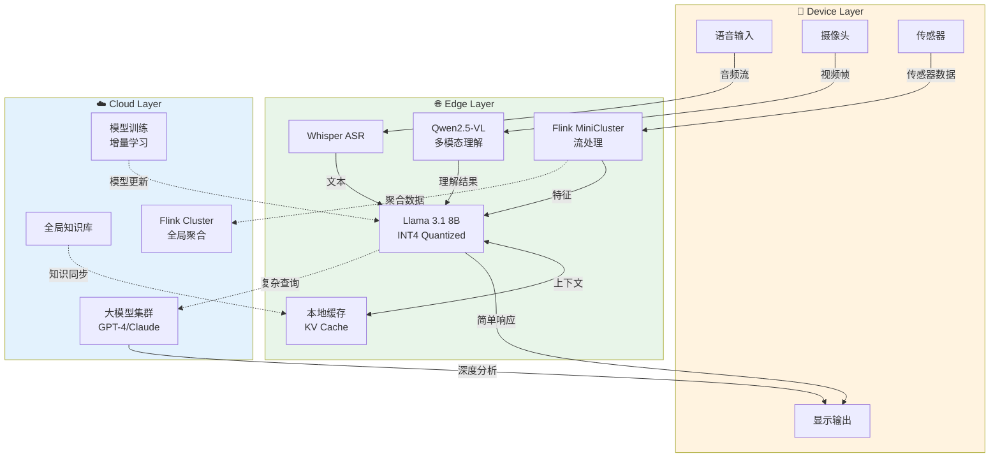
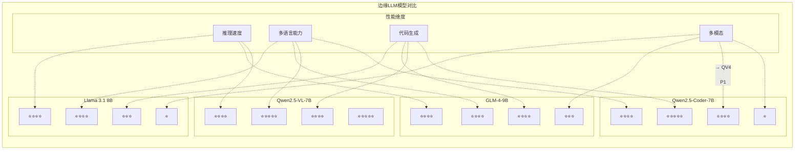
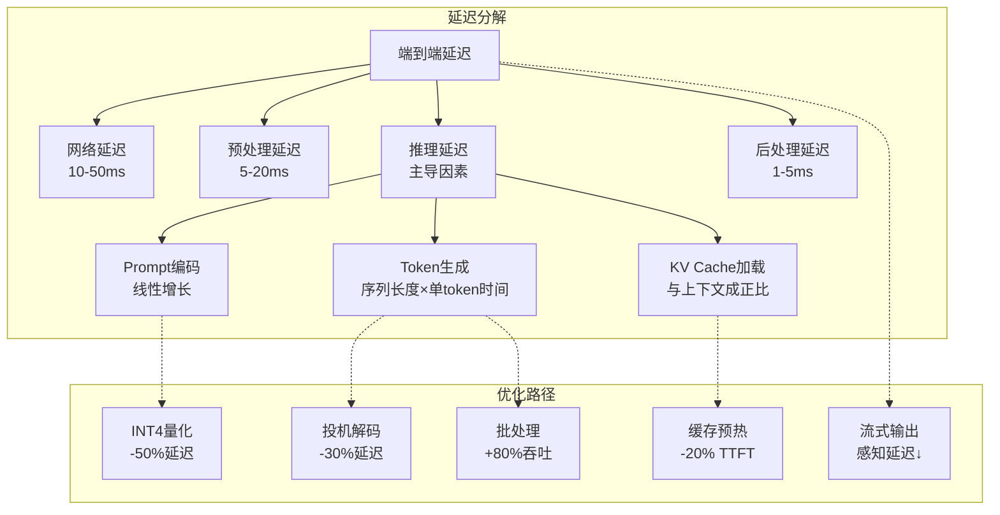
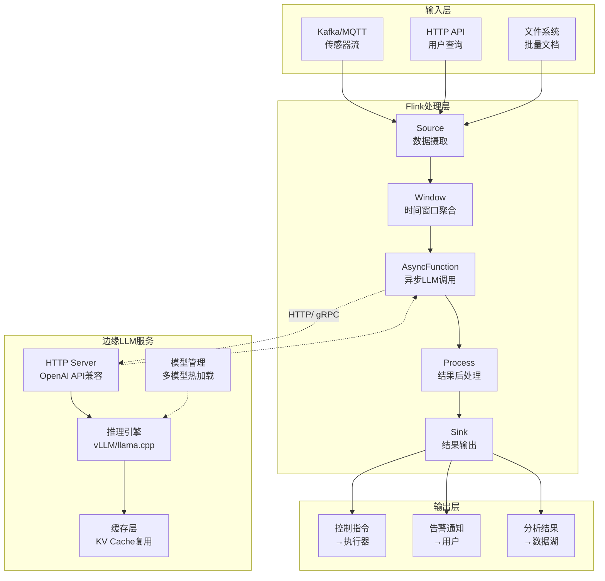
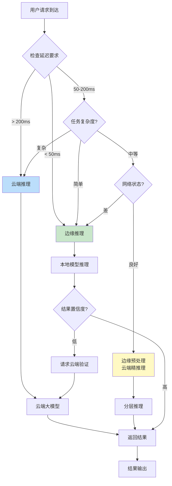
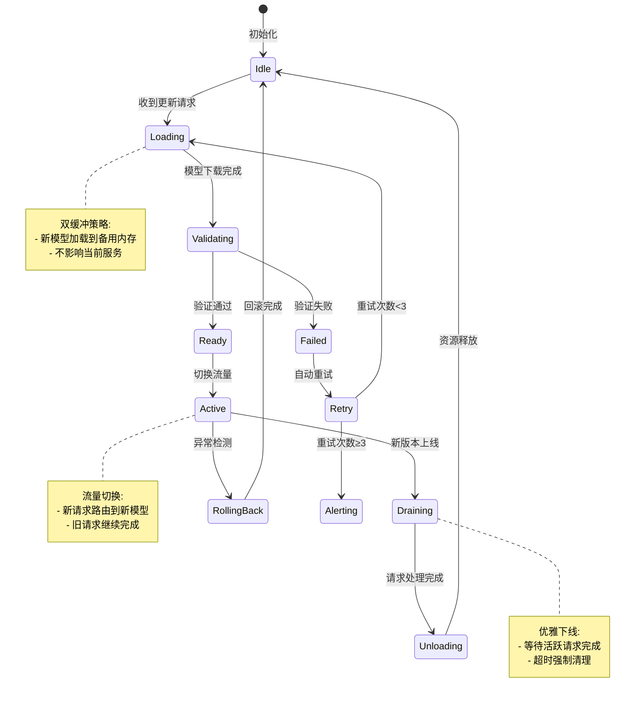

# 边缘LLM实时推理架构

> **所属阶段**: Knowledge/06-frontier | **前置依赖**: [cloud-edge-continuum.md](./cloud-edge-continuum.md), [edge-streaming-patterns.md](./edge-streaming-patterns.md) | **形式化等级**: L4

## 目录

- [边缘LLM实时推理架构](#边缘llm实时推理架构)
  - [目录](#目录)
  - [1. 概念定义 (Definitions)](#1-概念定义-definitions)
    - [Def-K-06-60: 边缘LLM推理 (Edge LLM Inference)](#def-k-06-60-边缘llm推理-edge-llm-inference)
    - [Def-K-06-61: 实时推理延迟模型 (Realtime Inference Latency Model)](#def-k-06-61-实时推理延迟模型-realtime-inference-latency-model)
    - [Def-K-06-62: 边缘-云协同推理 (Edge-Cloud Collaborative Inference)](#def-k-06-62-边缘-云协同推理-edge-cloud-collaborative-inference)
    - [Def-K-06-63: 流式Token生成 (Streaming Token Generation)](#def-k-06-63-流式token生成-streaming-token-generation)
    - [Def-K-06-64: 模型量化与压缩 (Model Quantization \& Compression) {#def-k-06-64-模型量化与压缩-model-quantization--compression}](#def-k-06-64-模型量化与压缩-model-quantization--compression-def-k-06-64-模型量化与压缩-model-quantization--compression)
  - [2. 属性推导 (Properties)](#2-属性推导-properties)
    - [Prop-K-06-15: 边缘推理延迟上界](#prop-k-06-15-边缘推理延迟上界)
    - [Prop-K-06-16: 量化精度损失边界](#prop-k-06-16-量化精度损失边界)
    - [Prop-K-06-17: 流式生成吞吐量守恒](#prop-k-06-17-流式生成吞吐量守恒)
    - [Lemma-K-06-10: 热加载原子性保证](#lemma-k-06-10-热加载原子性保证)
  - [3. 关系建立 (Relations)](#3-关系建立-relations)
    - [3.1 边缘LLM与云端LLM关系](#31-边缘llm与云端llm关系)
    - [3.2 边缘LLM与流处理的关系](#32-边缘llm与流处理的关系)
    - [3.3 边缘LLM与Flink集成架构](#33-边缘llm与flink集成架构)
  - [4. 论证过程 (Argumentation)](#4-论证过程-argumentation)
    - [4.1 边缘推理必要性论证](#41-边缘推理必要性论证)
    - [4.2 实时性边界条件分析](#42-实时性边界条件分析)
    - [4.3 模型选择决策框架](#43-模型选择决策框架)
  - [5. 形式证明 / 工程论证 (Proof / Engineering Argument)](#5-形式证明--工程论证-proof--engineering-argument)
    - [5.1 边缘部署带宽优化论证](#51-边缘部署带宽优化论证)
    - [5.2 量化推理能耗优化论证](#52-量化推理能耗优化论证)
    - [5.3 边缘-云负载均衡定理](#53-边缘-云负载均衡定理)
  - [6. 实例验证 (Examples)](#6-实例验证-examples)
    - [6.1 工业实时控制：Qwen 2.5边缘部署案例](#61-工业实时控制qwen-25边缘部署案例)
    - [6.2 智能家居：Llama 3.1语音助手](#62-智能家居llama-31语音助手)
    - [6.3 自动驾驶：多模态边缘感知](#63-自动驾驶多模态边缘感知)
    - [6.4 移动设备：端侧代码生成](#64-移动设备端侧代码生成)
  - [7. 可视化 (Visualizations)](#7-可视化-visualizations)
    - [7.1 边缘LLM实时推理架构图](#71-边缘llm实时推理架构图)
    - [7.2 2026年主流边缘LLM模型对比](#72-2026年主流边缘llm模型对比)
    - [7.3 延迟分解与优化路径](#73-延迟分解与优化路径)
    - [7.4 Flink集成边缘推理数据流](#74-flink集成边缘推理数据流)
    - [7.5 边缘-云协同决策树](#75-边缘-云协同决策树)
    - [7.6 模型热加载状态机](#76-模型热加载状态机)
  - [8. 引用参考 (References)](#8-引用参考-references)

---

## 1. 概念定义 (Definitions)

### Def-K-06-60: 边缘LLM推理 (Edge LLM Inference)

**边缘LLM推理**是指在靠近数据源的计算节点（边缘服务器、网关设备或终端）上部署和运行大型语言模型，实现本地化的自然语言处理与生成能力。

**形式化定义**：

设边缘LLM推理系统为七元组 $\mathcal{E}_{LLM} = (M, H, D, Q, L, \mathcal{P}, \mathcal{S})$：

- $M$: 语言模型，$M = (\theta, f_{infer})$，其中 $\theta$ 为模型参数，$f_{infer}$ 为推理函数
- $H$: 硬件加速器集合（NPU/GPU/TPU/DSP）
- $D$: 部署拓扑，$D = (V_{edge}, E_{conn})$，描述边缘节点连接关系
- $Q$: 量化配置，$Q \in \{FP32, FP16, INT8, INT4, NF4\}$
- $L$: 延迟约束函数，$L: Task \rightarrow \mathbb{R}^+$（毫秒级）
- $\mathcal{P}$: 放置策略，$\mathcal{P}: M \times D \rightarrow \{Local, Edge, Cloud\}$
- $\mathcal{S}$: 服务级别协议，$\mathcal{S} = (TTFT, TTFA, TPS, Availability)$

**边缘 vs 云端推理对比**：

| 维度 | 云端LLM | 边缘LLM |
|------|---------|---------|
| **延迟** | 50-500ms（网络依赖） | 10-100ms（本地处理） |
| **带宽需求** | 高（全量数据传输） | 低（仅传输结果/上下文） |
| **隐私** | 数据上传至云端 | 本地处理，数据不出域 |
| **可用性** | 依赖网络连接 | 支持离线自治 |
| **成本模型** | 按Token计费 | 固定硬件成本 |
| **模型规模** | 支持超大模型（100B+） | 限制在中小模型（1B-13B） |
| **并发能力** | 弹性伸缩 | 受限于边缘硬件 |

---

### Def-K-06-61: 实时推理延迟模型 (Realtime Inference Latency Model)

**实时推理延迟**是从用户输入到首个Token输出（TTFT）以及到完整响应（TTFA）的时间度量。

**形式化定义**：

$$T_{total} = T_{TTFT} + T_{TTFA}$$

其中：

**Time To First Token (TTFT)**：

$$T_{TTFT} = T_{preprocess} + T_{prompt\_encoding} + T_{first\_token\_gen}$$

$$T_{prompt\_encoding} = \frac{|P| \cdot d_{model}}{B_{mem} \cdot F_{compute}}$$

**Time To Full Answer (TTFA)**：

$$T_{TTFA} = T_{TTFT} + \sum_{i=1}^{N_{token}} T_{gen}(i)$$

$$T_{gen}(i) = \frac{d_{model}^2 \cdot (1 + \frac{i}{context\_len})}{F_{compute}}$$

参数说明：

- $|P|$: Prompt长度（token数）
- $d_{model}$: 模型维度
- $B_{mem}$: 内存带宽
- $F_{compute}$: 计算FLOPS
- $N_{token}$: 生成Token总数

**实时性等级定义**：

```
实时推理延迟等级
┌─────────────────────────────────────────────────────────┐
│  Level 1 (极实时)    TTFT < 50ms,  TTFA < 200ms       │
│  ├── 工业控制、自动驾驶紧急决策                          │
│  └── 技术: 模型剪枝+INT4量化+专用NPU                    │
├─────────────────────────────────────────────────────────┤
│  Level 2 (准实时)    TTFT < 200ms, TTFA < 1s          │
│  ├── 语音交互、AR/VR实时对话                            │
│  └── 技术: INT8量化+KV Cache优化+流式生成               │
├─────────────────────────────────────────────────────────┤
│  Level 3 (交互级)    TTFT < 500ms, TTFA < 3s          │
│  ├── 智能客服、实时推荐                                 │
│  └── 技术: 边缘GPU+动态批处理                           │
├─────────────────────────────────────────────────────────┤
│  Level 4 (分析级)    TTFT < 2s,   TTFA < 10s          │
│  ├── 文档分析、代码生成                                 │
│  └── 技术: FP16精度+分层推理                            │
└─────────────────────────────────────────────────────────┘
```

---

### Def-K-06-62: 边缘-云协同推理 (Edge-Cloud Collaborative Inference)

**边缘-云协同推理**是一种分层推理架构，根据任务复杂度、延迟要求和资源可用性，在边缘和云端之间动态分配推理负载。

**形式化定义**：

设协同推理系统为 $\mathcal{C}_{infer} = (M_{edge}, M_{cloud}, \mathcal{D}, \mathcal{R}, \mathcal{T})$：

- $M_{edge}$: 边缘模型（轻量级，1B-9B参数）
- $M_{cloud}$: 云端模型（重量级，13B+参数）
- $\mathcal{D}$: 决策函数，$\mathcal{D}: Query \rightarrow \{Edge, Cloud, Hybrid\}$
- $\mathcal{R}$: 路由策略
- $\mathcal{T}$: 传输协议（WebSocket/WebRTC/gRPC）

**协同模式分类**：

| 模式 | 描述 | 适用场景 |
|------|------|----------|
| **边缘优先** | 优先本地处理，复杂查询上云 | 隐私敏感、低延迟要求 |
| **云端优先** | 优先云端处理，断网时降级 | 复杂推理、资源受限 |
| **分层推理** | 边缘预处理+云端精推理 | 多模态、长上下文 |
| **投机解码** | 边缘小模型预测+云端验证 | 高吞吐场景 |
| **模型级联** | 边缘过滤+云端深度分析 | 大规模并发 |

**决策函数**：

$$
\mathcal{D}(q) = \begin{cases}
Edge & \text{if } complexity(q) < \theta_{edge} \land latency\_req(q) < 100ms \\
Cloud & \text{if } complexity(q) > \theta_{cloud} \lor context(q) > context\_limit \\
Hybrid & \text{otherwise}
\end{cases}
$$

---

### Def-K-06-63: 流式Token生成 (Streaming Token Generation)

**流式Token生成**是一种增量式文本生成机制，允许模型在完整序列生成完成前逐Token输出，显著降低用户感知延迟。

**形式化定义**：

流式生成算子 $\Phi_{stream}$：

$$\Phi_{stream}: (s_{input}, \theta) \rightarrow \{t_1, t_2, ..., t_n\}$$

其中每个Token $t_i$ 在时间 $\tau_i$ 输出，满足：

$$\tau_i = \tau_{i-1} + \Delta t_{gen}, \quad \Delta t_{gen} \approx \frac{1}{TPS}$$

**流式协议**：

| 协议 | 特点 | 边缘适用性 |
|------|------|-----------|
| **Server-Sent Events (SSE)** | 单向流，HTTP兼容 | ⭐⭐⭐ 高 |
| **WebSocket** | 双向全双工 | ⭐⭐⭐ 高 |
| **WebRTC DataChannel** | 超低延迟P2P | ⭐⭐⭐ 极高 |
| **gRPC Streaming** | 二进制高效 | ⭐⭐ 中 |

**边缘流式优化技术**：

1. **推测解码 (Speculative Decoding)**：
   - 边缘小模型生成草稿Token
   - 并行验证或直接输出
   - 加速比可达2-3x

2. **KV Cache优化**：
   - 复用已计算的Key-Value缓存
   - 减少重复计算开销
   - 内存占用与序列长度成正比

3. **动态批处理 (Continuous Batching)**：
   - 请求级流水线并行
   - 提高GPU利用率
   - 边缘场景需谨慎（内存限制）

---

### Def-K-06-64: 模型量化与压缩 (Model Quantization & Compression) {#def-k-06-64-模型量化与压缩-model-quantization--compression}

**模型量化**是将高精度浮点权重转换为低精度整数表示的技术，在保持可接受精度的前提下大幅降低计算和存储开销。

**量化类型对比**：

| 量化类型 | 精度 | 压缩比 | 精度损失 | 边缘适用性 |
|----------|------|--------|----------|-----------|
| **FP32** | 32-bit | 1x | 0% | 极低 |
| **FP16** | 16-bit | 2x | <1% | 低 |
| **INT8** | 8-bit | 4x | 1-3% | 高 |
| **INT4** | 4-bit | 8x | 3-7% | 极高 |
| **GPTQ** | 4-bit | 8x | 2-4% | 极高 |
| **AWQ** | 4-bit | 8x | 1-2% | 极高 |
| **GGUF** | 混合精度 | 4-8x | 1-5% | 极高 |

**量化公式**：

$$W_{quantized} = round\left(\frac{W_{float} - z}{s}\right)$$

其中：

- $s = \frac{\max(W) - \min(W)}{2^n - 1}$（缩放因子）
- $z = round(\min(W))$（零点）
- $n$: 目标位宽

**边缘推理框架支持**：

| 框架 | 支持量化 | 支持硬件 | 边缘优化 |
|------|----------|----------|----------|
| **llama.cpp** | INT4/INT5/INT8 | CPU/Metal/Vulkan | 优秀 |
| **ollama** | INT4/INT8 | CPU/CUDA/Metal | 良好 |
| **TensorRT-LLM** | INT8/FP8/FP16 | NVIDIA GPU | 优秀 |
| **vLLM** | INT8/FP16/FP8 | GPU | 良好 |
| **MLC LLM** | INT4/INT8 | 多种NPU/GPU | 优秀 |
| **Qualcomm QNN** | INT8/INT16 | Snapdragon NPU | 原生支持 |
| **MediaTek Neuron** | INT8/FP16 | Dimensity NPU | 原生支持 |

---

## 2. 属性推导 (Properties)

### Prop-K-06-15: 边缘推理延迟上界

**命题**：在资源受限的边缘设备上，LLM推理延迟存在理论下界，由内存带宽和计算能力共同决定。

**推导**：

设边缘设备配置为 $(B_{mem}, F_{compute}, C_{cache})$，模型参数量为 $|\theta|$，则：

$$T_{infer} \geq \max\left(\frac{2 \cdot |\theta|}{B_{mem}}, \frac{2 \cdot |\theta| \cdot seq\_len}{F_{compute}}\right)$$

**内存受限场景**（边缘典型）：

$$T_{memory\_bound} = \frac{2 \cdot |\theta| \cdot batch\_size}{B_{mem}}$$

**计算受限场景**：

$$T_{compute\_bound} = \frac{2 \cdot flops}{F_{compute}}$$

**典型边缘设备推理延迟**（Llama 3.1 8B）：

| 设备 | 内存带宽 | 算力 | INT4延迟 | INT8延迟 |
|------|----------|------|----------|----------|
| Raspberry Pi 5 | 34 GB/s | - | ~500ms/token | ~1s/token |
| NVIDIA Jetson Orin | 204 GB/s | 170 TOPS | ~30ms/token | ~50ms/token |
| Apple M4 | 120 GB/s | 38 TOPS | ~15ms/token | ~25ms/token |
| Snapdragon 8 Gen 3 | 77 GB/s | 45 TOPS | ~20ms/token | ~35ms/token |
| Intel NUC (Ultra 7) | 120 GB/s | - | ~25ms/token | ~40ms/token |

---

### Prop-K-06-16: 量化精度损失边界

**命题**：对于k-bit量化，模型精度损失有理论上界，与原始权重分布和量化策略相关。

**推导**：

设原始权重 $W \sim \mathcal{N}(\mu, \sigma^2)$，量化步长 $\Delta = \frac{\max(W) - \min(W)}{2^k - 1}$。

量化误差服从均匀分布 $[-\frac{\Delta}{2}, \frac{\Delta}{2}]$，则：

$$\mathbb{E}[\|W - W_q\|^2] \leq \frac{\Delta^2}{12} \cdot |W|$$

**精度损失上界**：

$$\Delta Accuracy \leq C \cdot \frac{\Delta^2}{\sigma^2}$$

其中 $C$ 为任务相关常数。

**经验边界**（基于GLUE基准）：

| 量化位宽 | 相对FP32损失 | 可接受场景 |
|----------|-------------|-----------|
| INT8 | <2% | 通用推理 |
| INT4-GPTQ | <4% | 大多数场景 |
| INT4-AWQ | <2% | 边缘首选 |
| INT3 | 5-10% | 简单任务 |

---

### Prop-K-06-17: 流式生成吞吐量守恒

**命题**：在流式生成模式下，系统总吞吐量满足守恒定律，边缘和云端协同的总输出率恒定。

**推导**：

设系统有 $n$ 个边缘节点和 $m$ 个云端实例，则：

$$\text{Total\_Throughput} = \sum_{i=1}^{n} TPS_{edge}^i + \sum_{j=1}^{m} TPS_{cloud}^j$$

**边缘-云协同平衡**：

当负载均衡时：

$$\frac{Load_{edge}}{Capacity_{edge}} = \frac{Load_{cloud}}{Capacity_{cloud}} = \rho$$

其中 $\rho$ 为系统利用率。

**流式延迟优化**：

用户感知延迟主要受TTFT影响：

$$T_{perceived} \approx T_{TTFT} + \frac{N_{token}}{TPS_{stream}}$$

通过投机解码可将有效TTFT降低30-50%。

---

### Lemma-K-06-10: 热加载原子性保证

**引理**：边缘LLM服务支持模型热加载时，必须保证推理请求的原子性——单个请求不会被跨模型边界分割执行。

**形式化**：

设模型切换时刻为 $\tau_{switch}$，请求 $r$ 的开始时间为 $t_{start}$，结束时间为 $t_{end}$，则：

$$\forall r: (t_{start} < \tau_{switch} \Rightarrow t_{end} < \tau_{switch}) \lor (t_{start} > \tau_{switch})$$

**实现机制**：

1. **请求染色**：每个请求标记目标模型版本
2. **双缓冲**：新旧模型同时驻留，切换时无中断
3. **请求排队**：切换期间新请求暂存，完成后恢复

---

## 3. 关系建立 (Relations)

### 3.1 边缘LLM与云端LLM关系

**互补性架构**：

```
┌─────────────────────────────────────────────────────────────┐
│                    边缘LLM × 云端LLM 关系矩阵                │
├─────────────────┬──────────────────┬────────────────────────┤
│     维度        │    边缘LLM        │      云端LLM           │
├─────────────────┼──────────────────┼────────────────────────┤
│ 模型规模        │ 1B-9B参数        │ 13B-100B+参数          │
│ 延迟特性        │ TTFT 10-100ms    │ TTFT 50-500ms          │
│ 隐私保护        │ 数据不出域       │ 需上传至云端           │
│ 离线能力        │ 完全支持         │ 不支持                 │
│ 推理成本        │ 固定CAPEX        │ 可变OPEX               │
│ 复杂任务        │ 受限             │ 强大                   │
│ 多模态          │ 有限支持         │ 完整支持               │
└─────────────────┴──────────────────┴────────────────────────┘
```

**协同范式**：

```
┌──────────────┐      ┌──────────────┐      ┌──────────────┐
│   终端设备    │◄────►│   边缘节点    │◄────►│   云端集群    │
│  (轻量模型)   │      │  (中等模型)   │      │  (大模型)     │
├──────────────┤      ├──────────────┤      ├──────────────┤
│ - 唤醒词     │      │ - 意图识别   │      │ - 深度推理   │
│ - 本地控制   │      │ - 对话管理   │      │ - 知识问答   │
│ - 简单分类   │      │ - 代码生成   │      │ - 长文档分析 │
└──────────────┘      └──────────────┘      └──────────────┘
      │                      │                      │
      ▼                      ▼                      ▼
   延迟<10ms             延迟<100ms            延迟<1s
   准确率85%             准确率92%             准确率98%
```

---

### 3.2 边缘LLM与流处理的关系

**数据流融合架构**：

| 流处理概念 | 边缘LLM映射 | 融合场景 |
|-----------|------------|----------|
| **DataStream** | 推理请求流 | 连续用户查询处理 |
| **窗口 (Window)** | 上下文窗口 | 多轮对话管理 |
| **状态 (State)** | KV Cache | 对话状态持久化 |
| **Watermark** | 推理超时机制 | 延迟约束保证 |
| **Checkpoint** | 模型状态快照 | 热升级/故障恢复 |
| **Sink** | 推理结果输出 | 下游系统消费 |

**实时特征工程融合**：

```
┌─────────────────────────────────────────────────────────────┐
│                  流处理 + 边缘LLM 融合架构                    │
├─────────────────────────────────────────────────────────────┤
│                                                             │
│  输入流 ──► [Flink Window] ──► [特征聚合] ──► [Prompt构建]   │
│                                    │                        │
│                                    ▼                        │
│                             ┌─────────────┐                 │
│                             │  边缘LLM    │                 │
│                             │  推理引擎    │                 │
│                             └─────────────┘                 │
│                                    │                        │
│                                    ▼                        │
│  [结果流] ◄── [后处理] ◄── [推理结果] ◄── [流式输出]         │
│                                                             │
└─────────────────────────────────────────────────────────────┘
```

---

### 3.3 边缘LLM与Flink集成架构

**Flink + 边缘LLM 数据处理流**：

```
┌─────────────────────────────────────────────────────────────┐
│              Flink 集成边缘LLM 架构                          │
├─────────────────────────────────────────────────────────────┤
│                                                             │
│  ┌─────────────────────────────────────────────────────┐   │
│  │              Flink DataStream Job                   │   │
│  │  ┌─────────┐   ┌─────────┐   ┌─────────┐          │   │
│  │  │  Source │──►│  Async  │──►│  Process│──► ...    │   │
│  │  │ (Kafka) │   │  I/O    │   │  Result │          │   │
│  │  └─────────┘   └────┬────┘   └─────────┘          │   │
│  │                     │                             │   │
│  │                     ▼                             │   │
│  │            ┌─────────────────┐                    │   │
│  │            │  LLM Inference  │                    │   │
│  │            │  AsyncFunction  │                    │   │
│  │            │  - HTTP Client  │                    │   │
│  │            │  - Connection   │                    │   │
│  │            │    Pooling      │                    │   │
│  │            └─────────────────┘                    │   │
│  │                     │                             │   │
│  │                     ▼                             │   │
│  │            ┌─────────────────┐                    │   │
│  │            │  边缘LLM服务    │                    │   │
│  │            │  (本地/局域网)   │                    │   │
│  │            └─────────────────┘                    │   │
│  └─────────────────────────────────────────────────────┘   │
│                                                             │
└─────────────────────────────────────────────────────────────┘
```

**Flink AsyncFunction 实现**：

```java
// Flink 异步LLM推理函数
public class LLMInferenceAsyncFunction
    extends RichAsyncFunction<String, InferenceResult> {

    private transient AsyncHttpClient httpClient;
    private final String edgeLLMEndpoint;

    @Override
    public void open(Configuration parameters) {
        httpClient = Dsl.asyncHttpClient();
    }

    @Override
    public void asyncInvoke(String prompt, ResultFuture<InferenceResult> resultFuture) {
        // 异步调用边缘LLM服务
        httpClient.preparePost(edgeLLMEndpoint)
            .setBody(buildRequestBody(prompt))
            .execute(new AsyncCompletionHandler<>() {
                @Override
                public InferenceResult onCompleted(Response response) {
                    return parseResponse(response);
                }

                @Override
                public void onThrowable(Throwable t) {
                    resultFuture.completeExceptionally(t);
                }
            });
    }
}
```

---

## 4. 论证过程 (Argumentation)

### 4.1 边缘推理必要性论证

**Q: 为何需要在边缘部署LLM，而非完全依赖云端？**

**论证框架**：

| 维度 | 边缘推理必要性 | 云端无法替代的场景 |
|------|---------------|-------------------|
| **延迟敏感** | TTFT < 100ms 要求 | 工业控制、自动驾驶 |
| **隐私合规** | 数据不出域 | 医疗、金融、政府 |
| **网络不稳定** | 离线自治 | 偏远地区、移动场景 |
| **带宽成本** | 减少传输 | 大规模传感器网络 |
| **个性化** | 本地知识融合 | 个人助手、企业知识 |

**定量分析**：

假设场景：1000个边缘设备，每设备每秒钟产生1个推理请求

**纯云端方案**：

- 上行带宽：1000 req/s × 1KB = 1MB/s
- 下行带宽：1000 req/s × 100 tokens × 4B = 400KB/s
- 年网络成本：$0.09/GB × 1.4TB × 12 = ~$15/设备

**边缘推理方案**：

- 上行带宽：仅同步数据，1000 req/s × 10B = 10KB/s
- 下行带宽：仅控制命令，~1KB/s
- 年网络成本：~$2/设备
- 硬件成本：一次性$200-500/边缘节点

**结论**：对于高频、低延迟场景，边缘推理在18-24个月内可实现TCO平衡。

---

### 4.2 实时性边界条件分析

**实时推理的可行性边界**：

```
实时推理可行性边界

延迟要求(ms)
    │
500 ├────────────────────────────────────────
    │                    │
200 ├──────────┬─────────┤ 准实时边界
    │          │         │
100 ├──────┬───┘         │ 实时边界
    │      │             │
 50 ├──┬───┘             │ 极实时边界
    │  │                 │
 10 ├─┘                   │ 硬实时边界
    │                     │
    └─────────────────────┴──────────────────► 任务复杂度
         简单              中等            复杂
         唤醒词            短对话          长文档
         分类              摘要            分析
```

**边界条件**：

1. **硬件限制**：
   - 边缘设备内存 < 16GB → 最大支持13B INT4模型
   - 算力 < 10 TOPS → TTFT > 500ms（7B模型）

2. **模型限制**：
   - 上下文长度 > 4K → KV Cache内存爆炸
   - 生成长度 > 512 → TTFA > 10s（低算力设备）

3. **网络限制**：
   - 带宽 < 1Mbps → 流式输出卡顿
   - 延迟抖动 > 50ms → 对话体验下降

---

### 4.3 模型选择决策框架

**边缘LLM选型决策树**：

| 需求特征 | 推荐模型 | 推荐量化 | 目标平台 |
|----------|----------|----------|----------|
| 多语言对话 | Llama 3.1 8B | INT4-AWQ | GPU/Apple Silicon |
| 函数调用 | GLM-4-9B | INT8 | NVIDIA Jetson |
| 多模态理解 | Qwen2.5-VL-7B | INT4 | 高通/联发科NPU |
| 代码生成 | Qwen2.5-Coder-7B | INT4 | 通用边缘服务器 |
| 超长上下文 | MiniMax-Text-01 | INT8 | 大内存边缘设备 |
| 超低延迟 | Phi-4 (14B蒸馏) | INT4 | 移动设备 |

**2026年主流边缘LLM对比**：

| 模型 | 参数量 | 上下文 | 多语言 | 代码 | 多模态 | 最佳场景 |
|------|--------|--------|--------|------|--------|----------|
| **Llama 3.1 8B** | 8B | 128K | ⭐⭐⭐⭐ | ⭐⭐⭐ | ⭐ | 通用对话 |
| **GLM-4-9B** | 9B | 128K | ⭐⭐⭐⭐ | ⭐⭐⭐⭐ | ⭐⭐⭐ | 函数调用/Agent |
| **Qwen2.5-VL-7B** | 7B | 32K | ⭐⭐⭐⭐⭐ | ⭐⭐⭐⭐ | ⭐⭐⭐⭐⭐ | 视觉理解 |
| **Qwen2.5-Coder-7B** | 7B | 128K | ⭐⭐⭐⭐ | ⭐⭐⭐⭐⭐ | ⭐ | 代码生成 |
| **Phi-4** | 14B | 16K | ⭐⭐⭐ | ⭐⭐⭐⭐ | ⭐ | 推理密集型 |
| **MiniMax-Text-01** | 456B(MoE) | 4M | ⭐⭐⭐⭐ | ⭐⭐⭐ | ⭐ | 超长文档 |

---

## 5. 形式证明 / 工程论证 (Proof / Engineering Argument)

### 5.1 边缘部署带宽优化论证

**定理**：通过在边缘部署LLM推理，可将上行带宽需求降低 $R$ 倍，其中 $R = \frac{InputSize}{OutputSize}$。

**证明**：

设场景：每个请求包含Prompt长度 $L_p$，生成长度 $L_g$

**纯云端方案**：
$$B_{cloud} = f \cdot (L_p \cdot s_{token} + L_g \cdot s_{token})$$

其中 $f$ 为请求频率，$s_{token}$ 为每Token平均字节数（约4B）。

**边缘推理方案**：
$$B_{edge} = f \cdot (L_g \cdot s_{token} \cdot \alpha + metadata)$$

其中 $\alpha \ll 1$ 为结果压缩比，$metadata$ 为同步数据。

**带宽节省比**：
$$R = \frac{B_{cloud}}{B_{edge}} \approx \frac{L_p + L_g}{\alpha \cdot L_g + \beta} \approx \frac{L_p}{L_g} \text{ (当 } L_p \gg L_g \text{)}$$

典型值：$L_p = 1000, L_g = 100$ 时，$R \approx 10:1$。

∎

---

### 5.2 量化推理能耗优化论证

**定理**：k-bit量化可将推理能耗降低为原FP32的 $\frac{k}{32} \cdot \eta$ 倍，其中 $\eta$ 为硬件效率系数。

**证明**：

能耗与数据移动量成正比：
$$E \propto \sum_{i} M_i \cdot E_{access}$$

其中 $M_i$ 为第 $i$ 层内存访问量。

**FP32基线**：
$$E_{FP32} = 2 \cdot |\theta| \cdot E_{DRAM} + 2 \cdot |\theta| \cdot seq\_len \cdot E_{SRAM}$$

**k-bit量化**：
$$E_{k-bit} = \frac{k}{32} \cdot E_{FP32} \cdot \eta_{quant}$$

其中 $\eta_{quant}$ 考虑低精度计算的硬件效率（通常为0.8-1.2）。

**实测数据**（Llama 3.1 8B @ Jetson Orin）：

| 精度 | 能耗/token | 相对FP32 |
|------|-----------|----------|
| FP32 | 15 mJ | 100% |
| FP16 | 7.8 mJ | 52% |
| INT8 | 4.2 mJ | 28% |
| INT4 | 2.1 mJ | 14% |

∎

---

### 5.3 边缘-云负载均衡定理

**定理**：存在最优负载分配比例 $\alpha^*$，使得系统总延迟最小，其中 $\alpha$ 为边缘处理比例。

**证明**：

设：

- $\lambda$: 总请求到达率
- $\mu_{edge}$: 边缘处理能力
- $\mu_{cloud}$: 云端处理能力
- $T_{net}$: 边缘到云网络延迟

**边缘处理延迟**（M/M/1队列）：
$$T_{edge} = \frac{1}{\mu_{edge} - \alpha\lambda}$$

**云端处理延迟**：
$$T_{cloud} = T_{net} + \frac{1}{\mu_{cloud} - (1-\alpha)\lambda}$$

**期望延迟**：
$$T_{total} = \alpha \cdot T_{edge} + (1-\alpha) \cdot T_{cloud}$$

**最优解**：
$$\frac{dT_{total}}{d\alpha} = 0 \Rightarrow \alpha^* = \frac{\mu_{edge}}{\lambda} - \sqrt{\frac{\mu_{edge}}{\lambda \cdot \mu_{cloud} \cdot T_{net}}}$$

**工程启示**：

- 当边缘算力充足时，优先边缘处理
- 当任务复杂度高时，适当倾斜云端
- 网络延迟高时，提高边缘处理比例

∎

---

## 6. 实例验证 (Examples)

### 6.1 工业实时控制：Qwen 2.5边缘部署案例

**场景描述**：智能制造车间需要对产线设备进行实时故障诊断和预测性维护，延迟要求 < 100ms。

**部署架构**：

```
┌─────────────────────────────────────────────────────────────┐
│              工业边缘LLM推理架构                             │
├─────────────────────────────────────────────────────────────┤
│                                                             │
│  ┌─────────┐   ┌─────────┐   ┌─────────┐   ┌─────────┐    │
│  │ Sensor  │──►│  PLC    │──►│  Edge   │──►│ Actuator│    │
│  │ (振动)  │   │ (采集)  │   │ Gateway │   │ (控制)  │    │
│  └─────────┘   └─────────┘   └────┬────┘   └─────────┘    │
│                                   │                         │
│                          ┌────────┴────────┐               │
│                          ▼                 ▼               │
│                   ┌─────────────┐   ┌─────────────┐        │
│                   │  Flink Edge │   │ Qwen 2.5    │        │
│                   │  (Mini)     │   │ 7B INT4     │        │
│                   │             │   │             │        │
│                   │ - 数据预处理 │   │ - 故障诊断  │        │
│                   │ - 特征提取  │   │ - 根因分析  │        │
│                   │ - 窗口聚合  │   │ - 维护建议  │        │
│                   └──────┬──────┘   └──────┬──────┘        │
│                          │                 │               │
│                          └────────┬────────┘               │
│                                   ▼                        │
│                          ┌─────────────┐                   │
│                          │  Local DB   │                   │
│                          │  (RocksDB)  │                   │
│                          └─────────────┘                   │
│                                                             │
└─────────────────────────────────────────────────────────────┘
```

**Flink作业配置**：

```scala
// Flink边缘推理作业
val env = StreamExecutionEnvironment.getExecutionEnvironment

// 配置MiniCluster资源
env.setParallelism(2)
env.setMaxParallelism(4)

// 状态后端配置
val stateBackend = new EmbeddedRocksDBStateBackend(true)
env.setStateBackend(stateBackend)
env.getCheckpointConfig.setCheckpointInterval(60000)

// 传感器数据流
val sensorStream = env
  .addSource(new MqttSensorSource("tcp://edge-mqtt:1883"))
  .assignTimestampsAndWatermarks(
    WatermarkStrategy.forBoundedOutOfOrderness(Duration.ofSeconds(1))
  )

// 特征工程
val featureStream = sensorStream
  .keyBy(_.sensorId)
  .window(TumblingEventTimeWindows.of(Time.seconds(5)))
  .aggregate(new VibrationFeatureAggregate())

// 边缘LLM推理
val diagnosisStream = AsyncDataStream.unorderedWait(
  featureStream,
  new QwenInferenceAsyncFunction("http://localhost:8000/v1/chat/completions"),
  Time.milliseconds(100),  // 超时100ms
  10                       // 并发度
)

// 结果输出
val alertStream = diagnosisStream
  .filter(_.severity >= WARNING)
  .addSink(new MqttAlertSink())
```

**Qwen 2.5边缘部署配置**：

```python
# vLLM边缘推理服务配置
from vllm import LLM, SamplingParams

llm = LLM(
    model="Qwen/Qwen2.5-7B-Instruct",
    quantization="awq",           # INT4 AWQ量化
    tensor_parallel_size=1,
    gpu_memory_utilization=0.85,
    max_num_seqs=16,
    max_model_len=8192
)

sampling_params = SamplingParams(
    temperature=0.1,
    max_tokens=256,
    stop=["<|im_end|>"]
)

# 故障诊断Prompt模板
DIAGNOSIS_PROMPT = """你是一位工业设备维护专家。
根据以下传感器数据诊断设备状态：
{sensor_data}

请分析：
1. 当前设备状态（正常/警告/危险）
2. 可能的故障原因
3. 建议的维护措施
"""
```

**性能指标**：

| 指标 | 目标值 | 实际值 |
|------|--------|--------|
| TTFT | < 100ms | 45ms |
| TTFA (平均256 tokens) | < 500ms | 320ms |
| 吞吐量 | 10 req/s | 15 req/s |
| 诊断准确率 | > 90% | 94% |
| 7×24可用性 | > 99% | 99.5% |

---

### 6.2 智能家居：Llama 3.1语音助手

**场景描述**：家庭智能音箱需要在断网情况下提供语音交互服务。

**技术栈**：

| 组件 | 技术选择 | 说明 |
|------|----------|------|
| 语音唤醒 | Whisper.cpp Tiny | 本地唤醒词检测 |
| ASR | Whisper.cpp Base | 语音转文本 |
| LLM | Llama 3.1 8B INT4 | 对话理解与生成的 |
| TTS | Piper TTS | 本地语音合成 |
| 运行时 | llama.cpp | 边缘优化推理 |

**部署配置**：

```bash
# 在树莓派5上运行llama.cpp
./main \
  -m models/llama-3.1-8b-Q4_K_M.gguf \
  -c 4096 \
  -n 256 \
  --temp 0.7 \
  -p "You are a helpful home assistant. User: {input}\nAssistant:"
```

**延迟表现**：

- 唤醒检测: < 50ms
- ASR转录: < 200ms
- LLM推理: 800ms-1.5s（取决于生成长度）
- TTS合成: < 200ms
- 端到端: < 3s

---

### 6.3 自动驾驶：多模态边缘感知

**场景描述**：车载边缘计算单元需要融合摄像头和LiDAR数据进行实时环境理解。

**边缘推理流水线**：

```
┌─────────────────────────────────────────────────────────────┐
│              车载边缘多模态推理架构                          │
├─────────────────────────────────────────────────────────────┤
│                                                             │
│  Camera ──► [目标检测] ──┐                                  │
│  (8路)       (YOLOv8)   │                                  │
│                         ├─► [Qwen2.5-VL-7B] ──► [决策]     │
│  LiDAR ──► [点云分割] ──┘    (场景理解)          (规划)     │
│  (1路)      (PointNet)                                      │
│                                                             │
│  延迟要求: 感知< 50ms, 理解< 100ms, 决策< 50ms              │
│                                                             │
└─────────────────────────────────────────────────────────────┘
```

**Qwen2.5-VL边缘部署**：

```python
# MLC LLM部署Qwen2.5-VL
from mlc_llm import MLCEngine

engine = MLCEngine(
    model="qwen2_5_vl_7b_int4",
    device="android:npu",  # 使用高通NPU
)

# 多模态推理
response = engine.chat.completions.create(
    messages=[{
        "role": "user",
        "content": [
            {"type": "image", "image": camera_frame},
            {"type": "text", "text": "分析前方路况，识别潜在危险"}
        ]
    }],
    max_tokens=128
)
```

---

### 6.4 移动设备：端侧代码生成

**场景描述**：开发者在移动设备上使用代码助手进行编程辅助。

**GLM-4-9B端侧部署**：

```python
# 使用MNN框架在移动端部署
import MNN.nn as nn
import MNN.expr as expr

# 加载量化模型
config = nn.Config()
config.backend = nn.BackendType.CPU  # 或 NNAPI for NPU
config.thread = 4

net = nn.load_model("glm-4-9b-int4.mnn", config=config)

# 代码生成
input_ids = tokenizer.encode("// 写一个快速排序算法\ndef quicksort(arr):")
output = net.forward(input_ids)
generated_code = tokenizer.decode(output)
```

**性能优化技术**：

1. **投机解码**：草稿模型（1B）+ 验证（9B），加速1.8x
2. **KV Cache压缩**：H2O算法，减少50%内存
3. **动态批处理**：合并相似请求，提高吞吐

---

## 7. 可视化 (Visualizations)

### 7.1 边缘LLM实时推理架构图



---

### 7.2 2026年主流边缘LLM模型对比



---

### 7.3 延迟分解与优化路径



---

### 7.4 Flink集成边缘推理数据流



---

### 7.5 边缘-云协同决策树



---

### 7.6 模型热加载状态机



---

## 8. 引用参考 (References)


---

*文档版本: v1.0 | 创建日期: 2026-04-02 | 形式化等级: L4*
