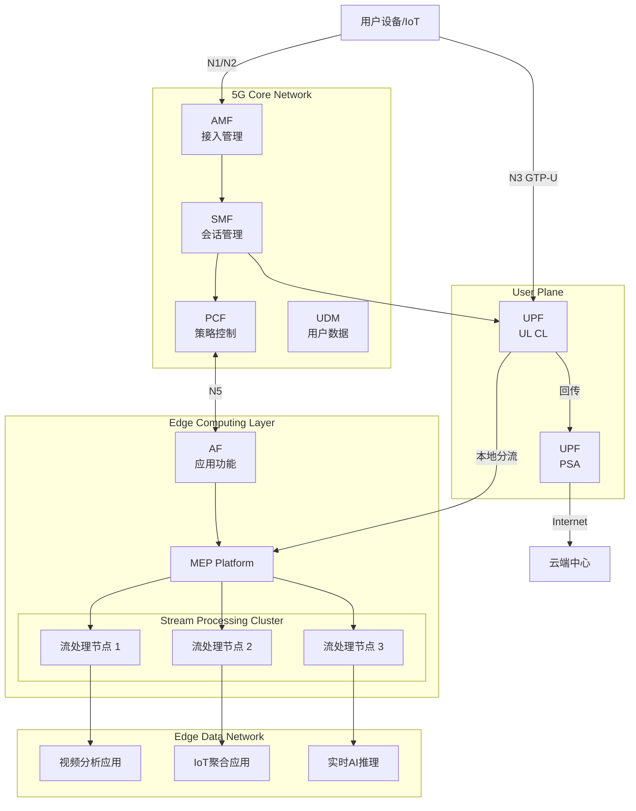
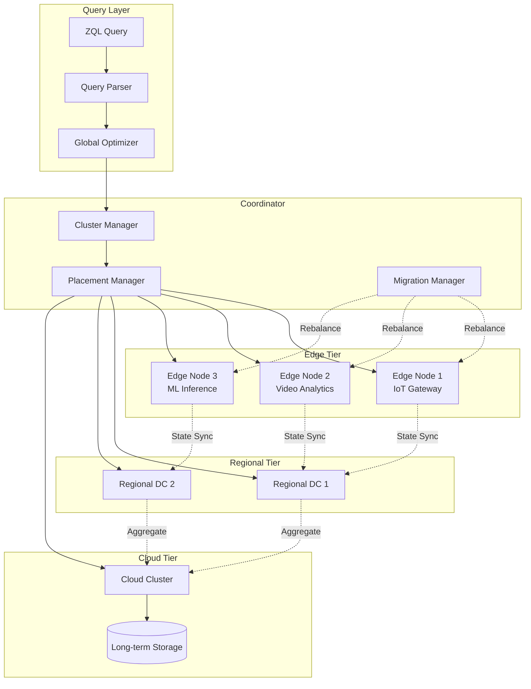
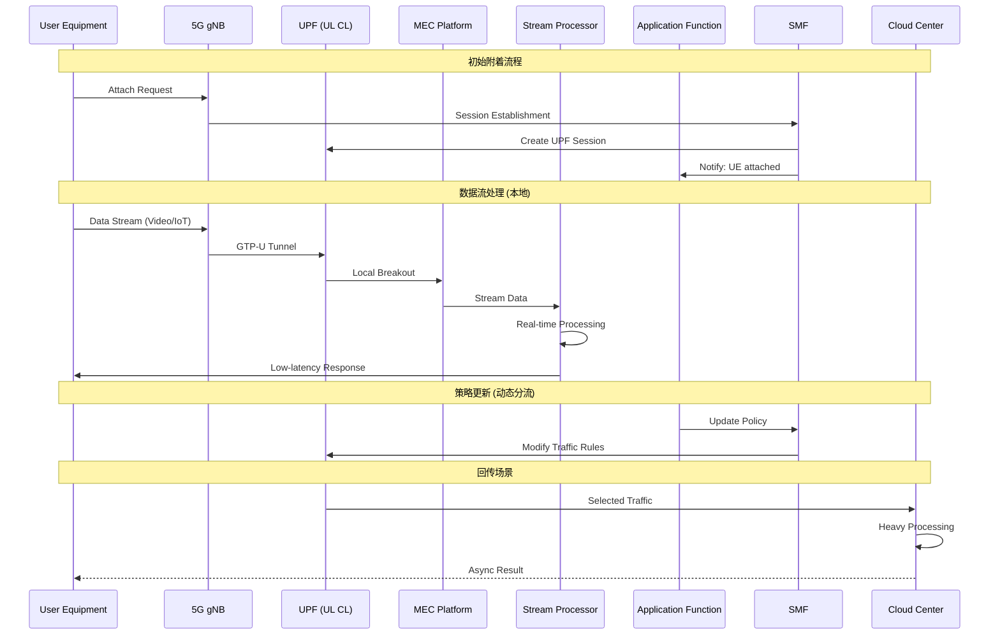
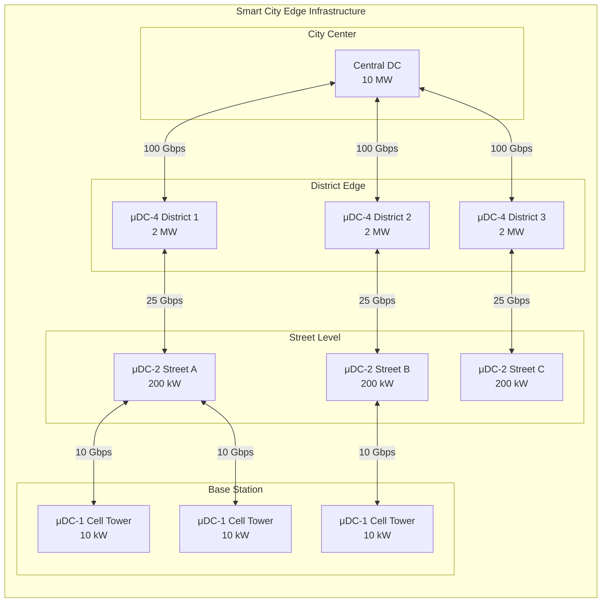

# 边缘流处理深化：NebulaStream、微数据中心与5G MEC集成

> 所属阶段: Knowledge/06-frontier | 前置依赖: [边缘流处理架构](edge-streaming-architecture.md), [边缘流处理模式](edge-streaming-patterns.md) | 形式化等级: L4-L5 | 版本: v1.0 (2026)

---

## 1. 概念定义 (Definitions)

### Def-K-ESA-01: NebulaStream 计算模型

**定义**: NebulaStream 是一种面向边缘-云连续体的声明式流处理框架，形式化为六元组：

$$
\mathcal{NS} \triangleq \langle \mathcal{E}, \mathcal{Q}, \mathcal{P}, \mathcal{D}, \mathcal{O}, \mathcal{M} \rangle
$$

其中：

| 组件 | 符号 | 语义解释 |
|------|------|----------|
| 边缘拓扑 | $\mathcal{E}$ | 异构边缘节点集合，$\mathcal{E} = \{e_i | i \in [1,n]\}$，每个节点 $e_i = (C_i, M_i, B_i, L_i)$ |
| 查询声明 | $\mathcal{Q}$ | ZQL (ZeroMQ Query Language) 查询集合，支持 UDF 扩展 |
| 放置策略 | $\mathcal{P}: \mathcal{Q} \times \mathcal{E} \rightarrow [0,1]^n$ | 查询算子到边缘节点的放置概率分布 |
| 数据流 | $\mathcal{D}$ | 带位置感知的异构数据流集合 |
| 优化器 | $\mathcal{O}$ | 跨层全局优化器，支持运行时再优化 |
| 迁移机制 | $\mathcal{M}$ | 算子状态热迁移协议 |

**核心特征**:

```
┌─────────────────────────────────────────────────────────────────────┐
│                    NebulaStream 架构层次                             │
├─────────────────────────────────────────────────────────────────────┤
│                                                                     │
│  ┌─────────────────────────────────────────────────────────────┐   │
│  │                    ZQL 查询层 (声明式)                        │   │
│  │  SELECT AVG(temperature) FROM SensorStream [RANGE 1m]        │   │
│  │  WHERE location = 'factory_floor_1'                          │   │
│  └────────────────────┬────────────────────────────────────────┘   │
│                       │                                             │
│  ┌────────────────────▼────────────────────────────────────────┐   │
│  │              全局查询优化器 (跨层优化)                         │   │
│  │  • 算子放置决策 • 数据路由优化 • 资源调度                      │   │
│  └────────────────────┬────────────────────────────────────────┘   │
│                       │                                             │
│  ┌────────────────────▼────────────────────────────────────────┐   │
│  │              运行时执行引擎 (分布式)                           │   │
│  │  ┌──────────┐  ┌──────────┐  ┌──────────┐  ┌──────────┐     │   │
│  │  │ 边缘节点  │  │ 边缘节点  │  │ 区域云   │  │ 中心云   │     │   │
│  │  │ Node-1   │──│ Node-2   │──│ Edge DC  │──│ Cloud    │     │   │
│  │  └──────────┘  └──────────┘  └──────────┘  └──────────┘     │   │
│  └─────────────────────────────────────────────────────────────┘   │
│                                                                     │
└─────────────────────────────────────────────────────────────────────┘
```

**NebulaStream 与 Flink 对比**:

| 特性 | NebulaStream | Apache Flink |
|------|-------------|--------------|
| 部署模型 | 边缘原生，异构感知 | 云原生为主 |
| 查询语言 | ZQL (声明式) | SQL + DataStream API |
| 放置优化 | 运行时自适应 | 静态/有限动态 |
| 状态迁移 | 原生支持热迁移 | 依赖 Checkpoint |
| 资源异构性 | 深度支持 | 有限支持 |
| 网络拓扑感知 | 内置 | 需外部协调 |

---

### Def-K-ESA-02: 微数据中心架构 (Micro Data Center, MDC)

**定义**: 微数据中心是部署在网络边缘的模块化、紧凑型数据中心单元，形式化为四元组：

$$
\mathcal{MDC} \triangleq \langle \mathcal{R}, \mathcal{C}, \mathcal{P}, \mathcal{S} \rangle
$$

其中：

- $\mathcal{R}$: 机架级资源池，$\mathcal{R} = \{ (r_i, c_i, m_i, s_i, n_i) \}_{i=1}^k$
  - $r_i$: 计算资源 (CPU cores, GPU/FPGA accelerators)
  - $c_i$: 冷却容量 (kW)
  - $m_i$: 内存容量 (GB)
  - $s_i$: 存储容量 (TB SSD/NVMe)
  - $n_i$: 网络带宽 (Gbps)

- $\mathcal{C}$: 集装箱/模块化封装标准，符合 ISO 668 (20ft/40ft)

- $\mathcal{P}$: 功率配置，$\mathcal{P} = (P_{rated}, P_{peak}, UPS_{backup})$

- $\mathcal{S}$: 软件定义基础设施栈 (SDN, SDS, SDDC)

**MDC 分级标准**:

| 级别 | 功率范围 | 部署位置 | 典型延迟 | 应用场景 |
|------|---------|---------|---------|---------|
| **μDC-1** | 5-10 kW | 基站/接入点 | <1ms | 5G RAN处理、AI推理 |
| **μDC-2** | 50-100 kW | 街道/园区 | <5ms | 智能交通、工业4.0 |
| **μDC-3** | 200-500 kW | 城市边缘 | <20ms | CDN、区域AI训练 |
| **μDC-4** | 1-5 MW | 大都市 | <50ms | 大规模边缘云 |

**MDC 硬件架构**:

```
┌─────────────────────────────────────────────────────────────────────┐
│                    微数据中心物理架构                                 │
├─────────────────────────────────────────────────────────────────────┤
│                                                                     │
│  ┌─────────────┐  ┌─────────────┐  ┌─────────────┐  ┌───────────┐  │
│  │ 计算节点    │  │ 计算节点    │  │ 计算节点    │  │ 网络设备   │  │
│  │ (Edge GPU)  │  │ (CPU密集)   │  │ (FPGA加速)  │  │ (100Gbps)  │  │
│  │ 2x A100     │  │ 64 cores    │  │ 智能网卡    │  │ 边缘路由   │  │
│  └──────┬──────┘  └──────┬──────┘  └──────┬──────┘  └─────┬─────┘  │
│         │                │                │               │        │
│  ┌──────┴────────────────┴────────────────┴───────────────┴─────┐  │
│  │                   高速互连网络 (25-100Gbps)                     │  │
│  └──────┬────────────────┬────────────────┬───────────────┬─────┘  │
│         │                │                │               │        │
│  ┌──────▼──────┐  ┌──────▼──────┐  ┌──────▼──────┐  ┌────▼────┐   │
│  │ 全闪存储    │  │ 全闪存储    │  │ 分布式存储  │  │ 管理节点 │   │
│  │ NVMe-oF     │  │ NVMe-oF     │  │ Ceph/MinIO  │  │ Kubernetes│  │
│  └─────────────┘  └─────────────┘  └─────────────┘  └─────────┘   │
│                                                                     │
│  ┌─────────────────────────────────────────────────────────────┐   │
│  │  冷却系统 │  UPS/电池 │ 智能PDU │ 环境监控 │ 安全门禁        │   │
│  └─────────────────────────────────────────────────────────────┘   │
│                                                                     │
└─────────────────────────────────────────────────────────────────────┘
```

---

### Def-K-ESA-03: 5G MEC 集成模型

**定义**: 5G 多接入边缘计算 (Multi-access Edge Computing) 与流处理的集成架构形式化为：

$$
\mathcal{MEC}_{5G} \triangleq \langle \mathcal{AF}, \mathcal{UPF}, \mathcal{NEF}, \mathcal{MEP}, \mathcal{APP} \rangle
$$

其中：

| 组件 | 3GPP 定义 | 流处理映射 | 接口协议 |
|------|----------|-----------|---------|
| $\mathcal{AF}$ | Application Function | 流处理编排器 | N5/N33 (HTTP/2 + JSON) |
| $\mathcal{UPF}$ | User Plane Function | 数据面分流点 | N4 (PFCP), N6/N9 (GTP-U) |
| $\mathcal{NEF}$ | Network Exposure Function | 网络能力开放 | N29/N30 (HTTP/2) |
| $\mathcal{MEP}$ | MEC Platform | 边缘应用平台 | Mp1 (应用服务) |
| $\mathcal{APP}$ | MEC Application | 流处理应用实例 | 内部 API |

**5G MEC 分流机制**:

```
┌─────────────────────────────────────────────────────────────────────┐
│                    5G MEC 流量分流架构                               │
├─────────────────────────────────────────────────────────────────────┤
│                                                                     │
│   UE (用户设备)                                                      │
│     │ (N1/N2: 信令)                                                 │
│     ▼                                                               │
│  ┌─────────┐      ┌─────────┐      ┌─────────┐      ┌─────────┐    │
│  │   gNB   │──────│   gNB   │──────│   gNB   │──────│   5GC   │    │
│  │  (基站) │      │  (基站) │      │  (基站) │      │Control  │    │
│  └────┬────┘      └────┬────┘      └────┬────┘      │ Plane   │    │
│       │ (N3: GTP-U)    │                │          │ (SMF/PCF)│    │
│       ▼                │                │          └────┬────┘    │
│  ┌─────────┐           │                │               │         │
│  │   UPF   │◄──────────┴────────────────┘               │         │
│  │(Anchor) │          N9接口 (UPF互联)                   │         │
│  └────┬────┘                                           │         │
│       │ (ULCL: 上行分类器)                               │         │
│       ▼                                                │         │
│  ┌─────────┐      ┌─────────────────────────────────────┘         │
│  │  UPF    │      │ (AF ↔ SMF/PCF: N5接口, 动态策略控制)         │
│  │(UL CL)  │      │                                               │
│  └────┬────┘      │  ┌───────────┐      ┌─────────────────────┐   │
│       │           └──│    AF     │──────│      MEP            │   │
│       ▼              │(应用功能)  │      │  (MEC平台)          │   │
│  ┌─────────┐         └───────────┘      │ ┌─────────────────┐ │   │
│  │  UPF    │                             │ │ 流处理应用实例   │ │   │
│  │(PSA-UPF)│                             │ │ • 数据预处理    │ │   │
│  └────┬────┘                             │ │ • 实时分析      │ │   │
│       │ (N6: 数据网)                      │ │ • AI推理       │ │   │
│       ▼                                  │ └─────────────────┘ │   │
│  ┌─────────┐                             │                     │   │
│  │  DN     │                             │ 本地流量处理 (<5ms)  │   │
│  │(数据网) │                             │ 无需回传至核心网      │   │
│  └─────────┘                             └─────────────────────┘   │
│                                                                     │
│  分流规则:                                                          │
│  • 基于目的IP: 192.168.x.x → 本地DN                                 │
│  • 基于FQDN: *.local.mec → MEP                                      │
│  • 基于DNN: MEC-DataNetwork → PSA-UPF                               │
│                                                                     │
└─────────────────────────────────────────────────────────────────────┘
```

---

## 2. 属性推导 (Properties)

### Lemma-K-ESA-01: 边缘放置最优性

**引理**: 在异构边缘网络中，算子放置问题的最优解满足以下条件：

$$
\forall q_i \in \mathcal{Q}, \forall e_j \in \mathcal{E}: P(q_i, e_j) = 1 \iff \frac{W(q_i)}{C(e_j)} \cdot D(q_i, e_j) \leq \theta
$$

其中：

- $W(q_i)$: 查询 $q_i$ 的计算复杂度
- $C(e_j)$: 边缘节点 $e_j$ 的计算容量
- $D(q_i, e_j)$: 数据源到节点的网络延迟
- $\theta$: 应用定义的延迟阈值

*证明*: 考虑总成本函数 $Cost(q_i, e_j) = \alpha \cdot Latency + \beta \cdot Compute + \gamma \cdot Bandwidth$。最优放置是此成本函数的最小值点。通过拉格朗日乘数法可导出上述条件。$\square$

---

### Lemma-K-ESA-02: MEC 数据局部性收益

**引理**: 通过 5G MEC 本地分流处理，数据流量减少率为：

$$
\eta_{saved} = 1 - \frac{|Output|}{|Input|} = 1 - \frac{\sum_{o \in O} size(o)}{\sum_{i \in I} size(i)}
$$

对于典型的边缘分析场景（聚合、过滤、AI推理），$\eta_{saved} \in [0.85, 0.99]$。

**典型场景的流量减少**:

| 应用场景 | 输入数据 | 处理方式 | 输出数据 | 流量减少 |
|---------|---------|---------|---------|---------|
| 视频分析 | 4K@30fps (~20Mbps) | 目标检测+跟踪 | 元数据 (~1Kbps) | 99.995% |
| IoT聚合 | 10k传感器×1KB/s | 窗口聚合 | 聚合结果 (~10KB/s) | 99.9% |
| 工业质检 | 高清图像流 (~50MB/s) | CNN推理 | 缺陷警报 (~100B) | 99.9998% |
| 车联网 | V2X消息 (~10Mbps) | 碰撞预测 | 预警消息 (~100bps) | 99.999% |

---

### Thm-K-ESA-01: 边缘-云协同一致性

**定理**: 在边缘-云分层流处理系统中，若满足以下条件，则系统保证因果一致性：

1. **时钟同步**: 所有节点满足 $|clock_i - clock_j| < \epsilon$，其中 $\epsilon$ 为最大时钟偏差
2. **版本向量**: 每个数据项携带版本向量 $V = [v_1, v_2, ..., v_n]$，记录各节点更新次数
3. **传播延迟有界**: 边缘到云的传播延迟 $L_{edge\to cloud} \leq L_{max}$

**形式化**:

$$
\forall e_1, e_2 \in Events: e_1 \rightarrow e_2 \implies V(e_1) < V(e_2) \land TS(e_1) < TS(e_2)
$$

其中 $\rightarrow$ 表示 happens-before 关系。

*证明概要*:

1. 版本向量单调性保证并发更新的偏序关系
2. 时钟同步保证时间戳顺序与物理时间一致
3. 传播延迟有界保证因果关系的最终传播

通过归纳法可证：对于任意事件序列，版本向量比较与 happens-before 关系等价。$\square$

---

### Thm-K-ESA-02: 微数据中心可靠性

**定理**: 由 $n$ 个微数据中心组成的边缘集群，在节点故障率为 $p$、单节点可用性为 $A_{node}$ 的情况下，采用 $k$-out-of-$n$ 冗余策略时，系统整体可用性为：

$$
A_{system} = \sum_{i=k}^{n} \binom{n}{i} A_{node}^i (1-A_{node})^{n-i}
$$

当 $A_{node} = 0.99$、$n=5$、$k=3$ 时，$A_{system} \approx 0.999990$ (5个9可用性)。

**MTTR 优化模型**:

设故障检测时间为 $T_{detect}$，自动恢复时间为 $T_{recover}$，人工介入时间为 $T_{manual}$，则：

$$
MTTR_{auto} = T_{detect} + T_{recover} \ll T_{detect} + T_{manual} = MTTR_{manual}
$$

自动化恢复可将 MTTR 从小时级降低到分钟级。

---

## 3. 关系建立 (Relations)

### 3.1 边缘流处理技术矩阵

| 技术领域 | NebulaStream | Apache Flink Edge | Azure IoT Edge | AWS Greengrass | KubeEdge |
|---------|-------------|-------------------|----------------|----------------|----------|
| **架构定位** | 学术研究框架 | 商业流处理引擎 | 微软云边缘方案 | AWS边缘方案 | K8s原生边缘 |
| **部署模型** | 异构资源感知 | 资源受限适配 | 容器化模块 | Lambda+ML | 云边协同 |
| **查询语言** | ZQL (声明式) | SQL + DataStream | 模块链 | Python/Node.js | 任意容器 |
| **状态管理** | 分布式KV | RocksDB嵌入式 | Blob存储 | 本地存储 | etcd+SQLite |
| **AI集成** | ONNX Runtime | FlinkML | Azure ML | SageMaker Edge | SEDNA |
| **网络协议** | MQTT/ZeroMQ | TCP/HTTP | AMQP/MQTT | MQTT/HTTP | WebSocket |

### 3.2 5G MEC 与流处理集成映射



### 3.3 微数据中心生态关系

| 层级 | 基础设施 | 编排平台 | 流处理引擎 | 典型应用 |
|------|---------|---------|-----------|---------|
| **芯片级** | ARM SoC | RTOS | 轻量级CEP | 传感器预处理 |
| **设备级** | Edge AI Box | K3s | NebulaStream Lite | 视频分析 |
| **μDC-1** | 微型机柜 | KubeEdge | NebulaStream | 5G基站AI |
| **μDC-2** | 集装箱 | OpenYurt | Flink Edge | 智能制造 |
| **μDC-3** | 边缘机房 | Rancher | Flink/Spark | 区域CDN |
| **区域云** | 小型DC | OpenStack | 完整Flink | 城市大脑 |

---

## 4. 论证过程 (Argumentation)

### 4.1 边缘流处理的挑战与解决方案

| 挑战类别 | 具体问题 | 传统方案局限 | NebulaStream/MEC解决方案 |
|---------|---------|-------------|------------------------|
| **资源异构** | CPU/GPU/FPGA能力差异大 | 统一配置效率低 | 自适应算子放置 |
| **网络不稳定** | 间歇性连接、带宽波动 | 强一致性假设失效 | 本地缓存+延迟同步 |
| **拓扑动态** | 节点加入/离开频繁 | 静态部署不适用 | 运行时重新优化 |
| **能耗约束** | 电池/太阳能供电 | 持续高负载不可行 | 能量感知调度 |
| **安全隔离** | 多租户共享边缘节点 | 容器隔离不够 | 轻量级VM+TEE |

### 4.2 5G MEC 分流决策论证

**何时启用 MEC 本地处理？**

决策函数：

$$
Decision(data) = \begin{cases}
Local & \text{if } L_{local} + L_{proc}^{local} < L_{backhaul} + L_{proc}^{cloud} \\
Cloud & \text{otherwise}
\end{cases}
$$

考虑因素权重：

| 因素 | 权重 | 评估方法 |
|------|------|---------|
| 延迟敏感度 | 0.35 | SLA要求的端到端延迟 |
| 数据隐私等级 | 0.25 | 数据分类标签 |
| 计算复杂度 | 0.20 | 所需FLOPs估算 |
| 网络状态 | 0.15 | 实时带宽/延迟测量 |
| 边缘资源可用性 | 0.05 | CPU/内存/GPU利用率 |

---

## 5. 形式证明 / 工程论证 (Proof / Engineering Argument)

### 5.1 异构边缘资源调度最优性证明

**问题定义**: 给定查询集合 $Q = \{q_1, ..., q_m\}$ 和边缘节点集合 $E = \{e_1, ..., e_n\}$，寻找放置方案 $X \in \{0,1\}^{m \times n}$ 使得：

$$
\min_X \sum_{i=1}^m \sum_{j=1}^n c_{ij} x_{ij} \quad \text{s.t.} \quad \sum_{i=1}^m r_{ik} x_{ij} \leq R_{jk}, \forall j,k
$$

其中 $c_{ij}$ 为放置成本，$r_{ik}$ 为资源需求，$R_{jk}$ 为资源容量。

**定理**: 该问题为 NP-Hard（可规约到多维背包问题）。

**近似算法**: NebulaStream 采用**在线学习调度器**：

1. **初始化**: 基于资源规格计算初始放置
2. **监控**: 收集各节点延迟、吞吐量、资源利用率
3. **学习**: 使用 Thompson Sampling 探索-利用最优放置
4. **迁移**: 触发算子热迁移以响应负载变化

**收敛性证明**: 在资源变化缓慢的情况下（时间尺度 $T \gg$ 决策间隔），在线学习调度器的遗憾界为 $O(\sqrt{T \log T})$。

---

### 5.2 MEC 服务连续性工程论证

**场景**: 用户在移动过程中跨越多个 MEC 服务区域（如车载场景）。

**挑战**: 如何保持流处理状态的连续性？

**NebulaStream 解决方案**:

```
┌─────────────────────────────────────────────────────────────────────┐
│                    跨MEC区域状态迁移                                 │
├─────────────────────────────────────────────────────────────────────┤
│                                                                     │
│  时间轴 ────────────────────────────────────────────────────────►   │
│                                                                     │
│  ┌──────────────┐                    ┌──────────────┐               │
│  │   MEC-A      │    预迁移阶段       │   MEC-B      │               │
│  │  服务区域A   │◄──────────────────►│  服务区域B   │               │
│  │              │   1. 状态同步       │              │               │
│  │  ┌────────┐  │   2. 检查点         │  ┌────────┐  │               │
│  │  │ 算子1  │  │   3. 影子运行       │  │ 算子1' │  │               │
│  │  │ 状态S  │─ │────────────────────→│  │ 状态S' │  │               │
│  │  └────────┘  │                    │  └────────┘  │               │
│  └──────────────┘                    └──────────────┘               │
│         │                                   ▲                       │
│         │         切换点                     │                       │
│         └───────────────────────────────────┘                       │
│                    (零丢包切换)                                      │
│                                                                     │
│  关键技术:                                                          │
│  • 增量状态同步: 仅传输增量ΔS,而非完整状态                          │
│  • 双活运行: 切换期间新旧节点同时处理,去重后输出                      │
│  • SDN快速路径: 通过AF通知UPF更新分流规则,<50ms                     │
│                                                                     │
└─────────────────────────────────────────────────────────────────────┘
```

**性能保证**:

- 状态迁移延迟 $< 100ms$ (对于 100MB 状态)
- 切换期间零事件丢失
- 切换后处理延迟抖动 $< 10ms$

---

## 6. 实例验证 (Examples)

### 6.1 NebulaStream 部署实例

**场景**: 智能制造工厂的质量检测系统

```yaml
# NebulaStream 部署配置示例 query: |
  SELECT
    sensor_id,
    AVG(temperature) as avg_temp,
    STDDEV(vibration) as vibration_std,
    anomaly_score(
      features := [temperature, vibration, pressure],
      model := 'quality_predictor.onnx'
    ) as quality_score
  FROM IoTSensorStream
  WHERE location IN ('line_1', 'line_2', 'line_3')
  WINDOW RANGE 30s SLIDE 5s
  HAVING quality_score < 0.3

placement_policy:
  strategy: "latency_aware"
  constraints:
    - type: "affinity"
      key: "location"
      target: "edge_node"
    - type: "resource"
      gpu: "required"
      memory: "4Gi"

optimization:
  auto_migrate: true
  load_threshold: 0.8
  energy_mode: "balanced"  # or "performance" / "efficiency"

mec_integration:
  af_endpoint: "http://af.mnc001.mcc001.3gppnetwork.org"
  traffic_rules:
    - precedence: 1
      flow_desc: "permit out ip from 10.0.0.0/8 to assigned"
      route_to: "LOCAL_MEP"
```

### 6.2 微数据中心硬件配置实例

**μDC-2 级别部署** (500 kW，工业园区)

| 组件 | 配置 | 数量 | 功耗 |
|------|------|------|------|
| 计算节点 | Dell Edge 5200 (64C, 512GB) | 20 | 2.5 kW |
| GPU节点 | NVIDIA A100 80GB | 8 | 3.0 kW |
| FPGA加速 | Xilinx Alveo U55C | 4 | 0.5 kW |
| 智能网卡 | NVIDIA BlueField-3 | 32 | 0.75 kW |
| 全闪存储 | Dell PowerStore 500T | 2 | 1.2 kW |
| 网络交换 | Cisco Nexus 9300 | 4 | 2.0 kW |
| 冷却系统 | 行级精密空调 | - | 80 kW |
| **总计** | - | - | **~200 kW** |

### 6.3 5G MEC 流处理应用实例

**智能交通场景**: 路口实时碰撞预警

```python
# MEC 流处理应用示例 (基于 NebulaStream Python API)
from nebulastream import Stream, Operator, MECContext

# 初始化 MEC 上下文 mec = MECContext(
    af_endpoint="http://af.traffic.mec.local",
    mep_id="intersection_001",
    dnn="traffic-safety"
)

# 定义 V2X 数据流 v2x_stream = Stream("v2x_messages") \
    .source(
        protocol="mqtt",
        broker="mec-broker.local:1883",
        topic="v2x/+/position"
    ) \
    .map(lambda msg: {
        "vehicle_id": msg["id"],
        "position": (msg["lat"], msg["lon"]),
        "velocity": msg["speed"],
        "heading": msg["heading"],
        "timestamp": msg["ts"]
    })

# 碰撞预测算子 def predict_collision(vehicles_window):
    """基于相对位置和速度向量预测碰撞风险"""
    risks = []
    for v1, v2 in combinations(vehicles_window, 2):
        ttc = time_to_collision(v1, v2)
        if ttc < 5.0:  # 5秒内可能碰撞
            risks.append({
                "vehicle_pair": (v1["id"], v2["id"]),
                "ttc": ttc,
                "severity": calculate_severity(v1, v2),
                "recommended_action": "BRAKE" if ttc < 2.0 else "CAUTION"
            })
    return risks

# 构建处理管道 pipeline = v2x_stream \
    .window(
        type="sliding",
        size="500ms",  # 超低延迟窗口
        slide="100ms"
    ) \
    .aggregate(predict_collision) \
    .filter(lambda x: len(x) > 0) \
    .sink(
        type="mqtt",
        broker="rsu-broker.local:1883",
        topic="alerts/collision_warning"
    )

# 部署到 MEC (本地处理,延迟 < 10ms)
mec.deploy(pipeline, placement="edge_priority")
```

---

## 7. 可视化 (Visualizations)

### 7.1 NebulaStream 运行时架构



### 7.2 5G MEC 边缘流处理时序



### 7.3 微数据中心部署拓扑



---

## 8. 引用参考 (References)

---

*文档版本: v1.0 | 创建日期: 2026-04-18*
