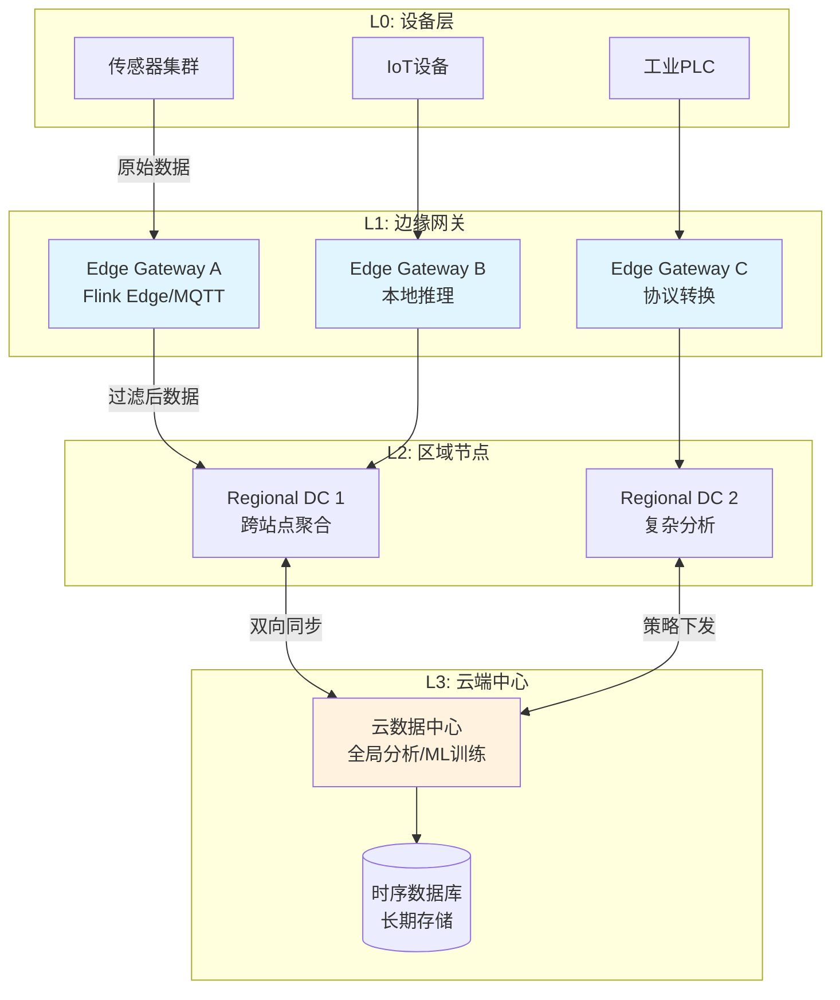
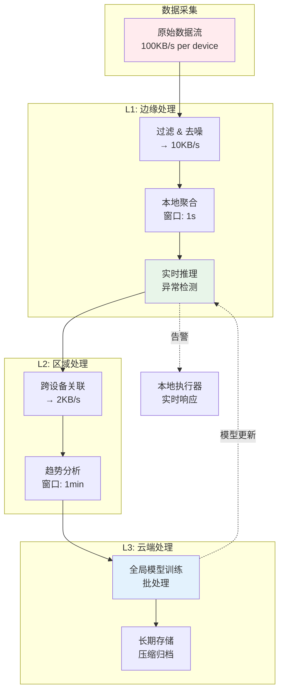
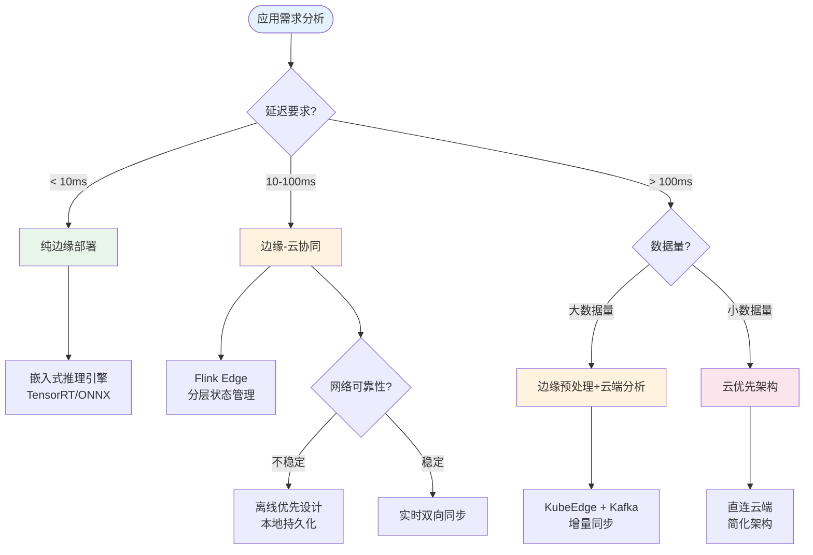
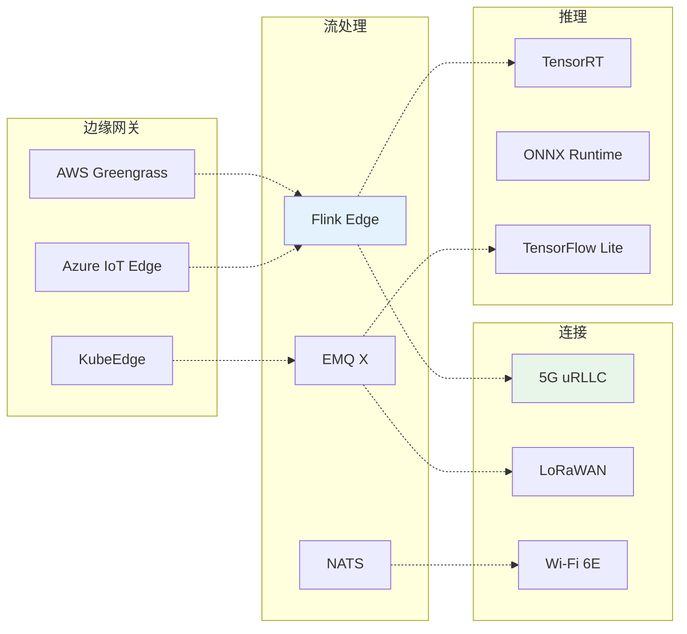

# 边缘流处理架构与IoT实时分析

> 所属阶段: Knowledge/06-frontier | 前置依赖: [Flink部署模式](../../Flink/10-deployment/flink-deployment-ops-complete-guide.md), [流处理系统对比](../01-concept-atlas/streaming-models-mindmap.md) | 形式化等级: L4

---

## 1. 概念定义 (Definitions)

### 1.1 边缘流处理 (Edge Stream Processing)

**Def-K-06-190** [边缘流处理]: 边缘流处理是指在数据源产生地或其邻近的计算节点上，对连续到达的数据流进行实时处理、过滤、聚合和推理的计算范式。形式上，边缘流处理系统可建模为六元组：

$$\mathcal{E} = \langle \mathcal{N}, \mathcal{S}, \mathcal{F}, \mathcal{C}, \mathcal{G}, \mathcal{Q} \rangle$$

其中：

- $\mathcal{N} = \{n_1, n_2, ..., n_k\}$: 边缘节点集合，每个节点具有资源约束 $(CPU, MEM, PWR)$
- $\mathcal{S}$: 数据流集合，$s_i: \mathbb{T} \rightarrow \mathcal{D}$ 表示时间序列数据流
- $\mathcal{F}: \mathcal{S} \rightarrow \mathcal{S}'$: 流处理算子集合（过滤、映射、窗口聚合）
- $\mathcal{C} \subseteq \mathcal{N} \times \mathcal{N}$: 节点间连接拓扑
- $\mathcal{G}: \mathcal{N} \rightarrow \{0,1,2\}$: 层级函数，0=Edge, 1=Regional, 2=Cloud
- $\mathcal{Q}$: 服务质量约束（延迟上界 $L_{max}$、可用性 $A_{min}$）

### 1.2 边缘计算关键指标

**Def-K-06-191** [边缘计算延迟模型]: 边缘流处理的端到端延迟由以下组件构成：

$$L_{total} = L_{gen} + L_{proc}^{edge} + L_{net} + L_{proc}^{cloud} + L_{storage}$$

边缘计算的核心价值在于将 $L_{net}$ 和 $L_{proc}^{cloud}$ 最小化，通过本地处理实现 $L_{total} \ll L_{cloud-only}$。

| 指标类型 | 云端处理 | 边缘处理 | 改善幅度 |
|---------|---------|---------|---------|
| 网络延迟 | 50-200ms | 1-10ms | 10-100x |
| 端到端延迟 | 100-500ms | 5-50ms | 5-20x |
| 带宽消耗 | 100% | 5-30% | 3-20x |
| 数据隐私风险 | 高 | 低 | - |

### 1.3 分层架构定义

**Def-K-06-192** [边缘-云协同层级]:

| 层级 | 位置 | 延迟要求 | 处理能力 | 典型功能 |
|-----|------|---------|---------|---------|
| **L0: 设备层** | IoT传感器/执行器 | <1ms | 微控制器 | 数据采集、简单控制 |
| **L1: 边缘网关** | 现场/本地 | <10ms | 边缘服务器 | 协议转换、本地聚合、实时推理 |
| **L2: 区域节点** | 城市/园区 | <50ms | 小型数据中心 | 跨站点协调、复杂分析 |
| **L3: 云端中心** | 公有云 | <500ms | 大规模集群 | 全局分析、模型训练、长期存储 |

---

## 2. 属性推导 (Properties)

### 2.1 边缘vs云计算对比

**Lemma-K-06-125** [边缘计算优势边界]: 对于数据密集型IoT应用，当满足以下条件时，边缘处理优于纯云处理：

$$\frac{D_{raw}}{B_{available}} \cdot C_{transfer} > T_{edge-proc} + C_{edge-compute}$$

其中 $D_{raw}$ 为原始数据量，$B_{available}$ 为可用带宽，$C_{transfer}$ 为传输成本系数。

**Prop-K-06-126** [数据本地化收益]: 在边缘执行数据预过滤和聚合，可将上传数据量减少 **70-95%**[^1]。

### 2.2 2026年边缘计算趋势

**Prop-K-06-127** [边缘AI融合]: 到2026年，超过 **75%** 的企业数据将在边缘产生和处理（2020年仅为10%），主要驱动因素包括：

1. **5G/6G网络普及**: 边缘节点与云之间的高带宽、低延迟连接
2. **AI芯片下沉**: NPU/TPU在边缘设备上的部署成本下降 60%+
3. **数据主权法规**: GDPR、数据本地化要求推动本地处理
4. **实时性需求**: 自动驾驶、工业控制等场景的亚毫秒级延迟要求

---

## 3. 关系建立 (Relations)

### 3.1 架构模式映射

| 模式 | 适用场景 | 数据流向 | 容错策略 |
|-----|---------|---------|---------|
| **边缘-云协同** | 通用IoT分析 | 双向流式同步 | 断网本地缓存 |
| **分层处理** | 大规模部署 | 逐级聚合上传 | 层级故障转移 |
| **离线优先** | 弱网环境 | 本地为主，间歇同步 | 本地持久化 |
| **数据主权** | 合规敏感 | 地域隔离 | 加密+审计 |

### 3.2 技术栈对应关系

```
┌─────────────────────────────────────────────────────────────────┐
│                      边缘流处理技术栈                            │
├──────────────────┬──────────────────┬──────────────────────────┤
│   边缘网关平台    │   轻量级流处理    │      连接技术            │
├──────────────────┼──────────────────┼──────────────────────────┤
│ AWS Greengrass   │ Apache Flink EMQ │ 5G (uRLLC)               │
│ Azure IoT Edge   │ Kafka Edge/NATS  │ LoRaWAN (LPWAN)          │
│ Google Edge TPU  │ MQTT brokers     │ Wi-Fi 6/7                │
│ KubeEdge         │ EdgeX Foundry    │ Satellite IoT            │
└──────────────────┴──────────────────┴──────────────────────────┘
```

---

## 4. 论证过程 (Argumentation)

### 4.1 架构设计决策树

**Def-K-06-193** [边缘部署决策函数]: 给定应用特征向量 $\vec{A} = (d_{latency}, v_{data}, c_{compute}, r_{reliability})$，边缘部署决策为：

$$\text{Deploy}_{edge}(\vec{A}) = \begin{cases}
\text{Pure Edge} & d_{latency} < 10ms \land c_{compute} \text{ 足够} \\
\text{Edge-Cloud} & 10ms \leq d_{latency} < 100ms \\
\text{Cloud-First} & d_{latency} \geq 100ms \land v_{data} \text{ 较小}
\end{cases}$$

### 4.2 离线优先设计原则

**Def-K-06-194** [离线优先约束]: 离线优先架构必须满足 CAP 变体——在断网场景下优先保证 **可用性(A)** 和 **分区容忍性(P)**，通过最终一致性实现数据同步：

$$\text{Offline-First} \implies \forall t: \text{Local-Available}(t) \land \text{Eventual-Consistent}(t + \Delta)$$

---

## 5. 形式证明 / 工程论证 (Proof / Engineering Argument)

### 5.1 边缘部署资源优化定理

**Thm-K-06-125** [Flink边缘资源优化]: 在资源受限的边缘节点（内存 < 4GB）上，Flink 作业的最优配置满足：

1. **状态后端选择**: RocksDB > HeapStateBackend（当状态 > 100MB）
   - 证明: 边缘节点 JVM 堆内存受限，堆外存储避免 GC 抖动

2. **检查点间隔**: $T_{checkpoint} \geq 5 \times T_{process-batch}$
   - 证明: 减少 I/O 争用，保证处理吞吐

3. **并行度**: $P_{optimal} = \min(N_{cores}, \lceil \frac{T_{process}}{T_{deadline}} \rceil)$
   - 避免过度并行导致的上下文切换开销

### 5.2 断网容错工程论证

**Thm-K-06-126** [断网容错保证]: 边缘流处理系统在网络分区期间的数据不丢失条件：

$$\text{Data-Loss-Free} \iff \text{Buffer}_{local} \geq R_{input} \times T_{outage}^{max}$$

工程实现策略：

| 策略 | 实现机制 | 容量需求 |
|-----|---------|---------|
| 本地持久化 | RocksDB/WAL | 状态大小 + 24h数据 |
| 背压降级 | 采样/丢弃非关键数据 | 动态调整 |
| 分级存储 | Hot→Warm→Cold 数据分层 | 3x 原始数据 |
| 断点续传 | 基于水印的增量同步 | 检查点元数据 |

### 5.3 数据同步策略

**Thm-K-06-127** [边缘-云数据一致性]: 采用 **Delta Sync + CRDT** 机制可实现边缘-云数据的最终一致性：

$$\mathcal{D}_{cloud}(t) = \mathcal{D}_{cloud}(t_0) \oplus \bigoplus_{i=1}^{n} \Delta_i^{edge}$$

其中 $\oplus$ 为 CRDT 合并操作，保证交换律、结合律、幂等律。

---

## 6. 实例验证 (Examples)

### 6.1 智能制造预测性维护

**场景**: 工厂 1000+ 机床传感器，实时监测振动、温度、电流

**架构**:
- **L1边缘**: 机床网关本地 FFT 分析，异常检测延迟 < 50ms
- **L2区域**: 车间级趋势分析，设备健康评分
- **L3云端**: 全局模型训练，故障预测准确率 > 92%

**效果**: 非计划停机减少 45%，维护成本降低 30%[^2]

### 6.2 自动驾驶实时决策

**场景**: 车载传感器融合（LiDAR + 摄像头 + 雷达）

**架构**:
- **车载边缘**: 100+ TOPS 算力，感知融合延迟 < 10ms
- **V2X边缘**: 路侧单元协调，编队行驶决策
- **云端**: HDMap 更新，交通规则同步

**约束**: 安全关键决策必须本地完成，延迟 < 20ms（ISO 26262）

### 6.3 智慧城市交通流管理

**场景**: 城市级交通信号灯自适应控制

**数据流**:
```
摄像头/雷达 → 路口边缘盒子 → 区域交通中心 → 城市大脑
    (10ms)         (50ms)           (200ms)
```

**边缘价值**: 路口级实时优化，云端提供策略模型更新

### 6.4 远程医疗监控

**场景**: ICU 患者生命体征连续监测

**合规要求**:
- HIPAA/GDPR 数据本地化
- 本地告警延迟 < 1s
- 云端用于长期趋势分析和研究

---

## 7. 可视化 (Visualizations)

### 7.1 边缘-云协同架构全景

以下架构图展示了典型的边缘-云协同流处理系统：



### 7.2 分层处理数据流



### 7.3 边缘流处理决策树



### 7.4 技术栈对比矩阵



---

## 8. 挑战与解决方案

### 8.1 带宽限制

**挑战**: 边缘到云的回传带宽有限（通常 < 100Mbps）

**解决方案**:
- 数据压缩：从 100KB/s 压缩至 2KB/s（95% 减少）
- 增量同步：仅传输变化数据
- 智能采样：基于重要性自适应采样

### 8.2 设备异构性

**挑战**: 边缘设备 CPU/内存/OS 差异巨大

**解决方案**:
- 容器化部署：Docker + 资源限制
- 算子自动降级：复杂算子→简化算子
- 自适应并行度：根据负载动态调整

### 8.3 安全与隐私

**挑战**: 边缘设备物理暴露，易被攻击

**解决方案矩阵**:

| 威胁 | 防护措施 | 实现技术 |
|-----|---------|---------|
| 物理窃取 | 硬件安全模块 | TPM/TEE |
| 中间人攻击 | 端到端加密 | TLS 1.3/mTLS |
| 恶意代码 | 容器沙箱 | gVisor/Kata |
| 数据泄露 | 边缘匿名化 | 差分隐私/联邦学习 |

### 8.4 运维复杂性

**挑战**: 海量边缘设备的监控、更新、故障恢复

**Def-K-06-195** [边缘运维自动化]: 边缘运维复杂度随节点数 $N$ 呈亚线性增长：

$$O_{ops}(N) = O(\log N) \text{ (通过自动化编排)}$$

**关键技术**:
- GitOps: 声明式配置管理
- AIOps: 异常检测与自愈
- 蓝绿部署: 零停机更新

---

## 9. 引用参考 (References)

[^1]: Gartner Research, "Edge Computing Market Trends 2026", 2026. https://www.gartner.com/en/newsroom/press-releases
[^2]: McKinsey & Company, "The Future of Manufacturing: Edge Computing in Industry 4.0", 2025.
[^3]: Apache Flink Documentation, "Deployment in Resource-Constrained Environments", 2025. https://nightlies.apache.org/flink/flink-docs-stable/docs/deployment/resource-constrained/
[^4]: AWS IoT Greengrass Documentation, "Edge ML Inference", 2025. https://docs.aws.amazon.com/greengrass/
[^5]: Azure IoT Edge Documentation, "Offline Capabilities", 2025. https://docs.microsoft.com/azure/iot-edge/
[^6]: 5G-ACIA, "5G for Connected Industries and Automation", White Paper, 2025.
[^7]: LoRa Alliance, "LoRaWAN Specification v1.1", 2025.
[^8]: Shi, W., et al. "Edge Computing: Vision and Challenges." IEEE Internet of Things Journal, 3(5), 637-646, 2016.
[^9]: Satyanarayanan, M. "The Emergence of Edge Computing." Computer, 50(1), 30-39, 2017.
[^10]: ISO 26262, "Road vehicles — Functional safety", 2025.

---

*文档版本: v1.0 | 最后更新: 2026-04-03 | 状态: 已完成*
