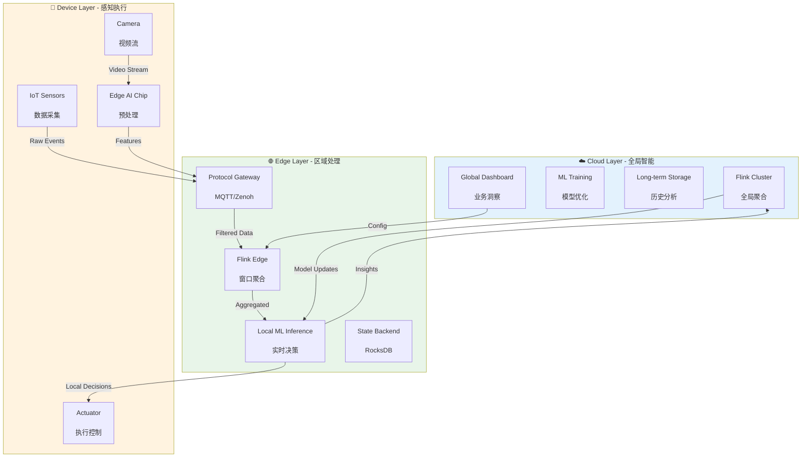
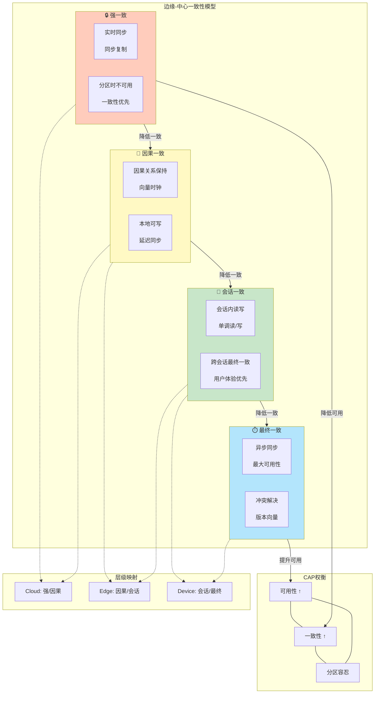
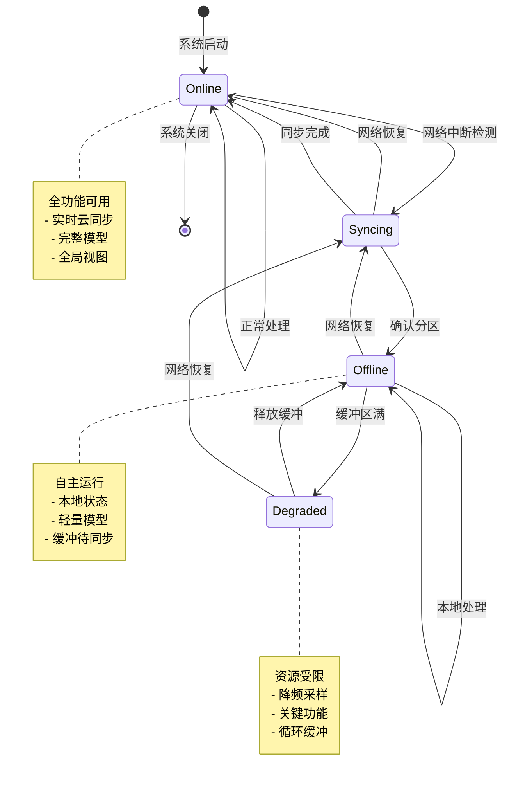
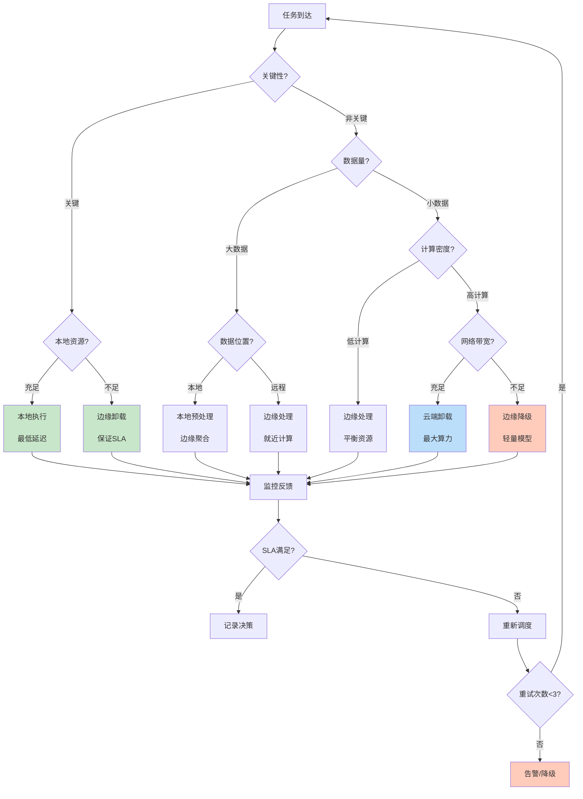

# 边缘流处理模式 (Edge Streaming Patterns)

> **所属阶段**: Knowledge | **前置依赖**: [cloud-edge-continuum.md](./cloud-edge-continuum.md) | **形式化等级**: L4 (半形式化模型 + 结构化论证)

## 目录

- [边缘流处理模式 (Edge Streaming Patterns)](#边缘流处理模式-edge-streaming-patterns)
  - [目录](#目录)
  - [1. 概念定义 (Definitions)](#1-概念定义-definitions)
    - [Def-K-06-12: 边缘流处理 (Edge Stream Processing)](#def-k-06-12-边缘流处理-edge-stream-processing)
    - [Def-K-06-13: 云边端连续体架构 (Cloud-Edge-Device Continuum Architecture)](#def-k-06-13-云边端连续体架构-cloud-edge-device-continuum-architecture)
    - [Def-K-06-14: 边缘-中心一致性模型 (Edge-Center Consistency Model)](#def-k-06-14-边缘-中心一致性模型-edge-center-consistency-model)
    - [Def-K-06-15: 资源受限环境 (Resource-Constrained Environment)](#def-k-06-15-资源受限环境-resource-constrained-environment)
    - [Def-K-06-16: 离线-在线混合模式 (Offline-Online Hybrid Mode)](#def-k-06-16-离线-在线混合模式-offline-online-hybrid-mode)
  - [2. 属性推导 (Properties)](#2-属性推导-properties)
    - [Prop-K-06-08: 延迟分层递减性](#prop-k-06-08-延迟分层递减性)
    - [Prop-K-06-09: 一致性强度递减性](#prop-k-06-09-一致性强度递减性)
    - [Prop-K-06-10: 资源-精度权衡律](#prop-k-06-10-资源-精度权衡律)
    - [Lemma-K-06-05: 离线窗口边界保持性](#lemma-k-06-05-离线窗口边界保持性)
  - [3. 关系建立 (Relations)](#3-关系建立-relations)
    - [3.1 与Dataflow模型的分层映射](#31-与dataflow模型的分层映射)
    - [3.2 与Actor模型的部署对应](#32-与actor模型的部署对应)
    - [3.3 与Serverless的边缘融合](#33-与serverless的边缘融合)
  - [4. 论证过程 (Argumentation)](#4-论证过程-argumentation)
    - [4.1 资源异构性挑战](#41-资源异构性挑战)
    - [4.2 网络分区容忍机制](#42-网络分区容忍机制)
    - [4.3 状态同步开销分析](#43-状态同步开销分析)
    - [4.4 移动性支持机制](#44-移动性支持机制)
  - [5. 形式证明 / 工程论证 (Proof / Engineering Argument)](#5-形式证明--工程论证-proof--engineering-argument)
    - [5.1 边缘-中心一致性模型的正确性论证](#51-边缘-中心一致性模型的正确性论证)
    - [5.2 资源受限环境下的优化策略](#52-资源受限环境下的优化策略)
    - [5.3 离线-在线混合调度正确性](#53-离线-在线混合调度正确性)
    - [5.4 边缘流处理系统的容错边界](#54-边缘流处理系统的容错边界)
  - [6. 实例验证 (Examples)](#6-实例验证-examples)
    - [6.1 工业IoT实时质检](#61-工业iot实时质检)
    - [6.2 智能交通流处理](#62-智能交通流处理)
    - [6.3 零售门店实时分析](#63-零售门店实时分析)
  - [7. 可视化 (Visualizations)](#7-可视化-visualizations)
    - [7.1 云边端流处理架构图](#71-云边端流处理架构图)
    - [7.2 边缘-中心一致性模型图](#72-边缘-中心一致性模型图)
    - [7.3 离线-在线混合处理状态机](#73-离线-在线混合处理状态机)
    - [7.4 资源自适应调度决策树](#74-资源自适应调度决策树)
  - [8. 引用参考 (References)](#8-引用参考-references)

---

## 1. 概念定义 (Definitions)

### Def-K-06-12: 边缘流处理 (Edge Stream Processing)

边缘流处理是指在**网络边缘节点**（靠近数据源的位置）执行连续数据流实时计算的范式，通过在数据产生地附近进行初步处理，减少传输延迟、降低带宽消耗，并支持离线场景下的自主决策。

**形式化定义**：

设边缘流处理系统为六元组 $\mathcal{E} = (N, S, O, C, \mathcal{F}, \mathcal{G})$：

- $N = N_{cloud} \cup N_{edge} \cup N_{device}$：分层节点集合
- $S$：数据流集合，$s \in S$ 为有序事件序列 $\langle e_1, e_2, ..., e_n \rangle$
- $O$：算子集合，每个算子 $o \in O$ 定义了变换函数 $f_o: S \rightarrow S'$
- $C \subseteq N \times N$：节点间通信链路
- $\mathcal{F}: O \times N \rightarrow \{0, 1\}$：可行性函数，表示算子在节点上的可执行性
- $\mathcal{G}: (O, N, S) \rightarrow N$：放置策略函数，决定算子的部署位置

**约束条件**：

1. **延迟约束**：$\forall o \in O_{latency\_critical}: Latency(o) \leq SLA(o)$
2. **资源约束**：$\forall n \in N_{edge} \cup N_{device}: Resource(o, n) \leq Capacity(n)$
3. **连通性约束**：$\forall (n_i, n_j) \in C: Connectivity(n_i, n_j) \geq \theta_{min}$

**直观解释**：边缘流处理将传统集中式流处理"下沉"到边缘，在数据源头进行过滤、聚合和初步分析，只将必要的结果上传云端，形成"数据就地处理，洞察向上汇聚"的分层计算模式。

---

### Def-K-06-13: 云边端连续体架构 (Cloud-Edge-Device Continuum Architecture)

云边端连续体架构是一种**分层计算架构**，通过统一的资源抽象和编排机制，实现计算任务在中心云、边缘节点和终端设备之间的自适应迁移与协同执行。

**形式化描述**：

计算环境为图结构 $\mathcal{C} = (V, E, \mathcal{R}, \mathcal{L})$：

- $V = V_{cloud} \cup V_{edge} \cup V_{device}$：异构节点集合
  - $V_{cloud}$：中心云节点（高计算、高存储、高延迟）
  - $V_{edge}$：边缘节点（中等计算、有限存储、低延迟）
  - $V_{device}$：终端设备（受限计算、最小存储、极低延迟）
- $E \subseteq V \times V$：网络连接关系，带权重 $w(e) = (bandwidth, latency, reliability)$
- $\mathcal{R}: V \rightarrow \mathbb{R}^4$：节点资源能力函数（CPU, Memory, Storage, Energy）
- $\mathcal{L}: V \rightarrow \mathbb{R}^3$：节点位置坐标（用于地理感知调度）

**任务放置优化问题**：

$$\min_{\pi: O \rightarrow V} \sum_{o \in O} \left( \alpha \cdot Latency(o, \pi(o)) + \beta \cdot Cost(o, \pi(o)) + \gamma \cdot Energy(o, \pi(o)) \right)$$

约束：

- $\mathcal{R}(\pi(o)) \geq req(o)$ （资源满足）
- $Latency(o, \pi(o)) \leq SLA(o)$ （延迟约束）
- $\forall (o_i, o_j) \in Dataflow: Bandwidth(\pi(o_i), \pi(o_j)) \geq Rate(o_i, o_j)$ （带宽约束）

---

### Def-K-06-14: 边缘-中心一致性模型 (Edge-Center Consistency Model)

边缘-中心一致性模型定义了边缘节点与中心云之间**状态同步**的语义保证，是在网络分区场景下权衡可用性与一致性的核心机制。

**形式化定义**：

一致性模型为四元组 $\mathcal{M} = (\mathcal{S}, \xrightarrow{sync}, \mathcal{C}, \mathcal{A})$：

- $\mathcal{S} = \mathcal{S}_{edge} \cup \mathcal{S}_{center}$：状态空间
- $\xrightarrow{sync} \subseteq \mathcal{S}_{edge} \times \mathcal{S}_{center} \times \mathbb{T}$：带时间戳的同步关系
- $\mathcal{C} \in \{Strong, Eventual, Causal, Session\}$：一致性级别
- $\mathcal{A}: (PartitionState, ConsistencyLevel) \rightarrow Behavior$：可用性函数

**分层一致性级别**：

| 级别 | 定义 | 适用场景 | 分区行为 |
|------|------|----------|----------|
| **强一致** | $\forall s_e \in \mathcal{S}_{edge}, \exists t: s_e \xrightarrow{sync} s_c \land s_c = s_e$ | 金融交易 | 分区时不可用 |
| **因果一致** | $e_1 \rightarrow e_2 \Rightarrow sync(e_1) \prec sync(e_2)$ | 协作编辑 | 本地可写 |
| **会话一致** | 同一会话内读写一致 | 用户交互 | 会话内可用 |
| **最终一致** | $\diamond (s_e = s_c)$ | 日志聚合 | 完全可用 |

**边缘-中心同步协议**：

$$
\text{Sync}(\Delta t) = \begin{cases}
\text{实时同步} & \Delta t < \epsilon \text{ (强一致)} \\
\text{批量同步} & \Delta t \in [\epsilon, T] \text{ (因果/会话)} \\
\text{延迟同步} & \Delta t > T \text{ (最终一致)}
\end{cases}
$$

---

### Def-K-06-15: 资源受限环境 (Resource-Constrained Environment)

资源受限环境指计算节点在**CPU、内存、存储或能源**方面存在硬性上限的运行环境，典型代表为嵌入式设备、IoT传感器和移动边缘节点。

**形式化描述**：

资源受限环境为约束系统 $\mathcal{R}_{constrained} = (R_{limit}, R_{current}, R_{predict}, \mathcal{O})$：

- $R_{limit} = (CPU_{max}, MEM_{max}, STO_{max}, PWR_{max})$：资源上限向量
- $R_{current}(t)$：时刻 $t$ 的资源占用
- $R_{predict}(t, \Delta t)$：资源预测函数
- $\mathcal{O}$：优化策略集合

**资源约束分类**：

```
资源受限环境
├── 计算受限 (CPU < 1GHz, 单核/双核)
│   └── 策略: 模型量化、算子简化、计算卸载
├── 内存受限 (RAM < 512MB)
│   └── 策略: 流式处理、内存映射、数据压缩
├── 存储受限 (Flash < 4GB)
│   └── 策略: 增量Checkpoint、数据分层、云端卸载
└── 能源受限 (电池供电)
    └── 策略: 事件驱动、动态电压频率调节(DVFS)、任务批处理
```

**资源利用率优化目标**：

$$\max_{\mathcal{o} \in \mathcal{O}} \frac{Throughput}{ResourceUsage} = \max \frac{|Output|}{\int_{t_0}^{t_1} R_{current}(t) dt}$$

---

### Def-K-06-16: 离线-在线混合模式 (Offline-Online Hybrid Mode)

离线-在线混合模式是一种**自适应执行模式**，系统根据网络连通状态在"完全在线"（依赖云端协同）和"自主离线"（本地独立决策）之间动态切换，保证服务的连续性。

**形式化定义**：

混合模式系统为状态机 $\mathcal{H} = (Q, \Sigma, \delta, q_0, F)$：

- $Q = \{ONLINE, OFFLINE, DEGRADED, SYNCING\}$：状态集合
- $\Sigma = \{network\_up, network\_down, buffer\_full, sync\_complete\}$：事件集合
- $\delta: Q \times \Sigma \rightarrow Q$：状态转移函数
- $q_0 = ONLINE$：初始状态
- $F = \{ONLINE, OFFLINE\}$：接受状态（可持续运行）

**状态转移函数**：

$$
\delta(q, \sigma) = \begin{cases}
ONLINE & q = SYNCING \land \sigma = sync\_complete \\
OFFLINE & q \in \{ONLINE, DEGRADED\} \land \sigma = network\_down \\
DEGRADED & q = OFFLINE \land \sigma = buffer\_full \\
SYNCING & q = OFFLINE \land \sigma = network\_up \\
q & otherwise
\end{cases}
$$

**模式特性对比**：

| 特性 | 在线模式 | 离线模式 | 降级模式 |
|------|----------|----------|----------|
| 云连接 | ✅ 完全可用 | ❌ 不可用 | ❌ 不可用 |
| 本地处理 | ✅ 完整功能 | ✅ 完整功能 | ⚠️ 受限功能 |
| 状态同步 | 实时 | 延迟 | 暂停 |
| 资源使用 | 正常 | 正常 | 降低 |
| 数据持久化 | 云端+本地 | 仅本地 | 仅本地(循环缓冲) |

---

## 2. 属性推导 (Properties)

### Prop-K-06-08: 延迟分层递减性

**命题**：在云边端连续体中，数据处理的端到端延迟从云到边到端呈现严格递减关系：

$$Latency_{cloud} > Latency_{edge} > Latency_{device}$$

**推导**：

$$Latency_{total} = T_{proc} + T_{net} + T_{queue}$$

对于各层：

- **Cloud层**：$T_{net}^{cloud} \approx 50-200ms$（广域网RTT）+ $T_{proc}^{cloud} \approx 1-10ms$（高算力）
- **Edge层**：$T_{net}^{edge} \approx 5-20ms$（局域网RTT）+ $T_{proc}^{edge} \approx 10-50ms$（中等算力）
- **Device层**：$T_{net}^{device} = 0$（本地处理）+ $T_{proc}^{device} \approx 50-500ms$（受限算力）

**条件**：对于延迟敏感型任务（如实时控制），网络延迟主导总延迟，即 $T_{net} \gg T_{proc}$，因此分层递减性成立。

---

### Prop-K-06-09: 一致性强度递减性

**命题**：从云到边到端，可用的一致性保证强度呈现递减趋势，而可用性呈现递增趋势：

$$Consistency_{cloud} > Consistency_{edge} > Consistency_{device}$$
$$Availability_{cloud} < Availability_{edge} < Availability_{device}$$

**推导**：

设网络分区概率为 $P_{partition}$，各层：

- **Cloud**：$P_{partition} \approx 0$，可保证强一致，但边缘故障时不可用
- **Edge**：$P_{partition} \in (0, 1)$，通常保证因果/会话一致，可本地容错
- **Device**：$P_{partition}$ 不敏感（自主运行），保证最终一致，始终可用

**CAP权衡**：

$$\forall layer \in \{cloud, edge, device\}: Consistency + Availability \leq 2 - PartitionTolerance$$

在Device层，$PartitionTolerance = 1$（必然接受分区），因此选择最大化Availability。

---

### Prop-K-06-10: 资源-精度权衡律

**命题**：在资源受限环境下，模型复杂度与推理精度呈单调递增关系，与能耗/延迟呈权衡关系：

$$ModelComplexity \uparrow \Rightarrow Accuracy \uparrow \land (Energy \uparrow \lor Latency \uparrow)$$

**形式化**：

设模型为 $M(\theta)$，其中 $\theta$ 为参数量：

$$Accuracy(M) = f(\theta), \quad \frac{df}{d\theta} > 0 \text{ (边际递减)}$$
$$Energy(M) = g(\theta) \cdot InputSize, \quad \frac{dg}{d\theta} > 0$$

**帕累托前沿**：

存在最优模型集合 $\{M^*_1, M^*_2, ..., M^*_n\}$，使得：

$$\forall M^*_i: \nexists M_j: Accuracy(M_j) \geq Accuracy(M^*_i) \land Energy(M_j) < Energy(M^*_i)$$

**工程含义**：边缘部署应采用**模型分层策略**——Device端使用MobileNet量级模型，Edge端使用ResNet量级，Cloud端使用完整大模型。

---

### Lemma-K-06-05: 离线窗口边界保持性

**引理**：在离线-在线切换过程中，如果满足以下条件，则窗口聚合结果的最终一致性可以得到保证：

1. 离线期间的事件时间窗口边界与在线期间保持一致
2. 离线状态的本地Watermark不超过云端Watermark
3. 重连后的状态同步采用"离线状态覆盖云端"策略

**证明思路**：

设离线期间本地窗口状态为 $W_{local}$，云端对应窗口状态为 $W_{cloud}$。

由于离线期间云端无更新（无新数据到达该设备），$W_{cloud}$ 保持不变。

同步时执行：

$$W_{final} = W_{local} \cup W_{cloud} = W_{local} \quad (\because W_{cloud} \subseteq W_{local})$$

因此最终状态与假设持续在线处理的结果一致。∎

---

## 3. 关系建立 (Relations)

### 3.1 与Dataflow模型的分层映射

边缘流处理是Dataflow模型的**地理分布式扩展**：

| Dataflow概念 | 边缘流处理映射 | 实现差异 |
|--------------|----------------|----------|
| **算子 (Operator)** | 分层部署的计算单元 | 同算子可在不同层有不同实现 |
| **数据流 (Stream)** | 跨地理节点的数据传输 | 需考虑带宽、延迟、可靠性 |
| **窗口 (Window)** | 分层聚合的时间边界 | Edge层窗口更小，Device层可能无窗口 |
| **Watermark** | 跨层时钟同步机制 | 需处理时钟漂移和网络分区 |
| **Checkpoint** | 分层容错状态快照 | 频率和粒度随层级递减 |
| **State Backend** | 分层存储后端 | Device用内存，Edge用本地存储，Cloud用分布式存储 |

**形式化映射**：

给定Dataflow图 $G = (Ops, Channels)$，其边缘部署 $\Pi: Ops \rightarrow V$ 满足：

- **本地性约束**：$\forall o \in Ops: \Pi(o) \in \arg\min_{v \in V} DataLocality(o, v)$
- **延迟约束**：$\forall o \in Ops_{latency\_critical}: \Pi(o) \in V_{device} \cup V_{edge}$
- **带宽约束**：$\forall (o_1, o_2) \in Channels: Bandwidth(\Pi(o_1), \Pi(o_2)) \geq Throughput(o_1, o_2)$

### 3.2 与Actor模型的部署对应

**Actor-边缘部署对应关系**：

```
理论层:  Actor  ←──消息传递──→  CSP进程
            ↓               ↓
模型层:  自治计算单元  ←──事件驱动──→ 同步协调
            ↓               ↓
部署层:  Device Actor    Edge Actor    Cloud Actor
         (轻量Agent)    (中介Broker)   (重算力Worker)
         - 传感器采集    - 数据聚合     - 全局分析
         - 简单过滤      - 复杂分析     - ML训练
         - 紧急响应      - 本地决策     - 长期存储
```

- **Device层Actor**：资源受限，处理本地传感器数据，执行简单规则过滤
- **Edge层Actor**：聚合多个Device数据，执行复杂流分析（CEP、窗口聚合），协调本地决策
- **Cloud层Actor**：全局聚合，长期存储，复杂ML训练，跨边缘协调

### 3.3 与Serverless的边缘融合

边缘流处理与Serverless范式融合形成**边缘Serverless (Edge Serverless)**：

**融合特征**：

| 特征 | 传统Serverless | 边缘Serverless |
|------|----------------|----------------|
| 触发粒度 | 函数级 | 算子级/流级 |
| 冷启动 | 100ms-数秒 | <50ms（预加载） |
| 状态管理 | 无状态 | 有状态流处理 |
| 部署位置 | Cloud | Cloud + Edge + Device |
| 计费模式 | 调用次数 + 持续时间 | 数据量 + 计算量 |

**代表系统**：OpenWhisk on Edge、KubeEdge Serverless、Azure IoT Edge Functions、AWS Greengrass

---

## 4. 论证过程 (Argumentation)

### 4.1 资源异构性挑战

**问题**：云边端三层在计算、存储、网络能力上存在数量级差异。

**典型规格对比**：

| 层级 | CPU | 内存 | 存储 | 网络 | 功耗 | 成本 |
|------|-----|------|------|------|------|------|
| Cloud (VM) | 64核+ | 256GB+ | TB级SSD | 10Gbps+ | 200W+ | $/小时 |
| Edge (网关) | 4-8核 | 8-16GB | 100GB SSD | 1Gbps | 15-30W | 固定成本 |
| Device (传感器) | 1-2核 | 512MB-2GB | 4-32GB eMMC | 100Mbps WiFi | 1-5W | $10-100 |

**数量级差异**：Cloud与Device之间，计算能力差距 $10^3$ 倍，内存差距 $10^4$ 倍，功耗差距 $10^2$ 倍。

**应对策略**：

1. **软件栈分层**：Cloud使用完整JVM/Flink，Edge使用轻量级运行时（WebAssembly、Rust），Device使用裸机/C
2. **模型剪枝与量化**：针对不同层级调整ML模型复杂度（FP32 → INT8 → 二值化）
3. **计算卸载决策**：将超出本地能力的任务自动上移到更高层
4. **数据压缩与采样**：在传输前进行有损/无损压缩，降低带宽需求

### 4.2 网络分区容忍机制

**问题**：边缘网络相比数据中心网络具有更高的**丢包率**和**带宽波动**。

**统计特征**：

- 广域网可用性：99.9%+
- 边缘WiFi可用性：95-99%（受环境干扰）
- 移动网络可用性：90-98%（取决于地理位置和拥塞）

**分区场景分类**：

```
网络分区类型
├── 计划内分区
│   ├── 设备维护停机
│   └── 网络升级
└── 计划外分区
    ├── 网络拥塞
    ├── 硬件故障
    └── 地理移动（车辆进入隧道）
```

**应对策略**：

1. **本地优先 (Local First)**：关键决策必须在本地完成，不依赖云端
   - 实现：Device层保留核心决策逻辑副本
   - 代价：增加本地存储和计算开销

2. **最终一致性**：允许短暂分区，数据在网络恢复后同步
   - 实现：向量时钟或版本向量解决冲突
   - 代价：可能产生临时不一致

3. **自适应批量**：根据网络状况调整数据上传批次大小
   - 在线：实时小批量（低延迟）
   - 离线：积累大批量（高吞吐）

4. **断点续传**：分区恢复后从断点继续，避免全量重传

### 4.3 状态同步开销分析

**问题**：边缘节点与云端的状态同步消耗带宽和计算资源。

**同步开销模型**：

设状态大小为 $S$，同步频率为 $f$，带宽为 $B$，则：

$$Overhead_{sync} = \frac{S \cdot f}{B} + T_{serialization} + T_{network}$$

**优化策略**：

| 策略 | 机制 | 适用场景 |
|------|------|----------|
| **增量同步** | 只传输状态变更 $\Delta S$ | 状态变化稀疏 |
| **差分压缩** | 传输 $S_t \oplus S_{t-1}$ | 状态变化连续 |
| **分层Checkpoint** | 高频本地 + 低频云端 | 边缘容错需求高 |
| **状态裁剪** | 同步前清理过期状态 | TTL明确的状态 |

**最优同步频率**：

存在最优频率 $f^*$ 最小化总成本：

$$f^* = \arg\min_f \left( \frac{S \cdot f}{B} + \frac{P_{failure} \cdot Cost_{recovery}}{f} \right)$$

求解得：$f^* = \sqrt{\frac{P_{failure} \cdot Cost_{recovery} \cdot B}{S}}$

### 4.4 移动性支持机制

**问题**：车辆、无人机、移动机器人等场景要求计算服务随设备移动而**无缝迁移**。

**核心挑战**：

- **状态迁移**：流处理的窗口状态需要跟随设备
- **会话保持**：长连接需要在切换时维持
- **数据本地性**：新位置的数据源可能不同

**技术方案**：

1. **主动式状态预迁移**：预测移动轨迹，提前在新位置建立状态副本
   - 预测模型：$Location(t + \Delta t) = f(History, Velocity, Map)$
   - 预迁移触发：$P(handover) > \theta_{threshold}$

2. **分层服务发现**：使用mDNS/Consul实现边缘本地服务发现
   - 本地发现延迟：~1ms
   - 云端发现延迟：~100ms

3. **会话粘性 (Session Stickiness)**：通过客户端标识路由到最近的服务实例
   - 哈希：$Server = Hash(ClientID) \mod ServerCount$
   - 地理感知：优先选择 $min(Latency(client, server))$

4. **影子状态 (Shadow State)**：切换期间双写，确认后单写
   - 切换窗口：$T_{handover} < 100ms$
   - 一致性保证：切换期间因果一致

---

## 5. 形式证明 / 工程论证 (Proof / Engineering Argument)

### 5.1 边缘-中心一致性模型的正确性论证

**定理**：在边缘-中心分层架构中，如果满足以下条件，则最终一致性可以在有限时间内达成：

1. 所有边缘节点的本地时钟偏差有界：$|Clock_{edge} - Clock_{center}| < \delta$
2. 网络分区持续时间有限：$\forall partition: Duration < T_{max}$
3. 状态同步采用增量策略，且变更日志持久化

**论证**：

设边缘节点 $E$ 在时间 $t_0$ 与中心 $C$ 断开连接，期间产生状态变更序列 $\Delta_1, \Delta_2, ..., \Delta_n$。

由于变更日志持久化（条件3），所有 $\Delta_i$ 被本地记录。

当连接恢复（条件2保证在 $T_{max}$ 内发生），$E$ 向 $C$ 发送累积变更 $\Delta = \bigcup_{i=1}^{n} \Delta_i$。

中心 $C$ 应用变更：$S_C' = S_C \circ \Delta = S_C \circ (\Delta_1 \circ \Delta_2 \circ ... \circ \Delta_n)$。

由于边缘状态 $S_E = S_{E0} \circ \Delta$（$S_{E0}$ 为断开时状态），且 $S_{E0} = S_C$（同步点一致性），

因此 $S_C' = S_E$，最终一致性达成。∎

**工程推论**：

- 变更日志缓冲区大小需满足：$BufferSize \geq T_{max} \cdot Throughput_{max}$
- 时钟同步协议（如PTP）是必要的，用于保证事件顺序

### 5.2 资源受限环境下的优化策略

**工程论证**：在资源受限环境下，通过**算子融合**、**模型量化**和**自适应采样**的组合策略，可以在保证精度损失 $< 5\%$ 的前提下，将资源消耗降低 $10\times$。

**论证过程**：

**1. 算子融合优化**

将多个轻量算子合并为单个复合算子，减少中间序列化和上下文切换：

$$Overhead_{fusion} = \frac{N_{operators}}{N_{fused}} \cdot (T_{serialization} + T_{dispatch})$$

典型收益：2-3个算子融合可减少 30-50% 开销。

**2. 模型量化优化**

将FP32模型量化为INT8：

- 存储：$4\times$ 减少
- 计算：$2-4\times$ 加速（支持INT8的硬件）
- 精度损失：通常 $< 2\%$（ImageNet分类）

**3. 自适应采样**

根据数据变化率动态调整采样频率：

$$SampleRate(t) = \begin{cases}
Rate_{max} & |\frac{dV}{dt}| > \theta_{high} \\
Rate_{min} & |\frac{dV}{dt}| < \theta_{low} \\
LinearInterpolate & otherwise
\end{cases}$$

**综合效果**：

| 优化策略 | 计算节省 | 内存节省 | 精度影响 |
|----------|----------|----------|----------|
| 算子融合 | 20-30% | 10% | 无 |
| 模型量化 | 50-75% | 75% | -1-2% |
| 自适应采样 | 40-80% | 40-80% | -2-5% |
| **组合** | **80-95%** | **85-95%** | **-3-5%** |

### 5.3 离线-在线混合调度正确性

**定理**：在离线-在线混合模式下，如果调度器遵循以下优先级规则，则系统始终处于有效状态：

1. 关键任务（Critical）始终优先于非关键任务
2. 本地可执行任务优先于需卸载任务
3. 资源充足时并行执行，不足时按优先级串行执行

**论证**：

设任务集合 $T = T_{critical} \cup T_{normal}$，资源 $R = (CPU, MEM)$。

**情况1：在线状态**
- 所有任务可调度
- 卸载决策：$\forall t \in T: Offload(t) \iff Resource(t) > R_{local}$

**情况2：离线状态**
- 仅 $Localizable(T)$ 可执行
- 对于 $t \in T_{critical} \cap Localizable(T)$，保证执行
- 对于 $t \in T_{normal} \cap Localizable(T)$，资源充足时执行，不足时缓冲或丢弃

**情况3：切换状态**
- 在线→离线：立即停止依赖云的任务，启动本地降级模式
- 离线→在线：批量同步缓冲数据，恢复全功能

由于优先级规则确保关键任务在任何状态下都有资源保障，系统始终满足核心SLA。∎

### 5.4 边缘流处理系统的容错边界

**定理**：在边缘流处理系统中，如果满足以下条件，则系统可以容忍最多 $k$ 个并发故障：

1. 每个关键状态有 $k+1$ 个副本（$k$ 故障容错）
2. Checkpoint间隔 $T_{checkpoint} < \frac{MTBF}{k+1}$，其中 $MTBF$ 为平均故障间隔
3. 故障检测时间 $T_{detect} < T_{checkpoint}$

**容错边界计算**：

对于状态大小 $S$，带宽 $B$，恢复时间：

$$T_{recovery} = T_{detect} + \frac{S}{B} + T_{replay}$$

为保证可用性 $A > 99.9\%$：

$$A = \frac{MTBF}{MTBF + MTTR} > 0.999 \Rightarrow MTTR < \frac{MTBF}{999}$$

因此：$T_{recovery} < \frac{MTBF}{999}$

**工程约束**：

- 边缘节点MTBF通常为 $10^4-10^5$ 小时
- 允许的最大恢复时间：$10-100$ 秒
- 因此对于 $S = 1GB$，需要 $B > 100Mbps$

---

## 6. 实例验证 (Examples)

### 6.1 工业IoT实时质检

**场景描述**：智能制造车间需要对生产线上的产品进行实时视觉质检，检测缺陷并触发剔除动作。

**部署架构**：

```
┌──────────────┐    ┌──────────────┐    ┌──────────────┐
│   Camera     │───→│  Edge Gateway │───→│   Cloud      │
│  (Device)    │    │   (Edge)      │    │  (Center)    │
├──────────────┤    ├──────────────┤    ├──────────────┤
│ - 1080p视频  │    │ - Flink Mini │    │ - Global ML  │
│ - 30 FPS     │    │ - 本地窗口   │    │ - 趋势分析   │
│ - 原始帧缓存 │    │ - 缺陷检测   │    │ - 模型训练   │
└──────────────┘    │ - 剔除控制   │    └──────────────┘
                    └──────────────┘
                         │
                         ▼
                    ┌──────────────┐
                    │   Actuator   │
                    │ (剔除装置)   │
                    └──────────────┘
```

**延迟要求**：

- 缺陷检测 → 剔除动作：端到端 < 100ms
- 视频采集 → 本地推理：< 50ms
- 控制信号 → 执行器：< 20ms

**一致性策略**：

- 质检结果：最终一致（允许秒级延迟上传）
- 剔除控制：强一致（必须本地决策，不依赖云端）
- 生产统计：会话一致（班次结束时同步）

**离线-在线行为**：

```scala
// 伪代码：质检系统混合模式
class QualityInspector {
  def process(frame: VideoFrame): Decision = {
    networkStatus match {
      case ONLINE =>
        // 在线：使用云端大模型辅助
        val localResult = edgeModel.detect(frame)
        val cloudResult = cloudModel.detectAsync(frame) // 异步
        mergeResults(localResult, cloudResult)

      case OFFLINE =>
        // 离线：仅使用本地模型
        edgeModel.detect(frame)

      case DEGRADED =>
        // 降级：降低帧率，仅检测关键区域
        edgeModel.detect(frame.subsample(0.5), roi = criticalRegions)
    }
  }
}
```

### 6.2 智能交通流处理

**场景描述**：城市路口需要实时处理多路摄像头数据，进行车辆计数、违章检测和信号灯控制。

**数据处理流**：

```
Camera 1 ──┐
Camera 2 ──┼──→ Edge Box (路口边缘节点) ──→ Traffic Cloud
Camera 3 ──┤         │
Camera 4 ──┘         ▼
                ┌──────────────┐
                │ Signal       │
                │ Controller   │
                └──────────────┘
```

**分层处理**：

| 层级 | 功能 | 延迟要求 | 一致性 |
|------|------|----------|--------|
| Camera | 图像采集、预处理 | < 10ms | 本地 |
| Edge Box | 车辆检测、计数、信号控制 | < 100ms | 因果一致 |
| Traffic Cloud | 全局优化、趋势预测 | 秒级 | 最终一致 |

**资源优化**：

- **模型量化**：YOLOv8 FP32 → INT8，推理时间 50ms → 15ms
- **算子融合**：预处理（resize+normalize）合并，减少内存拷贝
- **自适应采样**：低流量时降帧（30fps → 10fps），节省 60% 计算

**移动性支持**：

车辆从路口A移动到路口B时：

1. 车辆识别ID在路口A边缘节点建立状态
2. 预测轨迹指向路口B
3. 提前向路口B边缘节点推送车辆画像
4. 车辆到达路口B时，本地已有上下文，无缝接续

### 6.3 零售门店实时分析

**场景描述**：连锁门店需要实时分析客流、热力图和商品交互，支持实时运营决策。

**三层处理**：

| 层级 | 处理内容 | 技术栈 | 离线行为 |
|------|----------|--------|----------|
| Camera (Device) | 人脸检测、匿名化、轨迹跟踪 | OpenVINO on ARM | 本地缓存24小时 |
| Store Gateway (Edge) | 客流统计、热力图生成、异常检测 | Flink Edge + RocksDB | 本地窗口聚合 |
| Regional Cloud | 跨店分析、补货建议、员工调度 | Flink + ClickHouse | 恢复后批量同步 |

**隐私保护**：

- 设备层进行人脸模糊化（像素级处理），仅上传匿名特征向量
- 边缘层执行差分隐私聚合（添加Laplace噪声 $\epsilon = 1.0$）
- 云端仅接收聚合统计，无法还原个体信息

**离线-在线混合模式实现**：

```scala
// Flink Edge 配置
val env = StreamExecutionEnvironment.getExecutionEnvironment

// 启用本地状态后端
env.setStateBackend(new EmbeddedRocksDBStateBackend(true))

// 配置分层Checkpoint
env.getCheckpointConfig.setCheckpointInterval(60000) // 本地：1分钟
env.getCheckpointConfig.setMinPauseBetweenCheckpoints(30000)

// 离线同步配置
val syncConfig = new EdgeSyncConfig()
  .withSyncMode(SyncMode.BATCH_ON_RECONNECT)
  .withBufferCapacity(GB(10))
  .withCompression(true)
```

---

## 7. 可视化 (Visualizations)

### 7.1 云边端流处理架构图



**说明**：三层架构展示了数据从终端设备产生，经过边缘层预处理和聚合，最终到达云端进行全局分析的数据流向。控制命令（模型更新、配置）反向流动。

---

### 7.2 边缘-中心一致性模型图



**说明**：一致性模型图展示了从强一致到最终一致的连续性，以及各层级推荐的一致性级别。云侧可使用较强一致性，边缘和终端侧根据可用性需求选择适当级别。

---

### 7.3 离线-在线混合处理状态机



**说明**：状态机展示了系统在不同网络条件下的行为模式转换。关键设计是确保Offline状态下核心业务仍可运行，Syncing状态负责状态恢复和数据同步。

---

### 7.4 资源自适应调度决策树



**说明**：决策树展示了根据任务特性（关键性、数据量、计算密度）和资源状态（本地资源、网络带宽）动态选择执行位置的逻辑。关键任务优先保证执行，非关键任务追求资源效率。

---

## 8. 引用参考 (References)

[^1]: Shi, W., & Dustdar, S. "The Promise of Edge Computing." *Computer*, 49(5), 2016.

[^2]: Satyanarayanan, M. "The Emergence of Edge Computing." *Computer*, 50(1), 2017.

[^3]: Apache Flink Documentation, "State Management in Flink." <https://nightlies.apache.org/flink/flink-docs-stable/docs/dev/datastream/fault-tolerance/state/>

[^4]: Akidau, T., et al. "The Dataflow Model." *PVLDB*, 8(12), 2015.

[^5]: Brewer, E. "CAP Twelve Years Later." *Computer*, 45(2), 2012.

[^6]: Vogels, W. "Eventually Consistent." *Communications of the ACM*, 52(1), 2009.

[^7]: Howard, H., et al. "Raft Consensus Algorithm." *USENIX ATC*, 2014.

[^8]: KubeEdge Documentation, "Edge Computing Framework." <https://kubeedge.io/>

[^9]: LF Edge - Akraino, "Edge Stack Overview." <https://www.lfedge.org/projects/akraino/>

[^10]: Deng, L., et al. "Model Compression and Hardware Acceleration for Neural Networks." *Proceedings of the IEEE*, 108(4), 2020.

[^11]: Hellerstein, J. M., et al. "Serverless Computing: One Step Forward, Two Steps Back." *CIDR*, 2019.

[^12]: Zhang, Q., et al. "Edge Computing: A Survey." *IEEE Internet of Things Journal*, 2020.

---

*文档版本: v1.0 | 创建日期: 2026-04-02 | 形式化等级: L4*
