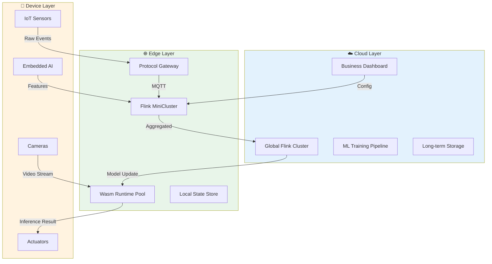
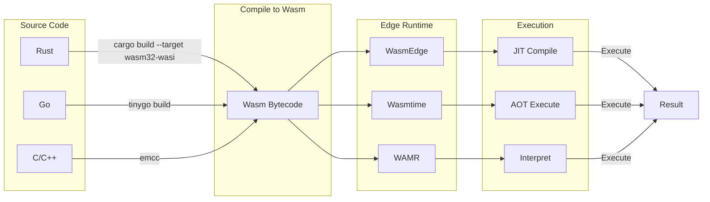
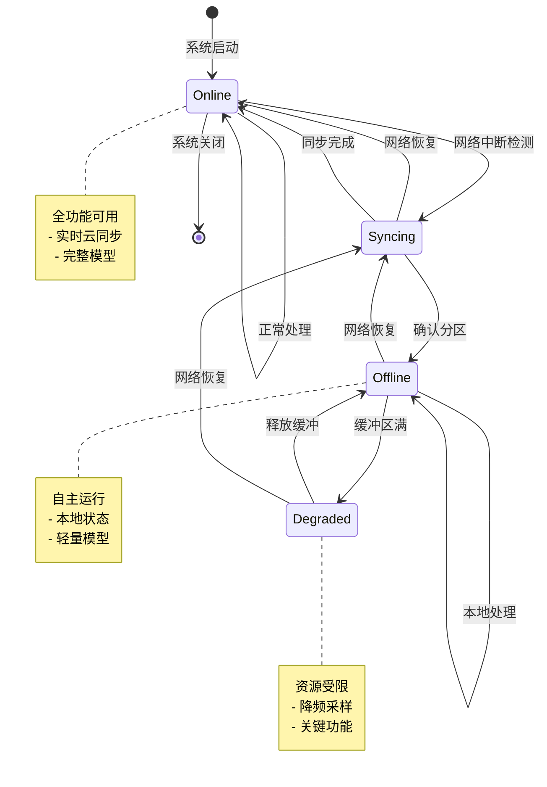
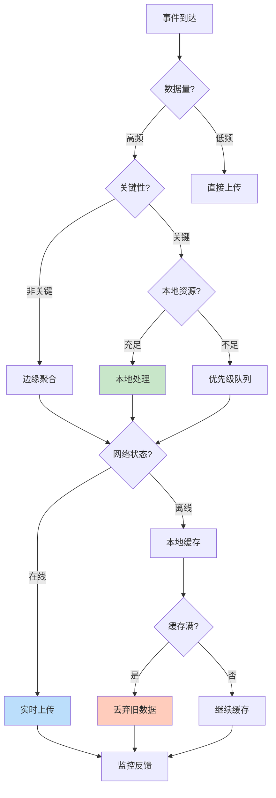
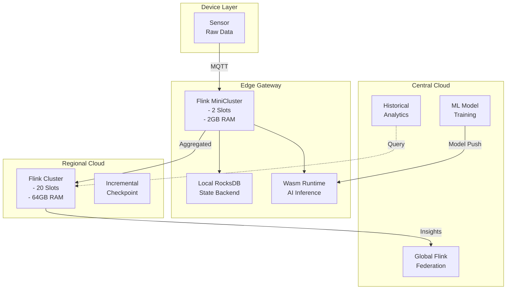

# 边缘流处理模式 (Edge Streaming Patterns)

> **所属阶段**: Knowledge/06-frontier | **前置依赖**: [cloud-edge-continuum.md](./cloud-edge-continuum.md), [wasm-dataflow-patterns.md](./wasm-dataflow-patterns.md) | **形式化等级**: L4

## 目录

- [边缘流处理模式 (Edge Streaming Patterns)](#边缘流处理模式-edge-streaming-patterns)
  - [目录](#目录)
  - [1. 概念定义 (Definitions)](#1-概念定义-definitions)
    - [Def-K-06-12: 边缘计算 (Edge Computing)](#def-k-06-12-边缘计算-edge-computing)
    - [Def-K-06-13: 边缘流处理延迟层级 (Edge Latency Hierarchy)](#def-k-06-13-边缘流处理延迟层级-edge-latency-hierarchy)
    - [Def-K-06-14: WebAssembly 边缘运行时 (Wasm Edge Runtime)](#def-k-06-14-webassembly-边缘运行时-wasm-edge-runtime)
    - [Def-K-06-15: Flink 边缘部署模式 (Flink Edge Deployment)](#def-k-06-15-flink-边缘部署模式-flink-edge-deployment)
    - [Def-K-06-16: 边缘流处理模式 (Edge Streaming Patterns)](#def-k-06-16-边缘流处理模式-edge-streaming-patterns)
  - [2. 属性推导 (Properties)](#2-属性推导-properties)
    - [Prop-K-06-08: 延迟分层递减性](#prop-k-06-08-延迟分层递减性)
    - [Prop-K-06-09: 资源-精度权衡律](#prop-k-06-09-资源-精度权衡律)
    - [Prop-K-06-10: 离线-在线一致性边界](#prop-k-06-10-离线-在线一致性边界)
    - [Lemma-K-06-05: Wasm 跨平台执行等价性](#lemma-k-06-05-wasm-跨平台执行等价性)
  - [3. 关系建立 (Relations)](#3-关系建立-relations)
    - [3.1 Edge Computing 与 Dataflow 模型关系](#31-edge-computing-与-dataflow-模型关系)
    - [3.2 Wasm 运行时与边缘部署关系](#32-wasm-运行时与边缘部署关系)
    - [3.3 Flink MiniCluster 与资源约束关系](#33-flink-minicluster-与资源约束关系)
  - [4. 论证过程 (Argumentation)](#4-论证过程-argumentation)
    - [4.1 边缘计算核心挑战分析](#41-边缘计算核心挑战分析)
    - [4.2 WebAssembly 边缘适用性论证](#42-webassembly-边缘适用性论证)
    - [4.3 Flink 边缘部署论证](#43-flink-边缘部署论证)
  - [5. 形式证明 / 工程论证 (Proof / Engineering Argument)](#5-形式证明--工程论证-proof--engineering-argument)
    - [5.1 边缘聚合带宽优化论证](#51-边缘聚合带宽优化论证)
    - [5.2 Wasm 启动延迟优化论证](#52-wasm-启动延迟优化论证)
    - [5.3 离线-在线混合调度正确性](#53-离线-在线混合调度正确性)
  - [6. 实例验证 (Examples)](#6-实例验证-examples)
    - [6.1 工业IoT实时质检](#61-工业iot实时质检)
    - [6.2 自适应采样实现](#62-自适应采样实现)
    - [6.3 优先级路由实现](#63-优先级路由实现)
    - [6.4 熔断器模式实现](#64-熔断器模式实现)
    - [6.5 AR/VR 低延迟处理](#65-arvr-低延迟处理)
  - [7. 可视化 (Visualizations)](#7-可视化-visualizations)
    - [7.1 云边端流处理架构图](#71-云边端流处理架构图)
    - [7.2 WebAssembly 边缘执行模型](#72-webassembly-边缘执行模型)
    - [7.3 离线-在线混合处理状态机](#73-离线-在线混合处理状态机)
    - [7.4 边缘流处理模式决策树](#74-边缘流处理模式决策树)
    - [7.5 Flink 边缘-云连续体部署](#75-flink-边缘-云连续体部署)
  - [8. 引用参考 (References)](#8-引用参考-references)

---

## 1. 概念定义 (Definitions)

### Def-K-06-12: 边缘计算 (Edge Computing)

**边缘计算**是一种将计算、存储和网络资源部署在数据源附近的分布式计算范式，旨在减少延迟、降低带宽消耗并支持离线自治。

**形式化定义**：

设边缘计算系统为五元组 $\mathcal{E} = (N, L, F, C, \mathcal{P})$：

- $N = N_{cloud} \cup N_{edge} \cup N_{device}$：分层节点集合
- $L: N \rightarrow \mathbb{R}^3$：节点地理位置函数
- $F: N \rightarrow \mathbb{R}^4$：节点资源能力函数 (CPU, Memory, Storage, Bandwidth)
- $C \subseteq N \times N$：节点间通信链路集合
- $\mathcal{P}: Task \times N \rightarrow \{0, 1\}$：任务放置可行性函数

**边缘 vs 云对比**：

| 维度 | 云端 (Cloud) | 边缘 (Edge) | 终端 (Device) |
|------|-------------|-------------|---------------|
| **延迟** | 50-200ms | 5-20ms | <1ms |
| **带宽** | 10Gbps+ | 1Gbps | 100Mbps |
| **计算能力** | 64核+ | 4-8核 | 1-2核 |
| **存储** | TB级 | 100GB级 | 4-32GB |
| **可靠性** | 99.99% | 95-99% | 90-95% |
| **成本模型** | 按需计费 | 固定成本 | 硬件成本 |

---

### Def-K-06-13: 边缘流处理延迟层级 (Edge Latency Hierarchy)

**延迟层级**定义了边缘计算中不同应用场景的延迟需求等级：

```
延迟层级金字塔
                    ┌─────────┐
                    │ < 1ms   │  ──► 硬实时控制 (工业机械臂)
                    │ 极关键  │
                   ┌┴─────────┴┐
                   │  1-10ms   │  ──► 软实时交互 (AR/VR、自动驾驶)
                   │   关键    │
                  ┌┴───────────┴┐
                  │   10-50ms   │  ──► 交互式响应 (游戏、视频会议)
                  │   交互级    │
                 ┌┴─────────────┴┐
                 │    50-200ms   │  ──► 准实时分析 (监控、日志)
                 │    分析级     │
                ┌┴───────────────┴┐
                │     > 200ms     │  ──► 批量处理 (大数据、ML训练)
                │     批量级      │
                └─────────────────┘
```

**延迟约束形式化**：

$$\forall task \in CriticalTasks: T_{proc}(task) + T_{net}(task) + T_{queue}(task) \leq SLA(task)$$

其中：

- $T_{proc}$: 处理延迟
- $T_{net}$: 网络传输延迟
- $T_{queue}$: 队列等待延迟
- $SLA$: 服务等级协议阈值

---

### Def-K-06-14: WebAssembly 边缘运行时 (Wasm Edge Runtime)

**Wasm 边缘运行时**是基于 WebAssembly 字节码的轻量级执行环境，支持在资源受限边缘设备上安全、高效地运行流处理逻辑。

**主流运行时对比**：

| 运行时 | 冷启动 | 内存占用 | AOT支持 | 特色功能 | 适用场景 |
|--------|--------|----------|---------|----------|----------|
| **WasmEdge** | <1ms | 12MB | ✅ | AI/网络插件 | 边缘AI推理 |
| **Wasmtime** | 1-5ms | 15MB | ✅ | 标准兼容 | 通用服务器 |
| **Wasm3** | <0.5ms | 3MB | ❌ | 解释器 | 资源受限IoT |
| **WAMR** | 2ms | 5MB | ✅ | 微运行时 | 微控制器 |

**WASI 流处理接口扩展**：

```wat
;; WASI-Streaming 扩展接口
(module
  ;; 流读取接口
  (import "wasi_streaming" "read"
    (func $stream_read (param i32 i32) (result i32)))

  ;; 流写入接口
  (import "wasi_streaming" "write"
    (func $stream_write (param i32 i32 i32) (result i32)))

  ;; 窗口状态管理
  (import "wasi_streaming" "window_state_get"
    (func $window_get (param i32) (result i64)))

  (import "wasi_streaming" "window_state_set"
    (func $window_set (param i32 i64)))

  ;; Checkpoint 接口
  (import "wasi_streaming" "checkpoint"
    (func $checkpoint (param i32) (result i32)))
)
```

---

### Def-K-06-15: Flink 边缘部署模式 (Flink Edge Deployment)

**Flink MiniCluster 边缘部署**是在资源受限环境中运行轻量级 Flink 实例的部署模式。

**部署拓扑**：

```
┌─────────────────────────────────────────────────────────────┐
│                    Flink MiniCluster                        │
├─────────────────────────────────────────────────────────────┤
│  ┌─────────────┐    ┌─────────────┐    ┌─────────────┐     │
│  │ JobManager  │◄──►│ TaskManager │◄──►│ StateStore  │     │
│  │ (轻量JVM)   │    │ (1-2 slots) │    │ (RocksDB)   │     │
│  │  512MB RAM  │    │  1-2GB RAM  │    │  本地存储    │     │
│  └─────────────┘    └─────────────┘    └─────────────┘     │
│         │                                                   │
│         ▼                                                   │
│  ┌─────────────┐    ┌─────────────┐                        │
│  │ MQTT Source │    │ HTTP Sink   │                        │
│  │ (本地Broker)│    │ (云端同步)   │                        │
│  └─────────────┘    └─────────────┘                        │
└─────────────────────────────────────────────────────────────┘
```

**资源约束配置**：

```yaml
# flink-edge-conf.yaml
jobmanager.memory.process.size: 512m
taskmanager.memory.process.size: 1536m
taskmanager.numberOfTaskSlots: 2
state.backend: rocksdb
state.backend.incremental: true
state.checkpoints.dir: file:///data/flink/checkpoints
restart-strategy: fixed-delay
restart-strategy.fixed-delay.attempts: 10
restart-strategy.fixed-delay.delay: 10s
```

---

### Def-K-06-16: 边缘流处理模式 (Edge Streaming Patterns)

**边缘流处理模式**是在边缘环境中解决常见数据处理问题的可复用设计方案。

**模式分类**：

| 模式 | 问题 | 解决方案 | 适用场景 |
|------|------|----------|----------|
| **本地聚合** | 带宽受限 | 边缘预聚合后上传 | 高频传感器 |
| **自适应采样** | 计算资源受限 | 动态调整采样率 | 电池供电设备 |
| **优先级路由** | 多任务竞争 | 按优先级调度 | 混合关键系统 |
| **熔断机制** | 网络不稳定 | 离线自治+延迟同步 | 移动场景 |

---

## 2. 属性推导 (Properties)

### Prop-K-06-08: 延迟分层递减性

**命题**：在云边端连续体中，端到端延迟满足严格递减关系：

$$Latency_{cloud} > Latency_{edge} > Latency_{device}$$

**证明**：

$$Latency_{total} = T_{proc} + T_{net} + T_{queue}$$

对于各层：

- **Cloud层**：$T_{net}^{cloud} \approx 50-200ms$ (广域网RTT)
- **Edge层**：$T_{net}^{edge} \approx 5-20ms$ (局域网RTT)
- **Device层**：$T_{net}^{device} = 0$ (本地处理)

对于延迟敏感型任务，$T_{net} \gg T_{proc}$，因此分层递减性成立。∎

---

### Prop-K-06-09: 资源-精度权衡律

**命题**：在资源受限环境下，模型复杂度与推理精度呈单调递增，与能耗呈权衡关系：

$$ModelComplexity \uparrow \Rightarrow Accuracy \uparrow \land Energy \uparrow$$

**形式化**：

设模型为 $M(\theta)$，其中 $\theta$ 为参数量：

$$Accuracy(M) = f(\theta), \quad \frac{df}{d\theta} > 0 \text{ (边际递减)}$$
$$Energy(M) = g(\theta) \cdot InputSize, \quad \frac{dg}{d\theta} > 0$$

**帕累托最优**：

$$\forall M^*: \nexists M': Accuracy(M') \geq Accuracy(M^*) \land Energy(M') < Energy(M^*)$$

---

### Prop-K-06-10: 离线-在线一致性边界

**命题**：在网络分区期间，边缘节点的最终一致性可以在有限时间内达成，当且仅当：

1. 变更日志持久化
2. 分区持续时间 $< T_{max}$
3. 状态同步采用增量策略

**边界条件**：

$$BufferSize \geq T_{max} \cdot Throughput_{max}$$

---

### Lemma-K-06-05: Wasm 跨平台执行等价性

**引理**：同一 Wasm 模块在不同运行时上的执行语义等价，即：

$$\forall w \in W, \forall r_1, r_2 \in R: \Phi(w, r_1) = 1 \land \Phi(w, r_2) = 1 \Rightarrow Output(w, r_1) = Output(w, r_2)$$

**证明概要**：

WebAssembly 规范定义了确定性执行语义：

- 指令执行顺序确定
- 浮点运算遵循 IEEE 754 标准
- 内存模型为线性内存

因此相同输入产生相同输出。∎

---

## 3. 关系建立 (Relations)

### 3.1 Edge Computing 与 Dataflow 模型关系

边缘流处理是 Dataflow 模型的**地理分布式扩展**：

| Dataflow概念 | 边缘流处理映射 | 实现差异 |
|--------------|----------------|----------|
| **算子** | 分层部署的计算单元 | 同算子可在不同层有不同实现 |
| **数据流** | 跨地理节点的数据传输 | 需考虑带宽、延迟、可靠性 |
| **窗口** | 分层聚合的时间边界 | Edge层窗口更小 |
| **Watermark** | 跨层时钟同步机制 | 需处理时钟漂移和网络分区 |
| **Checkpoint** | 分层容错状态快照 | 频率随层级递增 |
| **State Backend** | 分层存储后端 | Device内存、Edge本地、Cloud分布式 |

### 3.2 Wasm 运行时与边缘部署关系

```
┌─────────────────────────────────────────────────────────────┐
│                  Wasm 运行时边缘部署映射                      │
├─────────────────────────────────────────────────────────────┤
│                                                             │
│   云端 (Cloud)          边缘 (Edge)        终端 (Device)     │
│   ┌──────────┐         ┌──────────┐       ┌──────────┐     │
│   │ WasmTime │◄───────►│ WasmEdge │◄─────►│  WAMR    │     │
│   │          │         │          │       │          │     │
│   │ - 大内存  │         │ - AI插件  │       │ - 微内存  │     │
│   │ - 完整WASI│         │ - 网络优化│       │ - 解释器  │     │
│   │ - 多租户  │         │ - AOT编译 │       │ - 裸机运行│     │
│   └──────────┘         └──────────┘       └──────────┘     │
│                                                             │
│   用途: 全局聚合          用途: 本地推理      用途: 数据采集  │
│   状态: 分布式存储         状态: 本地缓存      状态: 无状态   │
│                                                             │
└─────────────────────────────────────────────────────────────┘
```

### 3.3 Flink MiniCluster 与资源约束关系

| 资源维度 | 云端 Flink | 边缘 MiniCluster | 设备 Embedded |
|----------|-----------|------------------|---------------|
| **JVM堆内存** | 8-32GB | 512MB-2GB | 64-256MB |
| **Task Slots** | 100+ | 2-4 | 1 |
| **并行度** | 1000+ | 10-100 | 1-4 |
| **Checkpoint间隔** | 1-10分钟 | 30秒-5分钟 | 手动触发 |
| **状态后端** | HDFS/S3 | 本地磁盘 | 内存 |
| **HA配置** | 3 JM | 单 JM | 无 |

---

## 4. 论证过程 (Argumentation)

### 4.1 边缘计算核心挑战分析

**挑战1：带宽约束**

```
问题: 百万设备 × 1KB/s = 1TB/s 原始数据
                                    ↓
解决方案: 边缘预聚合 (100:1 压缩比)
                                    ↓
云端接收: 10GB/s 聚合数据
```

**挑战2：延迟敏感**

| 应用场景 | 延迟要求 | 处理位置 | 技术方案 |
|----------|----------|----------|----------|
| 工业控制 | <10ms | Device | 实时OS + FPGA |
| AR/VR | <20ms | Edge | GPU加速 + 预测渲染 |
| 自动驾驶 | <50ms | Edge/V2X | 5G MEC + AI推理 |
| 视频监控 | <500ms | Edge | 边缘分析 + 异常上报 |

**挑战3：离线自治**

```
在线状态:
  ┌─────────────┐     ┌─────────────┐     ┌─────────────┐
  │   Device    │────►│    Edge     │────►│    Cloud    │
  │  (采集数据)  │     │ (本地分析)   │     │ (全局聚合)   │
  └─────────────┘     └─────────────┘     └─────────────┘

离线状态:
  ┌─────────────┐     ┌─────────────┐     ┌─────────────┐
  │   Device    │────►│    Edge     │ ╳╳╳ │    Cloud    │
  │  (采集数据)  │     │ (自主决策)   │ ╳╳╳ │   (不可用)   │
  └─────────────┘     └─────────────┘     └─────────────┘
                              │
                              ▼
                       ┌─────────────┐
                       │ 本地状态缓存 │
                       │ 延迟同步队列 │
                       └─────────────┘
```

### 4.2 WebAssembly 边缘适用性论证

**为什么选择 Wasm？**

| 维度 | JVM | Python | Container | **Wasm** |
|------|-----|--------|-----------|----------|
| **冷启动** | 5-60s | 2-10s | 1-10s | **<5ms** |
| **内存占用** | 2GB+ | 500MB+ | 100MB+ | **5-30MB** |
| **实例密度** | ~10/节点 | ~50/节点 | ~100/节点 | **~10000/节点** |
| **安全隔离** | JVM沙箱 | 较弱 | OS命名空间 | **软件故障隔离** |
| **可移植性** | 需JVM | 需解释器 | 需容器运行时 | **一次编译到处运行** |

**WasmEdge TensorFlow 扩展示例**：

```rust
// 边缘AI推理 (WasmEdge)
use wasmedge_tensorflow_interface::*;

#[no_mangle]
pub extern "C" fn infer(image: &[u8]) -> i32 {
    let model = &include_bytes!("model.tflite");
    let mut session = Session::new(model, SessionOptions::default());

    // 预处理
    let tensor = Tensor::new(&[1, 224, 224, 3], image);

    // 推理
    let outputs = session.run(vec![tensor]);

    // 后处理
    let class_id = argmax(&outputs[0]);
    class_id as i32
}
```

### 4.3 Flink 边缘部署论证

**MiniCluster 适用场景**：

```
场景1: 工厂车间网关
  - 设备数: 100-1000
  - 数据率: 1000 msg/s
  - 延迟要求: <100ms
  - 推荐: Flink MiniCluster (2 slots, 2GB RAM)

场景2: 零售门店边缘
  - 摄像头: 10-50路
  - 视频流: 30fps × 1080p
  - 分析: 人流量统计
  - 推荐: Flink + Wasm 混合部署

场景3: 车辆边缘计算
  - 传感器: 50+ CAN总线
  - 数据率: 5000 msg/s
  - 延迟: <50ms
  - 推荐: Flink Embedded + 本地RocksDB
```

---

## 5. 形式证明 / 工程论证 (Proof / Engineering Argument)

### 5.1 边缘聚合带宽优化论证

**定理**：通过边缘预聚合，可以将上传云端的数据量减少 $R$ 倍，其中 $R$ 为聚合比率。

**证明**：

设：

- $N$：设备数量
- $f$：单设备数据产生频率
- $s$：单条消息大小
- $T$：聚合窗口大小
- $A$：聚合后消息大小

原始带宽需求：
$$B_{raw} = N \cdot f \cdot s$$

聚合后带宽需求：
$$B_{agg} = \frac{N \cdot f \cdot A}{T \cdot f} = \frac{N \cdot A}{T}$$

压缩比：
$$R = \frac{B_{raw}}{B_{agg}} = \frac{T \cdot s}{A}$$

典型值：$T = 60s$, $s = 1KB$, $A = 100B$ 时，$R = 600:1$。∎

### 5.2 Wasm 启动延迟优化论证

**优化技术矩阵**：

| 技术 | 机制 | 效果 | 适用场景 |
|------|------|------|----------|
| **AOT预编译** | 提前编译为机器码 | 启动 <1ms | 高频触发 |
| **模块缓存** | 运行时级模块复用 | 节省编译时间 | 多实例 |
| **实例池** | 预创建热实例 | 零冷启动 | 延迟敏感 |
| **懒加载** | 按需加载代码段 | 减少内存 | 大模块 |

**AOT 编译示例**：

```bash
# WasmTime AOT 编译
wasmtime compile module.wasm -o module.cwasm

# 运行时直接加载
wasmtime run --allow-precompiled module.cwasm
```

### 5.3 离线-在线混合调度正确性

**状态机形式化**：

$$\mathcal{H} = (Q, \Sigma, \delta, q_0, F)$$

其中：

- $Q = \{ONLINE, OFFLINE, DEGRADED, SYNCING\}$
- $\Sigma = \{network\_up, network\_down, buffer\_full, sync\_complete\}$
- $\delta$: 状态转移函数

**状态转移**：

$$
\delta(q, \sigma) = \begin{cases}
ONLINE & q = SYNCING \land \sigma = sync\_complete \\
OFFLINE & q \in \{ONLINE, DEGRADED\} \land \sigma = network\_down \\
DEGRADED & q = OFFLINE \land \sigma = buffer\_full \\
SYNCING & q = OFFLINE \land \sigma = network\_up \\
q & otherwise
\end{cases}
$$

---

## 6. 实例验证 (Examples)

### 6.1 工业IoT实时质检

**场景**：智能制造车间实时视觉质检

```
┌──────────────┐    ┌──────────────┐    ┌──────────────┐
│   Camera     │───→│  Edge Gateway │───→│   Cloud      │
│  (Device)    │    │   (Edge)      │    │  (Center)    │
├──────────────┤    ├──────────────┤    ├──────────────┤
│ - 1080p视频  │    │ - Flink Mini │    │ - Global ML  │
│ - 30 FPS     │    │ - 本地窗口   │    │ - 趋势分析   │
│ - 原始帧缓存 │    │ - 缺陷检测   │    │ - 模型训练   │
└──────────────┘    │ - 剔除控制   │    └──────────────┘
                    └──────────────┘
                         │
                         ▼
                    ┌──────────────┐
                    │   Actuator   │
                    │ (剔除装置)   │
                    └──────────────┘
```

**延迟要求**：

- 缺陷检测 → 剔除动作：< 100ms
- 视频采集 → 本地推理：< 50ms
- 控制信号 → 执行器：< 20ms

**Flink Edge 配置**：

```scala
// Flink MiniCluster 配置
val env = StreamExecutionEnvironment.createLocalEnvironment(2)

// 状态后端配置
env.setStateBackend(new EmbeddedRocksDBStateBackend(true))
env.getCheckpointConfig.setCheckpointInterval(30000)
env.getCheckpointConfig.setCheckpointStorage("file:///data/flink/checkpoints")

// 本地聚合后上传
val aggregatedStream = videoStream
  .keyBy(_.cameraId)
  .window(TumblingProcessingTimeWindows.of(Time.seconds(5)))
  .aggregate(new DefectAggregator())
  .filter(_.defectCount > 0)
  .addSink(new CloudSyncSink())
```

### 6.2 自适应采样实现

```rust
// Wasm 自适应采样模块
#[no_mangle]
pub extern "C" fn adaptive_sample(event: &SensorEvent) -> bool {
    let rate_of_change = calculate_gradient(event);

    match rate_of_change {
        v if v > HIGH_THRESHOLD => {
            // 变化剧烈,全量采样
            set_sample_rate(1.0);
            true
        }
        v if v > MEDIUM_THRESHOLD => {
            // 中等变化,50%采样
            set_sample_rate(0.5);
            random() < 0.5
        }
        _ => {
            // 变化平缓,10%采样
            set_sample_rate(0.1);
            random() < 0.1
        }
    }
}

fn calculate_gradient(event: &SensorEvent) -> f64 {
    let history = get_recent_values(10);
    let current = event.value;
    let avg = history.iter().sum::<f64>() / history.len() as f64;
    (current - avg).abs() / avg
}
```

### 6.3 优先级路由实现

```java
import org.apache.flink.streaming.api.functions.ProcessFunction;

import org.apache.flink.api.common.state.ValueState;


// Flink PriorityRoutingFunction
public class PriorityRoutingFunction
    extends ProcessFunction<Event, Event> {

    private ValueState<Integer> priorityState;

    @Override
    public void processElement(Event event, Context ctx,
                               Collector<Event> out) {
        int priority = calculatePriority(event);

        if (priority == CRITICAL) {
            // 关键数据:本地处理 + 实时上传
            processLocally(event);
            uploadToCloud(event, QoS.EXACTLY_ONCE);
        } else if (priority == HIGH) {
            // 高优先级:本地处理 + 批量上传
            processLocally(event);
            bufferForBatchUpload(event);
        } else {
            // 普通数据:本地聚合后上传
            aggregateLocally(event);
        }
    }

    private int calculatePriority(Event event) {
        if (event.type == ALARM) return CRITICAL;
        if (event.temperature > 90.0) return HIGH;
        return NORMAL;
    }
}
```

### 6.4 熔断器模式实现

```scala
// 边缘-云端熔断器
class EdgeCircuitBreaker {
  private var state: CircuitState = CLOSED
  private var failureCount: Int = 0
  private var lastFailureTime: Long = 0

  private val FAILURE_THRESHOLD = 5
  private val TIMEOUT_DURATION = 5000 // ms
  private val RECOVERY_TIMEOUT = 30000 // ms

  def call[T](operation: => T, fallback: => T): T = {
    state match {
      case CLOSED =>
        try {
          val result = operation
          reset()
          result
        } catch {
          case ex: Exception =>
            recordFailure()
            fallback
        }

      case OPEN =>
        if (System.currentTimeMillis() - lastFailureTime > RECOVERY_TIMEOUT) {
          state = HALF_OPEN
          call(operation, fallback)
        } else {
          fallback
        }

      case HALF_OPEN =>
        try {
          val result = operation
          close()
          result
        } catch {
          case ex: Exception =>
            open()
            fallback
        }
    }
  }

  private def recordFailure(): Unit = {
    failureCount += 1
    lastFailureTime = System.currentTimeMillis()
    if (failureCount >= FAILURE_THRESHOLD) {
      state = OPEN
    }
  }

  // 离线模式降级处理
  def offlineFallback(event: Event): Unit = {
    // 写入本地队列
    localQueue.enqueue(event)
    // 触发本地告警
    localAlert.trigger(event)
  }
}
```

### 6.5 AR/VR 低延迟处理

```
┌─────────────────────────────────────────────────────────────┐
│                  AR/VR 边缘流处理架构                        │
├─────────────────────────────────────────────────────────────┤
│                                                             │
│  ┌──────────────┐      ┌──────────────┐      ┌──────────┐  │
│  │    Headset   │      │   Edge Node  │      │   Cloud  │  │
│  │   (Device)   │◄────►│   (MEC)      │◄────►│  (Origin)│  │
│  │              │ 5ms  │              │ 20ms │          │  │
│  │ - 姿态追踪   │      │ - 渲染预测   │      │ - 全局状态│  │
│  │ - 眼动追踪   │      │ - 局部渲染   │      │ - 大规模AI│  │
│  │ - 手势识别   │      │ - 场景理解   │      │          │  │
│  └──────────────┘      └──────────────┘      └──────────┘  │
│                                                             │
│  延迟要求: 运动到光子 (Motion-to-Photon) < 20ms             │
│  技术方案: 边缘渲染 + 预测追踪 + 时间扭曲                    │
│                                                             │
└─────────────────────────────────────────────────────────────┘
```

---

## 7. 可视化 (Visualizations)

### 7.1 云边端流处理架构图



### 7.2 WebAssembly 边缘执行模型



### 7.3 离线-在线混合处理状态机



### 7.4 边缘流处理模式决策树



### 7.5 Flink 边缘-云连续体部署



---

## 8. 引用参考 (References)


---

*文档版本: v1.1 | 更新日期: 2026-04-02 | 形式化等级: L4*
