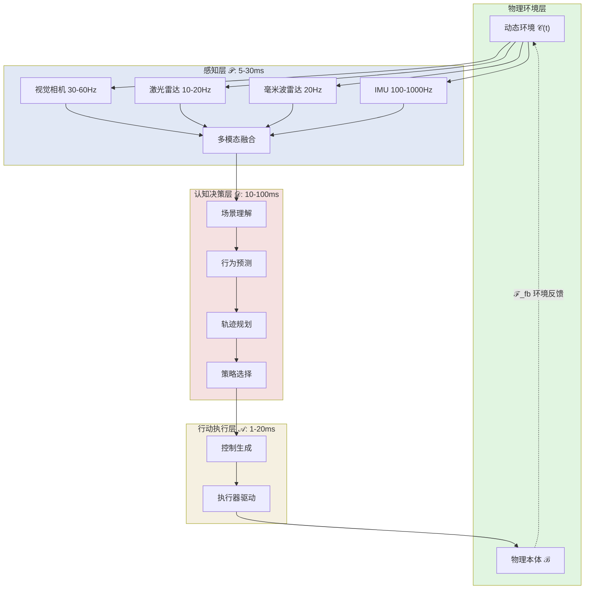
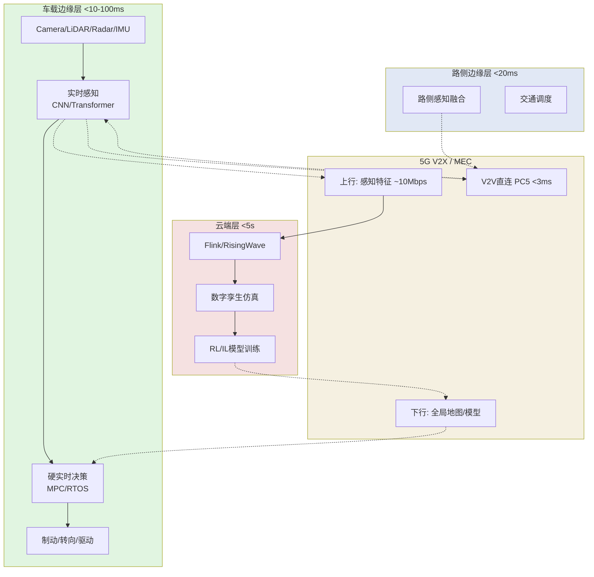

# 具身智能实时感知-决策-行动流闭环架构

> **状态**: 前瞻 | **预计发布时间**: 2026-07 | **最后更新**: 2026-04-23
>
> ⚠️ 本文档描述的特性处于早期研究与原型验证阶段，实现细节可能变更。

> **所属阶段**: Knowledge/06-frontier | **前置依赖**: [edge-ai-streaming-architecture.md](./edge-ai-streaming-architecture.md), [realtime-digital-twin-streaming.md](./realtime-digital-twin-streaming.md), [multimodal-ai-streaming-architecture.md](./multimodal-ai-streaming-architecture.md) | **形式化等级**: L3-L4

---

## 1. 概念定义 (Definitions)

### Def-K-06-300: 具身智能系统 (Embodied AI System)

**具身智能系统** 是物理实体与智能决策模型深度耦合的开放系统：

$$
\mathcal{E} \triangleq \langle \mathcal{B}, \mathcal{S}, \mathcal{A}, \mathcal{M}, \mathcal{C} \rangle
$$

其中 $\mathcal{B}$ 为物理本体（机器人/车辆/无人机），$\mathcal{S}$ 为多模态传感器集合，$\mathcal{A}$ 为执行器集合，$\mathcal{M}$ 为认知模型，$\mathcal{C}(t)$ 为环境上下文。具身智能区别于离身AI的核心特征在于：**智能行为的形成必须依赖物理身体与环境的实时交互反馈**。

### Def-K-06-301: 感知-决策-行动闭环 (PDA Closed Loop)

**PDA闭环** 是具身智能系统的核心控制循环：

$$
\mathcal{L}_{PDA} \triangleq \langle \mathcal{P}, \mathcal{D}, \mathcal{A}, \mathcal{F}_{fb} \rangle
$$

循环流定义为 $\mathcal{S}(t) \xrightarrow{\mathcal{P}} \hat{\mathcal{C}}(t) \xrightarrow{\mathcal{D}} \pi(t) \xrightarrow{\mathcal{A}} u(t) \xrightarrow{\mathcal{F}_{fb}} \mathcal{S}(t + \Delta t)$，其中 $\mathcal{P}$ 为感知融合，$\mathcal{D}$ 为决策规划，$\mathcal{A}$ 为执行控制，$\mathcal{F}_{fb}$ 为环境反馈。**完整性条件**要求系统必须在截止时间前完成状态转移：$\forall t \geq t_0, \; \exists \, \Delta t_{cycle} < \tau_{deadline}$。

### Def-K-06-302: 实时性约束分级 (Real-time Constraint Level)

具身智能的实时性需求按安全关键程度分为四级：

| 等级 | 延迟上界 $\tau$ | 惩罚 | 典型场景 |
|------|----------------|------|----------|
| **Critical** | < 10ms | 灾难性失效 | 工业机器人紧急制动、AEB |
| **Hard** | < 100ms | 安全风险 | 自动驾驶车道保持、避障 |
| **Firm** | < 500ms | 任务降级 | 无人机路径重规划 |
| **Soft** | < 2000ms | 体验损失 | 服务机器人交互导航 |

Critical/Hard 等级要求**确定性延迟保证**（最坏情况WCET严格小于阈值），Firm/Soft 允许统计性保证。

### Def-K-06-303: 边缘-车云协同流 (Edge-Vehicle-Cloud Stream)

$$
\mathcal{S}_{EVC} \triangleq \langle \mathcal{S}_e, \mathcal{S}_v, \mathcal{S}_c, \mathcal{T}_{sync}, \mathcal{R}_{offload} \rangle
$$

其中 $\mathcal{S}_e$ 为车载边缘流（负责Critical/Hard级任务），$\mathcal{S}_v$ 为V2X通信流，$\mathcal{S}_c$ 为云端流（全局优化/训练）。卸载决策函数：

$$
\mathcal{R}_{offload}(task) = \begin{cases} local & \text{if } T_{local} < T_{trans} + T_{cloud} + \sigma_{jitter} \\ offload & \text{otherwise} \end{cases}
$$

---

## 2. 属性推导 (Properties)

### Prop-K-06-100: 闭环端到端延迟分解

PDA闭环总延迟分解为五个独立部分：

$$
\Delta_{total} = \Delta_{perc} + \Delta_{trans}^{in} + \Delta_{dec} + \Delta_{act} + \Delta_{trans}^{fb}
$$

自动驾驶Hard级任务典型值：$\Delta_{perc} \approx 15$ms（CNN感知），$\Delta_{trans}^{in} \approx 3$ms（域内通信），$\Delta_{dec} \approx 50$ms（轨迹规划），$\Delta_{act} \approx 5$ms（电机响应），$\Delta_{trans}^{fb} \approx 5$ms。总计 **78ms < 100ms**，但余量仅22ms，对抖动极其敏感。

### Lemma-K-06-60: 多模态时间对齐引理

设 $n$ 个传感器流采样周期为 $\{T_i\}$，时钟同步精度为 $\epsilon_{sync}$，则融合时刻的时间对齐误差上界为：

$$
\epsilon_{align} \leq \frac{1}{2} \max_{i,j} |T_i - T_j| + \epsilon_{sync}
$$

相机(30Hz, $T=33.3$ms)与激光雷达(10Hz, $T=100$ms)融合时，$\epsilon_{align} \leq 34.3$ms。在100ms决策周期中，**超过34%的时间可能处于模态不对齐状态**，必须采用异步融合或运动补偿。

---

## 3. 关系建立 (Relations)

### 3.1 与Dataflow模型的映射

具身智能PDA闭环映射为**扩展循环Dataflow图**：

| Dataflow概念 | 具身智能对应 | 说明 |
|-------------|------------|------|
| Source | 传感器阵列 | 产生无限多模态流 |
| Transform | 感知/决策/行动算子 | 有状态计算节点 |
| Sink | 执行器接口 | 物理世界输出 |
| Feedback Edge | 环境物理反馈 | 从Sink到Source的循环边 |

标准Dataflow假设DAG，PDA闭环引入**循环反馈边**，需采用**迭代收敛语义**或**循环Dataflow**扩展。

### 3.2 与边缘AI及数字孪生的关系

- 与 [edge-ai-streaming-architecture.md](./edge-ai-streaming-architecture.md) 形成 specialization 关系：本文档聚焦**物理闭环控制**，强调确定性延迟与安全关键容错
- 与 [realtime-digital-twin-streaming.md](./realtime-digital-twin-streaming.md) 集成：数字孪生 $\mathcal{DT}$ 作为PDA闭环的**影子验证系统**，形成内环(10-100ms)与外环验证(100ms-1s)的双层架构
- 与MCP/A2A协议关联：多机器人场景中，单个PDA闭环即为**具身智能体**，通过MCP查询云端知识，通过A2V/A2A实现多机协同

---

## 4. 论证过程 (Argumentation)

### 4.1 安全关键系统的形式化需求

根据ISO 26262与ISO 10218，安全关键具身智能需满足：

$$
\square \big( \text{Fault}(s_i) \rightarrow \Diamond_{\leq \tau_{fault}} \text{Detect}(s_i) \big)
$$

即**全局地，任何传感器故障必须在有界时间内被检测**。流处理系统必须提供确定性故障检测而非概率性检测。

### 4.2 反例：延迟超限的安全事故

**Uber 2018事故**：激光雷达与视觉融合延迟约120ms，超过100ms预期。系统碰撞前1.3s已检测到行人，但融合延迟导致轨迹预测使用120ms前的过时状态。

**协作机器人碰撞**：机器人速度1.5m/s，检测-制动延迟35ms（超过10ms Critical要求），移动距离 $d = 1.5 \times 0.035 = 52.5$mm，足以造成挤压伤害。

### 4.3 网络分区降级策略

| 分区场景 | 策略 | 保证级别 |
|---------|------|---------|
| 云链路断开 | 边缘完整PDA继续运行，暂停模型更新 | Hard级保持 |
| V2X断开 | 单车自主感知，降低协同预测依赖 | Hard级保持 |
| 单传感器失效 | 多模态冗余降级，切换保守策略 | Critical级保持 |
| 边缘过载 | 决策模型轻量化切换（大→小模型） | Firm级降级 |

---

## 5. 形式证明 / 工程论证 (Proof / Engineering Argument)

### Thm-K-06-100: PDA闭环稳定性定理

**定理**：给定具身智能系统 $\mathcal{E}$，若各阶段延迟均有确定上界，且执行器动态满足Lipschitz条件 $||f(x_1,u)-f(x_2,u)|| \leq L||x_1-x_2||$，则PDA闭环在时变扰动下保持输入-状态稳定(ISS)：

$$
||x(t)|| \leq \beta(||x(0)||, t) + \gamma(w_{max})
$$

**证明概要**：

1. 将连续PDA闭环离散化为周期 $\tau = \tau_p + \tau_d + \tau_a$ 的采样系统
2. 取Lyapunov函数 $V(x) = x^T P x$，$P$ 为Riccati方程正定解
3. 根据Razumikhin定理，若 $L \cdot \tau < e^{-1} \approx 0.368$，则时延系统ISS稳定
4. 典型参数下（$L \approx 10$ s$^{-1}$, $\tau \approx 0.1$s），$L \cdot \tau = 1 > 0.368$，因此需要**预测补偿**（MPC horizon $N_p \geq \tau/T_s$）才能严格保证稳定性

**工程意义**：物理动态越快（$L$ 越大），可容忍的决策延迟越小，揭示了**延迟与稳定性的根本性权衡**。

### 5.2 流处理引擎选型论证

| 引擎 | 延迟 | 确定性 | 边缘部署 | 适用等级 |
|------|------|--------|----------|---------|
| **ROS2 DDS** | 亚毫秒 | 高(RT-PREEMPT) | 优秀 | Critical/Hard |
| **CyberRT** | 毫秒级 | 高 | 优秀 | Hard（自动驾驶专用）|
| **Apache Flink** | 毫秒~秒 | 中 | 较重 | Soft/Firm（车云协同）|
| **RisingWave** | 毫秒级 | 中高 | 良好 | Firm（边缘SQL分析）|

**结论**：Critical/Hard级必须采用**专用中间件**（ROS2 RT、CyberRT），Firm/Soft级可采用**轻量级流SQL**，车云协同层适合Flink/RisingWave。

---

## 6. 实例验证 (Examples)

### 6.1 自动驾驶多传感器融合避障

高速公路120km/h行驶，前方车辆突然制动。PDA闭环实测延迟：

| 阶段 | 延迟 | 抖动 |
|------|------|------|
| 感知融合 | 18ms | ±5ms |
| 轨迹规划 | 45ms | ±15ms |
| 控制执行 | 8ms | ±2ms |
| **总计** | **71ms** | **±22ms** |

71ms < 100ms Hard级要求，但最坏情况93ms接近边界。系统采用**时间触发架构(TTA)**，以10ms为基本周期调度所有任务，确保确定性。

### 6.2 工业机器人协作装配

双机械臂共享工作空间，分级实时设计：

- **Critical级(<5ms)**：力矩传感器(1kHz)直接接入安全PLC，bypass软件栈，硬件级紧急制动
- **Hard级(<10ms)**：双机协调轨迹规划，10ms周期时间触发
- **Soft级(<500ms)**：视觉缺陷检测运行于AI加速器

### 6.3 无人机集群协同搜索

10架无人机1km²灾区搜索，分层架构：

- **机载边缘**：YOLO-Nano目标检测(5ms/帧)，局部SLAM(20ms/帧)
- **V2X mesh**：机间通信<20ms，共享局部地图
- **云端汇聚**：全局覆盖分析、任务重分配(1-5s周期)，RisingWave聚合多机检测流

```sql
SELECT drone_id, detected_class, geo_location, confidence
FROM drone_detection_stream
WHERE confidence > 0.85
GROUP BY TUMBLE(event_time, INTERVAL '1' SECOND)
EMIT WITH LATENESS INTERVAL '500' MILLISECOND;
```

---

## 7. 可视化 (Visualizations)

### 7.1 具身智能PDA闭环架构全景

展示多模态传感器输入、分层认知处理、执行器输出及环境反馈的完整数据流。



### 7.2 边缘-车云协同流处理架构

展示车载边缘、5G V2X、路侧单元与云端四层协同的数据流与计算卸载关系。



---

## 8. 引用参考 (References)


---

*文档创建: 2026-04-23 | 维护者: AnalysisDataFlow 项目 | 版本: v1.0*
