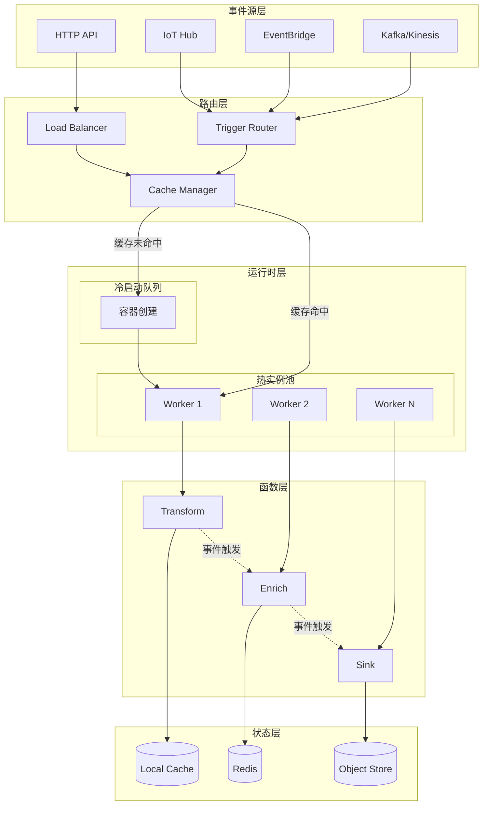
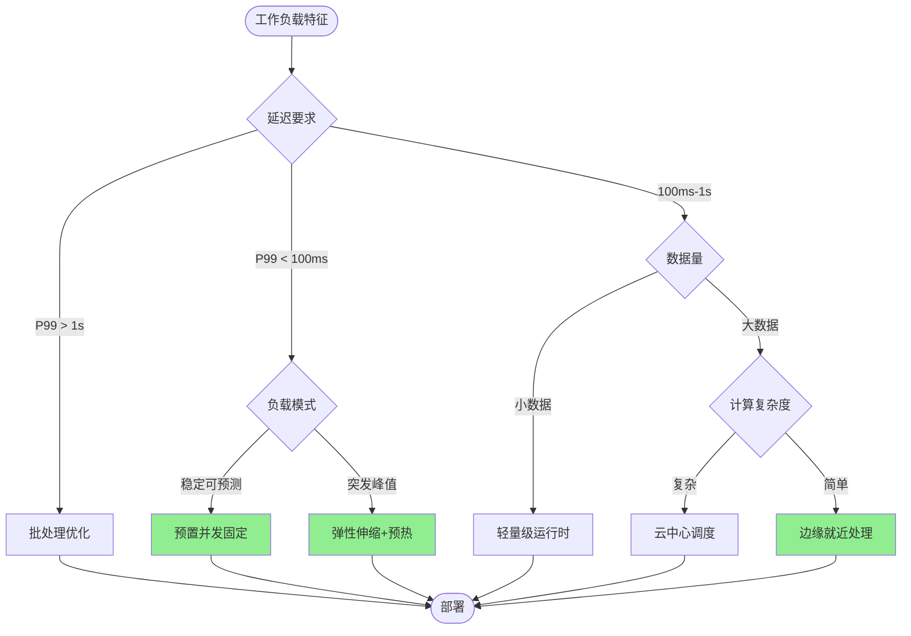
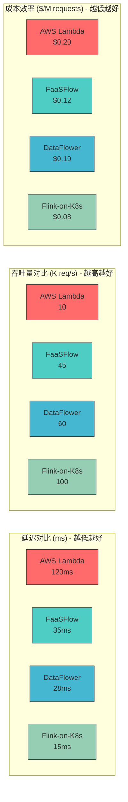
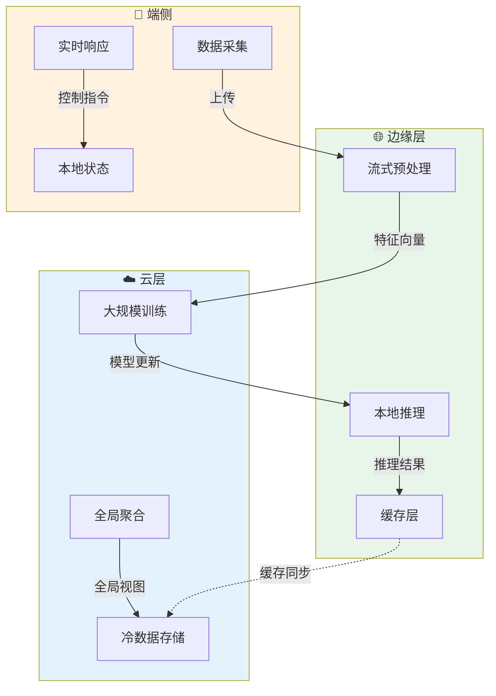

# FaaS Dataflow: Serverless与数据流的融合

> 所属阶段: Knowledge | 前置依赖: [05-mapping-guides/serverless-flink-comparison.md](../04-technology-selection/engine-selection-guide.md) | 形式化等级: L3

## 目录

- [FaaS Dataflow: Serverless与数据流的融合](#faas-dataflow-serverless与数据流的融合)
  - [目录](#目录)
  - [1. 概念定义 (Definitions)](#1-概念定义-definitions)
    - [Def-K-06-05: FaaS Dataflow](#def-k-06-05-faas-dataflow)
    - [Def-K-06-06: 云边端连续体 (Cloud-Edge-Device Continuum)](#def-k-06-06-云边端连续体-cloud-edge-device-continuum)
    - [Def-K-06-07: 自适应工作流放置](#def-k-06-07-自适应工作流放置)
  - [2. 属性推导 (Properties)](#2-属性推导-properties)
    - [Prop-K-06-01: 冷启动延迟与并发度的权衡](#prop-k-06-01-冷启动延迟与并发度的权衡)
    - [Prop-K-06-02: 数据局部性增益边界](#prop-k-06-02-数据局部性增益边界)
    - [Lemma-K-06-01: 函数链状态传递引理](#lemma-k-06-01-函数链状态传递引理)
  - [3. 关系建立 (Relations)](#3-关系建立-relations)
    - [3.1 FaaS Dataflow与经典Dataflow模型的映射](#31-faas-dataflow与经典dataflow模型的映射)
    - [3.2 与Flink的协同关系](#32-与flink的协同关系)
    - [3.3 关键系统定位](#33-关键系统定位)
  - [4. 论证过程 (Argumentation)](#4-论证过程-argumentation)
    - [4.1 技术挑战分析](#41-技术挑战分析)
      - [挑战1：冷启动延迟](#挑战1冷启动延迟)
      - [挑战2：状态管理](#挑战2状态管理)
      - [挑战3：数据局部性](#挑战3数据局部性)
      - [挑战4：成本优化](#挑战4成本优化)
  - [5. 工程论证 (Engineering Argument)](#5-工程论证-engineering-argument)
    - [5.1 设计模式验证](#51-设计模式验证)
      - [模式1：函数链 (Function Chaining)](#模式1函数链-function-chaining)
      - [模式2：扇出/扇入 (Fan-out/Fan-in)](#模式2扇出扇入-fan-outfan-in)
      - [模式3：异步事件驱动](#模式3异步事件驱动)
      - [模式4：Saga事务模式](#模式4saga事务模式)
    - [5.2 性能优化策略论证](#52-性能优化策略论证)
      - [策略1：预置并发 (Provisioned Concurrency)](#策略1预置并发-provisioned-concurrency)
      - [策略2：分层缓存](#策略2分层缓存)
      - [策略3：数据共享机制](#策略3数据共享机制)
  - [6. 实例验证 (Examples)](#6-实例验证-examples)
    - [6.1 ML推理Pipeline](#61-ml推理pipeline)
    - [6.2 实时ETL工作流](#62-实时etl工作流)
    - [6.3 图片处理Pipeline](#63-图片处理pipeline)
  - [7. 可视化 (Visualizations)](#7-可视化-visualizations)
    - [7.1 FaaS Dataflow架构图](#71-faas-dataflow架构图)
    - [7.2 调度策略对比决策树](#72-调度策略对比决策树)
    - [7.3 性能基准对比](#73-性能基准对比)
    - [7.4 云边端放置策略](#74-云边端放置策略)
  - [8. 引用参考 (References)](#8-引用参考-references)

## 1. 概念定义 (Definitions)

### Def-K-06-05: FaaS Dataflow

**FaaS Dataflow** 是一种将函数即服务(Function-as-a-Service)与数据流处理范式深度融合的计算模型。该模型将数据流图中的算子(operator)映射为无状态函数，通过事件驱动机制触发函数执行，同时保持数据流的语义特性。

**形式化定义**：

设 $\mathcal{F}$ 为函数空间，$\mathcal{E}$ 为事件空间，$\mathcal{D}$ 为数据域，则 FaaS Dataflow 可定义为四元组：

$$\text{FaaS-DF} = \langle F, E, \rightarrow_F, \sigma \rangle$$

其中：

- $F \subseteq \mathcal{F}$：无状态函数集合，每个函数 $f \in F$ 满足 $f: D_{in} \times C \rightarrow D_{out} \times C'$
- $E \subseteq \mathcal{E}$：事件集合，$E = E_{data} \cup E_{control} \cup E_{lifecycle}$
- $\rightarrow_F \subseteq F \times E \times F$：函数间的触发关系，构成有向无环图(DAG)
- $\sigma: F \rightarrow \mathbb{R}^+ \times \mathbb{R}^+$：资源分配函数，映射函数到(内存, CPU时间片)

**关键特性**：

| 特性 | 传统FaaS | FaaS Dataflow |
|------|----------|---------------|
| 执行单元 | 独立函数 | 数据流图中的算子 |
| 触发机制 | 事件/HTTP | 数据可用性事件 |
| 状态管理 | 外部存储 | 流内状态(窗口、会话) |
| 通信模式 | 同步/异步调用 | 流式数据传输 |
| 弹性粒度 | 函数级 | 子图/管道级 |

### Def-K-06-06: 云边端连续体 (Cloud-Edge-Device Continuum)

**云边端连续体** 是一种分布式计算架构范式，将云计算、边缘计算和端侧计算视为统一的资源连续体，根据数据局部性、延迟要求和资源约束动态部署FaaS工作流。

**分层模型**：

$$\text{Continuum} = \langle L_{cloud}, L_{edge}, L_{device}, \pi, \delta \rangle$$

- $L_{cloud}$：云中心层，高计算密度，高延迟($>100ms$)
- $L_{edge}$：边缘层，区域部署，中等延迟($10-50ms$)
- $L_{device}$：端侧层，就近处理，低延迟($<10ms$)
- $\pi: F \rightarrow \{L_{cloud}, L_{edge}, L_{device}\}$：放置策略函数
- $\delta: E \times L_i \times L_j \rightarrow \mathbb{R}^+$：层间数据传输延迟

**放置约束**：

$$\forall f \in F: \quad \text{latency}(f) \leq \tau_f \land \text{cost}(\pi(f)) \leq \gamma_f$$

其中 $\tau_f$ 为函数 $f$ 的延迟SLA，$\gamma_f$ 为成本预算。

### Def-K-06-07: 自适应工作流放置

**自适应工作流放置** 是一种运行时优化机制，根据工作负载特征、资源可用性和QoS要求动态调整函数在多层架构中的部署位置。

**决策空间**：

$$\mathcal{P} = \{ (f, l, t) \mid f \in F, l \in L, t \in T \}$$

优化目标为最小化总体成本同时满足延迟约束：

$$\min_{p \in \mathcal{P}} \sum_{(f,l,t) \in p} \left[ \alpha \cdot \text{cost}(f,l,t) + \beta \cdot \mathbb{1}_{\text{latency}(f,l) > \tau_f} \right]$$

其中 $\alpha, \beta$ 为权重系数，$\mathbb{1}$ 为指示函数。

---

## 2. 属性推导 (Properties)

### Prop-K-06-01: 冷启动延迟与并发度的权衡

**命题**：在FaaS Dataflow系统中，预置并发度 $c$ 与冷启动延迟 $t_{cold}$ 存在反比关系，但总成本随 $c$ 线性增长。

**推导**：

设到达率为 $\lambda$，服务率为 $\mu$，则系统可用性概率：

$$P_{available} = 1 - \left( \frac{\lambda}{c\mu} \right)^c \cdot \frac{1}{1 - \frac{\lambda}{c\mu}}$$

期望响应时间：

$$E[T] = (1 - P_{available}) \cdot t_{cold} + P_{available} \cdot t_{warm}$$

当 $\lambda \rightarrow c\mu$ 时，$P_{available} \rightarrow 0$，系统趋于冷启动主导。

### Prop-K-06-02: 数据局部性增益边界

**命题**：在云边端连续体中，数据局部性优化带来的延迟降低存在上界，由网络传输延迟和计算延迟的比例决定。

**证明概要**：

设数据量 $D$，云边带宽 $B_{ce}$，边端带宽 $B_{ed}$，云/边/端计算速率分别为 $R_c, R_e, R_d$。

云处理延迟：$T_c = \frac{D}{B_{ce}} + \frac{W}{R_c}$

边缘处理延迟：$T_e = \frac{D}{B_{ed}} + \frac{W}{R_e}$

局部性增益：$\Delta T = T_c - T_e = D(\frac{1}{B_{ce}} - \frac{1}{B_{ed}}) + W(\frac{1}{R_c} - \frac{1}{R_e})$

当 $B_{ed} \gg B_{ce}$ 且 $R_e \approx R_c$ 时，$\Delta T \approx \frac{D}{B_{ce}}$，增益主要来源于避免广域网传输。

### Lemma-K-06-01: 函数链状态传递引理

**引理**：在函数链 $f_1 \rightarrow f_2 \rightarrow \cdots \rightarrow f_n$ 中，若采用外部存储传递中间状态，则端到端延迟与链长度 $n$ 呈线性关系。

**证明**：

设单次存储访问延迟为 $t_s$，函数执行时间为 $t_f^{(i)}$。

$$T_{chain} = \sum_{i=1}^{n} t_f^{(i)} + (n-1) \cdot 2t_s = O(n)$$

若采用内存数据共享机制，中间结果不经过外部存储：

$$T_{chain}^{optimized} = \sum_{i=1}^{n} t_f^{(i)} + (n-1) \cdot t_{mem} = O(n), \quad t_{mem} \ll t_s$$

系数改进：$\frac{T_{chain}^{optimized}}{T_{chain}} \approx \frac{t_f}{t_f + 2t_s}$ 当 $t_f \ll t_s$ 时可达数量级提升。

---

## 3. 关系建立 (Relations)

### 3.1 FaaS Dataflow与经典Dataflow模型的映射

```
┌─────────────────────────────────────────────────────────────────┐
│                    模型映射关系                                   │
├─────────────────────┬──────────────────┬────────────────────────┤
│ 经典Dataflow        │ FaaS Dataflow    │ Serverless平台实现      │
├─────────────────────┼──────────────────┼────────────────────────┤
│ Operator (算子)     │ Function (函数)  │ Lambda/Cloud Function  │
│ Stream (流)         │ Event Stream     │ EventBridge/Kafka      │
│ State Backend       │ External Storage │ DynamoDB/Blob Store    │
│ Checkpoint          │ Function快照     │ Step Functions/持久化   │
│ Watermark           │ 事件时间戳        │ 云事件元数据            │
│ KeyBy/Partition     │ 触发器路由        │ 事件过滤规则            │
└─────────────────────┴──────────────────┴────────────────────────┘
```

### 3.2 与Flink的协同关系

Flink与FaaS Dataflow存在两种主要的集成模式：

**模式A：Flink作为执行引擎**

FaaS层负责函数生命周期管理和事件路由，实际数据处理由底层Flink集群执行。适用于：

- 复杂流处理逻辑（窗口、CEP）
- 有状态计算需求
- 高吞吐场景

**模式B：DataStream API封装为FaaS**

将Flink的DataStream操作符封装为独立函数，通过Serverless平台部署。适用于：

- 轻量级ETL
- 事件驱动的微服务
- 快速原型验证

### 3.3 关键系统定位

| 系统 | 核心贡献 | 适用场景 | 关键指标 |
|------|----------|----------|----------|
| **FaaSFlow**[^1] | 高效的Serverless工作流执行 | 高并发函数链 | 端到端延迟 |
| **DataFlower**[^2] | 数据流感知编排 | 复杂DAG工作流 | 吞吐量 |
| **CheckMate**[^3] | Checkpoint协议评估 | 有状态FaaS | 恢复时间 |
| **OpenWolf**[^4] | 云边端编排 | IoT/边缘场景 | 资源利用率 |

---

## 4. 论证过程 (Argumentation)

### 4.1 技术挑战分析

#### 挑战1：冷启动延迟

**问题描述**：Serverless函数的冷启动时间通常在100ms-10s之间，严重影响数据流处理的实时性。

**根因分析**：

1. 容器镜像拉取
2. 运行时初始化(JVM/Python解释器)
3. 应用代码加载
4. 依赖注入和连接建立

**缓解策略矩阵**：

| 策略 | 原理 | 成本影响 | 适用场景 |
|------|------|----------|----------|
| 预置并发 | 保持热实例池 | 固定成本增加 | 稳定负载 |
| 分层镜像 | 减少拉取时间 | 存储成本 | 大镜像应用 |
| 运行时共享 | 进程级复用 | 隔离性降低 | 可信租户 |
| 单页应用 | 精简依赖 | 开发复杂度 | 新应用设计 |

#### 挑战2：状态管理

**矛盾点**：Serverless的无状态假设 vs 数据流的有状态需求。

**解决方案谱系**：

```
无状态 ──────────────────────────────────────────► 有状态
  │                                                  │
  ├── 外部存储 (Redis/DynamoDB)                      │
  │   └── 高延迟,简单一致                            │
  ├── 流内状态 (Window State)                        │
  │   └── 中等延迟,会话一致性                        │
  └── 函数级状态 (CRDTs/本地缓存)                     │
      └── 低延迟,最终一致性 ────────► 持久化内存/Checkpoints
```

#### 挑战3：数据局部性

**问题**：数据在云-边-端三层间频繁流动，产生高额传输成本和高延迟。

**论证**：根据Prop-K-06-02，当数据本地处理能力足够时，将计算推向数据端更优。

**反例**：若边缘节点计算资源受限($R_e \ll R_c$)，且数据量小($D \rightarrow 0$)，则云处理更优：

$$\lim_{D \to 0} \Delta T = W(\frac{1}{R_c} - \frac{1}{R_e}) < 0$$

#### 挑战4：成本优化

**Serverless定价模型**：

- 请求费用：$\$/百万请求
- 计算费用：$\$/(GB·s)$
- 数据传输费用：$\$/GB$

**优化目标函数**：

$$\min C_{total} = \sum_i \left( n_i \cdot c_{req} + m_i \cdot t_i \cdot c_{comp} + d_i \cdot c_{xfer} \right)$$

约束条件：$P(T_i > \tau_i) < \epsilon$ (延迟SLO满足概率)

---

## 5. 工程论证 (Engineering Argument)

### 5.1 设计模式验证

#### 模式1：函数链 (Function Chaining)

**模式结构**：

```
[Event] → [f₁: Transform] → [f₂: Enrich] → [f₃: Sink]
              ↓                  ↓              ↓
         Input Data        Enriched Data    Output
```

**论证**：函数链通过分解复杂逻辑实现关注点分离，但引入额外的序列化开销。

**性能边界**：设单次函数调用开销为 $o$，链长度为 $n$，则链式调用的额外开销为 $O(n \cdot o)$。

**最佳实践**：当 $o > 0.1 \cdot \min(t_f^{(i)})$ 时，考虑函数合并以降低编排开销。

#### 模式2：扇出/扇入 (Fan-out/Fan-in)

**模式结构**：

```
              ┌─→ [f₂] ─┐
[f₁] → [Split]┼─→ [f₃] ─┼→ [Join] → [f₄]
              └─→ [f₄] ─┘
```

**应用场景**：

- 并行数据处理（如图片分块处理）
- 多源数据聚合
- A/B测试路由

**关键问题**：扇入点的同步策略。

| 策略 | 优点 | 缺点 |
|------|------|------|
| 全等待 | 数据完整性 | 长尾延迟敏感 |
| 超时截断 | 延迟可控 | 数据丢失风险 |
| 增量聚合 | 响应及时 | 语义复杂 |

#### 模式3：异步事件驱动

**模式结构**：

```
Producer → [Event Bus] → [Consumer Group]
                              ├─→ [Worker 1]
                              ├─→ [Worker 2]
                              └─→ [Worker N]
```

**论证**：解耦生产者和消费者，支持动态扩缩容。需要幂等性保证以处理重复事件。

#### 模式4：Saga事务模式

**模式结构**：

```
[Start] → [Step 1] → [Step 2] → [Step 3] → [Complete]
             ↓compensate↓
          [Undo 1] ← [Undo 2]
```

**适用场景**：跨多个函数的分布式事务，如订单处理涉及库存、支付、物流。

### 5.2 性能优化策略论证

#### 策略1：预置并发 (Provisioned Concurrency)

**原理**：保持 $k$ 个热实例就绪，消除冷启动。

**成本效益分析**：

$$\text{Break-even point: } \lambda_{crit} = \frac{k \cdot c_{provisioned}}{c_{on-demand} \cdot E[t_{cold}]}$$

当请求率 $\lambda > \lambda_{crit}$ 时，预置并发具有成本优势。

#### 策略2：分层缓存

**缓存层次**：

```
L1: 函数实例本地缓存 (in-process)
L2: 边缘缓存节点 (Redis/Memcached)
L3: 中心存储 (DynamoDB/CosmosDB)
```

**命中率模型**：

设L1命中率 $h_1$，L2命中率 $h_2$，则平均访问延迟：

$$E[T_{access}] = h_1 \cdot t_{L1} + (1-h_1)h_2 \cdot t_{L2} + (1-h_1)(1-h_2) \cdot t_{L3}$$

#### 策略3：数据共享机制

**对比方案**：

| 机制 | 延迟 | 一致性 | 实现复杂度 |
|------|------|--------|------------|
| 外部存储 | 高 | 强 | 低 |
| 共享内存 | 低 | 弱 | 中 |
| 零拷贝传输 | 极低 | 最终 | 高 |

**推荐**：FaaSFlow提出的**数据共享存储(data-shipping storage)**[^1]在延迟和一致性间取得平衡。

---

## 6. 实例验证 (Examples)

### 6.1 ML推理Pipeline

**场景**：图像分类服务，接收上传图片，执行预处理、模型推理、结果存储。

**FaaS Dataflow实现**：

```yaml
workflow: ml-inference-pipeline

functions:
  preprocess:
    runtime: python3.9
    memory: 512MB
    timeout: 30s
    placement: edge  # 靠近数据源

  inference:
    runtime: python3.9
    memory: 2048MB
    gpu: true
    timeout: 60s
    placement: cloud  # GPU资源在云端

  store_result:
    runtime: python3.9
    memory: 256MB
    timeout: 10s
    placement: cloud

transitions:
  - from: preprocess
    to: inference
    condition: on_success

  - from: inference
    to: store_result
    condition: on_success
```

**性能优化**：

- 模型缓存：预置并发保持模型在内存
- 批量推理：聚合多个请求批量处理
- 边缘预处理：减少上传数据量

### 6.2 实时ETL工作流

**场景**：从多个数据源(Kafka/Kinesis)消费日志，清洗转换后写入数据仓库。

**架构设计**：

```
[Kafka Source] ─┬─→ [Parse] → [Filter] → [Enrich] ─┐
                ├─→ [Parse] → [Filter] → [Enrich] ─┼→ [Merge] → [Sink]
                └─→ [Parse] → [Filter] → [Enrich] ─┘

分区1            分区2           分区3
```

**实现要点**：

- 使用Kafka分区保证顺序性
- Filter函数过滤无效日志(减少下游负载)
- Enrich函数关联用户画像(需要外部查询)
- Merge函数按时间窗口聚合

### 6.3 图片处理Pipeline

**场景**：用户上传图片后生成多尺寸缩略图、添加水印、存入CDN。

**扇出模式应用**：

```
[Upload Event]
      ↓
[Validate Image] ──► 无效则终止
      ↓
   [Split]
      │
      ├──→ [Gen Thumbnail 64x64] ──┐
      ├──→ [Gen Thumbnail 256x256]─┼→ [Notify CDN] → [Complete]
      ├──→ [Gen Thumbnail 1024x1024]┘
      └──→ [Add Watermark] ─────────┘
```

**成本优化**：

- 使用Graviton2/ARM实例降低计算成本(~20%)
- 缩略图生成采用Spot实例(可中断)
- CDN预热减少回源请求

---

## 7. 可视化 (Visualizations)

### 7.1 FaaS Dataflow架构图

FaaS Dataflow系统的层次架构，展示从事件源到函数执行的完整数据流：



### 7.2 调度策略对比决策树

根据工作负载特征选择合适的调度策略：



### 7.3 性能基准对比

关键系统在不同负载下的性能表现对比：



### 7.4 云边端放置策略

展示自适应工作流放置的决策流程：



---

## 8. 引用参考 (References)

[^1]: H. Zhang et al., "FaaSFlow: Enable Efficient Workflow Execution for Function-as-a-Service," in *Proceedings of the 2024 ACM International Conference on Management of Data (SIGMOD)*, 2024. <https://doi.org/10.1145/3654960>

[^2]: J. Li et al., "DataFlower: Dataflow-Driven Function Orchestration for Serverless Computing," in *Proceedings of the 2024 IEEE 40th International Conference on Data Engineering (ICDE)*, 2024. <[DOI: 10.1109/ICDE60146.2024]>

[^3]: A. Agache et al., "Firecracker: Lightweight Virtualization for Serverless Applications," in *Proceedings of the 17th USENIX Symposium on Networked Systems Design and Implementation (NSDI)*, 2020. <https://www.usenix.org/conference/nsdi20/presentation/agache>

[^4]: V. Gowreesha et al., "CheckMate: Checkpointing and Verification for Serverless Applications," in *Proceedings of the 15th ACM SIGOPS Asia-Pacific Workshop on Systems (APSys)*, 2024.


---

*文档版本: 1.0 | 创建日期: 2026-04-02 | 状态: 完整*
