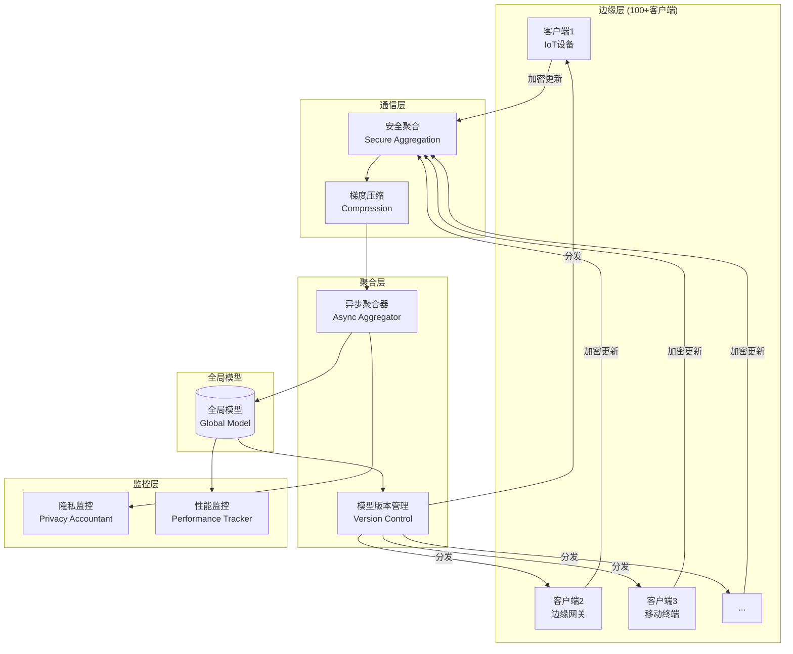
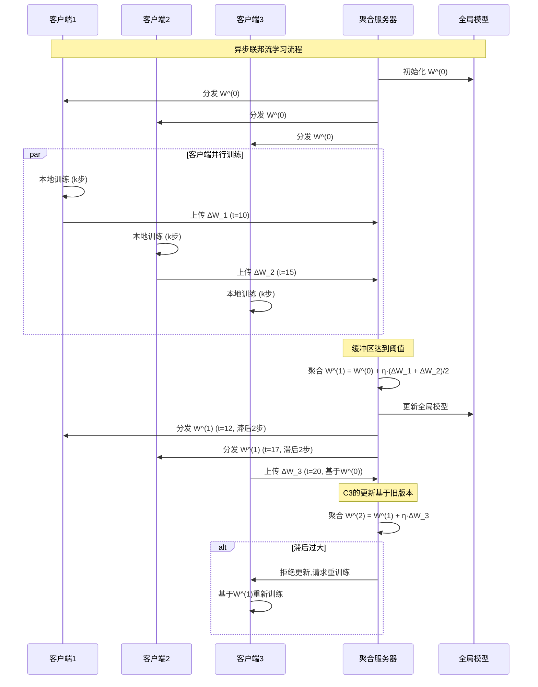

# 联邦流学习：联邦学习+流处理的隐私保护与分布式训练

> 所属阶段: Knowledge/06-frontier | 前置依赖: [01.01-stream-processing-fundamentals.md](../01-concept-atlas/01.01-stream-processing-fundamentals.md), [边缘流处理架构](edge-streaming-architecture.md) | 形式化等级: L4-L5 | 版本: v1.0 (2026)

---

## 1. 概念定义 (Definitions)

### Def-K-FSL-01: 联邦流学习 (Federated Streaming Learning)

**定义**: 联邦流学习是将联邦学习的分布式协作训练与流处理的实时性需求相结合的机器学习范式，形式化为八元组：

$$
\mathcal{FSL} \triangleq \langle \mathcal{C}, \mathcal{S}, \mathcal{W}, \mathcal{A}, \mathcal{P}, \mathcal{T}, \mathcal{U}, \mathcal{F} \rangle
$$

其中：

| 组件 | 符号 | 形式化定义 | 语义解释 |
|------|------|------------|----------|
| 客户端集合 | $\mathcal{C}$ | $\{c_1, c_2, ..., c_n\}$ | 参与协作训练的分布式节点 |
| 数据流 | $\mathcal{S}$ | $\{s_c | c \in \mathcal{C}\}$ | 各客户端的本地数据流 |
| 全局模型 | $\mathcal{W}$ | $W^{(t)} \in \mathbb{R}^d$ | 第 $t$ 轮的全局模型参数 |
| 聚合算法 | $\mathcal{A}$ | $W^{(t+1)} = \mathcal{A}(\{W_c^{(t+1)}\})$ | 客户端模型聚合规则 |
| 隐私机制 | $\mathcal{P}$ | $\tilde{W}_c = \mathcal{P}(W_c)$ | 模型参数隐私保护变换 |
| 通信拓扑 | $\mathcal{T}$ | $G = (\mathcal{C}, \mathcal{E})$ | 客户端间通信图结构 |
| 更新策略 | $\mathcal{U}$ | $\Delta W_c = \mathcal{U}(s_c, W^{(t)})$ | 本地模型更新规则 |
| 容错机制 | $\mathcal{F}$ | $f: \mathcal{C}_{failed} \rightarrow \mathcal{C}_{backup}$ | 故障恢复策略 |

**联邦流学习 vs 传统联邦学习**:

```
┌─────────────────────────────────────────────────────────────────────┐
│              联邦流学习 vs 传统联邦学习对比                           │
├─────────────────────────────────────────────────────────────────────┤
│                                                                     │
│  传统联邦学习 (Federated Learning)        联邦流学习 (FSL)           │
│  ┌─────────────────────────────────┐     ┌─────────────────────────┐│
│  │                                 │     │                         ││
│  │  数据特征: 静态数据集              │     │  数据特征: 连续数据流      ││
│  │  • 批量训练                      │     │  • 在线/增量学习          ││
│  │  • 固定样本量                    │     │  • 概念漂移适应           ││
│  │  • IID/Non-IID划分              │     │  • 时序相关性             ││
│  │                                 │     │                         ││
│  │  训练模式: 轮询同步                │     │  训练模式: 异步连续        ││
│  │  • 全局 rounds                   │     │  • 持续学习               ││
│  │  • 等待所有客户端                │     │  • 流式聚合               ││
│  │  • 大批量聚合                    │     │  • 事件触发更新           ││
│  │                                 │     │                         ││
│  │  延迟容忍: 分钟-小时级             │     │  延迟要求: 秒-毫秒级       ││
│  │                                 │     │                         ││
│  │  典型应用: 手机输入法、医疗影像      │     │  典型应用: IoT监控、金融风控 ││
│  │                                 │     │                         ││
│  └─────────────────────────────────┘     └─────────────────────────┘│
│                                                                     │
└─────────────────────────────────────────────────────────────────────┘
```

---

### Def-K-FSL-02: 差分隐私流学习 (Differentially Private Streaming Learning)

**定义**: 在流数据上满足 $(\epsilon, \delta)$-差分隐私的联邦学习机制，对于相邻数据流 $S$ 和 $S'$（相差一个元素）：

$$
\Pr[\mathcal{M}(S) \in O] \leq e^{\epsilon} \cdot \Pr[\mathcal{M}(S') \in O] + \delta
$$

**流式DP机制实现**:

| 机制 | 噪声添加位置 | 噪声类型 | 隐私预算管理 |
|------|------------|---------|-------------|
| **DP-SGD** | 梯度更新 | Gaussian | 组合定理 |
| **DP-FTRL** | 累积梯度 | Tree-based | 隐私账户 |
| **Local DP** | 本地数据 | Laplace | 无中心信任 |
| **shuffle DP** | 混洗后聚合 | 亚高斯 | 隐私放大 |

**隐私预算消耗**:

在流式场景下，隐私预算的连续消耗是关键挑战。使用**隐私损失分布 (PLD)** 进行精确账户管理：

$$
\epsilon_{total} = \text{PLD\_composition}(\{\epsilon_i\}_{i=1}^T)
$$

---

## 2. 属性推导 (Properties)

### Lemma-K-FSL-01: 流式联邦平均的收敛性

**引理**: 在非凸目标函数和满足 L-光滑的条件下，流式联邦平均的收敛速度为：

$$
\min_{t \in [T]} \mathbb{E}[||\nabla f(W^{(t)})||^2] \leq O\left(\frac{1}{\sqrt{nT}} + \frac{\sigma^2}{\sqrt{nK}} + \frac{\zeta^2}{T}\right)
$$

其中：

- $n$: 客户端数量
- $T$: 通信轮数
- $K$: 本地更新次数
- $\sigma^2$: 随机梯度方差
- $\zeta^2$: 客户端异质性度量

**与传统FL的差异**: 流式场景的 $T$ 理论上无限增长，需要特殊处理（如衰减学习率）。

---

### Lemma-K-FSL-02: 异步聚合的偏差-方差权衡

**引理**: 在异步联邦学习中，设客户端 $c$ 的模型版本滞后为 $\tau_c$，则全局模型的偏差为：

$$
\text{Bias} = \mathbb{E}[||W^{(t)} - W^{(t)}_{sync}||] \propto \frac{1}{n} \sum_{c=1}^n \tau_c \cdot \eta \cdot G
$$

其中 $G$ 是梯度上界，$\eta$ 是学习率。

**权衡策略**:

- 严格同步: 偏差=0，但延迟高
- 完全异步: 延迟低，但偏差大
- 有界异步: 折中方案（限制最大滞后 $\tau_{max}$）

---

### Thm-K-FSL-01: 联邦流学习的隐私-效用权衡

**定理**: 在满足 $(\epsilon, \delta)$-差分隐私的联邦流学习中，模型效用（测试精度）满足：

$$
Acc \geq Acc_{non\_private} - O\left(\frac{d \cdot \log(1/\delta)}{n^2 \epsilon^2}\right) - O(\sigma_{drift})
$$

其中：

- 第一项: 非隐私基准精度
- 第二项: 隐私噪声引入的性能损失
- 第三项: 概念漂移导致的性能损失（流式特有）

*证明概要*:

1. 差分隐私噪声添加导致收敛到次优点，误差界由噪声方差决定
2. 流式场景下，概念漂移使最优解随时间变化，引入额外误差
3. 综合两项误差得到上述界限 $\square$

---

## 3. 关系建立 (Relations)

### 3.1 联邦流学习技术矩阵

| 技术维度 | 同步FL | 异步FL | 分层FL | 完全去中心化 |
|---------|--------|--------|--------|-------------|
| **通信模式** | 星型 | 星型 | 树形 | P2P网络 |
| **延迟容忍** | 低 | 高 | 中 | 高 |
| **容错性** | 低 | 高 | 中 | 高 |
| **带宽效率** | 低 | 中 | 高 | 中 |
| **实现复杂度** | 低 | 中 | 中 | 高 |
| **适用场景** | 数据中心 | 边缘设备 | 跨地域 | 区块链/IoT |

### 3.2 隐私保护技术对比

```
┌─────────────────────────────────────────────────────────────────────┐
│                    隐私保护技术选择决策树                              │
├─────────────────────────────────────────────────────────────────────┤
│                                                                     │
│                    ┌───────────────────┐                           │
│                    │ 隐私威胁模型分析    │                           │
│                    └─────────┬─────────┘                           │
│                              │                                     │
│          ┌───────────────────┼───────────────────┐                 │
│          ▼                   ▼                   ▼                 │
│    ┌───────────┐      ┌───────────┐      ┌───────────┐            │
│    │ 中心服务器 │      │  中间人    │      │  其他客户端 │            │
│    │ 不可信?   │      │  攻击?    │      │  不可信?   │            │
│    └─────┬─────┘      └─────┬─────┘      └─────┬─────┘            │
│          │                  │                  │                   │
│         Yes                Yes                Yes                  │
│          │                  │                  │                   │
│          ▼                  ▼                  ▼                   │
│    ┌───────────┐      ┌───────────┐      ┌───────────┐            │
│    │ 本地差分  │      │ 安全聚合  │      │ 安全多方  │            │
│    │ 隐私 LDP  │      │ SecureAgg│      │ 计算 MPC  │            │
│    ├───────────┤      ├───────────┤      ├───────────┤            │
│    │ • 高噪声  │      │ • 聚合前加密│      │ • 密码学保护│            │
│    │ • 无需信任│      │ • 服务器只 │      │ • 计算开销大│            │
│    │ • 效用较低│      │   见加密和 │      │ • 最高安全性│            │
│    │           │      │   聚合结果 │      │           │            │
│    └───────────┘      └───────────┘      └───────────┘            │
│                                                                     │
│  组合方案:                                                          │
│  • LDP + SecureAgg: 双重保护                                        │
│  • 同态加密 + DP: 隐私增强                                           │
│  • 联邦学习 + TEE: 硬件可信执行                                      │
│                                                                     │
└─────────────────────────────────────────────────────────────────────┘
```

### 3.3 流式聚合算法演进

| 算法 | 核心思想 | 通信开销 | 收敛速度 | 流式适配 |
|------|---------|---------|---------|---------|
| **FedAvg** | 加权平均 | $O(d)$ | 中 | 需修改 |
| **FedProx** | 近端正则 | $O(d)$ | 中 | 良好 |
| **SCAFFOLD** | 控制变量 | $O(2d)$ | 快 | 需修改 |
| **FedBuff** | 异步聚合 | $O(d)$ | 中 | 原生支持 |
| **MimeLite** | 动量归一 | $O(d)$ | 快 | 良好 |
| **FedStream** | 滑动窗口 | $O(kd)$ | 中 | 原生支持 |

---

## 4. 论证过程 (Argumentation)

### 4.1 联邦流学习的核心挑战

| 挑战 | 具体问题 | 影响 | 解决方案方向 |
|------|---------|------|-------------|
| **系统异构** | 客户端计算/存储/网络差异大 | 掉队者问题 | 异步聚合、模型分割 |
| **数据异构** | Non-IID分布、概念漂移 | 收敛慢、精度低 | 个性化层、元学习 |
| **通信瓶颈** | 高维模型上传带宽受限 | 训练延迟高 | 梯度压缩、稀疏更新 |
| **隐私安全** | 梯度泄露攻击 | 数据泄露风险 | 差分隐私、安全聚合 |
| **节点动态** | 设备随时加入/离开 | 不稳定 | 容错聚合、检查点 |

### 4.2 通信效率优化论证

**问题**: 大模型（如LLM）的联邦训练通信开销巨大。

**压缩技术对比**:

| 技术 | 压缩率 | 精度损失 | 计算开销 | 适用场景 |
|------|--------|---------|---------|---------|
| Top-k稀疏 | 10-100x | 1-3% | 低 | 梯度稀疏场景 |
| 量化 (INT8) | 4x | 0.5-2% | 低 | 通用场景 |
| 量化 (INT4) | 8x | 2-5% | 中 | 高压缩需求 |
| Sketching | 10-50x | 2-4% | 中 | 高频特征 |
| 低秩分解 | 5-20x | 1-2% | 中 | 矩阵参数 |

**联合压缩策略**:

```
原始梯度 (FP32) ──► Top-k选择 (10%) ──► INT8量化 ──► 压缩表示 (0.4%)
     32d bits          3.2d bits          0.8d bits      0.4d bits
```

---

## 5. 形式证明 / 工程论证 (Proof / Engineering Argument)

### 5.1 异步联邦聚合的收敛分析

**场景**: 客户端以不同频率异步上传模型更新。

**假设**:

- 目标函数 $f$ 是 $L$-光滑的
- 随机梯度方差有界: $\mathbb{E}[||g_c - \nabla f_c||^2] \leq \sigma^2$
- 梯度有界: $||\nabla f_c|| \leq G$
- 最大滞后: $\tau_c \leq \tau_{max}$

**定理**: 在上述假设下，异步联邦平均的收敛率为：

$$
\frac{1}{T} \sum_{t=1}^T \mathbb{E}[||\nabla f(W^{(t)})||^2] \leq O\left(\frac{1}{\sqrt{nT}}\right) + O\left(\frac{\tau_{max}}{T}\right)
$$

*工程启示*:

- 当 $T$ 很大时，第一项主导，收敛与同步相当
- 限制最大滞后 $\tau_{max}$ 可控制偏差

---

### 5.2 安全聚合协议设计

**目标**: 服务器只能看到聚合结果，无法获取单个客户端更新。

**基于秘密共享的方案**:

```
┌─────────────────────────────────────────────────────────────────────┐
│                    安全聚合协议流程                                   │
├─────────────────────────────────────────────────────────────────────┤
│                                                                     │
│  客户端c:                                                           │
│  1. 本地训练得到 ΔW_c                                               │
│  2. 与每个其他客户端c'协商随机种子seed_{c,c'}                        │
│  3. 计算掩码: mask_{c,c'} = PRNG(seed_{c,c'}, round)                │
│  4. 掩码更新: ΔW̃_c = ΔW_c + Σ_{c'<c} mask_{c,c'} - Σ_{c'>c} mask_{c,c'}│
│  5. 上传 ΔW̃_c 到服务器                                              │
│                                                                     │
│  服务器:                                                            │
│  6. 接收所有 ΔW̃_c                                                   │
│  7. 聚合: Σ_c ΔW̃_c = Σ_c ΔW_c + Σ_{c,c'} (mask_{c,c'} - mask_{c,c'})│
│                    = Σ_c ΔW_c  (掩码抵消)                           │
│                                                                     │
│  安全性:                                                            │
│  • 服务器只看到掩码后的更新                                          │
│  • 需要至少2个客户端共谋才能恢复单个更新                              │
│  • 可扩展: 使用成对掩码 -> 树形聚合                                  │
│                                                                     │
└─────────────────────────────────────────────────────────────────────┘
```

**通信开销**:

- 原始FedAvg: $O(nd)$ 每轮 ($n$ 客户端，$d$ 维度)
- 安全聚合: $O(nd + n^2)$（额外 $n^2$ 用于密钥协商，可摊销）

---

## 6. 实例验证 (Examples)

### 6.1 联邦流学习系统实现

**场景**: 分布式IoT设备的异常检测

```python
import torch
import torch.nn as nn
from typing import List, Dict
import numpy as np

class FederatedStreamingLearner:
    """联邦流学习协调器"""

    def __init__(self, model: nn.Module, num_clients: int):
        self.global_model = model
        self.num_clients = num_clients
        self.round = 0

        # 异步聚合配置
        self.buffer_size = 10  # 缓冲多少客户端更新
        self.update_buffer = []

        # 隐私配置
        self.dp_epsilon = 1.0
        self.dp_delta = 1e-5
        self.max_grad_norm = 1.0

    def client_update(self, client_id: int, local_stream: torch.utils.data.DataLoader):
        """客户端本地训练"""
        local_model = copy.deepcopy(self.global_model)
        local_model.train()

        optimizer = torch.optim.SGD(local_model.parameters(), lr=0.01)

        # 本地训练 (使用流式小批量)
        for batch_idx, (data, target) in enumerate(local_stream):
            optimizer.zero_grad()
            output = local_model(data)
            loss = nn.CrossEntropyLoss()(output, target)
            loss.backward()

            # 梯度裁剪 (隐私保护)
            torch.nn.utils.clip_grad_norm_(
                local_model.parameters(),
                self.max_grad_norm
            )

            optimizer.step()

            # 流式场景: 每个batch后检查是否需要上传
            if self.should_upload(batch_idx):
                break

        # 计算模型更新
        local_update = {}
        for name, param in local_model.named_parameters():
            local_update[name] = param.data - self.global_model.state_dict()[name]

        # 添加差分隐私噪声
        local_update = self.add_dp_noise(local_update)

        return local_update

    def add_dp_noise(self, update: Dict[str, torch.Tensor]) -> Dict[str, torch.Tensor]:
        """添加高斯噪声实现DP"""
        sensitivity = 2 * self.max_grad_norm  # L2敏感度
        noise_std = np.sqrt(2 * np.log(1.25 / self.dp_delta)) * sensitivity / self.dp_epsilon

        noisy_update = {}
        for name, tensor in update.items():
            noise = torch.randn_like(tensor) * noise_std
            noisy_update[name] = tensor + noise

        return noisy_update

    def async_aggregate(self, client_updates: List[Dict]):
        """异步聚合算法 (FedBuff风格)"""
        self.update_buffer.extend(client_updates)

        # 当缓冲足够时聚合
        if len(self.update_buffer) >= self.buffer_size:
            # 加权平均
            total_weight = sum(len(u) for u in self.update_buffer)

            aggregated = {}
            for name in self.global_model.state_dict().keys():
                aggregated[name] = sum(
                    u[name] * len(u) / total_weight
                    for u in self.update_buffer
                )

            # 更新全局模型
            with torch.no_grad():
                for name, param in self.global_model.named_parameters():
                    param.data += aggregated[name]

            self.update_buffer = []
            self.round += 1

            return True  # 完成一轮聚合

        return False  # 继续缓冲

class StreamingClient:
    """流式联邦学习客户端"""

    def __init__(self, client_id: int, device: str):
        self.client_id = client_id
        self.device = device
        self.local_buffer = []
        self.buffer_limit = 1000

    def process_stream_event(self, event: Dict):
        """处理单个流事件"""
        self.local_buffer.append(event)

        # 当缓冲足够时触发本地训练
        if len(self.local_buffer) >= self.buffer_limit:
            return self.train_and_upload()

        return None

    def train_and_upload(self) -> Dict:
        """本地训练并返回更新"""
        # 将缓冲转换为训练数据
        dataset = self.buffer_to_dataset(self.local_buffer)
        loader = torch.utils.data.DataLoader(dataset, batch_size=32)

        # 执行本地训练 (由协调器调用)
        self.local_buffer = []  # 清空缓冲
        return loader  # 返回数据加载器供训练使用

    def handle_concept_drift(self, drift_detected: bool):
        """处理概念漂移"""
        if drift_detected:
            # 增加本地训练轮数
            self.local_epochs *= 2
            # 减小学习率
            self.learning_rate *= 0.5
            # 触发紧急上传
            return True
        return False

# 系统启动流程 def run_federated_stream_learning():
    # 初始化全局模型
    model = AnomalyDetectionModel(input_dim=100, hidden_dim=64)

    # 创建协调器
    coordinator = FederatedStreamingLearner(model, num_clients=100)

    # 创建客户端
    clients = [StreamingClient(i, f"device_{i}") for i in range(100)]

    # 模拟流数据处理
    for timestamp in range(100000):
        for client in clients:
            # 模拟接收流事件
            event = generate_stream_event(client.client_id, timestamp)
            result = client.process_stream_event(event)

            if result is not None:
                # 执行本地训练
                update = coordinator.client_update(client.client_id, result)

                # 异步聚合
                aggregated = coordinator.async_aggregate([update])

                if aggregated:
                    print(f"Round {coordinator.round} completed")
```

### 6.2 隐私保护效果评估

```python
def evaluate_privacy_guarantees(updates: List[torch.Tensor],
                                 epsilon: float,
                                 delta: float):
    """评估隐私保护效果"""

    # 1. 成员推理攻击测试
    mia_accuracy = membership_inference_attack(updates)

    # 2. 梯度泄露攻击测试
    reconstructed_data = gradient_inversion_attack(updates)
    recovery_psnr = calculate_psnr(reconstructed_data, original_data)

    # 3. 属性推理攻击测试
    attribute_acc = attribute_inference_attack(updates)

    return {
        'epsilon': epsilon,
        'delta': delta,
        'mia_accuracy': mia_accuracy,
        'recovery_psnr': recovery_psnr,
        'attribute_acc': attribute_acc,
        'privacy_utility_tradeoff': calculate_tradeoff(
            epsilon, model_accuracy
        )
    }

# 不同隐私预算下的性能 privacy_results = []
for eps in [0.1, 0.5, 1.0, 2.0, 4.0, 8.0]:
    result = evaluate_privacy_guarantees(updates, eps, 1e-5)
    privacy_results.append(result)

# 典型结果:
# eps=0.1:  隐私极高,模型精度下降30%
# eps=1.0:  隐私高,模型精度下降10%
# eps=8.0:  隐私中等,模型精度下降2%
```

---

## 7. 可视化 (Visualizations)

### 7.1 联邦流学习架构



### 7.2 异步联邦学习流程



### 7.3 隐私-效用权衡曲线

```mermaid
xychart-beta
    title "隐私预算 (ε) 与模型精度权衡"
    x-axis "隐私预算 ε" [0.1, 0.5, 1.0, 2.0, 4.0, 8.0, ∞]
    y-axis "测试精度 (%)" 50 --> 95

    line [55, 65, 75, 82, 87, 91, 93]
    line [70, 78, 84, 88, 90, 91, 91]
    line [60, 72, 80, 85, 88, 90, 92]

    legend "FedAvg+DP"
    legend "FedProx+DP"
    legend "个性化FL+DP"
```

---

## 8. 引用参考 (References)
