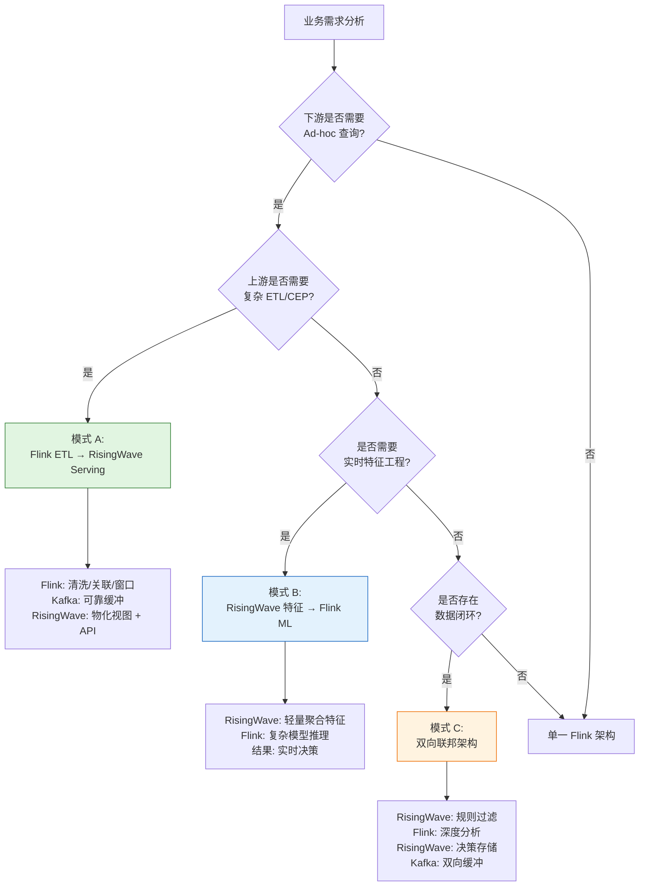
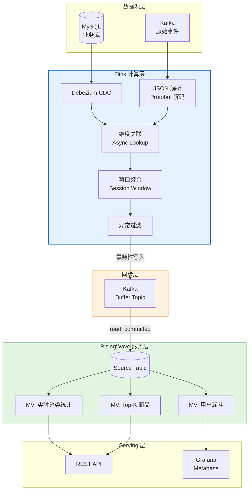
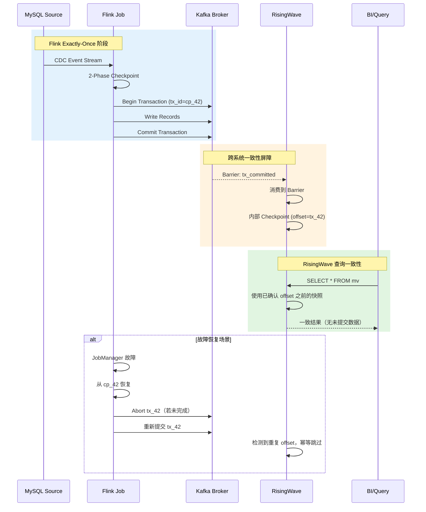
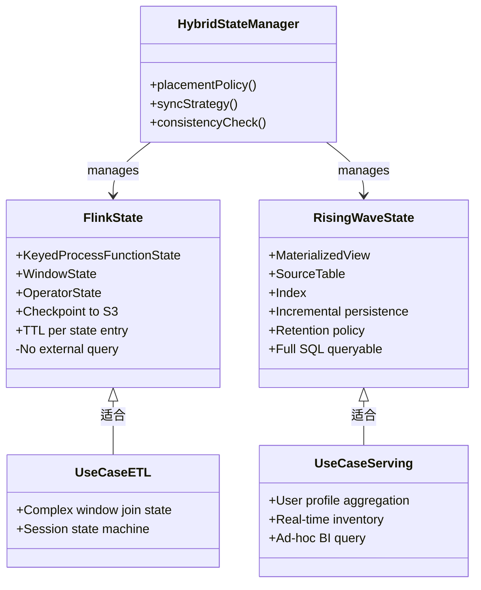

# Flink + RisingWave 混合架构生产实践指南

> **所属阶段**: Knowledge/06-frontier | **前置依赖**: [Flink/01-concepts/flink-system-architecture-deep-dive.md](../../Flink/01-concepts/flink-system-architecture-deep-dive.md), [Knowledge/06-frontier/streaming-databases-deep.md](./streaming-databases-deep/streaming-database-comprehensive-matrix.md) | **形式化等级**: L4-L5 | **文档版本**: v1.0 | **最后更新**: 2026-04-19

---

## 1. 概念定义 (Definitions)

本节建立 Flink + RisingWave 混合架构的形式化基础，通过严格定义描述两类系统的本质差异、组合方式及关键性质。

### Def-K-06-305 (混合流处理架构)

**混合流处理架构**（Hybrid Stream Processing Architecture, HSPA）是一个六元组：

$$
\mathcal{H} = \langle \mathcal{E}_F, \mathcal{E}_R, \mathcal{S}, \mathcal{M}, \mathcal{C}, \mathcal{G} \rangle
$$

其中各分量定义如下：

- $\mathcal{E}_F$：**Flink 计算层**，负责复杂事件处理（CEP）、有状态计算、窗口聚合和细粒度流控制。其状态空间记为 $S_F$，支持算子级 checkpoint 机制 $chk_F: S_F \rightarrow D_F$（$D_F$ 为持久化存储）。
- $\mathcal{E}_R$：**RisingWave 服务层**，负责物化视图维护、即席查询（Ad-hoc Query）和实时 Serving。其状态空间记为 $S_R$，以增量计算引擎维护物化视图 $MV = \{mv_1, mv_2, \ldots, mv_n\}$。
- $\mathcal{S}$：**同步层**，负责两层之间的数据交换与一致性协调，包含 CDC 捕获器 $\delta_{cdc}$、消息总线 $\mathcal{B}$（如 Kafka/Pulsar）和直接连接通道 $\mathcal{J}$（JDBC/Sink）。
- $\mathcal{M}$：**模式映射**，定义 Flink 输出流 $O_F$ 到 RisingWave 输入源 $I_R$ 的 schema 转换规则集：$\mathcal{M}: schema(O_F) \rightarrow schema(I_R)$。
- $\mathcal{C}$：**一致性协议**，定义端到端一致性级别 $c \in \{at\text{-}least\text{-}once, at\text{-}most\text{-}once, exactly\text{-}once, strong\}$ 及其实现机制。
- $\mathcal{G}$：**治理策略**，包含资源调度、故障恢复策略、监控指标集合和 SLO 约束集合。

> **直观解释**：混合架构不是简单地将两个系统拼接，而是通过明确定义的数据契约、同步机制和一致性协议，使 Flink 的"深度计算能力"与 RisingWave 的"广度查询能力"形成互补。

### Def-K-06-306 (流处理引擎功能剖面)

设流处理引擎 $E$ 的功能剖面为一个四元组 $P(E) = \langle C(E), Q(E), S(E), L(E) \rangle$，其中：

- $C(E)$：**计算复杂度容量**，表示引擎可表达的计算类型集合。对于 Flink：
  $$C(Flink) = \{\text{CEP}, \text{Session Window}, \text{Async I/O}, \text{Process Function}, \text{ML Inference}\}$$
- $Q(E)$：**查询灵活性**，表示支持的查询模式集合。对于 RisingWave：
  $$Q(RisingWave) = \{\text{Ad-hoc SQL}, \text{MV Join}, \text{Nested Subquery}, \text{Time-travel}, \text{Lookup}\}$$
- $S(E)$：**状态管理粒度**，表示状态抽象的精细程度。Flink 提供算子级状态 $S_F^{op}$，RisingWave 提供表级物化视图状态 $S_R^{tbl}$。
- $L(E)$：**延迟特性**，表示从数据到达至结果可观测的端到端延迟分布 $L(E) \sim \mathcal{D}(\mu, \sigma^2)$。

**功能剖面差异量化**：定义差异度量为对称差集大小：

$$
\Delta(P_1, P_2) = |C(E_1) \setminus C(E_2)| + |Q(E_1) \setminus Q(E_2)| + |S(E_1) \setminus S(E_2)|
$$

对于 Flink 与 RisingWave：$\Delta(P_{Flink}, P_{RisingWave}) > 0$，且两者在 $Q$ 和 $C$ 维度上高度互补。

### Def-K-06-307 (物化视图实时性)

在 RisingWave 中，物化视图 $mv$ 的**实时性**由 freshness 函数刻画：

$$
\mathcal{F}(mv, t) = t - \max\{ t_{source}(r) \mid r \in mv(t) \}
$$

其中 $t_{source}(r)$ 表示结果行 $r$ 所依赖的源数据的最晚事件时间。理想情况下：

$$
\lim_{t \rightarrow \infty} \mathcal{F}(mv, t) \leq \epsilon
$$

$\epsilon$ 为系统配置的 freshness SLO（通常 $< 1s$）。

**增量更新延迟**定义：设源表更新事件为 $e_k$，对应的物化视图更新为 $\Delta mv_k$，则增量更新延迟为：

$$
\tau_{inc}(k) = T(\Delta mv_k\text{ 生效}) - T(e_k\text{ 到达})
$$

在 RisingWave 中，由于采用 no-separate-job-cluster 架构，$\tau_{inc}$ 主要取决于内部 barrier 传播时间，典型值在亚秒级别[^1]。

### Def-K-06-308 (端到端一致性边界)

混合架构的**端到端一致性边界**（End-to-End Consistency Frontier, E2ECF）是一个三元组：

$$
\mathcal{B}_{e2e} = \langle \mathcal{W}, \Phi, \mathcal{R} \rangle
$$

- $\mathcal{W}$：**水印传播链**，记录水印在 Flink 和 RisingWave 之间的传递路径。设 Flink 输出水印为 $W_F$，经同步层后 RisingWave 观测到的有效水印为 $W'_R$，则水印漂移 $drift_W = W_F - W'_R$。
- $\Phi$：**幂等性保证函数**，$\Phi: O_F \times I_R \rightarrow \{0, 1\}$，当且仅当数据在跨系统传输中具备幂等接收能力时取值为 1。
- $\mathcal{R}$：**恢复点集合**，包含 Flink checkpoint $cp_F$、RisingWave 内部一致性点 $cp_R$ 及两者之间的对齐关系 $align(cp_F, cp_R)$。

**一致性级别判定**：混合架构达到 exactly-once 语义当且仅当：

$$
\forall o \in O_F: \Phi(o) = 1 \land \exists cp_F, cp_R: align(cp_F, cp_R) \land drift_W < \delta_{max}
$$

### Def-K-06-309 (联邦查询执行计划)

**联邦查询**（Federated Query）是在混合架构中跨越 Flink 和 RisingWave 的查询操作。其执行计划为一棵异构执行树：

$$
\mathcal{T}_{fed} = \langle V_F \cup V_R, E_{shuffle} \cup E_{local} \rangle
$$

- $V_F$：在 Flink 中执行的算子集合（复杂窗口、CEP、UDF）
- $V_R$：在 RisingWave 中执行的算子集合（索引扫描、轻量聚合、Lookup Join）
- $E_{shuffle}$：跨系统数据交换边，代价模型为 $cost(e) = \alpha \cdot |data| + \beta \cdot latency$
- $E_{local}$：系统内部数据交换边

联邦查询优化目标为最小化总执行代价：

$$
\min_{\mathcal{T}_{fed}} \sum_{e \in E_{shuffle}} cost(e) + \sum_{v \in V_F} cost_F(v) + \sum_{v \in V_R} cost_R(v)
$$

---

## 2. 属性推导 (Properties)

### Lemma-K-06-301 (功能互补性引理)

**陈述**：设 Flink 和 RisingWave 的功能剖面分别为 $P_F = \langle C_F, Q_F, S_F, L_F \rangle$ 和 $P_R = \langle C_R, Q_R, S_R, L_R \rangle$，则：

$$
C_F \cap C_R \neq \emptyset \quad \text{且} \quad Q_F \cap Q_R = \emptyset \quad \text{（在 Ad-hoc 查询维度）}
$$

**证明**：

1. **计算交集非空**：两者均支持基础流式聚合（stream aggregation）、过滤（filter）和投影（project）。即 $\{\text{filter}, \text{project}, \text{stream aggregation}\} \subseteq C_F \cap C_R$。

2. **查询交集为空（Ad-hoc 维度）**：Flink 的查询接口以预注册 SQL（Persistent Query）为主，虽然 Flink SQL Client 支持交互式查询，但其本质仍是将查询编译为长期运行的流作业，不具备 RisingWave 的即时响应特性。RisingWave 作为流数据库，其 Ad-hoc 查询在毫秒级返回，这是 Flink 架构所不具备的。因此，在"即席查询响应能力"这一维度上，$Q_F^{adhoc} = \emptyset$，$Q_R^{adhoc} \neq \emptyset$，交集为空。

3. **互补性推论**：由于 $C_F \setminus C_R$ 包含 CEP、ProcessFunction、Async I/O 等复杂计算原语，而 $Q_R \setminus Q_F$ 包含物化视图即席查询、索引查找等 Serving 原语，两者形成自然的分层互补关系。

$\square$

### Prop-K-06-301 (混合架构延迟下界)

**陈述**：在混合架构 $\mathcal{H}$ 中，端到端处理延迟 $T_{e2e}$ 存在理论下界：

$$
T_{e2e} \geq \max\{ L_F^{proc}, L_R^{proc} \} + L_{sync} + L_{net}
$$

其中：

- $L_F^{proc}$：Flink 处理延迟（含 checkpoint 屏障对齐时间）
- $L_R^{proc}$：RisingWave 增量计算延迟（含 barrier 传播时间）
- $L_{sync}$：同步层延迟（CDC 捕获 + 序列化 + 反序列化）
- $L_{net}$：网络传输延迟

**证明**：

1. 数据流必须依次经过 Flink 处理层、同步层和 RisingWave 服务层（或反向），各阶段延迟为串行累积关系。

2. 在 Flink 使用两阶段 checkpoint 时，屏障对齐时间 $T_{align}$ 与反压程度正相关[^2]。设 Flink 作业并行度为 $p$，则最坏情况下：
   $$T_{align}^{worst} = \max_{i \in [1,p]} \{ T_i^{barrier} \}$$
   其中 $T_i^{barrier}$ 为第 $i$ 个 subtask 的屏障处理时间。

3. RisingWave 采用 shared-nothing 增量计算，其 barrier 传播时间为：
   $$L_R^{proc} = \sum_{j=1}^{k} (T_j^{compute} + T_j^{state\_update})$$
   其中 $k$ 为 MV 依赖链长度。

4. 同步层引入的额外延迟不可消除：即使使用直接 JDBC Sink，仍需序列化/反序列化开销 $L_{serde}$ 和连接池调度开销 $L_{pool}$。

5. 因此，总延迟为各阶段延迟之和，下界由最慢路径决定。

$\square$

### Lemma-K-06-302 (物化视图一致性传播)

**陈述**：若 Flink 以 exactly-once 语义将输出流 $O_F$ 写入 RisingWave，且 RisingWave 内部使用强一致性屏障协议，则对于任意查询 $q$ 在 RisingWave 上的执行结果 $q(S_R(t))$，存在 Flink 状态 $S_F(t')$ 使得：

$$
q(S_R(t)) \subseteq f(S_F(t')), \quad t' \leq t + \tau_{sync}
$$

其中 $f$ 为 Flink 计算逻辑，$\tau_{sync}$ 为同步层最大延迟。

**工程解释**：该引理表明 RisingWave 中的查询结果始终对应 Flink 某个历史状态的子集（考虑同步延迟），不存在"来自未来"的数据。这是混合架构中保证查询结果可解释性的基础。

---

## 3. 关系建立 (Relations)

### 3.1 与 Lambda 架构的关系

传统的 Lambda 架构将数据处理分为**批处理层**（Batch Layer）和**速度层**（Speed Layer）：

| 维度 | Lambda 架构 | Flink + RisingWave 混合架构 |
|------|-------------|---------------------------|
| 批处理层 | Hadoop/Spark Batch | —（统一流处理，无需离线重算） |
| 速度层 | Storm/Spark Streaming | Flink（复杂计算）+ RisingWave（实时 Serving） |
|  serving 层 | 独立数据库 | RisingWave 物化视图直接 Serving |
| 一致性 | 最终一致性 | 可配置 exactly-once |
| 数据冗余 | 视图层与批层重复计算 | 增量计算，无重复 |

混合架构本质上是 **Kappa 架构**[^3] 的增强形态：以统一的流处理为基础（Flink），但通过 RisingWave 的物化视图能力弥补了纯流系统在即席查询上的不足。

### 3.2 与 Data Mesh 的关系

在 Data Mesh 范式中[^4]，Flink + RisingWave 混合架构可以视为一个**实时数据产品节点**：

- **领域所有权**：Flink 作业由数据工程团队维护，RisingWave 物化视图由领域团队消费
- **数据即产品**：RisingWave 中的物化视图 $mv$ 是一个自包含的数据产品，具有明确的 schema 契约和服务等级目标
- **联邦计算治理**：混合架构中的一致性协议 $\mathcal{C}$ 对应 Data Mesh 中的联邦治理规则

### 3.3 与流数据库生态的关系

在流数据库谱系中，RisingWave 与 Materialize、Timeplus、DeltaStream 等系统处于同一类别。Flink + RisingWave 的混合模式代表了一种**"通用引擎 + 专用数据库"**的分层策略，与单一系统策略（如 Flink Table Store、Materialize Standalone）形成对比：

$$
\text{架构策略} = \begin{cases}
\text{分层策略} & \mathcal{H} = \langle \text{通用引擎}, \text{专用数据库} \rangle \\
\text{统一策略} & \mathcal{U} = \text{单一系统承载全部负载}
\end{cases}
$$

分层策略的优势在于**专业化分工**（specialized division of labor），统一策略的优势在于**运维简化**（operational simplicity）。选择依据取决于组织的技术成熟度和运维能力边界。

---

## 4. 论证过程 (Argumentation)

### 4.1 三种混合架构模式的适用性论证

#### 模式 A：Flink ETL → RisingWave Serving（单向流）

**适用条件**：

- 业务需要复杂数据清洗、格式转换或跨源关联（如 JSON 嵌套解析、Protobuf 解码、维度表异步 Lookup）
- 下游需要高并发、低延迟的即席查询（如 BI Dashboard、实时 API）
- 数据新鲜度要求 $< 5s$，但查询模式频繁变化

**形式化描述**：

$$
\mathcal{H}_A = \langle \mathcal{E}_F^{ETL}, \mathcal{E}_R^{serve}, \mathcal{S}_{kafka}, \mathcal{M}_{A}, \mathcal{C}_{eo}, \mathcal{G}_{A} \rangle
$$

其中 $\mathcal{S}_{kafka}$ 为 Kafka 中间层，$\mathcal{C}_{eo}$ 为 exactly-once 一致性配置。

**典型数据流**：

$$
\text{Source} \xrightarrow{CDC} \text{Flink} \xrightarrow{\text{复杂 ETL}} \text{Kafka} \xrightarrow{Sink} \text{RisingWave} \xrightarrow{SQL} \text{API/Dashboard}
$$

#### 模式 B：RisingWave 实时视图 → Flink 深度分析（反向流）

**适用条件**：

- 需要轻量级实时聚合作为特征输入（如 RisingWave 计算近 1 小时用户行为统计）
- Flink 执行复杂 ML 推理或图计算（如欺诈检测模型、用户相似度计算）
- RisingWave 作为特征存储（Feature Store）的实时层

**形式化描述**：

$$
\mathcal{H}_B = \langle \mathcal{E}_F^{ML}, \mathcal{E}_R^{feature}, \mathcal{S}_{jdbc}, \mathcal{M}_{B}, \mathcal{C}_{alo}, \mathcal{G}_{B} \rangle
$$

其中 $\mathcal{S}_{jdbc}$ 为 RisingWave JDBC Source，Flink 以批模式或 Lookup Join 读取 RisingWave 物化视图。

**典型数据流**：

$$
\text{Event Stream} \rightarrow \text{RisingWave} \xrightarrow{MV} \text{特征表} \xrightarrow{JDBC\ Lookup} \text{Flink} \xrightarrow{ML\ Inference} \text{决策结果}
$$

#### 模式 C：双向联邦（Bidirectional Federation）

**适用条件**：

- 闭环实时系统（如实时风控：RisingWave 规则过滤 → Flink 模型评分 → RisingWave 决策记录）
- 双向数据依赖：Flink 输出影响 RisingWave 状态，RisingWave 更新触发 Flink 重新计算
- 需要严格的事务边界保证

**形式化描述**：

$$
\mathcal{H}_C = \langle \mathcal{E}_F^{loop}, \mathcal{E}_R^{loop}, \mathcal{S}_{bi}, \mathcal{M}_{C}, \mathcal{C}_{strong}, \mathcal{G}_{C} \rangle
$$

其中 $\mathcal{S}_{bi}$ 为双向同步通道，$\mathcal{C}_{strong}$ 要求强一致性或外部事务协调（如 Saga 模式）。

**典型数据流**：

$$
\text{交易事件} \rightarrow \text{RisingWave} \xrightarrow{\text{规则命中}} \text{Kafka} \rightarrow \text{Flink} \xrightarrow{\text{风险评分}} \text{Kafka} \rightarrow \text{RisingWave} \xrightarrow{\text{决策落地}}
$$

**模式 C 的核心挑战**：循环依赖可能导致无限传播（infinite propagation）。需要引入**循环阻断器**（Cycle Breaker）：

$$
\forall e \in \text{Event}: cycle\_depth(e) \leq N_{max}
$$

其中 $cycle\_depth$ 追踪事件在闭环中的传播次数。

### 4.2 状态管理分工论证

Flink 和 RisingWave 的状态管理哲学存在本质差异：

| 维度 | Flink 状态 | RisingWave 物化视图状态 |
|------|-----------|------------------------|
| 抽象层级 | 算子级（KeyedState, OperatorState） | 表级/视图级 |
| 访问模式 | 单条记录读写（get/put/update） | 集合语义（scan/lookup） |
| 持久化 | 异步 checkpoint 到分布式存储 | 增量持久化到 S3/EBS |
| TTL 支持 | 细粒度 State TTL | 表级 retention policy |
| 查询能力 | 无（状态内部不可查询） | 完整 SQL 查询能力 |

**分工原则**：

- **Flink 负责**：需要细粒度控制的状态（如会话窗口合并逻辑、自定义状态机、复杂 join 状态）
- **RisingWave 负责**：需要外部查询的状态（如用户画像实时汇总、商品库存实时统计）

形式化地，设状态访问需求为 $D(state) = \langle internal, external \rangle$，其中 $internal$ 表示仅作业内部访问，$external$ 表示需要外部查询：

$$
\text{placement}(state) = \begin{cases}
S_F & D(state) = \langle 1, 0 \rangle \\
S_R & D(state) = \langle 0, 1 \rangle \\
\text{Both} & D(state) = \langle 1, 1 \rangle \text{（需要同步，引入额外开销）}
\end{cases}
$$

---

## 5. 形式证明 / 工程论证 (Proof / Engineering Argument)

### 5.1 端到端一致性保障方案论证

**定理**（混合架构 Exactly-Once 充分条件）：若满足以下三个条件，混合架构 $\mathcal{H}$ 可达到端到端 exactly-once 语义：

1. **Flink 输出幂等性**：Flink Sink 到同步层使用幂等写入（如 Kafka 的幂等 Producer，或 JDBC 的 UPSERT）
2. **同步层有序性**：消息总线 $\mathcal{B}$ 保证分区级顺序（如 Kafka 的单分区有序）
3. **RisingWave 精确消费**：RisingWave Source 使用有界一致性消费协议，确保每条消息恰好处理一次

**工程论证**：

**步骤 1**：Flink 内部 exactly-once 由两阶段 checkpoint 保证。设 checkpoint 间隔为 $T_{cp}$，则 Flink 在故障时可恢复到最近一致性点 $cp_k$，且重放数据范围不超过 $[cp_k, cp_{k+1})$。

**步骤 2**：Flink Sink 到 Kafka 使用事务性 Producer（Kafka Transactions）。事务 ID 与 Flink checkpoint 绑定：

$$
tx\_id_k = f(cp\_id_k)
$$

这保证了：如果 Flink 作业从 $cp_k$ 恢复，则事务 $tx\_id_k$ 会被中止并重新提交，消费者不会观测到重复数据。

**步骤 3**：RisingWave 消费 Kafka 时，使用内部 barrier 与 Kafka offset 对齐。RisingWave 的 checkpoint 机制保证：

$$
\forall msg \in Kafka: processed(msg) \iff offset(msg) \leq offset_{committed}
$$

其中 $offset_{committed}$ 为 RisingWave 已提交的最大 offset。

**步骤 4**：跨系统一致性对齐。关键观察是：Flink 的 checkpoint $cp_F$ 和 RisingWave 的 checkpoint $cp_R$ 不需要全局同步，只需通过 Kafka 的事务日志保证：Flink 在 $cp_F$ 提交的输出，RisingWave 要么全部可见，要么全部不可见。

这由 Kafka 的事务隔离级别 `read_committed` 保证：RisingWave 作为消费者，仅读取已提交事务的消息，不读取未完成或已中止事务的消息。

**结论**：三个条件的组合构成了端到端 exactly-once 的充分条件。

### 5.2 性能优化策略论证

#### 数据局部性（Data Locality）

在混合架构中，数据局部性关注三个层面：

1. **计算局部性**：Flink TaskManager 与 RisingWave Compute Node 的部署拓扑
   - 共置（Co-location）：同一 K8s Pod 或同一物理机，减少网络跳数
   - 分离（Isolation）：独立资源池，避免资源争抢

   最优部署策略取决于网络带宽 $B_{net}$ 与磁盘 I/O 带宽 $B_{io}$ 的比值：
   $$\text{策略} = \begin{cases} \text{共置} & B_{net} < 0.5 \cdot B_{io} \\ \text{分离} & \text{否则} \end{cases}$$

2. **分区对齐**：Flink 的 KeyGroup 分区与 RisingWave 的 Hash Shard 分区使用相同分区函数：
   $$partition_F(key) = partition_R(key) = hash(key) \bmod N$$
   这保证了跨系统 shuffle 时数据本地性最大化。

#### 查询下推（Query Pushdown）

在模式 B 中，Flink 通过 JDBC 读取 RisingWave。优化策略是将过滤条件下推到 RisingWave：

```
-- Flink SQL（优化前）
SELECT * FROM rw_table WHERE user_id = 'xxx' AND event_time > '2026-04-01'
-- 全表扫描后过滤

-- Flink SQL（优化后）
SELECT * FROM rw_table /*+ PUSH_DOWN_FILTER(user_id = 'xxx', event_time > '2026-04-01') */
-- RisingWave 使用索引直接返回结果
```

下推的收益量化：设 RisingWave 表大小为 $|T|$，过滤后大小为 $|T'|$，网络带宽为 $B$：

$$
\Delta T = \frac{|T| - |T'|}{B} + T_{scan}(|T|) - T_{index\_lookup}(|T'|)
$$

当 $|T| \gg |T'|$ 时，下推收益显著。

#### 缓存策略

在 RisingWave 侧，针对 Flink 高频写入的数据，启用**行级缓存**：

$$
\text{缓存命中率} = \frac{\sum_{q \in Q} \mathbb{1}[data(q) \in Cache]}{|Q|}
$$

建议对以下数据启用缓存：

- 最近 5 分钟内 Flink 写入的"热数据"
- RisingWave 物化视图中被频繁查询的聚合结果
- 维度表（小表）的全量缓存

---

## 6. 实例验证 (Examples)

### 6.1 代码示例：Flink SQL 写入 RisingWave

#### 示例 1：模式 A — Flink ETL → RisingWave

```sql
-- ========== Flink SQL ==========
-- 1. 创建源表（MySQL CDC）
CREATE TABLE user_events (
    event_id STRING,
    user_id STRING,
    event_type STRING,
    properties STRING,  -- JSON 格式
    event_time TIMESTAMP_LTZ(3),
    PRIMARY KEY (event_id) NOT ENFORCED
) WITH (
    'connector' = 'mysql-cdc',
    'hostname' = 'mysql-host',
    'port' = '3306',
    'username' = 'flink_user',
    'password' = '***',
    'database-name' = 'production',
    'table-name' = 'user_events'
);

-- 2. 创建结果表（写入 RisingWave）
CREATE TABLE enriched_events (
    event_id STRING,
    user_id STRING,
    event_type STRING,
    category STRING,
    event_time TIMESTAMP_LTZ(3),
    PRIMARY KEY (event_id) NOT ENFORCED
) WITH (
    'connector' = 'jdbc',
    'url' = 'jdbc:postgresql://risingwave-frontend:4566/dev',
    'table-name' = 'enriched_events',
    'username' = 'root',
    'password' = '',
    'sink.buffer-flush.max-rows' = '1000',
    'sink.buffer-flush.interval' = '2s',
    'sink.max-retries' = '3'
);

-- 3. ETL 逻辑：JSON 解析 + 维度 enrich
INSERT INTO enriched_events
SELECT
    e.event_id,
    e.user_id,
    e.event_type,
    JSON_VALUE(e.properties, '$.category') AS category,
    e.event_time
FROM user_events e;
```

```sql
-- ========== RisingWave SQL ==========
-- 1. 创建源表（接收 Flink 写入）
CREATE TABLE enriched_events (
    event_id STRING PRIMARY KEY,
    user_id STRING,
    event_type STRING,
    category STRING,
    event_time TIMESTAMPTZ
);

-- 2. 创建物化视图：实时分类统计
CREATE MATERIALIZED VIEW category_stats AS
SELECT
    category,
    event_type,
    COUNT(*) AS event_count,
    COUNT(DISTINCT user_id) AS uv,
    MAX(event_time) AS last_event_time
FROM enriched_events
GROUP BY category, event_type;

-- 3. 创建物化视图：用户行为漏斗（5分钟窗口）
CREATE MATERIALIZED VIEW user_funnel_5min AS
SELECT
    user_id,
    window_start,
    COUNT(*) FILTER (WHERE event_type = 'page_view') AS pv,
    COUNT(*) FILTER (WHERE event_type = 'add_cart') AS add_cart_count,
    COUNT(*) FILTER (WHERE event_type = 'purchase') AS purchase_count
FROM TUMBLE(enriched_events, event_time, INTERVAL '5' MINUTE)
GROUP BY user_id, window_start;
```

#### 示例 2：模式 B — RisingWave 特征 → Flink ML 推理

```sql
-- ========== RisingWave SQL ==========
-- 1. 实时用户特征聚合
CREATE MATERIALIZED VIEW user_features AS
SELECT
    user_id,
    COUNT(*) AS total_events_1h,
    COUNT(DISTINCT session_id) AS session_count,
    AVG(amount) FILTER (WHERE event_type = 'purchase') AS avg_purchase,
    MAX(event_time) AS last_active
FROM user_events
WHERE event_time > NOW() - INTERVAL '1' HOUR
GROUP BY user_id;
```

```java
// ========== Flink DataStream API ==========
// 2. Flink 读取 RisingWave 特征进行 ML 推理

DataStream<TransactionEvent> transactions = env
    .addSource(new KafkaSource<>("transactions"))
    .assignTimestampsAndWatermarks(
        WatermarkStrategy.<TransactionEvent>forBoundedOutOfOrderness(Duration.ofSeconds(5))
    );

// 使用 AsyncFunction 从 RisingWave Lookup 特征
DataStream<FraudScore> scores = AsyncDataStream.unorderedWait(
    transactions,
    new AsyncRisingWaveFeatureLookup("jdbc:postgresql://risingwave:4566/dev"),
    100,  // 超时 100ms
    TimeUnit.MILLISECONDS,
    100   // 并发度
);

// ML 推理（使用 ONNX Runtime）
DataStream<FraudDecision> decisions = scores
    .map(new OnnxInferenceMapper("fraud_model.onnx"))
    .filter(d -> d.score > 0.85)
    .addSink(new KafkaSink<>("fraud_alerts"));
```

```java
// Async RisingWave Lookup 实现
public class AsyncRisingWaveFeatureLookup
    extends RichAsyncFunction<TransactionEvent, EnrichedTransaction> {

    private transient Connection connection;
    private static final String LOOKUP_SQL =
        "SELECT total_events_1h, session_count, avg_purchase " +
        "FROM user_features WHERE user_id = ?";

    @Override
    public void open(Configuration parameters) throws Exception {
        connection = DriverManager.getConnection(
            "jdbc:postgresql://risingwave-frontend:4566/dev",
            "root", ""
        );
    }

    @Override
    public void asyncInvoke(
            TransactionEvent event,
            ResultFuture<EnrichedTransaction> resultFuture) {

        CompletableFuture.supplyAsync(() -> {
            try (PreparedStatement stmt = connection.prepareStatement(LOOKUP_SQL)) {
                stmt.setString(1, event.userId);
                ResultSet rs = stmt.executeQuery();
                if (rs.next()) {
                    return new EnrichedTransaction(
                        event,
                        rs.getInt("total_events_1h"),
                        rs.getInt("session_count"),
                        rs.getDouble("avg_purchase")
                    );
                }
            } catch (SQLException e) {
                throw new RuntimeException(e);
            }
            return new EnrichedTransaction(event, 0, 0, 0.0);
        }).thenAccept(resultFuture::complete);
    }
}
```

#### 示例 3：模式 C — 双向数据流配置

```yaml
# ========== Kafka Connect 配置（Flink ↔ RisingWave 双向通道） ==========
# 通道 1：RisingWave → Flink（规则命中事件）
name: risingwave-to-flink-rules
connector.class: io.confluent.connect.jdbc.JdbcSourceConnector
tasks.max: 4
connection.url: jdbc:postgresql://risingwave-frontend:4566/dev
connection.user: root
mode: incrementing
incrementing.column.name: rule_hit_id
topic.prefix: rw.rule_hits
poll.interval.ms: 500

# 通道 2：Flink → RisingWave（风险评分结果）
name: flink-to-risingwave-scores
connector.class: io.confluent.connect.jdbc.JdbcSinkConnector
tasks.max: 4
connection.url: jdbc:postgresql://risingwave-frontend:4566/dev
connection.user: root
topics: flink.risk_scores
auto.create: true
insert.mode: upsert
pk.fields: decision_id
pk.mode: record_key
```

```sql
-- ========== RisingWave 侧：闭环决策表 ==========
CREATE TABLE risk_scores (
    decision_id STRING PRIMARY KEY,
    user_id STRING,
    transaction_id STRING,
    risk_score DOUBLE,
    decision STRING,  -- 'approve', 'review', 'reject'
    flink_timestamp TIMESTAMPTZ,
    processed BOOLEAN DEFAULT FALSE
);

-- 决策落地物化视图
CREATE MATERIALIZED VIEW final_decisions AS
SELECT
    r.transaction_id,
    r.user_id,
    r.risk_score,
    CASE
        WHEN r.risk_score > 0.9 THEN 'reject'
        WHEN r.risk_score > 0.7 THEN 'review'
        ELSE 'approve'
    END AS final_decision,
    NOW() AS decision_time
FROM risk_scores r
WHERE r.flink_timestamp > NOW() - INTERVAL '1' MINUTE;
```

### 6.2 生产案例

#### 案例 1：实时数仓（电商场景）

**背景**：某头部电商平台需要构建实时数仓，支持运营团队的实时 BI 分析和业务系统的实时 API 查询。

**架构设计**：

| 层级 | 技术选型 | 职责 |
|------|---------|------|
| 数据采集 | Debezium + Kafka | MySQL/Oracle CDC 采集 |
| 复杂 ETL | Flink | 数据清洗、维度关联、JSON 展开、异常过滤 |
| 实时存储 | RisingWave | 接收 Flink 输出，维护物化视图 |
| 查询接口 | RisingWave PostgreSQL Protocol | BI 工具（Grafana/Metabase）直接连接 |
| API 层 | Spring Boot + RisingWave JDBC | 业务系统实时查询 |

**关键指标**：

- 数据新鲜度：端到端延迟 $< 3s$
- Flink 作业吞吐：500K events/s
- RisingWave 物化视图数量：120+
- 查询 QPS：8,000+（P99 延迟 $< 50ms$）
- 对比原架构（Flink + ClickHouse）：运维复杂度降低 40%，物化视图自维护减少 60% 的离线作业

**一致性保障**：

- Flink Sink 使用 Kafka 事务性 Producer
- RisingWave 以 `read_committed` 模式消费 Kafka
- 每日凌晨对 RisingWave 物化视图与 MySQL 源表进行一致性校验（checksum 比对）

#### 案例 2：实时风控（金融支付场景）

**背景**：某支付公司需要构建毫秒级风控系统，要求规则引擎实时响应 + 复杂模型深度分析。

**架构设计**：

```
支付事件流 → RisingWave（规则引擎层）
    ↓ 命中规则的事件
Kafka → Flink（ML 推理层）
    ↓ 风险评分
Kafka → RisingWave（决策记录层）
    ↓ 实时查询
风控控制台 / 商户通知系统
```

**三层职责**：

1. **RisingWave 规则引擎层**：
   - 维护近 24 小时交易聚合（用户维度、设备维度、IP 维度）
   - 实时规则匹配：高频交易检测、异地登录检测、金额突增检测
   - 命中规则的交易写入 Kafka `suspicious_events` Topic

2. **Flink ML 推理层**：
   - 消费 `suspicious_events`
   - 通过 Async Lookup 读取 RisingWave 用户画像特征
   - ONNX 模型推理（XGBoost 风控模型），输出风险评分 $[0, 1]$
   - 评分结果写入 Kafka `risk_scores` Topic

3. **RisingWave 决策记录层**：
   - 接收 Flink 评分结果
   - 维护实时决策流水表
   - 提供风控运营团队即席查询（如"近 1 小时被拒绝的交易 Top 100"）

**关键指标**：

- 规则引擎延迟：P99 $< 200ms$
- ML 推理延迟：P99 $< 500ms$
- 全流程延迟：P99 $< 1s$
- Flink 作业并发：256，吞吐 100K+ 可疑事件/秒
- RisingWave 特征查询 P99：$< 20ms$
- 模型 AUC：0.94，误杀率 $< 0.1\%$

**闭环优化**：

- 风控运营人员在 RisingWave 中调整规则阈值
- 调整后规则立即生效（RisingWave 物化视图实时更新）
- 新规则命中数据回流到 Flink，用于模型在线学习（Online Learning）

---

## 7. 可视化 (Visualizations)

### 图 1：三种混合架构模式对比

以下决策树展示了三种混合架构模式的选择逻辑：



### 图 2：模式 A 完整数据流拓扑



### 图 3：端到端一致性保障机制



### 图 4：状态管理分工矩阵



---

## 8. 引用参考 (References)

[^1]: RisingWave Labs, "RisingWave Architecture Overview", 2025. <https://docs.risingwave.com/docs/current/architecture/>

[^2]: Apache Flink Documentation, "Checkpointing", 2025. <https://nightlies.apache.org/flink/flink-docs-stable/docs/dev/datastream/fault-tolerance/checkpointing/>

[^3]: J. Kreps, "Questioning the Lambda Architecture", O'Reilly Radar, 2014. <https://www.oreilly.com/radar/questioning-the-lambda-architecture/>

[^4]: Z. Dehghani, "How to Move Beyond a Monolithic Data Lake to a Distributed Data Mesh", Martin Fowler Blog, 2019. <https://martinfowler.com/articles/data-monolith-to-mesh.html>


---

*文档版本: v1.0 | 最后更新: 2026-04-19 | 定理注册: Def-K-06-305~309, Lemma-K-06-301~302, Prop-K-06-301*
