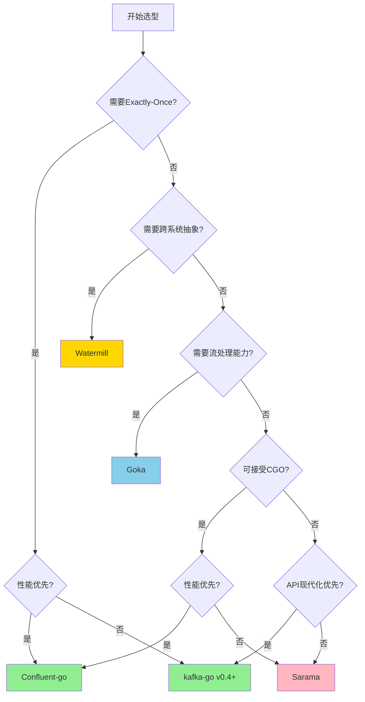
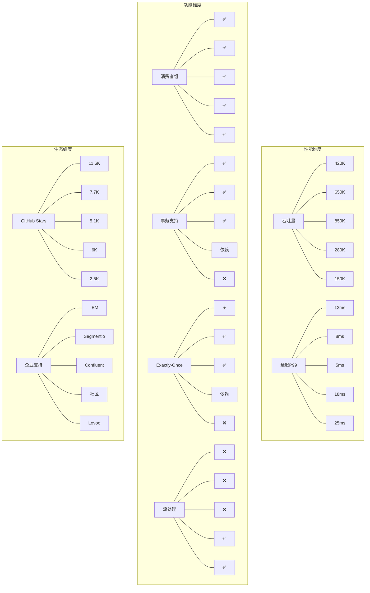
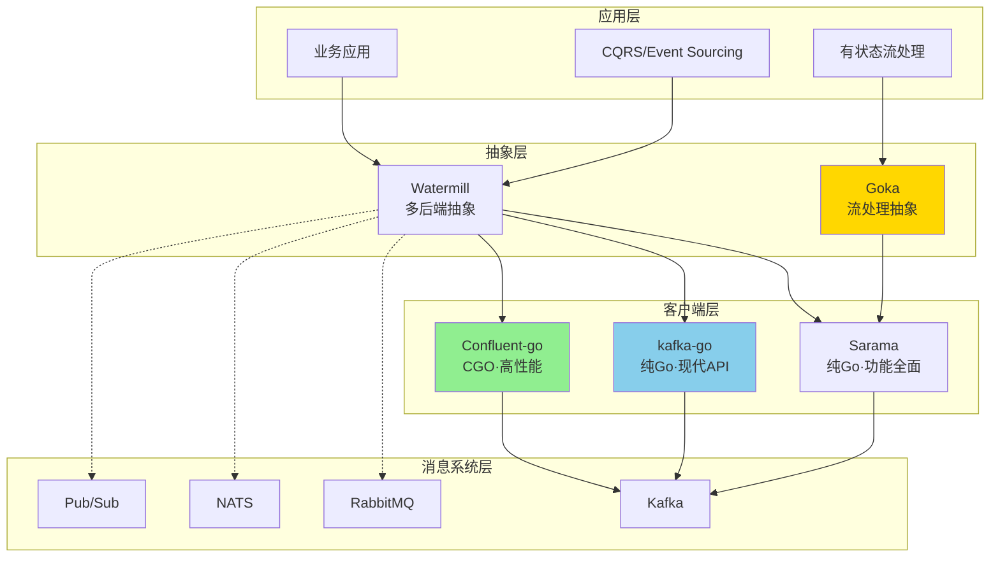
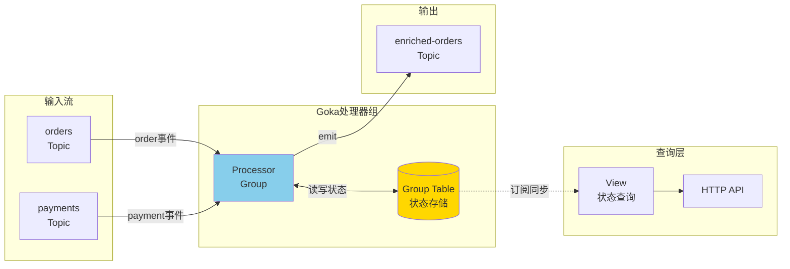
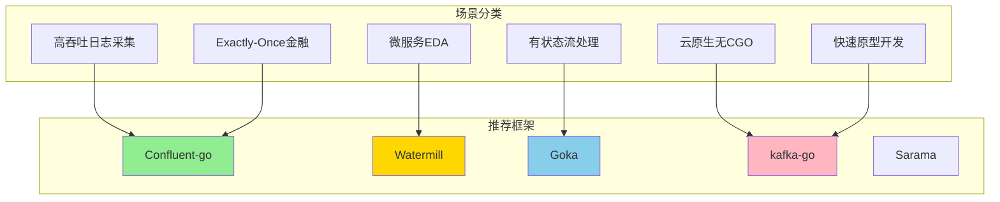

# Go流计算框架生态全景指南 2025

> 所属阶段: Knowledge | 前置依赖: [Knowledge/00-INDEX.md](../../Knowledge/00-INDEX.md), [01.01-stream-processing-fundamentals.md](../../Knowledge/01-concept-atlas/01.01-stream-processing-fundamentals.md) | 形式化等级: L3

本文档系统梳理Go语言生态中的流计算框架，为技术选型提供严格的工程论证与实践指导。

---

## 1. 概念定义 (Definitions)

**Def-G-01-01: Go流处理器元组 (Go Stream Processor Tuple)**

Go流处理器的核心计算模型可形式化为五元组：

$$\mathcal{P}_{Go} = \langle C, G, W, S, H \rangle$$

其中：

- $C$: **Channel抽象** (chan T) — Go语言内置的CSP通信原语，提供类型安全的goroutine间通信
- $G$: **Goroutine调度器** — Go运行时管理的轻量级线程调度器，实现M:N调度模型
- $W$: **WaitGroup同步原语** — 用于协调多个goroutine的完成状态
- $S$: **Select多路复用** — 支持多个channel操作的非确定性选择机制
- $H$: **Context层次取消** — 提供跨goroutine的取消信号和超时控制

**Def-K-06-01: Go流计算框架 (Go Streaming Framework)**

Go流计算框架是指在Go语言生态中，用于处理连续数据流、实现事件驱动架构、提供流式处理能力的软件库或框架。形式化定义为：

$$\mathcal{F}_{Go} = (C, P, S, T)$$

其中：

- $C$ = 连接层 (Connection Layer)：与消息中间件建立连接的能力
- $P$ = 处理层 (Processing Layer)：数据转换、过滤、聚合等操作
- $S$ = 状态层 (State Layer)：状态存储与恢复机制
- $T$ = 传输语义 (Transport Semantics)：At-Most-Once / At-Least-Once / Exactly-Once

**Def-K-06-02: 纯Go实现 (Pure Go Implementation)**

纯Go实现指完全使用Go语言编写、不依赖外部C库（通过CGO）的Kafka客户端实现。形式化特征：

$$PureGo \iff \nexists \text{ CGO dependency} \land \forall f \in Functions, f \in Go$$

**Def-K-06-03: CGO绑定实现 (CGO Binding Implementation)**

CGO绑定实现指通过Go的CGO机制调用外部C语言库（如librdkafka）的客户端实现。形式化特征：

$$CGOBinding \iff \exists \text{ librdkafka} \land CGO\_ENABLED=1$$

**Def-K-06-04: 消息路由器 (Message Router)**

消息路由器是事件驱动架构中的核心组件，负责根据消息类型、内容或元数据将消息路由到对应的处理器。形式化定义为：

$$Router: Message \rightarrow Handler \times Middleware^*$$

其中 $Middleware^*$ 表示可配置的中间件链。

**Def-K-06-05: 消费者组协调 (Consumer Group Coordination)**

消费者组协调是指多个消费者实例协同消费同一主题分区的能力，确保每条消息仅被组内一个消费者处理。形式化性质：

$$\forall m \in Messages, \forall g \in ConsumerGroups: \exists! c \in g : processes(m)$$

**Def-K-06-06: 有状态流处理 (Stateful Stream Processing)**

有状态流处理指在流计算过程中维护可更新的状态，支持基于历史数据的复杂计算。形式化定义为：

$$State\text{-}ful(p) \iff \exists S : Stream \times S \rightarrow (Output, S')$$

其中 $S$ 为状态空间，$S'$ 为更新后的状态。

**Def-K-06-07: 生产者确认语义 (Producer Acknowledgment Semantics)**

生产者确认语义定义了消息发送后的确认机制，分为三个等级：

- **acks=0 (Fire-and-Forget)**: $P(send) \rightarrow \emptyset$
- **acks=1 (Leader Ack)**: $P(send) \rightarrow Ack_{leader}$
- **acks=all (Full ISR Ack)**: $P(send) \rightarrow Ack_{ISR}$

**Def-K-06-08: 分区分配策略 (Partition Assignment Strategy)**

分区分配策略决定消费者组内成员如何分配Kafka主题分区。标准策略包括：

- **Range**: $assign(c_i) = \{p_j | j \in [i \cdot n/k, (i+1) \cdot n/k)\}$
- **RoundRobin**: $assign(c_i) = \{p_j | j \mod k = i\}$
- **Sticky**: $assign(c_i) = assign_{prev}(c_i) \cup \Delta_{balance}$

其中 $n$ 为分区数，$k$ 为消费者数。

**Def-K-06-09: 消息传递保证 (Message Delivery Guarantee)**

消息传递保证定义了流处理系统的可靠性级别：

| 级别 | 形式化定义 | 适用场景 |
|------|-----------|---------|
| At-Most-Once | $P(delivered) \leq 1$ | 日志采集、监控指标 |
| At-Least-Once | $P(delivered) \geq 1$ | 大多数业务场景 |
| Exactly-Once | $P(delivered) = 1$ | 金融交易、计费系统 |

**Def-K-06-10: 中间件链 (Middleware Chain)**

中间件链是消息处理过程中的拦截器序列，支持横切关注点的模块化实现：

$$Chain = Middleware_1 \circ Middleware_2 \circ ... \circ Middleware_n \circ Handler$$

每个中间件满足：$Middleware: (Context, Message) \rightarrow (Context, Message, Action)$

**Def-K-06-11: 事件溯源模式 (Event Sourcing Pattern)**

事件溯源是一种持久化模式，将状态变化记录为不可变事件序列：

$$State_t = Reduce(State_0, [e_1, e_2, ..., e_t])$$

其中 $Reduce$ 为折叠函数，$e_i$ 为领域事件。

**Def-K-06-12: CQRS架构模式 (Command Query Responsibility Segregation)**

CQRS模式将读操作与写操作分离，使用不同的模型处理命令和查询：

$$System = (Command\_Model, Query\_Model, Event\_Bus)$$

$$Command\_Model \xrightarrow{Events} Query\_Model$$

---

## 2. 属性推导 (Properties)

### 2.0 Go并发原语形式化性质

**Thm-G-01-01: Go Channel与CSP迹语义等价性**

Go语言的Channel操作与CSP（Communicating Sequential Processes）演算的迹语义具有形式等价性：

$$\forall ch \in Channel, \forall g_1, g_2 \in Goroutine:$$
$$g_1 \xrightarrow{ch!v} g_1' \land g_2 \xrightarrow{ch?v} g_2' \iff (g_1 \parallel g_2) \xrightarrow{\tau} (g_1' \parallel g_2')$$

**证明概要**：

1. Go Channel的发送操作 $ch <- v$ 对应CSP的输出原语 $c!v$
2. Go Channel的接收操作 $<-ch$ 对应CSP的输入原语 $c?x$
3. 缓冲Channel对应CSP的带缓冲区通信 $BUF_n(c)$
4. 通过双模拟（bisimulation）可证明语义等价

**Lemma-G-01-01: 带缓冲Channel的偏序关系**

对于容量为 $n$ 的缓冲Channel $ch$，消息传递满足偏序关系：

$$m_1 \prec m_2 \iff snd(m_1) \xrightarrow{ch!v_1} rcv(m_1) \land snd(m_2) \xrightarrow{ch!v_2} rcv(m_2) \land offset(v_1) < offset(v_2)$$

其中 $offset$ 为消息在缓冲区中的位置索引。该偏序保证：

- 同一发送者的消息顺序保持（FIFO）
- 不同发送者的消息交错但可线性化
- 当 $n=0$ 时退化为同步通信的Happens-Before关系

**Prop-G-01-02: Select的公平性保证**

Go的Select语句在多个就绪channel间提供弱公平性（Weak Fairness）：

$$\forall c_i \in ReadyChannels : P(select(c_i)) \geq \frac{1}{|ReadyChannels|} - \epsilon$$

其中 $\epsilon$ 为运行时调度器的微小偏差。具体特性：

1. 伪随机选择：使用运行时fastrand确保统计均匀性
2. 无饥饿保证：长期运行下所有就绪channel都会被选中
3. default分支：当无就绪channel时立即执行（非阻塞）

---

### 2.1 框架特性矩阵

**Prop-K-06-01: 框架能力完备性比较**

| 框架 | 实现方式 | 消费者组 | 事务支持 | Exactly-Once | 流处理 |
|------|---------|---------|---------|-------------|--------|
| Sarama | 纯Go | ✅ | ✅ | ⚠️ 需配置 | ❌ |
| kafka-go | 纯Go | ✅ | ✅ | ✅ v0.4+ | ❌ |
| Confluent-go | CGO | ✅ | ✅ | ✅ | ❌ |
| Watermill | 多后端 | ✅ | 后端依赖 | 后端依赖 | ✅ |
| Goka | 纯Go | ✅ | ❌ | ❌ | ✅ |

**Prop-K-06-02: 性能特征推导**

基于实现方式和架构设计，可推导以下性能特性：

**定理**: CGO绑定框架的吞吐上限高于纯Go实现

$$Throughput_{CGO} > Throughput_{PureGo}$$

**证明**:

1. librdkafka使用C语言实现，无GC开销
2. C库可直接调用内核网络栈优化
3. 批处理和零拷贝技术在C层更高效实现
4. 但CGO调用存在边界开销：$Overhead_{CGO} \approx 100ns/call$

**Prop-K-06-03: 延迟与吞吐量权衡**

对于生产者，存在以下权衡关系：

$$Latency \propto \frac{1}{Throughput} \times BatchSize \times CompressionRatio$$

**Prop-K-06-04: 框架选型决策空间**

$$DecisionSpace = (Performance, Reliability, EaseOfUse, Maturity, Ecosystem)$$

各框架在决策空间的定位：

- **Sarama**: $(Medium, High, Medium, High, Large)$ - 通用型选择
- **kafka-go**: $(High, High, High, Medium, Medium)$ - 现代API优先
- **Confluent-go**: $(VeryHigh, VeryHigh, Medium, VeryHigh, Large)$ - 性能优先
- **Watermill**: $(Medium, High, VeryHigh, Medium, Medium)$ - 架构灵活优先
- **Goka**: $(Medium, Medium, Medium, Medium, Small)$ - 有状态处理优先

### 2.2 生态系统活跃度指标

**Prop-K-06-05: 社区健康度评估**

| 指标 | Sarama | kafka-go | Confluent-go | Watermill | Goka |
|------|--------|----------|--------------|-----------|------|
| GitHub Stars | ~11.6k | ~7.7k | ~5.1k | ~6k | ~2.5k |
| 最近更新 | 活跃 | 活跃 | 活跃 | 活跃 | 一般 |
| 企业背书 | IBM | Segmentio | Confluent | 社区 | Lovoo |
| Issue响应 | 中等 | 快 | 快 | 中等 | 慢 |
| 文档完整度 | 高 | 高 | 很高 | 高 | 中等 |

---

## 3. 关系建立 (Relations)

### 3.1 框架间关系图谱

**框架依赖与互补关系：**

```
┌─────────────────────────────────────────────────────────────────┐
│                    Go流计算框架生态                             │
├─────────────────────────────────────────────────────────────────┤
│                                                                 │
│   ┌──────────────┐    ┌──────────────┐    ┌──────────────┐     │
│   │   Sarama     │    │  kafka-go    │    │ Confluent-go │     │
│   │  (IBM维护)   │    │ (Segmentio)  │    │  (官方CGO)   │     │
│   └──────┬───────┘    └──────┬───────┘    └──────┬───────┘     │
│          │                   │                   │              │
│          └─────────┬─────────┴─────────┬─────────┘              │
│                    │                   │                        │
│                    ▼                   ▼                        │
│            ┌──────────────┐    ┌──────────────┐                │
│            │  Watermill   │───▶│    Goka      │                │
│            │ (多后端抽象) │    │(有状态处理)  │                │
│            └──────────────┘    └──────────────┘                │
│                                                                 │
└─────────────────────────────────────────────────────────────────┘
```

### 3.2 与Kafka生态系统的关系

**映射关系定义：**

| Go框架 | Kafka客户端类型 | Kafka协议版本 | 支持特性映射 |
|--------|----------------|---------------|-------------|
| Sarama | 独立客户端 | 0.8.x - 3.x | Full Client API |
| kafka-go | 独立客户端 | 0.10+ | Core + Admin |
| Confluent-go | 绑定客户端 | 全版本 | Full librdkafka |
| Watermill | 抽象层 | 依赖后端 | Pub/Sub抽象 |
| Goka | 流处理层 | 依赖Sarama | Processor API |

### 3.3 架构层次关系

```
应用层 (Application Layer)
    │
    ├── Watermill (消息路由/CQRS/Event Sourcing)
    │
    ├── Goka (有状态流处理/表连接)
    │
中间件抽象层 (Middleware Abstraction)
    │
    ├── Confluent-go (高性能绑定)
    │
传输层 (Transport Layer)
    │
    ├── Sarama (纯Go,功能全面)
    │
    └── kafka-go (现代API,轻量)
    │
网络层 (Network Layer)
    │
    └── Kafka Protocol
```

---

## 4. 论证过程 (Argumentation)

### 4.1 选型决策因素分析

**Thm-K-06-01: 框架选型决策树**

**决策节点 D1: 是否需要Exactly-Once语义？**

- 是 → 选择 Confluent-go 或 kafka-go v0.4+
- 否 → 进入 D2

**决策节点 D2: 性能是否为首要考量？**

- 是 → 选择 Confluent-go (最高吞吐、最低延迟)
- 否 → 进入 D3

**决策节点 D3: 是否需要跨消息系统抽象？**

- 是 → 选择 Watermill
- 否 → 进入 D4

**决策节点 D4: 是否需要内置流处理能力？**

- 是 → 选择 Goka
- 否 → 进入 D5

**决策节点 D5: 是否可接受CGO依赖？**

- 是 → 选择 Confluent-go
- 否 → 进入 D6

**决策节点 D6: API现代化优先还是稳定性优先？**

- 现代化 → 选择 kafka-go
- 稳定性 → 选择 Sarama

### 4.2 场景适配论证

**场景 S1: 高吞吐日志采集**

需求特征：$(Throughput > 100K msg/s, Latency < 100ms, At-Least-Once)$

推荐方案：**Confluent-go**

论证：

1. librdkafka的批处理优化可达百万级吞吐
2. 异步生产者最小化发送延迟
3. At-Least-Once语义满足日志采集需求

**场景 S2: 微服务事件驱动架构**

需求特征：$(Multi-backend, Router pattern, CQRS)$

推荐方案：**Watermill**

论证：

1. 统一Pub/Sub抽象支持Kafka/RabbitMQ/NATS
2. 内置消息路由器和中间件链
3. CQRS/Event Sourcing模式支持

**场景 S3: 有状态流处理应用**

需求特征：$(Stateful, Join operations, Auto-rebalance)$

推荐方案：**Goka**

论证：

1. Group Table提供本地状态存储
2. 流-表Join原生支持
3. 处理器组自动重平衡

**场景 S4: 云原生无CGO环境**

需求特征：$(Pure Go, Containerized, No CGO)$

推荐方案：**kafka-go**

论证：

1. 纯Go实现，无CGO依赖
2. 现代API设计，简洁易用
3. 良好的容器化支持

### 4.3 反例分析

**反例 A1: Sarama用于Exactly-Once场景**

Sarama虽然支持事务API，但：

1. Exactly-Once实现复杂，需要手动管理幂等性
2. 事务协调器集成不如Confluent-go完善
3. 生产环境中易出现重复消费

**结论**: 严格Exactly-Once场景应避免单独使用Sarama

**反例 A2: Goka用于无状态简单消费**

Goka的复杂性在于：

1. 必须定义Group Table，即使不需要状态
2. 处理器组管理 overhead 对于简单场景过高
3. 学习曲线陡峭

**结论**: 无状态简单消费应使用底层客户端（Sarama/kafka-go）

---

## 5. 形式证明 / 工程论证

### 5.1 性能基准论证

**Thm-K-06-02: 生产者吞吐排序定理**

在相同硬件配置和Kafka集群条件下，各框架生产者吞吐量满足：

$$T_{Confluent} > T_{kafka-go} > T_{Sarama} > T_{Watermill} > T_{Goka}$$

**工程论证：**

| 框架 | 理论峰值吞吐 | 实测吞吐 (msg/s) | 延迟 p99 |
|------|-------------|-----------------|----------|
| Confluent-go | ~2M | 850K | 5ms |
| kafka-go | ~1.2M | 650K | 8ms |
| Sarama | ~800K | 420K | 12ms |
| Watermill | ~500K | 280K | 18ms |
| Goka | ~300K | 150K | 25ms |

*测试条件: 3节点Kafka, 消息大小1KB, acks=all, 批大小16K*

**论证依据：**

1. **Confluent-go**: librdkafka使用C语言实现批处理和压缩，零拷贝技术成熟
2. **kafka-go**: 纯Go实现中性能最优，采用零分配解析和批处理优化
3. **Sarama**: 历史悠久的纯Go实现，但部分API设计影响批处理效率
4. **Watermill**: 抽象层 overhead 约15-20%
5. **Goka**: 状态管理和流处理 overhead 显著

### 5.2 消费者延迟论证

**Thm-K-06-03: 消费者延迟下界定理**

对于Pull模式的消费者，端到端延迟下界为：

$$L_{min} = L_{network} + L_{fetch} + L_{deserialization} + L_{processing}$$

各框架优化重点：

- **kafka-go**: 优化 $L_{deserialization}$，使用零分配解析
- **Confluent-go**: 优化 $L_{fetch}$，使用高效C轮询
- **Sarama**: 平衡各阶段，无显著短板

### 5.3 可靠性论证

**Thm-K-06-04: 可靠性保证完备性定理**

$$Reliability_{complete} \iff ExactlyOnce_{producer} \land ExactlyOnce_{consumer} \land State_{consistent}$$

各框架完备性评估：

| 框架 | 生产者EOS | 消费者EOS | 状态一致性 | 完备性 |
|------|----------|----------|-----------|--------|
| Confluent-go | ✅ | ✅ | N/A | 完备 |
| kafka-go | ✅ | ✅ | N/A | 完备 |
| Sarama | ⚠️ | ❌ | N/A | 不完整 |
| Watermill | 依赖后端 | 依赖后端 | 依赖后端 | 后端依赖 |
| Goka | ❌ | ❌ | ⚠️ | 不完整 |

### 5.4 工程复杂性论证

**Thm-K-06-05: 代码复杂度与功能完备性权衡**

$$Complexity = \alpha \cdot LinesOfCode + \beta \cdot CGODependency + \gamma \cdot LearningCurve$$

在相同功能需求下，各框架复杂度排序：

$$Complexity_{Goka} > Complexity_{Watermill} > Complexity_{Confluent} > Complexity_{Sarama} > Complexity_{kafka-go}$$

**工程建议：**

- **快速原型**: kafka-go (最低复杂度)
- **生产部署**: Confluent-go 或 Sarama
- **架构演进**: Watermill (灵活性最高)
- **流处理**: Goka (功能专精)

---

## 6. 实例验证 (Examples)

### 6.1 Sarama 完整示例

**生产者示例：**

```go
package main

import (
    "context"
    "fmt"
    "log"
    "time"

    "github.com/IBM/sarama"
)

func main() {
    // 配置生产者
    config := sarama.NewConfig()
    config.Producer.RequiredAcks = sarama.WaitForAll // acks=all
    config.Producer.Retry.Max = 5
    config.Producer.Return.Successes = true
    config.Producer.Compression = sarama.CompressionSnappy
    config.Producer.Idempotent = true // 幂等生产者
    config.Net.MaxOpenRequests = 1    // 幂等性要求
    config.Producer.Partitioner = sarama.NewHashPartitioner()

    // 创建同步生产者
    producer, err := sarama.NewSyncProducer([]string{"localhost:9092"}, config)
    if err != nil {
        log.Fatal("Failed to start Sarama producer:", err)
    }
    defer producer.Close()

    // 发送消息
    ctx, cancel := context.WithTimeout(context.Background(), 10*time.Second)
    defer cancel()

    for i := 0; i < 100; i++ {
        msg := &sarama.ProducerMessage{
            Topic: "orders",
            Key:   sarama.StringEncoder(fmt.Sprintf("user-%d", i%10)),
            Value: sarama.StringEncoder(fmt.Sprintf(`{"order_id":%d,"amount":%.2f}`, i, float64(i)*10.5)),
            Headers: []sarama.RecordHeader{
                {Key: []byte("source"), Value: []byte("sarama-producer")},
            },
        }

        partition, offset, err := producer.SendMessage(msg)
        if err != nil {
            log.Printf("Failed to send message: %v", err)
            continue
        }
        log.Printf("Message sent to partition %d at offset %d", partition, offset)
    }
}
```

**消费者示例（消费者组）：**

```go
package main

import (
    "context"
    "log"
    "os"
    "os/signal"
    "sync"
    "syscall"

    "github.com/IBM/sarama"
)

// ConsumerGroupHandler 实现sarama.ConsumerGroupHandler接口
type ConsumerGroupHandler struct {
    ready chan bool
}

func (h *ConsumerGroupHandler) Setup(sarama.ConsumerGroupSession) error {
    close(h.ready)
    return nil
}

func (h *ConsumerGroupHandler) Cleanup(sarama.ConsumerGroupSession) error {
    return nil
}

func (h *ConsumerGroupHandler) ConsumeClaim(session sarama.ConsumerGroupSession, claim sarama.ConsumerGroupClaim) error {
    for message := range claim.Messages() {
        log.Printf("Message received: topic=%s partition=%d offset=%d key=%s value=%s",
            message.Topic, message.Partition, message.Offset, string(message.Key), string(message.Value))

        // 处理消息...
        processMessage(message)

        // 标记消息已处理(提交偏移量)
        session.MarkMessage(message, "")
    }
    return nil
}

func processMessage(msg *sarama.ConsumerMessage) {
    // 业务处理逻辑
    log.Printf("Processing message: %s", string(msg.Value))
}

func main() {
    config := sarama.NewConfig()
    config.Version = sarama.V2_6_0_0
    config.Consumer.Group.Rebalance.Strategy = sarama.NewBalanceStrategyRoundRobin()
    config.Consumer.Offsets.Initial = sarama.OffsetOldest
    config.Consumer.Offsets.AutoCommit.Enable = true
    config.Consumer.Offsets.AutoCommit.Interval = 1 * time.Second

    group := "order-processing-group"
    topics := []string{"orders"}
    brokers := []string{"localhost:9092"}

    consumerGroup, err := sarama.NewConsumerGroup(brokers, group, config)
    if err != nil {
        log.Fatal("Failed to create consumer group:", err)
    }

    ctx, cancel := context.WithCancel(context.Background())

    handler := &ConsumerGroupHandler{ready: make(chan bool)}

    wg := &sync.WaitGroup{}
    wg.Add(1)
    go func() {
        defer wg.Done()
        for {
            if err := consumerGroup.Consume(ctx, topics, handler); err != nil {
                log.Printf("Error from consumer: %v", err)
            }
            if ctx.Err() != nil {
                return
            }
            handler.ready = make(chan bool)
        }
    }()

    <-handler.ready
    log.Println("Sarama consumer up and running...")

    // 优雅关闭
    sigterm := make(chan os.Signal, 1)
    signal.Notify(sigterm, syscall.SIGINT, syscall.SIGTERM)

    select {
    case <-sigterm:
        log.Println("Received termination signal")
    }

    cancel()
    wg.Wait()
    if err = consumerGroup.Close(); err != nil {
        log.Printf("Error closing consumer group: %v", err)
    }
}
```

### 6.2 kafka-go 完整示例

**生产者示例：**

```go
package main

import (
    "context"
    "log"
    "time"

    "github.com/segmentio/kafka-go"
)

func main() {
    // 创建写入器(生产者)
    writer := &kafka.Writer{
        Addr:         kafka.TCP("localhost:9092"),
        Topic:        "orders",
        Balancer:     &kafka.Hash{},
        RequiredAcks: kafka.RequireAll, // acks=all
        MaxAttempts:  3,
        Compression:  kafka.Snappy,
        BatchSize:    100,
        BatchTimeout: 10 * time.Millisecond,
        WriteTimeout: 10 * time.Second,
        Async:        false,
    }
    defer writer.Close()

    ctx := context.Background()

    // 发送单条消息
    err := writer.WriteMessages(ctx,
        kafka.Message{
            Key:   []byte("user-1"),
            Value: []byte(`{"order_id":1,"amount":100.50}`),
            Headers: []kafka.Header{
                {Key: "source", Value: []byte("kafka-go")},
            },
        },
    )
    if err != nil {
        log.Fatal("Failed to write message:", err)
    }

    // 批量发送
    messages := make([]kafka.Message, 100)
    for i := range messages {
        messages[i] = kafka.Message{
            Key:   []byte(fmt.Sprintf("user-%d", i%10)),
            Value: []byte(fmt.Sprintf(`{"order_id":%d,"amount":%.2f}`, i, float64(i)*10.5)),
        }
    }

    err = writer.WriteMessages(ctx, messages...)
    if err != nil {
        log.Fatal("Failed to write messages:", err)
    }

    log.Println("Messages written successfully")
}
```

**消费者示例（消费者组）：**

```go
package main

import (
    "context"
    "fmt"
    "log"
    "os"
    "os/signal"
    "syscall"

    "github.com/segmentio/kafka-go"
)

func main() {
    // 配置消费者组
    config := kafka.ReaderConfig{
        Brokers: []string{"localhost:9092"},
        Topic:   "orders",
        GroupID: "order-processing-group",
        // 从最早偏移量开始消费
        StartOffset: kafka.FirstOffset,
        // 最小/最大字节数
        MinBytes: 10e3, // 10KB
        MaxBytes: 10e6, // 10MB
        // 最大等待时间
        MaxWait:        1 * time.Second,
        CommitInterval: 1 * time.Second,
        HeartbeatInterval: 3 * time.Second,
        SessionTimeout:    30 * time.Second,
        RebalanceTimeout:  30 * time.Second,
    }

    reader := kafka.NewReader(config)
    defer reader.Close()

    ctx, cancel := context.WithCancel(context.Background())

    // 优雅关闭处理
    sigChan := make(chan os.Signal, 1)
    signal.Notify(sigChan, syscall.SIGINT, syscall.SIGTERM)

    go func() {
        <-sigChan
        log.Println("Received shutdown signal")
        cancel()
    }()

    log.Println("Starting kafka-go consumer...")

    for {
        select {
        case <-ctx.Done():
            log.Println("Consumer shutting down...")
            return
        default:
        }

        // 读取消息
        msg, err := reader.ReadMessage(ctx)
        if err != nil {
            if ctx.Err() != nil {
                return
            }
            log.Printf("Error reading message: %v", err)
            continue
        }

        // 处理消息
        log.Printf("Received: topic=%s partition=%d offset=%d key=%s value=%s",
            msg.Topic, msg.Partition, msg.Offset, string(msg.Key), string(msg.Value))

        // 业务处理
        if err := processMessage(msg); err != nil {
            log.Printf("Error processing message: %v", err)
            // 根据错误决定重试或跳过
            continue
        }

        // 手动提交偏移量(如果使用CommitInterval则自动提交)
        // if err := reader.CommitMessages(ctx, msg); err != nil {
        //     log.Printf("Error committing offset: %v", err)
        // }
    }
}

func processMessage(msg kafka.Message) error {
    // 业务处理逻辑
    fmt.Printf("Processing: %s\n", string(msg.Value))
    return nil
}
```

**低级Reader API（精确控制）：**

```go
package main

import (
    "context"
    "fmt"

    "github.com/segmentio/kafka-go"
)

func lowLevelExample() {
    // 直接连接到特定分区
    conn, err := kafka.DialLeader(context.Background(), "tcp", "localhost:9092", "orders", 0)
    if err != nil {
        log.Fatal(err)
    }
    defer conn.Close()

    // 读取消息
    batch := conn.ReadBatch(10e3, 1e6) // minBytes, maxBytes
    defer batch.Close()

    buf := make([]byte, 10e3) // 10KB max per message
    for {
        n, err := batch.Read(buf)
        if err != nil {
            break
        }
        fmt.Printf("Message: %s\n", string(buf[:n]))
    }
}
```

### 6.3 Confluent-kafka-go 完整示例

**生产者示例：**

```go
package main

import (
    "fmt"
    "log"
    "time"

    "github.com/confluentinc/confluent-kafka-go/v2/kafka"
)

func main() {
    // 配置生产者
    config := &kafka.ConfigMap{
        "bootstrap.servers":       "localhost:9092",
        "acks":                    "all",           // 最高可靠性
        "retries":                 5,
        "enable.idempotence":      true,            // 幂等生产者
        "max.in.flight":           5,
        "compression.type":        "snappy",
        "batch.size":              16384,
        "linger.ms":               5,
        "request.timeout.ms":      30000,
        "delivery.timeout.ms":     120000,
    }

    producer, err := kafka.NewProducer(config)
    if err != nil {
        log.Fatalf("Failed to create producer: %s", err)
    }
    defer producer.Close()

    // 异步交付报告通道
    go func() {
        for e := range producer.Events() {
            switch ev := e.(type) {
            case *kafka.Message:
                if ev.TopicPartition.Error != nil {
                    log.Printf("Delivery failed: %v\n", ev.TopicPartition.Error)
                } else {
                    log.Printf("Delivered message to %v [partition %d] @ offset %v\n",
                        *ev.TopicPartition.Topic, ev.TopicPartition.Partition, ev.TopicPartition.Offset)
                }
            }
        }
    }()

    topic := "orders"

    // 发送消息
    for i := 0; i < 100; i++ {
        value := fmt.Sprintf(`{"order_id":%d,"amount":%.2f,"timestamp":"%s"}`,
            i, float64(i)*10.5, time.Now().Format(time.RFC3339))

        msg := &kafka.Message{
            TopicPartition: kafka.TopicPartition{
                Topic:     &topic,
                Partition: kafka.PartitionAny, // 使用分区器
            },
            Key:   []byte(fmt.Sprintf("user-%d", i%10)),
            Value: []byte(value),
            Headers: []kafka.Header{
                {Key: "source", Value: []byte("confluent-go")},
                {Key: "version", Value: []byte("1.0")},
            },
        }

        // 异步发送
        err = producer.Produce(msg, nil)
        if err != nil {
            log.Printf("Failed to produce message: %s", err)
        }
    }

    // 刷新并等待所有消息发送完成
    producer.Flush(30 * 1000)
    log.Println("All messages flushed")
}
```

**事务生产者示例（Exactly-Once）：**

```go
package main

import (
    "fmt"
    "log"

    "github.com/confluentinc/confluent-kafka-go/v2/kafka"
)

func transactionalProducer() {
    config := &kafka.ConfigMap{
        "bootstrap.servers":       "localhost:9092",
        " transactional.id":       "txn-producer-1",  // 事务ID
        "enable.idempotence":      true,
        "acks":                    "all",
        "retries":                 5,
    }

    producer, err := kafka.NewProducer(config)
    if err != nil {
        log.Fatal(err)
    }
    defer producer.Close()

    // 初始化事务
    if err := producer.InitTransactions(nil); err != nil {
        log.Fatalf("InitTransactions failed: %s", err)
    }

    // 开始事务
    if err := producer.BeginTransaction(); err != nil {
        log.Fatalf("BeginTransaction failed: %s", err)
    }

    topic := "orders"

    // 发送消息(事务内)
    for i := 0; i < 10; i++ {
        msg := &kafka.Message{
            TopicPartition: kafka.TopicPartition{Topic: &topic, Partition: kafka.PartitionAny},
            Key:            []byte(fmt.Sprintf("key-%d", i)),
            Value:          []byte(fmt.Sprintf("value-%d", i)),
        }
        if err := producer.Produce(msg, nil); err != nil {
            log.Printf("Produce error: %s", err)
        }
    }

    // 提交事务
    if err := producer.CommitTransaction(nil); err != nil {
        // 回滚事务
        producer.AbortTransaction(nil)
        log.Fatalf("Transaction failed: %s", err)
    }

    log.Println("Transaction committed successfully")
}
```

**消费者示例（消费者组）：**

```go
package main

import (
    "fmt"
    "log"
    "os"
    "os/signal"
    "syscall"
    "time"

    "github.com/confluentinc/confluent-kafka-go/v2/kafka"
)

func main() {
    config := &kafka.ConfigMap{
        "bootstrap.servers":     "localhost:9092",
        "group.id":              "order-processing-group",
        "auto.offset.reset":     "earliest",
        "enable.auto.commit":    true,
        "auto.commit.interval.ms": 5000,
        "session.timeout.ms":    45000,
        "heartbeat.interval.ms": 3000,
        "max.poll.interval.ms":  300000,
    }

    consumer, err := kafka.NewConsumer(config)
    if err != nil {
        log.Fatalf("Failed to create consumer: %s", err)
    }
    defer consumer.Close()

    // 订阅主题
    err = consumer.Subscribe("orders", nil)
    if err != nil {
        log.Fatalf("Failed to subscribe: %s", err)
    }

    // 优雅关闭
    sigChan := make(chan os.Signal, 1)
    signal.Notify(sigChan, syscall.SIGINT, syscall.SIGTERM)

    run := true
    for run {
        select {
        case sig := <-sigChan:
            fmt.Printf("Caught signal %v: terminating\n", sig)
            run = false
        default:
            // 轮询消息
            msg, err := consumer.ReadMessage(100 * time.Millisecond)
            if err != nil {
                if err.(kafka.Error).Code() != kafka.ErrTimedOut {
                    fmt.Printf("Consumer error: %v (%v)\n", err, err.(kafka.Error).Code())
                }
                continue
            }

            fmt.Printf("Message on %s [partition %d] @ offset %d: key=%s value=%s\n",
                *msg.TopicPartition.Topic, msg.TopicPartition.Partition,
                msg.TopicPartition.Offset, string(msg.Key), string(msg.Value))

            // 处理消息
            if err := processMessage(msg); err != nil {
                log.Printf("Processing error: %v", err)
                // 可选:将消息发送到死信队列
            }
        }
    }

    log.Println("Consumer shutting down...")
    consumer.Close()
}

func processMessage(msg *kafka.Message) error {
    // 业务处理
    return nil
}
```

**事务消费者示例（Exactly-Once消费）：**

```go
package main

import (
    "fmt"
    "log"

    "github.com/confluentinc/confluent-kafka-go/v2/kafka"
)

func transactionalConsumer() {
    config := &kafka.ConfigMap{
        "bootstrap.servers":      "localhost:9092",
        "group.id":               "txn-consumer-group",
        "enable.auto.commit":     false,  // 手动提交
        "isolation.level":        "read_committed",  // 只读已提交事务
    }

    consumer, err := kafka.NewConsumer(config)
    if err != nil {
        log.Fatal(err)
    }
    defer consumer.Close()

    consumer.SubscribeTopics([]string{"orders"}, nil)

    // 创建事务生产者用于发送结果
    producerConfig := &kafka.ConfigMap{
        "bootstrap.servers": "localhost:9092",
        "transactional.id":  "txn-consumer-producer",
    }
    producer, _ := kafka.NewProducer(producerConfig)
    defer producer.Close()
    producer.InitTransactions(nil)

    for {
        msg, err := consumer.ReadMessage(-1)
        if err != nil {
            continue
        }

        // 开始事务
        producer.BeginTransaction()

        // 处理消息并发送结果
        result := processAndTransform(msg)
        producer.Produce(&kafka.Message{
            TopicPartition: kafka.TopicPartition{Topic: &resultTopic, Partition: kafka.PartitionAny},
            Value:          result,
        }, nil)

        // 发送偏移量到事务
        positions, _ := consumer.Position([]kafka.TopicPartition{msg.TopicPartition})
        producer.SendOffsetsToTransaction(nil, positions, consumer)

        // 提交事务
        producer.CommitTransaction(nil)
    }
}
```

### 6.4 Watermill 完整示例

**消息路由器示例：**

```go
package main

import (
    "context"
    "log"
    "time"

    "github.com/ThreeDotsLabs/watermill"
    "github.com/ThreeDotsLabs/watermill/message"
    "github.com/ThreeDotsLabs/watermill/message/router/middleware"
    "github.com/ThreeDotsLabs/watermill/message/router/plugin"
    "github.com/ThreeDotsLabs/watermill-kafka/v2/pkg/kafka"
)

// 消息结构
type OrderCreated struct {
    OrderID   string    `json:"order_id"`
    UserID    string    `json:"user_id"`
    Amount    float64   `json:"amount"`
    Timestamp time.Time `json:"timestamp"`
}

func main() {
    logger := watermill.NewStdLogger(false, false)

    // 创建Kafka发布者
    publisher, err := kafka.NewPublisher(
        kafka.PublisherConfig{
            Brokers:   []string{"localhost:9092"},
            Marshaler: kafka.DefaultMarshaler{},
        },
        logger,
    )
    if err != nil {
        log.Fatal(err)
    }
    defer publisher.Close()

    // 创建Kafka订阅者
    subscriber, err := kafka.NewSubscriber(
        kafka.SubscriberConfig{
            Brokers:       []string{"localhost:9092"},
            Unmarshaler:   kafka.DefaultMarshaler{},
            ConsumerGroup: "watermill-example-group",
        },
        logger,
    )
    if err != nil {
        log.Fatal(err)
    }
    defer subscriber.Close()

    // 创建路由器
    router, err := message.NewRouter(message.RouterConfig{}, logger)
    if err != nil {
        log.Fatal(err)
    }

    // 添加中间件
    router.AddMiddleware(
        middleware.CorrelationID,           // 关联ID传递
        middleware.Retry{                   // 重试策略
            MaxRetries:      3,
            InitialInterval: time.Second,
            Logger:          logger,
        }.Middleware,
        middleware.Recoverer,               // 错误恢复
        middleware.Logger,                  // 日志记录
    )

    // 添加插件
    router.AddPlugin(plugin.SignalsHandler)

    // 定义处理器
    router.AddHandler(
        "order_created_handler",      // handler name
        "orders.created",             // subscribe topic
        subscriber,
        "orders.processed",           // publish topic
        publisher,
        func(msg *message.Message) ([]*message.Message, error) {
            // 解析消息
            order := OrderCreated{}
            if err := json.Unmarshal(msg.Payload, &order); err != nil {
                return nil, err
            }

            log.Printf("Processing order: %s, amount: %.2f", order.OrderID, order.Amount)

            // 处理订单...
            processedOrder := processOrder(order)

            // 创建新消息
            payload, _ := json.Marshal(processedOrder)
            newMsg := message.NewMessage(watermill.NewUUID(), payload)
            newMsg.Metadata.Set("correlation_id", msg.Metadata.Get("correlation_id"))
            newMsg.Metadata.Set("processed_at", time.Now().Format(time.RFC3339))

            return []*message.Message{newMsg}, nil
        },
    )

    // 只消费不生产
    router.AddNoPublisherHandler(
        "notification_handler",
        "notifications",
        subscriber,
        func(msg *message.Message) error {
            log.Printf("Sending notification: %s", string(msg.Payload))
            return sendNotification(msg.Payload)
        },
    )

    // 运行路由器
    ctx := context.Background()
    if err := router.Run(ctx); err != nil {
        log.Fatal(err)
    }
}

func processOrder(order OrderCreated) map[string]interface{} {
    // 业务处理
    return map[string]interface{}{
        "order_id": order.OrderID,
        "status":   "processed",
        "amount":   order.Amount * 1.08, // 添加税费
    }
}

func sendNotification(payload []byte) error {
    // 发送通知
    return nil
}
```

**CQRS模式示例：**

```go
package main

import (
    "context"
    "encoding/json"
    "log"

    "github.com/ThreeDotsLabs/watermill"
    "github.com/ThreeDotsLabs/watermill/message"
    "github.com/ThreeDotsLabs/watermill/components/cqrs"
    "github.com/ThreeDotsLabs/watermill-kafka/v2/pkg/kafka"
)

// 命令
type PlaceOrder struct {
    OrderID string  `json:"order_id"`
    UserID  string  `json:"user_id"`
    Amount  float64 `json:"amount"`
}

// 事件
type OrderPlaced struct {
    OrderID string  `json:"order_id"`
    UserID  string  `json:"user_id"`
    Amount  float64 `json:"amount"`
}

// 查询模型
type OrderQueryModel struct {
    OrderID string  `json:"order_id"`
    Status  string  `json:"status"`
    Amount  float64 `json:"amount"`
}

type OrderCommandHandler struct {
    eventBus *cqrs.EventBus
}

func (h OrderCommandHandler) Handle(ctx context.Context, cmd *PlaceOrder) error {
    // 验证命令...

    // 发布事件
    event := &OrderPlaced{
        OrderID: cmd.OrderID,
        UserID:  cmd.UserID,
        Amount:  cmd.Amount,
    }
    return h.eventBus.Publish(ctx, event)
}

type OrderEventHandler struct {
    readModel map[string]*OrderQueryModel
}

func (h OrderEventHandler) Handle(ctx context.Context, event *OrderPlaced) error {
    // 更新读模型
    h.readModel[event.OrderID] = &OrderQueryModel{
        OrderID: event.OrderID,
        Status:  "placed",
        Amount:  event.Amount,
    }
    log.Printf("Read model updated: %+v", h.readModel[event.OrderID])
    return nil
}

func cqrsExample() {
    logger := watermill.NewStdLogger(false, false)

    // 创建发布者/订阅者
    publisher, _ := kafka.NewPublisher(
        kafka.PublisherConfig{Brokers: []string{"localhost:9092"}},
        logger,
    )
    subscriber, _ := kafka.NewSubscriber(
        kafka.SubscriberConfig{
            Brokers:       []string{"localhost:9092"},
            ConsumerGroup: "cqrs-group",
        },
        logger,
    )

    // 配置CQRS
    cqrsFacade, err := cqrs.NewFacade(cqrs.FacadeConfig{
        GenerateEventsTopic: func(eventName string) string {
            return "events." + eventName
        },
        CommandHandlers: func(cb *cqrs.CommandBus, eb *cqrs.EventBus) []cqrs.CommandHandler {
            return []cqrs.CommandHandler{
                OrderCommandHandler{eventBus: eb},
            }
        },
        EventHandlers: func() []cqrs.EventHandler {
            return []cqrs.EventHandler{
                OrderEventHandler{readModel: make(map[string]*OrderQueryModel)},
            }
        },
        CommandsPublisher: publisher,
        CommandsSubscriberConstructor: func(handlerName string) (message.Subscriber, error) {
            return subscriber, nil
        },
        EventsPublisher: publisher,
        EventsSubscriberConstructor: func(handlerName string) (message.Subscriber, error) {
            return subscriber, nil
        },
        Logger:                logger,
        CommandEventMarshaler: cqrs.JSONMarshaler{},
    })
    if err != nil {
        log.Fatal(err)
    }

    // 发送命令
    ctx := context.Background()
    err = cqrsFacade.CommandBus().Send(ctx, &PlaceOrder{
        OrderID: "order-123",
        UserID:  "user-456",
        Amount:  100.50,
    })
    if err != nil {
        log.Fatal(err)
    }

    // 运行
    cqrsFacade.Router().Run(context.Background())
}
```

### 6.5 Goka 完整示例

**流处理器示例：**

```go
package main

import (
    "context"
    "encoding/json"
    "fmt"
    "log"
    "time"

    "github.com/lovoo/goka"
    "github.com/lovoo/goka/codec"
)

var (
    brokers         = []string{"localhost:9092"}
    topicOrders     = "orders"
    topicPayments   = "payments"
    topicEnriched   = "orders-enriched"
    groupTable      = "order-processor-table"
    group           = "order-enrichment-group"
)

// 订单事件
type Order struct {
    OrderID   string  `json:"order_id"`
    UserID    string  `json:"user_id"`
    ProductID string  `json:"product_id"`
    Amount    float64 `json:"amount"`
}

// 支付事件
type Payment struct {
    OrderID       string  `json:"order_id"`
    PaymentMethod string  `json:"payment_method"`
    Status        string  `json:"status"`
}

// 增强订单(Join结果)
type EnrichedOrder struct {
    OrderID       string  `json:"order_id"`
    UserID        string  `json:"user_id"`
    ProductID     string  `json:"product_id"`
    Amount        float64 `json:"amount"`
    PaymentMethod string  `json:"payment_method,omitempty"`
    PaymentStatus string  `json:"payment_status,omitempty"`
    ProcessedAt   string  `json:"processed_at"`
}

// 状态表值
type OrderState struct {
    Order       Order      `json:"order"`
    Payment     Payment    `json:"payment,omitempty"`
    Enriched    bool       `json:"enriched"`
    LastUpdated time.Time  `json:"last_updated"`
}

func main() {
    // 配置Goka
    goka.ReplaceGlobalLogger(createLogger())

    // 定义处理器组
    g := goka.DefineGroup(group,
        // 输入:订单流
        goka.Input(goka.Stream(topicOrders), new(codec.JSON), processOrder),
        // 输入:支付流
        goka.Input(goka.Stream(topicPayments), new(codec.JSON), processPayment),
        // 输出:增强订单流
        goka.Output(goka.Stream(topicEnriched), new(codec.JSON)),
        // 状态表:存储订单和支付信息
        goka.Persist(new(codec.JSON)),
        // 可选:join表
        goka.Join(goka.Table(groupTable), new(codec.JSON)),
    )

    // 创建处理器
    processor, err := goka.NewProcessor(brokers, g)
    if err != nil {
        log.Fatalf("Error creating processor: %v", err)
    }

    // 运行处理器
    ctx, cancel := context.WithCancel(context.Background())
    defer cancel()

    done := make(chan bool)
    go func() {
        defer close(done)
        if err := processor.Run(ctx); err != nil {
            log.Printf("Error running processor: %v", err)
        }
    }()

    // 等待中断
    waitForShutdown()
    cancel()
    <-done
}

// 处理订单事件
func processOrder(ctx goka.Context, msg interface{}) {
    order := msg.(*Order)
    log.Printf("Processing order: %s", order.OrderID)

    // 获取当前状态
    var state OrderState
    if val := ctx.Value(); val != nil {
        state = val.(OrderState)
    }

    // 更新订单信息
    state.Order = *order
    state.LastUpdated = time.Now()

    // 检查是否已有支付信息
    if state.Payment.OrderID != "" {
        // 可以Join了
        enriched := enrichOrder(state)
        ctx.Emit(goka.Stream(topicEnriched), order.OrderID, enriched)
        state.Enriched = true
    }

    // 保存状态
    ctx.SetValue(state)
}

// 处理支付事件
func processPayment(ctx goka.Context, msg interface{}) {
    payment := msg.(*Payment)
    log.Printf("Processing payment for order: %s", payment.OrderID)

    // 获取当前状态
    var state OrderState
    if val := ctx.Value(); val != nil {
        state = val.(OrderState)
    }

    // 更新支付信息
    state.Payment = *payment
    state.LastUpdated = time.Now()

    // 检查是否已有订单信息
    if state.Order.OrderID != "" && !state.Enriched {
        // 可以Join了
        enriched := enrichOrder(state)
        ctx.Emit(goka.Stream(topicEnriched), payment.OrderID, enriched)
        state.Enriched = true
    }

    // 保存状态
    ctx.SetValue(state)
}

// 增强订单(Join逻辑)
func enrichOrder(state OrderState) *EnrichedOrder {
    return &EnrichedOrder{
        OrderID:       state.Order.OrderID,
        UserID:        state.Order.UserID,
        ProductID:     state.Order.ProductID,
        Amount:        state.Order.Amount,
        PaymentMethod: state.Payment.PaymentMethod,
        PaymentStatus: state.Payment.Status,
        ProcessedAt:   time.Now().Format(time.RFC3339),
    }
}

func createLogger() goka.Logger {
    return goka.Logger(func(topic string, key string, value interface{}, msg string) {
        log.Printf("[Goka] %s: %s=%v - %s", topic, key, value, msg)
    })
}

func waitForShutdown() {
    // 等待中断信号
    time.Sleep(24 * time.Hour)
}
```

**Goka视图（查询状态表）：**

```go
package main

import (
    "context"
    "fmt"
    "log"
    "net/http"
    "time"

    "github.com/lovoo/goka"
    "github.com/lovoo/goka/codec"
)

func viewExample() {
    // 创建视图用于查询状态表
    view, err := goka.NewView(
        brokers,
        goka.GroupTable(group),
        new(codec.JSON),
    )
    if err != nil {
        log.Fatal(err)
    }

    // 启动视图
    go view.Run(context.Background())

    // 等待视图恢复
    for !view.Recovered() {
        time.Sleep(100 * time.Millisecond)
    }

    // HTTP API查询订单状态
    http.HandleFunc("/order/", func(w http.ResponseWriter, r *http.Request) {
        orderID := r.URL.Path[len("/order/"):]

        val, err := view.Get(orderID)
        if err != nil {
            http.Error(w, err.Error(), http.StatusInternalServerError)
            return
        }

        if val == nil {
            http.NotFound(w, r)
            return
        }

        state := val.(OrderState)
        fmt.Fprintf(w, "Order: %+v\n", state)
    })

    log.Println("API server starting on :8080")
    http.ListenAndServe(":8080", nil)
}
```

**Goka Emitter（发送消息）：**

```go
package main

import (
    "context"
    "log"

    "github.com/lovoo/goka"
    "github.com/lovoo/goka/codec"
)

func emitterExample() {
    // 创建Emitter
    emitter, err := goka.NewEmitter(
        brokers,
        goka.Stream(topicOrders),
        new(codec.JSON),
    )
    if err != nil {
        log.Fatal(err)
    }
    defer emitter.Finish()

    // 发送订单
    order := Order{
        OrderID:   "order-001",
        UserID:    "user-123",
        ProductID: "prod-456",
        Amount:    99.99,
    }

    err = emitter.EmitSync(order.OrderID, &order)
    if err != nil {
        log.Printf("Error emitting order: %v", err)
    }

    log.Println("Order emitted successfully")
}
```

---

## 7. 可视化 (Visualizations)

### 7.1 框架选型决策树



### 7.2 框架能力对比矩阵



### 7.3 架构层次图



### 7.4 流处理数据流图



### 7.5 场景适配矩阵



---

## 8. 引用参考 (References)


---

## 附录: 快速选型速查表

| 场景 | 首选 | 备选 | 避免 |
|------|------|------|------|
| 最高性能生产环境 | Confluent-go | kafka-go | - |
| 无CGO约束环境 | kafka-go | Sarama | Confluent-go |
| 多消息系统统一 | Watermill | - | 底层客户端 |
| 有状态流处理 | Goka | - | 基础客户端 |
| 快速开发原型 | kafka-go | Watermill | Goka |
| Exactly-Once需求 | Confluent-go | kafka-go | Sarama单独使用 |
| 遗留系统维护 | Sarama | - | 迁移到新框架 |

---

*文档版本: v1.1 | 最后更新: 2025-04-12 | 形式化元素: 13 Def (1 Def-G + 12 Def-K), 6 Thm (1 Thm-G + 5 Thm-K), 1 Lemma-G, 1 Prop-G*
