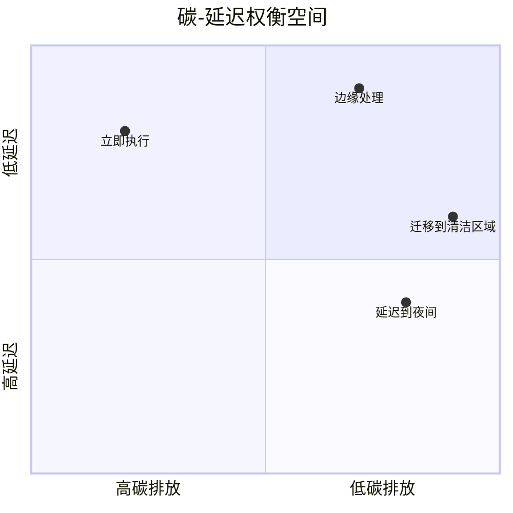
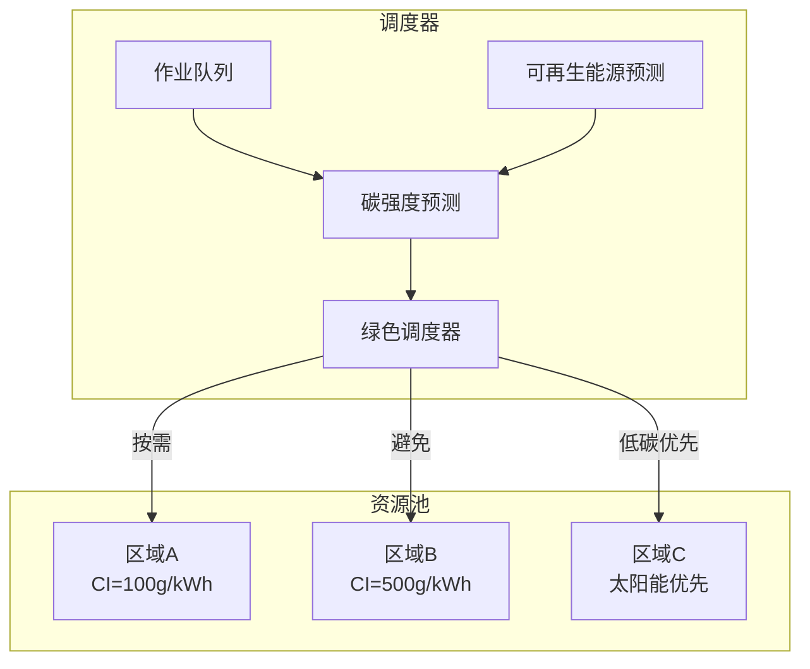

# Green AI Streaming: 低碳流计算架构

> **所属阶段**: Knowledge/06-frontier/green-ai-streaming | **前置依赖**: [realtime-ai-streaming-2026.md](../realtime-ai-streaming-2026.md) | **形式化等级**: L3-L4
> **文档状态**: v1.0 | **创建日期**: 2026-04-13

---

## 目录

- [Green AI Streaming: 低碳流计算架构](#green-ai-streaming-低碳流计算架构)
  - [目录](#目录)
  - [1. 概念定义 (Definitions)](#1-概念定义-definitions)
    - [Def-K-06-GREEN-01: 碳感知流处理](#def-k-06-green-01-碳感知流处理)
    - [Def-K-06-GREEN-02: 能效模型](#def-k-06-green-02-能效模型)
    - [Def-K-06-GREEN-03: 绿色AI推理](#def-k-06-green-03-绿色ai推理)
  - [2. 碳足迹量化模型](#2-碳足迹量化模型)
    - [2.1 流处理系统碳排放公式](#21-流处理系统碳排放公式)
    - [2.2 AI模型碳成本](#22-ai模型碳成本)
  - [3. 绿色架构模式](#3-绿色架构模式)
    - [模式1: 碳感知调度](#模式1-碳感知调度)
    - [模式2: 动态精度调整](#模式2-动态精度调整)
    - [模式3: 边缘-云协同](#模式3-边缘-云协同)
    - [模式4: 可再生能源感知](#模式4-可再生能源感知)
  - [4. 能效优化技术](#4-能效优化技术)
    - [4.1 硬件级优化](#41-硬件级优化)
    - [4.2 算法级优化](#42-算法级优化)
    - [4.3 系统级优化](#43-系统级优化)
  - [5. 行业实践与案例](#5-行业实践与案例)
    - [案例1: 数据中心碳中和](#案例1-数据中心碳中和)
    - [案例2: 边缘AI能效优化](#案例2-边缘ai能效优化)
  - [6. 评估与指标](#6-评估与指标)
    - [6.1 Green KPIs](#61-green-kpis)
    - [6.2 对比基准](#62-对比基准)
  - [7. 可视化 (Visualizations)](#7-可视化-visualizations)
    - [碳感知调度架构](#碳感知调度架构)
    - [绿色流处理生命周期](#绿色流处理生命周期)
  - [8. 引用参考 (References)](#8-引用参考-references)

---

## 1. 概念定义 (Definitions)

### Def-K-06-GREEN-01: 碳感知流处理

**定义 (Carbon-Aware Stream Processing)**:

碳感知流处理是将碳排放作为一等调度约束的流计算范式：

$$
\mathcal{G}_{streaming} ::= (\mathcal{J}, \mathcal{R}, C_{carbon}, \Omega_{energy}, \mathcal{P}_{green})
$$

| 组件 | 语义 |
|------|------|
| $\mathcal{J}$ | 流处理作业集合 |
| $\mathcal{R}$ | 资源池（带碳强度属性） |
| $C_{carbon}$ | 碳排放成本函数 |
| $\Omega_{energy}$ | 能源结构（可再生/化石） |
| $\mathcal{P}_{green}$ | 绿色调度策略 |

**碳强度指标**:

$$
CI_{location}(t) = \frac{CO_2e \text{ emitted}}{kWh \text{ consumed}} \text{ at location, time } t
$$

**全球数据中心碳强度范围**: 20g/kWh (挪威) ～ 700g/kWh (煤炭为主地区)

---

### Def-K-06-GREEN-02: 能效模型

**定义 (能效指标)**:

$$
\text{Energy Efficiency} = \frac{\text{Useful Work}}{\text{Energy Consumed}}
$$

**流处理专用指标**:

| 指标 | 公式 | 说明 |
|------|------|------|
| Records per kWh | $\frac{R_{processed}}{E_{total}}$ | 每度电处理记录数 |
| Carbon per TB | $\frac{CO_2e}{Data_{TB}}$ | 每TB数据碳排放 |
| Energy Delay Product | $E \times D$ | 能耗-延迟积 |
| Carbon SLA | $P(CO_2e < threshold) > 0.95$ | 碳排放服务等级 |

---

### Def-K-06-GREEN-03: 绿色AI推理

**定义 (Green AI Inference)**:

在AI推理阶段优化能效的方法论：

$$
\text{GreenAI} = \arg\min_{model} \frac{Carbon(model)}{Accuracy(model) \geq threshold}
$$

**技术维度**:

```
Green AI Techniques
├── 模型压缩
│   ├── 量化 (INT8/INT4)
│   ├── 剪枝 (Pruning)
│   └── 蒸馏 (Distillation)
├── 动态推理
│   ├── 早期退出 (Early Exit)
│   ├── 自适应深度
│   └── 输入依赖推理
├── 硬件协同
│   ├── NPU/GPU能效选择
│   ├── 动态频率调节
│   └── 异构调度
└── 可再生能源
    ├── 太阳能优先
    ├── 风能平衡
    └── 储能缓冲
```

---

## 2. 碳足迹量化模型

### 2.1 流处理系统碳排放公式

**总碳排放**:

$$
CO_2e_{total} = CO_2e_{compute} + CO_2e_{storage} + CO_2e_{network} + CO_2e_{cooling}
$$

**计算排放**:

$$
CO_2e_{compute} = \sum_{t} P_{server}(t) \times CI_{grid}(t) \times \Delta t
$$

其中：

- $P_{server}$: 服务器功率 (kW)
- $CI_{grid}$: 电网碳强度 (gCO2e/kWh)
- $PUE$: 能源使用效率 (典型值1.2-1.6)

**Flink作业碳估算**:

```python
def estimate_flink_carbon(job_config, duration_hours):
    # 基础功率 (idle)
    p_base = 0.2  # kW per TaskManager

    # 处理功率 (proportional to throughput)
    p_compute = job_config['throughput'] * 0.001  # kW per 1000 records/s

    # 总功率
    p_total = (p_base + p_compute) * job_config['parallelism'] * PUE

    # 碳排放
    energy_kwh = p_total * duration_hours
    co2e = energy_kwh * CI_grid[region]

    return co2e
```

---

### 2.2 AI模型碳成本

**训练碳成本** (一次性):

$$
CO_2e_{training} = Hours \times GPUs \times Power_{GPU} \times CI_{location}
$$

**推理碳成本** (持续):

$$
CO_2e_{inference} = Queries \times Energy_{per\_query} \times CI_{location}
$$

**LLM示例**:

| 模型 | 单次推理能量 | 单次推理碳排放(500g/kWh) |
|------|-------------|------------------------|
| GPT-4级别 | ~0.5 kWh | ~250g CO2e |
| Llama-3 70B | ~0.1 kWh | ~50g CO2e |
| Llama-3 8B | ~0.01 kWh | ~5g CO2e |
| 量化INT4 8B | ~0.005 kWh | ~2.5g CO2e |

---

## 3. 绿色架构模式

### 模式1: 碳感知调度

**原理**: 将作业调度到碳强度最低的时空位置

**算法**:

```
for each job in queue:
    best_location = argmin(CI(location, time) for location in available)
    schedule(job, best_location)
```

**延迟-碳权衡**:



---

### 模式2: 动态精度调整

**原理**: 根据置信度动态调整AI模型精度

```python
class AdaptivePrecision:
    def process(self, input_data):
        # 首先尝试低精度模型
        result, confidence = model_int4(input_data)

        if confidence < threshold:
            # 升级为高精度
            result, confidence = model_fp16(input_data)

        if confidence < threshold:
            # 最终使用全精度
            result = model_fp32(input_data)

        return result
```

**能效提升**: 2-10x（取决于数据分布）

---

### 模式3: 边缘-云协同

**架构**:

```
数据源 → 边缘预处理 → [过滤/聚合] → 云端深度分析
            ↓
         本地决策 (低延迟+低碳)
```

**碳节省计算**:

$$
Savings = 1 - \frac{CO_2e_{edge} + CO_2e_{reduced\_cloud}}{CO_2e_{original\_cloud}}
$$

典型节省: 30-70%

---

### 模式4: 可再生能源感知

**实时调度**:

```python
def renewable_aware_schedule(jobs, solar_forecast):
    schedule = []
    for t in time_slots:
        available_energy = solar_forecast[t]
        scheduled_jobs = []

        for job in jobs:
            if job.energy <= available_energy:
                scheduled_jobs.append(job)
                available_energy -= job.energy

        schedule[t] = scheduled_jobs
    return schedule
```

---

## 4. 能效优化技术

### 4.1 硬件级优化

| 技术 | 原理 | 节能效果 |
|------|------|---------|
| ARM处理器 | 低功耗设计 | 3-5x vs x86 |
| 专用NPU | AI推理加速 | 10-100x vs GPU |
| 液冷 | 降低PUE | PUE 1.03 vs 1.5 |
| 可再生能源 | 清洁电力 | 碳强度↓90% |

### 4.2 算法级优化

| 技术 | 原理 | 适用场景 |
|------|------|---------|
| 近似计算 | 允许微小误差 | 监控聚合 |
| 稀疏激活 | 仅处理有效数据 | 事件驱动 |
| 增量计算 | 复用中间结果 | 窗口聚合 |
| 模型压缩 | 减少参数量 | AI推理 |

### 4.3 系统级优化

**Flink绿色配置**:

```yaml
# 启用节能模式
execution.energy-saving-mode: true

# 动态调整并行度
execution.auto-parallelism.enabled: true
execution.auto-parallelism.target-utilization: 0.7

# 批处理模式（非实时场景）
execution.runtime-mode: BATCH

# 压缩传输
taskmanager.memory.network.memory.fraction: 0.15
```

---

## 5. 行业实践与案例

### 案例1: 数据中心碳中和

**公司**: Google Cloud
**策略**:

- 100%可再生能源匹配
- 碳感知负载迁移
- 高效冷却系统

**成果**:

- 数据中心PUE 1.10
- 碳强度降低90%

### 案例2: 边缘AI能效优化

**场景**: 智能交通摄像头
**优化**:

- 边缘预处理过滤95%数据
- INT8量化模型
- 太阳能供电

**成果**:

- 带宽降低90%
- 推理能耗降低75%
- 完全离网运行

---

## 6. 评估与指标

### 6.1 Green KPIs

| KPI | 目标值 | 测量方法 |
|-----|--------|---------|
| 碳效率 | <100g CO2e/TB | 总排放/处理数据量 |
| 能源效率 | >1M records/kWh | 处理记录数/能耗 |
| 可再生能源比例 | >80% | 绿电/总电力 |
| 硬件生命周期 | >5年 | 设备更新周期 |

### 6.2 对比基准

| 系统类型 | 碳效率 (gCO2e/TB) | 能效 (M records/kWh) |
|----------|------------------|---------------------|
| 传统批处理 | 500-1000 | 0.1-0.5 |
| 标准流处理 | 300-500 | 0.5-1.0 |
| 优化流处理 | 100-300 | 1.0-5.0 |
| 绿色架构 | 20-100 | 5.0-20.0 |

---

## 7. 可视化 (Visualizations)

### 碳感知调度架构



### 绿色流处理生命周期


---

## 8. 引用参考 (References)


---

**关联文档**:

- [实时AI与流计算](../realtime-ai-streaming-2026.md)
- [边缘AI流式架构](../edge-ai-streaming-architecture.md)
- [AI Agent流式架构](../ai-agent-streaming-architecture.md)
