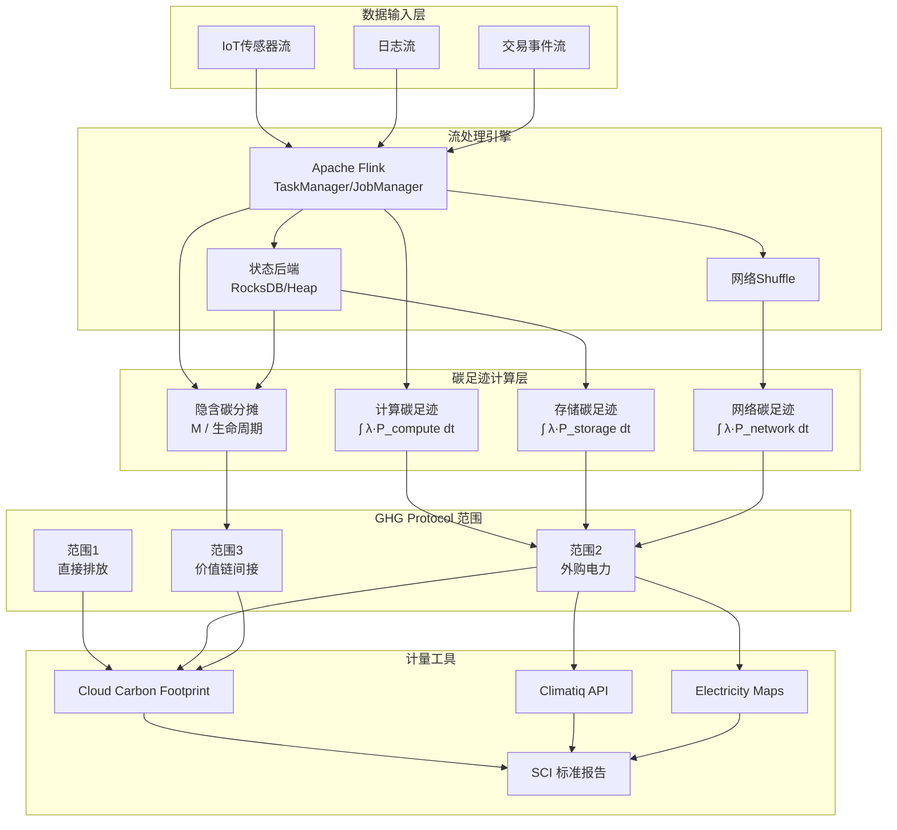
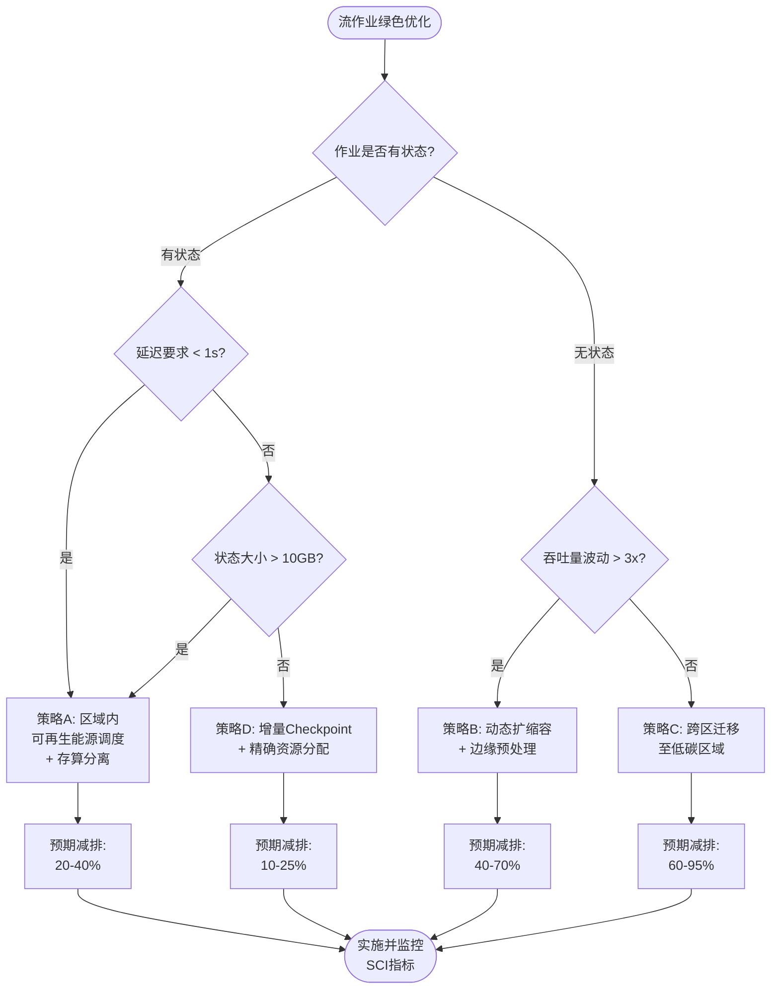

# 流处理碳足迹计量与绿色计算方法论

> **所属阶段**: Knowledge/06-frontier/green-ai-streaming/ | **前置依赖**: [Knowledge/06-frontier/](../06-frontier/), [Flink/04-runtime/resource-scheduling.md](../../../Flink/04-runtime/resource-scheduling.md) | **形式化等级**: L3-L4 | **最后更新**: 2026-04

---

## 1. 概念定义 (Definitions)

**Def-K-GS-01** (流处理系统碳足迹)：给定流处理系统 $\mathcal{S}$ 在时间区间 $[t_0, t_1]$ 内的碳足迹 $\Phi(\mathcal{S}, t_0, t_1)$ 定义为该系统直接和间接排放的二氧化碳当量总和（$\text{kgCO}_2\text{e}$）：

$$
\Phi(\mathcal{S}, t_0, t_1) = \int_{t_0}^{t_1} \lambda(t) \cdot P_{\mathcal{S}}(t) \, dt
$$

其中 $\lambda(t)$ 为电力碳排放强度（$\text{kgCO}_2\text{e}/\text{kWh}$），$P_{\mathcal{S}}(t)$ 为系统功耗（$\text{kW}$）。同一 Flink 作业在煤电地区与水电地区的碳足迹可相差 5-10 倍[^1]。

**Def-K-GS-02** (流处理系统碳强度)：流处理系统 $\mathcal{S}$ 的碳强度 $I_{\mathcal{S}}$ 定义为单位数据处理量所产生的碳排放量：

$$
I_{\mathcal{S}} = \frac{\Phi(\mathcal{S}, t_0, t_1)}{N_{\text{proc}}}
$$

其中 $N_{\text{proc}}$ 为区间 $[t_0, t_1]$ 内处理的事件总数，使不同规模、吞吐量的作业具备可比性。

**Def-K-GS-03** (软件碳强度, SCI)：依据 ISO/IEC 21031:2024[^2]，软件碳强度 $R = (E \cdot I + M) / N$，其中 $E$ 为运行电能（$\text{kWh}$），$I$ 为电力碳排放强度，$M$ 为硬件隐含碳分摊（$\text{kgCO}_2\text{e}$），$N$ 为功能单元数量。流处理系统通常采用**每百万条记录的碳排放**（$\text{kgCO}_2\text{e}/10^6\ \text{events}$）作为功能单元。

**Def-K-GS-04** (每事件碳排放, CpE)：流处理作业 $\mathcal{J}$ 在运行时配置 $\theta$ 下的每事件碳排放：

$$
\text{CpE}(\mathcal{J}, \theta) = \frac{P_{\text{compute}}(\theta) + P_{\text{storage}}(\theta) + P_{\text{network}}(\theta)}{\mu(\theta)} \cdot I_{\text{grid}}
$$

其中 $P_{\text{compute}}$、$P_{\text{storage}}$、$P_{\text{network}}$ 分别为计算、存储、网络组件的功耗，$\mu(\theta)$ 为吞吐量（events/s），$I_{\text{grid}}$ 为电网碳强度。

**Def-K-GS-05** (全生命周期评估, LCA)：流处理系统的 LCA 包含四阶段：原材料获取与制造（L1）、运输与部署（L2）、运行期（L3）、退役与回收（L4）。总碳足迹 $\Phi_{\text{LCA}}(\mathcal{S}) = \sum_{i=1}^{4} \Phi_{L_i}(\mathcal{S})$。运行期（L3）通常占总碳足迹的 60-80%，但硬件隐含碳（L1）在持续运行的基础设施中累积可达运行期排放的 20-40%[^3]。

---

## 2. 属性推导 (Properties)

**Lemma-K-GS-01** (碳排放可加性)：设流处理系统 $\mathcal{S}$ 由 $n$ 个独立子系统 $\{\mathcal{S}_1, \ldots, \mathcal{S}_n\}$ 组成，各子系统运行在同一电网下，则总碳足迹等于各子系统碳足迹之和：

$$
\Phi\left(\bigcup_{i=1}^{n} \mathcal{S}_i, t_0, t_1\right) = \sum_{i=1}^{n} \Phi(\mathcal{S}_i, t_0, t_1)
$$

*证明*：由 Def-K-GS-01，总功耗 $P_{\text{total}}(t) = \sum_{i=1}^{n} P_{\mathcal{S}_i}(t)$。代入积分定义并利用积分线性性即得结论。∎

**Prop-K-GS-01** (动态扩缩容上界约束)：设作业 $\mathcal{J}$ 在静态配置（固定 $n$ 个 TaskManager）下的碳排放为 $\Phi_{\text{static}}$，在理想动态扩缩容下的碳排放为 $\Phi_{\text{dynamic}}$，则：

$$
\Phi_{\text{dynamic}} \leq \alpha \cdot \Phi_{\text{static}} + \beta
$$

其中 $\alpha \in [0.3, 0.6]$ 为负载适配系数，$\beta$ 为状态迁移等额外开销。在峰谷差异显著的场景中，$\alpha$ 可低至 0.35[^4]。

---

## 3. 关系建立 (Relations)

### 3.1 与 GHG Protocol 范围排放的映射

GHG Protocol 将企业温室气体排放划分为三个范围[^6]：

| GHG 范围 | 定义 | 流处理系统对应组件 |
|---------|------|------------------|
| **范围 1** | 直接排放（燃料燃烧） | 自建数据中心的柴油发电机、备用电源 |
| **范围 2** | 间接排放（外购电力） | 云服务器/数据中心的电力消耗 |
| **范围 3** | 价值链间接排放 | 硬件制造、网络传输、云服务供应商供应链排放 |

对采用公有云的组织而言，范围 2 是最大排放源（占运营排放的 80-95%）。范围 3 中的硬件隐含碳在持续运行的流处理基础设施中累积效应显著。

### 3.2 与 Dataflow 模型的碳语义映射

Dataflow 模型核心抽象均可赋予碳语义：**Source** 包含数据产生端设备能耗与网络传输能耗；**Transform** 碳排放与算子复杂度、状态访问频率成正比；**Sink** 包含目标系统写入能耗与下游存储生命周期；**Window** 策略影响状态存储时长与触发计算频率；**Trigger** 频率与状态存储时长之间存在碳最优中间点。

### 3.3 与 Flink 运行时组件的映射

| Flink 组件 | 碳排放源 | 主要影响因素 |
|-----------|---------|-----------|
| JobManager | 协调与调度开销 | 作业数量、Checkpoint 频率 |
| TaskManager | 算子执行、网络 shuffle | 并行度、缓冲区大小、反压状态 |
| State Backend | 状态读写与持久化 | 状态大小、增量 Checkpoint、RocksDB 压缩 |
| Checkpoint | 状态快照、远程存储写入 | 状态大小、增量算法、存储区域 |
| Network Stack | 跨节点数据交换 | 分区数、序列化开销、背压传播 |

---

## 4. 论证过程 (Argumentation)

### 4.1 反例：静态集群的碳排放陷阱

假设某电商流处理作业在促销期间（每日 6 小时）需要 100 个 TaskManager，其余 18 小时仅需 20 个。静态 100 TM 配置下总计算量为 2400 TM·h，其中 1440 TM·h（60%）为低谷期空闲浪费。采用动态扩缩容后，低谷期降至 20 TM，总计算量为 960 TM·h，节省 60%。**"留足余量"的传统运维思维在碳约束环境下产生显著负外部性。**

### 4.2 边界讨论：边缘预处理的碳效益临界点

边缘预处理（在数据源附近过滤、聚合后再传输）的净碳收益为正的条件：

$$
(E_{\text{edge}} + E_{\text{net}}' + E_{\text{cloud}}') - (E_{\text{net}} + E_{\text{cloud}}) < 0
$$

当原始数据压缩比低、边缘设备能效极差或网络传输距离极短时，边缘预处理反而增加总碳排放。经验阈值：当边缘压缩比 > 5× 且边缘设备能效 < 10× 云端单位计算能耗时，边缘预处理通常具备碳优势[^7]。

### 4.3 可再生能源调度的约束排序

可再生能源调度（将计算负载转移至风电/光伏时段或区域）面临状态一致性、延迟与电网交易粒度的约束。对有状态流作业的适用性排序为：**无状态 ETL > 允许秒级延迟的窗口聚合 > 严格低延迟的 CEP**。

---

## 5. 形式证明 / 工程论证 (Proof / Engineering Argument)

### 5.1 动态扩缩容碳减排上界定理

**Thm-K-GS-01** (动态扩缩容碳减排上界定理)：设流处理作业 $\mathcal{J}$ 在区间 $[0, T]$ 内的理想负载曲线为 $L(t)$（以 TaskManager 数量度量），静态配置为 $n_{\max} = \max_{t} L(t)$，动态配置为 $n(t) = L(t)$。假设单个 TaskManager 功耗 $p$ 为常数，电网碳强度 $\lambda$ 为常数，扩缩容操作不引入额外碳排放，则动态配置相对静态配置的碳减排率：

$$
\eta = 1 - \frac{\int_0^T L(t) \, dt}{n_{\max} \cdot T} = 1 - \frac{\bar{L}}{n_{\max}}
$$

其中 $\bar{L}$ 为平均负载。

*证明*：静态配置碳排放 $\Phi_{\text{static}} = \lambda \cdot p \cdot n_{\max} \cdot T$；动态配置 $\Phi_{\text{dynamic}} = \lambda \cdot p \cdot \int_0^T L(t) \, dt$。代入减排率定义即得。∎

*推论*：负载恒定时 $\eta = 0$；峰谷比为 5:1 时 $\bar{L} = 0.35 n_{\max}$，$\eta = 0.65$，可减少 65% 碳排放。

### 5.2 存储计算分离的碳效率论证

考虑流处理场景：需 10 台服务器计算能力，但状态存储仅需 3 台容量。

**存算一体**：10 台通用服务器，总功耗 $10 \times P_{\text{server}}$。

**存算分离**：计算层 10 台无状态节点（$10 \times 0.7 P_{\text{server}}$）+ 存储层 3 台专用节点（$3 \times 0.5 P_{\text{server}}$），总功耗 $8.5\ P_{\text{server}}$，减排率 15%。当计算与存储负载峰谷错配时，独立调度可进一步降低总碳排放至 25-40%[^5]。

---

## 6. 实例验证 (Examples)

### 6.1 Flink 作业碳足迹估算

某用户行为事件处理 Flink 作业：并行度 20，TaskManager 10 台（单台 250W），JobManager 1 台（100W），运行 24h/天，吞吐量 500,000 events/s，电网碳强度 0.5 kgCO₂e/kWh。

日碳排放：$\Phi_{\text{daily}} = (10 \times 0.25 + 0.1)\ \text{kW} \times 24\ \text{h} \times 0.5 = 31.2\ \text{kgCO}_2\text{e}$。

SCI 指标（每百万事件）：$\text{SCI} = 0.72\ \text{gCO}_2\text{e}/10^6\ \text{events}$。迁移至水电区域（$I_{\text{grid}} = 0.02$，如挪威），碳强度降低 96%[^1]。

### 6.2 Cloud Carbon Footprint 工具集成

Cloud Carbon Footprint (CCF) 支持 AWS/GCP/Azure 计费数据导入，将云资源使用量乘以对应区域电网碳强度，叠加硬件隐含碳分摊[^8]。核心配置示例：

```yaml
cloud_provider: AWS
services:
  - service: EC2
    query: SELECT usage_amount FROM cur
           WHERE product_code = 'AmazonEC2'
             AND tags_application = 'flink-streaming'
  - service: S3
    query: SELECT usage_amount FROM cur
           WHERE product_code = 'AmazonS3'
             AND tags_component = 'flink-checkpoint'
emission_factors:
  us-east-1: 0.415   # kgCO2e/kWh
  eu-north-1: 0.016  # 瑞典低碳水
```

### 6.3 边缘预处理场景对比

某工业 IoT 场景：1000 个传感器每秒产生 1KB 数据，云端需过滤异常值并计算 1 分钟窗口均值。

| 方案 | 数据传输 | 总日碳排放 |
|-----|---------|----------|
| 直接上云 | 86.4 GB/天 | 8.2 kgCO₂e |
| 边缘预处理 | 4.3 GB/天（过滤+聚合后） | 1.7 kgCO₂e |
| **减排效果** | **↓ 95%** | **↓ 79%** |

边缘网关执行阈值过滤与时间窗口聚合后，仅上传异常事件和聚合结果，显著降低传输与云端计算碳排放[^7]。

---

## 7. 可视化 (Visualizations)

### 7.1 流处理碳足迹计量框架



### 7.2 绿色计算策略决策树



---

## 8. 引用参考 (References)

[^1]: International Energy Agency (IEA), "Data Centres and Data Transmission Networks", World Energy Outlook Special Report, 2024. <https://www.iea.org/energy-system/buildings/data-centres-and-data-transmission-networks>


[^3]: Green Software Foundation, "Software Carbon Intensity (SCI) Specification v1.1", 2023. <https://sci.greensoftware.foundation/>

[^4]: K.-D. Lange et al., "Energy and Cost Efficiency in Data Centers: A Comprehensive Review", ACM Computing Surveys, 56(4), 2023.

[^5]: RisingWave Labs, "Disaggregated Storage and Compute Architecture in Stream Processing", Technical Whitepaper, 2024.

[^6]: GHG Protocol, "Corporate Standard for Greenhouse Gas Accounting and Reporting", WRI & WBCSD, 2015. <https://ghgprotocol.org/>

[^7]: M. A. Ferrag et al., "Green IoT for Sustainable Smart Cities: Challenges and Opportunities", IEEE Internet of Things Journal, 9(15), 2022.

[^8]: Thoughtworks, "Cloud Carbon Footprint", GitHub, 2024. <https://github.com/cloud-carbon-footprint/cloud-carbon-footprint>
