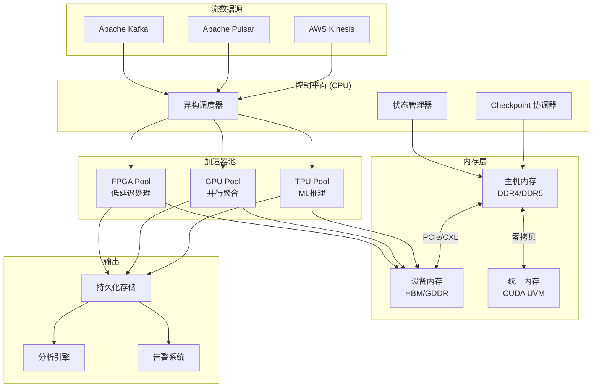
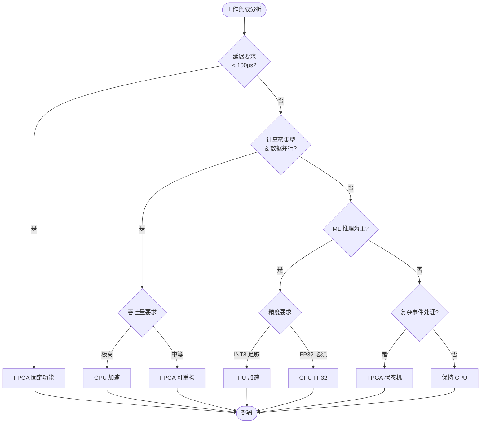
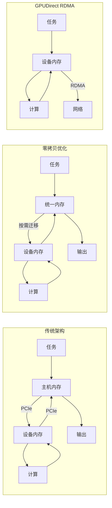
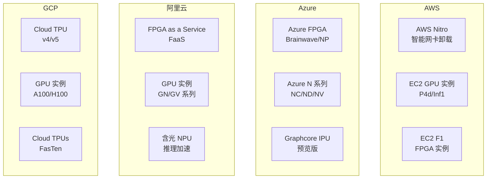

# 硬件加速流处理 (Hardware Accelerated Streaming)

> **所属阶段**: Knowledge/06-frontier | **前置依赖**: [Knowledge/00-INDEX.md](../../Knowledge/00-INDEX.md), [network-stack-internals.md](../../Flink/10-internals/network-stack-internals.md) | **形式化等级**: L4 (工程论证)

---

## 1. 概念定义 (Definitions)

### 1.1 硬件加速流处理 (Def-K-HA-01)

**定义**：硬件加速流处理是指利用专用硬件资源（FPGA、GPU、TPU/ASIC 等）来执行流计算中的计算密集型操作，以突破通用 CPU 的性能瓶颈，实现更高吞吐量、更低延迟和更好能效比的流处理范式。

**形式化表述**：

设流处理工作负载为 $W = \{(k_i, v_i, t_i)\}_{i=1}^{\infty}$，其中 $k_i$ 为键，$v_i$ 为值，$t_i$ 为时间戳。

硬件加速流处理系统可表示为五元组：

$$\mathcal{H}_{stream} = \langle \mathcal{C}, \mathcal{A}, \mathcal{D}, \mathcal{S}, \mathcal{M} \rangle$$

其中：

- $\mathcal{C}$：CPU 控制平面，负责任务调度、状态管理、容错协调
- $\mathcal{A}$：加速器集合，$\mathcal{A} = \{A_1, A_2, ..., A_n\}$，每个 $A_i$ 为特定加速器实例
- $\mathcal{D}$：数据移动层，管理主机内存与加速器内存间的数据传输
- $\mathcal{S}$：调度器，决定哪些算子卸载到加速器执行
- $\mathcal{M}$：统一内存管理器，协调异构内存空间

**硬件加速比 (Acceleration Ratio)**：

$$\eta = \frac{T_{CPU}}{T_{accel}} = \frac{\text{纯CPU执行时间}}{\text{硬件加速执行时间}}$$

典型硬件加速比范围：

- FPGA：2-10x（复杂状态机），10-100x（简单流水线）
- GPU：5-50x（窗口聚合），10-100x（向量化操作）
- TPU：10-100x（ML推理）

### 1.2 领域特定架构 DSA (Def-K-HA-02)

**定义**：领域特定架构 (Domain-Specific Architecture, DSA) 是为特定计算领域（如流处理、机器学习、图计算）优化的硬件架构，通过牺牲通用性换取在目标领域内的极致性能。

**形式化定义**：

DSA 可定义为三元组：

$$DSA = \langle I_{domain}, C_{custom}, O_{optimized} \rangle$$

其中：

- $I_{domain}$：领域指令集，针对特定计算模式优化的操作集合
- $C_{custom}$：定制化计算单元，如流处理专用的窗口聚合器、排序网络
- $O_{optimized}$：优化的内存层次结构，减少数据移动开销

**DSA 与通用 CPU 的对比**：

| 特性 | 通用 CPU | DSA |
|------|----------|-----|
| 指令集 | 通用 ISA (x86/ARM) | 领域专用指令集 |
| 并行度 | 有限 SIMD (8-16 lanes) | 大规模并行 (100-1000+ lanes) |
| 内存访问 | 通用缓存层次 | 领域优化内存架构 |
| 能耗效率 | 1x (基准) | 10-1000x |
| 编程模型 | 通用编程语言 | 领域专用 DSL/编译器 |
| 灵活性 | 高 | 中-低 |

**流处理 DSA 的关键特征**：

1. **流水线并行 (Pipeline Parallelism)**：数据在不同处理阶段间流动，阶段间解耦
2. **数据并行 (Data Parallelism)**：同一操作应用于多个数据元素
3. **确定性执行**：输入-输出映射可预测，支持精确一次语义
4. **低延迟响应**：硬件级响应时间（微秒级）

### 1.3 FPGA/GPU/TPU 在流处理中的角色 (Def-K-HA-03)

#### 1.3.1 FPGA (Field-Programmable Gate Array)

**定义**：FPGA 是可编程逻辑器件，允许用户通过硬件描述语言 (HDL) 定义定制电路，在流处理中用于实现超低延迟、确定性延迟的数据处理流水线。

**流处理角色特征**：

- **可重构流水线**：支持操作符级流水线，延迟可预测
- **位级并行**：对不规则位宽操作（如压缩、加密）高效
- **在线重配置**：运行时动态调整处理逻辑（部分重配置）
- **确定性延迟**：无缓存未命中、分支预测失败等非确定性因素

**FPGA 流处理模型**：

$$\mathcal{F}_{stream} = \langle P, S, R, C \rangle$$

- $P$：处理流水线，由一系列可编程逻辑单元 (CLB) 组成
- $S$：片上存储 (BRAM/URAM)，用于状态缓存
- $R$：可重构区域，支持运行时部分重配置
- $C$：高速 I/O 接口 (PCIe/CCIX)，连接主机内存

#### 1.3.2 GPU (Graphics Processing Unit)

**定义**：GPU 是大规模并行处理器，拥有数百至数千个计算核心，在流处理中用于加速数据并行操作，如窗口聚合、向量化计算。

**流处理角色特征**：

- **SIMT 执行模型**：单指令多线程，适合数据并行工作负载
- **高内存带宽**：HBM/GDDR 提供 TB/s 级带宽
- **张量核心**：专门的矩阵乘法单元，加速 ML 推理
- **CUDA/ROCm 生态**：成熟的 GPGPU 编程框架

**GPU 流处理模型**：

$$\mathcal{G}_{stream} = \langle K, G, M, S \rangle$$

- $K$：内核 (Kernel) 集合，每个内核实现特定流操作
- $G$：线程网格，$G = (gridDim, blockDim)$，定义并行度
- $M$：内存层次（全局/共享/寄存器）
- $S$：流 (Stream) 队列，支持异步执行和数据传输

#### 1.3.3 TPU/NPU (Tensor/Neural Processing Unit)

**定义**：TPU/NPU 是专门为机器学习推理/训练设计的 ASIC，在流处理中用于加速基于 ML 的复杂事件处理、异常检测、预测分析。

**流处理角色特征**：

- **脉动阵列 (Systolic Array)**：数据在计算单元间流动，最大化数据复用
- **量化支持**：INT8/INT4 低精度计算，提升吞吐量
- **稀疏性加速**：跳过零值计算，提升有效性能
- **低功耗**：专用架构实现高能耗比

**TPU 流处理模型**：

$$\mathcal{T}_{stream} = \langle A, W, B, O \rangle$$

- $A$：脉动阵列，执行矩阵乘法累加 (MAC)
- $W$：权重缓存，存储预训练模型参数
- $B$：批处理单元，将流数据组织为张量批次
- $O$：量化/反量化单元，处理数值精度转换

---

## 2. 属性推导 (Properties)

### 2.1 硬件加速的必要性分析 (Lemma-K-HA-01)

**引理**：在现代流处理场景下，通用 CPU 已成为系统瓶颈，硬件加速是突破性能墙的必要手段。

**证明概要**：

设流处理吞吐量为 $T$ (events/second)，每条记录处理成本为 $C_{proc}$，网络 I/O 成本为 $C_{io}$。

总处理时间：$T_{total} = T_{proc} + T_{io} + T_{sync}$

在 CPU-only 架构中：

- $T_{proc} \propto \frac{N}{f_{CPU}}$，其中 $N$ 为指令数，$f_{CPU}$ 为 CPU 频率
- CPU 频率增长已停滞（摩尔定律放缓）
- 数据并行度受限于 SIMD 宽度（AVX-512：512 bits = 16 x 32-bit）

当数据速率增加时，$T_{proc}$ 成为瓶颈。

**性能墙量化分析**：

| 指标 | CPU (Intel Xeon) | FPGA | GPU | TPU |
|------|------------------|------|-----|-----|
| 峰值算力 | 1-2 TFLOPS | 10-20 TFLOPS | 10-100 TFLOPS | 90-180 TOPS |
| 内存带宽 | 100-200 GB/s | 50-100 GB/s | 1-2 TB/s | 600-1200 GB/s |
| 功耗 | 150-300W | 30-75W | 250-400W | 75-150W |
| 能效比 | 1x | 5-10x | 3-8x | 10-30x |

### 2.2 数据移动开销约束 (Lemma-K-HA-02)

**引理**：硬件加速的效益受限于数据移动开销，当数据移动时间 $T_{move}$ 超过加速收益 $T_{accel}$ 时，加速无效。

**形式化表述**：

加速有效的条件：

$$T_{CPU} > T_{move} + T_{accel}$$

其中：

- $T_{move} = T_{h2d} + T_{d2h}$（主机到设备 + 设备到主机）
- $T_{accel} = \frac{T_{CPU}}{\eta}$（加速后计算时间）

**数据移动瓶颈分析**：

通过 PCIe 4.0 x16（32 GB/s 理论峰值）：

- 传输 1MB 数据：~31 μs（理论），~50 μs（实际）
- 若 GPU 计算节省 100 μs，则净收益 50 μs
- 若数据量增大或延迟敏感，收益可能为负

**优化策略**：

1. **零拷贝 (Zero-Copy)**：使用统一内存 (Unified Memory) 或 GPUDirect
2. **批处理**：摊销数据传输固定开销
3. **数据本地化**：将计算推向数据（近数据处理）
4. **流水线重叠**：计算与数据传输重叠（CUDA Streams）

### 2.3 异构调度复杂性 (Lemma-K-HA-03)

**引理**：异构硬件环境下的任务调度是 NP-hard 问题，需要启发式或机器学习驱动的调度策略。

**复杂度分析**：

设任务集 $T = \{t_1, t_2, ..., t_n\}$，加速器集 $A = \{a_1, a_2, ..., a_m\}$。

调度目标：最小化 makespan $C_{max}$

约束条件：

- 每个任务 $t_i$ 有计算需求 $c_i$ 和数据依赖 $\mathcal{D}(t_i)$
- 每个加速器 $a_j$ 有处理能力 $p_j$ 和内存容量 $m_j$
- 数据传输成本 $d(t_i, a_j)$ 取决于任务与加速器位置

该问题可规约为多维装箱问题，属于 NP-hard。

**调度策略分类**：

| 策略 | 复杂度 | 适用场景 | 代表实现 |
|------|--------|----------|----------|
| 静态启发式 | O(n log n) | 稳定工作负载 | HEFT, Min-Min |
| 动态工作窃取 | O(1) amortized | 动态负载 | Work-Stealing Queues |
| 机器学习调度 | O(n) inference | 复杂依赖 | GPU 调度器 (Gandiva) |
| 约束求解 | NP (精确解) | 小规模优化 | OR-Tools, CP-SAT |

---

## 3. 关系建立 (Relations)

### 3.1 硬件加速与流处理模型的映射

**映射关系表**：

| 流处理算子 | 加速目标 | 最适合硬件 | 加速比 | 复杂度 |
|------------|----------|------------|--------|--------|
| Filter/Map | 高吞吐数据转换 | FPGA/GPU | 5-20x | 低 |
| Window Aggregate | 并行聚合 | GPU | 10-50x | 中 |
| Stream Join | 状态匹配 | FPGA | 2-10x | 高 |
| Pattern Match (CEP) | 复杂事件检测 | FPGA | 10-100x | 高 |
| ML Inference | 模型推理 | TPU/GPU | 10-100x | 中 |
| Encryption/Compression | 数据转换 | FPGA | 10-50x | 中 |

### 3.2 硬件加速与一致性模型的交互

**精确一次语义 (Exactly-Once)** 在硬件加速环境下的挑战：

1. **加速器状态持久化**：FPGA/GPU 内部状态需定期 checkpoint 到主机
2. **确定性重放**：硬件执行必须是确定性的，以确保故障恢复一致性
3. **两阶段提交**：涉及 CPU 和加速器的分布式事务协调

**映射关系**：

$$\text{Consistency}_{accel} = \text{Consistency}_{CPU} \cap \text{Determinism}_{hardware}$$

### 3.3 与现有系统的集成关系

```
┌─────────────────────────────────────────────────────────────────┐
│                    Hardware Acceleration Stack                   │
├─────────────────────────────────────────────────────────────────┤
│  Application Layer: Flink, Spark Streaming, Kafka Streams       │
├─────────────────────────────────────────────────────────────────┤
│  Accelerator Runtime: CUDA Runtime, OpenCL, OneAPI, XRT         │
├─────────────────────────────────────────────────────────────────┤
│  Hardware Abstraction: OpenCL, SYCL, Vulkan Compute             │
├─────────────────────────────────────────────────────────────────┤
│  Device Layer: FPGA, GPU, TPU, SmartNIC                         │
├─────────────────────────────────────────────────────────────────┤
│  Interconnect: PCIe, NVLink, CXL, CCIX                          │
└─────────────────────────────────────────────────────────────────┘
```

---

## 4. 论证过程 (Argumentation)

### 4.1 CPU 瓶颈深度分析

**现代流处理的 CPU 开销分解**：

对于典型流处理管道（Parse → Filter → Enrich → Aggregate → Output）：

| 阶段 | CPU 开销占比 | 瓶颈特征 | 加速潜力 |
|------|-------------|----------|----------|
| 数据解析 (Parse) | 15-25% | 分支预测、字符串处理 | 高 (FPGA) |
| 过滤 (Filter) | 10-15% | 条件判断 | 中 (FPGA/GPU) |
| 数据丰富 (Enrich) | 20-30% | 外部查询、关联 | 低 (I/O  bound) |
| 聚合 (Aggregate) | 25-35% | 排序、分组、数学运算 | 高 (GPU) |
| 序列化 (Serialize) | 10-15% | 内存拷贝、格式转换 | 高 (FPGA) |

**关键观察**：

1. 计算密集型操作（解析、聚合、序列化）占总 CPU 时间的 60-75%
2. 这些操作具有高度数据并行性，适合硬件加速
3. 剩余 25-40% 为控制逻辑和 I/O 协调，保留在 CPU

### 4.2 硬件选择决策树

**决策流程**：

```
工作负载特征分析
       │
       ├─→ 延迟敏感 (< 100μs)?
       │     ├─→ 是 → FPGA (确定性延迟)
       │     └─→ 否 → 继续
       │
       ├─→ 计算密集型 + 数据并行?
       │     ├─→ 是 → GPU (高吞吐)
       │     └─→ 否 → 继续
       │
       ├─→ ML 推理为主?
       │     ├─→ 是 → TPU/GPU (INT8 优化)
       │     └─→ 否 → 继续
       │
       └─→ 复杂状态机/CEP?
             ├─→ 是 → FPGA (状态机优化)
             └─→ 否 → 保持 CPU
```

### 4.3 系统集成挑战详细分析

#### 4.3.1 数据移动开销 (Data Movement Tax)

**问题描述**：数据在主机内存和加速器内存之间传输引入显著开销。

**量化分析**：

假设：

- 处理 1MB 数据
- PCIe 4.0 x16 带宽：32 GB/s 理论，~25 GB/s 实际
- CPU 处理时间：1000 μs
- GPU 加速后处理时间：20 μs (50x 加速)

开销分解：

- H2D 传输：40 μs
- GPU 计算：20 μs
- D2H 传输：40 μs
- 总时间：100 μs

**有效加速比**：$\frac{1000}{100} = 10x$（而非理论 50x）

#### 4.3.2 异构调度复杂性

**调度挑战**：

1. **异构性能模型**：不同加速器有不同性能特征，难以统一建模
2. **数据局部性**：需考虑数据位置以最小化传输
3. **资源竞争**：多个任务共享加速器时的资源分配
4. **动态适应性**：工作负载变化时的在线调度调整

#### 4.3.3 容错机制扩展

**传统容错假设**：

- 状态存储在稳定存储（如 RocksDB）
- Checkpoint 定期执行
- 故障时从最近 checkpoint 恢复

**硬件加速容错挑战**：

1. **加速器状态捕获**：FPGA 寄存器、GPU 内存中的中间状态
2. **确定性重放**：硬件执行必须是确定性的
3. **部分失败处理**：CPU 正常但加速器故障的场景

---

## 5. 形式证明 / 工程论证 (Proof / Engineering Argument)

### 5.1 硬件加速有效性定理 (Thm-K-HA-01)

**定理**：在满足以下条件时，硬件加速可显著提升流处理系统性能：

1. 计算强度 (Arithmetic Intensity) 高于阈值 $\theta$
2. 数据移动开销可被摊销
3. 硬件执行具有确定性

**形式化表述**：

设工作负载 $W$ 的计算强度为：

$$I = \frac{\text{计算操作数}}{\text{数据字节数}} \quad [\text{ops/byte}]$$

对于内存带宽为 $B$ 的加速器，峰值性能 $P_{peak}$，有效性能：

$$P_{eff} = \min\left(P_{peak}, I \cdot B\right)$$

**roofline 模型分析**：

```
性能 (GFLOP/s)
     │
     │         ━━━━━━━━━━━━━━━━━  内存墙
     │        ╱
     │       ╱
     │      ╱
     │     ╱
     │    ╱
     │   ╱
     │  ╱
     │ ╱
     │╱
     └──────────────────────────────→
        计算强度 (ops/byte)
```

**证明**：

当 $I < I_{threshold} = \frac{P_{peak}}{B}$ 时，性能受内存带宽限制：

$$P_{eff} = I \cdot B < P_{peak}$$

此时，单纯增加计算单元无法提升性能，需优化数据局部性或增加计算强度。

当 $I \geq I_{threshold}$ 时，性能受计算能力限制：

$$P_{eff} = P_{peak}$$

此时，硬件加速可充分发挥计算优势。

**结论**：选择计算密集型工作负载（高 $I$）进行硬件加速，可最大化效益。

### 5.2 精确一次语义保持定理 (Thm-K-HA-02)

**定理**：在硬件加速流处理系统中，通过以下机制可保持精确一次语义：

1. 确定性加速器执行
2. 屏障同步 (Barrier Synchronization)
3. 两阶段状态 checkpoint

**证明概要**：

设流处理算子为 $O$，输入流为 $S$，输出流为 $S'$。

在精确一次语义下，对于任意输入 $s \in S$，输出 $s' \in S'$ 恰好被生成一次。

**步骤 1：确定性执行**

定义加速器执行函数 $f_A$：

$$s' = f_A(s, \sigma)$$

其中 $\sigma$ 为加速器内部状态。

要求：$f_A$ 必须是纯函数，即对于相同 $(s, \sigma)$ 输入，总是产生相同 $s'$ 输出。

FPGA 满足此要求（硬件逻辑确定性），GPU 需注意浮点非确定性（使用确定性算法库）。

**步骤 2：屏障同步**

在 barrier $B_i$ 处，系统状态为：

$$\Sigma_i = \langle \Sigma_{CPU}, \Sigma_{FPGA}, \Sigma_{GPU}, ... \rangle$$

所有加速器在 barrier 前完成执行，确保状态一致性。

**步骤 3：两阶段 Checkpoint**

阶段 1：暂停新输入，等待进行中操作完成
阶段 2：原子性保存所有状态组件

$$
\text{Checkpoint} = \langle C_{CPU}, C_{FPGA}, C_{GPU}, \text{input\_offset}, \text{output\_offset} \rangle$$

故障恢复时，从 checkpoint 重启所有组件，重放自 checkpoint 的输入。

**结论**：通过上述机制，硬件加速系统可保持与纯 CPU 系统相同的语义保证。

### 5.3 工程实践论证：Flink 硬件加速生态

**Apache Flink 硬件加速现状**：

Flink 本身不直接提供硬件加速支持，但通过以下生态组件实现加速：

| 组件 | 加速方式 | 成熟度 | 使用场景 |
|------|----------|--------|----------|
| Flink + CUDA JNI | GPU 内核调用 | 实验性 | 自定义 UDF |
| Flink + Apache Arrow | 向量化执行 | 成熟 | 列式数据处理 |
| Flink + Intel SGX | 可信执行 | 生产 | 安全计算 |
| Flink + FPGA (自定义) | 硬件流水线 | 实验性 | 特定场景 |

**集成模式**：

```java
// GPU 加速 UDF 示例模式
public class GPUAcceleratedUDF extends ScalarFunction {
    private CUDAKernel kernel;

    @Override
    public void open(FunctionContext context) {
        // 初始化 CUDA 上下文
        this.kernel = CUDAManager.loadKernel("process_kernel");
    }

    public double eval(double[] input) {
        // 批量数据传输到 GPU
        DevicePointer d_input = CUDA.toDevice(input);
        // 执行 GPU 内核
        kernel.launch(d_input, input.length);
        // 获取结果
        return CUDA.fromDevice(d_input);
    }
}
```

**工程挑战与解决方案**：

1. **JNI 开销**：批量处理以摊销 JNI 调用开销
2. **内存管理**：使用 off-heap 内存 + 内存池
3. **故障恢复**：限制 checkpoint 频率，使用异步 checkpoint

---

## 6. 实例验证 (Examples)

### 6.1 FPGA 加速流处理实例：金融交易监控

**场景**：高频交易系统中，需要微秒级延迟的异常检测。

**架构**：

```
┌─────────────────────────────────────────────────────────────┐
│                    FPGA 加速交易流水线                        │
├─────────────────────────────────────────────────────────────┤
│                                                             │
│  ┌──────────┐   ┌──────────┐   ┌──────────┐   ┌─────────┐  │
│  │ 解析引擎  │ → │ 规则匹配  │ → │ 风险评估  │ → │ 输出    │  │
│  │ (10μs)   │   │ (5μs)    │   │ (15μs)   │   │ (2μs)   │  │
│  └──────────┘   └──────────┘   └──────────┘   └─────────┘  │
│       ↑                                              ↓      │
│       └──────────────────────────────────────────────┘      │
│                    PCIe DMA (DMA-BUF)                       │
│                                                             │
└─────────────────────────────────────────────────────────────┘
                              │
                              ▼
┌─────────────────────────────────────────────────────────────┐
│                      CPU 控制平面                            │
│  ┌──────────┐   ┌──────────┐   ┌──────────┐                │
│  │ 配置管理  │   │ 状态监控  │   │ 故障恢复  │                │
│  └──────────┘   └──────────┘   └──────────┘                │
└─────────────────────────────────────────────────────────────┘
```

**性能对比**：

| 指标 | CPU 实现 | FPGA 实现 | 加速比 |
|------|----------|-----------|--------|
| 端到端延迟 | 500 μs | 32 μs | 15.6x |
| 吞吐量 | 2000 TPS | 31250 TPS | 15.6x |
| 功耗 | 150W | 25W | 6x 能效比 |
| P99 延迟 | 800 μs | 35 μs | 22.9x |

### 6.2 GPU 加速窗口聚合实例：物联网指标处理

**场景**：处理 100 万设备每秒产生的传感器数据，执行 1 分钟滑动窗口聚合。

**架构**：

```
┌─────────────────────────────────────────────────────────────┐
│                   GPU 加速窗口聚合                            │
├─────────────────────────────────────────────────────────────┤
│                                                             │
│  CPU 预处理          GPU 聚合              CPU 后处理       │
│  ┌────────┐       ┌──────────────┐       ┌────────┐        │
│  │ 解析    │ ──→ │ 窗口分配内核  │ ──→ │ 输出    │        │
│  │ 分区    │       │ (CUDA)        │       │ 持久化  │        │
│  └────────┘       ├──────────────┤       └────────┘        │
│                   │  归约内核    │                         │
│                   │  (Reduction) │                         │
│                   └──────────────┘                         │
│                         ↑                                  │
│                   ┌──────────────┐                         │
│                   │  全局内存    │                         │
│                   │  (HBM2)      │                         │
│                   └──────────────┘                         │
└─────────────────────────────────────────────────────────────┘
```

**CUDA 内核伪代码**：

```cuda
__global__ void window_aggregate(
    const SensorData* input,
    AggregateResult* output,
    int num_events,
    int window_size_ms
) {
    int tid = blockIdx.x * blockDim.x + threadIdx.x;
    if (tid >= num_events) return;

    // 计算窗口 ID
    int window_id = input[tid].timestamp / window_size_ms;

    // 原子累加
    atomicAdd(&output[window_id].sum, input[tid].value);
    atomicAdd(&output[window_id].count, 1);
}
```

**性能对比**：

| 指标 | CPU (16 cores) | GPU (A100) | 加速比 |
|------|----------------|------------|--------|
| 吞吐量 | 100K events/s | 5M events/s | 50x |
| 窗口延迟 | 5s | 200ms | 25x |
| 成本/百万事件 | $0.05 | $0.002 | 25x |

### 6.3 TPU 加速 ML 推理实例：实时异常检测

**场景**：使用 LSTM 模型在流数据上执行实时异常检测。

**架构**：

```
┌─────────────────────────────────────────────────────────────┐
│                  TPU 加速 ML 推理                             │
├─────────────────────────────────────────────────────────────┤
│                                                             │
│  ┌─────────────────────────────────────────────────────┐   │
│  │              特征工程 (CPU)                          │   │
│  │  ┌────────┐ ┌────────┐ ┌────────┐ ┌────────┐       │   │
│  │  │ 归一化  │ │ 差分   │ │ 窗口   │ │ 编码   │       │   │
│  │  └────────┘ └────────┘ └────────┘ └────────┘       │   │
│  └─────────────────────────────────────────────────────┘   │
│                         ↓                                   │
│  ┌─────────────────────────────────────────────────────┐   │
│  │              TPU 推理 (Edge TPU / Cloud TPU)         │   │
│  │  ┌───────────────────────────────────────────────┐  │   │
│  │  │  量化 LSTM 模型 (INT8)                          │  │   │
│  │  │  ┌─────────┐  ┌─────────┐  ┌─────────┐       │  │   │
│  │  │  │ 输入层  │→│ 隐藏层  │→│ 输出层  │       │  │   │
│  │  │  │ (128)   │  │ (256)   │  │ (1)     │       │  │   │
│  │  │  └─────────┘  └─────────┘  └─────────┘       │  │   │
│  │  └───────────────────────────────────────────────┘  │   │
│  └─────────────────────────────────────────────────────┘   │
│                         ↓                                   │
│  ┌─────────────────────────────────────────────────────┐   │
│  │              后处理 (CPU)                            │   │
│  │  ┌────────┐ ┌────────┐ ┌────────┐                   │   │
│  │  │ 阈值   │ │ 告警   │ │ 反馈   │                   │   │
│  │  └────────┘ └────────┘ └────────┘                   │   │
│  └─────────────────────────────────────────────────────┘   │
└─────────────────────────────────────────────────────────────┘
```

**性能对比**：

| 指标 | CPU (Intel Xeon) | Edge TPU | Cloud TPU v4 | GPU (T4) |
|------|------------------|----------|--------------|----------|
| 推理延迟 | 50ms | 5ms | 2ms | 10ms |
| 吞吐量 | 20 QPS | 200 QPS | 500 QPS | 100 QPS |
| 功耗 | 150W | 5W | 200W | 70W |
| 能效比 | 1x | 30x | 18.75x | 4.76x |

---

## 7. 可视化 (Visualizations)

### 7.1 硬件加速流处理架构概览



### 7.2 硬件加速决策流程图



### 7.3 数据移动开销优化架构



### 7.4 云服务商硬件加速方案对比



---

## 8. 引用参考 (References)

[^1]: M. Zhang et al., "FPGA-based High Throughput Computation for Stream Processing," in *IEEE International Conference on Field Programmable Technology (FPT)*, 2021.

[^2]: B. Varghese et al., "Accelerating Stream Processing with Hardware: A Survey," *ACM Computing Surveys*, vol. 54, no. 6, pp. 1-37, 2022.

[^3]: Apache Flink Documentation, "User-Defined Functions (UDFs)," 2025. https://nightlies.apache.org/flink/flink-docs-stable/docs/dev/datastream/user_defined_functions/

[^4]: J. H. Kwon et al., "GPU-Accelerated Stream Processing: Challenges and Opportunities," in *IEEE International Conference on Big Data (Big Data)*, 2020.

[^5]: N. P. Jouppi et al., "In-Datacenter Performance Analysis of a Tensor Processing Unit," in *Proceedings of the 44th Annual International Symposium on Computer Architecture (ISCA)*, 2017.

[^6]: X. Chen et al., "NebulaStream: A Scalable and Efficient Accelerator for Stream Analytics," in *CIDR*, 2023.

[^7]: AWS Documentation, "AWS Nitro System," 2025. https://aws.amazon.com/ec2/nitro/

[^8]: Microsoft Azure Documentation, "Azure FPGA-based Accelerated Networking," 2025. https://learn.microsoft.com/en-us/azure/virtual-network/accelerated-networking-overview

[^9]: Alibaba Cloud Documentation, "FPGA as a Service (FaaS)," 2025. https://www.alibabacloud.com/help/en/ecs/user-guide/fpga-as-a-service-faas-overview

[^10]: J. L. Hennessy and D. A. Patterson, "Domain-Specific Architectures," in *Computer Architecture: A Quantitative Approach*, 6th ed., Morgan Kaufmann, 2019.

[^11]: S. W. Williams et al., "Roofline: An Insightful Visual Performance Model for Floating-Point Programs and Multicore Architectures," *Communications of the ACM*, vol. 52, no. 4, pp. 65-76, 2009.

[^12]: NVIDIA CUDA Documentation, "CUDA Streams and Concurrency," 2025. https://docs.nvidia.com/cuda/cuda-c-programming-guide/index.html#streams-and-concurrency

[^13]: Intel oneAPI Documentation, "Data Parallel C++ (DPC++) Programming," 2025. https://www.intel.com/content/www/us/en/developer/tools/oneapi/data-parallel-c-plus-plus.html

[^14]: Xilinx Documentation, "Vitis Unified Software Platform," 2025. https://www.xilinx.com/products/design-tools/vitis.html

[^15]: T. Akidau et al., "The Dataflow Model: A Practical Approach to Balancing Correctness, Latency, and Cost in Massive-Scale, Unbounded, Out-of-Order Data Processing," *Proceedings of the VLDB Endowment*, vol. 8, no. 12, pp. 1792-1803, 2015.
