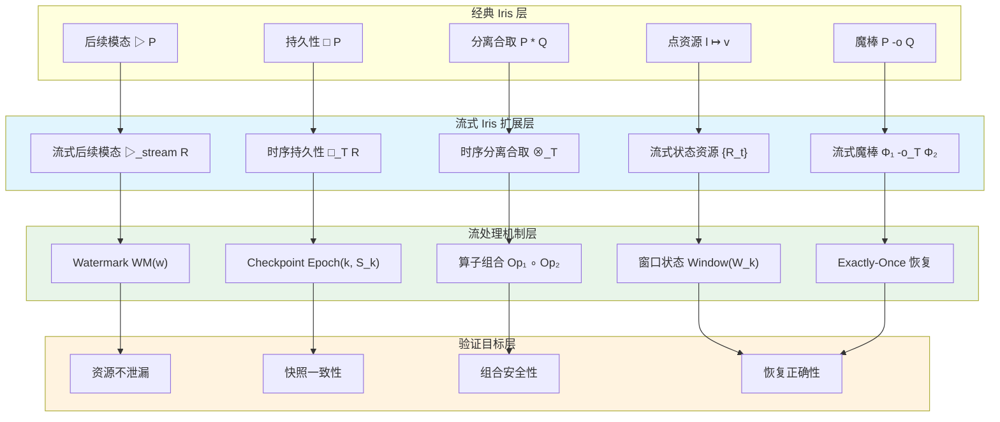
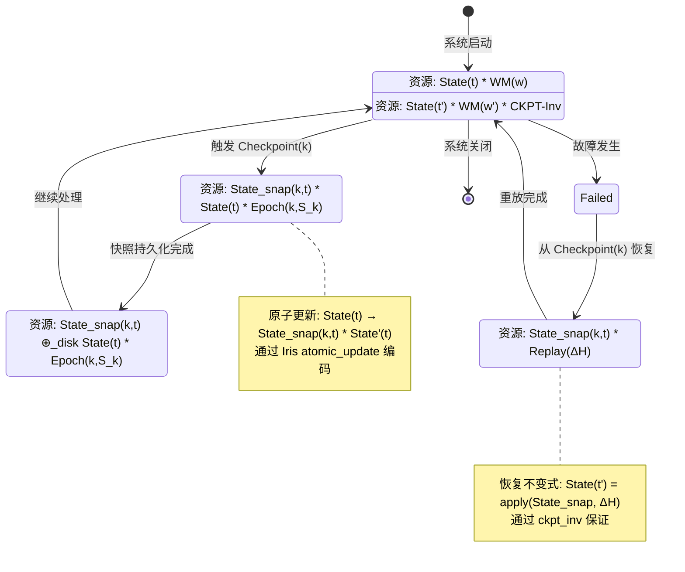

# Iris 分离逻辑在流处理中的扩展 (Iris Separation Logic Extensions for Stream Processing)

> **所属阶段**: Knowledge/06-frontier | **前置依赖**: [../../Struct/06-frontier/iris-coq-state-safety-verification.md](../../Struct/06-frontier/iris-coq-state-safety-verification.md), [../../Struct/06-frontier/tla-vs-lean4-expressiveness.md](../../Struct/06-frontier/tla-vs-lean4-expressiveness.md) | **形式化等级**: L5-L6
> **版本**: 2026.04

---

## 目录

- [Iris 分离逻辑在流处理中的扩展 (Iris Separation Logic Extensions for Stream Processing)](#iris-分离逻辑在流处理中的扩展-iris-separation-logic-extensions-for-stream-processing)
  - [目录](#目录)
  - [1. 概念定义 (Definitions)](#1-概念定义-definitions)
    - [Def-K-06-325. 流式状态资源](#def-k-06-325-流式状态资源)
    - [Def-K-06-326. 流处理算子 Hoare 三元组](#def-k-06-326-流处理算子-hoare-三元组)
    - [Def-K-06-327. 时序分离资源](#def-k-06-327-时序分离资源)
    - [Def-K-06-328. 检查点资源契约](#def-k-06-328-检查点资源契约)
    - [Def-K-06-329. 流式魔棒](#def-k-06-329-流式魔棒)
  - [2. 属性推导 (Properties)](#2-属性推导-properties)
    - [Lemma-K-06-321. 流式帧规则](#lemma-k-06-321-流式帧规则)
    - [Thm-K-06-321. 算子组合安全性定理](#thm-k-06-321-算子组合安全性定理)
    - [Prop-K-06-322. 时序资源单调性命题](#prop-k-06-322-时序资源单调性命题)
  - [3. 关系建立 (Relations)](#3-关系建立-relations)
    - [关系 1: Iris 资源模型 ↦ 流式状态序列](#关系-1-iris-资源模型-流式状态序列)
    - [关系 2: 时序资源 ↦ Watermark / Epoch / Checkpoint](#关系-2-时序资源-watermark-epoch-checkpoint)
    - [关系 3: 流式分离逻辑 ↦ 验证工具链定位](#关系-3-流式分离逻辑-验证工具链定位)
  - [4. 论证过程 (Argumentation)](#4-论证过程-argumentation)
    - [论证 1: 从单点状态到流式状态的扩展挑战](#论证-1-从单点状态到流式状态的扩展挑战)
    - [论证 2: 时间维度对分离逻辑公理的影响](#论证-2-时间维度对分离逻辑公理的影响)
    - [论证 3: 与 Checkpoint / Epoch 机制的对接](#论证-3-与-checkpoint-epoch-机制的对接)
  - [5. 形式证明 / 工程论证 (Proof / Engineering Argument)](#5-形式证明-工程论证-proof-engineering-argument)
    - [工程论证: 流式 Iris 验证框架的生产可行性](#工程论证-流式-iris-验证框架的生产可行性)
  - [6. 实例验证 (Examples)](#6-实例验证-examples)
    - [示例 1: 滚动窗口算子的时序资源验证](#示例-1-滚动窗口算子的时序资源验证)
    - [示例 2: Checkpoint 恢复的资源契约验证](#示例-2-checkpoint-恢复的资源契约验证)
  - [7. 可视化 (Visualizations)](#7-可视化-visualizations)
    - [图 7.1: 流式 Iris 分离逻辑架构图](#图-71-流式-iris-分离逻辑架构图)
    - [图 7.2: 时序资源与 Checkpoint 对接状态机](#图-72-时序资源与-checkpoint-对接状态机)
  - [8. 引用参考 (References)](#8-引用参考-references)
  - [关联文档](#关联文档)

---

## 1. 概念定义 (Definitions)

### Def-K-06-325. 流式状态资源

传统 Iris 分离逻辑的资源断言描述**单点状态**（如 $l \mapsto v$）。流处理系统要求扩展为**随时间演化的状态序列**。

**定义**：流式状态资源是一个带时间索引的资源族：

$$
\mathcal{R}_{stream} = \{ R_t \in \text{iProp} \}_{t \in \mathcal{T}}
$$

其中 $\mathcal{T}$ 为事件时间域，$R_t$ 为时刻 $t$ 的 Iris 资源断言。

**时间分离合取** $\bigotimes$ 的形成规则：

$$
\frac{\forall t_i \in \mathcal{T}.\ \vdash R_{t_i} : \text{iProp} \quad \forall t_i \neq t_j.\ \text{dom}(R_{t_i}) \cap \text{dom}(R_{t_j}) = \emptyset}{\vdash \bigotimes_{t_i \in \mathcal{T}} R_{t_i} : \text{StreamResource}}
$$

**与经典 Iris 对比**：

| 维度 | 经典 Iris | 流式扩展 |
|------|-----------|---------|
| 时间模型 | 无（瞬时点） | 事件时间 $\mathcal{T}$ |
| 分离性 | 空间分离 ($\ast$) | 时空分离 ($\bigotimes$) |
| 组合规则 | 帧规则 | 流式帧规则 |

物理直觉：将 Flink keyed state 建模为随事件时间推进的资源序列。滚动窗口算子在 $t_1, t_2, t_3$ 分别拥有窗口状态 $W_1, W_2, W_3$，时间上分离但在逻辑上通过 watermark 推进形成序列。

---

### Def-K-06-326. 流处理算子 Hoare 三元组

将经典 Hoare 三元组扩展为适用于流处理算子的**流式 Hoare 三元组**。

**定义**：

$$
\{ \Phi_{pre}(\mathcal{H}_{in}) \}\ Op\ \{ \Phi_{post}(\mathcal{H}_{in}, \mathcal{H}_{out}) \}
$$

其中 $\mathcal{H}_{in} = \langle e_1, \ldots, e_n \rangle$ 为输入流历史，$e_i = (v_i, t_i, \tau_i)$；$\mathcal{H}_{out}$ 为输出流历史；$\Phi_{pre}$ 和 $\Phi_{post}$ 为流历史上的 Iris 断言。

**Iris 编码**：通过高阶幽灵状态 $G_{stream}$ 编码：

$$
\{ G_{stream}(\mathcal{H}_{in}) \ast \Phi_{pre}(\mathcal{H}_{in}) \}\ Op\ \{ \exists \mathcal{H}_{out}.\ G_{stream}(\mathcal{H}_{in} \oplus \mathcal{H}_{out}) \ast \Phi_{post}(\mathcal{H}_{in}, \mathcal{H}_{out}) \}
$$

关键区别：经典三元组描述程序状态快照；流式三元组描述**流历史的演化模式**。

---

### Def-K-06-327. 时序分离资源

用于刻画流处理中时间窗口、watermark 和 epoch 等核心概念。

**定义**：时序分离资源 $\mathcal{T}_{res} = (\mathcal{W}, \mathcal{E}, \mathcal{C})$，其中：

- $\mathcal{W}$: Watermark 资源，$\text{WM}(w) \triangleq \forall e \in \mathcal{H}.\ \text{timestamp}(e) \leq w \Rightarrow e \in \text{Processed}$
- $\mathcal{E}$: Epoch 资源，$\text{Epoch}(k, S_k) \triangleq \text{StateAtEpoch}(k) = S_k$
- $\mathcal{C}$: Checkpoint 资源

**时序分离合取**：

$$
\mathcal{T}_1 \bigotimes_{\mathcal{T}} \mathcal{T}_2 \triangleq \mathcal{W}_1 \ast \mathcal{W}_2 \ast \mathcal{E}_1 \ast \mathcal{E}_2 \ast \mathcal{C}_1 \ast \mathcal{C}_2 \ast \text{WM-Compatible}(\mathcal{W}_1, \mathcal{W}_2)
$$

其中 $\text{WM-Compatible}(\text{WM}(w_1), \text{WM}(w_2)) \iff w_1 = w_2 \lor |w_1 - w_2| > \delta_{max}$。

---

### Def-K-06-328. 检查点资源契约

定义 checkpoint 过程中资源所有权的转移规则。

**定义**：Checkpoint 资源契约五元组

$$
\mathcal{K} = (\mathcal{S}_{pre}, \mathcal{S}_{snap}, \mathcal{S}_{post}, \mathcal{T}_{ckpt}, \mathcal{R}_{recover})
$$

**资源转移**：

$$
\mathcal{S}_{pre} \xrightarrow{\text{freeze}} \mathcal{S}_{snap} \ast \mathcal{S}_{post} \xrightarrow{\text{persist}} \mathcal{S}_{snap} \oplus_{disk} \mathcal{S}_{post}
$$

**Checkpoint 不变式**：

$$
\text{CKPT-Inv}(\mathcal{K}) \iff \forall t \geq \mathcal{T}_{ckpt}.\ \mathcal{R}_{recover}(\mathcal{S}_{snap}, \mathcal{H}_{[\mathcal{T}_{ckpt}, t]}) = \mathcal{S}_{actual}(t)
$$

Iris 编码通过原子更新实现：$\langle \mathcal{S}_{pre} \ast \text{CKPT-Inv} \rangle\ \text{checkpoint}()\ \langle \exists \mathcal{S}_{snap}.\ \mathcal{S}_{snap} \ast \mathcal{S}_{post} \ast \text{CKPT-Inv}' \rangle$。

---

### Def-K-06-329. 流式魔棒

扩展 Iris 的分离蕴涵 $P \wand Q$ 到流式场景。

**定义**：

$$
\Phi_1 \wand_{\mathcal{T}} \Phi_2 \triangleq \forall \mathcal{H}.\ \Phi_1(\mathcal{H}) \Rightarrow \Phi_2(\mathcal{H} \oplus \Delta\mathcal{H})
$$

其中 $|\Delta\mathcal{H}| < \infty$。

**应用场景**：窗口计算（输入事件资源→聚合结果资源）、状态传递（算子 $A$ 输出→算子 $B$ 输入）、checkpoint 恢复（快照+replay→恢复状态）。

---

## 2. 属性推导 (Properties)

### Lemma-K-06-321. 流式帧规则

**引理**：若流处理算子 $Op$ 在流历史资源 $\mathcal{H}$ 上满足流式三元组，且 $Op$ 不触及与 $\mathcal{H}$ 时间分离的帧资源 $\mathcal{F}$，则 $Op$ 在 $\mathcal{H} \bigotimes_{\mathcal{T}} \mathcal{F}$ 上同样满足该三元组。

$$
\frac{\{ \Phi_{pre}(\mathcal{H}) \}\ Op\ \{ \Phi_{post}(\mathcal{H}, \mathcal{H}') \}}{\{ \Phi_{pre}(\mathcal{H}) \ast \Psi(\mathcal{F}) \}\ Op\ \{ \Phi_{post}(\mathcal{H}, \mathcal{H}') \ast \Psi(\mathcal{F}) \}} \quad \text{(Streaming Frame Rule)}
$$

**证明概要**：由 Def-K-06-325，$\mathcal{H}$ 和 $\mathcal{F}$ 时间域不相交；$Op$ 仅操作 $\mathcal{H}$ 时间域内事件；由 Iris 经典帧规则，空间分离资源在操作后保持不变；时间分离蕴含空间分离。$\square$

**并行验证意义**：全局流式资源 $\mathcal{R}_{global} = \bigotimes_{i=1}^{n} (\mathcal{R}_{K_i} \bigotimes_{\mathcal{T}} \mathcal{R}_{W_i})$，每个子任务独立验证后通过流式帧规则组合为全局正确性。

---

### Thm-K-06-321. 算子组合安全性定理

**定理**：设流处理管道由算子 $Op_1$ 和 $Op_2$ 顺序组合，若分别满足流式 Hoare 三元组且接口兼容，则组合算子 $Op_1 \circ Op_2$ 满足组合安全性。

**形式化**：设

$$
\{ \Phi_{pre}^1(\mathcal{H}_{in}) \}\ Op_1\ \{ \Phi_{post}^1(\mathcal{H}_{in}, \mathcal{H}_{mid}) \}, \quad
\{ \Phi_{pre}^2(\mathcal{H}_{mid}) \}\ Op_2\ \{ \Phi_{post}^2(\mathcal{H}_{mid}, \mathcal{H}_{out}) \}
$$

若 $\Phi_{post}^1(\mathcal{H}_{in}, \mathcal{H}_{mid}) \Rightarrow \Phi_{pre}^2(\mathcal{H}_{mid})$（接口兼容性），则：

$$
\{ \Phi_{pre}^1(\mathcal{H}_{in}) \}\ Op_1 \circ Op_2\ \{ \exists \mathcal{H}_{mid}.\ \Phi_{post}^1 \ast \Phi_{post}^2 \}
$$

**证明**：

1. 由 $Op_1$ 三元组，$\Phi_{post}^1(\mathcal{H}_{in}, \mathcal{H}_{mid})$ 成立
2. 由接口兼容性，$Op_2$ 前条件满足
3. 由 $Op_2$ 三元组，$\Phi_{post}^2(\mathcal{H}_{mid}, \mathcal{H}_{out})$ 成立
4. 组合后条件为 $\exists \mathcal{H}_{mid}.\ \Phi_{post}^1 \ast \Phi_{post}^2$
5. 由流式帧规则，局部验证结果可在全局资源上组合

$\square$

**推广到 $n$ 个算子**：若相邻算子间均满足接口兼容性，则全局组合满足：

$$
\{ \Phi_{pre}^1 \}\ \bigcirc_{i=1}^{n} Op_i\ \{ \exists \mathcal{H}_1, \ldots, \mathcal{H}_{n-1}.\ \bigast_{i=1}^{n} \Phi_{post}^i(\mathcal{H}_{i-1}, \mathcal{H}_i) \}
$$

---

### Prop-K-06-322. 时序资源单调性命题

**命题**：在 watermark 单调推进的系统中，时序分离资源满足单调性：$w_1 \leq w_2 \Rightarrow \text{WM}(w_2) \Rightarrow \text{WM}(w_1)$。

**证明概要**：由 Def-K-06-327，$\text{WM}(w) \triangleq \forall e.\ \text{timestamp}(e) \leq w \Rightarrow e \in \text{Processed}$；若 $w_1 \leq w_2$，则 $\{e \mid \text{timestamp}(e) \leq w_1\} \subseteq \{e \mid \text{timestamp}(e) \leq w_2\}$；由 $\text{WM}(w_2)$，所有时间戳 $\leq w_2$ 的事件已处理，故所有 $\leq w_1$ 的也已处理。$\square$

**推论**：Checkpoint 恢复时，系统从历史 watermark $w_{ckpt}$ 重启，由单调性恢复后的推进不违反此前资源不变式。

---

## 3. 关系建立 (Relations)

### 关系 1: Iris 资源模型 ↦ 流式状态序列

| Iris 断言 | 流式扩展 | 流处理语义 |
|-----------|---------|-----------|
| $l \mapsto v$ | $\{l_t \mapsto v_t\}_{t \in W}$ | 窗口 $W$ 内键值状态序列 |
| $P \ast Q$ | $\mathcal{R}_1 \bigotimes_{\mathcal{T}} \mathcal{R}_2$ | 不同时间窗口状态分离 |
| $P \wand Q$ | $\Phi_1 \wand_{\mathcal{T}} \Phi_2$ | 流历史增量蕴涵 |
| $\Box P$ | $\Box_{\mathcal{T}} \mathcal{R}$ | 所有历史时刻资源持续成立 |
| $\later P$ | $\later_{stream} \mathcal{R}$ | 下一 watermark 后资源可用 |
| $\mu X. P$ | $\mu X.\ \mathcal{R}(X)$ | 递归流资源（嵌套窗口） |

### 关系 2: 时序资源 ↦ Watermark / Epoch / Checkpoint

| 时序资源 | Flink 机制 | 形式化对应 |
|----------|-----------|-----------|
| $\text{WM}(w)$ | Watermark $w$ | 所有 $\text{timestamp} \leq w$ 的事件已处理 |
| $\text{Epoch}(k, S_k)$ | Checkpoint Barrier $k$ | Barrier 前状态快照为 $S_k$ |
| $\mathcal{S}_{snap}$ | 状态后端快照 | 不可变幽灵状态资源 |
| $\mathcal{R}_{recover}$ | 恢复函数 | 快照+replay 重建状态 |
| $\text{CKPT-Inv}$ | Checkpoint 一致性 | 恢复后状态与实际状态等价 |

**Flink ABS 协议的资源转移编码**：

```
Source 注入 Barrier(k):
  { WM(w) * Epoch(k-1, S_{k-1}) } → { WM(w) * Epoch(k-1, S_{k-1}) * Barrier(k, w) }

算子接收 Barrier(k)，触发快照:
  { State(t) * Barrier(k, w) } → { State_snap(k,t) * State'(t) * Barrier(k, w) }

Barrier 到达 Sink，全局完成:
  { ⊗_i State_snap(k, t_i) } → { CKPT(k, {S_snap}) * Epoch(k, S_k) }
```

### 关系 3: 流式分离逻辑 ↦ 验证工具链定位

```
TLA+ 层:  分布式协议验证 (Checkpoint 协议、Barrier 同步)
   ↓
流式 Iris: 并发资源验证 (算子资源安全、快照一致性) ← 本文扩展
   ↓
Lean4 层: 算法正确性证明 (窗口算法、排序算法)
```

**协作关系**：TLA+ 验证协议时序正确性；流式 Iris 验证算子并发资源安全性；Lean4 验证窗口计算数学正确性。

---

## 4. 论证过程 (Argumentation)

### 论证 1: 从单点状态到流式状态的扩展挑战

**挑战 1 — 无限历史的有界表示**：流历史可能无限。解决方案：窗口化切分为有限窗口，每窗口内用经典 Iris 验证，窗口间用流式帧规则组合。

**挑战 2 — 时间非确定性的资源建模**：事件到达具有非确定性。若系统允许最大乱序度 $\delta$，则 watermark 实际保证：

$$
\text{WM}_\delta(w) \triangleq \forall e.\ \text{timestamp}(e) \leq w - \delta \Rightarrow e \in \text{Processed}
$$

**挑战 3 — 跨窗口状态的持久性**：会话窗口等跨越多个时间窗口，需用持久资源 $\Box P$ 表示：$\mathcal{R}_{cross\text{-}window} = \Box (\text{GlobalAgg} \mapsto v)$。

### 论证 2: 时间维度对分离逻辑公理的影响

- **结合律**：$(\mathcal{R}_1 \bigotimes_{\mathcal{T}} \mathcal{R}_2) \bigotimes_{\mathcal{T}} \mathcal{R}_3 \equiv \mathcal{R}_1 \bigotimes_{\mathcal{T}} (\mathcal{R}_2 \bigotimes_{\mathcal{T}} \mathcal{R}_3)$ 当且仅当时间域两两不相交
- **交换律**：仍然成立（时间域分离性对称）
- **空资源**：$\mathcal{R} \bigotimes_{\mathcal{T}} \text{emp}_{\mathcal{T}} \equiv \mathcal{R}$，其中 $\text{emp}_{\mathcal{T}}$ 为空时间域上的空资源

### 论证 3: 与 Checkpoint / Epoch 机制的对接

**对接策略**：

1. Checkpoint 触发编码为幽灵状态原子更新（Def-K-06-328）
2. Barrier 传播编码为 watermark 资源单调推进（Prop-K-06-322）
3. 快照一致性编码为不可变资源所有权冻结
4. 恢复重放编码为流式魔棒应用（Def-K-06-329）

**边界条件**：增量 checkpoint 要求变更资源单调性；异步 checkpoint 要求读写锁 Iris 编码（见 [iris-coq-state-safety-verification.md](../../Struct/06-frontier/iris-coq-state-safety-verification.md)）；Exactly-Once 要求恢复后资源与"从未故障"场景等价。

---

## 5. 形式证明 / 工程论证 (Proof / Engineering Argument)

### 工程论证: 流式 Iris 验证框架的生产可行性

**验证架构**：

$$
\underbrace{\text{流处理协议 (TLA+)}}_{\text{时序正确性}} \sqsubseteq \underbrace{\text{流式 Iris (并发安全)}}_{\text{资源安全性}} \sqsubseteq \underbrace{\text{Lean4 (算法正确性)}}_{\text{数值精度}}
$$

**各层评估**：

| 验证层次 | 工具 | 验证对象 | 成本估计 | 保证强度 |
|----------|------|---------|---------|----------|
| 协议层 | TLA+ | Checkpoint Barrier 同步 | 1-2 人月 | 中 |
| 资源层 | 流式 Iris | 算子资源不泄漏、快照一致性 | 3-5 人月 | 高 |
| 算法层 | Lean4 | 窗口聚合数学、状态机精化 | 2-3 人月 | 很高 |
| 全栈组合 | 全部 | 端到端安全性 | 6-10 人月 | 极高 |

**核心洞察**：流式 Iris 的价值在于填补并发资源验证空白——TLA+ 擅长协议时序但不擅长资源所有权推理；Lean4 擅长算法精化但不直接支持并发分离逻辑；**流式 Iris 恰好居中**，为流算子并发资源安全性提供形式化保证。

**生产采用路径**：

- 短期（1-2 年）：在核心算子（KeyedProcessFunction、WindowOperator）上建立 Iris 验证原型
- 中期（2-4 年）：结合 TLA+ 协议验证，形成"协议-资源-算法"三层保证
- 长期（4 年以上）：开发自动化流式 Iris 验证工具链

---

## 6. 实例验证 (Examples)

### 示例 1: 滚动窗口算子的时序资源验证

**场景**：验证滚动窗口算子的资源安全性——窗口状态时间分离，计算不泄漏资源。

**时序资源分解**：设窗口大小为 $T$，输入流 $\mathcal{H}$，则：

$$
\mathcal{R}_{input} = \bigotimes_{k=0}^{\infty} \mathcal{R}_{W_k}, \quad W_k = [kT, (k+1)T)
$$

每个窗口资源：$\mathcal{R}_{W_k} = \text{Buffer}_k \mapsto \{e \in \mathcal{H} \mid \text{timestamp}(e) \in W_k\} \ast \text{WM}((k+1)T)$。

**流式三元组**：

$$
\{ \mathcal{R}_{W_k} \ast \text{WM}((k+1)T) \}\ Op_{window}\ \{ \text{Result}_k \mapsto \text{agg}(\text{Buffer}_k) \ast \text{WM}((k+1)T) \}
$$

**Iris 证明概念片段**：

```coq
Definition window_res (k : nat) (buf : list event) : iProp Σ :=
  "Hbuf" ∷ window_buffer k ↦ buf ∗
  "Hwm"  ∷ watermark_res ((k + 1) * T).

Lemma window_op_spec (k : nat) (buf : list event) :
  {{{ window_res k buf }}}
    window_op k
  {{{ (r : val), RET r;
      window_res k buf ∗ result_k ↦ compute_aggregate buf }}}.
Proof.
  iIntros (Φ) "[Hbuf Hwm] Hpost".
  wp_lam. wp_pures.
  wp_apply (process_window_events with "Hbuf").
  iIntros "Hbuf'". wp_pures.
  wp_apply (emit_window_result with "[$Hbuf' $Hwm]").
  iIntros "[Hres Hwm']". wp_pures.
  iApply "Hpost". iFrame. iSplit; done.
Qed.
```

**验证点**：(1) 窗口 $W_k$ 与 $W_{k+1}$ 时间域不相交，可独立验证；(2) 窗口触发后 Buffer 资源释放，Result 资源生成，无泄漏；(3) Watermark 单调性保证历史一致性。

---

### 示例 2: Checkpoint 恢复的资源契约验证

**场景**：验证 Flink Checkpoint 恢复后算子状态资源的正确性。

**资源演化**：

```
t0: { State(0) * WM(0) }
  ↓ 处理 e1, e2
t1: { State(1) * WM(t1) }
  ↓ Checkpoint(k)
t2: { State_snap(k,1) * State(1) * Epoch(k,S_k) }
  ↓ 故障 → 恢复: replay e3
t3: { State(2') * WM(t2) }  where State(2') = State(2)
```

**Iris 恢复规约**：

```coq
Definition ckpt_contract (k : nat) (snap : state) : iProp Σ :=
  "Hsnap" ∷ ckpt_snap k ↦□ snap ∗
  "Hinv"  ∷ ckpt_inv k snap.

Lemma recover_spec (k : nat) (snap : state) (replay : list event) :
  {{{ ckpt_contract k snap ∗ replay_events replay ∗ WM(t_ckpt) }}
    recover_from_ckpt k replay
  {{{ (s' : state), RET #();
      ckpt_contract k snap ∗
      state_eq s' (apply_events snap replay) ∗ WM(t_new) }}}.
```

**要点**：(1) $\mapsto_{\Box}$ 表示快照持久，可被多次读取；(2) $\text{ckpt\_inv}$ 保证恢复后状态正确；(3) 恢复后 watermark 单调不下降。

---

## 7. 可视化 (Visualizations)

### 图 7.1: 流式 Iris 分离逻辑架构图

以下架构图展示流式 Iris 扩展如何将经典 Iris 原语扩展为支持时间维度的流式状态资源，并与流处理核心机制对接。



---

### 图 7.2: 时序资源与 Checkpoint 对接状态机

以下状态图展示时序分离资源在 Checkpoint 生命周期中的状态转移，从正常处理到快照捕获、再到故障恢复的完整资源演化。



---

## 8. 引用参考 (References)


---

## 关联文档

- [Iris vs Coq 状态安全性验证](../../Struct/06-frontier/iris-coq-state-safety-verification.md)
- [TLA+ vs Lean4 表达能力对比](../../Struct/06-frontier/tla-vs-lean4-expressiveness.md)
- [形式化验证工具链选型矩阵](../../Struct/06-frontier/formal-verification-toolchain-matrix.md)
- [Flink 异步状态形式化](../../Struct/06-frontier/flink-2x-async-state-formalization.md)

---

*文档版本: v1.0 | 创建日期: 2026-04-21 | 状态: Complete*
