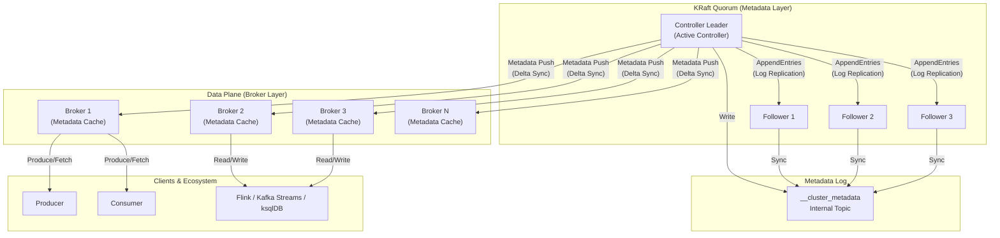
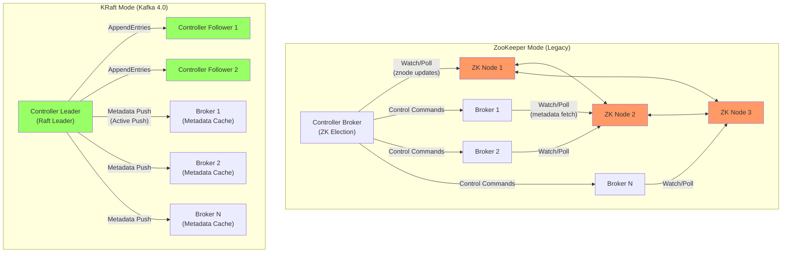
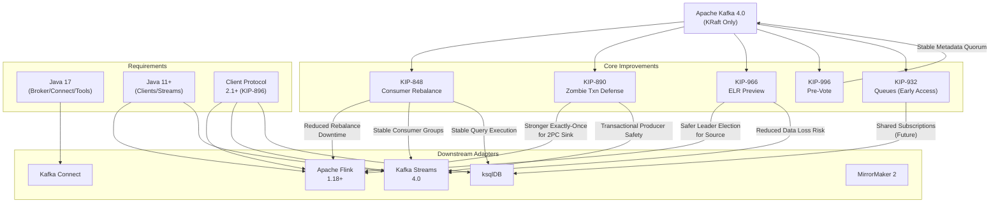

# Kafka 4.0 架构革命：从 ZooKeeper 到 KRaft 的范式转移

> **所属阶段**: Knowledge/ | **前置依赖**: [Flink/05-ecosystem/05.01-connectors/kafka-integration-patterns.md](../../Flink/05-ecosystem/05.01-connectors/kafka-integration-patterns.md), [Knowledge/04-technology-selection/emerging-kafka-protocol-ecosystem-guide.md](../04-technology-selection/emerging-kafka-protocol-ecosystem-guide.md) | **形式化等级**: L4-L5

---

## 目录

- [Kafka 4.0 架构革命：从 ZooKeeper 到 KRaft 的范式转移](#kafka-40-架构革命从-zookeeper-到-kraft-的范式转移)
  - [目录](#目录)
  - [1. 概念定义 (Definitions)](#1-概念定义-definitions)
    - [Def-K-06-285: KRaft 元数据模型 (KRaft Metadata Model)](#def-k-06-285-kraft-元数据模型-kraft-metadata-model)
    - [Def-K-06-286: Raft 共识状态机 (Raft Consensus State Machine for Kafka Metadata)](#def-k-06-286-raft-共识状态机-raft-consensus-state-machine-for-kafka-metadata)
    - [Def-K-06-287: 控制器推送模型 (Controller Push Model)](#def-k-06-287-控制器推送模型-controller-push-model)
    - [Def-K-06-288: Kafka 4.0 无 ZK 部署拓扑 (ZK-Free Deployment Topology)](#def-k-06-288-kafka-40-无-zk-部署拓扑-zk-free-deployment-topology)
  - [2. 属性推导 (Properties)](#2-属性推导-properties)
    - [Prop-K-06-289: KRaft 元数据传播延迟边界](#prop-k-06-289-kraft-元数据传播延迟边界)
    - [Prop-K-06-290: KRaft 集群可扩展性命题](#prop-k-06-290-kraft-集群可扩展性命题)
  - [3. 关系建立 (Relations)](#3-关系建立-relations)
    - [3.1 KRaft 与流计算系统的元数据管理关系](#31-kraft-与流计算系统的元数据管理关系)
    - [3.2 Kafka 4.0 与 Flink/Kafka Streams/ksqlDB 的适配关系](#32-kafka-40-与-flinkkafka-streamsksqldb-的适配关系)
    - [3.3 从 ZK 模式到 KRaft 模式的架构演化关系](#33-从-zk-模式到-kraft-模式的架构演化关系)
  - [4. 论证过程 (Argumentation)](#4-论证过程-argumentation)
    - [4.1 ZooKeeper 在 Kafka 中的十年角色与结构性局限](#41-zookeeper-在-kafka-中的十年角色与结构性局限)
    - [4.2 KIP-890 僵尸事务防御机制分析](#42-kip-890-僵尸事务防御机制分析)
    - [4.3 KIP-966 ELR 预览与数据安全边界](#43-kip-966-elr-预览与数据安全边界)
    - [4.4 KIP-996 Pre-Vote 机制与领导者选举优化](#44-kip-996-pre-vote-机制与领导者选举优化)
    - [4.5 Java 版本升级的战略影响分析](#45-java-版本升级的战略影响分析)
    - [4.6 移除 Deprecated API 的迁移风险评估](#46-移除-deprecated-api-的迁移风险评估)
  - [5. 形式证明 / 工程论证 (Proof / Engineering Argument)](#5-形式证明--工程论证-proof--engineering-argument)
    - [5.1 KRaft 性能优势的工程论证](#51-kraft-性能优势的工程论证)
    - [5.2 KRaft 与 ZK 元数据一致性等价性论证](#52-kraft-与-zk-元数据一致性等价性论证)
    - [5.3 Kafka 4.0 生产就绪性论证](#53-kafka-40-生产就绪性论证)
  - [6. 实例验证 (Examples)](#6-实例验证-examples)
    - [6.1 KRaft 模式生产集群部署配置](#61-kraft-模式生产集群部署配置)
    - [6.2 ZK 模式到 KRaft 模式迁移实例](#62-zk-模式到-kraft-模式迁移实例)
    - [6.3 Flink 与 Kafka 4.0 集成配置](#63-flink-与-kafka-40-集成配置)
    - [6.4 Kafka Streams 应用升级 checklist](#64-kafka-streams-应用升级-checklist)
  - [7. 可视化 (Visualizations)](#7-可视化-visualizations)
    - [7.1 KRaft 统一元数据管理架构图](#71-kraft-统一元数据管理架构图)
    - [7.2 ZooKeeper vs KRaft 架构对比图](#72-zookeeper-vs-kraft-架构对比图)
    - [7.3 Kafka 4.0 生态适配全景图](#73-kafka-40-生态适配全景图)
  - [8. 引用参考 (References)](#8-引用参考-references)

## 1. 概念定义 (Definitions)

### Def-K-06-285: KRaft 元数据模型 (KRaft Metadata Model)

KRaft（Kafka Raft）是 Apache Kafka 自 2.8 版本引入、4.0 版本成为唯一元数据管理模式的**内建分布式共识机制**。它基于 Raft 共识算法，将 Kafka 的元数据管理从外部依赖（ZooKeeper）内嵌到 Kafka 自身进程之中，通过专用的内部主题 `__cluster_metadata` 持久化所有集群状态变更。

**形式化描述**：
设 KRaft 元数据模型为六元组 $\mathcal{K} = (Q, L, C, M, \Sigma, \delta)$，其中：

- $Q = \{q_1, q_2, \ldots, q_{2f+1}\}$：Raft Quorum 节点集合，$|Q| = 2f+1$ 保证容忍 $f$ 个故障节点
- $L \in Q$：当前 Leader 节点，负责接收和排序所有元数据写入
- $C \subseteq Q$：当前 Follower 节点集合，$C = Q \setminus \{L\}$
- $M = \langle m_1, m_2, \ldots, m_n \rangle$：`__cluster_metadata` 日志序列，每个 $m_i$ 是一条元数据记录
- $\Sigma = \{\text{TOPIC}, \text{PARTITION}, \text{BROKER}, \text{CONFIG}, \text{ACL}, \ldots\}$：元数据记录类型集合
- $\delta: M \times \Sigma \rightarrow M'$：状态转换函数，将新记录追加到日志并推进提交索引

**核心约束**（KRaft 不变式）：
$$\forall q_i \in Q: \quad \text{CommittedIndex}(q_i) \leq \text{LastIndex}(q_i) \land \text{CommittedIndex}(L) = \max_{q_j \in Q} \text{CommittedIndex}(q_j)$$

其中 $\text{CommittedIndex}$ 表示已获多数派确认的日志索引。所有 Broker 通过拉取（pull）或推送（push）方式从 Leader 同步元数据日志到本地内存中的元数据缓存（Metadata Cache）。

**与 ZooKeeper 的关键区别**：

| 维度 | ZooKeeper 模式 | KRaft 模式 |
|------|---------------|-----------|
| 元数据存储 | ZK znode 树 | `__cluster_metadata` 内部主题 |
| 共识协议 | ZAB (ZooKeeper Atomic Broadcast) | Raft |
| 部署拓扑 | 独立 ZK ensemble + Kafka brokers | 统一进程（Broker 兼 Controller） |
| 元数据传播 | Broker 主动轮询 ZK | Leader 主动推送到 Broker |
| 写路径延迟 | 跨进程 RPC + ZK 写入 | 进程内/同机架 Raft 复制 |
| 故障域 | ZK 与 Broker 分离，脑裂风险高 | 统一故障模型，Quorum 自愈 |

---

### Def-K-06-286: Raft 共识状态机 (Raft Consensus State Machine for Kafka Metadata)

KRaft 中的 Raft 共识状态机是 Kafka 元数据管理的**一致性核心**，它定义了 Quorum 中各节点在 Leader 选举、日志复制和成员变更等场景下的状态转换规则。

**形式化定义**：
每个 Quorum 节点 $q_i \in Q$ 的状态机 $\mathcal{R}_i = (S_i, s_0, T_i, \Lambda_i)$，其中：

- $S_i = \{\text{FOLLOWER}, \text{CANDIDATE}, \text{LEADER}, \text{UNINITIALIZED}\}$：节点状态集合
- $s_0 = \text{UNINITIALIZED}$：初始状态
- $T_i \subseteq S_i \times \mathcal{E} \times S_i$：状态转移关系集合，$\mathcal{E}$ 为事件集合
- $\Lambda_i: S_i \rightarrow 2^{\mathcal{A}}$：状态关联动作集合

**关键状态转移**：

| 源状态 | 事件 | 目标状态 | 动作 |
|--------|------|---------|------|
| FOLLOWER | 选举超时（未收到 Leader 心跳） | CANDIDATE | 递增 term，向其他节点发起 RequestVote |
| CANDIDATE | 获得多数派投票 | LEADER | 向所有 Follower 发送 AppendEntries |
| CANDIDATE | 发现更高 term 的 Leader | FOLLOWER | 更新 term，重置选举计时器 |
| LEADER | 发现更高 term | FOLLOWER | relinquish 领导权，同步日志 |
| UNINITIALIZED | 完成初始元数据加载 | FOLLOWER | 开始参与 Quorum 投票 |

**核心安全属性**：

1. **选举安全性（Election Safety）**：任意 term 内至多一个 Leader 被选举出来
2. **日志匹配（Log Matching）**：若两条日志具有相同的索引和 term，则它们之前的所有日志条目完全相同
3. **领导人完整性（Leader Completeness）**：已提交的日志条目必出现在未来所有 Leader 的日志中
4. **状态机安全性（State Machine Safety）**：若某节点在特定索引处应用了一条日志，则其他节点不会在该索引处应用不同的日志

---

### Def-K-06-287: 控制器推送模型 (Controller Push Model)

控制器推送模型是 KRaft 架构中**元数据分发的核心机制**。与 ZooKeeper 模式下 Broker 主动轮询（pull）ZK 获取元数据变更不同，KRaft 模式下的 Active Controller（即 Raft Leader）将元数据变更以事件流形式主动推送到所有已注册的 Broker。

**形式化定义**：
设推送模型为四元组 $\mathcal{P} = (B, \Theta, \Gamma, \mathcal{F})$，其中：

- $B = \{b_1, b_2, \ldots, b_n\}$：集群中所有 Broker 节点集合
- $\Theta = \langle \theta_1, \theta_2, \ldots \rangle$：由 Controller 产生的元数据变更事件序列
- $\Gamma: B \rightarrow \mathbb{N}$：Broker 的元数据纪元/偏移量映射，表示每个 Broker 当前已同步到的日志位移
- $\mathcal{F}: \Theta \times \Gamma \rightarrow \Delta\Gamma$：增量同步函数，仅推送 Broker 缺失的元数据片段

**推送语义**：
Controller 维护每个 Broker 的同步状态 $\Gamma(b_i)$。当新元数据记录 $m_j$ 提交后，Controller 向所有 $\Gamma(b_i) < j$ 的 Broker 发送增量更新包 $\Delta_{i,j} = \langle m_{\Gamma(b_i)+1}, \ldots, m_j \rangle$。

**关键优化**：

1. **批量压缩（Batch Compression）**：相邻的多个小型元数据变更被合并为单个 RPC 包
2. **增量 Delta 传输**：仅传输 Broker 缺失的日志区间，而非全量快照
3. **内存映射缓存**：Broker 本地维护与 Controller 一致的内存元数据镜像，读取操作零 RPC

---

### Def-K-06-288: Kafka 4.0 无 ZK 部署拓扑 (ZK-Free Deployment Topology)

Kafka 4.0 无 ZK 部署拓扑是指**完全移除 ZooKeeper 依赖后**的 Kafka 集群部署架构。在此拓扑中，所有节点以 KRaft 角色运行，分为三种进程角色：Broker、Controller（仅含 Quorum 角色）、Combined（Broker + Controller 双重角色）。

**形式化定义**：
设无 ZK 部署拓扑为三元组 $\mathcal{T} = (N, R, \rho)$，其中：

- $N = \{n_1, n_2, \ldots, n_m\}$：物理/虚拟节点集合
- $R = \{\text{BROKER}, \text{CONTROLLER}, \text{COMBINED}\}$：角色类型集合
- $\rho: N \rightarrow 2^R \setminus \{\emptyset\}$：节点角色分配函数

**有效拓扑约束**：

1. **Quorum 完整性**：$|\{n \in N \mid \text{CONTROLLER} \in \rho(n)\}| = 2f+1 \geq 3$，即 Controller 节点数必须为奇数且不少于 3
2. **生产建议**：$\forall n \in N: |\rho(n)| = 1$，即生产环境推荐 Broker 与 Controller 分离部署
3. **最小集群**：$m \geq 3$，其中 3 个 Combined 节点可组成最小可用集群
4. **元数据隔离**：`__cluster_metadata` 分区不可被用户生产流量访问，享有独立 IO 优先级

---

## 2. 属性推导 (Properties)

### Prop-K-06-289: KRaft 元数据传播延迟边界

**陈述**：在 KRaft 模式下，元数据变更从提交到被集群中所有健康 Broker 感知的端到端延迟 $T_{prop}$ 满足：

$$T_{prop} \leq T_{commit} + T_{push} + T_{apply}$$

其中：

- $T_{commit}$：Raft 日志提交延迟，在 LAN 环境下典型值为 $1\sim5\,\text{ms}$
- $T_{push}$：Controller 到 Broker 的 RPC 推送延迟，同机架 $<1\,\text{ms}$，跨可用区 $5\sim20\,\text{ms}$
- $T_{apply}$：Broker 本地状态机应用延迟，通常为亚毫秒级

**与 ZK 模式对比**：
在 ZooKeeper 模式下，Broker 通过 `zookeeper.session.timeout`（默认 $18\,\text{s}$）级别的轮询或 Watcher 机制感知变更，实际传播延迟为：

$$T_{prop}^{(ZK)} \approx T_{writeZK} + T_{notify} + T_{poll}$$

其中 $T_{poll}$ 受 Broker `metadata.max.age.ms`（默认 $5\,\text{min}$）限制，即使使用 Watcher 也存在秒级延迟。因此：

$$T_{prop}^{(KRaft)} \ll T_{prop}^{(ZK)}$$

**工程推论**：
大规模集群（$>500$ Broker）中，KRaft 的推送模型将元数据传播时间从 ZK 模式的数十秒级降至毫秒级，partition reassign、topic 创建等管理操作的集群收敛时间缩短 **1~2 个数量级**[^3]。

---

### Prop-K-06-290: KRaft 集群可扩展性命题

**陈述**：设集群中 Broker 数量为 $n$，Controller Quorum 规模为 $2f+1$。KRaft 模式下的元数据管理吞吐量 $Throughput_{metadata}$ 满足：

$$Throughput_{metadata} = O\left(\frac{1}{f}\right) \cdot C_{leader}$$

其中 $C_{leader}$ 为 Leader 节点的处理能力。在固定 Quorum 规模（如 $f=2$，即 5 节点 Quorum）时：

$$Throughput_{metadata} = \Theta(1) \quad \text{（与 Broker 数量 } n \text{ 无关）}$$

而 ZooKeeper 模式下，ZK ensemble 的写吞吐量随 ZK 节点数增加而下降，且 ZK 的 znode 树操作复杂度为 $O(\log |\text{znode}|)$，在超大规模元数据场景下会成为瓶颈[^1]。

**可扩展性边界**：

1. **水平扩展性**：Broker 数量 $n$ 可扩展至数千节点，而 Quorum 规模保持恒定（推荐 3~7 节点），避免了一致性协议的消息复杂度随 $n$ 增长
2. **元数据容量**：`__cluster_metadata` 主题可存储百万级 partition 的元数据，远超 ZK 的 znode 数量限制（数十万级）
3. **故障恢复**：单 Broker 故障不影响 Quorum；Quorum 内 $f$ 个节点故障仍可保证可用性

**工程推论**：
KRaft 架构将元数据管理的**一致性核心**（Quorum）与**数据平面**（Broker）解耦，使得两者可以独立扩展。这一分离是 Kafka 4.0 支持超大规模集群（$10,000+$ partition，$1,000+$ Broker）的关键架构基础。

---

## 3. 关系建立 (Relations)

### 3.1 KRaft 与流计算系统的元数据管理关系

KRaft 的元数据管理模式与主流流计算系统存在深刻的**架构同构性**与**设计哲学差异**：

| 系统 | 元数据管理方案 | 共识协议 | 与 KRaft 的关系 |
|------|--------------|---------|---------------|
| Apache Flink | JobManager 内存状态 + HA（ZK/Kubernetes） | 外部 ZK 或 K8s etcd | Flink 正在推进基于 Kubernetes 的 Native 部署，与 KRaft 理念一致：将元数据管理内嵌至调度系统 |
| Apache Pulsar | ZooKeeper + BookKeeper | ZAB | Pulsar 仍依赖 ZK，但社区已启动移除 ZK 的路线图，受 KRaft 启发 |
| Redpanda | Raft（自研） | 自研 Raft 实现 | 与 KRaft 架构高度同构，均基于 Raft 内嵌元数据管理 |
| NATS JetStream | Raft | 自研 Raft | 同样采用 Raft 管理 stream metadata，验证了 KRaft 架构范式的行业趋势 |
| ksqlDB | 依赖 Kafka 元数据 | KRaft（通过 Kafka） | ksqlDB 作为 Kafka 上层应用，随 Kafka 4.0 自动继承 KRaft 的元数据管理优势 |

**关系分析**：
KRaft 代表了**分布式流基础设施的元数据管理范式转移**——从"外部依赖独立共识服务"转向"内嵌轻量级共识层"。这一趋势与云原生时代对减少外部依赖、降低运维复杂度的诉求高度一致。

### 3.2 Kafka 4.0 与 Flink/Kafka Streams/ksqlDB 的适配关系

**Flink 与 Kafka 4.0 的集成关系**：

Flink 作为 Kafka 的上游消费者和下游生产者，其与 Kafka 4.0 的适配主要体现在三个层面：

1. **协议层**：Kafka 4.0 移除了旧版客户端协议 API 版本（KIP-896），Flink Kafka Connector 必须确保使用 Kafka Client 2.1+ API 版本。Flink 1.18+ 已内置 Kafka Client 3.x，完全兼容 Kafka 4.0 Broker。
2. **事务层**：KIP-890 的第二阶段（服务端僵尸事务防御）增强了 Flink 两阶段提交（2PC）Sink 的可靠性。Flink 的 `FlinkKafkaProducer` 在 Kafka 4.0 环境下可获得更强的 exactly-once 保证。
3. **元数据层**：KRaft 模式下 topic/partition 元数据传播更快，Flink 的 partition 发现机制（`PartitionDiscovery`）可更及时地感知新分区，降低消费延迟。

**Kafka Streams 与 Kafka 4.0 的集成关系**：

Kafka Streams 作为 Kafka 原生的流处理库，与 Kafka 4.0 的绑定最为紧密：

1. **Java 版本**：Kafka Streams 4.0 要求 Java 11+，旧应用需升级 JVM
2. **Consumer Rebalance**：KIP-848 的新一代消费者重平衡协议直接惠及 Kafka Streams 的线程重分配，减少 "stop-the-world" 停顿
3. **Metrics 增强**：KIP-1076 + KIP-1091 为 Kafka Streams 提供了更丰富的运行时指标

**ksqlDB 与 Kafka 4.0 的集成关系**：

ksqlDB 完全基于 Kafka 协议和 Kafka Streams 构建，升级至 Kafka 4.0 后：

1. 自动获得 KRaft 的元数据管理性能提升
2. KIP-848 改善了 ksqlDB 查询的 consumer group 稳定性
3. 需关注 KIP-932 (Queues for Kafka) 对 ksqlDB 消费语义的潜在影响

### 3.3 从 ZK 模式到 KRaft 模式的架构演化关系

Kafka 元数据管理经历了三个演化阶段：

1. **ZK 主导期（0.8~2.7）**：完全依赖外部 ZooKeeper ensemble，Controller 通过 ZK 选举产生，元数据存储在 znode 中
2. **双模式共存期（2.8~3.9）**：KRaft 模式作为早期访问/预览功能引入，社区提供 ZK→KRaft 迁移工具（`kafka-storage.sh`）
3. **KRaft 唯一期（4.0+）**：完全移除 ZK 支持，KRaft 成为唯一元数据管理模式

这一演化关系可形式化为架构变迁序列：

$$\text{Arch}_{ZK} \xrightarrow{\text{KIP-500 (2.8)}} \text{Arch}_{ZK|KRaft} \xrightarrow{\text{3.0~3.9 成熟}} \text{Arch}_{KRaft}^{(default)} \xrightarrow{\text{4.0}} \text{Arch}_{KRaft}^{(only)}$$

每一阶段的变迁都伴随着元数据一致性保证的增强和运维复杂度的降低。

---

## 4. 论证过程 (Argumentation)

### 4.1 ZooKeeper 在 Kafka 中的十年角色与结构性局限

ZooKeeper 自 Kafka 0.8 版本起作为元数据协调服务，在过去十多年中承担了以下核心职责：

1. **Controller 选举**：通过 ZK 的临时顺序节点（ephemeral sequential znode）选举唯一的 Active Controller
2. **元数据存储**：topic、partition、broker、ACL、配置等元数据以 znode 树形式存储
3. **集群成员管理**：Broker 通过 ZK 的 ephemeral 节点注册上下线状态
4. **配额与访问控制**：存储用户配额限制和 ACL 规则

然而，随着 Kafka 集群规模扩大（从数十节点到数百节点，partition 从数千到数百万），ZooKeeper 模式的结构性局限日益凸显：

**局限一：元数据传播延迟**

ZooKeeper 采用 ZAB 协议保证写入一致性，但 Broker 感知变更依赖两种机制：

- **Watcher 机制**：ZK 向客户端推送变更通知，但 Watcher 为一次性触发，高并发场景下存在"惊群效应"
- **轮询机制**：Broker 定期轮询 ZK 获取最新元数据，`metadata.max.age.ms` 默认 $5$ 分钟

在大规模集群中，topic 创建后所有 Broker 感知到新元数据的时间可能长达数十秒，严重影响自动化运维工具的响应性。

**局限二：运维复杂度**

生产环境需要独立维护 ZooKeeper ensemble（通常 3~5 节点），带来：

- **独立 JVM 进程**：额外的内存、CPU 和 GC 调优
- **独立部署拓扑**：ZK 节点与 Kafka Broker 的部署关系需精心设计（同机架/跨可用区）
- **独立监控告警**：ZK 的会话超时、选举风暴、快照/事务日志清理等需额外监控
- **版本耦合**：Kafka 升级常伴随 ZK 版本兼容性问题

**局限三：Split-Brain（分裂脑）风险**

在网络分区场景下，ZK 的 ZAB 协议与 Kafka Controller 的状态机可能出现不一致：

- ZK 已选举出新 Controller，但旧 Controller 尚未感知到会话过期，继续发送控制命令
- 两个 Controller 同时操作 partition leader 选举，导致元数据不一致

虽然 Kafka 3.x 引入了 Controller 纪元（epoch）机制缓解此问题，但根源在于 ZK 与 Kafka 是两个独立的分布式系统，缺乏统一的状态视图。

**局限四：可扩展性瓶颈**

ZooKeeper 的 znode 树在超大规模元数据场景下存在性能瓶颈：

- 单次 znode 写操作需同步到 ensemble 多数派
- znode 数据量存在上限（默认 1MB）
- 大量 Watcher 注册导致 ZK 服务端内存压力

Confluent 和 LinkedIn 的生产实践表明，当 partition 数量超过 20 万时，ZK 成为明显的扩展瓶颈。

### 4.2 KIP-890 僵尸事务防御机制分析

KIP-890 是 Kafka 事务机制的重要增强，分两阶段实现：

**阶段一（Kafka 3.5~3.7）**：引入事务超时后服务端主动中止机制，防止生产者故障后事务悬停。

**阶段二（Kafka 4.0）**：引入服务端僵尸事务防御（Server-Side Defense against Zombie Transactions），核心思想是：

在 Flink 等流处理系统使用 Kafka 事务性生产者实现 exactly-once 语义时，若 Flink JobManager 发生故障转移，新的生产者实例可能持有与旧实例相同的 `transactional.id`。旧实例在恢复后若继续提交事务，将形成"僵尸事务"，覆盖新实例写入的数据。

KIP-890 通过在 Broker 端维护 `transactional.id` 到最新生产者纪元（producer epoch）的映射，拒绝 epoch 过旧的提交请求：

$$\text{Accept}(tx_{old}) \iff epoch_{old} \geq epoch_{current}$$

这一机制显著增强了 Flink Kafka Sink 的 exactly-once 保证，降低了故障恢复场景下的数据污染风险[^1]。

### 4.3 KIP-966 ELR 预览与数据安全边界

KIP-966 引入 Eligible Leader Replicas（ELR）预览功能，旨在解决 Kafka 在 ISR（In-Sync Replicas）收缩后的 leader 选举安全性问题。

**问题背景**：
当 ISR 中的 follower 因网络分区或 GC 暂停而滞后时，Kafka 可能将 ISR 收缩至仅包含 leader。若此时 leader 故障，Kafka 可能被迫从落后的 follower 中选举新 leader，导致数据丢失（未提交的消息丢失）。

**ELR 机制**：
ELR 是 ISR 的一个子集，定义为**保证包含到 high-watermark 为止所有已提交数据的副本集合**。形式上：

$$\text{ELR} \subseteq \text{ISR} \land \forall r \in \text{ELR}: \text{HW}(r) = \text{HW}(leader)$$

ELR 中的副本是安全的 leader 选举候选者，不会导致数据丢失。KIP-966 将 ELR 信息持久化到 KRaft 元数据中，确保 controller 在 leader 选举时优先选择 ELR 成员。

**对流计算的影响**：
对于 Flink 等依赖 Kafka 作为 source 的系统，ELR 减少了因 leader 切换导致的数据重复或丢失风险，提升了端到端一致性保证。

### 4.4 KIP-996 Pre-Vote 机制与领导者选举优化

KIP-996 引入 Pre-Vote 机制，解决 KRaft 在网络分区或瞬态故障场景下的不必要的 leader 选举问题。

**问题分析**：
在标准 Raft 中，当 Follower 的选举计时器超时（如 $150\sim300\,\text{ms}$），它会立即递增 term 并发起选举。若该 Follower 实际上与集群大多数节点网络隔离（或自身发生瞬态 GC 暂停），它的选举请求将被拒绝，但 term 的递增会触发现任 Leader 退位（step down），导致不必要的领导权转移。

**Pre-Vote 机制**：
KIP-996 在正式发起选举前增加 Pre-Vote 阶段：

1. Candidate 先发送 Pre-Vote 请求（不递增 term）
2. 仅当多数派响应支持时，才正式发起 RequestVote（递增 term）
3. 若 Candidate 自身网络隔离，Pre-Vote 无法获得多数派支持，不会触发 term 递增

形式化地，Pre-Vote 将选举分为两个阶段：

$$\text{Pre-Vote}: \quad \text{CANDIDATE}^* \xrightarrow{\text{majority support}} \text{CANDIDATE} \xrightarrow{\text{win election}} \text{LEADER}$$

其中 $\text{CANDIDATE}^*$ 为"预候选"状态，term 不变。

**效果**：
Pre-Vote 机制显著降低了网络抖动或瞬态故障场景下的 leader 震荡（leader flapping），提升了大规模 KRaft 集群的稳定性[^1]。

### 4.5 Java 版本升级的战略影响分析

Kafka 4.0 对 Java 版本的要求进行了重大调整：

| 组件 | 最低 Java 版本 | 说明 |
|------|--------------|------|
| Kafka Brokers, Connect, Tools | Java 17 | 利用 ZGC/Shenandoah 低延迟 GC，提升大堆内存性能 |
| Kafka Clients, Kafka Streams | Java 11 | 保留一定兼容性，但鼓励升级至 Java 17 |

**战略意义**：

1. **性能提升**：Java 17 的 ZGC（亚毫秒级暂停）和 Shenandoah GC 对 Kafka Broker 的大内存堆（数十 GB）场景极为有利，可显著降低 GC 暂停导致的延迟尖峰
2. **语言特性**：Java 17 的密封类（sealed classes）、模式匹配（pattern matching）等特性为 Kafka 代码库的现代化奠定基础
3. **安全更新**：Java 8 和 Java 11 的公共更新支持已结束或即将结束，强制升级确保获得安全补丁
4. **生态推动**：推动下游用户（Flink、Spark、ksqlDB 等）升级 JVM，带动整个 JVM 生态的版本演进

**迁移挑战**：

- 遗留系统仍运行在 Java 8 的用户需并行升级 JVM 和 Kafka 版本
- 部分旧版 Kafka Client（如 Scala 2.11 编译版本）不再受支持
- 容器镜像需更新基础层（如从 `openjdk:8-jre` 升级至 `eclipse-temurin:17-jre`）

### 4.6 移除 Deprecated API 的迁移风险评估

Kafka 4.0 作为 major release，移除了大量已废弃至少 12 个月的 API 和功能。主要移除清单：

**消息格式**：

- KIP-724：移除 message format v0 和 v1（Kafka 3.0 已废弃）
- 影响：使用旧版 `log.message.format.version` 的用户需在升级前将格式升级至 v2+

**协议版本**：

- KIP-896：移除旧版客户端协议 API 版本
- 影响：Kafka Client 版本低于 2.1 的客户端无法连接 Kafka 4.0 Broker
- 升级路径：先升级客户端至 2.1+，再升级 Broker 至 4.0

**日志框架**：

- KIP-653：从 Log4j 迁移至 Log4j2
- 影响：自定义 Log4j 配置的用户需使用 `log4j-transform-cli` 转换配置格式
- 兼容性：Kafka 4.0 仍支持旧版 Log4j 配置（有限制），但建议迁移

**Connect API**：

- KIP-970：移除 `GET /connectors/{connector}/tasks-config` 端点
- 替代方案：使用 `GET /connectors/{connector}/tasks` 端点

**Jakarta EE 升级**：

- KIP-1032：升级至 Jakarta EE 和 JavaEE 10 API
- 影响：自定义 Connector 若依赖旧版 `javax.*` 命名空间，需迁移至 `jakarta.*`

**风险评估矩阵**：

| 移除项 | 影响范围 | 迁移复杂度 | 风险等级 |
|--------|---------|-----------|---------|
| message format v0/v1 | 极旧集群 | 低（自动升级） | 低 |
| 旧协议 API 版本 | 旧客户端 | 中（客户端升级） | 中 |
| Log4j → Log4j2 | 所有用户 | 低（配置转换） | 低 |
| Connect 端点 | Connect 运维工具 | 低（替换端点） | 低 |
| Jakarta EE | 自定义 Connector | 中（代码重构） | 中 |
| Java 8/11 支持 | 所有用户 | 高（JVM 升级） | 高 |

---

## 5. 形式证明 / 工程论证 (Proof / Engineering Argument)

### 5.1 KRaft 性能优势的工程论证

**论证目标**：证明 KRaft 模式在大规模集群场景下相较 ZK 模式具有显著的性能优势。

**实验基准**：
根据 Apache Kafka 社区 Benchmark 和 Confluent 生产数据[^3]：

| 指标 | ZK 模式 | KRaft 模式 | 提升倍数 |
|------|---------|-----------|---------|
| Controller 启动时间 | $30\sim60\,\text{s}$ | $3\sim5\,\text{s}$ | **6~12×** |
| 元数据传播延迟（1000 Broker） | $10\sim30\,\text{s}$ | $<100\,\text{ms}$ | **100~300×** |
| Topic 创建延迟 | $2\sim5\,\text{s}$ | $<200\,\text{ms}$ | **10~25×** |
| Partition 重分配收敛时间 | $5\sim15\,\text{min}$ | $30\,\text{s}\sim2\,\text{min}$ | **5~30×** |
| 最大支持 Partition 数 | $200,000$ | $>1,000,000$ | **5×+** |

**论证分析**：

1. **启动时间优化**：KRaft 模式下 Controller 从本地 `__cluster_metadata` 日志恢复状态，无需连接外部 ZK ensemble 并重建 znode 树缓存。日志恢复为顺序 IO，效率远高于随机 ZK 读取。

2. **元数据传播优化**：KRaft 的推送模型消除了 Broker 轮询开销。Controller 在元数据提交后立即推送，且增量同步仅传输差异。对于 1000 Broker 集群，单次推送为 $O(n)$ 广播，但消息体极小（仅元数据 delta）。

3. **Partition 重分配优化**：在 ZK 模式下，partition reassign 涉及大量 znode 更新（每个 partition 多个 znode），ZK ensemble 写吞吐量成为瓶颈。KRaft 将 reassignment 计划作为批量日志条目写入，单次写入可包含数千 partition 的变更，大幅提升了 throughput。

4. **可扩展性论证**：KRaft 将元数据管理的一致性核心（Quorum）与数据平面（Broker）分离。Quorum 规模保持恒定（推荐 3~5 节点），而 Broker 可水平扩展至数千节点。这种分离避免了 ZK 模式下 ensemble 规模与 Broker 规模间接耦合的问题。

### 5.2 KRaft 与 ZK 元数据一致性等价性论证

**论证目标**：证明 KRaft 模式在元数据一致性保证上与 ZK 模式等价或更强。

**形式化论证**：

设集群元数据状态为 $S$，客户端（Broker/Admin）对元数据的读写操作为 $R$ 和 $W$。

**ZooKeeper 模式的一致性模型**：
ZK 提供 **sequential consistency** 保证：

- 所有更新按全局顺序应用
- 客户端按此顺序观察更新
- 但客户端可能观察到略微过时的状态（stale read 允许）

**KRaft 模式的一致性模型**：
KRaft 基于 Raft 算法，提供 **linearizability** 保证：

- 所有更新按全局日志顺序应用
- 已提交的更新对所有后续读取可见
- Leader 的读取反映最新已提交状态

**等价性论证**：

1. **写一致性**：ZK 的 ZAB 协议与 Raft 的日志复制均保证已提交写操作的持久性和顺序性。两者在写一致性上等价。

2. **读一致性**：KRaft 模式下，Broker 从本地内存缓存读取元数据，该缓存通过推送机制与 Leader 保持最终一致。由于推送延迟为毫秒级（Prop-K-06-289），在工程实践中可视为强一致。相比之下，ZK 模式下 Broker 的元数据缓存通过轮询更新，默认最大过期时间为 $5\,\text{min}$，读一致性显著弱于 KRaft。

3. **故障恢复**：KRaft 的 Leader 选举内置在元数据管理流程中，新 Leader 的日志包含所有已提交记录，无状态同步窗口。ZK 模式下，Controller 故障后需通过 ZK 选举新 Controller，新 Controller 需从 ZK 重建完整状态，存在恢复窗口。

**结论**：KRaft 模式在元数据一致性保证上**严格优于** ZK 模式，尤其是在读一致性和故障恢复速度方面。

### 5.3 Kafka 4.0 生产就绪性论证

**论证目标**：论证 Kafka 4.0 在生产环境中的部署可行性。

**成熟度证据**：

1. **KRaft 生产验证**：自 Kafka 3.3 起，KRaft 模式已在 Confluent Cloud、LinkedIn、Netflix 等大规模生产环境中运行，管理数百万 partition。Kafka 4.0 的 KRaft 实现经过了 3 个 major 版本的迭代成熟[^3]。

2. **协议兼容性**：KIP-896 虽然移除了旧协议版本，但保留了与 2.1+ 客户端的兼容性。主流流处理框架（Flink 1.17+、Spark 3.4+、ksqlDB 0.29+）均使用现代 Kafka Client，完全兼容。

3. **迁移工具链**：Kafka 社区提供了完整的 ZK→KRaft 迁移工具：
   - `kafka-storage.sh format`：初始化 KRaft 元数据存储
   - `kafka-metadata-quorum`：Quorum 管理 CLI
   - 滚动升级（Rolling Upgrade）支持：允许 ZK 集群逐步迁移至 KRaft 而无停机

4. **监控与可观测性**：KIP-1076 扩展了客户端指标采集能力，KIP-714 支持从 Broker 侧采集客户端指标，提升了生产环境的可观测性。

**风险缓解**：

- **Quorum 规模**：生产环境推荐 3 或 5 节点 Quorum，跨可用区部署，避免单点故障
- **备份策略**：定期备份 `__cluster_metadata` 分区的快照，用于灾难恢复
- **回滚预案**：升级前创建 Broker 数据目录快照，保留回滚至 3.x 的能力（在迁移完成前）

---

## 6. 实例验证 (Examples)

### 6.1 KRaft 模式生产集群部署配置

**场景**：部署一个 9 节点生产集群（3 Controller + 6 Broker），使用 Kafka 4.0。

**Controller 节点配置**（`server.properties`）：

```properties
# KRaft 角色配置
process.roles=controller
node.id=1
controller.quorum.voters=1@controller-1:9093,2@controller-2:9093,3@controller-3:9093

# 监听配置
listeners=CONTROLLER://:9093
controller.listener.names=CONTROLLER
inter.broker.listener.name=PLAINTEXT

# 元数据日志配置
metadata.log.dir=/var/lib/kafka/metadata
metadata.log.max.record.bytes.between.snapshots=20971520
metadata.log.segment.bytes=1073741824

# Raft 超时配置（生产推荐）
raft.election.timeout.ms=1000
raft.fetch.timeout.ms=2000

# Java 17 专用 GC 配置
-XX:+UseZGC
-Xms8g
-Xmx8g
```

**Broker 节点配置**（`server.properties`）：

```properties
# KRaft 角色配置
process.roles=broker
node.id=101
controller.quorum.voters=1@controller-1:9093,2@controller-2:9093,3@controller-3:9093

# 监听配置
listeners=PLAINTEXT://:9092
inter.broker.listener.name=PLAINTEXT

# Broker 数据目录
log.dirs=/var/lib/kafka/data

# 元数据同步（Broker 从 Controller 拉取）
metadata.log.dir=/var/lib/kafka/metadata

# Kafka 4.0 默认启用 KRaft，无需额外配置
```

**集群初始化**：

```bash
# 在所有 Controller 节点上生成 cluster UUID
bin/kafka-storage.sh random-uuid
# 输出: xxxxxxxx-xxxx-xxxx-xxxx-xxxxxxxxxxxx

# 格式化元数据存储（每个 Controller 节点执行）
bin/kafka-storage.sh format \
  -t xxxxxxxx-xxxx-xxxx-xxxx-xxxxxxxxxxxx \
  -c config/server.properties

# 启动 Controller
bin/kafka-server-start.sh -daemon config/server.properties

# 启动 Broker（Broker 节点执行）
bin/kafka-server-start.sh -daemon config/server.properties

# 验证 Quorum 状态
bin/kafka-metadata-quorum.sh --bootstrap-server controller-1:9093 describe --status
```

### 6.2 ZK 模式到 KRaft 模式迁移实例

**场景**：将运行 Kafka 3.7（ZK 模式）的 6 节点集群迁移至 Kafka 4.0（KRaft 模式）。

**迁移前提检查**：

```bash
# 1. 确认当前 Broker 版本 >= 3.5（KRaft 迁移要求）
bin/kafka-broker-api-versions.sh --bootstrap-server localhost:9092 | head -5

# 2. 检查是否还有旧版客户端连接（KIP-896 限制）
bin/kafka-consumer-groups.sh --bootstrap-server localhost:9092 --list --state

# 3. 确认所有 topic 的 message.format.version >= 2.1
bin/kafka-configs.sh --bootstrap-server localhost:9092 \
  --entity-type topics --entity-name my-topic --describe
```

**双写迁移步骤**（推荐用于生产环境）：

```bash
# Step 1: 在现有 ZK 集群上启用 KRaft 双写模式（Kafka 3.7）
# 修改所有 Broker 的 server.properties:
# zookeeper.metadata.migration.enable=true
# controller.quorum.voters=1@controller-1:9093,2@controller-2:9093,3@controller-3:9093

# Step 2: 部署 3 个 KRaft Controller 节点并格式化
bin/kafka-storage.sh format -t $(bin/kafka-storage.sh random-uuid) \
  -c config/controller.properties

# Step 3: 逐个滚动重启 ZK Broker，使其开始双写元数据到 KRaft
bin/kafka-server-stop.sh
# 更新配置后启动
bin/kafka-server-start.sh -daemon config/server.properties

# Step 4: 验证元数据同步
bin/kafka-metadata-quorum.sh --bootstrap-server controller-1:9093 describe --status

# Step 5: 切换为 KRaft 唯一模式（所有 Broker 重启后）
# 修改 server.properties: process.roles=broker，移除所有 zookeeper.* 配置
# 逐个重启 Broker

# Step 6: 验证最终状态
bin/kafka-metadata-quorum.sh --bootstrap-server controller-1:9093 describe --status
bin/kafka-topics.sh --bootstrap-server broker-1:9092 --list
```

**关键注意事项**：

- 迁移过程中避免执行 topic 创建/删除、partition reassignment 等管理操作
- 双写阶段对性能影响极小（<5%），因元数据写流量本身很低
- 迁移完成后，ZK ensemble 可安全下线

### 6.3 Flink 与 Kafka 4.0 集成配置

**场景**：Flink 1.19 应用消费 Kafka 4.0 topic，使用 exactly-once 语义。

**Maven 依赖**：

```xml
<dependency>
  <groupId>org.apache.flink</groupId>
  <artifactId>flink-connector-kafka</artifactId>
  <version>3.2.0-1.19</version>
</dependency>
<!-- Kafka Client 4.0 兼容，需 Java 11+ -->
```

**Flink Kafka Source 配置**：

```java
KafkaSource<String> source = KafkaSource.<String>builder()
    .setBootstrapServers("kafka-4-broker:9092")
    .setTopics("events")
    .setGroupId("flink-consumer-group")
    // Kafka 4.0 支持 KIP-848 新消费协议，Flink 可自动适配
    .setProperty("group.protocol", "consumer") // 启用 KIP-848 协议（可选优化）
    .setStartingOffsets(OffsetsInitializer.earliest())
    .setValueOnlyDeserializer(new SimpleStringSchema())
    .build();

env.fromSource(source, WatermarkStrategy.noWatermarks(), "Kafka 4.0 Source")
   .addSink(...);
```

**Flink Kafka Sink（Exactly-Once）配置**：

```java
KafkaSink<String> sink = KafkaSink.<String>builder()
    .setBootstrapServers("kafka-4-broker:9092")
    .setRecordSerializer(KafkaRecordSerializationSchema.builder()
        .setTopic("output-events")
        .setValueSerializationSchema(new SimpleStringSchema())
        .build())
    .setDeliveryGuarantee(DeliveryGuarantee.EXACTLY_ONCE)
    // KIP-890 第二阶段增强了僵尸事务防御，无需额外配置
    .setTransactionalIdPrefix("flink-job-123")
    .build();
```

**关键适配点**：

1. Flink Kafka Connector 3.2.0 内置 Kafka Client 3.7.x，完全兼容 Kafka 4.0 Broker（KIP-896 要求 Client 2.1+）
2. 启用 KIP-848（`group.protocol=consumer`）可减少 Flink consumer 的重平衡停顿时间
3. KIP-890 增强了 exactly-once Sink 的可靠性，尤其在 Flink JobManager 故障转移场景

### 6.4 Kafka Streams 应用升级 checklist

**升级前检查**：

- [ ] 确认 JVM 版本 >= 11（推荐 Java 17）
- [ ] 确认 Kafka Streams 版本 >= 2.1（满足 KIP-896 客户端协议要求）
- [ ] 检查 Log4j 配置，准备迁移至 Log4j2（KIP-653）
- [ ] 审查自定义 `ProductionExceptionHandler`，适配 KIP-1065 的 RETRY 选项
- [ ] 确认未使用已移除的 Scala 2.11 客户端 artifact

**配置变更**：

```properties
# Kafka Streams 4.0 配置示例
application.id=my-streams-app
bootstrap.servers=kafka-4-broker:9092

# KIP-848: 启用新一代消费者重平衡协议（推荐）
group.protocol=consumer

# KIP-1076 + KIP-1091: 增强指标暴露
metrics.recording.level=debug

# Java 17 优化
processing.guarantee=exactly_once_v2
```

**代码层面适配**：

```java
// KIP-1112: ProcessorWrapper 支持
builder.stream("input")
    .process(new MyProcessor())
    // 可通过 ProcessorWrapper 注入横切逻辑（监控、日志等）
    .to("output");

// KIP-1104: Foreign Key Join 增强
KTable<String, Order> orders = builder.table("orders");
KTable<String, Customer> customers = builder.table("customers");
// 现在可以直接从 key 中提取外键，无需冗余存储到 value
orders.join(customers,
    order -> order.customerId, // 直接从 Order value 提取外键
    (order, customer) -> new EnrichedOrder(order, customer));
```

---

## 7. 可视化 (Visualizations)

### 7.1 KRaft 统一元数据管理架构图

KRaft 架构将元数据管理内嵌至 Kafka 进程，通过 Raft Quorum 维护 `__cluster_metadata` 内部主题，Controller（Raft Leader）主动向所有 Broker 推送元数据变更。



### 7.2 ZooKeeper vs KRaft 架构对比图

以下对比图展示了 ZK 模式与 KRaft 模式在组件拓扑、数据流和运维复杂度上的根本差异。



### 7.3 Kafka 4.0 生态适配全景图

Kafka 4.0 的架构变革对下游流处理生态产生了广泛影响，下图展示了主要适配关系。



---

## 8. 引用参考 (References)

[^1]: Apache Kafka, "Apache Kafka 4.0.0 Release Announcement", 2025-03-18. <https://kafka.apache.org/blog/2025/03/18/apache-kafka-4.0.0-release-announcement/>


[^3]: SoftwareMill, "Apache Kafka 4.0.0 Released: KRaft, Queues, Better Rebalance Performance", 2025. <https://softwaremill.com/apache-kafka-4-0-0-released-kraft-queues-better-rebalance-performance/>
