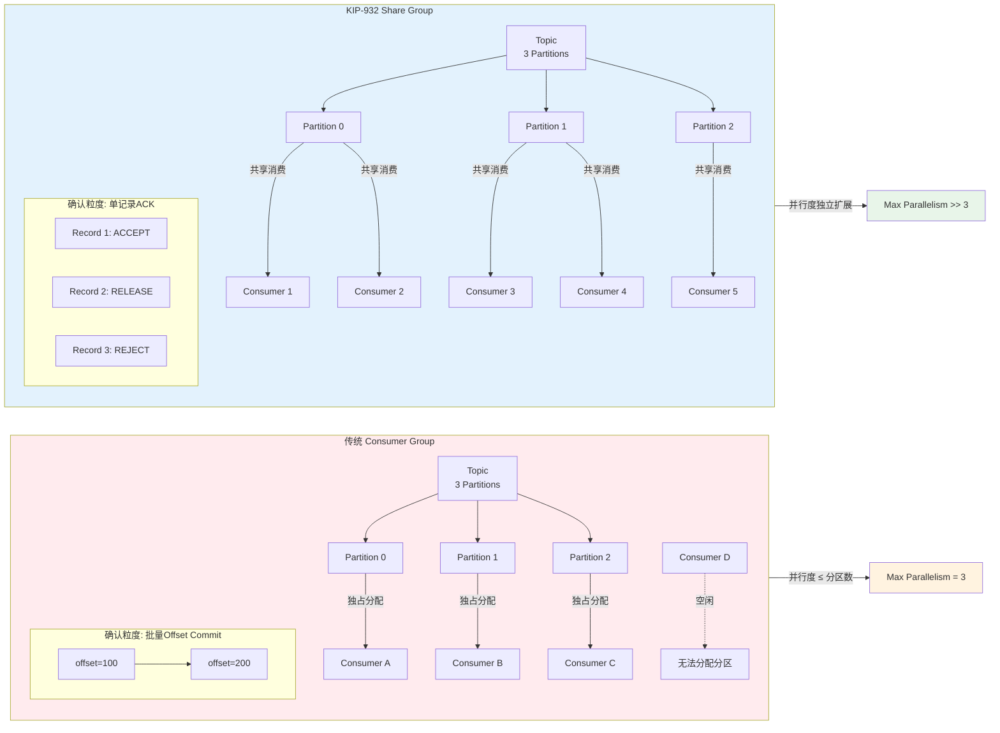

# KIP-932: Kafka队列语义与共享消费组

> 所属阶段: Knowledge/06-frontier | 前置依赖: [Kafka核心概念](../../Knowledge/01-concept-atlas/streaming-messaging-fundamentals.md), [Flink-Kafka集成](../../Flink/05-ecosystem/connectors/kafka-connector-deep-dive.md) | 形式化等级: L3-L4

---

## 目录

- [KIP-932: Kafka队列语义与共享消费组](#kip-932-kafka队列语义与共享消费组)
  - [目录](#目录)
  - [1. 概念定义 (Definitions)](#1-概念定义-definitions)
  - [2. 属性推导 (Properties)](#2-属性推导-properties)
  - [3. 关系建立 (Relations)](#3-关系建立-relations)
    - [3.1 与Kafka Streams的关系](#31-与kafka-streams的关系)
    - [3.2 与ksqlDB的关系](#32-与ksqldb的关系)
    - [3.3 与Apache Flink的关系](#33-与apache-flink的关系)
    - [3.4 与RabbitMQ / Amazon SQS等传统队列的语义映射](#34-与rabbitmq--amazon-sqs等传统队列的语义映射)
  - [4. 论证过程 (Argumentation)](#4-论证过程-argumentation)
    - [4.1 架构设计权衡分析](#41-架构设计权衡分析)
    - [4.2 反例分析：共享组不适用场景](#42-反例分析共享组不适用场景)
    - [4.3 边界讨论：锁超时与消息重复](#43-边界讨论锁超时与消息重复)
  - [5. 形式证明 / 工程论证 (Proof / Engineering Argument)](#5-形式证明--工程论证-proof--engineering-argument)
  - [6. 实例验证 (Examples)](#6-实例验证-examples)
    - [6.1 实例一：任务队列（异步Job分发）](#61-实例一任务队列异步job分发)
    - [6.2 实例二：命令分发（CQRS架构）](#62-实例二命令分发cqrs架构)
    - [6.3 实例三：负载均衡突发流量](#63-实例三负载均衡突发流量)
  - [7. 可视化 (Visualizations)](#7-可视化-visualizations)
    - [图一：共享消费组架构与记录状态流转](#图一共享消费组架构与记录状态流转)
    - [图二：传统Consumer Group vs KIP-932 Share Group 消费模型对比](#图二传统consumer-group-vs-kip-932-share-group-消费模型对比)
  - [8. 引用参考 (References)](#8-引用参考-references)

## 1. 概念定义 (Definitions)

本节建立KIP-932"Queues for Kafka"的核心形式化概念，区分传统发布-订阅模型与新引入的共享队列语义。

**Def-K-06-251 (传统发布-订阅消费模型 — Traditional Publish-Subscribe Consumption Model)**

设 Kafka Topic $T$ 被划分为有限分区集合 $P = \{p_1, p_2, \dots, p_n\}$。一个**消费者组** $G$ 由消费者集合 $C = \{c_1, c_2, \dots, c_m\}$ 组成，其消费行为满足以下约束：

1. **分区独占性** (Partition Exclusivity): 对于任意分区 $p_i \in P$，在任意时刻 $t$，至多存在一个消费者 $c_j \in C$ 被分配至 $p_i$，记为 $\text{assign}(t, p_i) = c_j$ 或未分配。
2. **偏移量顺序消费** (Offset-Sequential Consumption): 消费者 $c_j$ 对分区 $p_i$ 的消费按单调递增偏移量序列 $\{o_1, o_2, \dots\}$ 进行，提交粒度为**批量偏移量** (batch offset commit)。
3. **并行度上界** (Parallelism Upper Bound): 有效并行度 $\pi(G, T) \leq |P|$，即消费者数量 $|C|$ 超过分区数 $|P|$ 时，多余消费者处于空闲状态。

> 直观解释：传统模型中，分区是并行的最小单元，消费者与分区之间构成近似单射关系。这保证了分区级别的顺序语义，但也导致分区数成为并行度的硬上限。

**Def-K-06-252 (共享消费组与协同消费 — Share Group and Cooperative Consumption)**

设 Kafka Topic $T$ 的分区集合为 $P$。一个**共享组** (Share Group) $S$ 由消费者集合 $C' = \{c'_1, c'_2, \dots, c'_k\}$ 组成，其消费行为满足**协同消费语义** (Cooperative Consumption Semantics)：

1. **分区共享性** (Partition Shareability): 对于任意分区 $p_i \in P$ 和时刻 $t$，允许多个消费者 $\{c'_{j_1}, c'_{j_2}, \dots\} \subseteq C'$ 同时从 $p_i$ 获取记录，即 $\text{assign}(t, p_i) \subseteq 2^{C'}$ 且 $|\text{assign}(t, p_i)| \geq 1$ 可以为真。
2. **单记录确认** (Per-Record Acknowledgment): 消费者 $c'_j$ 对获取的记录 $r$ 执行以下三种原子操作之一：
   - **ACCEPT**: 确认成功处理，记录 $r$ 进入 `Acknowledged` 状态；
   - **RELEASE**: 释放记录，$r$ 回到 `Available` 状态，可被重新分发；
   - **REJECT**: 拒绝处理，$r$ 进入 `Archived` 状态，不再参与投递。
3. **并行度无硬性上界** (Unbounded Parallelism): 消费者数量 $|C'|$ 可独立于 $|P|$ 扩展，有效并行度 $\pi(S, T)$ 不再受限于分区数。

> 直观解释：共享组打破了"一个分区只能由一个消费者独占"的根本约束。Kafka不再依赖偏移量作为消费进度的唯一追踪手段，而是为每条记录维护独立的状态机（Available → Acquired → Acknowledged/Archived），从而实现了类似传统消息队列的点对点语义。

**Def-K-06-253 (共享分区状态机与获取锁协议 — Share Partition State Machine and Acquisition Lock Protocol)**

对于共享组 $S$ 消费的 Topic 分区 $p_i$，定义**共享分区** (Share Partition) $sp_i$ 的状态管理由**共享分区leader** (Share-Partition Leader) 与分区leader共置(co-located)处理，其内部维护一个滑动窗口 $W = [\text{SPSO}, \text{SPEO}]$，其中：

- **SPSO** (Share-Partition Start Offset): 窗口下界，所有偏移量小于 SPSO 的记录处于 `Archived` 状态；
- **SPEO** (Share-Partition End Offset): 窗口上界，所有偏移量大于 SPEO 的记录处于 `Available` 状态；
- **In-Flight 消息**: 位于窗口内的记录处于 `Acquired` 状态或等待确认。

消费者获取记录时，共享分区leader执行**获取锁协议** (Acquisition Lock Protocol)：

1. 消费者发送 `ShareFetch` 请求；
2. Leader在窗口 $W$ 内搜索 `Available` 记录；
3. 将选中记录标记为 `Acquired`，设置锁超时 $t_{lock}$（默认 30s，由 `share.record.lock.duration.ms` 控制）；
4. 返回记录批次至消费者；
5. 若超时前收到 `ShareAcknowledge`（ACCEPT/RELEASE/REJECT），则转移对应状态；若超时未确认，自动释放并回到 `Available` 状态。

此外，每条记录维护**投递计数器** (Delivery Count) $d(r)$，初始为0，每次被获取时递增。当 $d(r) \geq D_{max}$（默认5，由 `group.share.delivery.count.limit` 控制）时，记录自动转入 `Archived` 状态，作为**毒消息防护** (Poison Message Protection) 机制。

> 直观解释：获取锁协议将传统Kafka的"拉取-提交偏移量"模型替换为"获取-确认单条记录"模型。滑动窗口和投递计数器确保了在提供灵活性的同时，broker端内存消耗可控，且不会因单条不可处理记录导致无限重试。

---

## 2. 属性推导 (Properties)

从上述定义可直接推导出共享消费组的关键系统属性。

**Prop-K-06-251 (共享消费组下的负载均衡保证 — Load Balancing Guarantee under Share Groups)**

设共享组 $S$ 有 $k$ 个活跃消费者消费 Topic $T$（$|P|=n$ 个分区）。在稳态下（所有消费者处理能力均衡、无锁超时），系统满足以下负载均衡性质：

$$
\forall c'_i, c'_j \in C', \quad \lim_{T \to \infty} \frac{|R_i|}{|R_j|} \approx 1
$$

其中 $R_i$ 为消费者 $c'_i$ 成功确认(ACCEPT)的记录集合。即长期来看，记录在各个消费者之间近似均匀分布。

**证明概要（工程论证）**: 在Kafka 4.0早期访问实现中，partition assignor采用简单策略（所有可用分区分配给所有组成员）。共享分区leader在响应 `ShareFetch` 时，在可用记录中选择批次返回。由于多个消费者同时从同一分区拉取，leader基于记录可用性进行动态分发，天然形成**工作窃取** (Work Stealing) 效果。当消费者处理速率存在差异时，处理快的消费者会更频繁地发起 `ShareFetch`，从而获取更多可用记录，实现自平衡。

> 注：Kafka 4.0的早期访问assignor尚处于简化阶段，更高效的均衡算法将在后续版本引入。[^2]

**Prop-K-06-252 (队列语义与分区顺序语义的互斥性 — Mutual Exclusivity between Queue Semantics and Per-Partition Ordering)**

设 Topic $T$ 的分区 $p_i$ 中记录的全序为 $\prec_{p_i}$。若共享组 $S$ 中有多个消费者 $c'_a, c'_b$ 同时从 $p_i$ 消费，则系统**不保证**同一分区内的处理顺序与生产顺序一致。

形式化表述：

$$
\exists r_1, r_2 \in p_i, \quad r_1 \prec_{p_i} r_2 \quad \text{但} \quad \text{process_time}(c'_b, r_2) < \text{process_time}(c'_a, r_1)
$$

其中 $\text{process_time}(c, r)$ 表示消费者 $c$ 处理记录 $r$ 的完成时刻。

**工程推论**: KIP-932共享组提供的语义等价于**至少一次交付** (at-least-once delivery) 的无序队列语义。若应用需要保证分区级别的顺序处理，则必须使用传统消费者组（consumer group），而非共享组。二者在单Topic上**不可混用**——同一Topic可被consumer group和share group同时订阅，但每个组内分别遵循各自语义约束。

---

## 3. 关系建立 (Relations)

### 3.1 与Kafka Streams的关系

Kafka Streams基于Kafka consumer group实现流处理拓扑。在KIP-932之前，Kafka Streams的并行度受限于源Topic的分区数。引入共享组后：

- **状态less处理器**：纯映射/过滤操作 (stateless `map`/`filter`) 理论上可从共享组获益，通过 `KafkaShareConsumer` 接入，使实例数超越分区数。
- **有状态处理器**：需要按key聚合的操作 (`groupByKey` / `aggregate`) **无法使用共享组**。因为key可能分布在同一分区的任意位置，共享组的多消费者协同消费会破坏"相同key由同一任务处理"的局部性保证，导致状态一致性崩溃。
- **交互现状**：Kafka Streams 4.0尚未原生集成 `KafkaShareConsumer`。共享组主要用于**外部消费者应用**，而非Streams DSL内部。[^4]

### 3.2 与ksqlDB的关系

ksqlDB同样构建于Kafka consumer group之上，执行持续SQL查询。ksqlDB的pull query和push query都依赖分区分配来维护物化视图一致性。

- ksqlDB暂不支持共享组作为底层消费原语。
- 若未来支持，仅适用于**无状态查询**（如简单投影、过滤），不适用于需要key聚合的persistent query。

### 3.3 与Apache Flink的关系

Flink通过Kafka Connector消费Topic，其并行度映射为Kafka分区的子集分配。

| 维度 | Flink + 传统Consumer Group | Flink + KIP-932 Share Group |
|------|---------------------------|----------------------------|
| 并行度上界 | 等于分区数 | 可超过分区数 |
| 顺序保证 | 分区级顺序（Flink保证） | 无顺序保证 |
|  exactly-once | 两阶段提交（offset外部化） | 单记录ack + 投递计数，at-least-once |
| 状态管理 | KeyedState依赖分区映射 | KeyedState不可用（key分散） |
| 适用场景 | ETL、聚合、窗口计算 | 独立任务分发、命令消费 |

Flink的Kafka Source若使用共享组，则：

1. `FlinkKafkaConsumer` 需替换为支持 `KafkaShareConsumer` 的适配器（当前Flink版本尚未提供）；
2. `Watermark` 生成策略需重新设计，因为分区级有序性不再成立；
3. `Checkpoint` 机制从"offset快照"转变为"单记录ack确认状态快照"。

> 核心洞察：KIP-932并非为复杂流计算设计，而是为**命令分发**和**任务队列**等点对点场景提供原生支持。Flink与共享组的结合点在于"将Kafka作为任务队列"的架构模式，而非传统的流分析管道。

### 3.4 与RabbitMQ / Amazon SQS等传统队列的语义映射

| 特性 | RabbitMQ (AMQP) | Amazon SQS | KIP-932 Share Groups |
|------|----------------|------------|---------------------|
| 核心抽象 | Queue (独立命名) | Queue | Topic Partition (共享分区) |
| 消费模式 | 竞争消费 / 扇出 | 竞争消费 | 协同消费 |
| 确认粒度 | 单消息 ack/nack | 单消息 Delete/ChangeVisibility | 单记录 ACCEPT/RELEASE/REJECT |
| 重试机制 | 死信交换器 (DLX) | 可见性超时 + 最大接收次数 | 获取锁超时 + 投递计数上限 |
| 顺序保证 | 单队列内有序 | 最佳努力有序 | 无顺序保证 |
| 吞吐模型 | 中等吞吐，低延迟 | 高吞吐，延迟较高 | Kafka原生高吞吐 |
| 持久化 | 交换器+队列绑定 | 托管服务 | 分区日志 + __share_group_state |

关键区别：传统消息队列（RabbitMQ/SQS）以"队列"为核心抽象，消息生产至队列、消费自队列。KIP-932**未引入独立的Queue抽象**，而是在现有Topic/Partition模型上叠加协同消费语义。这保持了Kafka的存储架构一致性，但意味着队列使用者和发布-订阅使用者可以共存于同一Topic。[^3][^6]

---

## 4. 论证过程 (Argumentation)

### 4.1 架构设计权衡分析

**为何不直接添加Queue抽象？**

Kafka社区在KIP-932设计中明确拒绝了"在Kafka中引入Queue作为一级概念"的方案，原因如下：

1. **存储层复用**：Topic/Partition日志已是高度优化的持久化结构。添加Queue抽象将要求独立的存储后端或冗余的数据路径，增加操作复杂度。
2. **协议一致性**：保持单一协议（Kafka Protocol）处理所有消费模式，降低客户端实现负担。Spring Kafka的 `DefaultShareConsumerFactory` 仅需替换底层消费者类型，无需重写网络层。[^5]
3. **生态兼容性**：现有监控工具（如Confluent Control Center）、连接器框架（Kafka Connect）基于Topic元数据工作。引入Queue将导致生态碎片化。

**共享组 vs 独立队列的折中代价**：

- **优势**：运维统一、吞吐高、与现有生产/消费流程无缝集成。
- **代价**：无法像RabbitMQ那样对Queue设置独立TTL、死信策略、优先级。所有共享组策略（锁超时、投递上限）以group级别配置，粒度较粗。

### 4.2 反例分析：共享组不适用场景

**反例一：金融交易序列处理**

假设某交易Topic按账户ID分区，要求同一账户的交易严格按序处理（防止余额计算竞态）。若使用共享组，同一分区内交易可能被不同消费者并发处理，导致状态不一致。此时**必须使用**传统consumer group，依赖分区独占性保证顺序。

**反例二：基于EventTime的窗口聚合**

Flink的EventTime窗口聚合依赖水印按分区单调推进。共享组的无序消费将导致水印乱序，窗口触发逻辑失效，计算结果不确定。

### 4.3 边界讨论：锁超时与消息重复

获取锁默认30秒的超时设计存在边界张力：

- **超时过短**（如5秒）：慢消费者频繁失去锁，记录被重复投递，系统陷入震荡。
- **超时过长**（如300秒）：消费者崩溃后，记录长时间不可被其他消费者获取，降低可用性。

工程建议：锁超时 $t_{lock}$ 应设置为**消费者处理延迟的P99 × 2**，并配合RELEASE显式释放（快失败时主动释放，而非等待超时）。

---

## 5. 形式证明 / 工程论证 (Proof / Engineering Argument)

**工程论证：KIP-932在任务队列场景中的架构合理性**

**场景假设**：微服务架构中，订单服务需将异步任务（如发送邮件、生成报表）投递至"任务Topic"，由后端Worker池消费。要求：

1. Worker数量可动态伸缩（峰值时100+实例，低谷时5实例）；
2. 单个任务处理失败可重试，最多5次；
3. 任务间无顺序依赖。

**传统Consumer Group方案的问题**：

- 若Topic仅10个分区，则consumer group最多10个活跃worker，无法扩展到100实例。
- 若预创建100个分区，则低谷时5个worker各负责20个分区，rebalance开销大，且分区粒度offset提交增加延迟。
- 死信处理需要应用层实现（如失败后写入重试Topic），增加架构复杂度。

**KIP-932共享组方案的优势**：

1. **弹性伸缩**：100个worker共享10个分区，每个分区由leader动态分发记录。worker扩容/缩容无需rebalance分区所有权（share group仍有心跳协调，但无需"stop-the-world"式的分区重分配）。[^2]
2. **内建重试**：投递计数器 $d(r)$ 在broker端维护，达到上限自动归档。应用无需实现重试Topic拓扑。
3. **毒消息隔离**：REJECT操作直接归档不可处理记录，避免head-of-line blocking（传统consumer group中，单条阻塞记录会导致整个分区消费停滞，直到手动跳过offset）。

**量化对比**（假设任务Topic 10分区，100任务/秒）：

| 指标 | Consumer Group (10 consumers) | Share Group (100 consumers) |
|------|------------------------------|----------------------------|
| 最大并行度 | 10 | 100 |
| 单分区阻塞影响 | 整分区停滞（10%吞吐损失） | 仅该记录重投递（<1%影响） |
| 死信实现 | 应用层开发（+2个重试Topic） | 原生支持（自动归档） |
| Rebalance停顿 | 数秒级（KIP-848前）/亚秒级（KIP-848后） | 持续协同，无全局停顿 |

---

## 6. 实例验证 (Examples)

### 6.1 实例一：任务队列（异步Job分发）

某图像处理平台使用KIP-932实现缩略图生成任务队列。

**Topic配置**：

```properties
# server.properties — 启用KIP-932（Kafka 4.0早期访问）
unstable.api.versions.enable=true
group.coordinator.rebalance.protocols=classic,consumer,share
```

**生产者代码**（标准Producer，无特殊改动）：

```java
ProducerRecord<String, byte[]> record =
    new ProducerRecord<>("image-processing-jobs", jobId, imageBytes);
producer.send(record);
```

**消费者代码**（使用 `KafkaShareConsumer`）：

```java
Properties props = new Properties();
props.put(ConsumerConfig.BOOTSTRAP_SERVERS_CONFIG, "kafka:9092");
props.put(ConsumerConfig.GROUP_ID_CONFIG, "image-workers-share-group");
props.put(ConsumerConfig.KEY_DESERIALIZER_CLASS_CONFIG, StringDeserializer.class);
props.put(ConsumerConfig.VALUE_DESERIALIZER_CLASS_CONFIG, ByteArrayDeserializer.class);

// 使用新的ShareConsumer构造函数
KafkaShareConsumer<String, byte[]> consumer = new KafkaShareConsumer<>(props);
consumer.subscribe(Collections.singletonList("image-processing-jobs"));

while (true) {
    ConsumerRecords<String, byte[]> records = consumer.poll(Duration.ofMillis(100));
    for (ConsumerRecord<String, byte[]> record : records) {
        try {
            processImage(record.value());
            // 显式确认成功
            consumer.commitSync();
        } catch (InvalidImageException e) {
            // 拒绝处理，进入归档（毒消息）
            consumer.reject(record);
        } catch (TemporaryException e) {
            // 释放记录，等待重新投递
            consumer.release(record);
        }
    }
}
```

> 关键观察：共享组消费者使用与传统消费者相同的poll/commit API表面，但底层语义变为单记录ack。Spring Kafka 4.0通过 `ShareConsumerFactory` 提供类似封装。[^5]

### 6.2 实例二：命令分发（CQRS架构）

在CQRS（命令查询职责分离）系统中，命令总线需将命令事件分发至多个命令处理器实例。

**架构特点**：

- 命令Topic：`user-commands`，5个分区；
- 命令处理器：20个微服务实例；
- 要求：任何实例均可处理任意命令，无key亲和性。

**共享组配置优化**：

```properties
# 缩短获取锁超时，适应命令快速处理
group.share.record.lock.duration.ms=10000
# 提高投递上限，应对偶发下游超时
group.share.delivery.count.limit=8
# 限制单分区最大获取锁记录数，控制broker内存
group.share.partition.max.record.locks=1000
```

在此配置下，20个实例竞争消费5个分区的命令。每个命令获取后持有锁10秒，超期自动释放。若下游服务超时，命令最多重试8次后归档，避免无限循环。

### 6.3 实例三：负载均衡突发流量

某电商平台在大促期间需要临时扩容订单处理worker。

**传统方案痛点**：订单Topic预先设定50个分区，平时10个worker各负责5个分区。大促时需扩容至200个worker，但consumer group只能激活50个，剩余150个空闲。

**KIP-932方案**：

- 订单Topic保持10个分区（减少集群元数据开销）；
- 平时10个worker以共享组消费；
- 大促时通过K8s HPA扩容至200个pod，所有pod加入同一共享组；
- 共享分区leader将记录动态分发至200个消费者，吞吐线性扩展。

---

## 7. 可视化 (Visualizations)

### 图一：共享消费组架构与记录状态流转

下图展示KIP-932共享消费组的核心组件、消息状态机，以及与传统consumer group的架构差异。

```mermaid
graph TB
    subgraph Producer["生产者端"]
        P[Producer] -->|Produce| T[Topic Log]
    end

    subgraph Broker["Broker 端"]
        T -->|Partition 0| PL[Partition Leader]
        T -->|Partition 1| PL2[Partition Leader]

        subgraph SP0["Share Partition 0 (sp0)"]
            PL --> SPL0[Share-Partition Leader<br/>co-located with PL]
            SPL0 -->|管理| SM0[状态机 + 获取锁]
            SM0 -->|SPSO/SPEO滑动窗口| W0[In-Flight Window]
            W0 --> A0[Available]
            W0 --> AC0[Acquired]
            W0 --> AK0[Acknowledged]
            W0 --> AR0[Archived]
        end

        subgraph SP1["Share Partition 1 (sp1)"]
            PL2 --> SPL1[Share-Partition Leader]
            SPL1 -->|管理| SM1[状态机 + 获取锁]
        end

        SPL0 -->|持久化| SGS[(__share_group_state)]
        SPL1 -->|持久化| SGS
    end

    subgraph ShareGroup["Share Group: worker-pool"]
        C1[KafkaShareConsumer<br/>Instance 1] -->|ShareFetch| SPL0
        C2[KafkaShareConsumer<br/>Instance 2] -->|ShareFetch| SPL0
        C3[KafkaShareConsumer<br/>Instance 3] -->|ShareFetch| SPL1
        C1 -->|ShareAcknowledge| SPL0
        C2 -->|ShareAcknowledge| SPL0
    end

    A0 -->|获取并加锁| AC0
    AC0 -->|ACCEPT| AK0
    AC0 -->|RELEASE| A0
    AC0 -->|超时/REJECT| AR0
    AC0 -->|d(r)>=5| AR0

    style Producer fill:#e1f5e1
    style Broker fill:#fff3e0
    style ShareGroup fill:#e3f2fd
    style SGS fill:#ffebee
```

### 图二：传统Consumer Group vs KIP-932 Share Group 消费模型对比

下图从分区分配、确认粒度、并行度三个维度对比两种消费模型。



---

## 8. 引用参考 (References)


[^2]: Apache Kafka Wiki, "KIP-932: Queues for Kafka", 2023-05-15. <https://cwiki.apache.org/confluence/display/KAFKA/KIP-932%3A+Queues+for+Kafka>

[^3]: Apache Kafka Wiki, "Queues for Kafka (KIP-932) - Early Access Release Notes", 2025. <https://cwiki.apache.org/confluence/display/KAFKA/Queues+for+Kafka+%28KIP-932%29+-+Early+Access+Release+Notes>

[^4]: Apache Kafka Wiki, "Queues for Kafka (KIP-932) - Preview Release Notes", 2025. <https://cwiki.apache.org/confluence/display/KAFKA/Queues+for+Kafka+%28KIP-932%29+-+Preview+Release+Notes>

[^5]: Spring for Apache Kafka Documentation, "Kafka Queues (Share Consumer)", 2025. <https://docs.spring.io/spring-kafka/reference/kafka/kafka-queues.html>

[^6]: G. Morling, "Let's Take a Look at... KIP-932: Queues for Kafka!", 2025-03-05. <https://www.morling.dev/blog/kip-932-queues-for-kafka/>
