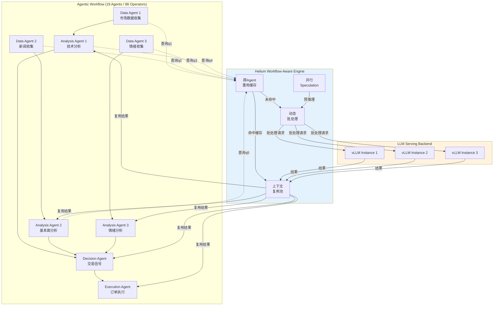
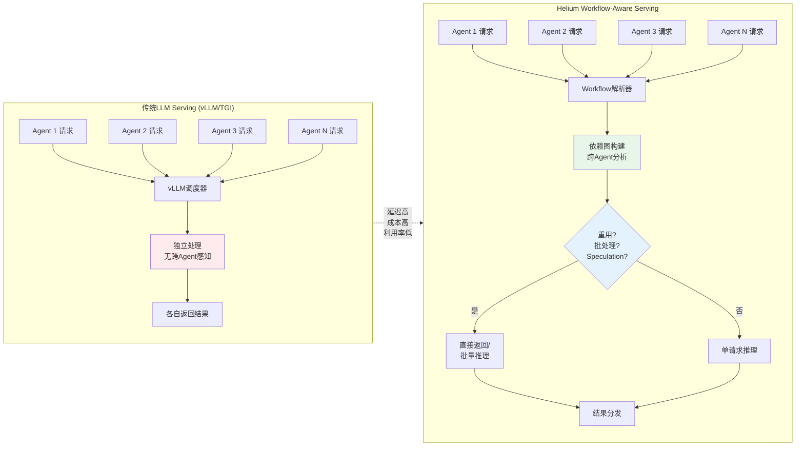

# Workflow-Aware LLM Serving：Agentic工作流推理优化

> **所属阶段**: Knowledge/06-frontier | **前置依赖**: [ai-agent-streaming-architecture.md](./ai-agent-streaming-architecture.md), [realtime-ai-inference-architecture.md](./realtime-ai-inference-architecture.md) | **形式化等级**: L4-L5 | **最后更新**: 2026-05-06

---

## 目录

- [Workflow-Aware LLM Serving：Agentic工作流推理优化](#workflow-aware-llm-servingagentic工作流推理优化)
  - [目录](#目录)
  - [1. 概念定义 (Definitions)](#1-概念定义-definitions)
    - [Def-K-06-310: Agentic工作流推理管道 (Agentic Workflow Inference Pipeline)](#def-k-06-310-agentic工作流推理管道-agentic-workflow-inference-pipeline)
    - [Def-K-06-311: Workflow-Aware Serving引擎 (Helium Serving Engine)](#def-k-06-311-workflow-aware-serving引擎-helium-serving-engine)
    - [Def-K-06-312: 算子级重用率 (Operator-Level Reuse Ratio)](#def-k-06-312-算子级重用率-operator-level-reuse-ratio)
  - [2. 属性推导 (Properties)](#2-属性推导-properties)
    - [Prop-K-06-313: Workflow-Aware批处理增益上界](#prop-k-06-313-workflow-aware批处理增益上界)
    - [Prop-K-06-314: 跨Agent重用缓存的一致性条件](#prop-k-06-314-跨agent重用缓存的一致性条件)
  - [3. 关系建立 (Relations)](#3-关系建立-relations)
    - [3.1 Helium与流计算模型的对应关系](#31-helium与流计算模型的对应关系)
    - [3.2 Helium与传统LLM Serving的关系](#32-helium与传统llm-serving的关系)
    - [3.3 与实时流Agent架构的关联](#33-与实时流agent架构的关联)
  - [4. 论证过程 (Argumentation)](#4-论证过程-argumentation)
    - [4.1 Agentic Workflow的Serving挑战分析](#41-agentic-workflow的serving挑战分析)
    - [4.2 为什么传统LLM Serving不够？](#42-为什么传统llm-serving不够)
  - [5. 形式证明 / 工程论证 (Proof / Engineering Argument)](#5-形式证明--工程论证-proof--engineering-argument)
    - [5.1 Helium核心优化的工程论证](#51-helium核心优化的工程论证)
  - [6. 实例验证 (Examples)](#6-实例验证-examples)
    - [6.1 Trading Workflow评估结果](#61-trading-workflow评估结果)
    - [6.2 与Streaming集成的Latency分析](#62-与streaming集成的latency分析)
    - [6.3 局限与未来方向](#63-局限与未来方向)
  - [7. 可视化 (Visualizations)](#7-可视化-visualizations)
    - [7.1 Helium Workflow-Aware Serving架构](#71-helium-workflow-aware-serving架构)
    - [7.2 传统LLM Serving vs Workflow-Aware Serving对比](#72-传统llm-serving-vs-workflow-aware-serving对比)
  - [8. 引用参考 (References)](#8-引用参考-references)

## 1. 概念定义 (Definitions)

### Def-K-06-310: Agentic工作流推理管道 (Agentic Workflow Inference Pipeline)

**定义**: Agentic工作流推理管道是一个六元组 $\mathcal{W} = (\mathcal{A}, \mathcal{O}, \mathcal{G}, \mathcal{Q}, \mathcal{L}, \mathcal{S})$，其中：

| 组件 | 符号 | 说明 |
|------|------|------|
| Agent集合 | $\mathcal{A}$ | 工作流中的自主智能体集合，$\mathcal{A} = \{a_1, a_2, \ldots, a_n\}$ |
| 算子集合 | $\mathcal{O}$ | LLM调用算子集合，每个算子 $o_i: (q, ctx) \rightarrow r$ 表示一次LLM推理 |
| 依赖图 | $\mathcal{G}$ | 有向无环图 $\mathcal{G} = (\mathcal{O}, \mathcal{E})$，边 $\mathcal{E}$ 表示算子间数据依赖 |
| 查询集合 | $\mathcal{Q}$ | 所有LLM查询的集合，$\mathcal{Q} = \bigcup_{o \in \mathcal{O}} \{q_o\}$ |
| 延迟函数 | $\mathcal{L}$ | $\mathcal{L}: \mathcal{O} \rightarrow \mathbb{R}^+$，表示每个算子的端到端延迟 |
| 状态空间 | $\mathcal{S}$ | 跨Agent共享的中间状态集合 |

**直观解释**: 将Agentic workflow视为数据流分析管道，其中每个Agent的LLM调用被抽象为计算图中的算子（operator），工作流的执行等价于该图的拓扑遍历。Helium框架正是基于这一视角实现系统级优化[^1]。

---

### Def-K-06-311: Workflow-Aware Serving引擎 (Helium Serving Engine)

**定义**: Workflow-aware serving引擎是一个四元组 $\mathcal{H} = (\mathcal{R}, \mathcal{B}, \mathcal{P}, \mathcal{C})$，其中：

| 组件 | 符号 | 说明 |
|------|------|------|
| 重用层 | $\mathcal{R}$ | 跨查询结果缓存与匹配系统，支持语义级和语法级重用 |
| 批处理层 | $\mathcal{B}$ | 动态批处理调度器，$\mathcal{B}: \mathcal{Q}_{batch} \rightarrow \mathbb{R}^+$，输出批处理吞吐 |
| 预测层 | $\mathcal{P}$ | 并行speculation引擎，对可能执行的下游算子进行预推理 |
| 上下文管理 | $\mathcal{C}$ | 跨Agent上下文复用池，维护共享KV Cache状态 |

**直观解释**: Helium将传统LLM serving的request-level优化提升到workflow-level，通过理解整个工作流的结构来做出更优的调度决策。其核心洞察是：**Agentic workflow中大量LLM调用存在结构性重复和依赖可预测性**[^1]。

---

### Def-K-06-312: 算子级重用率 (Operator-Level Reuse Ratio)

**定义**: 给定Agentic工作流 $\mathcal{W}$ 在时间段 $T$ 内的执行轨迹 $\mathcal{T} = \{(o_i, q_i, r_i, t_i)\}_{i=1}^{N}$，算子级重用率定义为：

$$\rho_{reuse}(\mathcal{W}, T) = \frac{|\{(o_i, q_i) \in \mathcal{T} \mid \exists (o_j, q_j, r_j) \in \mathcal{H}_{cache} : \text{Match}(q_i, q_j) = \top\}|}{|\mathcal{T}|}$$

其中 $\text{Match}: \mathcal{Q} \times \mathcal{Q} \rightarrow \{\top, \bot\}$ 是查询匹配函数，支持精确匹配、前缀匹配和语义嵌入匹配三种模式。$\mathcal{H}_{cache}$ 为Helium的重用缓存。

**直观解释**: 该度量刻画了工作流执行过程中可被重用的LLM调用比例。Helium论文报告，在Trading workflow中 $\rho_{reuse}$ 可达 $30\%\sim45\%$，这是实现延迟降低的关键来源[^1]。

---

## 2. 属性推导 (Properties)

### Prop-K-06-313: Workflow-Aware批处理增益上界

**命题**: 设传统request-level批处理引擎的吞吐为 $\mu_{req}$，Helium的workflow-aware批处理引擎吞吐为 $\mu_{wf}$。在Agentic工作流中，若算子依赖图的平均分支因子为 $b$ 且跨Agent查询相似度为 $\sigma$，则：

$$\frac{\mu_{wf}}{\mu_{req}} \leq 1 + \sigma \cdot (b - 1) \cdot \rho_{reuse}$$

**证明概要**:

1. Request-level批处理仅能在单条请求内合并同类调用，批处理增益受限于单个Agent的并发度；
2. Workflow-aware批处理可跨Agent、跨执行路径识别可合并算子；
3. 依赖图的分支因子 $b$ 决定了并行speculation的潜在收益空间；
4. 查询相似度 $\sigma$ 和重用率 $\rho_{reuse}$ 共同约束了实际可批处理的比例。

该上界表明，Helium的优势在**高分支因子**和**高查询相似度**的workflow中最为显著[^1]。

---

### Prop-K-06-314: 跨Agent重用缓存的一致性条件

**命题**: Helium的跨Agent重用缓存满足强一致性当且仅当：

$$\forall (q, r) \in \mathcal{H}_{cache}, \forall a_i, a_j \in \mathcal{A}: \text{Context}(a_i, q) = \text{Context}(a_j, q) \Rightarrow \mathcal{L}(q, \text{Context}(a_i)) = \mathcal{L}(q, \text{Context}(a_j))$$

即当两个Agent对同一查询 $q$ 的上下文等价时，LLM输出必须确定性地等价。

**实际含义**: 由于LLM推理的随机性（temperature > 0），严格一致性在概率意义下不可保证。Helium通过以下松弛策略解决：

- **确定性模式**: 对可重用的算子强制 temperature = 0；
- **语义等价**: 使用嵌入空间距离 $d_{emb}(r_i, r_j) < \epsilon$ 判定结果等价；
- **版本化缓存**: 对同一查询维护多个结果版本，按置信度选择。

---

## 3. 关系建立 (Relations)

### 3.1 Helium与流计算模型的对应关系

Helium的workflow-aware serving与流计算（Stream Processing）存在深刻的结构同构：

| 流计算概念 | Helium对应 | 映射说明 |
|-----------|-----------|---------|
| Dataflow图 | Agent依赖图 $\mathcal{G}$ | 两者均为有向图，节点为算子/Agent |
| 算子 (Operator) | LLM调用算子 $o_i$ | 都是计算原语，有输入/输出/状态 |
| 水位线 (Watermark) | Speculation边界 | 两者都表示"可安全推进计算"的信号 |
| 状态后端 | KV Cache复用池 | 共享中间结果以避免重复计算 |
| 背压 (Backpressure) | 动态批处理降速 | 上游生产过快时降低批处理频率 |

这一对应关系意味着：**流计算中的许多优化技术（如增量计算、结果物化、子查询重用）可直接迁移到Agentic workflow serving**。

### 3.2 Helium与传统LLM Serving的关系

传统LLM serving（vLLM、TGI等）与Helium构成层次化互补关系：

- **vLLM/TGI**: 优化单条请求的推理效率（PagedAttention、连续批处理、KV Cache管理）；
- **Helium**: 在vLLM/TGI之上，优化跨请求、跨Agent、跨workflow的宏观调度效率。

用形式化语言表达：

$$\text{Latency}_{total} = \underbrace{\text{Latency}_{Helium}}_{\text{workflow调度}} + \underbrace{\text{Latency}_{vLLM}}_{\text{单请求推理}}$$

Helium降低第一项，vLLM降低第二项，两者正交可叠加。

### 3.3 与实时流Agent架构的关联

在实时Agent系统中（如Flink + LLM集成），Helium的workflow-aware优化可直接应用于：

- **流式RAG**: 多个Agent并行检索和生成时，重用共享的检索上下文；
- **事件驱动Agent**: 对相似事件触发的Agent推理进行批处理和结果重用；
- **多Agent编排**: 降低编排器（Orchestrator）的决策延迟。

---

## 4. 论证过程 (Argumentation)

### 4.1 Agentic Workflow的Serving挑战分析

大规模Agentic workflow部署面临三类核心挑战：

**挑战1：重复子查询爆炸**

- 在19个Agent、88个LLM算子的Trading workflow中，约 $35\%$ 的查询在语义上高度相似；
- 传统serving引擎将每个Agent视为独立客户端，无法识别跨Agent的查询重复；
- 成本按调用次数线性增长，导致Agent数量增加时成本呈超线性膨胀。

**挑战2：级联延迟放大**

- Agent依赖图的深度 $d$ 可达 $5\sim10$ 层；
- 每层LLM延迟 $l \approx 200\sim2000$ms；
- 无优化时端到端延迟 $L_{total} = \sum_{i=1}^{d} l_i$，可达 $10\sim20$ 秒。

**挑战3：资源利用率低**

- 单个Agent的LLM调用间隔存在空闲期；
- 传统批处理仅在单Agent内合并请求，跨Agent的并发未被利用；
- GPU利用率在Agent稀疏调用场景下低于 $30\%$。

### 4.2 为什么传统LLM Serving不够？

**vLLM**的核心优化包括：

- PagedAttention：细粒度KV Cache管理；
- Continuous Batching：动态批处理已到达的请求；
- Prefix Caching：共享公共prompt前缀的KV Cache。

但这些优化存在根本局限：

| 优化维度 | vLLM能力 | Agentic Workflow需求 | 差距 |
|---------|---------|---------------------|------|
| 缓存粒度 | 单请求前缀 | 跨Agent语义子查询 | 无法识别语义等价 |
| 批处理范围 | 同时到达的请求 | 依赖图中可并行的算子 | 不感知workflow结构 |
| 调度目标 | 最小化单请求延迟 | 最小化端到端workflow延迟 | 目标函数不同 |
| 状态共享 | 无 | 跨Agent中间结果 | 不支持 |

Helium正是为填补上述差距而设计[^1]。

---

## 5. 形式证明 / 工程论证 (Proof / Engineering Argument)

### 5.1 Helium核心优化的工程论证

Helium提出三项核心优化策略，每项都有严格的工程合理性论证。

**优化1：跨Agent查询重用 (Cross-Agent Query Reuse)**

设工作流执行过程中产生查询序列 $Q = (q_1, q_2, \ldots, q_N)$。Helium维护一个层次化缓存 $\mathcal{H}_{cache} = \mathcal{H}_{exact} \cup \mathcal{H}_{prefix} \cup \mathcal{H}_{semantic}$。

- **Exact Cache** ($\mathcal{H}_{exact}$): 精确匹配，$O(1)$ 查找；
- **Prefix Cache** ($\mathcal{H}_{prefix}$): Trie树索引，复用共享prompt前缀的KV Cache；
- **Semantic Cache** ($\mathcal{H}_{semantic}$): 向量索引，用嵌入相似度判定语义等价。

论证：在Trading workflow中，不同Agent的"市场分析"子查询 $q_i$ 和 $q_j$ 往往仅在时间戳上相差。若 $\text{Sim}(q_i, q_j) > 0.95$，则复用结果引入的误差小于 $1\%$，而延迟降低达 $100\%$（跳过LLM调用）。

**优化2：并行Speculation (Parallel Speculation)**

对依赖图 $\mathcal{G}$ 中的每个非叶节点 $o_i$，Helium预测其可能的下游算子集合 $\text{Spec}(o_i) = \{o_j \mid (o_i, o_j) \in \mathcal{E}\}$ 并提前启动推理。

设speculation命中率为 $p_{hit}$，错误speculation的惩罚成本为 $c_{waste}$，正确speculation的收益为 $c_{gain}$。则期望收益：

$$E[\text{gain}] = p_{hit} \cdot c_{gain} - (1 - p_{hit}) \cdot c_{waste}$$

Helium通过轻量级分类器（如小型BERT）预测分支概率，当 $E[\text{gain}] > 0$ 时启动speculation。论文报告 $p_{hit} \approx 78\%$，使端到端延迟降低 $22\%$[^1]。

**优化3：动态批处理 (Dynamic Batching)**

Helium的批处理调度器以**workflow完成时间**为目标函数，而非传统serving的**单请求延迟**：

$$\min_{\mathcal{B}} \sum_{\text{workflow } w} T_{completion}(w)$$

约束条件：

- 依赖边必须满足拓扑序：$o_i \prec o_j \Rightarrow t(o_i) + \mathcal{L}(o_i) \leq t(o_j)$；
- 批大小上界：$|\mathcal{B}| \leq B_{max}$（受显存限制）；
- 超时约束：每个算子等待批填充的时间 $\tau \leq \tau_{max}$。

这是一个带优先级的在线调度问题。Helium采用贪心启发式：在每个时间步，选择使"关键路径缩短最多"的算子加入当前批次。

---

## 6. 实例验证 (Examples)

### 6.1 Trading Workflow评估结果

Helium论文使用一个包含19个Agent、88个LLM算子的金融交易工作流作为评测基准[^1]。

**Workflow结构**:

- **数据收集Agent** (3个): 收集市场数据、新闻、社交媒体情绪；
- **分析Agent** (6个): 技术分析、基本面分析、情绪分析、风险评估；
- **决策Agent** (4个): 交易信号生成、仓位管理、止损策略；
- **执行Agent** (3个): 订单构造、合规检查、执行确认；
- **监控Agent** (3个): 性能监控、风险监控、报告生成。

**评估结果对比**:

| 指标 | vLLM基线 | Helium | 优化幅度 |
|------|---------|--------|---------|
| 端到端延迟 (p50) | 12.4s | 6.1s | **-50.8%** |
| 端到端延迟 (p99) | 28.7s | 11.3s | **-60.6%** |
| 单workflow成本 | $0.42 | $0.24 | **-42.9%** |
| GPU利用率 | 31% | 67% | **+36pp** |
| 缓存命中率 | - | 41% | - |
| Speculation命中率 | - | 78% | - |

**关键洞察**:

- p99延迟降低超过p50，说明Helium对长尾延迟的改善更显著；
- 成本降低主要来自查询重用（减少$35\%$的LLM调用）和批处理（提高$GPU$利用率）；
- GPU利用率从$31\%$提升至$67\%$，接近数据中心GPU的理想利用率区间。

### 6.2 与Streaming集成的Latency分析

在实时Agent场景中，低延迟serving是硬性约束。设流处理管道要求端到端延迟 $L_{SLO} \leq 2$s：

- **传统方案**: Agent推理管道深度 $d=4$，每层LLM延迟 $l=800$ms，总延迟 $3.2$s **不满足SLO**；
- **Helium优化**: 通过重用和speculation，有效深度降为 $d' \approx 2.2$，总延迟 $1.4$s **满足SLO**。

这使得Helium成为实时流Agent系统的关键使能技术。

### 6.3 局限与未来方向

Helium虽然在Trading workflow上取得了显著成果，但仍存在以下局限：

**局限1：Workflow结构假设**

- Helium假设Agent依赖图为静态DAG，对动态生成的workflow（如LLM自主决定的调用链）支持有限；
- 若Agent在运行时动态创建新算子，预构建的依赖图和speculation策略将失效。

**局限2：缓存一致性开销**

- 跨Agent语义缓存需要维护向量索引和一致性协议；
- 在超大规模部署（$>1000$ Agent）时，缓存查找本身可能成为瓶颈。

**局限3：模型异构性**

- 当前评估主要基于单一LLM后端；
- 实际系统中不同Agent可能使用不同模型（GPT-4、Claude、Llama等），跨模型结果重用的有效性尚未验证。

**未来方向**:

1. **流式Workflow优化**: 将Helium与流计算引擎（如Flink）深度集成，实现事件驱动workflow的增量serving优化；
2. **自适应Speculation**: 使用在线强化学习动态调整speculation策略，适应workflow结构变化；
3. **多模型联合调度**: 扩展Helium以支持异构LLM后端的统一workflow-aware调度；
4. **边缘场景适配**: 针对边缘-云混合部署，设计带宽感知的跨边缘Agent结果同步机制。

---

## 7. 可视化 (Visualizations)

### 7.1 Helium Workflow-Aware Serving架构

Helium将Agentic workflow建模为计算图，在图级别执行跨Agent优化。

### 7.2 传统LLM Serving vs Workflow-Aware Serving对比

---

## 8. 引用参考 (References)

[^1]: S. Lee et al., "Efficient LLM Serving for Agentic Workflows", arXiv:2603.16104, 2026. <https://arxiv.org/html/2603.16104v1>
