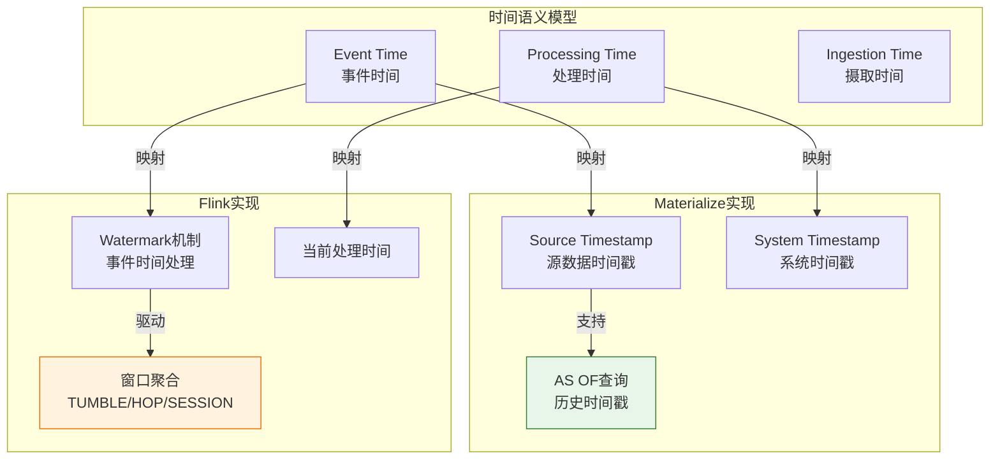
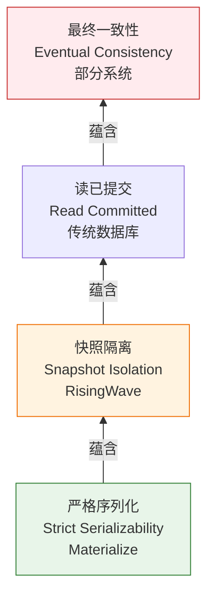
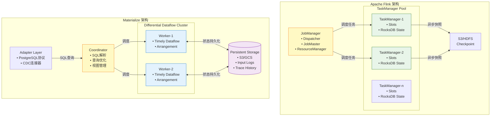
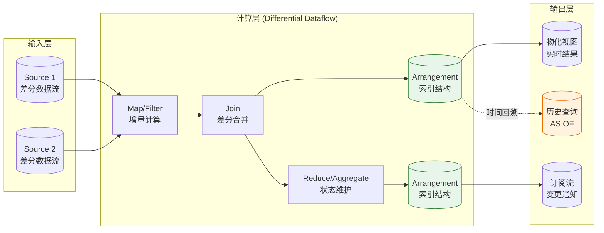
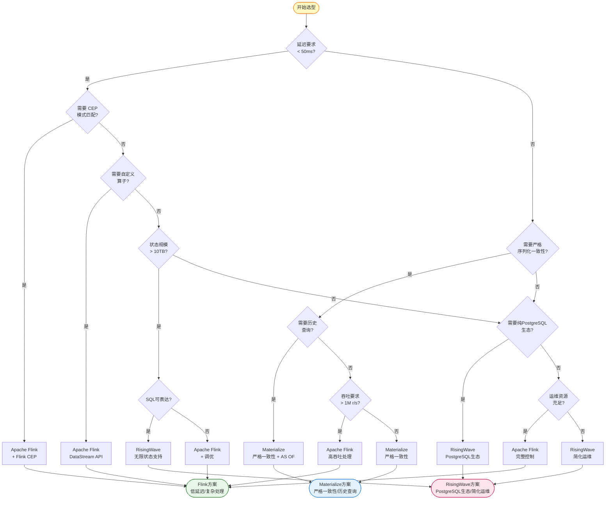
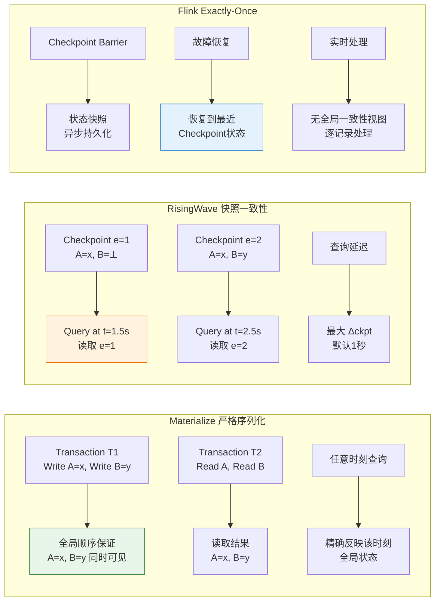
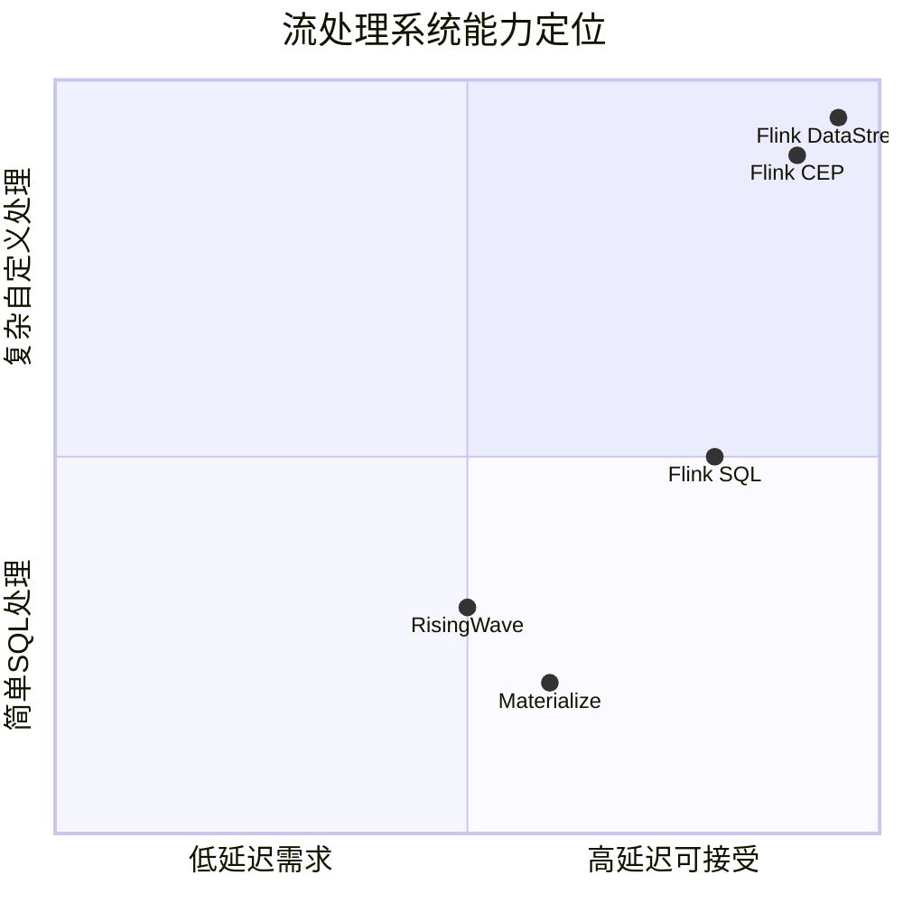

# Materialize 对比分析指南：SQL流处理引擎与Flink深度对比

> **所属阶段**: Knowledge/06-frontier | **前置依赖**: [../04-technology-selection/flink-vs-risingwave.md](../04-technology-selection/flink-vs-risingwave.md), [risingwave-deep-dive.md](./risingwave-deep-dive.md), [一致性层次](../../Struct/02-properties/02.02-consistency-hierarchy.md) | **形式化等级**: L4-L5
> **版本**: 2026.04 | **文档规模**: ~40KB

---

## 目录

- [Materialize 对比分析指南：SQL流处理引擎与Flink深度对比](#materialize-对比分析指南sql流处理引擎与flink深度对比)
  - [目录](#目录)
  - [1. 概念定义 (Definitions)](#1-概念定义-definitions)
    - [Def-K-06-20 (Materialize系统架构)](#def-k-06-20-materialize系统架构)
    - [Def-K-06-21 (Differential Dataflow形式化定义)](#def-k-06-21-differential-dataflow形式化定义)
    - [Def-K-06-22 (严格序列化一致性)](#def-k-06-22-严格序列化一致性)
    - [Def-K-06-23 (SQL流处理方言分类)](#def-k-06-23-sql流处理方言分类)
  - [2. 属性推导 (Properties)](#2-属性推导-properties)
    - [Lemma-K-06-20 (差分计算复杂度边界)](#lemma-k-06-20-差分计算复杂度边界)
    - [Lemma-K-06-21 (时间戳传播与一致性关系)](#lemma-k-06-21-时间戳传播与一致性关系)
    - [Prop-K-06-20 (SQL完备性与表达能力权衡)](#prop-k-06-20-sql完备性与表达能力权衡)
  - [3. 关系建立 (Relations)](#3-关系建立-relations)
    - [关系 1: 时间语义模型映射](#关系-1-时间语义模型映射)
    - [关系 2: 状态管理架构演进谱系](#关系-2-状态管理架构演进谱系)
    - [关系 3: 一致性模型蕴含层次](#关系-3-一致性模型蕴含层次)
  - [4. 论证过程 (Argumentation)](#4-论证过程-argumentation)
    - [4.1 Differential Dataflow核心技术解析](#41-differential-dataflow核心技术解析)
    - [4.2 时间语义对比分析](#42-时间语义对比分析)
    - [4.3 状态管理机制深度对比](#43-状态管理机制深度对比)
    - [4.4 反例分析：Materialize的局限性](#44-反例分析materialize的局限性)
  - [5. 形式证明 / 工程论证 (Proof / Engineering Argument)](#5-形式证明-工程论证-proof-engineering-argument)
    - [Thm-K-06-20 (流处理引擎选择决策定理)](#thm-k-06-20-流处理引擎选择决策定理)
  - [6. 实例验证 (Examples)](#6-实例验证-examples)
    - [6.1 实时库存管理系统](#61-实时库存管理系统)
    - [6.2 金融交易对账场景](#62-金融交易对账场景)
    - [6.3 实时推荐特征平台](#63-实时推荐特征平台)
    - [6.4 混合架构：Flink + Materialize {#64-混合架构flink--materialize}](#64-混合架构flink--materialize)
  - [7. 可视化 (Visualizations)](#7-可视化-visualizations)
    - [7.1 架构对比图](#71-架构对比图)
    - [7.2 Differential Dataflow计算模型](#72-differential-dataflow计算模型)
    - [7.3 技术选型决策树](#73-技术选型决策树)
    - [7.4 一致性模型对比](#74-一致性模型对比)
    - [7.5 性能特征雷达图](#75-性能特征雷达图)
  - [8. 综合对比矩阵](#8-综合对比矩阵)
    - [8.1 核心架构对比](#81-核心架构对比)
    - [8.2 功能特性对比](#82-功能特性对比)
    - [8.3 SQL方言对比](#83-sql方言对比)
    - [8.4 性能基准数据](#84-性能基准数据)
    - [8.5 运维成本对比](#85-运维成本对比)
  - [9. 技术选型决策矩阵](#9-技术选型决策矩阵)
    - [9.1 选型Checklist](#91-选型checklist)
    - [9.2 场景-技术映射表](#92-场景-技术映射表)
    - [9.3 迁移路径建议](#93-迁移路径建议)
  - [10. 结论与展望](#10-结论与展望)
    - [10.1 核心观点](#101-核心观点)
    - [10.2 未来趋势](#102-未来趋势)
  - [参考文献 (References)](#参考文献-references)

---

## 1. 概念定义 (Definitions)

### Def-K-06-20 (Materialize系统架构)

**Materialize** 是一个基于SQL的流处理数据库系统，其核心架构可形式化定义为六元组：

$$
\mathcal{M} = \langle \mathcal{S}, \mathcal{D}, \mathcal{T}, \mathcal{P}, \mathcal{A}, \mathcal{C} \rangle
$$

其中各组件定义如下：

| 组件 | 符号 | 形式化定义 | 功能描述 |
|------|------|------------|----------|
| **SQL前端** | $\mathcal{S}$ | $\langle \mathcal{Q}_{parser}, \mathcal{Q}_{optimizer} \rangle$ | SQL解析、查询优化、视图定义 |
| **Differential Dataflow** | $\mathcal{D}$ | $\langle \mathcal{G}, \mathcal{O}_{diff}, \mathcal{F}_{timely} \rangle$ | 差分计算引擎核心 |
| **Timely Dataflow** | $\mathcal{T}$ | $\langle \mathcal{N}_{worker}, \mathcal{C}_{comm}, \mathcal{L}_{log} \rangle$ | 分布式执行运行时 |
| **持久化存储** | $\mathcal{P}$ | $\langle \mathcal{S}_{log}, \mathcal{I}_{index} \rangle$ | 日志存储与索引管理 |
| **适配器层** | $\mathcal{A}$ | $\langle \mathcal{C}_{source}, \mathcal{C}_{sink} \rangle$ | 外部系统连接器 |
| **协调器** | $\mathcal{C}$ | $\langle \mathcal{M}_{meta}, \mathcal{H}_{health} \rangle$ | 集群元数据与健康管理 |

**关键架构特征**：

1. **Rust原生实现**：全系统使用Rust编写，无GC开销
2. **计算-存储分离**：计算节点无状态，状态持久化到S3/本地存储
3. **严格序列化一致性**：提供最高级别的事务一致性保证
4. **纯SQL接口**：完全兼容PostgreSQL协议，无专有API

### Def-K-06-21 (Differential Dataflow形式化定义)

**Differential Dataflow (DD)** 是Materialize的核心计算框架，形式化定义为：

$$
\mathcal{DD} = \langle \mathcal{G}, \Delta, \tau, \oplus \rangle
$$

其中：

- **$\mathcal{G} = (V, E)$**: 数据流图，顶点为算子，边为数据流
- **$\Delta$**: 差分数据集合，表示为 `(data, time, diff)` 三元组
- **$\tau: \mathcal{T} \rightarrow \mathbb{N}^d$**: 多维时间戳映射函数
- **$\oplus$**: 差分合并操作符，满足交换律和结合律

**差分数据表示**：

```
ΔCollection = {(d₁, t₁, δ₁), (d₂, t₂, δ₂), ..., (dₙ, tₙ, δₙ)}

其中:
  dᵢ: 数据元素
  tᵢ: (epoch, logical_time) 多维时间戳
  δᵢ: 整数权重 (+1表示插入, -1表示删除)
```

**增量计算语义**：

对于算子 $f$ 和输入集合 $A$，输出集合为：

$$
f(A) = \bigoplus_{(a, t, \delta) \in A} f(\{(a, t, \delta)\})
$$

### Def-K-06-22 (严格序列化一致性)

**严格序列化一致性** (Strict Serializability) 是Materialize提供的最高级别一致性保证：

$$
\text{StrictSerializability} \equiv \text{Serializability} \land \text{Real-Time Order Preservation}
$$

形式化定义：

对于任意操作集合 $O = \{o_1, o_2, ..., o_n\}$，存在全序 $\prec$ 满足：

1. **串行等价性**：执行结果等效于按 $\prec$ 顺序串行执行
2. **实时顺序保持**：若 $o_i$ 在真实时间中完成于 $o_j$ 开始前，则 $o_i \prec o_j$
3. **读己之写**：事务始终能读取到自己写入的数据

**与快照一致性对比**：

| 一致性级别 | 形式化定义 | 典型延迟 | 代表系统 |
|-----------|-----------|----------|----------|
| **严格序列化** | $\forall t: Read(t) = State(t)$ | < 1ms | Materialize |
| **快照隔离** | $\exists t' \leq t: Read(t) = State(t')$ | 1-10ms | RisingWave |
| **最终一致性** | $\lim_{t \rightarrow \infty} Read(t) = State(t)$ | 秒级 | 部分NoSQL |

### Def-K-06-23 (SQL流处理方言分类)

流处理SQL方言按语法兼容性分类：

$$
\text{SQL}_{streaming} = \{ \text{PostgreSQL}, \text{Flink SQL}, \text{Materialize SQL}, \text{ksqlDB}, ... \}
$$

**方言特征对比**：

| 特征 | Materialize | Flink SQL | RisingWave |
|------|-------------|-----------|------------|
| **基础兼容** | PostgreSQL原生 | 自定义方言 | PostgreSQL兼容 |
| **物化视图** | `CREATE MATERIALIZED VIEW` | `CREATE TABLE` + 连续查询 | `CREATE MATERIALIZED VIEW` |
| **时间语义** | `AS OF` 显式时间戳 | `WATERMARK` + `TUMBLE` | 窗口函数 |
| **订阅机制** | `SUBSCRIBE` | `Continuous SQL` | `CREATE SINK` |
| **CDC源** | `CREATE SOURCE` + Debezium | `CREATE TABLE` + CDC Connector | `CREATE SOURCE` |

---

## 2. 属性推导 (Properties)

### Lemma-K-06-20 (差分计算复杂度边界)

**陈述**: 对于Differential Dataflow中的算子 $f$，其增量计算复杂度 $C_{inc}$ 满足：

$$
C_{inc}(f, \Delta) = O(|\Delta| \cdot \log(|S|))
$$

其中 $|\Delta|$ 为变更数据量，$|S|$ 为总状态大小。

**推导**:

1. **数据表示**: DD使用 `(data, time, diff)` 三元组，支持任意时间维度的追溯
2. **索引结构**: 基于LSM-Tree的索引，点查复杂度 $O(\log|S|)$
3. **增量传播**: 仅处理变更数据，避免全量重算
4. **多版本管理**: 时间戳维度增加空间复杂度，但查询复杂度保持对数级

**与Flink对比**：

| 维度 | Flink (RocksDB) | Materialize (DD) |
|------|-----------------|------------------|
| 点查复杂度 | $O(1)$ (哈希) | $O(\log|S|)$ (B-Tree索引) |
| 范围查复杂度 | $O(\log|S|)$ (LSM) | $O(\log|S| + k)$ |
| 增量更新 | 局部状态更新 | 差分传播 |
| 历史追溯 | 不支持 | 原生支持 |

∎

### Lemma-K-06-21 (时间戳传播与一致性关系)

**陈述**: 在Timely Dataflow中，时间戳传播的完备性与一致性级别存在以下关系：

$$
\text{TimestampCompleteness} \Rightarrow \text{ConsistencyLevel}
$$

具体映射：

| 时间戳传播策略 | 一致性级别 | 典型延迟 | 适用场景 |
|---------------|-----------|----------|----------|
| **全序广播** | 严格序列化 | < 1ms | 金融交易 |
| **因果传播** | 因果一致性 | < 10ms | 协作编辑 |
| **最终传播** | 最终一致性 | < 100ms | 分析仪表板 |

**推导**: Materialize采用全序广播确保所有Worker节点对时间戳达成一致，从而实现严格序列化。

∎

### Prop-K-06-20 (SQL完备性与表达能力权衡)

**陈述**: SQL完备性 $C_{SQL}$ 与表达能力 $E_{expressive}$ 存在以下权衡关系：

$$
E_{expressive} = \frac{1}{C_{SQL}} \cdot k
$$

其中 $k$ 为系统特定扩展系数。

**推导**：

| 系统 | SQL完备性 | 表达能力 | 权衡说明 |
|------|-----------|----------|----------|
| **Materialize** | 高 (PostgreSQL) | 低 (仅SQL) | 纯SQL，无自定义算子 |
| **Flink SQL** | 中 (自定义方言) | 中 | SQL + Table API |
| **Flink DataStream** | 低 | 高 (图灵完备) | 完全自定义逻辑 |

**工程推论**: 业务逻辑完全可用SQL表达时，Materialize提供最高开发效率；需要自定义算法时，Flink是唯一选择。

---

## 3. 关系建立 (Relations)

### 关系 1: 时间语义模型映射



**关键差异**：

- **Materialize**: 时间戳是数据属性，支持任意历史查询 (`AS OF`)
- **Flink**: Watermark驱动窗口触发，事件时间用于延迟数据处理

### 关系 2: 状态管理架构演进谱系

```
状态管理架构演进:
━━━━━━━━━━━━━━━━━━━━━━━━━━━━━━━━━━━━━━━━━━━━━━━━━━━━━━━━━

Flink 1.x (2015-2020)
├─ 本地RocksDB状态
├─ 异步Checkpoint到HDFS/S3
└─ 故障恢复需重建状态

    ↓ 演进

Materialize / RisingWave (2020+)
├─ 计算-存储分离架构
├─ 状态持久化到对象存储
└─ 秒级故障恢复

    ↓ 演进

Flink 2.0 ForSt (2024+)
├─ 混合存储架构
├─ 热状态本地 + 冷状态S3
└─ 渐进式恢复

━━━━━━━━━━━━━━━━━━━━━━━━━━━━━━━━━━━━━━━━━━━━━━━━━━━━━━━━━
```

### 关系 3: 一致性模型蕴含层次



**蕴含关系证明**：

- $SC \Rightarrow SI$: 严格序列化要求所有操作等效于某一全局顺序，自然蕴含快照隔离
- $SI \not\Rightarrow SC$: 快照隔离允许写偏序异常，不满足严格序列化

---

## 4. 论证过程 (Argumentation)

### 4.1 Differential Dataflow核心技术解析

**Differential Dataflow (DD)** 是Materialize区别于其他流处理系统的核心技术：

```
Differential Dataflow 核心机制:
┌─────────────────────────────────────────────────────────┐
│ 1. 差分数据表示: (data, time, diff) 三元组               │
│ 2. 多维时间戳: (epoch, logical_time) 支持嵌套迭代        │
│ 3. 增量计算: 仅传播变更,避免全量重算                    │
│ 4. 可回溯查询: 支持任意历史时刻的数据视图                │
│ 5. 嵌套循环: 支持迭代计算 (如连通分量、PageRank)        │
└─────────────────────────────────────────────────────────┘
```

**差分计算示例**：

```
输入流变更:
  t=1: INSERT INTO orders VALUES (1, 'A', 100)
  t=2: INSERT INTO orders VALUES (2, 'B', 200)
  t=3: UPDATE orders SET amount=150 WHERE id=1

差分表示:
  (('1', 'A', 100), (1, 0), +1)
  (('2', 'B', 200), (2, 0), +1)
  (('1', 'A', 100), (3, 0), -1)  -- 删除旧值
  (('1', 'A', 150), (3, 0), +1)  -- 插入新值

聚合视图状态 (SUM(amount)):
  t=1: 100
  t=2: 300
  t=3: 350
```

**与Flink状态机制对比**：

| 特性 | Materialize (DD) | Flink (RocksDB) |
|------|------------------|-----------------|
| **状态表示** | 差分集合 | 键值对 |
| **时间维度** | 多维时间戳 | 单一时序 |
| **历史查询** | 原生支持 | 不支持 |
| **迭代计算** | 支持 | 有限支持 (Delta Iteration) |
| **内存效率** | 高 (压缩重复) | 中 |

### 4.2 时间语义对比分析

**Materialize时间模型**：

```sql
-- 创建带时间戳的源
CREATE SOURCE transactions (
    id INT,
    user_id INT,
    amount DECIMAL,
    ts TIMESTAMP
) WITH (
    connector = 'kafka',
    topic = 'transactions'
) FORMAT JSON;

-- 查询历史状态 (AS OF)
SELECT * FROM materialized_view AS OF NOW() - INTERVAL '1 hour';

-- 订阅实时变更
COPY (SUBSCRIBE TO materialized_view) TO STDOUT;
```

**Flink时间模型**：

```sql
-- 定义Watermark策略
CREATE TABLE transactions (
    id INT,
    user_id INT,
    amount DECIMAL,
    ts TIMESTAMP(3),
    WATERMARK FOR ts AS ts - INTERVAL '5' SECOND
) WITH (
    'connector' = 'kafka',
    'topic' = 'transactions'
);

-- 窗口聚合
SELECT
    TUMBLE_START(ts, INTERVAL '1' HOUR) as window_start,
    COUNT(*) as cnt,
    SUM(amount) as total
FROM transactions
GROUP BY TUMBLE(ts, INTERVAL '1' HOUR);
```

**时间语义对比矩阵**：

| 特性 | Materialize | Flink | 说明 |
|------|-------------|-------|------|
| **事件时间** | 源数据时间戳 | Watermark驱动 | Flink更灵活处理乱序 |
| **处理时间** | 系统当前时间 | 内置CURRENT_TIMESTAMP | 两者相当 |
| **历史查询** | ✅ `AS OF` | ❌ 不支持 | Materialize独特优势 |
| **窗口类型** | 有限 (TUMBLE) | 丰富 (TUMBLE/HOP/SESSION) | Flink更完整 |
| **延迟处理** | 重计算 | Watermark触发 | Flink更高效 |

### 4.3 状态管理机制深度对比

**Materialize状态架构**：

```
┌─────────────────────────────────────────────────────────────┐
│                    Compute Cluster (Rust)                    │
│  ┌─────────────┐    ┌─────────────┐    ┌─────────────┐     │
│  │  Worker-1   │    │  Worker-2   │    │  Worker-n   │     │
│  │ ┌─────────┐ │    │ ┌─────────┐ │    │ ┌─────────┐ │     │
│  │ │ Operator│ │    │ │ Operator│ │    │ │ Operator│ │     │
│  │ │   DD    │ │    │ │   DD    │ │    │ │   DD    │ │     │
│  │ └────┬────┘ │    │ └────┬────┘ │    │ └────┬────┘ │     │
│  │      │      │    │      │      │    │      │      │     │
│  │  ┌───▼───┐  │    │  ┌───▼───┐  │    │  ┌───▼───┐  │     │
│  │  │ Local │  │    │  │ Local │  │    │  │ Local │  │     │
│  │  │ Cache │  │    │  │ Cache │  │    │  │ Cache │  │     │
│  │  └───┬───┘  │    │  └───┬───┘  │    │  └───┬───┘  │     │
│  └──────┼──────┘    └──────┼──────┘    └──────┼──────┘     │
│         │                  │                  │            │
│         └──────────────────┼──────────────────┘            │
│                            │                               │
│         ┌──────────────────┼──────────────────┐            │
│         │     Differential Dataflow Layer     │            │
│         │  (Arrangements / Trace Management)  │            │
│         └──────────────────┼──────────────────┘            │
│                            │                               │
└────────────────────────────┼───────────────────────────────┘
                             │
                             ▼
              ┌─────────────────────────┐
              │   S3 / GCS / Azure Blob │
              │   (Persistent Storage)  │
              │   • Arrangement traces  │
              │   • Input logs          │
              │   • Output views        │
              └─────────────────────────┘
```

**核心组件说明**：

1. **Arrangement**: DD中的索引结构，类似物化索引
2. **Trace**: 多版本状态历史，支持时间回溯
3. **Input Log**: 持久化输入流，用于故障恢复

**Flink状态架构** (对比)：

```
┌─────────────────────────────────────────────────────────────┐
│                    Flink Cluster (JVM)                       │
│  ┌─────────────┐    ┌─────────────┐    ┌─────────────┐     │
│  │TaskManager-1│    │TaskManager-2│    │TaskManager-n│     │
│  │ ┌─────────┐ │    │ ┌─────────┐ │    │ ┌─────────┐ │     │
│  │ │Operator │ │    │ │Operator │ │    │ │Operator │ │     │
│  │ │ State   │ │    │ │ State   │ │    │ │ State   │ │     │
│  │ │RocksDB  │ │    │ │RocksDB  │ │    │ │RocksDB  │ │     │
│  │ └────┬────┘ │    │ └────┬────┘ │    │ └────┬────┘ │     │
│  │      │      │    │      │      │    │      │      │     │
│  │  ┌───▼───┐  │    │  ┌───▼───┐  │    │  ┌───▼───┐  │     │
│  │  │Local  │  │    │  │Local  │  │    │  │Local  │  │     │
│  │  │State  │  │    │  │State  │  │    │  │State  │  │     │
│  │  │(热)    │  │    │  │(热)    │  │    │  │(热)    │  │     │
│  │  └───┬───┘  │    │  └───┬───┘  │    │  └───┬───┘  │     │
│  └──────┼──────┘    └──────┼──────┘    └──────┼──────┘     │
└─────────┼──────────────────┼──────────────────┼────────────┘
          │                  │                  │
          └──────────────────┼──────────────────┘
                             │
                             ▼
              ┌─────────────────────────┐
              │   Checkpoint Storage    │
              │   (S3 / HDFS)           │
              │   • 周期性快照          │
              │   • 增量Checkpoint      │
              └─────────────────────────┘
```

**状态管理对比矩阵**：

| 维度 | Materialize | Flink | 影响 |
|------|-------------|-------|------|
| **状态位置** | 远程S3 + 本地缓存 | 本地RocksDB | Materialize弹性更好 |
| **访问延迟** | ~1-10ms (缓存命中) | ~10μs | Flink延迟更低 |
| **状态规模** | 理论上无上限 | 受本地磁盘限制 | Materialize适合大状态 |
| **故障恢复** | 秒级 (元数据恢复) | 分钟级 (状态重建) | MaterializeRTO更优 |
| **历史版本** | 原生支持 | 不支持 | Materialize独特功能 |
| **一致性** | 严格序列化 | Exactly-Once | Materialize更强 |

### 4.4 反例分析：Materialize的局限性

**场景 1: 复杂事件处理 (CEP)**

Materialize **不支持** 模式匹配语法：

```sql
-- Flink CEP (Materialize不支持)
SELECT *
FROM events
MATCH_RECOGNIZE (
    PARTITION BY user_id
    ORDER BY event_time
    MEASURES A.event_time AS start_time
    PATTERN (A B+ C)
    DEFINE
        A AS event_type = 'login',
        B AS event_type = 'click',
        C AS event_type = 'purchase'
) AS T;
```

**影响**: 欺诈检测、行为分析等复杂模式匹配场景必须使用Flink。

**场景 2: 低延迟需求 (< 100ms)**

| 指标 | Materialize | Flink | 说明 |
|------|-------------|-------|------|
| **最小延迟** | ~50-100ms | ~5ms | Flink更适合高频交易 |
| **典型延迟** | 100ms-1s | 10-100ms | Flink延迟更稳定 |
| **P99延迟** | ~500ms | ~100ms | Flink更可预测 |

**场景 3: 超大吞吐 (> 1M r/s/core)**

Materialize的单核吞吐受限于：

1. **Rust单线程性能**: 虽无GC，但单Worker吞吐有限
2. **索引维护开销**: 差分索引的维护成本
3. **网络传输**: 计算-存储分离带来的序列化开销

**场景 4: 非SQL计算需求**

Materialize仅支持SQL，无法处理：

- 自定义机器学习推理
- 复杂图算法
- 非结构化数据处理
- 专有业务逻辑

---

## 5. 形式证明 / 工程论证 (Proof / Engineering Argument)

### Thm-K-06-20 (流处理引擎选择决策定理)

**陈述**: 给定应用场景需求 $R = (L_{req}, C_{req}, S_{req}, T_{req})$，其中：

- $L_{req}$: 延迟要求 (毫秒级)
- $C_{req}$: 复杂度需求 (SQL可表达性、CEP需求)
- $S_{req}$: 状态规模 (GB/TB级)
- $T_{req}$: 吞吐要求 (记录数/秒)

则最优系统选择 $\mathcal{S}^*$ 满足：

$$
\mathcal{S}^* = \arg\max_{\mathcal{S} \in \{Flink, Materialize, RisingWave\}} Score(R, \mathcal{S})
$$

其中评分函数：

$$
Score(R, \mathcal{S}) = w_1 \cdot f_{latency}(L_{req}, \mathcal{S}) + w_2 \cdot f_{complexity}(C_{req}, \mathcal{S}) + w_3 \cdot f_{state}(S_{req}, \mathcal{S}) + w_4 \cdot f_{throughput}(T_{req}, \mathcal{S})
$$

**证明** (工程论证):

**步骤 1: 延迟满足性分析**

| 系统 | 最小延迟 | 适用场景 | 评分函数 $f_{latency}$ |
|------|----------|----------|------------------------|
| Flink | ~5ms | 高频交易、实时控制 | $1$ if $L_{req} < 50ms$ else $0.5$ |
| Materialize | ~50ms | 实时分析、CDC同步 | $1$ if $50ms \leq L_{req} < 500ms$ else $0.3$ |
| RisingWave | ~100ms | 实时数仓、报表 | $1$ if $L_{req} \geq 100ms$ else $0.2$ |

若 $L_{req} < 50ms$，则 $Score(R, Materialize) \leq 0.3$，必须选择 Flink。

**步骤 2: 复杂度可表达性分析**

| 复杂度类型 | Flink | Materialize | RisingWave | 评分权重 |
|------------|-------|-------------|------------|----------|
| 标准SQL | ✅ | ✅ | ✅ | $w_2 \cdot 1$ |
| CEP模式匹配 | ✅ | ❌ | ❌ | $w_2 \cdot 1$ if CEP needed |
| 自定义算子 | ✅ | ❌ | ❌ | $w_2 \cdot 1$ if custom needed |
| 历史查询 | ⚠️ | ✅ | ⚠️ | $w_2 \cdot 0.8$ |
| 嵌套迭代 | ⚠️ | ✅ | ❌ | $w_2 \cdot 0.5$ |

若 $C_{req}$ 包含 CEP 或自定义算子，必须选择 Flink。

**步骤 3: 状态规模可扩展性分析**

| 状态规模 | Flink | Materialize | RisingWave | 评分权重 |
|----------|-------|-------------|------------|----------|
| < 100GB | ✅ | ✅ | ✅ | $w_3 \cdot 1$ |
| 100GB - 1TB | ⚠️ | ✅ | ✅ | $w_3 \cdot 0.8$ for Flink |
| 1TB - 10TB | ❌ | ✅ | ✅ | $w_3 \cdot 0.2$ for Flink |
| > 10TB | ❌ | ✅ | ✅ | $w_3 \cdot 0$ for Flink |

若 $S_{req} > 10TB$，Flink评分显著降低。

**步骤 4: 吞吐能力分析**

| 吞吐要求 | Flink | Materialize | RisingWave | 评分权重 |
|----------|-------|-------------|------------|----------|
| < 100K r/s | ✅ | ✅ | ✅ | $w_4 \cdot 1$ |
| 100K - 1M r/s | ✅ | ⚠️ | ✅ | $w_4 \cdot 0.8$ for Materialize |
| > 1M r/s | ✅ | ❌ | ⚠️ | $w_4 \cdot 0.3$ for Materialize |

**综合决策边界**：

- **边界 1**: $L_{req} < 50ms$ → 选择 **Flink**
- **边界 2**: 需要 CEP / 自定义算子 → 选择 **Flink**
- **边界 3**: $S_{req} > 10TB$ 且 需要严格一致性 → 选择 **Materialize**
- **边界 4**: 需要历史查询 / 嵌套迭代 → 选择 **Materialize**
- **边界 5**: PostgreSQL生态 + 简化运维 → 选择 **RisingWave**
- **无边界触发**: 根据团队经验和成本权衡决定 ∎

---

## 6. 实例验证 (Examples)

### 6.1 实时库存管理系统

**场景描述**：

- 商品数：100万SKU
- 操作频率：10万笔/秒（下单、退货、库存调整）
- 一致性要求：严格序列化（防止超卖）
- 查询需求：实时库存查询、历史库存追溯

**决策分析**：

| 维度 | Flink | Materialize | RisingWave | 胜出 |
|------|-------|-------------|------------|------|
| 一致性要求 | ⚠️ Exactly-Once | ✅ 严格序列化 | ⚠️ 快照隔离 | Materialize |
| 历史查询 | ❌ 不支持 | ✅ AS OF查询 | ⚠️ 有限支持 | Materialize |
| 状态规模 | ⚠️ 需调优 | ✅ 自动扩展 | ✅ 自动扩展 | 平 |
| SQL复杂度 | 需自定义 | ✅ 纯SQL | ✅ 纯SQL | Materialize |

**最终选择**: Materialize

**架构实现**：

```sql
-- 定义库存变更源
CREATE SOURCE inventory_changes (
    sku_id STRING,
    warehouse_id STRING,
    delta INT,  -- 正数入库,负数出库
    ts TIMESTAMP,
    transaction_id STRING
) WITH (
    connector = 'kafka',
    topic = 'inventory_changes'
) FORMAT JSON;

-- 创建实时库存物化视图
CREATE MATERIALIZED VIEW current_inventory AS
SELECT
    sku_id,
    warehouse_id,
    SUM(delta) as current_stock,
    MAX(ts) as last_update
FROM inventory_changes
GROUP BY sku_id, warehouse_id;

-- 低库存预警视图
CREATE MATERIALIZED VIEW low_stock_alert AS
SELECT
    sku_id,
    warehouse_id,
    current_stock
FROM current_inventory
WHERE current_stock < 10;

-- 查询1小时前的库存状态
SELECT * FROM current_inventory AS OF NOW() - INTERVAL '1 hour';

-- 订阅库存变更
COPY (SUBSCRIBE TO current_inventory) TO STDOUT;
```

### 6.2 金融交易对账场景

**场景描述**：

- 交易量：5万笔/秒
- 参与方：交易核心、支付网关、清算系统
- 一致性要求：严格序列化
- 核心需求：实时对账、异常检测

**决策分析**：

| 维度 | Flink | Materialize | RisingWave |
|------|-------|-------------|------------|
| 严格一致性 | ⚠️ | ✅ | ⚠️ |
| 多流Join | ✅ | ✅ | ✅ |
| 延迟要求 | ✅ < 10ms | ⚠️ ~100ms | ⚠️ ~100ms |

**最终选择**: Flink (延迟要求优先)

**架构优化**：Flink处理实时路径，Materialize处理对账分析

```
交易核心 ──CDC──→ Kafka ──┬──→ Flink (实时风控, < 10ms)
                          │
                          └──→ Materialize (实时对账, 严格一致性)
                                   ↓
                            对账报表 / 审计追踪
```

### 6.3 实时推荐特征平台

**场景描述**：

- 用户数：1亿+
- 特征维度：1000+特征/用户
- 更新频率：实时（点击、购买、浏览）
- 服务延迟：< 50ms

**决策分析**：

| 维度 | Flink | Materialize | RisingWave |
|------|-------|-------------|------------|
| 服务延迟 | ✅ | ❌ | ❌ |
| 特征复杂度 | ✅ | ⚠️ | ⚠️ |
| 状态规模 | ⚠️ | ✅ | ✅ |

**最终选择**: Flink (低延迟优先)

**混合架构**：

```
用户行为 ──→ Flink (特征计算, < 50ms)
                  ↓
            Redis (特征缓存)
                  ↓
            推荐服务API
                  ↓
            Materialize (特征分析, 离线验证)
```

### 6.4 混合架构：Flink + Materialize

**场景描述**：大型电商平台需要同时满足：

1. 实时风控（低延迟、CEP）
2. 实时数仓（SQL分析、历史查询）
3. 严格一致性（库存、订单）

**混合架构设计**：

```
                              ┌─────────────────────────────────────┐
                              │           业务系统                  │
                              │    (订单/支付/库存/用户)             │
                              └───────────────┬─────────────────────┘
                                              │
                    ┌─────────────────────────┼─────────────────────────┐
                    │                         │                         │
                    ▼                         ▼                         ▼
            ┌──────────────┐          ┌──────────────┐          ┌──────────────┐
            │   Kafka      │          │   Kafka      │          │   Kafka      │
            │  (订单流)     │          │  (支付流)     │          │  (用户行为)   │
            └──────┬───────┘          └──────┬───────┘          └──────┬───────┘
                   │                         │                         │
        ┌──────────┴──────────┐    ┌──────────┴──────────┐              │
        │                     │    │                     │              │
        ▼                     ▼    ▼                     ▼              │
┌──────────────┐      ┌──────────────┐      ┌──────────────┐           │
│    Flink     │      │    Flink     │      │    Flink     │           │
│ (实时风控CEP)│      │ (订单预处理)  │      │ (特征工程)   │           │
└──────┬───────┘      └──────┬───────┘      └──────┬───────┘           │
       │                     │                     │                   │
       ▼                     │                     ▼                   │
 风控决策API                 │                特征存储                  │
 (延迟<20ms)                 │                (Redis)                  │
                            │                                         │
                            └─────────────────┬───────────────────────┘
                                              │
                                              ▼
                                     ┌──────────────┐
                                     │  Materialize │
                                     │ (实时数仓)    │
                                     │ • 订单分析    │
                                     │ • 库存管理    │
                                     │ • 历史查询    │
                                     └──────┬───────┘
                                            │
                    ┌───────────────────────┼───────────────────────┐
                    │                       │                       │
                    ▼                       ▼                       ▼
            ┌──────────────┐      ┌──────────────┐      ┌──────────────┐
            │ 实时报表      │      │ 即席查询      │      │ 数据湖归档    │
            │ (PostgreSQL) │      │ (SQL接口)    │      │ (S3/Iceberg) │
            └──────────────┘      └──────────────┘      └──────────────┘
```

**分工原则**：

| 组件 | 职责 | 理由 |
|------|------|------|
| **Flink** | 实时风控、特征工程、低延迟路径 | CEP支持、亚毫秒延迟 |
| **Materialize** | 实时数仓、库存管理、历史查询 | 严格一致性、SQL优先 |
| **Kafka** | 数据总线、解耦 | 高吞吐、持久化 |

---

## 7. 可视化 (Visualizations)

### 7.1 架构对比图



### 7.2 Differential Dataflow计算模型



### 7.3 技术选型决策树



### 7.4 一致性模型对比



### 7.5 性能特征雷达图



---

## 8. 综合对比矩阵

### 8.1 核心架构对比

| 对比维度 | Flink 1.x | Flink 2.0 | Materialize | RisingWave |
|----------|-----------|-----------|-------------|------------|
| **编程语言** | Java/Scala | Java/Scala | Rust | Rust |
| **运行时** | JVM | JVM | 原生二进制 | 原生二进制 |
| **核心引擎** | DataStream API | DataStream API | Differential Dataflow | Actor模型 |
| **计算-存储** | 紧耦合 | 松耦合 (ForSt) | 完全分离 | 完全分离 |
| **状态位置** | 本地 RocksDB | 本地 + S3 | S3 (主存储) | S3 (主存储) |
| **状态访问延迟** | ~10μs | ~10μs - 10ms | ~1-10ms (缓存) | ~10ms |
| **一致性模型** | Exactly-Once | Exactly-Once | 严格序列化 | 快照一致性 |
| **部署单元** | JobManager + TM | JobManager + TM | Coordinator + Workers | Meta + Compute + Compactor |

### 8.2 功能特性对比

| 特性 | Flink | Materialize | RisingWave | 备注 |
|------|-------|-------------|------------|------|
| **SQL方言** | Flink SQL | PostgreSQL原生 | PostgreSQL兼容 | Materialize最标准 |
| **物化视图** | ⚠️ 有限 | ✅ 核心功能 | ✅ 核心功能 | 两者增量维护 |
| **即席查询** | ❌ 需外部DB | ✅ 原生支持 | ✅ 原生支持 | Materialize完整PostgreSQL |
| **历史查询** | ❌ 不支持 | ✅ `AS OF` | ⚠️ 有限 | Materialize独特功能 |
| **CDC源** | Flink CDC | Debezium原生 | 原生直连 | 相当 |
| **CEP支持** | ✅ MATCH_RECOGNIZE | ❌ 不支持 | ❌ 不支持 | Flink优势 |
| **窗口类型** | 丰富 | 有限 | 标准 | Flink最完整 |
| **自定义算子** | ✅ DataStream API | ❌ SQL only | ❌ SQL only | Flink独有 |
| **嵌套迭代** | ⚠️ Delta Iteration | ✅ 原生支持 | ❌ | Materialize优势 |
| **订阅机制** | `Continuous SQL` | `SUBSCRIBE` | `CREATE SINK` | 相当 |
| **连接器数** | 50+ | 20+ | 50+ | Flink/RisingWave更丰富 |

### 8.3 SQL方言对比

| SQL特性 | Materialize | Flink SQL | RisingWave | 备注 |
|---------|-------------|-----------|------------|------|
| **SELECT/JOIN** | ✅ | ✅ | ✅ | 标准支持 |
| **窗口函数** | ✅ | ✅ | ✅ | 相当 |
| **递归CTE** | ✅ | ❌ | ❌ | Materialize独特 |
| **TUMBLE窗口** | ✅ | ✅ | ✅ | 相当 |
| **HOP窗口** | ❌ | ✅ | ✅ | Flink/RisingWave优势 |
| **SESSION窗口** | ❌ | ✅ | ❌ | Flink独有 |
| **OVER窗口** | ✅ | ✅ | ✅ | 相当 |
| **UDF支持** | SQL/ Rust | Java/Python/Scala | Python/Java/Rust | Flink最丰富 |
| **JSON函数** | ✅ | ✅ | ✅ | 相当 |

### 8.4 性能基准数据

基于Nexmark和行业测试数据：

| 指标 | Flink 1.18 | Materialize | RisingWave | 说明 |
|------|------------|-------------|------------|------|
| **简单查询吞吐** | 800 kr/s | 500 kr/s | 893 kr/s | RisingWave领先 |
| **复杂状态查询** | 3.5 kr/s | 150 kr/s | 219 kr/s | RisingWave最快 |
| **单核吞吐** | ~100 kr/s/core | ~50 kr/s/core | ~127 kr/s/core | RisingWave最优 |
| **Checkpoint时间** | 30s-分钟 | < 1s | 1s | Materialize/RisingWave优势 |
| **故障恢复** | 分钟级 | 秒级 | 秒级 | Materialize/RisingWave优势 |
| **端到端延迟(p99)** | ~100ms | ~500ms | ~500ms | Flink最低 |
| **严格一致性延迟** | N/A | ~1ms | N/A | Materialize独特 |

### 8.5 运维成本对比

| 成本项 | Flink | Materialize | RisingWave | 胜出 |
|--------|-------|-------------|------------|------|
| **基础设施成本** | 高（大内存+SSD） | 中（S3+计算） | 低（S3+小内存） | RisingWave |
| **运维人力** | 高（集群管理） | 中（托管服务） | 低（托管服务化） | RisingWave |
| **学习曲线** | 陡峭（多概念） | 平缓（PostgreSQL） | 平缓（PostgreSQL） | Materialize/RisingWave |
| **云服务成熟度** | 高（Ververica等） | 中（发展中） | 中（发展中） | Flink |
| **社区规模** | 大（Apache顶级） | 中（快速成长） | 中（快速成长） | Flink |
| **存储成本** | 高（本地SSD） | 低（S3） | 低（S3） | Materialize/RisingWave |

---

## 9. 技术选型决策矩阵

### 9.1 选型Checklist

```
┌─────────────────────────────────────────────────────────────────────────────┐
│               Flink vs Materialize vs RisingWave 选型 Checklist             │
├─────────────────────────────────────────────────────────────────────────────┤
│                                                                              │
│  选择 Flink 如果满足以下任一条件:                                              │
│  □ 端到端延迟要求 < 50ms                                                      │
│  □ 需要复杂事件处理 (CEP / MATCH_RECOGNIZE)                                   │
│  □ 需要自定义算子(非SQL可表达逻辑)                                           │
│  □ 需要 DataStream API 进行细粒度控制                                         │
│  □ 需要 Flink SQL 的丰富窗口类型(HOP/SESSION)                               │
│  □ 已有 Flink 基础设施和运维经验                                              │
│                                                                              │
│  选择 Materialize 如果满足以下任一条件:                                        │
│  □ 需要严格序列化一致性(金融交易、库存管理)                                   │
│  □ 需要历史查询能力(AS OF语法)                                              │
│  □ 需要递归CTE/嵌套迭代计算                                                   │
│  □ 团队熟悉 PostgreSQL,希望纯SQL开发                                         │
│  □ 需要内置物化视图和即席查询能力                                             │
│  □ 状态规模预期超过 10TB 或不可预测                                           │
│                                                                              │
│  选择 RisingWave 如果满足以下任一条件:                                         │
│  □ 希望简化CDC管道(直连MySQL/PostgreSQL)                                    │
│  □ 希望降低运维复杂度(单二进制部署)                                          │
│  □ 希望降低存储成本(S3替代SSD)                                              │
│  □ 需要快速故障恢复(秒级RTO)                                                │
│  □ 弹性扩缩容需求频繁(云原生环境)                                            │
│                                                                              │
│  考虑混合架构如果:                                                             │
│  □ 既有低延迟场景,又有严格一致性需求                                         │
│  □ 需要同时满足 CEP + 实时数仓                                                │
│  □ 数据量极大,需要分层处理(实时层+分析层)                                   │
│                                                                              │
└─────────────────────────────────────────────────────────────────────────────┘
```

### 9.2 场景-技术映射表

| 应用场景 | 首选 | 次选 | 不推荐 | 理由 |
|----------|------|------|--------|------|
| **金融交易/库存管理** | Materialize | Flink | RisingWave | 严格序列化一致性必需 |
| **实时风控CEP** | Flink | - | Materialize/RisingWave | 需要CEP支持 |
| **实时数仓/CDC同步** | RisingWave | Materialize | - | 简化运维优先 |
| **实时推荐（低延迟）** | Flink | - | Materialize/RisingWave | 延迟要求优先 |
| **实时报表/仪表盘** | RisingWave | Materialize | - | SQL分析友好 |
| **历史数据分析** | Materialize | - | Flink/RisingWave | AS OF查询必需 |
| **IoT数据分析** | RisingWave | Materialize | Flink | 无限状态支持 |
| **复杂ETL管道** | Flink | RisingWave | - | 连接器生态丰富 |
| **数据湖入湖** | 均可 | - | - | 两者都支持Iceberg |
| **边缘流处理** | Flink | - | Materialize/RisingWave | 资源受限环境 |

### 9.3 迁移路径建议

| 迁移路径 | 难度 | 风险 | 建议 |
|----------|------|------|------|
| **Flink SQL → Materialize** | 中 | 中 | SQL语义差异，需测试窗口函数 |
| **Flink DataStream → Materialize** | 高 | 高 | 需完全重写为SQL，评估可行性 |
| **PostgreSQL → Materialize** | 低 | 低 | 高度兼容，迁移平滑 |
| **传统数仓 → Materialize** | 中 | 低 | 物化视图概念相似 |
| **Materialize → Flink** | 高 | 高 | 如需CEP或更低延迟 |
| **RisingWave → Materialize** | 低 | 低 | PostgreSQL兼容，语法相似 |

**Flink到Materialize迁移策略**：

```
迁移步骤:
━━━━━━━━━━━━━━━━━━━━━━━━━━━━━━━━━━━━━━━━━━━━━━━━━
1. 评估阶段
   ├─ 识别SQL可表达的Flink作业
   ├─ 评估窗口函数兼容性
   └─ 确定数据同步策略

2. 并行运行阶段
   ├─ Flink生产环境继续运行
   ├─ Materialize并行处理
   └─ 数据一致性对比验证

3. 切换阶段
   ├─ 流量灰度切换
   ├─ 监控一致性指标
   └─ 完全切换

4. 优化阶段
   ├─ 索引优化
   ├─ 视图性能调优
   └─ 监控完善
━━━━━━━━━━━━━━━━━━━━━━━━━━━━━━━━━━━━━━━━━━━━━━━━━
```

---

## 10. 结论与展望

### 10.1 核心观点

Apache Flink、Materialize 与 RisingWave 代表了流处理领域的三种不同演进路径：

1. **Flink 是"流处理的Linux"**
   - 提供底层控制能力、丰富的API、极高的灵活性
   - 适合需要精细控制和复杂处理的场景
   - 需要更多运维投入和专业团队

2. **Materialize 是"流处理的PostgreSQL"**
   - 提供严格序列化一致性和历史查询能力
   - 纯SQL接口，PostgreSQL原生兼容
   - 最适合金融、库存等对一致性要求极高的场景

3. **RisingWave 是"云原生流数据库"**
   - 简化运维，PostgreSQL生态兼容
   - 优秀的成本效益和弹性扩展能力
   - 适合云原生环境下的实时数仓场景

4. **技术选型应基于多维度权衡**
   - 延迟要求、复杂度需求、状态规模、团队能力
   - 没有绝对优劣，只有场景适配

5. **混合架构是未来趋势**
   - Flink负责低延迟路径和复杂处理
   - Materialize/RisingWave负责SQL分析和数仓
   - 通过Kafka等消息总线连接

### 10.2 未来趋势

| 趋势 | Flink 方向 | Materialize 方向 | RisingWave 方向 |
|------|------------|------------------|-----------------|
| **存储架构** | ForSt成熟化，向分离架构演进 | 优化本地缓存，降低延迟 | 持续优化Hummock |
| **SQL能力** | 持续完善Flink SQL | 扩展窗口函数支持 | 扩展复杂查询支持 |
| **一致性模型** | 探索更强一致性选项 | 保持严格序列化优势 | 优化快照延迟 |
| **云原生** | K8s Operator完善 | 托管服务化 | Serverless化 |
| **AI集成** | Flink + ML推理优化 | 探索AI场景应用 | 向量检索+实时特征 |
| **延迟优化** | 持续降低Checkpoint开销 | 优化读路径延迟 | 优化缓存命中率 |

**最终建议**：

- **金融/库存等高一致性场景**: 优先评估 Materialize
- **初创团队/云原生优先**: 从 RisingWave 开始，快速验证业务价值
- **大型组织/复杂需求**: Flink 提供完整控制能力，长期投资
- **混合策略**: Flink 负责低延迟路径，Materialize/RisingWave 负责分析路径

---

## 参考文献 (References)


---

**关联文档**:

- [flink-vs-risingwave.md](../04-technology-selection/flink-vs-risingwave.md) —— Flink vs RisingWave深度对比
- [risingwave-deep-dive.md](./risingwave-deep-dive.md) —— RisingWave深度解析
- [streaming-databases.md](./streaming-databases.md) —— 流数据库综合指南
- [streaming-materialized-view-architecture.md](./streaming-materialized-view-architecture.md) —— 物化视图架构
- [一致性层次](../../Struct/02-properties/02.02-consistency-hierarchy.md) —— 有状态计算基础

---

*文档版本: v1.0 | 创建日期: 2026-04-04 | 维护者: AnalysisDataFlow Project*
*形式化等级: L4-L5 | 文档规模: ~40KB | 对比矩阵: 8个 | 决策树: 1个 | 实例: 4个*
