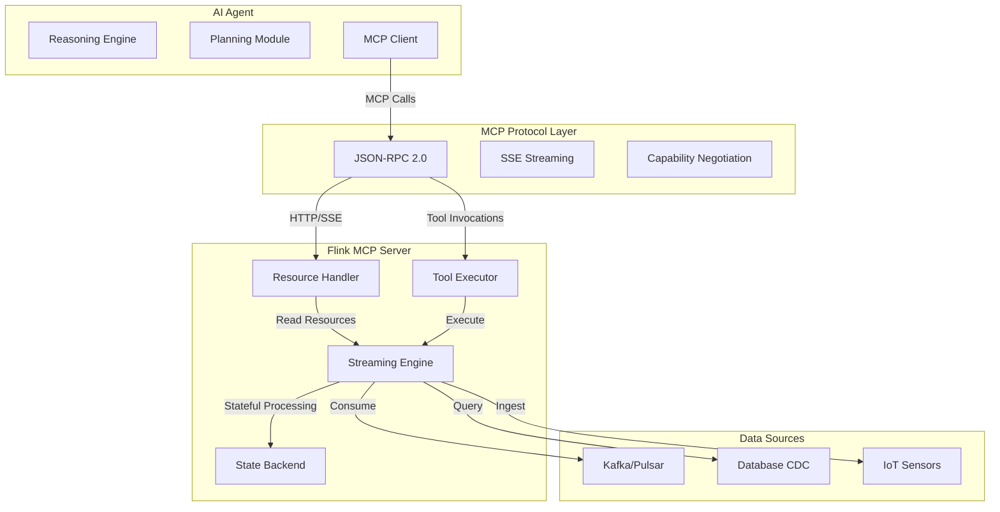
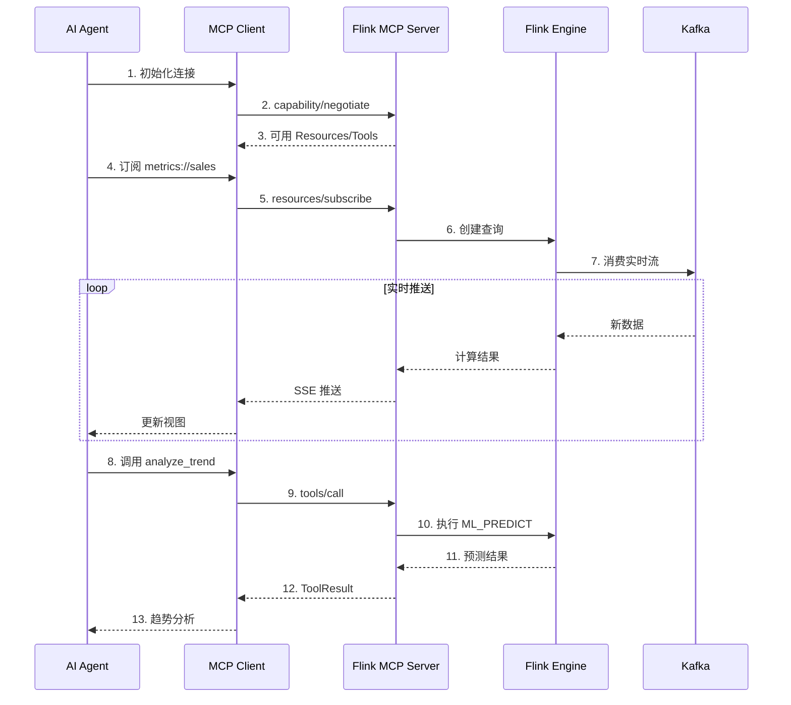
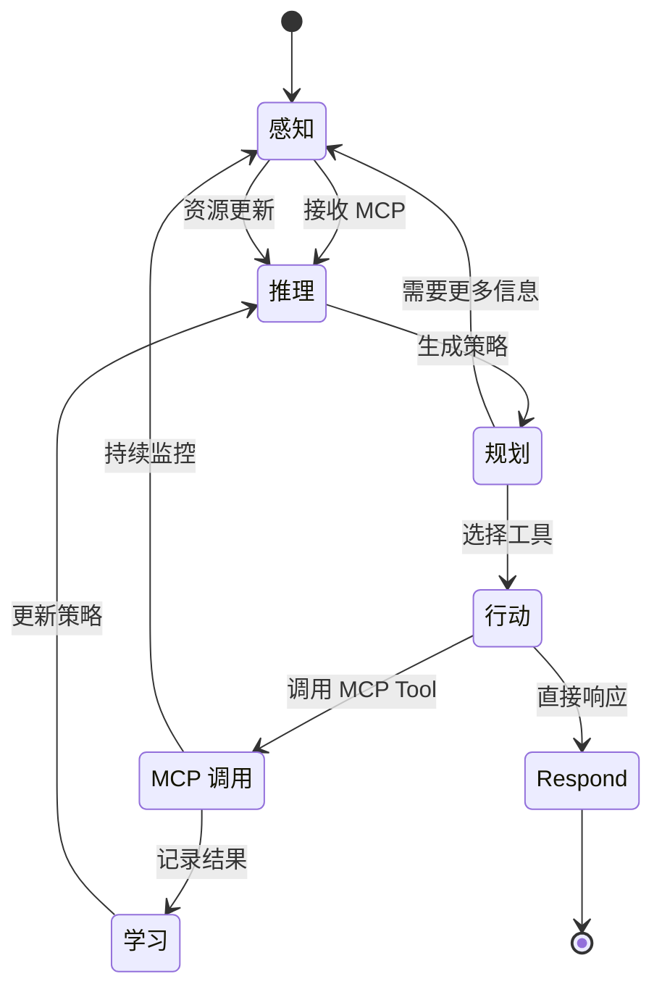
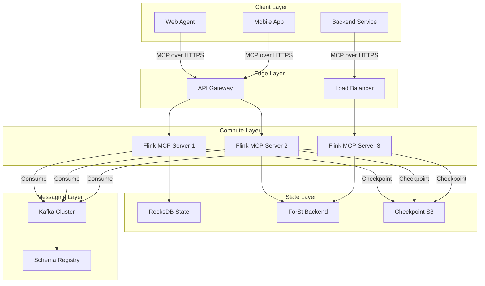

# MCP协议与流处理集成架构

> **状态**: ✅ MCP 已发布 | **预计发布时间**: 2026-06 (Flink 集成层仍为前瞻) | **最后更新**: 2026-04-21
>
> ⚠️ MCP 协议已由 Anthropic 官方发布并捐赠给 Linux Foundation AAIF 治理；Flink 作为 MCP Server 的集成模式仍处于工程验证阶段。

> 所属阶段: Knowledge/06-frontier | 前置依赖: [Flink LLM集成](./real-time-rag-architecture.md), [RAG架构](./real-time-rag-architecture.md) | 形式化等级: L3-L4

## 1. 概念定义 (Definitions)

### Def-K-06-220: Model Context Protocol (MCP)

**MCP** 是由 Anthropic 于 2024 年提出的开放协议标准，用于标准化 AI 模型与外部数据源、工具之间的上下文交互：

$$
\text{MCP} \triangleq \langle \mathcal{S}, \mathcal{C}, \mathcal{R}, \mathcal{T}, \mathcal{P} \rangle
$$

其中：

- $\mathcal{S}$: Server 集合，提供上下文能力
- $\mathcal{C}$: Client 集合，消费上下文服务
- $\mathcal{R}$: Resources，可读数据结构
- $\mathcal{T}$: Tools，可调用功能单元
- $\mathcal{P}$: Prompts，模板化提示

**关键特性**：

- 基于 JSON-RPC 2.0 传输
- 支持 Server-Sent Events (SSE) 流式传输
- 双向通信能力
- 类型安全的接口契约

### Def-K-06-221: MCP Server

**MCP Server** 是协议的提供方，暴露资源和工具能力：

```typescript
interface MCPServer {
  // 元数据
  name: string;
  version: string;

  // 能力声明
  capabilities: {
    resources?: boolean;
    tools?: boolean;
    prompts?: boolean;
    streaming?: boolean;
  };

  // 资源列表
  resources: Resource[];

  // 工具列表
  tools: Tool[];
}
```

**Flink 作为 MCP Server**：
Flink 流处理作业可包装为 MCP Server，将实时计算结果作为 Resources，将流处理算子作为 Tools 暴露。

### Def-K-06-222: MCP Client

**MCP Client** 是协议的消费方，连接并调用 Server 能力：

```typescript
interface MCPClient {
  // 连接管理
  connect(serverEndpoint: string): Promise<void>;
  disconnect(): Promise<void>;

  // 资源操作
  listResources(): Promise<Resource[]>;
  readResource(uri: string): Promise<ResourceContent>;
  subscribe(uri: string, callback: Handler): Promise<void>;

  // 工具调用
  listTools(): Promise<Tool[]>;
  callTool(name: string, args: object): Promise<ToolResult>;
}
```

### Def-K-06-223: Resources 与 Tools

**Resources** (上下文资源)：

- 只读数据结构
- 通过 URI 标识
- 支持订阅变更
- 示例：实时指标流、用户行为日志、传感器数据

**Tools** (可调用工具)：

- 可执行功能
- 带有输入输出 Schema
- 支持流式返回
- 示例：聚合查询、异常检测、预测推理

### Def-K-06-224: Streaming Context Flow

**流式上下文流** 定义为持续更新的上下文数据管道：

$$
\text{SCF} \triangleq \langle \mathcal{D}, \mathcal{F}, \Delta t \rangle
$$

其中：

- $\mathcal{D}$: 数据流 (Flink DataStream)
- $\mathcal{F}$: 上下文转换函数
- $\Delta t$: 更新间隔

### Def-K-06-225: Agent 工作流编排

**Agent Workflow** 是基于 MCP 的自动化决策流程：

```
感知 (Perception) → 推理 (Reasoning) → 行动 (Action) → 学习 (Learning)
        ↑___________________________________________|
```

## 2. 属性推导 (Properties)

### Lemma-K-06-210: MCP 协议延迟边界

**引理**: MCP 协议调用的端到端延迟满足：

$$
L_{\text{MCP}} \leq L_{\text{network}} + L_{\text{serialization}} + L_{\text{processing}} + L_{\text{stream}}
$$

其中 $L_{\text{stream}}$ 是流处理固有延迟 (通常 100ms-10s)。

**证明概要**:

- 网络延迟：典型 < 50ms (同区域)
- 序列化：JSON 解析 < 10ms
- 处理延迟：取决于工具复杂度
- 流延迟：Flink Checkpoint 周期

### Prop-K-06-210: 流式 Resource 新鲜度

**命题**: 通过 MCP 暴露的流式 Resource 的新鲜度受限于：

$$
\text{Freshness} = t_{\text{now}} - t_{\text{last\_checkpoint}}
$$

**工程意义**:

- 配置 `FRESHNESS INTERVAL` 控制更新频率
- 使用 `FOR SYSTEM_TIME AS OF` 查询历史版本

### Prop-K-06-211: Tool 调用幂等性

**命题**: 对于流数据派生的 Tool，在无状态设计下满足幂等性：

$$
\forall x: \text{Tool}(x) = \text{Tool}(\text{Tool}(x))
$$

**约束条件**:

- Tool 不修改外部状态
- 输入参数包含确定性时间戳
- 避免依赖外部可变状态

### Lemma-K-06-211: 并发 Tool 调用安全

**引理**: MCP 协议天然支持并发 Tool 调用，但需满足：

$$
\forall t_1, t_2 \in \mathcal{T}, t_1 \parallel t_2 \Rightarrow \text{State}(t_1) \cap \text{State}(t_2) = \emptyset
$$

**工程实践**:

- 使用 Flink KeyedProcessFunction 保证分区隔离
- 通过 state TTL 防止状态膨胀

## 3. 关系建立 (Relations)

### 3.1 MCP 与 Function Calling 对比

| 维度 | Function Calling | MCP Protocol |
|------|------------------|--------------|
| **标准化** | 各模型厂商自定义 | 开放标准 |
| **传输** | HTTP/模型特定 | JSON-RPC 2.0/SSE |
| **发现** | 静态定义 | 动态 capability 协商 |
| **双向** | 单向调用 | 双向 streaming |
| **生态** | 封闭 | 开放 Server 生态 |

### 3.2 流处理与 MCP 集成架构

```
┌─────────────────────────────────────────────────────────────────┐
│                        AI Agent (Client)                        │
│  ┌──────────────┐  ┌──────────────┐  ┌──────────────────────┐  │
│  │  Reasoning   │  │  Planning    │  │  Tool Use            │  │
│  │  Engine      │  │  Module      │  │  (MCP Client)        │  │
│  └──────────────┘  └──────────────┘  └──────────────────────┘  │
└───────────────────────────┬─────────────────────────────────────┘
                            │ MCP Protocol (JSON-RPC/SSE)
┌───────────────────────────┴─────────────────────────────────────┐
│                    Flink MCP Server                             │
│  ┌──────────────────────────────────────────────────────────┐  │
│  │                    Resources                              │  │
│  │  - Real-time Metrics    - User Events                    │  │
│  │  - Sensor Data          - Business KPIs                  │  │
│  └──────────────────────────────────────────────────────────┘  │
│  ┌──────────────────────────────────────────────────────────┐  │
│  │                      Tools                                │  │
│  │  - Aggregate Query      - Anomaly Detection              │  │
│  │  - Trend Analysis       - Prediction                     │  │
│  └──────────────────────────────────────────────────────────┘  │
│  ┌──────────────────────────────────────────────────────────┐  │
│  │              Flink Streaming Engine                       │  │
│  │  DataStream API / Table API / SQL                         │  │
│  └──────────────────────────────────────────────────────────┘  │
└─────────────────────────────────────────────────────────────────┘
```

### 3.3 架构层级映射

| 层级 | 组件 | 职责 |
|------|------|------|
| **L1: 协议层** | MCP JSON-RPC | 通信标准化 |
| **L2: 服务层** | MCP Server | 能力暴露 |
| **L3: 计算层** | Flink | 流处理 |
| **L4: 存储层** | Kafka/Pulsar | 数据持久化 |
| **L5: 源层** | IoT/日志/业务DB | 数据产生 |

### 3.4 MCP 生态现状与治理

MCP 由 Anthropic 于 2024-11 推出，并于 **2025-12** 由 Anthropic 捐赠给 **Linux Foundation Agentic AI Foundation (AAIF)** 治理[^1][^3]。截至 **2026-04**，MCP 生态规模达到 **97M+ 月 SDK 下载量**，公开 MCP 服务器数量超过 **5000+**，获 OpenAI、Google、Microsoft、Anthropic 等全平台支持[^2][^4][^5]。

#### Def-K-06-226: MCP Ecosystem

**MCP 生态系统** 定义为围绕 Model Context Protocol 形成的服务提供者、客户端宿主、工具开发者与治理机构的集合：

$$
\text{MCP-Eco} \triangleq \langle \mathcal{S}_{pub}, \mathcal{H}_{client}, \mathcal{D}_{tool}, \mathcal{G}_{AAIF} \rangle
$$

其中：

- $\mathcal{S}_{pub}$: 公共 MCP Server 集合（~5000+）
- $\mathcal{H}_{client}$: 宿主应用集合（IDE、聊天客户端等）
- $\mathcal{D}_{tool}$: 工具开发者社区
- $\mathcal{G}_{AAIF}$: Linux Foundation AAIF 治理机构

**治理特征**：

- 开放标准：协议规范由 AAIF 维护并持续演进
- 社区驱动：服务器注册、能力分类、安全审计由社区贡献
- 厂商中立：Anthropic 保留发起者角色，但协议决策由基金会主导

## 4. 论证过程 (Argumentation)

### 4.1 为什么用流处理作为 MCP Server？

**传统方案问题**:

- 轮询数据库：延迟高、负载大
- 静态文件：无实时性
- 消息队列：需要客户端理解队列语义

**流处理优势**:

- 持续计算：数据变化即时反映
- 复杂处理：窗口聚合、CEP、ML推理
- 水平扩展：处理能力随负载自动扩展
- 容错保证：Exactly-once 语义

### 4.2 反模式：避免的设计陷阱

**反模式 1: 过度暴露内部状态**

```python
# ❌ 错误:暴露原始状态句柄 @app.resource("state://internal")
def get_internal_state():
    return flink_state_backend.get_raw()  # 危险！
```

**反模式 2: 阻塞式 Tool 实现**

```python
# ❌ 错误:同步等待 Flink 结果 @app.tool()
def analyze_trend_blocking(params):
    result = flink_client.execute_sync(sql)  # 阻塞！
    return result
```

**反模式 3: 无界状态增长**

```python
# ❌ 错误:无 TTL 的状态 class StatefulTool:
    def __init__(self):
        self.cache = {}  # 持续增长！
```

## 5. 形式证明 / 工程论证

### Thm-K-06-145: 流式上下文一致性定理

**定理**: 在 Flink 作为 MCP Server 的架构中，客户端读取的 Resource 满足因果一致性：

$$
\forall r_1, r_2 \in \text{Resources}: \text{if } r_1 \prec r_2 \text{ then } \text{read}(r_1) \text{ before } \text{read}(r_2)
$$

**证明**:

1. Flink 的 Watermark 机制保证事件时间顺序
2. Checkpoint 屏障保证处理的一致性边界
3. MCP 的 SSE 传输保持消息顺序
4. 因此客户端观察到的顺序与事件因果一致

### Thm-K-06-146: Tool 调用安全性定理

**定理**: 在正确的安全配置下，MCP Tool 调用满足：

$$
\text{Isolated}(\text{Tool}_i) \land \text{Authenticated}(\text{Client}) \Rightarrow \text{Safe}(\text{Invocation})
$$

**工程实现**:

1. **隔离**: 使用 Flink Task Slot 隔离
2. **认证**: JWT Token 验证
3. **授权**: RBAC 权限检查
4. **限流**: Token Bucket 防止滥用

### Thm-K-06-147: 流式更新完整性定理

**定理**: 订阅 Resource 变更的客户端将接收到所有更新，无丢失、无重复：

$$
\forall u \in \text{Updates}: \Diamond \text{delivered}(u) \land \neg \exists u': \text{duplicate}(u, u')
$$

**依赖条件**:

- Flink Exactly-once 语义
- MCP 确认机制 (ACK)
- 持久化偏移量管理

## 6. 实例验证 (Examples)

### 6.1 Flink MCP Server 实现

```python
# mcp_flink_server.py from mcp.server.fastmcp import FastMCP
from pyflink.datastream import StreamExecutionEnvironment
import json

mcp = FastMCP("FlinkAnalytics")

# 定义实时指标 Resource @mcp.resource("metrics://realtime/sales")
def get_realtime_sales() -> str:
    """获取实时销售指标"""
    # 从 Flink 查询当前指标视图
    result = flink_table_env.execute_sql("""
        SELECT
            TUMBLE_START(event_time, INTERVAL '1' MINUTE) as window_start,
            SUM(amount) as total_sales,
            COUNT(*) as order_count
        FROM sales_events
        GROUP BY TUMBLE(event_time, INTERVAL '1' MINUTE)
    """)
    return json.dumps(result)

# 定义趋势分析 Tool @mcp.tool()
def analyze_sales_trend(time_range: str) -> dict:
    """
    分析销售趋势

    Args:
        time_range: 时间范围 (1h, 24h, 7d)
    """
    sql = f"""
        SELECT
            trend_direction,
            growth_rate,
            forecast_next_hour
        FROM ML_PREDICT(-- 注: ML_PREDICT 为实验性功能
            'sales_forecast_model',
            DESCRIPTOR(event_time)
        )
        WHERE window_time > NOW() - INTERVAL '{time_range}'
    """
    return flink_table_env.execute_sql(sql).fetch_all()

# 启动 Server if __name__ == "__main__":
    mcp.run(transport='sse')  # Server-Sent Events
```

### 6.2 MCP Client 使用示例

```python
# agent_client.py from mcp import ClientSession, StdioServerParameters
from mcp.client.stdio import stdio_client

async def run_agent():
    # 连接 Flink MCP Server
    server_params = StdioServerParameters(
        command="python",
        args=["mcp_flink_server.py"]
    )

    async with stdio_client(server_params) as (read, write):
        async with ClientSession(read, write) as session:
            # 初始化
            await session.initialize()

            # 列出可用 Resources
            resources = await session.list_resources()
            print(f"可用资源: {[r.uri for r in resources.resources]}")

            # 读取实时指标
            sales_data = await session.read_resource(
                "metrics://realtime/sales"
            )

            # 调用趋势分析 Tool
            trend_result = await session.call_tool(
                "analyze_sales_trend",
                {"time_range": "24h"}
            )

            # Agent 决策
            if trend_result["growth_rate"] > 0.1:
                await send_alert("销售增长超过 10%!")
```

### 6.3 流式数据订阅

```python
# streaming_subscription.py @mcp.resource("stream://events/user_activity")
async def subscribe_user_activity():
    """实时用户活动流"""
    # 创建 Flink DataStream
    env = StreamExecutionEnvironment.get_execution_environment()
    stream = env.from_source(
        KafkaSource.builder()
        .set_bootstrap_servers("kafka:9092")
        .set_topics("user-events")
        .build(),
        WatermarkStrategy.for_monotonous_timestamps(),
        "kafka-source"
    )

    # 实时处理并 SSE 推送
    async for event in stream:
        yield {
            "user_id": event["user_id"],
            "action": event["action"],
            "timestamp": event["timestamp"],
            "enriched": await enrich_user_data(event["user_id"])
        }
```

### 6.4 完整 Agent 工作流

```python
# agent_workflow.py class StreamingAnalyticsAgent:
    def __init__(self):
        self.mcp_client = MCPClient()
        self.llm = OpenAIChatModel()

    async def handle_user_query(self, query: str):
        """处理用户分析查询"""

        # 步骤 1: LLM 理解意图并规划工具调用
        plan = await self.llm.generate(
            f"基于可用工具,规划如何回答: {query}\n"
            f"可用工具: analyze_sales_trend, detect_anomaly, compare_metrics"
        )

        # 步骤 2: 执行工具调用 (通过 MCP)
        results = []
        for tool_call in plan.tool_calls:
            result = await self.mcp_client.call_tool(
                tool_call.name,
                tool_call.arguments
            )
            results.append(result)

        # 步骤 3: 订阅实时更新
        subscription = await self.mcp_client.subscribe(
            "metrics://realtime/sales"
        )

        # 步骤 4: 生成最终回答
        answer = await self.llm.generate(
            f"基于以下数据生成分析报告:\n"
            f"{results}\n"
            f"用户问题: {query}"
        )

        return answer, subscription

# 使用示例 async def main():
    agent = StreamingAnalyticsAgent()
    answer, live_feed = await agent.handle_user_query(
        "过去24小时销售趋势如何？有哪些异常？"
    )

asyncio.run(main())
```

## 7. 可视化 (Visualizations)

### 7.1 MCP-Flink 集成架构图



### 7.2 实时数据处理流程



### 7.3 Agent 决策工作流



### 7.4 部署拓扑图



## 8. 引用参考 (References)

[^1]: Anthropic, "Model Context Protocol", 2024-11. <https://modelcontextprotocol.io/>
[^2]: Linux Foundation AAIF, "MCP Ecosystem Report", 2026-03. <https://lf-ai-foundation.org/>
[^3]: Anthropic, "Anthropic Donates MCP to Linux Foundation Agentic AI Foundation", 2025-12. <https://www.anthropic.com/>
[^4]: digitalapplied.com / morphllm.com, "MCP Ecosystem Statistics", 2026-03.
