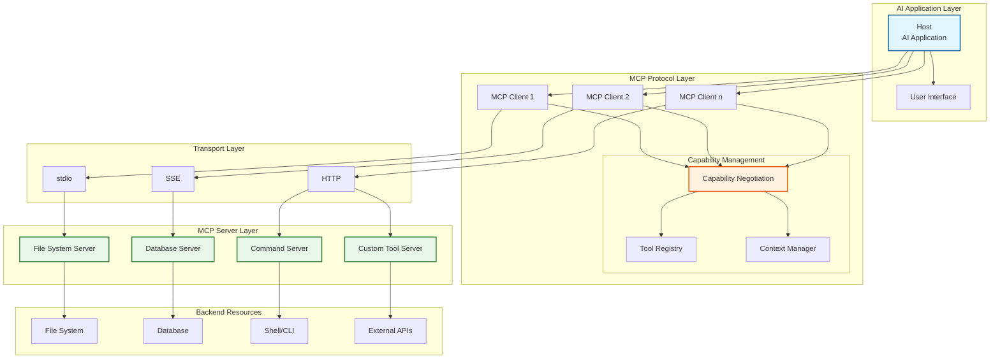
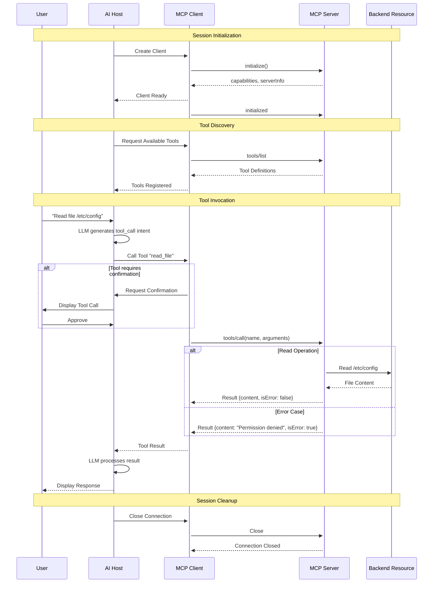
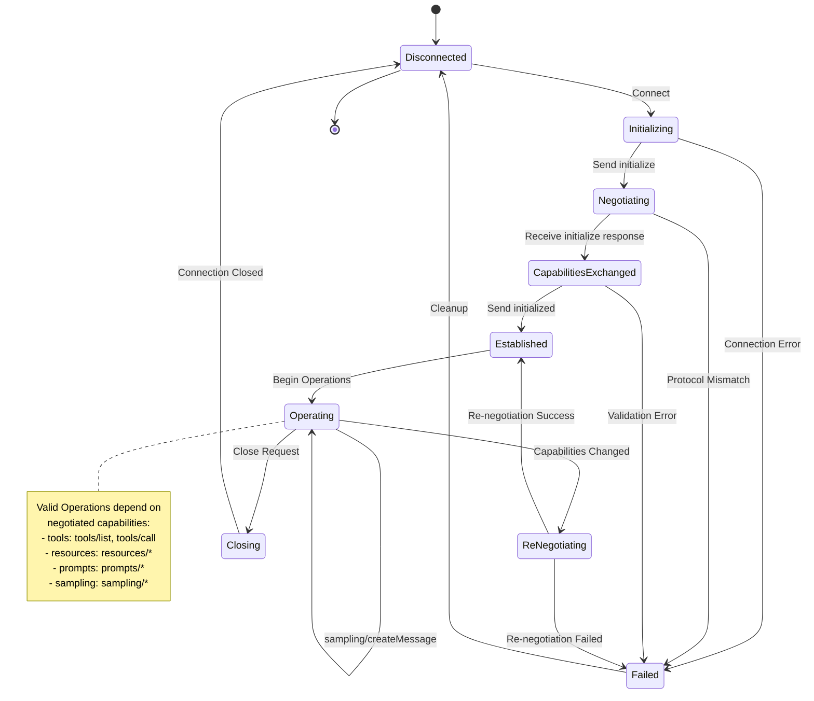
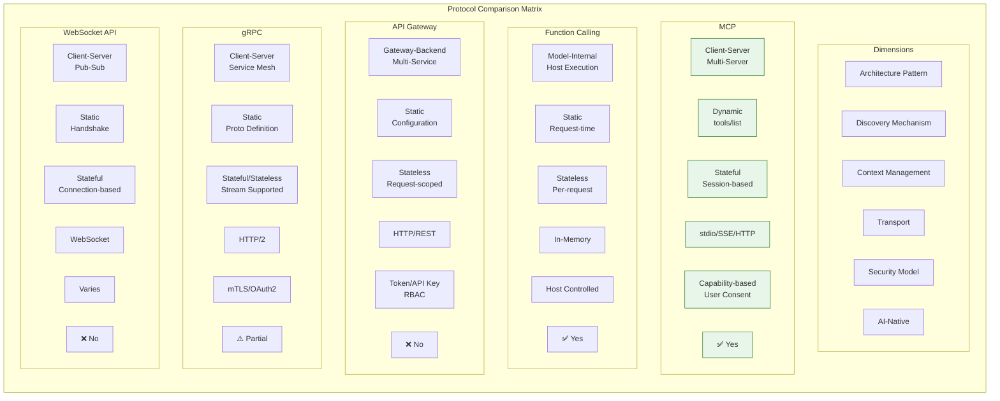

# MCP协议形式化规范

> 所属阶段: Knowledge/Frontier | 前置依赖: [06-frontier/ai-agent-architecture.md], [02-design-patterns/agent-tool-integration.md] | 形式化等级: L5 (工程形式化)

**文档版本**: v1.0 | **协议版本**: MCP 2024-11-05 | **最后更新**: 2026-04-12

---

## 目录

- [MCP协议形式化规范](#mcp协议形式化规范)
  - [目录](#目录)
  - [摘要](#摘要)
  - [1. 概念定义 (Definitions)](#1-概念定义-definitions)
    - [1.1 协议概述](#11-协议概述)
    - [Def-K-MCP-01: MCP协议架构定义](#def-k-mcp-01-mcp协议架构定义)
    - [Def-K-MCP-02: 工具发现机制形式化](#def-k-mcp-02-工具发现机制形式化)
    - [Def-K-MCP-03: 上下文传递语义](#def-k-mcp-03-上下文传递语义)
    - [Def-K-MCP-04: 能力协商协议](#def-k-mcp-04-能力协商协议)
    - [Def-K-MCP-05: 安全边界模型](#def-k-mcp-05-安全边界模型)
  - [2. 属性推导 (Properties)](#2-属性推导-properties)
    - [2.1 协议核心性质](#21-协议核心性质)
    - [Prop-K-MCP-01: 工具调用原子性](#prop-k-mcp-01-工具调用原子性)
    - [Prop-K-MCP-02: 上下文一致性保证](#prop-k-mcp-02-上下文一致性保证)
    - [Prop-K-MCP-03: 协议可组合性](#prop-k-mcp-03-协议可组合性)
    - [Lemma-K-MCP-01: 能力匹配引理](#lemma-k-mcp-01-能力匹配引理)
  - [3. 关系建立 (Relations)](#3-关系建立-relations)
    - [3.1 MCP与相关技术的关系](#31-mcp与相关技术的关系)
    - [MCP vs Function Calling 对比](#mcp-vs-function-calling-对比)
    - [MCP vs API Gateway 对比](#mcp-vs-api-gateway-对比)
    - [MCP与流计算集成模式](#mcp与流计算集成模式)
  - [4. 论证过程 (Argumentation)](#4-论证过程-argumentation)
    - [4.1 协议设计选择论证](#41-协议设计选择论证)
      - [选择1：JSON-RPC 2.0 vs gRPC](#选择1json-rpc-20-vs-grpc)
      - [选择2：stdio vs 网络传输](#选择2stdio-vs-网络传输)
    - [4.2 边界条件分析](#42-边界条件分析)
      - [工具名称冲突](#工具名称冲突)
      - [消息大小限制](#消息大小限制)
      - [并发调用限制](#并发调用限制)
  - [5. 形式证明 / 工程论证 (Proof / Engineering Argument)](#5-形式证明--工程论证-proof--engineering-argument)
    - [Thm-K-MCP-01: 协议一致性定理](#thm-k-mcp-01-协议一致性定理)
    - [Thm-K-MCP-02: 安全隔离保证（工程论证）](#thm-k-mcp-02-安全隔离保证工程论证)
  - [6. 实例验证 (Examples)](#6-实例验证-examples)
    - [6.1 完整MCP会话示例](#61-完整mcp会话示例)
      - [步骤1：初始化](#步骤1初始化)
      - [步骤2：工具发现](#步骤2工具发现)
      - [步骤3：工具调用](#步骤3工具调用)
      - [步骤4：资源订阅](#步骤4资源订阅)
    - [6.2 MCP Server实现示例（Python）](#62-mcp-server实现示例python)
    - [6.3 MCP与Flink集成示例](#63-mcp与flink集成示例)
  - [7. 可视化 (Visualizations)](#7-可视化-visualizations)
    - [7.1 MCP协议栈架构图](#71-mcp协议栈架构图)
    - [7.2 工具调用时序图](#72-工具调用时序图)
    - [7.3 能力协商状态机](#73-能力协商状态机)
    - [7.4 协议对比矩阵](#74-协议对比矩阵)
  - [8. 引用参考 (References)](#8-引用参考-references)
  - [附录A: MCP消息类型速查表](#附录a-mcp消息类型速查表)
    - [A.1 客户端到服务器的消息](#a1-客户端到服务器的消息)
    - [A.2 服务器到客户端的消息](#a2-服务器到客户端的消息)
    - [A.3 错误代码](#a3-错误代码)
  - [附录B: 术语表](#附录b-术语表)

## 摘要

本文档提供Model Context Protocol (MCP) 的完整形式化规范，涵盖协议架构、工具发现机制、上下文传递语义、能力协商协议和安全边界模型。
通过严格的定义和工程论证，建立MCP协议的一致性保证、安全隔离特性和可组合性原理，为AI Agent与工具集成的标准化实现提供理论基础。

**关键词**: MCP, AI Agent, 工具集成, 上下文协议, 能力协商, 安全边界

---

## 1. 概念定义 (Definitions)

### 1.1 协议概述

Model Context Protocol (MCP) 是Anthropic提出的一种开放协议，用于标准化AI模型与外部数据源、工具之间的集成。
MCP采用客户端-服务器架构，通过JSON-RPC 2.0作为传输协议，实现能力的动态发现和上下文的双向传递。

MCP的核心设计哲学是将**工具提供**与**工具消费**解耦：任何实现MCP服务器接口的数据源或工具集，都可以被任何兼容的AI客户端（Host）调用，而无需针对特定模型或平台进行定制开发。

### Def-K-MCP-01: MCP协议架构定义

**定义（MCP协议架构）**：MCP协议架构是一个五元组

$$\mathcal{MCP} = (H, C, S, R, P)$$

其中各组件定义如下：

| 组件 | 符号 | 定义域 | 语义说明 |
|------|------|--------|----------|
| Host | $H$ | AI宿主程序 | 发起MCP会话的AI应用（如Claude Desktop, IDE插件） |
| Client | $C$ | MCP客户端 | Host内嵌的协议实现，管理与服务器的连接 |
| Server | $S$ | MCP服务器 | 提供工具/资源的外部服务进程 |
| Resource | $R$ | 资源集合 | 可被访问的数据实体（文件、数据库、API等） |
| Protocol | $P$ | 协议规范 | JSON-RPC 2.0 + MCP特定消息类型 |

**架构层次**：

$$
\text{MCP协议栈} = \underbrace{\text{Transport Layer}}_{\text{stdio/sse/http}} \circ \underbrace{\text{JSON-RPC 2.0}}_{\text{消息格式}} \circ \underbrace{\text{MCP Primitives}}_{\text{Tools/Resources/Prompts}} \circ \underbrace{\text{Capability Layer}}_{\text{协商与发现}}
$$

**客户端-服务器关系**：

一个Host可以包含多个Client，每个Client连接到一个Server：

$$H \vDash \{C_1, C_2, ..., C_n\}, \quad \forall i: C_i \xrightarrow{\text{connect}} S_i$$

其中 $\vDash$ 表示"包含"关系，$\xrightarrow{\text{connect}}$ 表示建立协议连接。

**连接生命周期**：

$$\text{Lifecycle} = \text{initialize} \rightarrow \text{negotiate} \rightarrow \text{operate} \rightarrow \text{terminate}$$

每个阶段都有严格的协议消息交换规范。

### Def-K-MCP-02: 工具发现机制形式化

**定义（工具）**：MCP中的工具是一个六元组

$$T = (name, description, inputSchema, outputSchema, annotations, handler)$$

其中：

- $name \in \Sigma^*$：工具的唯一标识符，遵循 `[a-zA-Z0-9_-]+` 模式
- $description \in \Sigma^*$：人类可读的工具功能描述
- $inputSchema \in JSONSchema$：符合JSON Schema Draft 7的输入参数规范
- $outputSchema \in JSONSchema$：输出结果的JSON Schema定义
- $annotations \in \mathcal{P}(\{readOnly, destructive, idempotent, openWorld\})$：行为注解集合
- $handler \in (Input \rightarrow Output)$：工具的实际执行函数（实现层）

**定义（工具注册表）**：服务器 $S$ 维护的工具集合为

$$\mathcal{T}_S = \{T_1, T_2, ..., T_m\}, \quad m = |\mathcal{T}_S|$$

**工具发现协议**：

工具发现通过 `tools/list` 方法实现，遵循请求-响应模式：

$$
\frac{C \xrightarrow{\text{tools/list}} S \quad S \text{ has } \mathcal{T}_S}{S \xrightarrow{\{\text{tools}: \mathcal{T}_S\}} C}
\quad (\text{Tool-Discovery})
$$

**工具调用协议**：

工具调用通过 `tools/call` 方法实现：

$$
\frac{C \xrightarrow{\text{tools/call}(name, arguments)} S \quad T \in \mathcal{T}_S \quad T.name = name \quad arguments \vDash T.inputSchema}{S \xrightarrow{\text{execute}(T.handler, arguments) \rightarrow result} C}
\quad (\text{Tool-Call})
$$

其中 $arguments \vDash T.inputSchema$ 表示参数通过JSON Schema验证。

**工具变更通知**：

当服务器工具集合发生变化时，通过 `notifications/tools/list_changed` 主动通知客户端：

$$\frac{\mathcal{T}_S \xrightarrow{\Delta} \mathcal{T}'_S}{S \xrightarrow{\text{notifications/tools/list\_changed}} C}$$

### Def-K-MCP-03: 上下文传递语义

**定义（上下文）**：MCP中的上下文是一个随时间演化的状态容器

$$\mathcal{X} = (M, R, P, t)$$

其中：

- $M = [m_1, m_2, ..., m_k]$：消息历史序列，每个 $m_i = (role, content, metadata)$
- $R \subseteq \mathcal{R}$：当前会话中已附加的资源集合
- $P \subseteq \mathcal{P}$：已加载的提示模板集合
- $t \in \mathbb{N}$：逻辑时间戳，单调递增

**定义（资源）**：资源是四元组

$$r = (uri, mimeType, text/binary, metadata)$$

资源通过URI唯一标识，支持 `resources/read` 读取和 `resources/subscribe` 订阅变更。

**上下文传递操作**：

上下文在Host、Client、Server之间通过以下原语传递：

| 原语 | 方向 | 语义 |
|------|------|------|
| `prompts/get` | C→S | 从服务器获取提示模板 |
| `resources/read` | C→S | 读取资源内容 |
| `resources/subscribe` | C→S | 订阅资源变更通知 |
| `notifications/resources/updated` | S→C | 资源更新通知 |
| `sampling/createMessage` | S→C→H | 服务器请求LLM采样（用户确认后）|

**上下文一致性条件**：

对于任意上下文项 $x \in \mathcal{X}$，必须满足：

$$\forall t_1, t_2: t_1 < t_2 \Rightarrow \mathcal{X}_{t_1} \preceq \mathcal{X}_{t_2}$$

其中 $\preceq$ 表示前缀序（历史一致性）。

### Def-K-MCP-04: 能力协商协议

**定义（能力）**：MCP能力是协议功能的声明式描述

$$\mathcal{Cap} = (protocolVersion, capabilities, clientInfo/serverInfo)$$

其中 $capabilities$ 是能力集合：

$$
capabilities = \{
    \text{tools}: \{listChanged: bool\},
    \text{resources}: \{subscribe: bool, listChanged: bool\},
    \text{prompts}: \{listChanged: bool\},
    \text{sampling}: \{
        \text{createMessage}: bool,
        \text{models}: [ModelCapability]
    \},
    \text{logging}: \{
        \text{setLevel}: bool,
        \text{levels}: [debug, info, notice, warning, error, critical, alert, emergency]
    \}
\}
$$

**能力协商过程**：

能力协商在初始化阶段完成，采用三次握手模式：

$$
\begin{aligned}
\text{Step 1:} &\quad C \xrightarrow{\text{initialize}(\mathcal{Cap}_C)} S \\
\text{Step 2:} &\quad S \xrightarrow{\text{initialize}(\mathcal{Cap}_S)} C \\
\text{Step 3:} &\quad C \xrightarrow{\text{initialized}} S
\end{aligned}
$$

**协商结果**：

协商后的有效能力为交集：

$$\mathcal{Cap}_{effective} = \mathcal{Cap}_C \cap \mathcal{Cap}_S$$

对于每个能力 $c$，仅当双方均声明支持时才启用：

$$enabled(c) \Leftrightarrow c \in \mathcal{Cap}_C \land c \in \mathcal{Cap}_S$$

**协议版本协商**：

$$
version_{effective} = \min(version_C, version_S)
$$

向后兼容要求：$version_{effective} \geq 2024-11-05$

### Def-K-MCP-05: 安全边界模型

**定义（安全边界）**：MCP安全边界是一个访问控制框架

$$\mathcal{Sec} = (Identity, Authentication, Authorization, Audit, Sandboxing)$$

**身份模型**：

$$
Identity = \{
    hostId: UUID,      \text{// Host唯一标识}
    clientId: UUID,    \text{// Client会话标识}
    serverId: UUID,    \text{// Server实例标识}
    userId: String     \text{// 终端用户标识（可选）}
\}
$$

**认证机制**：

MCP本身不规定传输层认证，依赖底层机制：

$$Auth_{transport} \in \{OAuth2, mTLS, UnixSocket, stdio\}$$

**授权模型**（基于能力的访问控制）：

$$
\frac{request(r) \quad r \in \mathcal{Cap}_{effective} \quad userConsent(r)}{authorize(request)}
\quad (\text{Capability-AuthZ})
$$

**用户同意机制**：

对于敏感操作（如sampling、文件写入），需要显式用户确认：

$$\frac{op \in \text{SensitiveOps} \quad \neg userConfirm(op)}{\neg authorize(op)}$$

**沙箱边界**：

$$
Sandbox = \{
    filesystem: \text{chroot/path-whitelist},
    network: \text{egress-filtering},
    execution: \text{timeout/resource-limits}
\}
$$

**数据隔离**：

服务器之间完全隔离：

$$\forall S_i, S_j: i \neq j \Rightarrow \mathcal{X}_{S_i} \cap \mathcal{X}_{S_j} = \emptyset$$

---

## 2. 属性推导 (Properties)

### 2.1 协议核心性质

基于第一章的定义，我们可以推导出MCP协议的关键性质，这些性质保证了协议的正确性和可靠性。

### Prop-K-MCP-01: 工具调用原子性

**命题（工具调用原子性）**：单个工具调用操作具有原子性语义

$$
\forall T \in \mathcal{T}_S: atomic(call(T))
$$

即对于工具 $T$ 的每次调用，要么完全成功并返回结果，要么完全失败并返回错误，不存在部分完成的状态。

**形式化描述**：

设工具调用操作为 $\delta_T: State \rightarrow State$，则：

$$\forall s \in State: \delta_T(s) = s' \lor \delta_T(s) = \bot$$

其中 $s'$ 是新的确定状态，$\bot$ 表示错误状态。

**证明概要**：

1. JSON-RPC 2.0请求-响应模型天然具有原子性
2. 单次 `tools/call` 请求对应单次执行
3. 服务器内部实现负责保证 $T.handler$ 的原子性
4. 网络超时按错误处理，触发幂等重试或错误返回

**边界情况**：

- 超时：客户端设置 `timeout`，超时后视为失败
- 网络分区：通过幂等性注解判断是否可以安全重试
- 服务器崩溃：调用状态不可知，依赖幂等性设计

**工程实现要求**：

工具开发者应通过 `annotations` 声明行为特性：

```json
{
  "annotations": {
    "readOnly": false,
    "destructive": true,
    "idempotent": true,
    "openWorld": false
  }
}
```

### Prop-K-MCP-02: 上下文一致性保证

**命题（上下文一致性）**：在单次会话内，上下文历史满足因果一致性

$$
\forall m_i, m_j \in M: i < j \Rightarrow m_i \prec m_j
$$

其中 $\prec$ 表示 happens-before 关系。

**因果一致性条件**：

1. **消息顺序保持**：服务器接收的消息顺序与客户端发送顺序一致
2. **通知因果性**：资源变更通知 ($\text{notify}$) 发生在变更 ($\text{change}$) 之后

$$
change(r) \prec notify(r)
$$

1. **采样因果链**：采样请求依赖于前置上下文

$$
context_t \prec sampling\_request \prec sampling\_response
$$

**实现保证**：

- JSON-RPC 2.0的Request ID保证请求-响应配对
- 单一TCP/stdio连接保证消息顺序
- 服务器端资源版本号保证变更可追踪

### Prop-K-MCP-03: 协议可组合性

**命题（协议可组合性）**：多个MCP服务器可以组合形成统一的工具集合

$$
\mathcal{T}_{composite} = \bigcup_{i=1}^{n} \mathcal{T}_{S_i}
$$

且组合后的系统仍满足MCP协议规范。

**组合形式化**：

设 $n$ 个服务器 $S_1, S_2, ..., S_n$ 分别连接到Host的不同Client，则：

$$H \vDash \{C_1/S_1, C_2/S_2, ..., C_n/S_n\}$$

$$\mathcal{T}_{total} = \mathcal{T}_{S_1} \uplus \mathcal{T}_{S_2} \uplus ... \uplus \mathcal{T}_{S_n}$$

其中 $\uplus$ 表示带命名空间前缀的不交并。

**命名空间隔离**：

为避免工具名冲突，Host可采用命名空间前缀：

$$qualified\_name(T) = server\_name + "/" + T.name$$

**组合保持的性质**：

1. 每个服务器的工具调用独立性保持不变
2. 服务器之间无直接通信，隔离性保持
3. 各服务器的上下文独立维护

### Lemma-K-MCP-01: 能力匹配引理

**引理（能力匹配）**：只有当客户端和服务器就某能力达成一致时，该能力相关的操作才能成功执行

$$
\forall op \in Operations: executable(op) \Leftrightarrow capability(op) \in \mathcal{Cap}_{effective}
$$

**证明**：

$(\Rightarrow)$ 假设 $executable(op)$ 但 $capability(op) \notin \mathcal{Cap}_{effective}$。

根据协商定义，$\mathcal{Cap}_{effective} = \mathcal{Cap}_C \cap \mathcal{Cap}_S$。

若 $capability(op) \notin \mathcal{Cap}_{effective}$，则至少一方不支持该能力。

- 若服务器不支持，收到操作请求后将返回 `Method not found` 错误
- 若客户端不支持，不会发送相关操作请求

两种情况均导致 $op$ 无法成功执行，与假设矛盾。

$(\Leftarrow)$ 若 $capability(op) \in \mathcal{Cap}_{effective}$，则双方均支持该能力。

根据协议规范，支持的能力有明确的请求-响应定义，操作可以正常执行。

$\square$

**推论**：能力协商是协议正确运行的前提条件，必须在初始化阶段完成。

---

## 3. 关系建立 (Relations)

### 3.1 MCP与相关技术的关系

MCP不是孤立存在的协议，它与现有的函数调用机制、API网关以及流计算系统有着深刻的联系和区别。
理解这些关系有助于正确地架构和设计AI Agent系统。

### MCP vs Function Calling 对比

Function Calling（函数调用）是大型语言模型（LLM）提供的内置机制，允许模型在生成响应时"调用"预定义的函数。
MCP与Function Calling既有相似之处，也存在关键差异。

**功能映射关系**：

| 维度 | Function Calling | MCP |
|------|------------------|-----|
| 架构位置 | 模型内部机制 | 外部协议标准 |
| 工具定义 | 每次请求传递 | 服务器端注册，动态发现 |
| 执行方式 | 模型返回调用请求，Host执行 | Host通过Client调用Server |
| 上下文管理 | 单次请求内 | 跨请求持久会话 |
| 生态开放性 | 模型厂商定义 | 开放协议，多厂商支持 |
| 传输方式 | 无（内存传递）| stdio/sse/http |

**形式化对比**：

$$
\begin{aligned}
\text{Function Calling} &= (LLM, \mathcal{F}_{static}, \text{inference-time}) \\
\text{MCP} &= (H \circ C \circ S, \mathcal{T}_{dynamic}, \text{session-based})
\end{aligned}
$$

**互补关系**：

MCP与Function Calling并非替代关系，而是互补关系：

$$\text{MCP} \oplus \text{Function Calling} = \text{增强的AI Agent能力}$$

在实际架构中：

1. LLM输出函数调用意图（Function Calling格式）
2. Host解析意图，映射到MCP工具调用
3. MCP Server执行实际工具操作
4. 结果返回给LLM继续推理

**转换关系**：

MCP工具可以转换为Function Calling格式：

$$\text{MCP Tool} \xrightarrow{\text{convert}} \text{Function Calling Schema}$$

转换函数：

$$
convert(T) = \{
    name: T.name,
    description: T.description,
    parameters: T.inputSchema
\}
$$

### MCP vs API Gateway 对比

API Gateway是传统微服务架构中的关键组件，负责请求路由、负载均衡、认证授权等。
MCP与API Gateway在功能上有一定重叠，但设计目标不同。

**架构定位对比**：

```
┌─────────────────────────────────────────────────────────────┐
│                    API Gateway Pattern                       │
├─────────────────────────────────────────────────────────────┤
│                                                              │
│   Client ──► API Gateway ──► [Service A, Service B, ...]    │
│              (路由/认证/限流)                                  │
│                                                              │
└─────────────────────────────────────────────────────────────┘

┌─────────────────────────────────────────────────────────────┐
│                      MCP Pattern                             │
├─────────────────────────────────────────────────────────────┤
│                                                              │
│   Host ──► MCP Client ──► [MCP Server A, MCP Server B, ...] │
│   (AI应用)    (协议客户端)        (工具提供者)                  │
│                                                              │
└─────────────────────────────────────────────────────────────┘
```

**功能对比矩阵**：

| 功能 | API Gateway | MCP |
|------|-------------|-----|
| 请求路由 | ✅ 核心功能 | ⚠️ Host管理 |
| 负载均衡 | ✅ 支持 | ❌ 不涉及 |
| 认证授权 | ✅ 集中处理 | ⚠️ 依赖传输层 |
| 协议转换 | ✅ 支持 | ❌ 单一协议 |
| 工具发现 | ❌ 不支持 | ✅ 核心功能 |
| 上下文传递 | ❌ 无状态 | ✅ 有状态会话 |
| AI原生设计 | ❌ 否 | ✅ 是 |
| 能力协商 | ❌ 不支持 | ✅ 核心功能 |

**集成模式**：

MCP Server可以与API Gateway共存：

$$
\text{MCP Client} \rightarrow \text{API Gateway} \rightarrow \text{MCP Server}
$$

这种模式下：

- API Gateway处理认证、限流、路由
- MCP Server专注于工具实现
- 保持MCP协议语义完整性

### MCP与流计算集成模式

MCP协议与流计算系统（如Apache Flink）可以形成强大的组合，实现AI驱动的实时数据处理。

**集成架构**：

```
┌─────────────────────────────────────────────────────────────┐
│              MCP-Flink Integration Architecture              │
├─────────────────────────────────────────────────────────────┤
│                                                              │
│   ┌─────────┐    ┌─────────────┐    ┌──────────────────┐   │
│   │ AI Host │◄──►│ MCP Client  │◄──►│ Flink MCP Server │   │
│   │(Claude) │    │             │    │                  │   │
│   └─────────┘    └─────────────┘    └────────┬─────────┘   │
│                                              │              │
│                                              ▼              │
│                                      ┌───────────────┐      │
│                                      │  Flink Cluster │      │
│                                      │               │      │
│                                      │ ┌───────────┐ │      │
│                                      │ │  JobManager │ │      │
│                                      │ └─────┬─────┘ │      │
│                                      │       │       │      │
│                                      │  ┌────┴────┐  │      │
│                                      │  │TaskManager│  │      │
│                                      │  └─────────┘  │      │
│                                      └───────────────┘      │
│                                                              │
└─────────────────────────────────────────────────────────────┘
```

**集成场景**：

| 场景 | MCP角色 | 流计算角色 |
|------|---------|------------|
| 智能告警分析 | 分析告警内容，推荐处理策略 | 实时告警流处理 |
| 动态规则生成 | 基于数据特征生成Flink SQL | 执行生成的SQL作业 |
| 异常检测 | 解释异常模式，建议根因 | 实时异常检测算子 |
| 数据血缘追踪 | 查询血缘关系，可视化展示 | 元数据实时采集 |

**数据流向**：

$$
\text{Source} \xrightarrow{\text{stream}} \text{Flink} \xrightarrow{\text{window/CEP}} \text{Alert} \xrightarrow{\text{MCP}} \text{AI Agent} \xrightarrow{\text{decision}} \text{Action}
$$

**实现模式**：

1. **Flink as MCP Server**：Flink作业暴露MCP接口，提供查询作业状态、提交新作业、获取指标等工具
2. **MCP Client in Flink**：Flink算子内嵌MCP Client，向AI服务发送请求（如sampling）
3. **双向集成**：Flink作业通过MCP与AI Agent交互，实现自适应数据处理

---

## 4. 论证过程 (Argumentation)

### 4.1 协议设计选择论证

MCP协议在设计时面临多个关键选择，本节论证这些选择的合理性。

#### 选择1：JSON-RPC 2.0 vs gRPC

**论证**：MCP选择JSON-RPC 2.0而非gRPC的原因：

| 因素 | JSON-RPC 2.0 | gRPC |
|------|--------------|------|
| 人类可读性 | ✅ JSON文本 | ❌ 二进制Protobuf |
| 实现复杂度 | ✅ 简单 | ⚠️ 需要代码生成 |
| 多语言支持 | ✅ 广泛 | ✅ 广泛 |
| 传输灵活性 | ✅ stdio/http/sse | ⚠️ 主要HTTP/2 |
| 调试便利性 | ✅ 直接抓包 | ❌ 需要工具 |

**结论**：对于AI Agent场景，调试便利性和人类可读性优先，JSON-RPC 2.0更合适。

#### 选择2：stdio vs 网络传输

**论证**：MCP同时支持stdio和网络传输（SSE/HTTP）：

**stdio模式**：

- 适用场景：本地工具、CLI集成
- 优点：简单、无网络配置、天然沙箱
- 形式化：$Server \in LocalProcess, Comm = Stdin/Stdout$

**SSE/HTTP模式**：

- 适用场景：远程服务、多租户部署
- 优点：可扩展、支持认证、负载均衡
- 形式化：$Server \in RemoteHost, Comm = HTTP$

**选择3：能力协商的必要性**

**论证**：为什么必须在初始化阶段协商能力？

1. **避免运行时错误**：提前知道双方支持的功能，避免调用不存在的方法
2. **优化通信**：不广播不需要的通知，减少网络开销
3. **版本兼容性**：明确协议版本，处理行为差异

**反例分析**：如果不协商能力

- 客户端请求 `resources/subscribe`
- 服务器不支持，返回错误
- 用户体验：功能时可用时不可用
- 开发者体验：需要try-catch所有调用

### 4.2 边界条件分析

#### 工具名称冲突

**问题**：多个服务器提供同名工具时如何处理？

**分析**：

设 $\mathcal{T}_{S_1}$ 和 $\mathcal{T}_{S_2}$ 都包含工具名为 `query`：

$$T_1 \in \mathcal{T}_{S_1}, T_2 \in \mathcal{T}_{S_2}, T_1.name = T_2.name = \text{"query"}$$

**解决方案**：

1. **命名空间前缀**：`server1/query` 和 `server2/query`
2. **显式选择**：Host提示用户选择服务器
3. **优先级规则**：按服务器注册顺序或配置优先级

#### 消息大小限制

**问题**：大资源（如大型日志文件）如何传递？

**边界**：JSON-RPC消息通常有大小限制（如10MB）

**解决方案**：

1. **分页读取**：`resources/read` 支持offset/limit参数
2. **流式传输**：大文件通过多个消息分块传输
3. **URI引用**：传递临时URL而非完整内容

#### 并发调用限制

**问题**：客户端可以并发调用多个工具吗？

**分析**：

- JSON-RPC 2.0支持批量请求（batch）
- MCP规范未禁止并发调用
- 但服务器实现可能限制并发数

**最佳实践**：

- 无关工具调用可以并发
- 有依赖关系的调用必须串行
- 关注服务器的 `annotations` 了解并发安全性

---

## 5. 形式证明 / 工程论证 (Proof / Engineering Argument)

### Thm-K-MCP-01: 协议一致性定理

**定理（协议一致性）**：遵循MCP规范实现的客户端和服务器，在能力协商成功后，能够正确地完成所有声明支持的操作，且操作结果符合协议语义。

**形式化陈述**：

设 $C$ 和 $S$ 分别为符合MCP规范的客户端和服务器，$\mathcal{Cap}_{effective}$ 为协商后的有效能力集，则：

$$
\forall op \in Ops(\mathcal{Cap}_{effective}): \Diamond success(op) \land \square valid(result(op))
$$

其中：

- $\Diamond$ 表示"最终"（时序逻辑）
- $\square$ 表示"总是"（时序逻辑）
- $Ops(\mathcal{Cap})$ 为能力 $c$ 支持的操作集合
- $success(op)$ 表示操作成功完成
- $valid(result(op))$ 表示结果符合模式约束

**证明（结构归纳法）**：

**基础情况（初始化）**：

根据协议规范，初始化序列：

$$
C \xrightarrow{\text{initialize}} S \xrightarrow{\text{initialize}} C \xrightarrow{\text{initialized}} S
$$

每条消息都有明确的JSON Schema约束。实现符合规范意味着：

- 消息格式正确
- 字段类型匹配
- 响应码符合预期

因此初始化必然成功：$success(\text{initialize})$

**归纳步骤（操作保持）**：

假设对于前 $k$ 个操作，定理成立。考虑第 $k+1$ 个操作 $op_{k+1}$。

根据引理-K-MCP-01（能力匹配），$op_{k+1}$ 能被调用意味着：

$$capability(op_{k+1}) \in \mathcal{Cap}_{effective}$$

根据协议规范，每个操作有：

1. 请求Schema约束
2. 响应Schema约束
3. 错误处理规范

客户端和服务器实现均符合规范，因此：

- 请求解析正确
- 业务逻辑执行正确
- 响应生成正确

故 $success(op_{k+1}) \land valid(result(op_{k+1}))$ 成立。

**一致性保证**：

对于并发操作，JSON-RPC的Request ID保证请求-响应配对：

$$\forall req: unique(req.id) \Rightarrow correct\_match(req, resp)$$

**结论**：

由结构归纳法，对于所有声明支持的操作，定理成立。$\square$

**工程推论**：

1. 实现者应严格遵循协议规范进行开发
2. 测试套件应覆盖所有声明的能力组合
3. 版本升级时需重新协商能力

### Thm-K-MCP-02: 安全隔离保证（工程论证）

**定理（安全隔离）**：MCP架构提供的安全机制能够保证：

1. 服务器之间的数据隔离
2. 敏感操作的用户授权
3. 工具执行的沙箱约束

**工程论证**：

**论证1：服务器间数据隔离**

**前提假设**：

- 每个MCP Server是独立进程/容器
- Host为每个Client维护独立的连接状态
- 服务器之间无直接通信通道

**论证**：

设 $S_1$ 和 $S_2$ 为两个不同的MCP Server，$\mathcal{X}_1$ 和 $\mathcal{X}_2$ 为其上下文。

$$
\mathcal{X}_1 = (M_1, R_1, P_1, t_1), \quad \mathcal{X}_2 = (M_2, R_2, P_2, t_2)
$$

由于：

1. $S_1$ 和 $S_2$ 通过不同的Client实例 $C_1$ 和 $C_2$ 连接
2. Client之间无状态共享
3. Server之间无通信原语

因此：

$$\mathcal{X}_1 \cap \mathcal{X}_2 = \emptyset$$

除非通过Host显式中转，否则数据无法跨服务器流动。

**实施保障**：

| 层级 | 隔离机制 |
|------|----------|
| 进程 | 独立进程空间 |
| 网络 | 独立端口/Unix Socket |
| 文件系统 | chroot/容器隔离 |
| 认证 | 独立的凭证 |

**论证2：敏感操作用户授权**

**敏感操作定义**：

$$
SensitiveOps = \{
    \text{sampling/createMessage},  \text{// 调用LLM，可能产生费用}
    \text{tools/call(destructive)}, \text{// 破坏性操作}
    \text{resources/write},         \text{// 写入资源}
    \text{prompts/execute}          \text{// 执行提示模板}
\}
$$

**授权流程**：

对于任意 $op \in SensitiveOps$：

```
┌─────────┐     ┌─────────┐     ┌─────────┐     ┌─────────┐
│  Server │────►│  Client │────►│   Host  │────►│   User  │
│         │     │         │     │         │     │         │
│ request │     │ forward │     │  prompt │     │ confirm │
│   op    │     │         │     │         │     │         │
└─────────┘     └─────────┘     └─────────┘     └────┬────┘
                                                     │
                     ┌───────────────────────────────┘
                     │ (approve/deny)
                     ▼
              ┌──────────────┐
              │   Decision   │
              │  1. Approve: │
              │     execute  │
              │  2. Deny:    │
              │     return   │
              │     error    │
              └──────────────┘
```

**安全保证**：

$$
\frac{op \in SensitiveOps \quad \neg userConfirm(op)}{result(op) = Error(\text{UserDenied})}
$$

**论证3：工具执行沙箱约束**

**沙箱目标**：限制工具执行的范围，防止恶意或错误的工具影响系统。

**约束层次**：

1. **文件系统约束**：
   - 只读工具只能访问指定目录
   - 写入操作限制在沙箱目录内
   - 禁止访问系统敏感路径

2. **网络约束**：
   - 出站连接白名单
   - 禁止监听端口（除非显式声明）
   - 流量监控和限速

3. **资源约束**：
   - CPU时间限制
   - 内存使用上限
   - 执行超时

**工程实现**：

```yaml
# MCP Server沙箱配置示例
sandbox:
  filesystem:
    read_only:
      - /data/readonly/*
    read_write:
      - /tmp/mcp-sandbox/{session-id}/*
    deny:
      - /etc/*
      - /root/*

  network:
    egress:
      allow:
        - api.example.com:443
        - *.amazonaws.com:443
      deny:
        - 10.0.0.0/8
    ingress: none

  resources:
    max_cpu_time: 30s
    max_memory: 512MB
    max_file_size: 100MB
```

**安全边界验证**：

对于工具 $T$，其执行效果 $effect(T)$ 满足：

$$effect(T) \subseteq Permit(T.annotations) \cup UserConfirm(T)$$

其中：

- $Permit(annotations)$：根据注解自动允许的操作
- $UserConfirm(T)$：需要用户确认的操作

**综合安全保证**：

通过上述三层安全机制，MCP架构提供纵深防御：

$$
Security = DataIsolation \times UserAuthorization \times Sandboxing
$$

三者缺一不可，共同构成完整的安全边界。

**工程最佳实践**：

1. **最小权限原则**：工具只申请必要的权限
2. **显式声明**：所有敏感操作必须通过 `annotations` 声明
3. **审计日志**：记录所有工具调用和用户授权决策
4. **定期审查**：定期审查服务器权限和工具行为

---

## 6. 实例验证 (Examples)

### 6.1 完整MCP会话示例

以下是一个完整的MCP会话，展示初始化、工具发现和调用的完整流程。

**场景**：AI助手通过MCP查询文件系统和执行命令

#### 步骤1：初始化

```json
// Client -> Server: initialize
{
  "jsonrpc": "2.0",
  "id": 1,
  "method": "initialize",
  "params": {
    "protocolVersion": "2024-11-05",
    "capabilities": {
      "sampling": {},
      "roots": {
        "listChanged": true
      }
    },
    "clientInfo": {
      "name": "claude-desktop",
      "version": "1.0.0"
    }
  }
}

// Server -> Client: initialize response
{
  "jsonrpc": "2.0",
  "id": 1,
  "result": {
    "protocolVersion": "2024-11-05",
    "capabilities": {
      "tools": {
        "listChanged": true
      },
      "resources": {
        "subscribe": true,
        "listChanged": true
      }
    },
    "serverInfo": {
      "name": "filesystem-server",
      "version": "1.0.0"
    }
  }
}

// Client -> Server: initialized notification
{
  "jsonrpc": "2.0",
  "method": "notifications/initialized"
}
```

#### 步骤2：工具发现

```json
// Client -> Server: tools/list
{
  "jsonrpc": "2.0",
  "id": 2,
  "method": "tools/list"
}

// Server -> Client: tools/list response
{
  "jsonrpc": "2.0",
  "id": 2,
  "result": {
    "tools": [
      {
        "name": "read_file",
        "description": "Read the contents of a file",
        "inputSchema": {
          "type": "object",
          "properties": {
            "path": {
              "type": "string",
              "description": "Path to the file"
            }
          },
          "required": ["path"]
        },
        "annotations": {
          "readOnly": true,
          "destructive": false,
          "idempotent": true
        }
      },
      {
        "name": "write_file",
        "description": "Write content to a file",
        "inputSchema": {
          "type": "object",
          "properties": {
            "path": { "type": "string" },
            "content": { "type": "string" }
          },
          "required": ["path", "content"]
        },
        "annotations": {
          "readOnly": false,
          "destructive": true,
          "idempotent": true
        }
      },
      {
        "name": "execute_command",
        "description": "Execute a shell command",
        "inputSchema": {
          "type": "object",
          "properties": {
            "command": { "type": "string" },
            "workingDir": { "type": "string" }
          },
          "required": ["command"]
        },
        "annotations": {
          "readOnly": false,
          "destructive": true,
          "idempotent": false,
          "openWorld": true
        }
      }
    ]
  }
}
```

#### 步骤3：工具调用

```json
// Client -> Server: tools/call (read_file)
{
  "jsonrpc": "2.0",
  "id": 3,
  "method": "tools/call",
  "params": {
    "name": "read_file",
    "arguments": {
      "path": "/home/user/project/README.md"
    }
  }
}

// Server -> Client: tools/call response
{
  "jsonrpc": "2.0",
  "id": 3,
  "result": {
    "content": [
      {
        "type": "text",
        "text": "# Project README\n\nThis is a sample project..."
      }
    ],
    "isError": false
  }
}
```

#### 步骤4：资源订阅

```json
// Client -> Server: resources/subscribe
{
  "jsonrpc": "2.0",
  "id": 4,
  "method": "resources/subscribe",
  "params": {
    "uri": "file:///home/user/project/config.json"
  }
}

// Server -> Client: subscription confirmation
{
  "jsonrpc": "2.0",
  "id": 4,
  "result": null
}

// Later, when file changes...
// Server -> Client: notification
{
  "jsonrpc": "2.0",
  "method": "notifications/resources/updated",
  "params": {
    "uri": "file:///home/user/project/config.json"
  }
}
```

### 6.2 MCP Server实现示例（Python）

以下是一个使用Python实现的简单MCP服务器示例：

```python
# !/usr/bin/env python3
"""
MCP Server Example - Calculator
A simple MCP server providing calculator tools
"""

import asyncio
import json
import sys
from typing import Any, Dict, List

class CalculatorMCPServer:
    def __init__(self):
        self.tools = {
            "add": {
                "description": "Add two numbers",
                "inputSchema": {
                    "type": "object",
                    "properties": {
                        "a": {"type": "number"},
                        "b": {"type": "number"}
                    },
                    "required": ["a", "b"]
                },
                "handler": lambda args: args["a"] + args["b"]
            },
            "multiply": {
                "description": "Multiply two numbers",
                "inputSchema": {
                    "type": "object",
                    "properties": {
                        "a": {"type": "number"},
                        "b": {"type": "number"}
                    },
                    "required": ["a", "b"]
                },
                "handler": lambda args: args["a"] * args["b"]
            }
        }

    def send_message(self, message: Dict[str, Any]):
        """Send JSON-RPC message to stdout"""
        json_str = json.dumps(message)
        print(json_str, flush=True)

    async def handle_initialize(self, msg_id: Any) -> Dict:
        """Handle initialize request"""
        return {
            "jsonrpc": "2.0",
            "id": msg_id,
            "result": {
                "protocolVersion": "2024-11-05",
                "capabilities": {
                    "tools": {"listChanged": False}
                },
                "serverInfo": {
                    "name": "calculator-server",
                    "version": "1.0.0"
                }
            }
        }

    async def handle_tools_list(self, msg_id: Any) -> Dict:
        """Handle tools/list request"""
        tools = []
        for name, tool in self.tools.items():
            tools.append({
                "name": name,
                "description": tool["description"],
                "inputSchema": tool["inputSchema"],
                "annotations": {
                    "readOnly": True,
                    "destructive": False,
                    "idempotent": True
                }
            })

        return {
            "jsonrpc": "2.0",
            "id": msg_id,
            "result": {"tools": tools}
        }

    async def handle_tools_call(self, msg_id: Any, params: Dict) -> Dict:
        """Handle tools/call request"""
        name = params.get("name")
        arguments = params.get("arguments", {})

        if name not in self.tools:
            return {
                "jsonrpc": "2.0",
                "id": msg_id,
                "error": {
                    "code": -32601,
                    "message": f"Tool not found: {name}"
                }
            }

        try:
            tool = self.tools[name]
            result = tool["handler"](arguments)

            return {
                "jsonrpc": "2.0",
                "id": msg_id,
                "result": {
                    "content": [
                        {
                            "type": "text",
                            "text": str(result)
                        }
                    ],
                    "isError": False
                }
            }
        except Exception as e:
            return {
                "jsonrpc": "2.0",
                "id": msg_id,
                "result": {
                    "content": [
                        {
                            "type": "text",
                            "text": f"Error: {str(e)}"
                        }
                    ],
                    "isError": True
                }
            }

    async def handle_message(self, message: Dict[str, Any]):
        """Route message to appropriate handler"""
        method = message.get("method")
        msg_id = message.get("id")
        params = message.get("params", {})

        if method == "initialize":
            response = await self.handle_initialize(msg_id)
        elif method == "tools/list":
            response = await self.handle_tools_list(msg_id)
        elif method == "tools/call":
            response = await self.handle_tools_call(msg_id, params)
        else:
            response = {
                "jsonrpc": "2.0",
                "id": msg_id,
                "error": {
                    "code": -32601,
                    "message": f"Method not found: {method}"
                }
            }

        self.send_message(response)

    async def run(self):
        """Main server loop"""
        while True:
            try:
                line = await asyncio.get_event_loop().run_in_executor(
                    None, sys.stdin.readline
                )
                if not line:
                    break

                message = json.loads(line.strip())
                await self.handle_message(message)

            except json.JSONDecodeError as e:
                self.send_message({
                    "jsonrpc": "2.0",
                    "error": {
                        "code": -32700,
                        "message": f"Parse error: {str(e)}"
                    }
                })
            except Exception as e:
                print(f"Error: {e}", file=sys.stderr)

if __name__ == "__main__":
    server = CalculatorMCPServer()
    asyncio.run(server.run())
```

### 6.3 MCP与Flink集成示例

以下展示如何在Flink中集成MCP，实现AI驱动的实时数据处理：

```java
/**
 * Flink MCP Integration Example
 * A Flink ProcessFunction that interacts with MCP Server
 */
public class MCPAwareProcessFunction
    extends ProcessFunction<Event, EnrichedEvent> {

    private transient MCPClient mcpClient;
    private transient ValueState<ContextState> contextState;

    @Override
    public void open(Configuration parameters) {
        // Initialize MCP Client
        mcpClient = new MCPClient.Builder()
            .withServer("mcp://anomaly-detection-server:8080")
            .withCapabilities(Capability.TOOLS, Capability.SAMPLING)
            .build();

        // Initialize state
        StateDescriptor<ValueState<ContextState>> descriptor =
            new ValueStateDescriptor<>("context", ContextState.class);
        contextState = getRuntimeContext().getState(descriptor);
    }

    @Override
    public void processElement(
            Event event,
            Context ctx,
            Collector<EnrichedEvent> out) {

        // Update local context
        ContextState current = contextState.value();
        if (current == null) {
            current = new ContextState();
        }
        current.addEvent(event);

        // Detect anomaly pattern
        if (current.detectAnomaly()) {
            // Call MCP tool for analysis
            MCPResponse response = mcpClient.callTool(
                "analyze_anomaly",
                Map.of(
                    "pattern", current.getPattern(),
                    "timestamp", event.getTimestamp(),
                    "metrics", current.getMetrics()
                )
            );

            // If high severity, request LLM sampling for decision
            if (response.getSeverity() > 0.8) {
                SamplingResult decision = mcpClient.createMessage(
                    "Should we trigger auto-remediation for this anomaly?",
                    current.getContext()
                );

                out.collect(new EnrichedEvent(
                    event,
                    response,
                    decision.getContent()
                ));
            }
        }

        contextState.update(current);
    }

    @Override
    public void close() {
        if (mcpClient != null) {
            mcpClient.close();
        }
    }
}
```

---

## 7. 可视化 (Visualizations)

### 7.1 MCP协议栈架构图

以下图表展示MCP协议的完整架构层次：



### 7.2 工具调用时序图

以下时序图展示MCP工具调用的完整流程：



### 7.3 能力协商状态机

以下状态机展示MCP能力协商的完整流程：



### 7.4 协议对比矩阵

以下矩阵对比MCP与其他相关技术的差异：



---

## 8. 引用参考 (References)


---

## 附录A: MCP消息类型速查表

### A.1 客户端到服务器的消息

| 方法 | 方向 | 描述 | 需要能力 |
|------|------|------|----------|
| `initialize` | C→S | 初始化会话 | - |
| `initialized` | C→S | 初始化完成确认 | - |
| `tools/list` | C→S | 获取工具列表 | `tools` |
| `tools/call` | C→S | 调用工具 | `tools` |
| `resources/list` | C→S | 获取资源列表 | `resources` |
| `resources/read` | C→S | 读取资源 | `resources` |
| `resources/subscribe` | C→S | 订阅资源变更 | `resources.subscribe` |
| `resources/unsubscribe` | C→S | 取消订阅 | `resources.subscribe` |
| `prompts/list` | C→S | 获取提示模板 | `prompts` |
| `prompts/get` | C→S | 获取提示内容 | `prompts` |
| `completion/complete` | C→S | 参数补全 | - |

### A.2 服务器到客户端的消息

| 方法 | 方向 | 描述 | 触发条件 |
|------|------|------|----------|
| `sampling/createMessage` | S→C | 请求LLM采样 | `sampling` |
| `logging/setLevel` | C→S | 设置日志级别 | `logging` |
| `notifications/message` | S→C | 日志消息通知 | 日志级别匹配 |
| `notifications/resources/updated` | S→C | 资源更新通知 | 已订阅 |
| `notifications/tools/list_changed` | S→C | 工具列表变更 | `tools.listChanged` |
| `notifications/resources/list_changed` | S→C | 资源列表变更 | `resources.listChanged` |

### A.3 错误代码

| 代码 | 名称 | 描述 |
|------|------|------|
| -32700 | Parse error | 消息解析失败 |
| -32600 | Invalid Request | 无效请求 |
| -32601 | Method not found | 方法不存在（能力未协商）|
| -32602 | Invalid params | 参数无效（Schema验证失败）|
| -32603 | Internal error | 服务器内部错误 |
| -32000 | Server error | 服务器特定错误 |

---

## 附录B: 术语表

| 术语 | 英文 | 定义 |
|------|------|------|
| Host | Host | 运行AI模型的应用程序，负责协调客户端 |
| Client | Client | Host内的协议实现，管理与服务器的连接 |
| Server | Server | 提供工具、资源和提示的外部服务 |
| 工具 | Tool | 可调用的功能单元，具有输入输出Schema |
| 资源 | Resource | 可被读取和订阅的数据实体 |
| 提示 | Prompt | 预定义的模板，可参数化填充 |
| 能力 | Capability | 协议功能的声明式描述 |
| 采样 | Sampling | 服务器请求Host进行LLM推理 |
| 上下文 | Context | 会话状态，包含消息历史和附加资源 |
| 协商 | Negotiation | 初始化阶段的能力交换过程 |

---

*本文档由 AnalysisDataFlow 项目生成，遵循六段式形式化文档规范。*
