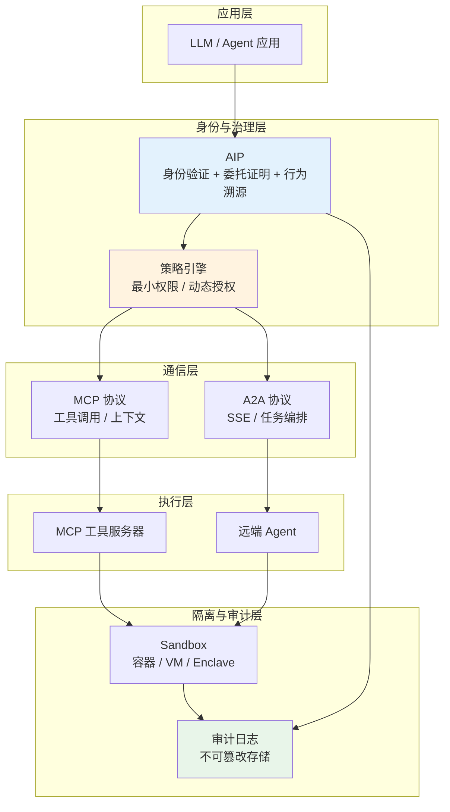
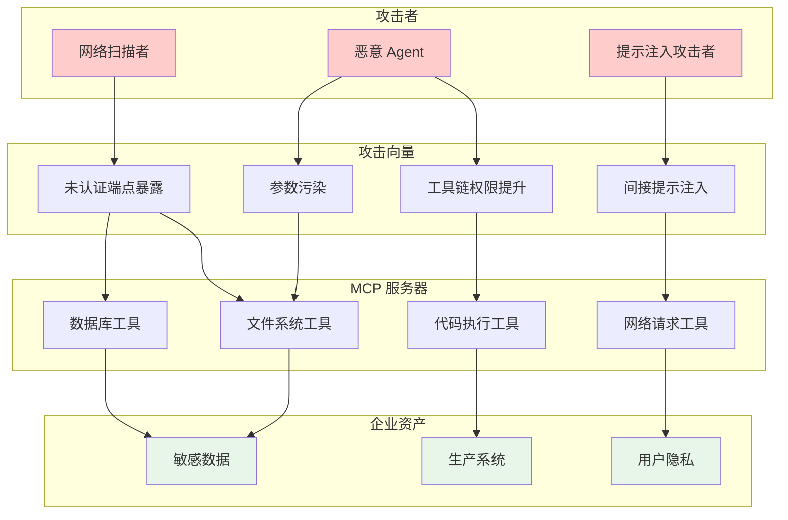
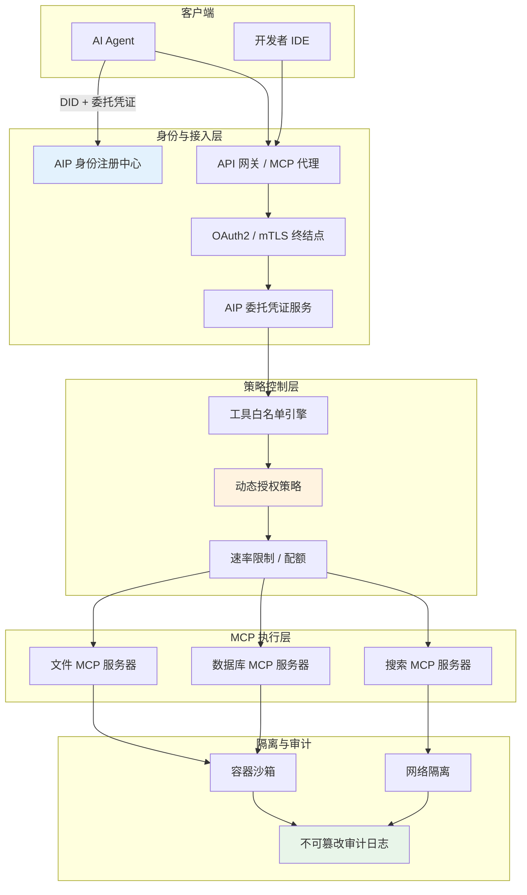
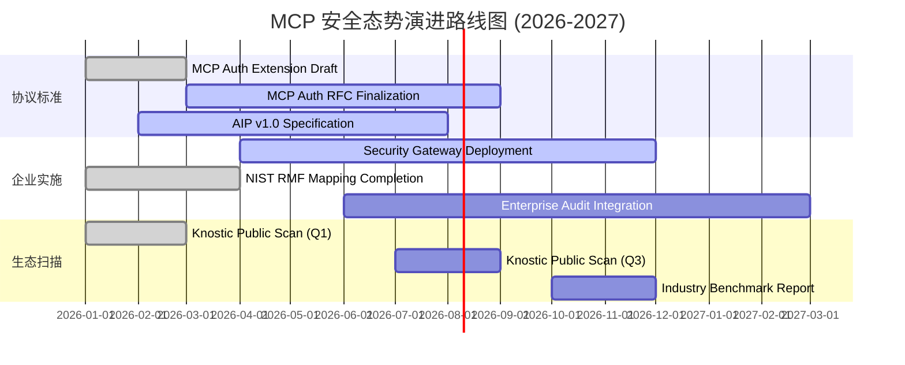
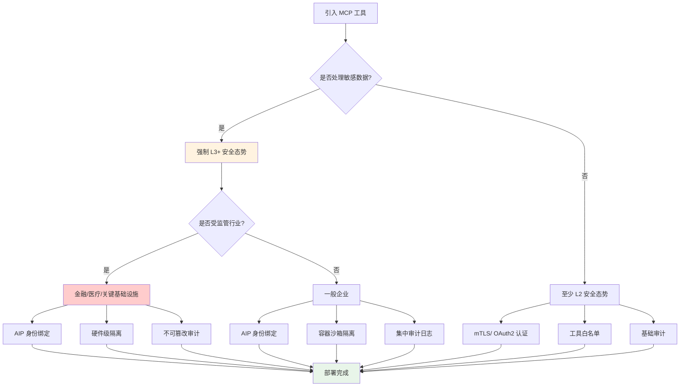

# MCP 安全治理现状与企业部署指南 (2026)

> **状态**: 前瞻 | **预计发布时间**: 2026-06 | **最后更新**: 2026-04-14
>
> ⚠️ 本文档描述的安全态势基于2026年公开发布的安全研究报告，相关政策与标准仍在快速演进中。

> **所属阶段**: Knowledge/06-frontier | **前置依赖**: [ai-agent-streaming-architecture.md](ai-agent-streaming-architecture.md), [ai-agent-a2a-protocol.md](ai-agent-a2a-protocol.md) | **形式化等级**: L3-L4

---

## 1. 概念定义 (Definitions)

### Def-K-06-300: MCP 安全态势 (MCP Security Posture)

**定义**: MCP 安全态势描述了模型上下文协议（Model Context Protocol）服务器在身份验证、授权、审计和隔离四个维度上的安全状态，形式化为四元组：

$$
\mathcal{S}_{mcp} \triangleq \langle \mathcal{A}_{auth}, \mathcal{A}_{authz}, \mathcal{A}_{audit}, \mathcal{A}_{iso} \rangle
$$

其中：

| 组件 | 符号 | 形式化定义 | 功能描述 |
|------|------|------------|----------|
| **身份验证** | $\mathcal{A}_{auth}$ | $\{none, token, mTLS, OAuth2\}$ | 客户端身份确认机制 |
| **授权** | $\mathcal{A}_{authz}$ | $\mathcal{P}(client) \times \mathcal{R}(resource) \rightarrow \{allow, deny\}$ | 资源访问控制决策 |
| **审计** | $\mathcal{A}_{audit}$ | $\{log, trace, attest\}^*$ | 操作记录与可追溯性 |
| **隔离** | $\mathcal{A}_{iso}$ | $\{process, container, vm, enclave\}$ | 执行环境边界保护 |

**安全态势分级**:

| 等级 | 条件 | 描述 |
|------|------|------|
| **L0 - 无防护** | $\mathcal{A}_{auth} = none \land \mathcal{A}_{authz} = \top$ | 任何客户端均可完全访问 |
| **L1 - 基础防护** | $\mathcal{A}_{auth} \neq none$ | 至少具备单一身份验证机制 |
| **L2 - 标准防护** | $\mathcal{A}_{auth} \neq none \land \mathcal{A}_{authz} \neq \top$ | 身份验证 + 细粒度授权 |
| **L3 - 企业防护** | L2 + $\mathcal{A}_{audit} \neq \emptyset \land \mathcal{A}_{iso} \neq process$ | 完整审计 + 环境隔离 |
| **L4 - 高 assurance** | L3 + $\mathcal{A}_{auth} = mTLS/OAuth2 \land \mathcal{A}_{iso} \in \{vm, enclave\}$ | 双向认证 + 硬件级隔离 |

---

### Def-K-06-301: MCP 威胁模型 (MCP Threat Model)

**定义**: MCP 威胁模型形式化为攻击者能力集合与系统资产暴露面的组合：

$$
\mathcal{T}_{mcp} \triangleq \langle \mathcal{K}, \mathcal{C}, \mathcal{I}, \mathcal{G} \rangle
$$

其中：

- **$\mathcal{K}$ (Knowledge)**: 攻击者对 MCP 服务器接口规范、工具列表和输入参数的了解程度
- **$\mathcal{C}$ (Capability)**: 攻击者可调用的 MCP 工具集合，$\mathcal{C} = \{c_1, c_2, ..., c_n\}$
- **$\mathcal{I}$ (Intent)**: 攻击目标，$\mathcal{I} \in \{data\_exfiltration, privilege\_escalation, remote\_execution, denial\_of\_service\}$
- **$\mathcal{G}$ (Gain)**: 成功攻击后的收益函数，$\mathcal{G}: \mathcal{I} \rightarrow \mathbb{R}^+$

**关键攻击向量**:

| 向量 | 形式化描述 | 风险等级 |
|------|------------|----------|
| **工具注入** | $\exists c \in \mathcal{C}: inject(c, payload) \rightarrow RCE$ | 严重 |
| **数据泄露** | $\exists c \in \mathcal{C}: c(query) \rightarrow data\_leak$ | 严重 |
| **权限提升** | $\exists c_i, c_j \in \mathcal{C}: c_i \circ c_j \rightarrow elevated\_privilege$ | 高 |
| **间接提示注入** | $\exists input: LLM(input) \rightarrow invoke(c_{malicious})$ | 高 |

---

### Def-K-06-302: Agent 身份协议 (Agent Identity Protocol, AIP)

**定义**: AIP 是一种为 AI Agent 提供可验证身份、授权委托和行为溯源的协议框架，形式化为三元组：

$$
\mathcal{P}_{aip} \triangleq \langle \mathcal{I}_{agent}, \mathcal{D}_{attest}, \mathcal{V}_{prov} \rangle
$$

其中：

| 组件 | 符号 | 形式化定义 | 功能描述 |
|------|------|------------|----------|
| **Agent 身份** | $\mathcal{I}_{agent}$ | $\langle did, pk, metadata \rangle$ | 去中心化标识符 + 公钥 |
| **委托证明** | $\mathcal{D}_{attest}$ | $Sign_{pk_{owner}}(delegate, agent_{id}, scope, expiry)$ | 可验证的权限委托凭证 |
| **溯源验证** | $\mathcal{V}_{prov}$ | $\{action\}^* \rightarrow \{verified, unverified\}$ | 行为链的可验证性检查 |

**AIP 与 MCP/A2A 的关系**:

$$
\text{Security Layer} = \underbrace{\text{AIP}}_{\text{身份 + 委托 + 溯源}} + \underbrace{\text{MCP}}_{\text{工具调用}} + \underbrace{\text{A2A}}_{\text{Agent 间通信}}
$$

AIP 填补了 MCP（工具层）和 A2A（通信层）在**身份验证、授权委托、行为溯源**方面的空白。

---

### Def-K-06-303: AI Agent 合规框架 (AI Agent Compliance Framework)

**定义**: AI Agent 合规框架是一组基于 NIST AI RMF 和 NCCoE 2026 项目要求的安全治理规则集合，形式化为：

$$
\mathcal{F}_{compliance} \triangleq \langle \mathcal{R}_{gov}, \mathcal{R}_{map}, \mathcal{R}_{measure}, \mathcal{R}_{manage} \rangle
$$

其中：

- **$\mathcal{R}_{gov}$ (Govern)**: 治理规则集合，包括角色定义、责任分配、策略制定
- **$\mathcal{R}_{map}$ (Map)**: 风险映射规则，识别 Agent 系统的上下文、用途、利益相关者
- **$\mathcal{R}_{measure}$ (Measure)**: 度量规则，量化风险指标、性能指标、合规指标
- **$\mathcal{R}_{manage}$ (Manage)**: 管理规则，定义风险响应、监控、持续改进流程

**合规状态函数**:

$$
\text{Compliance}(system) = \bigwedge_{r \in \mathcal{F}_{compliance}} satisfy(system, r)
$$

---

## 2. 属性推导 (Properties)

### Prop-K-06-300: MCP 未认证暴露风险边界定理

**命题**: 对于安全态势为 L0（$\mathcal{A}_{auth} = none$）的 MCP 服务器，攻击者成功利用的期望成本满足：

$$
E[cost_{attack}] \approx 0, \quad \text{当 } \mathcal{A}_{auth} = none
$$

**证明概要**:

1. **零门槛访问**: 任何能够发现服务端点的网络实体均可发起连接
2. **工具枚举成本低**: MCP 协议通常暴露可用工具列表（`tools/list`）
3. **参数推断成本低**: 通过 LLM 或模式分析可快速推断有效输入
4. **Knostic 2026 扫描实证**: 约 2,000 个公共 MCP 服务器中，认证覆盖率为 0%

**推论**: 在未认证 MCP 服务器上，数据泄露和远程代码执行的风险概率趋近于网络可达性概率：

$$
P(compromise) \approx P(network\_reachable)
$$

---

### Lemma-K-06-300: AIP 委托单调性引理

**引理**: AIP 委托证明满足权限单调递减性：

$$
\forall d \in \mathcal{D}_{attest}: scope(d) \subseteq scope(owner)
$$

即 Agent 的权限范围永远不会超过其委托方的原始权限范围。

**证明概要**:

1. 委托凭证由所有者私钥签名，包含明确的 `scope` 字段
2. 验证节点在解析委托链时进行交集运算：$scope_{effective} = \bigcap_{i=1}^{n} scope_i$
3. 任何试图扩大 scope 的委托凭证将无法通过密码学验证

---

## 3. 关系建立 (Relations)

### 3.1 MCP 与 AIP/A2A 安全层关系



**层级职责矩阵**:

| 层级 | 安全职责 | 当前覆盖率 (2026-Q2) | 关键缺口 |
|------|----------|----------------------|----------|
| **AIP** | 身份、委托、溯源 | ~5%（早期草案） | 标准化进程缓慢 |
| **A2A** | OAuth2/mTLS | ~30% | 细粒度授权不足 |
| **MCP** | 工具级访问控制 | ~0%（公共服务器） | 认证机制缺失 |
| **Sandbox** | 执行隔离 | ~15% | 沙箱化部署成本高 |

---

### 3.2 NIST AI RMF 与 MCP 治理的映射

| NIST AI RMF 功能 | MCP 治理要求 | 实施控制点 |
|------------------|--------------|------------|
| **GOVERN** | 建立 MCP 服务器资产清单、责任矩阵 | CM-8, PM-5 |
| **MAP** | 识别 MCP 工具的数据访问边界、风险暴露面 | RA-3, RA-7 |
| **MEASURE** | 持续扫描 MCP 服务器的认证状态、漏洞情况 | CA-7, PM-31 |
| **MANAGE** | 制定 MCP 工具调用白名单、异常行为响应 playbook | IR-4, RA-9 |

---

### 3.3 企业 MCP 部署安全检查清单

**认证 (Authentication)**:

- [ ] 所有 MCP 服务器必须配置强身份验证（mTLS 或 OAuth2）
- [ ] 禁止在生产环境中使用无认证的 MCP 服务器
- [ ] 定期（至少每月）扫描内部 MCP 服务器的认证覆盖率
- [ ] 使用 AIP 为调用 MCP 工具的 Agent 分配独立身份和委托凭证

**授权 (Authorization)**:

- [ ] 实施工具级最小权限原则（Least Privilege）
- [ ] 配置动态授权策略：基于 Agent 身份、任务上下文、时间窗口
- [ ] 禁止通用 Admin 凭证访问所有 MCP 工具
- [ ] 定期审计权限分配与实际使用的一致性

**审计 (Audit)**:

- [ ] 记录所有 MCP 工具调用的完整参数和返回摘要
- [ ] 审计日志写入不可篡改存储（WORM / 区块链 / HSM 签名）
- [ ] 配置异常检测规则：高频调用、敏感参数、跨域工具链
- [ ] 保留审计日志不少于法规要求期限（金融：7年，医疗：6年）

**隔离 (Isolation)**:

- [ ] MCP 工具服务器运行在独立容器或 VM 中
- [ ] 网络隔离：MCP 服务器与核心数据库之间通过 API 网关或零信任网络访问
- [ ] 对高敏感工具启用硬件级隔离（如 Intel TDX、AMD SEV）
- [ ] 禁止 MCP 服务器直接访问生产环境的特权凭证或根证书

---

## 4. 论证过程 (Argumentation)

### 4.1 Knostic 2026 扫描结果分析

**事实陈述**: 2026 年，安全厂商 Knostic 对约 2,000 个公共 MCP 服务器进行了自动化安全扫描，结果显示：

- **认证覆盖率**: 0%
- **授权机制覆盖率**: < 5%
- **输入验证覆盖率**: ~20%
- **沙箱隔离覆盖率**: ~10%

**风险分析**:

| 风险类型 | 影响 | 发生概率 | 风险等级 |
|----------|------|----------|----------|
| **数据泄露** | 敏感数据通过 MCP 工具被未授权提取 | 高 | 严重 |
| **权限提升** | 通过工具链组合获得更高系统权限 | 中 | 高 |
| **远程代码执行** | 工具注入或参数污染导致 RCE | 中 | 严重 |
| **供应链攻击** | 恶意 MCP 服务器被分发到终端用户 | 高 | 严重 |

**论证**: 当前公共 MCP 生态的安全基线远低于企业生产的最低可接受阈值（L2）。企业在引入 MCP 工具时必须实施额外的安全控制层，而不能依赖 MCP 协议原生的安全机制。

---

### 4.2 为什么 MCP 认证缺失是结构性问题

**观察1**: MCP 协议设计初衷是简化 LLM 与外部工具的集成，安全特性被后置考虑。

**观察2**: MCP 社区以开源工具为主，维护者缺乏安全工程资源。

**观察3**: 当前 MCP 规范（截至 2026-Q2）未将认证列为 MUST 实现项，导致实现碎片化。

**论证**:

$$
\text{认证缺失} \Leftarrow \text{规范宽松} + \text{实现成本低} + \text{安全激励不足}
$$

这意味着认证缺失不是单一实现问题，而是协议生态的结构性缺陷。企业必须通过 overlay（叠加层）安全架构来弥补，而非等待协议原生修复。

---

### 4.3 AIP 对 MCP 安全的补强机制

AIP 从三个维度补强 MCP 的安全短板：

| 短板 | AIP 补强机制 | 效果 |
|------|--------------|------|
| **无身份验证** | Agent DID + 公钥绑定 | 每次 MCP 调用均可追溯到唯一 Agent |
| **无授权委托** | 可验证委托凭证（VC） | 限定 Agent 可调用的 MCP 工具范围 |
| **无行为溯源** | 签名操作日志 | 建立不可抵赖的审计链 |

**AIP-MCP 集成模式**:

```
┌─────────────────────────────────────────────────────────────┐
│                    AIP + MCP 集成调用流程                     │
├─────────────────────────────────────────────────────────────┤
│                                                             │
│  1. Agent 向 AIP 身份注册中心申请 DID 和委托凭证              │
│                                                             │
│  2. 调用 MCP 工具前，Agent 生成调用意图签名：                 │
│     Sign(pk_agent, tool_name, params_hash, timestamp)       │
│                                                             │
│  3. MCP 网关验证：                                            │
│     a) 签名有效性                                             │
│     b) 委托凭证是否覆盖该工具                                  │
│     c) 时间戳是否 replay-safe                                 │
│                                                             │
│  4. 验证通过后，网关代理调用 MCP 服务器                        │
│                                                             │
│  5. 返回结果与调用日志一同写入审计链                           │
│                                                             │
└─────────────────────────────────────────────────────────────┘
```

---

## 5. 形式证明 / 工程论证 (Engineering Argument)

### 5.1 MCP 威胁模型架构图



---

### 5.2 企业级 MCP 安全部署参考架构



---

### 5.3 行业合规影响分析

**金融行业**:

- **法规要求**: SEC AI 指南、EU AI Act（高风险系统）、 Basel III 操作风险管理
- **MCP 影响**: 任何连接到交易数据或客户记录的 MCP 工具必须满足 L4 安全态势
- **合规刚需**: AIP 身份溯源 + 不可篡改审计日志是监管审查的硬性要求

**医疗行业**:

- **法规要求**: HIPAA（美国）、GDPR（欧盟）、NIST AI RMF
- **MCP 影响**: PHI（受保护健康信息）访问必须通过最小权限授权和完整审计
- **合规刚需**: MCP 工具调用需与患者身份解耦，同时保留操作可追溯性

**关键基础设施**:

- **法规要求**: NIST CSF 2.0、IEC 62443、EO 14110
- **MCP 影响**: 工业控制系统的 MCP 集成必须通过网络隔离和硬件级沙箱实现
- **合规刚需**: 禁止任何未经验证的 MCP 工具直接访问 OT 网络

---

## 6. 实例验证 (Examples)

### 6.1 MCP 安全配置检查脚本

```python
"""
MCP 服务器安全配置扫描器
基于 Knostic 2026 研究发现的自动化检查工具
"""

import asyncio
import json
from dataclasses import dataclass
from typing import List, Dict
from enum import Enum

class SecurityLevel(Enum):
    L0 = "无防护"
    L1 = "基础防护"
    L2 = "标准防护"
    L3 = "企业防护"
    L4 = "高 assurance"

@dataclass
class MCPSecurityPosture:
    server_url: str
    auth_mechanism: str
    authorization_enabled: bool
    audit_logging: bool
    isolation_level: str

    def evaluate(self) -> SecurityLevel:
        auth_map = {
            "none": 0, "token": 1, "oauth2": 2,
            "mtls": 3
        }
        iso_map = {
            "none": 0, "process": 1, "container": 2,
            "vm": 3, "enclave": 4
        }

        auth_score = auth_map.get(self.auth_mechanism, 0)
        authz_score = 1 if self.authorization_enabled else 0
        audit_score = 1 if self.audit_logging else 0
        iso_score = iso_map.get(self.isolation_level, 0)

        total = auth_score + authz_score + audit_score + iso_score

        if total >= 8:
            return SecurityLevel.L4
        elif total >= 6:
            return SecurityLevel.L3
        elif total >= 3:
            return SecurityLevel.L2
        elif total >= 1:
            return SecurityLevel.L1
        return SecurityLevel.L0

async def scan_mcp_server(url: str) -> MCPSecurityPosture:
    """模拟 MCP 服务器安全扫描"""
    # 实际实现应探测 /health、/.well-known/mcp.json 等端点
    return MCPSecurityPosture(
        server_url=url,
        auth_mechanism="none",  # Knostic 2026 发现：公共服务器普遍无认证
        authorization_enabled=False,
        audit_logging=False,
        isolation_level="process"
    )

async def batch_scan(urls: List[str]) -> Dict:
    """批量扫描并生成报告"""
    results = await asyncio.gather(*[scan_mcp_server(u) for u in urls])

    level_counts = {level: 0 for level in SecurityLevel}
    for r in results:
        level_counts[r.evaluate()] += 1

    return {
        "total_scanned": len(results),
        "level_distribution": {
            k.value: v for k, v in level_counts.items()
        },
        "l0_percentage": level_counts[SecurityLevel.L0] / len(results) * 100
    }

# 示例运行
if __name__ == "__main__":
    sample_urls = [
        "https://mcp-files.example.com",
        "https://mcp-db.example.com",
        "https://mcp-search.example.com"
    ]
    report = asyncio.run(batch_scan(sample_urls))
    print(json.dumps(report, indent=2, ensure_ascii=False))
```

---

### 6.2 AIP 委托凭证示例

```json
{
  "@context": ["https://www.w3.org/ns/credentials/v2"],
  "id": "urn:uuid:aip-delegation-001",
  "type": ["VerifiableCredential", "AIPDelegationCredential"],
  "issuer": {
    "id": "did:aip:enterprise:hr-dept",
    "type": "Organization"
  },
  "credentialSubject": {
    "id": "did:aip:agent:recruitment-bot-01",
    "delegation": {
      "scope": [
        "mcp:read:employee_profiles",
        "mcp:write:interview_notes"
      ],
      "constraints": {
        "allowedTools": ["hr-profile-mcp", "interview-mcp"],
        "maxCallsPerHour": 100,
        "allowedTimeWindow": "09:00-18:00 UTC",
        "dataClassification": ["internal", "confidential"]
      },
      "expiry": "2026-12-31T23:59:59Z"
    }
  },
  "proof": {
    "type": "Ed25519Signature2020",
    "created": "2026-04-14T12:00:00Z",
    "proofPurpose": "assertionMethod",
    "verificationMethod": "did:aip:enterprise:hr-dept#keys-1",
    "proofValue": "z58DAd...<signature>"
  }
}
```

---

## 7. 可视化 (Visualizations)

### 7.1 MCP 安全态势演进路线图



---

### 7.2 企业 MCP 安全决策树



---

## 8. 引用参考 (References)


---

*文档版本: v1.0 | 创建日期: 2026-04-14 | 状态: Active*
*更新内容: 基于 Knostic 2026 扫描数据，建立 MCP 安全态势框架、威胁模型与企业部署检查清单*
