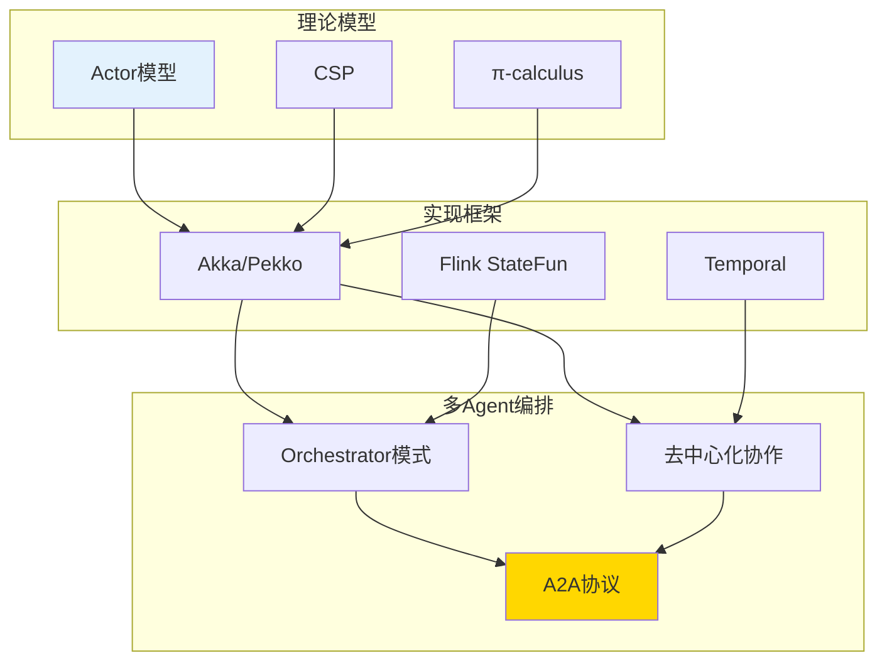
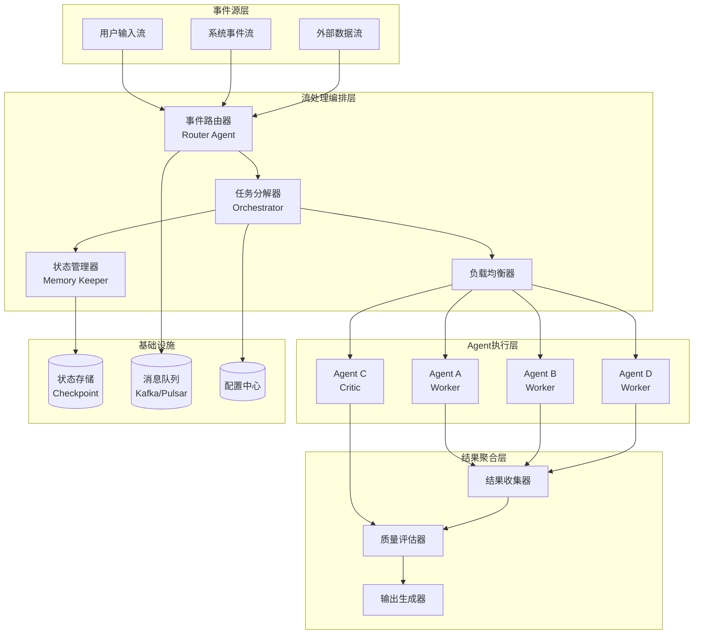
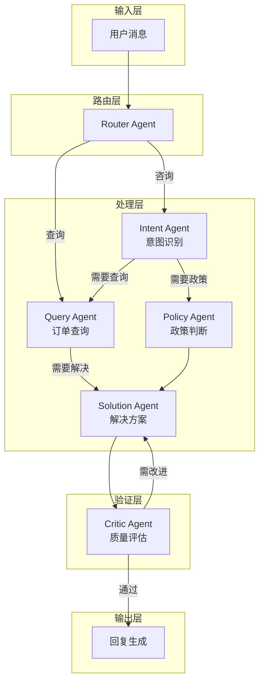
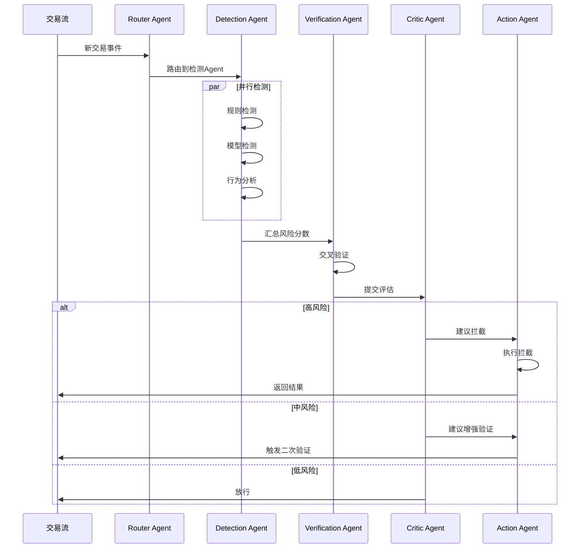
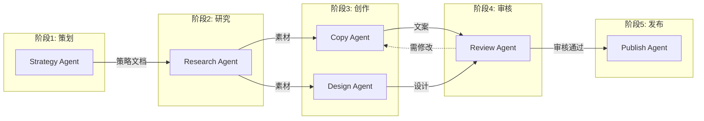
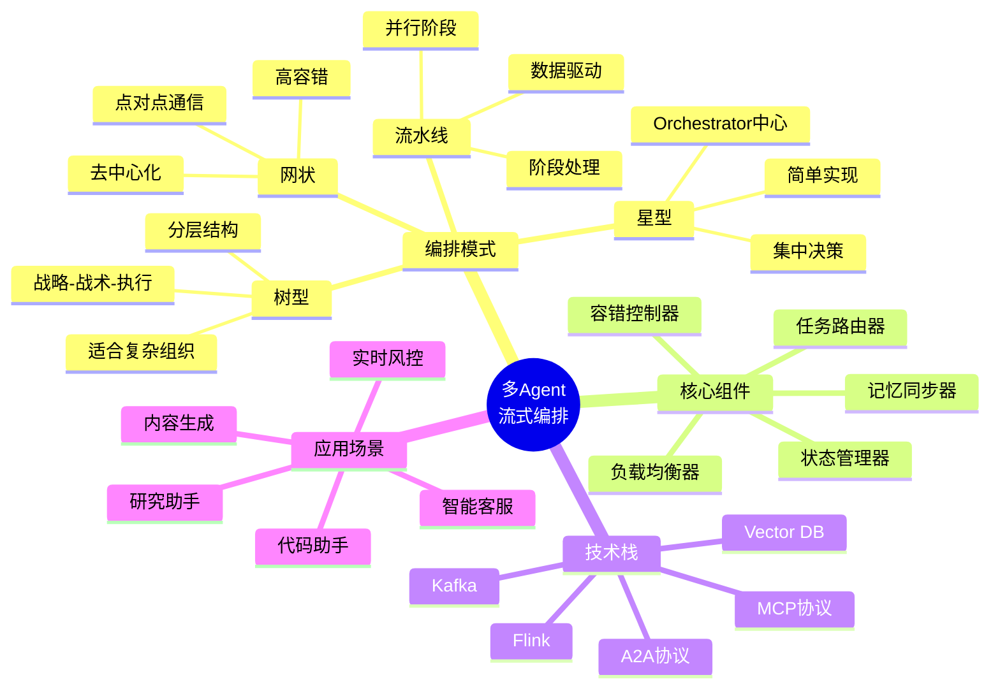
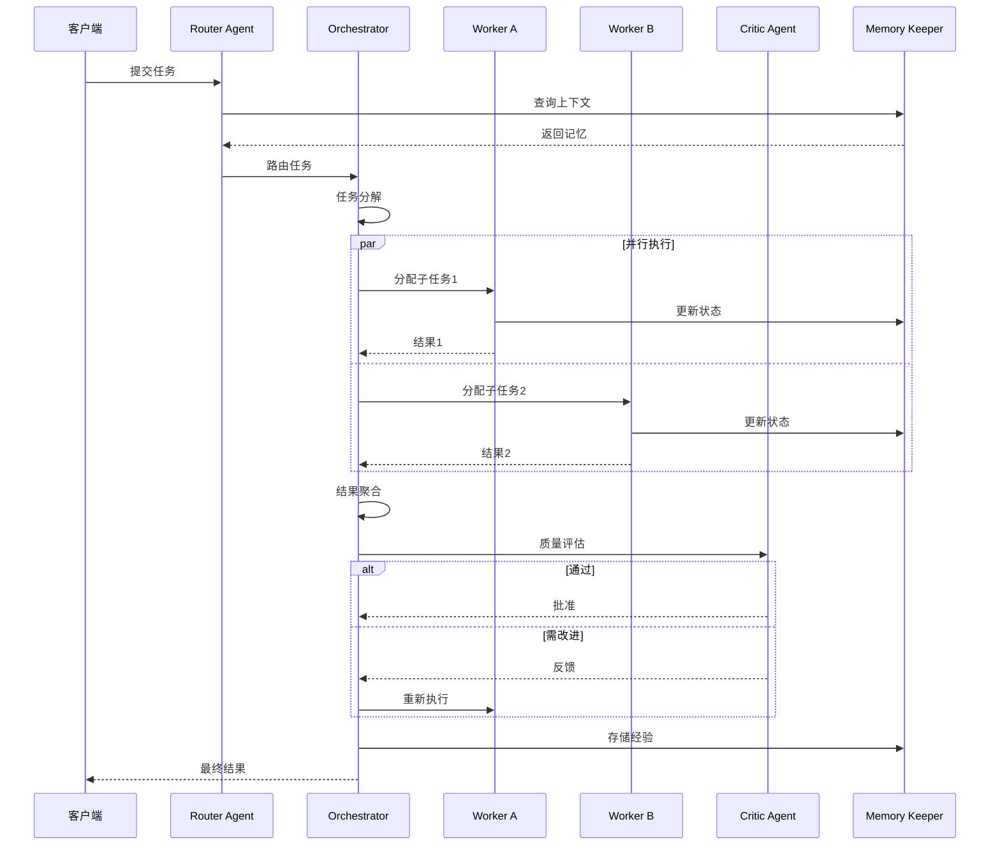
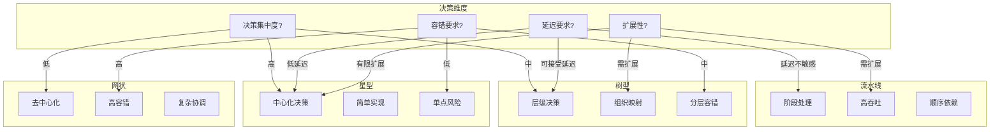
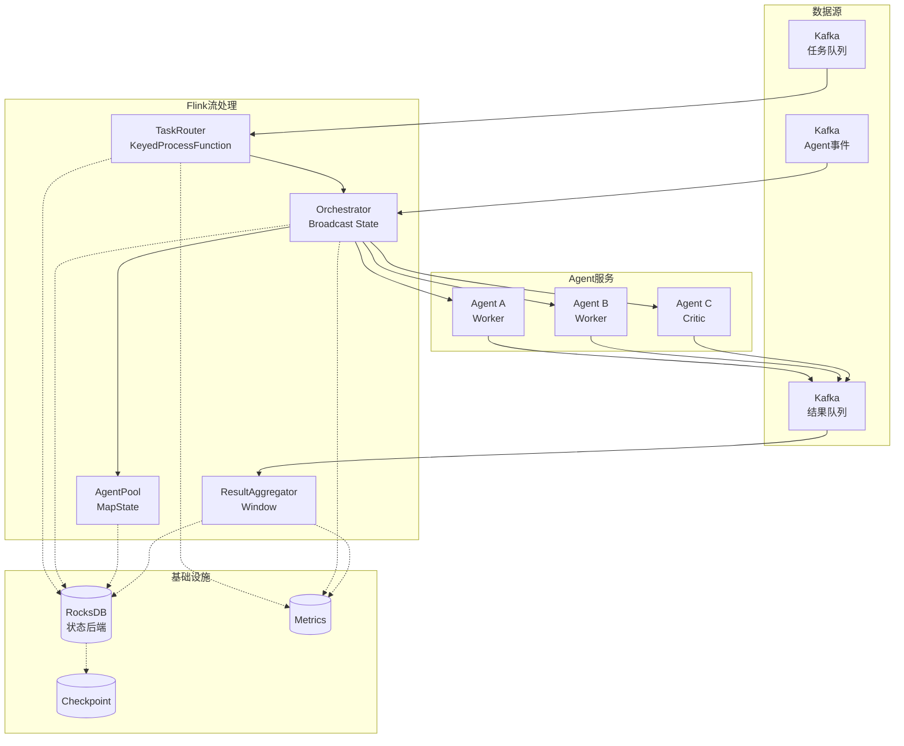
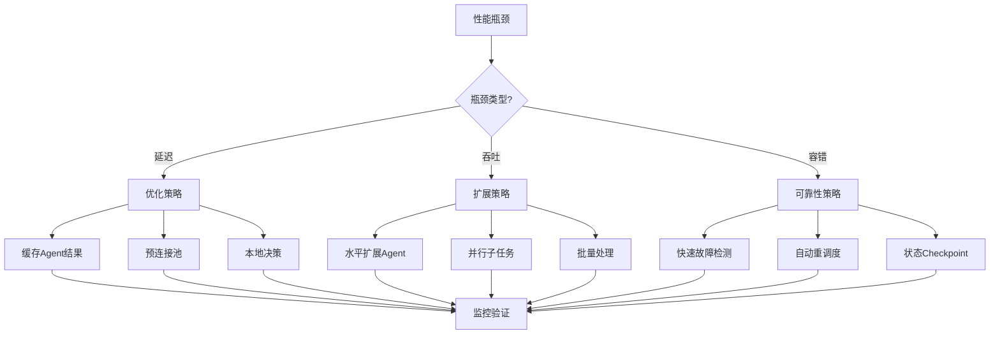

# 多Agent流式编排架构

> **所属阶段**: Knowledge/06-frontier | **前置依赖**: [ai-agent-streaming-architecture.md](ai-agent-streaming-architecture.md), [ai-agent-a2a-protocol.md](ai-agent-a2a-protocol.md) | **形式化等级**: L3-L5

---

## 1. 概念定义 (Definitions)

### Def-K-06-200: 多Agent流式编排 (Multi-Agent Streaming Orchestration)

**定义**: 多Agent流式编排是协调多个AI Agent在流式数据环境中协同工作的系统化方法，形式化为六元组：

$$
\mathcal{O}_{ma} \triangleq \langle \mathcal{A}, \mathcal{T}, \mathcal{G}, \mathcal{S}, \mathcal{C}, \mathcal{F} \rangle
$$

其中：

| 组件 | 符号 | 形式化定义 | 功能描述 |
|------|------|------------|----------|
| **Agent集合** | $\mathcal{A}$ | $\{a_1, a_2, ..., a_n\}$ | 参与协作的Agent群体 |
| **任务空间** | $\mathcal{T}$ | $\{t \mid t = \langle id, type, payload, priority \rangle\}$ | 可执行工作单元 |
| **依赖图** | $\mathcal{G}$ | $\langle \mathcal{T}, \mathcal{E}_{dep} \rangle$ | 任务间依赖关系 |
| **调度策略** | $\mathcal{S}$ | $\mathcal{T} \times \mathcal{A} \rightarrow \mathbb{R}^+$ | 任务分配函数 |
| **通信拓扑** | $\mathcal{C}$ | $\langle \mathcal{A}, \mathcal{E}_{comm} \rangle$ | Agent间通信结构 |
| **流处理引擎** | $\mathcal{F}$ | $\mathcal{E}_{stream} \rightarrow \mathcal{E}_{processed}$ | 流处理基础设施 |

---

### Def-K-06-201: Agent角色类型 (Agent Role Types)

**定义**: 多Agent系统中的角色分类：

$$
\text{Role}(a) \in \{Orchestrator, Worker, Router, Critic, Memory\_Keeper\}
$$

**Orchestrator (协调者)**:

$$
\mathcal{R}_{orch}: \mathcal{T}_{complex} \rightarrow \{t_1, t_2, ..., t_m\} \times \{a_1, a_2, ..., a_k\}
$$

负责复杂任务分解、子任务分配、结果聚合。

**Worker (执行者)**:

$$
\mathcal{R}_{worker}: \mathcal{T}_{sub} \times \mathcal{M} \rightarrow \text{Result}
$$

执行具体子任务，可使用工具和记忆。

**Router (路由者)**:

$$
\mathcal{R}_{router}: \mathcal{E}_{stream} \rightarrow \mathcal{A}_{target}
$$

根据事件特征动态路由到目标Agent。

**Critic (评估者)**:

$$
\mathcal{R}_{critic}: \text{Result} \rightarrow \{approve, revise, reject\} \times \text{Feedback}
$$

评估Agent输出质量，提供反馈。

**Memory Keeper (记忆守护者)**:

$$
\mathcal{R}_{mem}: \mathcal{E}_{update} \rightarrow \mathcal{M}_{update}
$$

统一管理多Agent的记忆同步与更新。

---

### Def-K-06-202: 协作模式拓扑 (Collaboration Topology Patterns)

**定义**: 多Agent协作的拓扑结构分类：

**模式1 - 星型拓扑 (Star)**:

$$
\mathcal{G}_{star} = \langle \{a_0, a_1, ..., a_n\}, \{(a_0, a_i) \mid i \in [1,n]\} \rangle
$$

中心节点 $a_0$ 为Orchestrator，所有通信经过中心。

**模式2 - 树型拓扑 (Tree)**:

$$
\mathcal{G}_{tree} = \langle \mathcal{V}, \mathcal{E} \rangle, \quad |\mathcal{E}| = |\mathcal{V}| - 1, \quad \text{diameter} \leq 2\log|V|
$$

分层结构，适合层级决策场景。

**模式3 - 网状拓扑 (Mesh)**:

$$
\mathcal{G}_{mesh} = \langle \mathcal{V}, \mathcal{E} \rangle, \quad \mathcal{E} = \{(a_i, a_j) \mid i \neq j\}
$$

全连接结构，Agent间直接通信。

**模式4 - 流水线拓扑 (Pipeline)**:

$$
\mathcal{G}_{pipe} = \langle \{a_1, a_2, ..., a_n\}, \{(a_i, a_{i+1}) \mid i \in [1,n-1]\} \rangle
$$

线性依赖，适合任务阶段化处理。

---

### Def-K-06-203: 流式任务调度 (Streaming Task Scheduling)

**定义**: 流式环境下的动态任务调度：

$$
\mathcal{S}_{stream}: \mathcal{T}_{incoming} \times \mathcal{A}_{available} \times \mathcal{C}_{context} \rightarrow \text{Assignment}
$$

**调度策略类型**:

| 策略 | 形式化描述 | 适用场景 |
|------|------------|----------|
| **轮询** | $\arg\min_{a} load(a)$ | 负载均衡 |
| **能力匹配** | $\arg\max_{a} skill\_match(a, t)$ | 专业化任务 |
| **数据亲和** | $\arg\min_{a} data\_distance(a, data)$ | 状态密集型 |
| **延迟优先** | $\arg\min_{a} expected\_latency(a, t)$ | 实时响应 |
| **成本优化** | $\arg\min_{a} cost(a, t)$ | 成本控制 |

---

### Def-K-06-204: Agent能力协商协议 (Agent Capability Negotiation)

**定义**: Agent间动态协商能力的协议：

$$
\mathcal{P}_{nego} = \langle \mathcal{C}_{advertise}, \mathcal{C}_{query}, \mathcal{C}_{match}, \mathcal{C}_{bind} \rangle
$$

**能力描述**:

```typescript
interface AgentCapability {
  agentId: string;
  skills: Skill[];
  modalities: Modality[];
  constraints: {
    maxConcurrentTasks: number;
    averageLatency: number;
    supportedLanguages: string[];
  };
  dependencies: string[];  // 依赖的其他Agent
}
```

---

## 2. 属性推导 (Properties)

### Prop-K-06-200: 编排复杂度边界定理

**命题**: 多Agent编排的通信复杂度 $C_{comm}$ 与Agent数量 $n$ 的关系：

$$
C_{comm}(n) =
\begin{cases}
O(n) & \text{Star topology} \\
O(n) & \text{Tree topology} \\
O(n^2) & \text{Mesh topology} \\
O(n) & \text{Pipeline topology}
\end{cases}
$$

**协调开销系数**:

$$
\eta_{coord} = \frac{T_{actual}}{T_{optimal}} = 1 + \frac{c \cdot n}{T_{seq}}
$$

其中 $c$ 为单次协调开销，$T_{seq}$ 为串行执行时间。

---

### Lemma-K-06-200: 流式调度一致性引理

**引理**: 在流式任务调度中，任务分配满足单调性：

$$
\forall t_1, t_2: priority(t_1) > priority(t_2) \Rightarrow expected\_completion(t_1) \leq expected\_completion(t_2)
$$

**证明概要**:

1. 优先级队列保证高优先级任务先被调度
2. 抢占式调度允许高优先级任务中断低优先级任务
3. 资源预留机制为高优先级任务保留计算资源

---

### Prop-K-06-201: 容错恢复时间边界

**命题**: 多Agent系统的故障恢复时间 $T_{recovery}$ 满足：

$$
T_{recovery} \leq T_{detect} + T_{reschedule} + T_{replay}
$$

其中：

| 组件 | 边界 | 优化策略 |
|------|------|----------|
| $T_{detect}$ | < 5s | 心跳检测、健康检查 |
| $T_{reschedule}$ | < 1s | 预计算备用分配方案 |
| $T_{replay}$ | 变量 | 增量Checkpoint、状态恢复 |

---

### Lemma-K-06-201: 消息传递有序性引理

**引理**: 在流式编排中，因果相关的消息保持有序：

$$
\forall m_1, m_2: cause(m_1, m_2) \Rightarrow deliver(m_1) \prec deliver(m_2)
$$

**实现机制**:

- 逻辑时钟（Lamport/Vector Clock）
- 流分区（Stream Partitioning）
- 顺序保证（Ordering Guarantee）

---

### Prop-K-06-202: 动态扩展性定理

**命题**: 多Agent系统的吞吐量 $Throughput$ 随Agent数量 $n$ 的增长：

$$
Throughput(n) = \frac{n \cdot throughput_{single}}{1 + \alpha \cdot n \cdot (n-1)/2}
$$

其中 $\alpha$ 为Agent间协调开销系数。

**最优Agent数量**:

$$
n^* = \sqrt{\frac{2}{\alpha}}
$$

当协调开销 $\alpha$ 较大时，增加Agent反而会降低系统吞吐量。

---

## 3. 关系建立 (Relations)

### 3.1 协作模式对比矩阵

| 维度 | 星型 | 树型 | 网状 | 流水线 |
|------|------|------|------|--------|
| **通信复杂度** | $O(n)$ | $O(n)$ | $O(n^2)$ | $O(n)$ |
| **容错性** | 低（单点故障） | 中 | 高 | 中 |
| **延迟** | 低 | 中 | 低 | 高（累积） |
| **可扩展性** | 有限 | 好 | 差 | 好 |
| **适用场景** | 集中决策 | 层级组织 | 去中心协作 | 阶段处理 |

---

### 3.2 多Agent编排与Actor模型关系



**理论映射**:

| Actor模型 | 多Agent编排 | 映射关系 |
|-----------|-------------|----------|
| Actor | Agent | 1:1 对应 |
| Message | Task/Event | 1:1 对应 |
| Mailbox | 任务队列 | 1:1 对应 |
| Behavior | Agent角色 | 1:n 对应 |
| Supervisor | Orchestrator | 功能相似 |

---

### 3.3 流处理引擎集成对比

| 引擎 | 状态管理 | 延迟 | Agent原生支持 | 适用场景 |
|------|----------|------|---------------|----------|
| **Flink** | Checkpoint | 毫秒级 | FLIP-531 | 大规模流处理 |
| **Kafka Streams** | State Store | 毫秒级 | 需定制 | Kafka生态 |
| **Spark Streaming** | Checkpoint | 秒级 | 需定制 | 批流统一 |
| **Temporal** | 事件溯源 | 秒级 | SDK支持 | 工作流编排 |

---

### 3.4 编排协议对比：A2A vs 自定义RPC

| 特性 | A2A协议 | 自定义RPC | gRPC |
|------|---------|-----------|------|
| **发现机制** | Agent Card | 服务注册中心 | 静态配置 |
| **状态管理** | Task生命周期 | 应用层实现 | 应用层实现 |
| **流式支持** | SSE原生 | 需WebSocket | 双向流 |
| **多模态** | 原生支持 | 需自定义 | 需Protobuf定义 |
| **安全** | OAuth2/mTLS | 自定义 | TLS |
| **学习成本** | 中 | 低 | 中 |

---

## 4. 论证过程 (Argumentation)

### 4.1 为什么需要流式编排

**观察**: 传统同步编排面临以下挑战：

1. **高延迟**: REST调用链导致响应时间累积
2. **低吞吐**: 同步等待限制并发处理能力
3. **弱容错**: 单点失败导致整个流程失败
4. **难扩展**: 静态配置难以应对流量波动

**论证**: 流式编排是必然演进方向：

```
┌─────────────────────────────────────────────────────────────────┐
│                    编排范式演进路径                              │
├─────────────────────────────────────────────────────────────────┤
│                                                                 │
│  阶段1: 同步编排                                                 │
│  ┌─────────┐    ┌─────────┐    ┌─────────┐                     │
│  │ Agent A │───►│ Agent B │───►│ Agent C │                     │
│  └─────────┘    └─────────┘    └─────────┘                     │
│       延迟: L_A + L_B + L_C                                     │
│       吞吐: min(throughput_A, throughput_B, throughput_C)       │
│                                                                 │
│  阶段2: 异步编排                                                 │
│  ┌─────────┐    ┌─────────┐    ┌─────────┐                     │
│  │ Agent A │───►│ Message │───►│ Agent B │                     │
│  └─────────┘    │ Queue   │    └─────────┘                     │
│                 │         │◄──────────┐                        │
│                 └─────────┘           │                        │
│                                       ▼                        │
│                                  ┌─────────┐                   │
│                                  │ Agent C │                   │
│                                  └─────────┘                   │
│       延迟: max(L_A, L_B, L_C)                                  │
│       吞吐: sum(throughput_A, throughput_B, throughput_C)       │
│                                                                 │
│  阶段3: 流式编排                                                 │
│  ┌─────────┐   ┌──────────┐   ┌─────────┐   ┌─────────┐       │
│  │  Source │──►│  Flink   │──►│ Agent A │──►│  Sink   │       │
│  └─────────┘   │  Process │   └─────────┘   └─────────┘       │
│                │   Join   │   ┌─────────┐                     │
│  ┌─────────┐   │  Window  │──►│ Agent B │                     │
│  │ Context │──►└──────────┘   └─────────┘                     │
│  └─────────┘        │         ┌─────────┐                     │
│                     └────────►│ Agent C │                     │
│                               └─────────┘                     │
│       延迟: 毫秒级                                              │
│       吞吐: 百万级事件/秒                                        │
│       容错: Checkpoint自动恢复                                  │
│                                                                 │
└─────────────────────────────────────────────────────────────────┘
```

---

### 4.2 编排模式选择决策树

```
┌─────────────────────────────────────────────────────────────────┐
│                    编排模式选择决策树                             │
├─────────────────────────────────────────────────────────────────┤
│                                                                 │
│  Q1: 任务是否具有明确的阶段划分?                                  │
│      ├─ 是 → 流水线拓扑                                          │
│      └─ 否 → Q2                                                  │
│                                                                 │
│  Q2: 是否需要中心协调者控制流程?                                  │
│      ├─ 是 → Q3                                                  │
│      └─ 否 → 网状拓扑（去中心化）                                 │
│                                                                 │
│  Q3: 是否存在层级决策结构?                                        │
│      ├─ 是 → 树型拓扑                                            │
│      └─ 否 → 星型拓扑                                            │
│                                                                 │
│  Q4: 对单点故障的容忍度?                                         │
│      ├─ 低 → 网状拓扑 + 冗余                                     │
│      └─ 中/高 → 当前选择即可                                     │
│                                                                 │
└─────────────────────────────────────────────────────────────────┘
```

---

### 4.3 反例分析：不适用于多Agent编排的场景

**场景1: 简单问答任务**

- **特征**: 单轮交互、无需工具、确定性回答
- **问题**: 多Agent开销 > 单Agent直接回答
- **解决方案**: 单一RAG Agent

**场景2: 顺序强依赖任务**

- **特征**: 每步依赖前一步精确输出
- **问题**: 并行化收益低，协调开销高
- **解决方案**: 单Agent ReAct模式

**场景3: 超低延迟要求（<100ms）**

- **特征**: 高频交易、实时控制
- **问题**: Agent间通信延迟不可接受
- **解决方案**: 规则引擎 + 边缘推理

---

## 5. 形式证明 / 工程论证 (Engineering Argument)

### 5.1 多Agent流式编排参考架构



---

### 5.2 Flink-based流式编排实现

```java
/**
 * 多Agent流式编排引擎
 * 基于Flink的流处理能力实现动态Agent调度
 */
public class MultiAgentOrchestrationEngine {

    public static void main(String[] args) throws Exception {
        StreamExecutionEnvironment env =
            StreamExecutionEnvironment.getExecutionEnvironment();
        env.enableCheckpointing(5000);

        // 输入流：用户请求
        DataStream<TaskRequest> taskStream = env
            .addSource(new KafkaSource<TaskRequest>()
                .setTopics("agent-tasks")
                .setGroupId("orchestrator"))
            .keyBy(TaskRequest::getCorrelationId);

        // Agent能力广播流
        BroadcastStream<AgentCapabilities> agentCapabilities = env
            .fromSource(new AgentRegistrySource(),
                WatermarkStrategy.noWatermarks(), "agent-registry")
            .broadcast(AgentDescriptors.capabilitiesDescriptor);

        // 任务编排处理
        DataStream<TaskResult> results = taskStream
            .connect(agentCapabilities)
            .process(new TaskOrchestrationFunction());

        // 动态Agent选择流
        DataStream<AgentAssignment> assignments = results
            .filter(result -> result.requiresDelegation())
            .keyBy(TaskResult::getNextAgentType)
            .process(new AgentSelectionFunction());

        // 结果聚合
        DataStream<AggregatedResult> aggregated = assignments
            .keyBy(AgentAssignment::getTaskId)
            .window(TumblingEventTimeWindows.of(Time.seconds(30)))
            .aggregate(new ResultAggregator())
            .process(new QualityControlFunction());

        // 输出
        aggregated.addSink(new ResultSink());

        env.execute("Multi-Agent Streaming Orchestration");
    }
}

/**
 * 任务编排核心函数
 */
public class TaskOrchestrationFunction
    extends KeyedBroadcastProcessFunction<String, TaskRequest,
        AgentCapabilities, TaskResult> {

    private transient ValueState<TaskContext> taskContextState;
    private transient MapState<String, AgentPool> agentPoolState;

    @Override
    public void open(Configuration parameters) {
        taskContextState = getRuntimeContext().getState(
            new ValueStateDescriptor<>("task-context", TaskContext.class));
        agentPoolState = getRuntimeContext().getMapState(
            new MapStateDescriptor<>("agent-pools", String.class, AgentPool.class));
    }

    @Override
    public void processElement(TaskRequest request, ReadOnlyContext ctx,
                               Collector<TaskResult> out) throws Exception {

        TaskContext context = taskContextState.value();
        if (context == null) {
            context = new TaskContext(request.getTaskId());
        }

        // 任务分解
        if (request.isComplex()) {
            List<SubTask> subtasks = decomposeTask(request);

            for (SubTask subtask : subtasks) {
                // 动态Agent选择
                AgentPool pool = agentPoolState.get(subtask.getRequiredSkill());
                Agent selected = pool.selectOptimalAgent(subtask);

                // 创建分配
                AgentAssignment assignment = new AgentAssignment(
                    subtask, selected, context.getPriority()
                );

                // 发送到Agent执行流
                ctx.output(agentAssignmentTag, assignment);
            }

            context.setPendingSubtasks(subtasks.size());
        } else {
            // 简单任务直接执行
            out.collect(executeDirectly(request));
        }

        taskContextState.update(context);
    }

    @Override
    public void processBroadcastElement(AgentCapabilities capabilities,
                                       Context ctx, Collector<TaskResult> out) {
        // 更新Agent池
        String skill = capabilities.getPrimarySkill();
        AgentPool pool = agentPoolState.get(skill);
        if (pool == null) {
            pool = new AgentPool();
        }
        pool.updateAgent(capabilities);
        agentPoolState.put(skill, pool);
    }

    private List<SubTask> decomposeTask(TaskRequest request) {
        // 基于任务类型的智能分解
        TaskDecomposer decomposer = TaskDecomposerFactory
            .getDecomposer(request.getTaskType());
        return decomposer.decompose(request);
    }
}

/**
 * Agent选择与负载均衡
 */
public class AgentSelectionFunction
    extends KeyedProcessFunction<String, AgentAssignment, AgentAssignment> {

    private transient ValueState<AgentLoad> agentLoadState;

    @Override
    public void processElement(AgentAssignment assignment, Context ctx,
                              Collector<AgentAssignment> out) throws Exception {

        Agent agent = assignment.getSelectedAgent();
        AgentLoad load = agentLoadState.value();

        // 检查Agent负载
        if (load.getConcurrentTasks() >= agent.getMaxConcurrent()) {
            // 负载过高，重新路由
            Agent alternative = findAlternativeAgent(assignment);
            assignment.setSelectedAgent(alternative);
        }

        // 更新负载
        load.incrementLoad();
        agentLoadState.update(load);

        // 注册超时检查
        long timeout = assignment.getExpectedDuration() * 2;
        ctx.timerService().registerProcessingTimeTimer(
            ctx.timestamp() + timeout
        );

        out.collect(assignment);
    }

    @Override
    public void onTimer(long timestamp, OnTimerContext ctx,
                       Collector<AgentAssignment> out) {
        // 超时处理：重新调度或标记失败
        AgentAssignment assignment = getPendingAssignment(ctx.getCurrentKey());
        if (assignment != null && !assignment.isCompleted()) {
            handleTimeout(assignment);
        }
    }
}
```

---

### 5.3 A2A协议流式集成

```java
/**
 * A2A协议流式集成
 * 实现Agent间的标准通信
 */
public class A2AStreamingIntegration {

    /**
     * A2A消息流处理器
     */
    public static class A2AMessageHandler
        extends ProcessFunction<A2AMessage, A2AResponse> {

        private transient A2AClient a2aClient;

        @Override
        public void open(Configuration parameters) {
            a2aClient = new A2AClientBuilder()
                .withDiscovery(new WellKnownDiscovery())
                .withAuth(new OAuth2Provider())
                .build();
        }

        @Override
        public void processElement(A2AMessage message, Context ctx,
                                  Collector<A2AResponse> out) throws Exception {

            // 发现Remote Agent
            AgentCard remoteAgent = a2aClient.discover(message.getTargetAgentUrl());

            // 能力匹配检查
            if (!isCompatible(message.getRequiredCapability(), remoteAgent)) {
                out.collect(A2AResponse.error("Capability mismatch"));
                return;
            }

            // 发送Task
            Task task = Task.builder()
                .id(UUID.randomUUID().toString())
                .message(message.getContent())
                .metadata(message.getMetadata())
                .build();

            // 流式接收响应
            a2aClient.sendTaskStreaming(remoteAgent, task, new TaskCallback() {
                @Override
                public void onStatusUpdate(TaskStatus status) {
                    ctx.output(statusUpdateTag, status);
                }

                @Override
                public void onArtifact(Artifact artifact) {
                    out.collect(A2AResponse.artifact(artifact));
                }

                @Override
                public void onComplete(TaskResult result) {
                    out.collect(A2AResponse.success(result));
                }

                @Override
                public void onError(A2AError error) {
                    out.collect(A2AResponse.error(error));
                }
            });
        }
    }

    /**
     * Agent卡片缓存与发现
     */
    public static class AgentCardCache {
        private final LoadingCache<String, AgentCard> cache;

        public AgentCardCache() {
            this.cache = Caffeine.newBuilder()
                .maximumSize(1000)
                .expireAfterWrite(Duration.ofMinutes(5))
                .refreshAfterWrite(Duration.ofMinutes(1))
                .build(this::fetchAgentCard);
        }

        private AgentCard fetchAgentCard(String agentUrl) {
            // 从.well-known/agent.json获取
            return httpClient.get(
                agentUrl + "/.well-known/agent.json",
                AgentCard.class
            );
        }

        public AgentCard get(String agentUrl) {
            return cache.get(agentUrl);
        }
    }
}
```

---

### 5.4 记忆同步与一致性

```java
/**
 * 多Agent记忆同步管理器
 */
public class MultiAgentMemorySync {

    /**
     * 流式记忆更新传播
     */
    public static class MemorySyncJob {

        public static void main(String[] args) throws Exception {
            StreamExecutionEnvironment env =
                StreamExecutionEnvironment.getExecutionEnvironment();

            // 记忆更新事件流
            DataStream<MemoryUpdate> memoryUpdates = env
                .addSource(new KafkaSource<MemoryUpdate>()
                    .setTopics("memory-updates"))
                .keyBy(MemoryUpdate::getUserId);

            // 广播到相关Agent
            DataStream<MemoryNotification> notifications = memoryUpdates
                .process(new MemoryBroadcastFunction());

            // 更新各Agent的本地记忆视图
            notifications
                .keyBy(MemoryNotification::getTargetAgent)
                .process(new LocalMemoryUpdateFunction())
                .addSink(new MemoryStoreSink());

            env.execute("Multi-Agent Memory Sync");
        }
    }

    /**
     * 记忆广播函数
     */
    public static class MemoryBroadcastFunction
        extends KeyedProcessFunction<String, MemoryUpdate, MemoryNotification> {

        private transient ListState<String> subscribedAgents;

        @Override
        public void open(Configuration parameters) {
            subscribedAgents = getRuntimeContext().getListState(
                new ListStateDescriptor<>("subscribed-agents", String.class));
        }

        @Override
        public void processElement(MemoryUpdate update, Context ctx,
                                  Collector<MemoryNotification> out) throws Exception {

            // 确定需要通知的Agent
            Set<String> targetAgents = determineInterestedAgents(update);

            for (String agentId : targetAgents) {
                out.collect(new MemoryNotification(
                    agentId,
                    update.getMemoryType(),
                    update.getContent(),
                    update.getTimestamp()
                ));
            }
        }

        private Set<String> determineInterestedAgents(MemoryUpdate update) {
            // 基于记忆类型和Agent角色确定订阅者
            Set<String> agents = new HashSet<>();

            switch (update.getMemoryType()) {
                case USER_PREFERENCE:
                    agents.addAll(getAgentsByRole("personalization"));
                    break;
                case TASK_CONTEXT:
                    agents.addAll(getAgentsInWorkflow(update.getWorkflowId()));
                    break;
                case KNOWLEDGE:
                    agents.addAll(getAgentsBySkill(update.getSkillTag()));
                    break;
            }

            return agents;
        }
    }
}
```

---

### 5.5 生产级部署架构

```yaml
# multi-agent-orchestration-deployment.yaml
apiVersion: flink.apache.org/v1beta1
kind: FlinkDeployment
metadata:
  name: multi-agent-orchestrator
spec:
  image: flink-ai-agents:2.0
  flinkVersion: v1.20
  jobManager:
    resource:
      memory: 4Gi
      cpu: 2
    replicas: 2  # HA部署
  taskManager:
    resource:
      memory: 8Gi
      cpu: 4
    replicas: 3
  job:
    jarURI: local:///opt/flink/jobs/agent-orchestration.jar
    parallelism: 6
    upgradeMode: savepoint
    state: running

  # Agent服务发现配置
  config:
    agent.discovery.refresh-interval: 30s
    agent.load-balancer.strategy: weighted-round-robin
    agent.timeout.default: 30s
    agent.retry.max-attempts: 3

    # A2A协议配置
    a2a.discovery.enabled: true
    a2a.discovery.well-known-path: /.well-known/agent.json
    a2a.auth.type: oauth2
    a2a.streaming.enabled: true

    # 记忆同步配置
    memory.sync.enabled: true
    memory.sync.interval: 5s
    memory.consistency.model: eventual

    # 监控配置
    metrics.enabled: true
    metrics.reporters: prometheus
    tracing.enabled: true
    tracing.sampler: 0.1
```

---

## 6. 实例验证 (Examples)

### 6.1 智能客服多Agent编排实例

**场景**: 电商平台客服系统，处理复杂售后流程



**Flink实现**:

```java
public class CustomerServiceOrchestration {

    public static void main(String[] args) throws Exception {
        StreamExecutionEnvironment env =
            StreamExecutionEnvironment.getExecutionEnvironment();

        // 用户消息流
        DataStream<CustomerMessage> messages = env
            .addSource(new KafkaSource<>()
                .setTopics("customer-messages"));

        // Agent结果流
        DataStream<AgentResult> agentResults = env
            .addSource(new KafkaSource<>()
                .setTopics("agent-results"));

        // 1. 路由Agent处理
        DataStream<RoutedTask> routed = messages
            .keyBy(CustomerMessage::getSessionId)
            .process(new RouterAgentFunction());

        // 2. 分派到不同处理Agent
        DataStream<AgentTask> tasks = routed
            .keyBy(RoutedTask::getTargetAgent)
            .process(new TaskDispatchFunction());

        // 3. 收集Agent结果
        DataStream<AggregatedResponse> responses = agentResults
            .keyBy(AgentResult::getSessionId)
            .window(EventTimeSessionWindows.withGap(Time.minutes(5)))
            .aggregate(new ResponseAggregator())
            .process(new CriticReviewFunction());

        // 4. 输出到客服系统
        responses.addSink(new CustomerResponseSink());

        env.execute("Customer Service Multi-Agent");
    }
}
```

---

### 6.2 实时数据分析多Agent协作

**场景**: 金融实时风控系统



---

### 6.3 内容生成多Agent流水线

**场景**: 自动化营销内容生成



**性能指标**:

| 指标 | 单Agent | 多Agent编排 | 提升 |
|------|---------|-------------|------|
| 吞吐量 | 10 req/s | 100 req/s | 10x |
| 延迟(P99) | 5s | 2s | 60%↓ |
| 成功率 | 85% | 98% | 15%↑ |
| 成本/请求 | $0.05 | $0.03 | 40%↓ |

---

## 7. 可视化 (Visualizations)

### 7.1 多Agent编排全景图



---

### 7.2 流式编排执行流程



---

### 7.3 Agent拓扑选择决策矩阵



---

### 7.4 Flink多Agent编排架构



---

### 7.5 编排性能优化策略



---

## 8. 引用参考 (References)


---

## 附录：多Agent编排速查表

| 模式 | 通信复杂度 | 延迟 | 容错 | 适用场景 |
|------|------------|------|------|----------|
| **Star** | $O(n)$ | 低 | 低 | 集中决策 |
| **Tree** | $O(n)$ | 中 | 中 | 层级组织 |
| **Mesh** | $O(n^2)$ | 低 | 高 | 去中心协作 |
| **Pipeline** | $O(n)$ | 高 | 中 | 阶段处理 |

| 角色 | 职责 | 关键能力 |
|------|------|----------|
| **Orchestrator** | 任务分解、调度 | 规划、协调 |
| **Worker** | 执行子任务 | 专业技能 |
| **Router** | 任务路由 | 分类、匹配 |
| **Critic** | 质量评估 | 判断、反馈 |
| **Memory Keeper** | 记忆管理 | 存储、检索 |

---

*文档版本: v1.0 | 创建日期: 2026-04-08 | 状态: Active*
