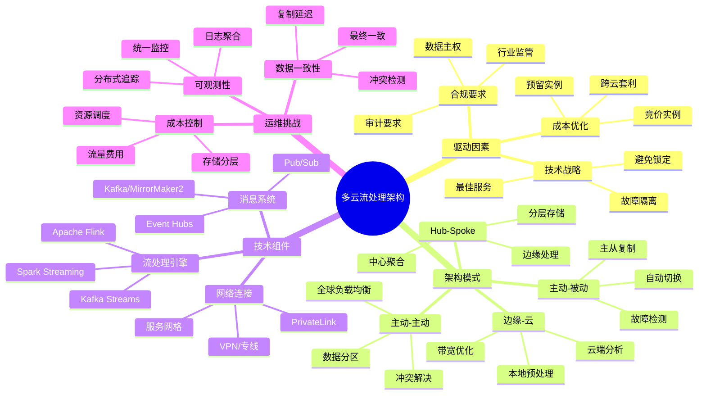
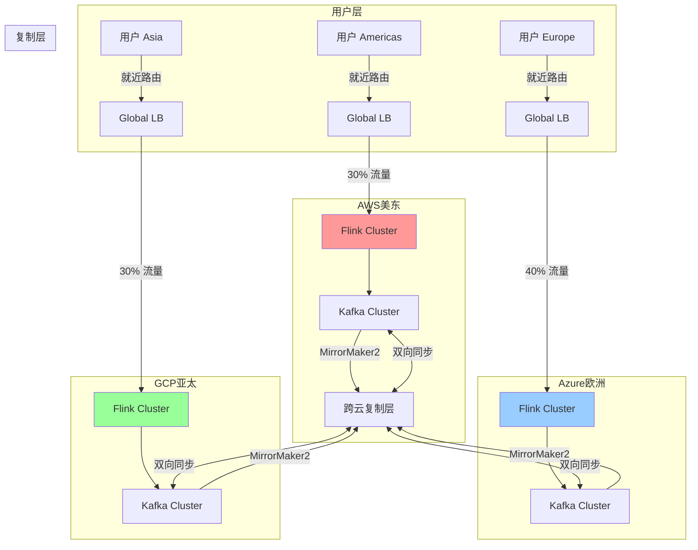
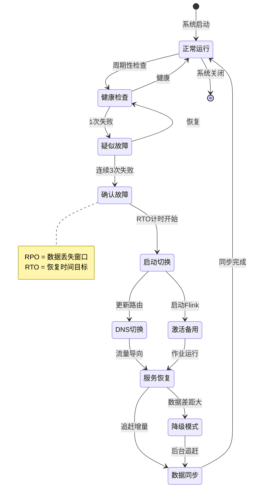
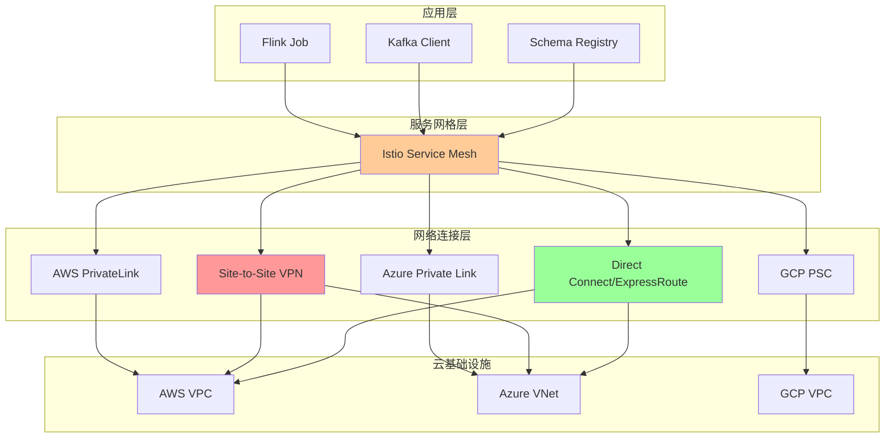
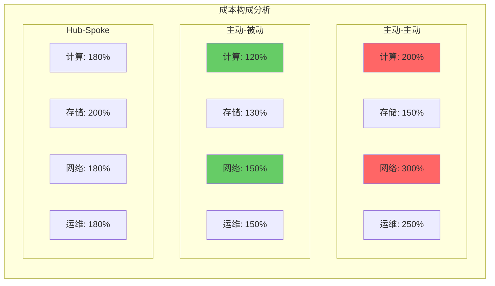

# 多云流处理架构与跨区域复制

> 所属阶段: Knowledge/06-Frontier | 前置依赖: [Flink跨云部署指南](../../Flink/04-runtime/04.01-deployment/multi-cloud-deployment-templates.md), [Kafka地理复制模式](../03-business-patterns/uber-realtime-platform.md) | 形式化等级: L3

---

## 1. 概念定义 (Definitions)

### Def-K-06-150: 多云流处理架构 (Multi-Cloud Streaming Architecture)

**定义**: 多云流处理架构是指在两个或更多公有云提供商（如AWS、Azure、GCP）之间分布式部署流处理组件，以实现数据连续处理、故障隔离和地理容错的系统架构。

形式化描述：

```
设 Cloud = {AWS, Azure, GCP, ...}
设 StreamingComponent = {Source, Processor, Sink, SchemaRegistry}

多云流处理架构 := ⟨Deployments, Links, Policies⟩
其中：
  - Deployments ⊆ Cloud × StreamingComponent
  - Links ⊆ Deployments × Deployments 表示跨云数据流
  - Policies: Deployments → {Active, Standby, ScaleOnDemand}
```

### Def-K-06-151: 跨区域复制模式 (Cross-Region Replication Pattern)

**定义**: 跨区域复制模式定义了流数据在不同地理区域间的同步机制，包括同步方向、一致性级别和故障切换策略。

```
复制模式 := ⟨SourceRegion, TargetRegion, Direction, Consistency⟩
其中：
  - Direction ∈ {UniDirectional, BiDirectional, MultiMaster}
  - Consistency ∈ {Eventual, Causal, Strong, Session}
```

### Def-K-06-152: 主动-主动架构 (Active-Active Architecture)

**定义**: 主动-主动架构是指多个云区域的流处理实例同时处于活动状态，共同承担流量负载，任一实例可独立处理完整请求。

```
主动-主动 := ∀r ∈ Regions: State(r) = Active ∧ Traffic(r) > 0
```

### Def-K-06-153: 主动-被动架构 (Active-Passive Architecture)

**定义**: 主动-被动架构是指仅有一个区域处于活动状态处理流量，其他区域处于待机状态，仅在主区域故障时接管。

```
主动-被动 := ∃!r ∈ Regions: State(r) = Active ∧
              ∀r' ≠ r: State(r') ∈ {Passive, Standby}
```

### Def-K-06-154: RPO/RTO (Recovery Point/Time Objective)

**定义**:

- **RPO (Recovery Point Objective)**: 灾难恢复时可接受的数据丢失时间窗口
- **RTO (Recovery Time Objective)**: 从故障发生到服务恢复的最大可接受时间

```
RPO := max{t | 数据在时间 [Now-t, Now] 内可能丢失}
RTO := max{t | 服务在故障后 t 时间内必须恢复}
```

### Def-K-06-155: 零信任网络 (Zero Trust Network)

**定义**: 零信任网络是一种安全架构原则，要求对每一次访问请求进行身份验证和授权，无论请求来源是否在组织网络边界内。

```
零信任原则 := ∀request: Verify(request.identity) ∧ Verify(request.context) ∧
                          LeastPrivilege(request.access)
```

---

## 2. 属性推导 (Properties)

### Prop-K-06-105: 多云部署的可用性上限

**命题**: 在多云架构中，系统整体可用性受限于各云可用性的组合方式。

**推导**:

```
设 AWS可用性 = 0.9999 (四个9)
设 Azure可用性 = 0.9999
设 GCP可用性 = 0.9999

主动-主动场景（OR关系）:
Availability_total = 1 - ∏(1 - Availability_i)
                   = 1 - (0.0001)^3 ≈ 0.999999999999

主动-被动场景（受限于切换）:
Availability_total = Availability_primary × P(成功切换)
```

**工程含义**: 主动-主动可将可用性提升至接近"6个9"，但复杂度显著增加。

### Prop-K-06-106: 跨云延迟下界

**命题**: 跨云数据传输存在物理延迟下界，无法通过技术手段消除。

**推导**:

```
光在光纤中的传播速度 ≈ 200,000 km/s
AWS us-east-1 到 eu-west-1 距离 ≈ 6,400 km
理论最小延迟 = 6,400 / 200,000 × 2(往返) = 64ms

实际观测:
- AWS↔Azure: 60-120ms
- AWS↔GCP: 50-100ms
- Azure↔GCP: 40-80ms
```

### Prop-K-06-107: 数据一致性三角权衡

**命题**: 跨云流处理系统无法同时满足强一致性、高可用性和分区容错性（CAP定理的多云扩展）。

**推导**:

```
多云CAP扩展:
  - 云间分区不可避免（网络故障）
  - 选择CP: 分区时拒绝写入，保证一致性
  - 选择AP: 接受写入，可能产生冲突

流处理场景推荐:
  - 金融交易: CP (RPO=0)
  - 日志分析: AP (RPO>0可接受)
  - 推荐系统: 最终一致性
```

---

## 3. 关系建立 (Relations)

### 3.1 多云架构模式对比

| 维度 | 主动-主动 | 主动-被动 | Hub-Spoke | 边缘-云混合 |
|------|-----------|-----------|-----------|-------------|
| **RTO** | < 1分钟 | 5-30分钟 | < 5分钟 | < 1分钟 |
| **RPO** | 接近0 | 取决于复制 | 取决于复制 | 边缘缓冲 |
| **复杂度** | 高 | 中 | 中 | 高 |
| **成本** | 2x+ | 1.2-1.5x | 1.5-2x | 1.5-2.5x |
| **适用场景** | 全球服务 | DR备份 | 多区域扩展 | IoT/实时 |

### 3.2 跨云复制技术映射

```
┌─────────────────┬──────────────────┬──────────────────┬──────────────────┐
│    技术方案      │      AWS         │      Azure       │       GCP        │
├─────────────────┼──────────────────┼──────────────────┼──────────────────┤
│ Kafka复制       │ MSK MirrorMaker2 │ HDInsight Kafka  │ Confluent Cloud  │
│                 │ Cluster Linking  │ MirrorMaker      │ Cluster Linking  │
├─────────────────┼──────────────────┼──────────────────┼──────────────────┤
│ Flink部署       │ EMR/Kinesis      │ HDInsight        │ Dataproc         │
│                 │ Managed Flink    │ Flink on AKS     │ Flink on GKE     │
├─────────────────┼──────────────────┼──────────────────┼──────────────────┤
│ 私有连接        │ PrivateLink      │ Private Link     │ Private Service  │
│                 │                  │                  │ Connect          │
├─────────────────┼──────────────────┼──────────────────┼──────────────────┤
│ Schema注册表     │ Glue Schema      │ Event Hub        │ Confluent Schema │
│                 │ Registry         │ Schema Registry  │ Registry         │
└─────────────────┴──────────────────┴──────────────────┴──────────────────┘
```

### 3.3 网络拓扑与数据流关系

**分层架构中的数据流向**:

```
边缘层 (Edge) → 区域聚合层 (Regional Hub) → 全球分析层 (Global Core)
   ↓                    ↓                          ↓
 延迟敏感           区域聚合                  全局洞察
 本地处理           跨可用区复制              跨云分析
```

---

## 4. 论证过程 (Argumentation)

### 4.1 多云驱动因素分析

**成本驱动**:

- 不同云厂商的存储、计算、出口流量定价差异可达30-50%
- 利用竞价实例(Spot)和预留实例组合可优化40%+成本
- 跨云流量成本常被低估（$0.02-0.12/GB）

**合规驱动**:

- 数据主权要求（GDPR、中国网络安全法）
- 行业监管（金融、医疗、政府）
- 客户数据驻留要求

**技术驱动**:

- 避免厂商锁定（Vendor Lock-in）
- 利用各云最佳服务（AWS Lambda、Azure Functions、Cloud Run）
- 故障域隔离

### 4.2 多云挑战与应对

| 挑战 | 影响 | 应对策略 |
|------|------|----------|
| 网络复杂性 | 延迟、成本、安全 | 专用互联、流量工程 |
| 数据一致性 | 冲突、丢失、重复 | CRDT、幂等设计、SAGA |
| 运维复杂度 | 监控、排障、升级 | 统一控制平面、可观测性 |
| 成本控制 | 隐藏费用、流量费 |  FinOps、自动化治理 |
| 技能要求 | 多平台 expertise | 平台抽象、培训 |

### 4.3 2026年多云趋势

1. **Kubernetes成为多云标准抽象层**: 超过80%的多云工作负载运行在K8s上
2. **服务网格标准化**: Istio/Linkerd成为跨云服务通信的事实标准
3. **数据平面统一**: Apache Iceberg/Delta Lake提供跨云数据层抽象
4. **FinOps成熟**: 跨云成本管理工具成为标配
5. **AI/ML驱动**: 多云架构支持AI训练（批量）和推理（实时）的分离部署

---

## 5. 形式证明 / 工程论证 (Engineering Argument)

### 5.1 主动-主动架构的工程可行性论证

**定理**: 在满足特定条件下，主动-主动流处理架构可以实现线性扩展和故障隔离。

**条件**:

1. 数据分区明确（按用户ID、地理位置）
2. 写入操作幂等（支持重复处理）
3. 冲突解决策略明确（Last-Write-Wins / 向量时钟）

**论证**:

```
假设:
  - 流量均匀分布到 N 个区域
  - 每个区域处理能力为 C
  - 故障概率为 p，且相互独立

总处理能力 = N × C
可用性 = 1 - p^N

当 N=3, p=0.001 时:
可用性 = 1 - 0.001^3 = 0.999999999
```

**工程约束**:

- 需要全局负载均衡（Global Serverless Load Balancer）
- 需要分布式事务协调（SAGA / 2PC）
- 需要统一的身份认证（OIDC/SPIFFE）

### 5.2 跨区域复制的数据一致性边界

**定理**: 在跨区域流复制中，当网络分区发生时，系统必须在一致性和可用性之间做出选择。

**证明**:

```
假设系统同时满足:
  1. 一致性: 所有节点看到相同的写入顺序
  2. 可用性: 每个请求都能收到非错误响应
  3. 分区容错: 系统在网络分区时继续运行

反证:
  - 区域A和B发生网络分区
  - 客户端向A写入数据x=v1
  - 客户端向B写入数据x=v2

  如果系统保持可用性，两个写入都会成功
  但由于分区，A和B无法同步
  当分区恢复时，x的值不确定
  违反一致性

∴ 三者不可同时满足 ∎
```

**工程权衡**:

- 选择CP: 使用Kafka事务 + 两阶段提交，牺牲可用性
- 选择AP: 使用异步复制 + 冲突解决，牺牲一致性
- 选择中间态: 使用因果一致性 + 向量时钟

---

## 6. 实例验证 (Examples)

### 6.1 主动-主动电商实时推荐系统

**场景**: 全球电商平台，用户分布在美东、欧洲、亚太

**架构**:

```
┌─────────────┐     ┌─────────────┐     ┌─────────────┐
│  AWS US-East │◄───►│ Azure Europe │◄───►│  GCP Asia   │
│             │     │             │     │             │
│ ┌─────────┐ │     │ ┌─────────┐ │     │ ┌─────────┐ │
│ │Flink    │ │     │ │Flink    │ │     │ │Flink    │ │
│ │Cluster  │ │     │ │Cluster  │ │     │ │Cluster  │ │
│ └────┬────┘ │     │ └────┬────┘ │     │ └────┬────┘ │
│      │      │     │      │      │     │      │      │
│ ┌────┴────┐ │     │ ┌────┴────┐ │     │ ┌────┴────┐ │
│ │Kafka    │ │     │ │Kafka    │ │     │ │Kafka    │ │
│ │MirrorMaker2  │◄──────────►│MirrorMaker2  │◄──────────►│MirrorMaker2  │
│ └─────────┘ │     │ └─────────┘ │     │ └─────────┘ │
└─────────────┘     └─────────────┘     └─────────────┘
```

**关键配置**:

```yaml
# MirrorMaker2 双向复制配置
clusters: source, target
source.bootstrap.servers: source-kafka:9092
target.bootstrap.servers: target-kafka:9092

# 双向复制
source->target.enabled: true
target->source.enabled: true

# 冲突解决: 按时间戳
conflict.resolution: timestamp
```

**效果**:

- RTO < 30秒
- RPO ≈ 0（同步复制）
- 支持就近读取，延迟 < 50ms

### 6.2 主动-被动金融交易灾备

**场景**: 证券交易系统，主区域AWS，灾备区域Azure

**架构**:

```
生产环境 (AWS)          灾备环境 (Azure)
┌─────────────┐         ┌─────────────┐
│   Route 53  │────────►│  Azure DNS  │
│  (健康检查)  │  故障切换  │  (备用)     │
└──────┬──────┘         └──────┬──────┘
       │                       │
┌──────▼──────┐         ┌──────▼──────┐
│  MSK Kafka  │◄───────►│ Event Hubs  │
│   (活跃)     │  同步复制  │   (待机)     │
└──────┬──────┘         └──────┬──────┘
       │                       │
┌──────▼──────┐         ┌──────▼──────┐
│ Kinesis Data│         │ HDInsight   │
│   Analytics │         │    Flink    │
│  (处理交易)  │         │  (待机)      │
└─────────────┘         └─────────────┘
```

**切换流程**:

1. 健康检测失败（连续3次，间隔10秒）
2. 触发DNS切换（TTL=60秒）
3. Azure环境激活Flink作业
4. 恢复服务（总RTO ≈ 5分钟）

**RPO/RTO目标**:

- RPO = 0（同步复制关键交易数据）
- RTO = 5分钟（自动化切换）

### 6.3 边缘-云混合IoT架构

**场景**: 智能制造工厂，边缘预处理 + 云端分析

**架构**:

```
工厂边缘层                    云端聚合层
┌─────────────────┐          ┌─────────────────┐
│   边缘网关       │          │   AWS/Azure/GCP  │
│  (K3s集群)       │          │   (EKS/AKS/GKE)  │
│                 │          │                 │
│ ┌─────────────┐ │          │ ┌─────────────┐ │
│ │ Edge Flink  │ │  MQTT    │ │ Cloud Flink │ │
│ │ (轻量模式)   │├──────────►│ │  (完整模式)  │ │
│ └─────────────┘ │          │ └─────────────┘ │
│ ┌─────────────┐ │          │ ┌─────────────┐ │
│ │ Local Kafka │ │  Kafka   │ │ Cloud Kafka │ │
│ │ (单节点)    │├──────────►│ │  (集群)      │ │
│ └─────────────┘ │  Mirror   │ └─────────────┘ │
└─────────────────┘          └─────────────────┘
```

**边缘配置**:

```yaml
# Flink边缘模式
jobmanager.memory.process.size: 512mb
taskmanager.memory.process.size: 1gb
taskmanager.numberOfTaskSlots: 2
parallelism.default: 2

# 仅保留聚合后的指标
checkpoint.interval: 5min
checkpoint.mode: AT_LEAST_ONCE
```

---

## 7. 可视化 (Visualizations)

### 7.1 多云流处理架构总览

以下思维导图展示多云流处理的核心组件和关系：



### 7.2 主动-主动架构数据流

以下流程图展示主动-主动架构中的数据流向：



### 7.3 灾难恢复故障转移流程

以下状态图展示故障检测和切换过程：



### 7.4 跨云网络连接拓扑

以下层次图展示多云网络架构：



### 7.5 多云成本结构对比

以下矩阵图展示不同架构模式的成本分布：



---

## 8. 引用参考 (References)


---

*文档版本: v1.0 | 创建日期: 2026-04-03 | 定理编号: Def-K-06-150~155, Thm-K-06-105~107*
