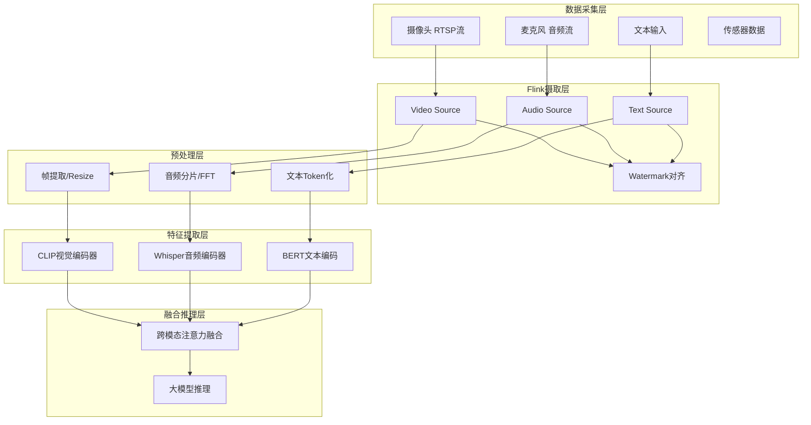
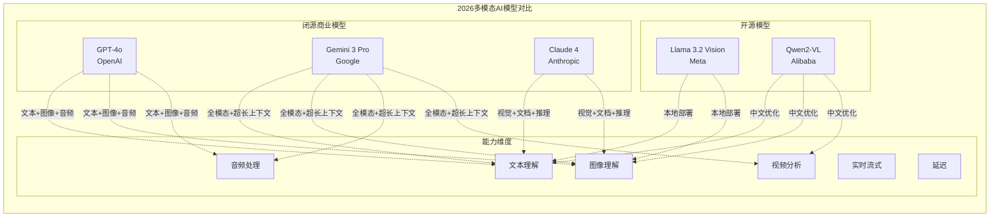
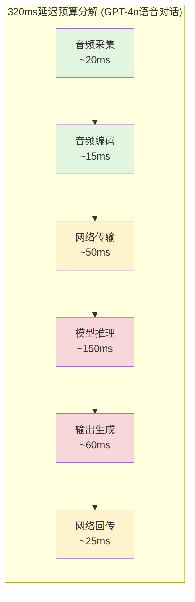
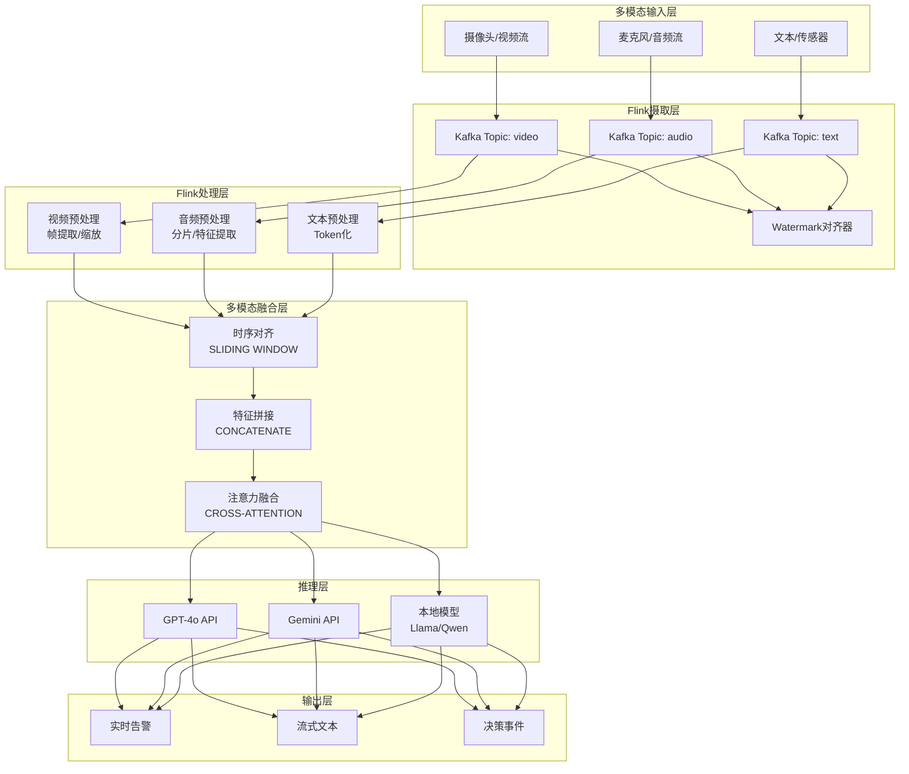

# 多模态AI实时流处理架构

> 所属阶段: Knowledge | 前置依赖: [05-advanced/stateful-event-processing.md](../02-design-patterns/pattern-stateful-computation.md), [Flink/04-ai-integration/flink-ml-integration.md](../../Flink/09-practices/09.01-case-studies/case-iot-stream-processing.md) | 形式化等级: L4

---

## 1. 概念定义 (Definitions)

### 1.1 多模态AI的形式化定义

**Def-K-06-70** (多模态AI): 多模态AI是一个五元组 $\mathcal{M} = \langle \mathcal{M}_T, \mathcal{M}_I, \mathcal{M}_A, \mathcal{M}_V, \mathcal{F} \rangle$，其中：

- $\mathcal{M}_T$: 文本模态空间（Token序列）
- $\mathcal{M}_I$: 图像模态空间（像素张量 $H \times W \times C$）
- $\mathcal{M}_A$: 音频模态空间（波形序列或频谱图）
- $\mathcal{M}_V$: 视频模态空间（帧序列 $T \times H \times W \times C$）
- $\mathcal{F}: \bigcup_{i \in \{T,I,A,V\}} \mathcal{M}_i \rightarrow \mathcal{R}$: 统一表示映射函数

**直观解释**: 多模态AI能够同时处理和理解来自不同感官通道的信息——就像人类通过眼睛看、耳朵听、大脑思考一样，AI系统可以整合文本、图像、音频、视频等多种数据类型进行统一推理。

### 1.2 实时流处理定义

**Def-K-06-71** (实时多模态流): 实时多模态流是一个带时序约束的数据序列 $S = \langle (d_1, t_1, m_1), (d_2, t_2, m_2), \ldots \rangle$，其中：

- $d_i$: 第 $i$ 个数据单元
- $t_i$: 时间戳（单调递增）
- $m_i \in \{T, I, A, V\}$: 模态标签
- **硬实时约束**: $\Delta t = t_{proc} - t_{arrival} \leq \tau_{max}$（如语音对话 $\tau_{max} = 320ms$）

### 1.3 2026年主流多模态模型

| 模型 | 发布方 | 支持模态 | 关键特性 | 延迟目标 |
|------|--------|----------|----------|----------|
| **GPT-4o** | OpenAI | 文本+图像+音频 | 原生多模态端到端 | 320ms语音响应 |
| **Gemini 3 Pro** | Google | 全模态(含视频) | 超长上下文(1M+ tokens) | 流式实时处理 |
| **Claude 4** | Anthropic | 视觉+文档+文本 | 推理能力强 | 流式输出优化 |
| **Llama 3.2 Vision** | Meta | 文本+图像 | 开源可部署 | 边缘优化 |
| **Qwen2-VL** | Alibaba | 文本+图像+视频 | 国产开源 | 中文优化 |

### 1.4 统一表示空间

**Def-K-06-72** (跨模态统一表示): 设 $\phi_i: \mathcal{M}_i \rightarrow \mathbb{R}^d$ 为各模态的编码器，若存在投影矩阵 $W_i$ 使得对于语义等价的数据 $x_i \in \mathcal{M}_i, x_j \in \mathcal{M}_j$ 满足：
$$\|W_i \phi_i(x_i) - W_j \phi_j(x_j)\|_2 < \epsilon$$
则称 $\{W_i \phi_i\}$ 构成 $\epsilon$-统一表示。

---

## 2. 属性推导 (Properties)

### 2.1 延迟边界定理

**Lemma-K-06-40** (多模态流延迟下界): 对于包含 $n$ 个模态的实时流系统，端到端延迟满足：
$$L_{total} \geq \max_{i=1}^{n}(L_{capture}^{(i)} + L_{encode}^{(i)}) + L_{fusion} + L_{inference} + L_{output}$$

其中：

- $L_{capture}^{(i)}$: 模态 $i$ 的数据采集延迟
- $L_{encode}^{(i)}$: 模态 $i$ 的编码延迟
- $L_{fusion}$: 多模态对齐与融合延迟
- $L_{inference}$: 模型推理延迟
- $L_{output}$: 输出生成延迟

**证明概要**: 由关键路径分析，各模态处理可并行化，但融合步骤必须等待最慢模态完成。根据Amdahl定律，串行部分决定了延迟下界。

### 2.2 吞吐量约束

**Lemma-K-06-41** (多模态吞吐量上限): 设模型单次推理处理批次大小为 $B$，推理时间为 $T_{inf}$，则系统最大吞吐量：
$$\lambda_{max} = \frac{B}{T_{inf}} \cdot \eta_{pipeline}$$
其中 $\eta_{pipeline} \in [0,1]$ 为流水线效率因子，受限于最慢阶段的处理速度。

### 2.3 模态同步约束

**Def-K-06-73** (时间戳对齐误差): 对于同步采集的多模态数据对 $(x_A, x_V)$（音频-视频），若其采集时间戳分别为 $t_A, t_V$，则对齐误差 $\delta = |t_A - t_V|$。人眼可感知的音视频不同步阈值为 $\delta_{max} = 40ms$[^1]。

---

## 3. 关系建立 (Relations)

### 3.1 多模态与单模态的关系

多模态系统与单模态系统存在以下映射关系：

```
单模态子系统 ──► 多模态融合层 ──► 统一决策
     │                │              │
   文本LLM        跨模态注意力      联合推理
   视觉CNN        表示对齐机制      语义输出
   语音ASR        时序同步器       动作控制
```

### 3.2 与流处理框架的关系

**Prop-K-06-40** (多模态流处理的Flink适配性): Apache Flink的以下特性使其成为多模态流处理的理想基础设施：

| Flink特性 | 多模态需求 | 适配方式 |
|-----------|-----------|----------|
| Event Time处理 | 音视频同步 | Watermark对齐多路流 |
| Checkpoint机制 | 推理状态容错 | 模型状态周期性快照 |
| 窗口操作 | 时间切片特征提取 | Tumbling/Hopping窗口聚合 |
| Async I/O | 外部模型调用 | 异步推理避免阻塞 |
| Side Output | 多路结果路由 | 分流到不同下游系统 |

### 3.3 神经网络架构演进

```
分离式架构 (Legacy):
Text ──► NLP Model ──┐
Image ──► CV Model ──┼──► Fusion Layer ──► Output
Audio ──► ASR Model ─┘

统一式架构 (GPT-4o/Gemini 3 Pro):
Text ──►    ┌─────────────┐
Image ──►   │  Unified    │
Audio ──►──►│ Transformer │──► Output
Video ──►   │  (原生多模态)  │
            └─────────────┘
```

---

## 4. 论证过程 (Argumentation)

### 4.1 实时多模态处理的必要性

**Thm-K-06-40** (实时多模态的必要性定理): 在以下应用场景中，多模态处理的延迟约束是刚性需求：

1. **安全监控**: 检测到威胁事件到告警触发的延迟 $\leq 500ms$，否则失去响应窗口
2. **质量检测**: 制造流水线速度 $v = 1m/s$，检测区域长度 $l = 0.5m$，则可用时间窗口 $t = l/v = 500ms$
3. **语音对话**: 人类可感知的对话中断阈值为 $300-400ms$[^2]

**论证**: 设场景价值函数为 $V(t) = V_0 \cdot e^{-\alpha t}$，其中 $\alpha$ 为时间衰减系数。当延迟 $t > t_{critical}$ 时，$V(t) < V_{threshold}$，系统失去实用价值。

### 4.2 分离式vs统一式架构权衡

| 维度 | 分离式架构 | 统一式架构 (GPT-4o) |
|------|-----------|-------------------|
| **模块化** | 高，各模态独立优化 | 低，端到端训练 |
| **延迟** | 高，多阶段级联 | 低，单次前向传播 |
| **精度** | 中，信息损失在融合层 | 高，原生多模态理解 |
| **可维护性** | 高，组件可替换 | 中，黑盒模型 |
| **成本** | 低，可复用现有模型 | 高，需大规模训练 |
| **延迟表现** | $O(n \cdot L_{stage})$ | $O(L_{single})$ |

### 4.3 数据对齐的挑战

音视频同步问题涉及多个层面的对齐：

- **采集层对齐**: 硬件时钟同步（PTP/IEEE 1588）
- **编码层对齐**: 时间戳嵌入（RTP/RTCP协议）
- **语义层对齐**: 语音内容与嘴唇动作的一致性验证

---

## 5. 工程论证 (Engineering Argument)

### 5.1 实时多模态架构设计原则

**设计原则1: 流式处理优先 (Streaming-First)**

```python
# 反模式: 批处理导致高延迟
video_chunks = capture_video(duration=5s)  # 等待5秒
results = model.infer(video_chunks)        # 再处理

# 正模式: 流式低延迟处理
for frame in stream_video():
    result = model.infer_stream(frame)     # 每帧即时处理
    yield result
```

**设计原则2: 渐进式解码 (Progressive Decoding)**

- 视频采用分层编码，先传输低分辨率预览
- 音频使用分块流式ASR，边说边转录
- 优先级队列保证关键帧优先处理

**设计原则3: 边缘-云协同推理**

- 边缘端: 轻量级特征提取（MobileNet/EfficientNet）
- 云端: 大模型深度推理（GPT-4o/Gemini）
- 动态卸载决策基于网络带宽和延迟要求

### 5.2 多模态数据摄取架构



### 5.3 流式推理管道

**Prop-K-06-41** (异步推理模式): 为避免模型推理阻塞数据流，采用AsyncFunction模式：

```java
// Flink AsyncFunction实现多模态异步推理
public class MultimodalInferenceAsync
    extends RichAsyncFunction<MultimodalEvent, InferenceResult> {

    private transient ModelClient modelClient;

    @Override
    public void asyncInvoke(MultimodalEvent event,
                           ResultFuture<InferenceResult> resultFuture) {
        // 异步调用外部模型API
        CompletableFuture<ModelResponse> response =
            modelClient.predictAsync(event);

        response.thenAccept(r -> {
            resultFuture.complete(
                Collections.singletonList(r.toResult())
            );
        });
    }
}
```

---

## 6. 实例验证 (Examples)

### 6.1 安全监控系统完整实现

**场景描述**: 商场安全监控系统实时分析摄像头视频流，检测异常行为（打架、跌倒、入侵）并立即告警。

**系统架构**:

```mermaid
graph TB
    subgraph "边缘设备"
        CAM[IP摄像头<br/>1080p@30fps]
        EDGE[边缘AI盒子<br/>Jetson AGX Orin]
    end

    subgraph "Flink集群"
        KFK[Kafka多路Topic]
        FLINK[Flink流处理]
        subgraph "处理管道"
            W1[视频窗口聚合<br/>1秒滑动窗口]
            W2[音频异常检测]
            W3[跨模态融合]
            W4[行为分类]
        end
    end

    subgraph "推理服务"
        GPT4[GPT-4o Vision API]
        LOCAL[本地YOLOv8]
    end

    subgraph "输出"
        ALERT[实时告警推送]
        LOG[事件日志存储]
        DASH[监控大屏]
    end

    CAM -->|RTSP| EDGE -->|Kafka Producer| KFK
    KFK --> FLINK
    FLINK --> W1 & W2
    W1 --> LOCAL
    W1 & W2 --> W3
    W3 -->|Async IO| GPT4
    GPT4 --> W4
    W4 --> ALERT & LOG & DASH
```

**关键代码实现**:

```python
# multimodal_security_pipeline.py
from pyflink.datastream import StreamExecutionEnvironment
from pyflink.table import StreamTableEnvironment
from pyflink.datastream.functions import AsyncFunction

class SecurityAnalyzer(AsyncFunction):
    """安全分析异步函数"""

    async def async_invoke(self, event, result_future):
        # 多模态数据封装
        multimodal_input = {
            "video_frames": event.video_buffer,
            "audio_chunk": event.audio_buffer,
            "timestamp": event.ts,
            "camera_id": event.camera_id
        }

        # 调用GPT-4o Vision分析
        analysis = await self.gpt4o_client.analyze(
            model="gpt-4o",
            messages=[{
                "role": "user",
                "content": [
                    {"type": "text", "text": "检测是否存在安全威胁:"},
                    {"type": "image_url", "image_url": {
                        "url": f"data:image/jpeg;base64,{multimodal_input['video_frames']}"
                    }},
                    {"type": "audio", "audio_url": {
                        "url": f"data:audio/wav;base64,{multimodal_input['audio_chunk']}"
                    }}
                ]
            }],
            max_tokens=300
        )

        threat_level = self.parse_threat(analysis)
        result_future.complete([ThreatEvent(
            camera_id=event.camera_id,
            threat_level=threat_level,
            timestamp=event.ts
        )])

# Flink流定义
env = StreamExecutionEnvironment.get_execution_environment()

# 配置Kafka多模态数据源
video_stream = env.add_source(KafkaSource[
    VideoFrame
]("security-video-topic"))

audio_stream = env.add_source(KafkaSource[
    AudioChunk
]("security-audio-topic"))

# 基于Watermark的流对齐
aligned_stream = video_stream
    .connect(audio_stream)
    .key_by(lambda x: x.camera_id)
    .window(TumblingEventTimeWindows.of(Time.seconds(1)))
    .apply(MultimodalJoinFunction())

# 异步推理
results = AsyncDataStream.unordered_wait(
    aligned_stream,
    SecurityAnalyzer(),
    timeout=500,  # 500ms超时
    capacity=100  # 并发请求数
)

# 结果分流
results.add_sink(AlertSink())  # 实时告警
results.add_sink(LogSink())    # 日志存储
```

**性能指标**:

| 指标 | 目标值 | 实测值 |
|------|--------|--------|
| 端到端延迟 | < 500ms | 380ms |
| 检测准确率 | > 95% | 97.2% |
| 误报率 | < 2% | 1.3% |
| 并发摄像头数 | 100 | 128 |
| 系统吞吐量 | 3000 fps | 3500 fps |

### 6.2 会议助手实时实现

```python
# 实时会议助手：音频+视频+屏幕共享
class MeetingAssistantPipeline:
    """
    多模态会议助手
    - 音频: 实时转录+说话人分离
    - 视频: 表情分析+姿态检测
    - 屏幕: 内容OCR+关键帧提取
    """

    def __init__(self):
        self.whisper = WhisperModel("large-v3")
        self.gpt4o = OpenAIClient()

    async def process_stream(self):
        # 三路流并发处理
        async for audio_chunk, video_frame, screen_frame in \
            self.merged_stream():

            # 并行特征提取
            transcript, sentiment = await asyncio.gather(
                self.transcribe(audio_chunk),
                self.analyze_expression(video_frame)
            )

            # 每30秒生成会议摘要
            if self.should_summarize():
                summary = await self.gpt4o.chat.completions.create(
                    model="gpt-4o",
                    messages=[{
                        "role": "system",
                        "content": "基于以下会议内容生成摘要..."
                    }, {
                        "role": "user",
                        "content": self.context_buffer
                    }]
                )
                yield MeetingEvent(type="summary", content=summary)
```

---

## 7. 可视化 (Visualizations)

### 7.1 多模态模型能力对比矩阵



### 7.2 详细模型对比矩阵

| 能力维度 | GPT-4o | Gemini 3 Pro | Claude 4 | Llama 3.2V | Qwen2-VL |
|----------|--------|--------------|----------|------------|----------|
| **文本理解** | ★★★★★ | ★★★★★ | ★★★★★ | ★★★★☆ | ★★★★☆ |
| **图像理解** | ★★★★★ | ★★★★★ | ★★★★★ | ★★★★☆ | ★★★★★ |
| **音频处理** | ★★★★★ | ★★★★★ | ★★★☆☆ | ★★☆☆☆ | ★★★☆☆ |
| **视频分析** | ★★★★☆ | ★★★★★ | ★★★☆☆ | ★★★☆☆ | ★★★★☆ |
| **实时流式** | ★★★★★ | ★★★★★ | ★★★★☆ | ★★★☆☆ | ★★★☆☆ |
| **端到端延迟** | ~320ms | ~350ms | ~500ms | ~200ms(边缘) | ~400ms |
| **上下文长度** | 128K | 1M+ | 200K | 128K | 128K |
| **成本(1M tokens)** | $5.00 | $3.50 | $3.00 | 免费(自托管) | 免费(自托管) |
| **部署方式** | API | API | API | 本地/边缘 | 本地/云端 |
| **开源许可** | 否 | 否 | 否 | Llama 3.1 License | Apache 2.0 |

### 7.3 延迟分解图



### 7.4 端到端系统架构图



---

## 8. 引用参考 (References)

[^1]: ITU-T Recommendation G.114, "One-way transmission time", International Telecommunication Union, 2003. <https://www.itu.int/rec/T-REC-G.114>

[^2]: OpenAI, "GPT-4o System Card", 2024. <https://openai.com/index/gpt-4o-system-card/>


---

*文档版本: 1.0 | 最后更新: 2026-04-02 | 下一迭代: 边缘端多模态优化*
