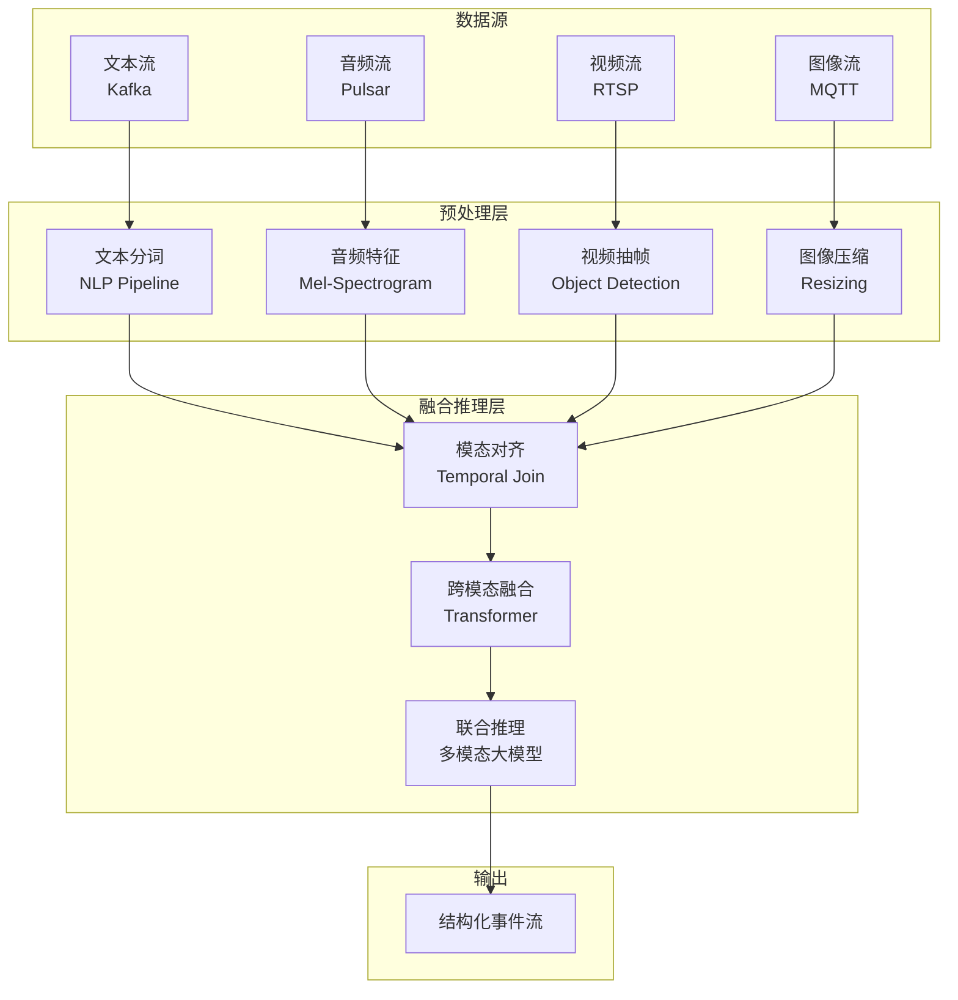
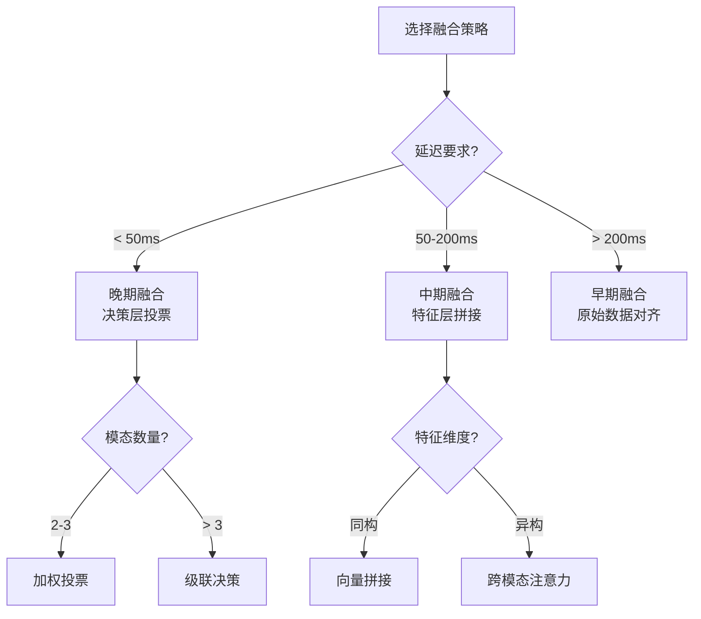

# 多模态流处理架构

> **所属阶段**: Knowledge/06-frontier/ | **前置依赖**: [实时 ML 推理专题](../06-frontier/realtime-ml-inference/06.04.01-ml-model-serving.md) | **形式化等级**: L4

---

## 1. 概念定义 (Definitions)

**Def-K-MM-01: 多模态流处理 (Multimodal Stream Processing)**
同时对文本、图像、音频、视频等多种模态的数据流进行实时采集、预处理、特征提取、融合分析和推理响应的流计算范式。其核心挑战在于不同模态数据的采样率、数据体积、语义空间和处理延迟存在显著差异。

**Def-K-MM-02: 跨模态嵌入 (Cross-Modal Embedding)**
将来自不同模态的数据映射到统一的低维向量空间，使得语义相近的内容（如一段语音和其对应的文字转写）在向量空间中距离接近，从而支持跨模态检索和相似性计算。

**Def-K-MM-03: 模态对齐 (Modality Alignment)**
基于时间戳或事件触发机制，将来自不同传感器的异构数据流在时序上进行同步和对齐，确保融合分析时各模态数据指向同一语义时刻。

---

## 2. 属性推导 (Properties)

**Lemma-K-MM-01: 模态延迟差异的边界**
在典型多模态系统中，文本流延迟 < 10ms，音频流帧延迟 20-40ms，视频流帧延迟 33ms（30fps）至 16ms（60fps），而高分辨率图像流批处理延迟可达 100-500ms。系统总响应时间受限于最慢模态的处理路径。

**Lemma-K-MM-02: 跨模态融合的精度-效率权衡**
早期融合（在特征层之前合并）通常能获得更高的下游任务精度，但需要处理模态间的维度异构和时间错位；晚期融合（在决策层合并）实现简单、延迟低，但可能损失模态间的互补信息。

**Prop-K-MM-01: 流式分片是处理高分辨率视觉数据的关键**
将视频/图像流按场景、对象或时间窗口进行实时分片（Sharding），可以将大体积的视觉处理任务并行化到多个 Flink Task，避免单点瓶颈。

---

## 3. 关系建立 (Relations)

### 3.1 多模态流处理架构



### 3.2 模态特性对比

| 模态 | 数据率 | 典型延迟 | 预处理复杂度 | 融合位置 |
|------|--------|---------|-------------|---------|
| 文本 | 低 | < 10ms | 低 | 早期/晚期 |
| 音频 | 中 | 20-40ms | 中 | 特征层 |
| 图像 | 高 | 50-200ms | 高 | 特征层 |
| 视频 | 极高 | 100-500ms | 极高 | 晚期/决策层 |

---

## 4. 论证过程 (Argumentation)

### 4.1 为什么需要流式多模态处理？

1. **实时智能监控**：同时分析摄像头的视频、麦克风的音频和传感器的文本告警，实现更精准的事件检测
2. **自动驾驶**：融合摄像头图像、激光雷达点云、GPS 文本和语音指令，毫秒级决策
3. **直播内容审核**：实时检测视频画面、语音内容和弹幕文本的违规信息
4. **工业质检**：结合视觉检测图像、设备振动音频和日志文本，全面评估产品质量

### 4.2 关键技术挑战

- **时间对齐**：不同模态的采集设备和网络路径不同，时间戳存在漂移
- **计算异构**：文本可用 CPU 处理，图像/视频需要 GPU 加速
- **存储压力**：视频流的存储和传输成本是文本流的 1000 倍以上
- **模型复杂性**：多模态大模型（如 CLIP、GPT-4V）推理延迟高，难以直接部署到流式场景

---

## 5. 形式证明 / 工程论证

### 5.1 模态对齐正确性

**定理 (Thm-K-MM-01)**: 设系统采用基于事件时间的水印机制进行模态对齐，若各模态 Source 的乱序延迟上界为 $\delta_i$，且水印生成函数为 $W(t) = \min_i(t - \delta_i)$，则在窗口触发时，窗口内包含所有事件时间 $\leq W(t)$ 的记录，且遗漏记录的概率为 0（在乱序边界内）。

**工程论证**：

1. Flink 的 Watermark 机制为每个模态流独立生成水印
2. 在 Co-ProcessFunction 或 Interval Join 中，以最小水印作为联合窗口的触发条件
3. 只要各模态的乱序边界 $\delta_i$ 被正确估计，就不会因为等待过慢模态而无限阻塞
4. 触发时，所有在乱序边界内到达的记录都会被包含在窗口计算中
5. 超出乱序边界的迟到记录可选择丢弃或 side-output 处理

---

## 6. 实例验证

### 6.1 Flink 多模态对齐作业

```java
DataStream<TextEvent> textStream = env
    .addSource(new KafkaSource<>())
    .assignTimestampsAndWatermarks(
        WatermarkStrategy.<TextEvent>forBoundedOutOfOrderness(Duration.ofSeconds(2))
            .withIdleness(Duration.ofMinutes(1))
    );

DataStream<VideoFrame> videoStream = env
    .addSource(new RstpSource())
    .assignTimestampsAndWatermarks(
        WatermarkStrategy.<VideoFrame>forBoundedOutOfOrderness(Duration.ofSeconds(5))
            .withIdleness(Duration.ofMinutes(1))
    );

// 基于事件时间的 Interval Join
textStream
    .keyBy(e -> e.sessionId)
    .intervalJoin(videoStream.keyBy(f -> f.sessionId))
    .between(Time.seconds(-3), Time.seconds(3))
    .process(new MultimodalFusionProcessFunction());
```

### 6.2 视频帧预处理配置

```python
# Flink Python UDF 进行视频帧预处理
from pyflink.table.udf import udf
from pyflink.table import DataTypes
import cv2
import numpy as np

@udf(result_type=DataTypes.ARRAY(DataTypes.FLOAT()))
def extract_video_features(frame_bytes):
    img = cv2.imdecode(np.frombuffer(frame_bytes, np.uint8), cv2.IMREAD_COLOR)
    img = cv2.resize(img, (224, 224))
    features = cv2.dnn.blobFromImage(img, 1.0, (224, 224), (0, 0, 0))
    return features.flatten().tolist()
```

### 6.3 跨模态融合模型服务配置

```yaml
# Triton Inference Server 多模态模型配置
name: "multimodal_fusion"
platform: "onnxruntime_onnx"
max_batch_size: 8
input:
  - name: "text_embedding"
    data_type: TYPE_FP32
    dims: [512]
  - name: "image_embedding"
    data_type: TYPE_FP32
    dims: [512]
output:
  - name: "fused_embedding"
    data_type: TYPE_FP32
    dims: [512]
instance_group:
  - count: 2
    kind: KIND_GPU
```

---

## 7. 可视化

### 7.1 多模态融合位置决策树



---

## 8. 引用参考
