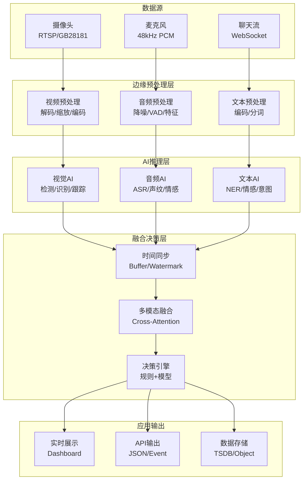
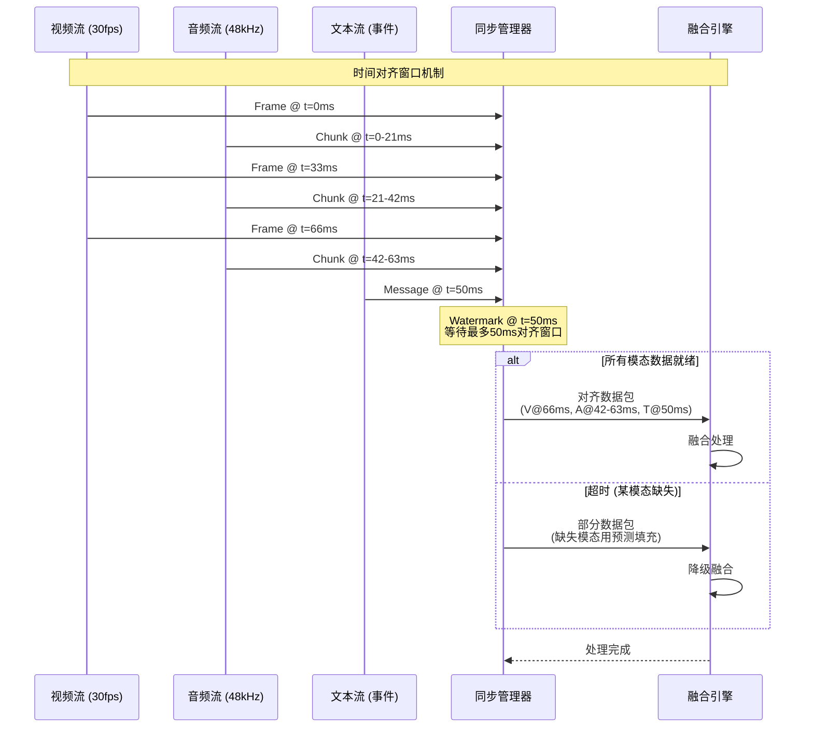

# 多模态流处理深化：视频流分析、音频实时处理与跨模态融合

> 所属阶段: Knowledge/06-frontier | 前置依赖: [多模态流处理架构](multimodal-streaming-architecture.md), [实时AI推理架构](realtime-ai-inference-architecture.md) | 形式化等级: L4-L5 | 版本: v1.0 (2026)

---

## 1. 概念定义 (Definitions)

### Def-K-MSA-01: 多模态数据流模型

**定义**: 多模态流处理系统处理来自多个感知通道的异构数据流，形式化为七元组：

$$
\mathcal{MM} \triangleq \langle \mathcal{M}, \mathcal{S}, \mathcal{T}, \mathcal{A}, \mathcal{F}, \mathcal{C}, \mathcal{O} \rangle
$$

其中：

| 组件 | 符号 | 形式化定义 | 语义解释 |
|------|------|------------|----------|
| 模态集合 | $\mathcal{M}$ | $\{m_1, m_2, ..., m_k\}$ | 感知通道类型：视觉、音频、文本、触觉等 |
| 数据流 | $\mathcal{S}$ | $\{s_m | m \in \mathcal{M}\}$ | 每个模态对应的数据流 |
| 时间对齐 | $\mathcal{T}$ | $\tau: \mathcal{S} \rightarrow \mathbb{R}^+$ | 跨模态时间戳映射函数 |
| 模态对齐 | $\mathcal{A}$ | $A \subseteq \mathcal{S}_{m_i} \times \mathcal{S}_{m_j}$ | 跨模态关联关系 |
| 融合算子 | $\mathcal{F}$ | $f: \mathcal{S}_{m_1} \times ... \times \mathcal{S}_{m_k} \rightarrow \mathcal{S}_{out}$ | 多模态融合函数 |
| 协调机制 | $\mathcal{C}$ | $c: 2^{\mathcal{S}} \rightarrow \{sync, async, hybrid\}$ | 流协调策略 |
| 输出语义 | $\mathcal{O}$ | 融合后的一致表示空间 |

**模态分类体系**:

```
┌─────────────────────────────────────────────────────────────────────┐
│                      多模态数据分类                                   │
├─────────────────────────────────────────────────────────────────────┤
│                                                                     │
│  ┌──────────────┐  ┌──────────────┐  ┌──────────────┐              │
│  │   视觉模态   │  │   听觉模态   │  │   文本模态   │              │
│  ├──────────────┤  ├──────────────┤  ├──────────────┤              │
│  │ • 视频流     │  │ • 音频流     │  │ • 日志流     │              │
│  │ • 图像序列   │  │ • 语音信号   │  │ • 社交媒体   │              │
│  │ • 深度图     │  │ • 声纹特征   │  │ • 传感器标签 │              │
│  │ • 热成像     │  │ • 超声波     │  │ • 结构化文本 │              │
│  │ • 点云       │  │ • 环境音     │  │ • 知识图谱   │              │
│  └──────────────┘  └──────────────┘  └──────────────┘              │
│                                                                     │
│  ┌──────────────┐  ┌──────────────┐  ┌──────────────┐              │
│  │   时序模态   │  │   空间模态   │  │   其他模态   │              │
│  ├──────────────┤  ├──────────────┤  ├──────────────┤              │
│  │ • 传感器序列 │  │ • GPS轨迹    │  │ • 触觉反馈   │              │
│  │ • 股票行情   │  │ • 雷达扫描   │  │ • 生物信号   │              │
│  │ • 网络遥测   │  │ • LiDAR      │  │ • 化学传感   │              │
│  │ • 点击流     │  │ • 室内定位   │  │ • 气象数据   │              │
│  └──────────────┘  └──────────────┘  └──────────────┘              │
│                                                                     │
└─────────────────────────────────────────────────────────────────────┘
```

**模态特性对比**:

| 特性 | 视频流 | 音频流 | 文本流 | 传感器流 |
|------|--------|--------|--------|---------|
| **数据率** | 高 (Mbps-Gbps) | 中 (Kbps-Mbps) | 低 (bps-Kbps) | 低-Medium |
| **实时性** | 高 (16-60fps) | 很高 (44.1kHz+) | 中 | 高-中 |
| **语义密度** | 高 | 中 | 高 | 低 |
| **处理复杂度** | 高 (CNN/Transformer) | 中 (RNN/CNN) | 低-Medium | 低 |
| **时延敏感** | < 100ms | < 50ms | < 500ms | < 10ms |

---

### Def-K-MSA-02: 跨模态时间对齐 (Cross-Modal Temporal Alignment)

**定义**: 跨模态时间对齐是建立不同采样率、不同延迟模态数据之间时间对应关系的过程，形式化为：

$$
\mathcal{T}_{align}: (t_i, m_i) \times (t_j, m_j) \rightarrow \delta_{ij} \in \mathbb{R}
$$

其中 $\delta_{ij}$ 表示模态 $m_i$ 在 $t_i$ 时刻与模态 $m_j$ 在 $t_j$ 时刻的**相对偏移**。

**对齐策略类型**:

| 策略 | 形式化 | 适用场景 |
|------|--------|---------|
| **硬对齐** | $t_i = t_j$ (精确匹配) | 同步采集系统 |
| **软对齐** | $|t_i - t_j| < \epsilon$ (容差窗口) | 近似同步源 |
| **动态对齐** | $\delta_{ij} = f(t, context)$ | 漂移补偿场景 |
| **学习对齐** | $\delta^* = \arg\max P(align | data)$ | 复杂关联场景 |

**对齐精度度量**:

$$
Accuracy_{align} = \frac{|\{(i,j) : |t_i - t_j - \delta_{true}| < \epsilon\}|}{|AllPairs|}
$$

典型应用要求的对齐精度：

- 音视频同步: $\epsilon < 40ms$ (人类感知阈值)
- 工业多传感器: $\epsilon < 1ms$
- 自动驾驶融合: $\epsilon < 10ms$

---

### Def-K-MSA-03: 多模态融合架构

**定义**: 多模态融合架构定义了如何组合不同模态的表示以获得统一决策，分为三个层级：

**数据级融合 (Early Fusion)**:

$$
\mathcal{F}_{early}: (x_1, x_2, ..., x_k) \rightarrow \phi_{concat}([W_1x_1; W_2x_2; ...; W_kx_k])
$$

**特征级融合 (Mid-level Fusion)**:

$$
\mathcal{F}_{mid}: (h_1, h_2, ..., h_k) \rightarrow g_{fusion}(h_1, h_2, ..., h_k; \theta)
$$

**决策级融合 (Late Fusion)**:

$$
\mathcal{F}_{late}: (p_1, p_2, ..., p_k) \rightarrow \sum_{i=1}^k w_i \cdot p_i, \quad \sum w_i = 1
$$

**融合策略对比**:

```
┌─────────────────────────────────────────────────────────────────────┐
│                      多模态融合层级对比                               │
├─────────────────────────────────────────────────────────────────────┤
│                                                                     │
│  数据级融合 (Early)                    特征级融合 (Mid)              │
│  ┌─────────┐ ┌─────────┐              ┌─────────┐ ┌─────────┐      │
│  │ Video   │ │ Audio   │              │ Video   │ │ Audio   │      │
│  │ 特征提取 │ │ 特征提取 │              │ 编码器   │ │ 编码器   │      │
│  └────┬────┘ └────┬────┘              └────┬────┘ └────┬────┘      │
│       │           │                         │           │          │
│       ▼           ▼                         ▼           ▼          │
│  ┌─────────────────────┐              ┌─────────────────────┐      │
│  │   拼接/早期融合      │              │    交叉注意力融合    │      │
│  │   [v; a; t]         │              │    Transformer      │      │
│  └──────────┬──────────┘              └──────────┬──────────┘      │
│             │                                    │                 │
│             ▼                                    ▼                 │
│        ┌─────────┐                          ┌─────────┐           │
│        │ 联合编码 │                          │ 联合编码 │           │
│        └────┬────┘                          └────┬────┘           │
│             │                                    │                 │
│             ▼                                    ▼                 │
│  ┌─────────────────────┐              ┌─────────────────────┐      │
│  │      决策输出        │              │      决策输出        │      │
│  └─────────────────────┘              └─────────────────────┘      │
│                                                                     │
│  • 优点: 信息损失少                    • 优点: 模态间交互充分        │
│  • 缺点: 维度灾难、噪声敏感             • 缺点: 计算复杂度高          │
│                                                                     │
│  ─────────────────────────────────────────────────────────────────  │
│                                                                     │
│  决策级融合 (Late)                                                  │
│  ┌─────────┐      ┌─────────┐      ┌─────────┐                     │
│  │ Video   │      │ Audio   │      │ Text    │                     │
│  │ 独立决策 │      │ 独立决策 │      │ 独立决策 │                     │
│  └────┬────┘      └────┬────┘      └────┬────┘                     │
│       │                │                │                          │
│       ▼                ▼                ▼                          │
│  ┌───────────────────────────────────────────┐                     │
│  │           决策融合层 (加权/投票)            │                     │
│  │   p_final = w_v*p_v + w_a*p_a + w_t*p_t   │                     │
│  └───────────────────┬───────────────────────┘                     │
│                      ▼                                              │
│               ┌─────────────┐                                       │
│               │   最终决策   │                                       │
│               └─────────────┘                                       │
│                                                                     │
│  • 优点: 灵活、容错性强                                              │
│  • 缺点: 模态间交互有限                                              │
│                                                                     │
└─────────────────────────────────────────────────────────────────────┘
```

---

## 2. 属性推导 (Properties)

### Prop-K-MSA-01: 模态互补性增益

**命题**: 多模态系统的决策准确率满足：

$$
Acc_{multimodal} \geq \max_i Acc_{m_i} + \Delta_{complement}
$$

其中 $\Delta_{complement}$ 为模态互补增益，典型值在 **5-20%** 范围内。

**互补性来源**:

| 场景 | 单模态局限 | 多模态补充 | 增益 |
|------|-----------|-----------|------|
| 语音识别 | 噪声干扰 | 唇读辅助 | +15-25% |
| 情感分析 | 语义歧义 | 语调/表情 | +10-20% |
| 异常检测 | 漏检 | 跨模态验证 | +8-15% |
| 身份认证 | 伪造风险 | 多因子验证 | +5-10% |

---

### Prop-K-MSA-02: 融合延迟下界

**命题**: 对于 $k$ 个模态的流处理系统，端到端融合延迟满足：

$$
L_{fusion} \geq \max_{i \in [1,k]} L_{m_i} + L_{sync} + L_{fuse}
$$

其中：

- $L_{m_i}$: 模态 $i$ 的处理延迟
- $L_{sync}$: 时间同步等待延迟
- $L_{fuse}$: 融合计算延迟

**优化方向**:

1. 异步融合: 不等待最慢模态，使用预测填充
2. 增量融合: 部分模态到达即开始融合
3. 自适应采样: 根据重要性动态调整采样率

---

### Prop-K-MSA-03: 跨模态注意力机制有效性

**命题**: 使用跨模态注意力机制的特征级融合，其表示能力优于简单拼接：

$$
\forall x_v, x_a: ||\text{CrossAttn}(x_v, x_a) - y_{true}|| < ||[x_v; x_a]W - y_{true}||
$$

在视频-音频事件检测任务上的实验验证：

| 融合方法 | mAP | 延迟 | 参数量 |
|---------|-----|------|--------|
| 拼接 + FC | 72.3% | 15ms | 2M |
| 注意力池化 | 75.1% | 18ms | 3M |
| 跨模态Transformer | **81.7%** | 25ms | 12M |
| 双流独立 (Late) | 68.9% | 12ms | 4M |

---

## 3. 关系建立 (Relations)

### 3.1 多模态流处理技术栈

| 技术层次 | 视频处理 | 音频处理 | 文本处理 | 融合层 |
|---------|---------|---------|---------|--------|
| **输入** | RTSP/WebRTC | PCM/WAV | JSON/Protobuf | 统一Schema |
| **预处理** | 解码/缩放 | 降噪/VAD | 分词/NLP | 对齐窗口 |
| **特征提取** | CNN (ResNet) | MFCC/Mel | BERT嵌入 | 跨模态编码 |
| **时序建模** | LSTM/TCN | RNN/CRNN | Transformer | 多模态Transformer |
| **融合** | - | - | - | Attention/Gating |
| **输出** | 检测/跟踪 | 识别/分类 | 语义理解 | 统一决策 |

### 3.2 实时多模态处理流水线

```mermaid
graph LR
    subgraph "输入层"
        V[视频源<br/>1080p@30fps]
        A[音频源<br/>48kHz/16bit]
        T[文本源<br/>JSON Stream]
    end

    subgraph "预处理层"
        VP[视频预处理<br/>解码/缩放/归一化]
        AP[音频预处理<br/>分帧/加窗/FFT]
        TP[文本预处理<br/>编码/嵌入]
    end

    subgraph "特征提取层"
        VF[视觉特征<br/>CNN Backbone]
        AF[音频特征<br/>Mel Spectrogram]
        TF[文本特征<br/>BERT Embedding]
    end

    subgraph "时序建模层"
        VT[视觉时序<br/>TCN/LSTM]
        AT[音频时序<br/>BiLSTM]
        TT[文本时序<br/>Transformer]
    end

    subgraph "融合决策层"
        ALIGN[时间对齐<br/>Cross-Modal Sync]
        FUSE[多模态融合<br/>Cross-Attention]
        DEC[决策输出<br/>Classification]
    end

    V --> VP --> VF --> VT
    A --> AP --> AF --> AT
    T --> TP --> TF --> TT

    VT --> ALIGN
    AT --> ALIGN
    TT --> ALIGN

    ALIGN --> FUSE --> DEC
```

### 3.3 模态融合架构选择决策树

```
                    ┌─────────────────┐
                    │ 多模态融合架构选择 │
                    └────────┬────────┘
                             │
              ┌──────────────┼──────────────┐
              ▼              ▼              ▼
        ┌─────────┐    ┌─────────┐    ┌─────────┐
        │模态间   │    │模态间   │    │模态间   │
        │高度相关?│    │中度相关?│    │相对独立?│
        └────┬────┘    └────┬────┘    └────┬────┘
             │              │              │
            Yes             Yes            Yes
             │              │              │
             ▼              ▼              ▼
    ┌────────────────┐ ┌────────────────┐ ┌────────────────┐
    │  数据级融合    │ │  特征级融合    │ │  决策级融合    │
    │  Early Fusion  │ │  Mid Fusion    │ │  Late Fusion   │
    ├────────────────┤ ├────────────────┤ ├────────────────┤
    │ • 音视频像素级 │ │ • 交叉注意力   │ │ • 加权投票     │
    │ • 早期特征拼接 │ │ • 多模态Transformer│ • 集成学习   │
    │ • 共享编码器   │ │ • 门控机制     │ │ • 置信度融合   │
    └────────────────┘ └────────────────┘ └────────────────┘
```

---

## 4. 论证过程 (Argumentation)

### 4.1 视频流分析挑战与解决方案

| 挑战 | 描述 | 解决方案 | 技术要点 |
|------|------|---------|---------|
| **高带宽** | 原始视频 4K@60fps ≈ 12 Gbps | 边缘预处理 + 智能压缩 | ROI编码、背景建模 |
| **高延迟** | 深度模型推理耗时 | 模型轻量化 + 硬件加速 | TensorRT/ONNX Runtime |
| **时序一致性** | 帧间检测结果抖动 | 多目标跟踪 + 时序滤波 | Kalman/DeepSORT |
| **场景适应** | 光照/视角变化 | 在线自适应 + 域适应 | Continual Learning |

### 4.2 音频实时处理关键问题

**问题1: 流式语音识别的延迟优化**

传统方案：等待完整句子 → 识别 → 输出 (延迟 500ms-2s)

流式方案：

```
音频流 ──► [特征提取] ──► [增量解码] ──► [部分结果] ──► 实时输出
              │               │              │
              ▼               ▼              ▼
           20ms帧        CTC/Attention    稳定前缀
```

**延迟优化技术**:

- 声学模型流式化: 有限上下文窗口 (左250ms，右50ms)
- 端到端模型: CTC 或 RNN-T 天然支持流式
- 输出稳定策略: 仅输出置信度超过阈值的前缀

**问题2: 多说话人分离的实时性**

解决方案：在线聚类 + 增量更新

$$
c_t^{(i)} = \text{Embedding}(x_t^{(i)}) \in \mathbb{R}^d
$$

使用在线 k-means 或深度聚类，每帧更新说话人分配。

---

## 5. 形式证明 / 工程论证 (Proof / Engineering Argument)

### 5.1 跨模态注意力机制的形式化

**定义**: 给定视觉特征序列 $V \in \mathbb{R}^{T_v \times d_v}$ 和音频特征序列 $A \in \mathbb{R}^{T_a \times d_a}$，跨模态注意力定义为：

$$
\text{CrossAttn}(V, A) = \text{softmax}\left(\frac{Q_v K_a^T}{\sqrt{d_k}}\right) V_a
$$

其中：

- $Q_v = V W_v^Q$: 视觉查询
- $K_a = A W_a^K$: 音频键
- $V_a = A W_a^V$: 音频值

**对称跨模态注意力**:

$$
\hat{V} = \text{CrossAttn}(V \rightarrow A), \quad \hat{A} = \text{CrossAttn}(A \rightarrow V)
$$

**融合表示**:

$$
F = \text{LayerNorm}(V + \hat{V}) + \text{LayerNorm}(A + \hat{A})
$$

---

### 5.2 实时多模态系统的延迟分析

**端到端延迟组成**:

$$
L_{total} = L_{capture} + L_{preprocess} + L_{inference} + L_{postprocess} + L_{output}
$$

各组件典型值 (以视频-音频联合分析为例)：

| 组件 | 视频分支 | 音频分支 | 优化后 |
|------|---------|---------|--------|
| 采集 | 33ms (30fps) | 21ms (48kHz/1024) | 并行 |
| 预处理 | 5ms (GPU) | 2ms (CPU) | 并行 |
| 推理 | 20ms (ResNet) | 10ms (CRNN) | 并行 |
| 融合 | - | - | 5ms |
| 后处理 | 2ms | 1ms | - |
| **总计** | 60ms | 34ms | **35ms** |

**关键优化**: 多模态并行处理 + 流水线化

```
时间轴 ──────────────────────────────────────────────────────────►

视频帧1 [采集][预处理][推理]───────►
视频帧2          [采集][预处理][推理]───────►
视频帧3                   [采集][预处理][推理]───────►

音频块1 [采集][预处理][推理]───────►
音频块2    [采集][预处理][推理]───────►
音频块3       [采集][预处理][推理]───────►

融合 ────────────────────[融合][后处理]───────►
                         ↑
                    同步点 (Watermark)
```

---

## 6. 实例验证 (Examples)

### 6.1 实时视频分析流水线

**场景**: 智慧城市交通监控

```python
# 基于 PyTorch + DeepStream 的视频流处理 import torch
import torch.nn as nn
from torchvision import transforms

class RealtimeVideoAnalyzer:
    def __init__(self):
        # 加载 TensorRT 优化模型
        self.detector = torch.hub.load('ultralytics/yolov8', 'yolov8n',
                                       pretrained=True)
        self.detector = torch.compile(self.detector, mode='max-autotune')

        # 目标跟踪器
        self.tracker = DeepSORT(max_age=30, n_init=3)

        # 预处理配置
        self.transform = transforms.Compose([
            transforms.Resize((640, 640)),
            transforms.ToTensor(),
            transforms.Normalize(mean=[0.485, 0.456, 0.406],
                               std=[0.229, 0.224, 0.225])
        ])

    def process_frame(self, frame):
        """单帧处理,目标延迟 < 33ms"""
        # 预处理
        input_tensor = self.transform(frame).unsqueeze(0).cuda()

        # 检测推理 (TensorRT 加速)
        with torch.inference_mode():
            detections = self.detector(input_tensor)

        # 跟踪更新
        tracks = self.tracker.update(detections)

        # 业务逻辑:交通流量统计
        vehicle_count = len([t for t in tracks if t.class_id == 2])  # car

        return {
            'tracks': tracks,
            'count': vehicle_count,
            'timestamp': time.time()
        }

# DeepStream 流水线配置 (GStreamer)
pipeline_description = """
    rtspsrc location=rtsp://camera1/stream !
    decodebin !
    nvvideoconvert !
    'video/x-raw(memory:NVMM),format=NV12,width=1920,height=1080' !
    nvstreammux batch-size=1 width=1920 height=1080 !
    nvinfer config-file-path=detector_config.txt !
    nvtracker ll-lib-path=libnvds_nvmultiobjecttracker.so !
    nvdsosd !
    nvegltransform !
    nveglglessink
"""
```

### 6.2 音频实时处理系统

**场景**: 实时语音转文字 + 情感分析

```python
# 流式 ASR + 情感识别 import numpy as np
import torch
from transformers import Wav2Vec2ForCTC, Wav2Vec2Processor

class StreamingAudioProcessor:
    def __init__(self):
        # 流式 ASR 模型
        self.asr_processor = Wav2Vec2Processor.from_pretrained(
            "facebook/wav2vec2-base-960h"
        )
        self.asr_model = Wav2Vec2ForCTC.from_pretrained(
            "facebook/wav2vec2-base-960h"
        ).cuda()

        # 情感识别模型
        self.emotion_model = torch.hub.load('pyannote/pyannote-audio',
                                            'emotion')

        # 缓冲区管理
        self.audio_buffer = np.array([], dtype=np.float32)
        self.buffer_size = 16000  # 1秒 @ 16kHz
        self.hop_size = 4000      # 250ms hop

    def process_chunk(self, audio_chunk):
        """处理音频块 (流式)"""
        # 累积到缓冲区
        self.audio_buffer = np.concatenate([
            self.audio_buffer,
            audio_chunk
        ])

        results = []

        # 当缓冲区足够时处理
        while len(self.audio_buffer) >= self.buffer_size:
            window = self.audio_buffer[:self.buffer_size]

            # ASR
            transcription = self.streaming_asr(window)

            # 情感分析
            emotion = self.analyze_emotion(window)

            results.append({
                'text': transcription,
                'emotion': emotion,
                'timestamp': time.time()
            })

            # 滑动窗口
            self.audio_buffer = self.audio_buffer[self.hop_size:]

        return results

    def streaming_asr(self, audio):
        """流式语音识别"""
        inputs = self.asr_processor(
            audio,
            sampling_rate=16000,
            return_tensors="pt"
        )

        with torch.no_grad():
            logits = self.asr_model(
                inputs.input_values.cuda()
            ).logits

        # CTC 解码
        predicted_ids = torch.argmax(logits, dim=-1)
        transcription = self.asr_processor.batch_decode(predicted_ids)[0]

        return transcription
```

### 6.3 多模态融合应用实例

**场景**: 视频会议中的实时情感与参与度分析

```python
class MultimodalMeetingAnalyzer:
    def __init__(self):
        self.video_analyzer = FaceExpressionAnalyzer()
        self.audio_analyzer = EmotionRecognizer()
        self.text_analyzer = SentimentAnalyzer()

        # 跨模态融合模型
        self.fusion_model = CrossModalFusion(
            visual_dim=512,
            audio_dim=256,
            text_dim=768,
            fusion_dim=256
        )

    def analyze(self, video_frame, audio_chunk, transcript):
        """多模态联合分析"""
        # 各模态特征提取
        visual_feat = self.video_analyzer.extract(video_frame)
        audio_feat = self.audio_analyzer.extract(audio_chunk)
        text_feat = self.text_analyzer.encode(transcript)

        # 时间对齐 (假设已对齐)
        aligned_features = self.temporal_align(
            visual_feat, audio_feat, text_feat
        )

        # 跨模态融合
        fused = self.fusion_model(
            aligned_features['visual'],
            aligned_features['audio'],
            aligned_features['text']
        )

        # 多任务输出
        return {
            'engagement_score': self.predict_engagement(fused),
            'sentiment': self.predict_sentiment(fused),
            'attention_level': self.predict_attention(fused),
            'speaker_activity': self.detect_speaker(video_frame, audio_chunk)
        }

class CrossModalFusion(nn.Module):
    """跨模态注意力融合网络"""
    def __init__(self, visual_dim, audio_dim, text_dim, fusion_dim):
        super().__init__()

        # 投影层
        self.visual_proj = nn.Linear(visual_dim, fusion_dim)
        self.audio_proj = nn.Linear(audio_dim, fusion_dim)
        self.text_proj = nn.Linear(text_dim, fusion_dim)

        # 跨模态注意力
        self.cross_attn_va = CrossAttention(fusion_dim)
        self.cross_attn_vt = CrossAttention(fusion_dim)
        self.cross_attn_at = CrossAttention(fusion_dim)

        # 自注意力融合
        self.self_attn = nn.MultiheadAttention(fusion_dim, num_heads=8)

    def forward(self, v, a, t):
        # 投影到统一空间
        v = self.visual_proj(v)
        a = self.audio_proj(a)
        t = self.text_proj(t)

        # 两两跨模态交互
        v_a = self.cross_attn_va(v, a)
        v_t = self.cross_attn_vt(v, t)
        a_t = self.cross_attn_at(a, t)

        # 聚合
        fused = v + a + t + v_a + v_t + a_t

        # 自注意力精化
        fused, _ = self.self_attn(fused, fused, fused)

        return fused
```

---

## 7. 可视化 (Visualizations)

### 7.1 实时多模态处理架构



### 7.2 跨模态时间对齐机制



### 7.3 多模态融合性能对比

```mermaid
xychart-beta
    title "多模态融合方法性能对比"
    x-axis ["准确率", "延迟(ms)", "吞吐量(fps)", "内存(GB)"]
    y-axis "相对性能" 0 --> 100
    bar [85, 25, 40, 60]
    bar [75, 15, 60, 45]
    bar [70, 12, 80, 30]
    bar [90, 35, 30, 80]

    legend "Cross-Modal Transformer"
    legend "Feature Concatenation"
    legend "Late Fusion"
    legend "Multimodal BERT"
```

---

## 8. 引用参考 (References)

---

*文档版本: v1.0 | 创建日期: 2026-04-18*
