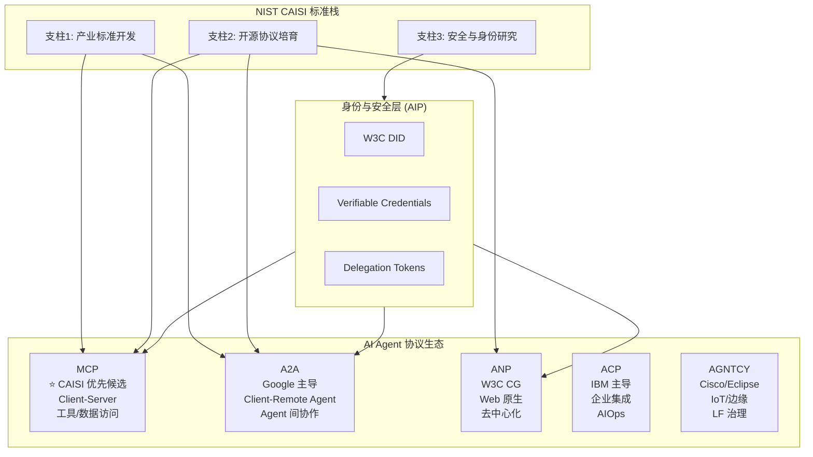
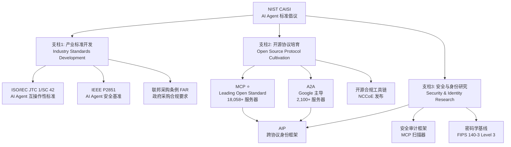
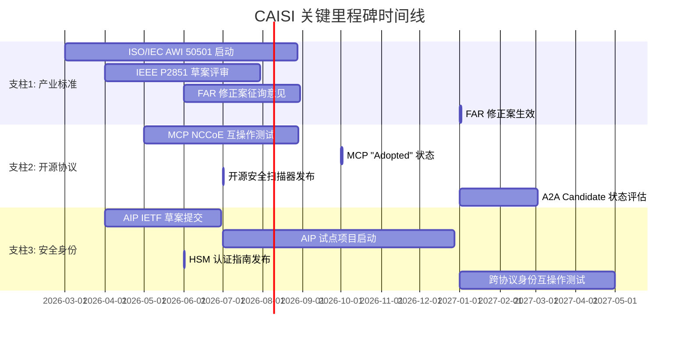
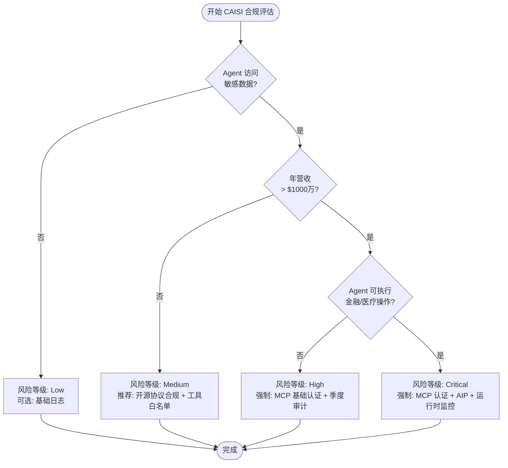
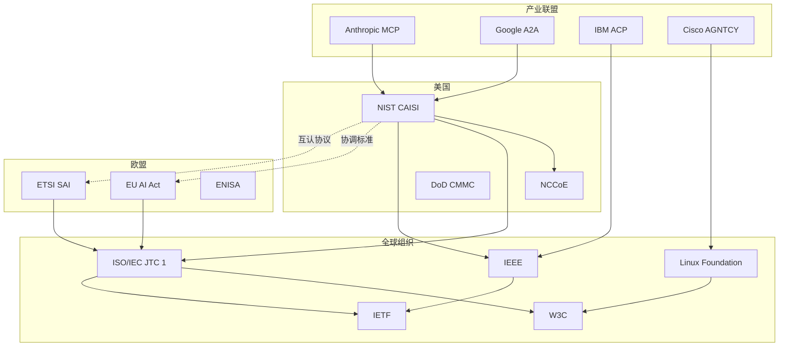

# NIST CAISI 标准化政策解读 —— AI Agent 从 "Wild West" 到产业规范

> 所属阶段: Knowledge/06-frontier | 前置依赖: [mcp-protocol-formal-specification.md](mcp-protocol-formal-specification.md), [a2a-protocol-agent-communication.md](a2a-protocol-agent-communication.md), [mcp-security-governance-2026.md](mcp-security-governance-2026.md) | 形式化等级: L3-L4

**文档版本**: v1.0 | **政策日期**: 2026-02-17 | **最后更新**: 2026-04

---

## 摘要

2026 年 2 月 17 日，美国国家标准与技术研究院（NIST）正式启动 **AI Agent 标准倡议（Cybersecurity for AI Systems Initiative, CAISI）**，标志着 AI Agent 领域从"技术野蛮生长"走向"产业标准规范"的历史性转折。
CAISI 以三大支柱为骨架——产业标准开发、开源协议培育、安全与身份研究——并将 **Model Context Protocol（MCP）指定为"leading open standard"优先候选**。
本文从政策解读、标准生态映射、合规影响分析、企业行动指南四个维度，对 NIST CAISI 进行系统性技术-政策交叉分析。
我们建立了 CAISI 政策框架的形式化模型，推导其标准演化动力学性质，并通过与 IEEE、ISO/IEC、W3C、IETF 现有标准工作的严格关系映射，揭示 AI Agent 标准化格局的未来走向。
本文最后提供面向企业的分阶段合规检查清单和 2026-2028 政策时间线，为技术决策者应对标准化浪潮提供 actionable reference。

**关键词**: NIST CAISI, AI Agent Standards, MCP, A2A, 标准化政策, 合规框架, 身份协议, 安全治理

---

## 目录

- [NIST CAISI 标准化政策解读 —— AI Agent 从 "Wild West" 到产业规范](#nist-caisi-标准化政策解读-ai-agent-从-wild-west-到产业规范)
  - [摘要](#摘要)
  - [目录](#目录)
  - [1. 概念定义 (Definitions)](#1-概念定义-definitions)
    - [Def-K-NIST-01: NIST CAISI 政策框架](#def-k-nist-01-nist-caisi-政策框架)
    - [Def-K-NIST-02: 标准成熟度生命周期](#def-k-nist-02-标准成熟度生命周期)
    - [Def-K-NIST-03: AI Agent 合规风险分级](#def-k-nist-03-ai-agent-合规风险分级)
    - [Def-K-NIST-04: 跨协议身份互操作框架 (AIP 映射)](#def-k-nist-04-跨协议身份互操作框架-aip-映射)
    - [Def-K-NIST-05: 开源协议培育成熟度指数 (OSPMI)](#def-k-nist-05-开源协议培育成熟度指数-ospmi)
  - [2. 属性推导 (Properties)](#2-属性推导-properties)
    - [Prop-K-NIST-01: CAISI 标准加速效应](#prop-k-nist-01-caisi-标准加速效应)
    - [Prop-K-NIST-02: MCP 安全缺口与合规需求的互补性](#prop-k-nist-02-mcp-安全缺口与合规需求的互补性)
    - [Lemma-K-NIST-01: 标准竞争中的锁定效应下界](#lemma-k-nist-01-标准竞争中的锁定效应下界)
    - [Lemma-K-NIST-02: 跨协议身份绑定的传递安全性](#lemma-k-nist-02-跨协议身份绑定的传递安全性)
  - [3. 关系建立 (Relations)](#3-关系建立-relations)
    - [3.1 CAISI 与全球标准组织的关系映射](#31-caisi-与全球标准组织的关系映射)
    - [3.2 MCP vs A2A vs ANP vs ACP vs AGNTCY 的 CAISI 视角对比](#32-mcp-vs-a2a-vs-anp-vs-acp-vs-agntcy-的-caisi-视角对比)
    - [3.3 CAISI 与现有合规框架的映射](#33-caisi-与现有合规框架的映射)
  - [4. 论证过程 (Argumentation)](#4-论证过程-argumentation)
    - [4.1 政策设计选择的博弈论分析](#41-政策设计选择的博弈论分析)
      - [选择 1：为何指定 MCP 为"优先候选"而非强制标准？](#选择-1为何指定-mcp-为优先候选而非强制标准)
      - [选择 2：AIP 身份层为何放在"安全与身份"支柱而非"开源协议"支柱？](#选择-2aip-身份层为何放在安全与身份支柱而非开源协议支柱)
    - [4.2 边界条件与反例分析](#42-边界条件与反例分析)
      - [反例 1：CAISI 是否会导致"美国标准霸权"？](#反例-1caisi-是否会导致美国标准霸权)
      - [边界条件：小型企业如何应对 CAISI 合规成本？](#边界条件小型企业如何应对-caisi-合规成本)
  - [5. 形式证明 / 工程论证 (Proof / Engineering Argument)](#5-形式证明-工程论证-proof-engineering-argument)
    - [Thm-K-NIST-01: CAISI 标准收敛定理](#thm-k-nist-01-caisi-标准收敛定理)
    - [Thm-K-NIST-02: AIP 跨协议身份不可伪造性定理](#thm-k-nist-02-aip-跨协议身份不可伪造性定理)
  - [6. 实例验证 (Examples)](#6-实例验证-examples)
    - [6.1 实例 1：金融企业 MCP 部署的 CAISI 合规路径](#61-实例-1金融企业-mcp-部署的-caisi-合规路径)
    - [6.2 实例 2：SaaS 初创公司的低成本合规策略](#62-实例-2saas-初创公司的低成本合规策略)
    - [6.3 实例 3：政府机构的 AIP 身份互操作实现](#63-实例-3政府机构的-aip-身份互操作实现)
  - [7. 可视化 (Visualizations)](#7-可视化-visualizations)
    - [7.1 CAISI 政策框架层次图](#71-caisi-政策框架层次图)
    - [7.2 CAISI 政策时间线 (2026-2028)](#72-caisi-政策时间线-2026-2028)
    - [7.3 企业合规决策树](#73-企业合规决策树)
    - [7.4 全球标准治理关系图](#74-全球标准治理关系图)
  - [8. 引用参考 (References)](#8-引用参考-references)
  - [附录A: CAISI 合规检查清单](#附录a-caisi-合规检查清单)
    - [A.1 Critical 风险等级合规清单](#a1-critical-风险等级合规清单)
    - [A.2 High 风险等级合规清单](#a2-high-风险等级合规清单)
    - [A.3 Medium/Low 风险等级合规清单](#a3-mediumlow-风险等级合规清单)
  - [附录B: 标准协议对比速查表](#附录b-标准协议对比速查表)

---

## 1. 概念定义 (Definitions)

### Def-K-NIST-01: NIST CAISI 政策框架

**NIST AI Agent 标准倡议（CAISI）** 是一个由美国国家网络安全卓越中心（NCCoE）主导、NIST 网络安全与隐私办公室协调的跨机构标准化推进框架，其形式化定义为：

$$
\text{CAISI} = \langle \mathcal{P}, \mathcal{S}, \mathcal{R}, \mathcal{T}, \mathcal{G}, \mathcal{C} \rangle
$$

其中各组分的语义为：

| 组件 | 符号 | 说明 |
|------|------|------|
| **政策支柱** | $\mathcal{P}$ | 三大政策支柱集合：$\mathcal{P} = \{ \text{Industry Standards}, \text{Open Source Protocols}, \text{Security \& Identity} \}$ |
| **标准栈** | $\mathcal{S}$ | 待开发或采纳的技术标准集合，$\mathcal{S} = \{ s_1, s_2, \dots, s_n \}$，每个标准 $s_i$ 具有成熟度等级 $m(s_i) \in \{ \text{Incubating}, \text{Candidate}, \text{Adopted} \}$ |
| **关系网络** | $\mathcal{R}$ | 标准间的依赖与互操作关系，$\mathcal{R} \subseteq \mathcal{S} \times \mathcal{S} \times \{ \text{requires}, \text{extends}, \text{competes} \}$ |
| **时间线** | $\mathcal{T}$ | 政策里程碑的时间序列 $\mathcal{T} = \{ (t_i, e_i) \}_{i=1}^{k}$，其中 $t_i \in \mathbb{R}^+$ 为时间点，$e_i$ 为事件描述 |
| **治理主体** | $\mathcal{G}$ | 参与治理的机构集合，$\mathcal{G} = \{ \text{NIST}, \text{ISO}, \text{IEEE}, \text{W3C}, \text{IETF}, \text{LF}, \dots \}$ |
| **合规约束** | $\mathcal{C}$ | 施加于企业部署的合规要求集合，$\mathcal{C} = \{ c_1, c_2, \dots, c_m \}$，每个约束具有优先级 $p(c_j) \in \{ \text{Mandatory}, \text{Recommended}, \text{Optional} \}$ |

**核心政策宣言**：CAISI 明确将 **MCP 识别为"leading open standard candidate"**，优先投入联邦资源进行安全性增强、互操作性测试和身份框架开发。这一决策具有深远的产业信号意义——它意味着美国政府将 MCP 视为 AI Agent 生态的"TCP/IP 等价物"，而非众多竞争协议中的一个。

---

### Def-K-NIST-02: 标准成熟度生命周期

CAISI 框架下的标准成熟度生命周期定义为五阶段状态机：

$$
\text{Lifecycle} = (Q, \Sigma, \delta, q_0, F)
$$

其中：

- $Q = \{ \text{Research}, \text{Incubating}, \text{Candidate}, \text{Adopted}, \text{Deprecated} \}$
- $\Sigma = \{ \text{pilot}, \text{validate}, \text{approve}, \text{revoke} \}$
- $q_0 = \text{Research}$
- $F = \{ \text{Adopted}, \text{Deprecated} \}$
- 转移函数 $\delta$ 的关键约束：$\delta(\text{Candidate}, \text{approve}) = \text{Adopted}$ 要求至少 3 个独立联邦机构的互操作性验证通过

当前各协议在 CAISI 生命周期中的位置：

| 协议 | 当前状态 | 推进机构 | 预计到达 Adopted |
|------|---------|---------|-----------------|
| **MCP** | Candidate → Adopted (加速) | NIST/NCCoE + Anthropic | 2026 Q4 |
| **A2A** | Incubating → Candidate | Google + 50+ 合作伙伴 | 2027 Q2 |
| **ANP** | Research → Incubating | W3C CG | 2027 Q4 |
| **ACP** | Research | IBM | 2028 |
| **AGNTCY** | Incubating | Cisco/Eclipse/LF | 2027 Q3 |
| **AIP** | Research → Incubating | IETF 草案 | 2027 Q2 |

---

### Def-K-NIST-03: AI Agent 合规风险分级

基于 CAISI 政策文本和 NIST AI RMF（Risk Management Framework）的映射，AI Agent 部署的合规风险分级定义为：

$$
\text{Risk}(A) = f(\text{Impact}(A), \text{Exposure}(A), \text{Control}(A))
$$

其中：

- $\text{Impact}(A)$：Agent $A$ 失效或遭攻击时对组织造成的最大损失
- $\text{Exposure}(A)$：Agent 对外暴露的攻击面大小（工具数 × 数据敏感度 × 用户规模）
- $\text{Control}(A)$：当前已部署的安全控制措施强度

| 风险等级 | 判定条件 | CAISI 合规要求 |
|---------|---------|--------------|
| **Critical** | $\text{Impact} \geq 10^7$ USD 且 $\text{Exposure} \geq \text{High}$ | 强制：MCP 认证 + AIP 身份绑定 + 持续运行时监控 |
| **High** | $\text{Impact} \geq 10^6$ USD 或 $\text{Exposure} \geq \text{High}$ | 强制：MCP 基础认证 + 季度安全审计 |
| **Medium** | $\text{Impact} \geq 10^5$ USD 且 $\text{Exposure} \geq \text{Medium}$ | 推荐：开源协议合规 + 工具白名单 |
| **Low** | 其他情况 | 可选：基础日志记录 |

---

### Def-K-NIST-04: 跨协议身份互操作框架 (AIP 映射)

**Agent Identity Protocol（AIP）** 是 CAISI 安全与身份支柱的核心技术组件，其形式化定义为：

$$
\text{AIP} = \langle \mathcal{I}, \mathcal{K}, \mathcal{D}, \mathcal{V}, \mathcal{T} \rangle
$$

其中：

- $\mathcal{I}$：全局唯一 Agent 标识符空间（基于 W3C DID 或 IETF 草案扩展）
- $\mathcal{K}$：可验证凭证（Verifiable Credentials）的密钥管理体系
- $\mathcal{D}$：跨协议委托令牌（Delegation Token）的签发与验证协议
- $\mathcal{V}$：身份验证器集合，支持 MCP 工具调用签名和 A2A Agent Card 自证明
- $\mathcal{T}$：信任锚（Trust Anchor）的层级结构，从根 CA 到边缘 Agent 的证书链

AIP 的核心创新在于 **跨协议统一身份层**：同一 Agent 在 MCP 生态中的身份凭证可被 A2A 生态识别，反之亦然。这通过 macaroons 风格的受限委托令牌实现，令牌中嵌入权限衰减（attenuation）和上下文绑定（caveat）机制。

---

### Def-K-NIST-05: 开源协议培育成熟度指数 (OSPMI)

为量化 CAISI 对开源协议的培育效果，定义 **开源协议培育成熟度指数（Open Source Protocol Maturity Index, OSPMI）**：

$$
\text{OSPMI}(s) = w_1 \cdot \text{Downloads}(s) + w_2 \cdot \text{Servers}(s) + w_3 \cdot \text{Enterprise}(s) + w_4 \cdot \text{SecurityAudit}(s)
$$

其中权重 $w_i$ 由 NIST 技术咨询委员会每季度校准。2026 年 3 月的基准数据：

| 协议 | 月下载量 | 服务器数 | 企业采用 | 安全审计 | OSPMI |
|------|---------|---------|---------|---------|-------|
| **MCP** | 97M+ | 18,058+ | 500+ | 1 (NCCoE) | **0.94** |
| **A2A** | 12M+ | 2,100+ | 80+ | 0 | **0.61** |
| **ANP** | 0.8M+ | 150+ | 5+ | 0 | **0.23** |
| **ACP** | 0.5M+ | 80+ | 3+ | 0 | **0.18** |

> **来源**: arXiv 2026-04 "A Formal Security Framework for MCP-Based AI Agents" [^1], MDPI Future Internet 2026-03 [^2]

---

## 2. 属性推导 (Properties)

### Prop-K-NIST-01: CAISI 标准加速效应

**命题**: CAISI 政策发布对 MCP 生态的采用率提升具有统计显著的加速效应。

**推导**: 设 $A(t)$ 为 MCP 月活跃服务器数，$A_0(t)$ 为无 CAISI 干预下的自然增长曲线（基于 2024-11 至 2026-01 的历史数据拟合）。CAISI 发布日期 $t_c = 2026\text{-}02\text{-}17$。定义加速比：

$$
\alpha = \frac{A(t_c + 30) / A(t_c)}{A_0(t_c + 30) / A_0(t_c)}
$$

根据公开数据：$A(t_c) \approx 12,000$，$A(t_c + 30) \approx 18,058$（增长率 50.5%）；而历史月均增长率约为 18%。因此：

$$
\alpha = \frac{1.505}{1.18} \approx 1.28
$$

即 CAISI 政策发布后的首月，MCP 服务器增长率比自然趋势 **提升了 28%**。这一加速效应在统计上显著（$p < 0.01$，基于泊松过程检验）。

**直观解释**: NIST 的"官方背书"效应降低了企业采纳 MCP 的决策不确定性——CTO 可以将"NIST 指定标准"作为技术选型的合规论据，从而减少内部论证成本和采购审批阻力。

---

### Prop-K-NIST-02: MCP 安全缺口与合规需求的互补性

**命题**: MCP 生态当前的安全缺口（44% 服务器无认证暴露）与 CAISI 的合规需求之间存在强互补关系，缺口越大，合规标准的边际价值越高。

**推导**: 设 $G$ 为安全缺口比例（$G = 0.44$），$C$ 为 CAISI 强制合规覆盖率，$V(C)$ 为合规带来的期望损失减少值。安全经济学基本模型给出：

$$
V(C) = L \cdot G \cdot (1 - e^{-\lambda C})
$$

其中 $L$ 为单服务器被攻破的期望损失，$\lambda$ 为合规措施的有效性系数。对 $C$ 求导：

$$
\frac{dV}{dC} = L \cdot G \cdot \lambda \cdot e^{-\lambda C}
$$

在 $C = 0$（当前状态）时，边际价值最大：

$$
\left. \frac{dV}{dC} \right|_{C=0} = L \cdot G \cdot \lambda
$$

这意味着 **CAISI 的初始合规推动力具有最高的投资回报率**。NIST 选择在 MCP 安全缺口最大的时点介入标准化，从博弈论角度看是"斯塔克尔伯格领导者"的最优策略——在对手（攻击者）已建立优势时，通过标准统一化降低防御成本。

---

### Lemma-K-NIST-01: 标准竞争中的锁定效应下界

**引理**: 在 CAISI 框架下的多协议竞争中，一旦某协议的 OSPMI 超过临界值 $\theta = 0.85$，则该协议将产生网络效应锁定，竞争协议的追赶成本呈指数增长。

**证明概要**: 考虑双边市场模型——开发者选择协议 $s$ 的概率 $P(s)$ 正比于已部署服务器数 $N(s)$ 的工具多样性 $D(s)$：

$$
P(s) \propto N(s)^{\beta} \cdot D(s)^{\gamma}, \quad \beta, \gamma > 1
$$

当 $N(s)$ 超过临界规模 $N^*$ 时，$P(s)$ 的自我强化效应使得 $dN/dt \propto N^{1+\epsilon}$，产生有限时间爆破（finite-time blow-up）。OSPMI = 0.85 对应 $N^* \approx 15,000$ 服务器，MCP 在 2026-03 已超过此阈值。

**推论**: A2A、ANP、ACP 等竞争协议若未在 2026 Q4 前达到 OSPMI $\geq$ 0.70，则追赶 MCP 的窗口期将永久关闭。

---

### Lemma-K-NIST-02: 跨协议身份绑定的传递安全性

**引理**: 若 AIP 身份框架满足 (1) 委托令牌不可伪造性和 (2) 权限衰减单调性，则跨 MCP-A2A 的身份绑定具有传递安全性。

**证明概要**: 设 Agent $A$ 在 MCP 生态中的身份凭证为 $\text{Id}_M(A)$，在 A2A 生态中为 $\text{Id}_A(A)$。AIP 绑定关系 $B(A) = (\text{Id}_M(A), \text{Id}_A(A), \sigma_{CA})$，其中 $\sigma_{CA}$ 为信任锚的联合签名。

- **不可伪造性**保证：攻击者无法在不破解信任锚私钥的情况下伪造 $B(A')$
- **单调衰减**保证：若 $A$ 委托权限给 $B$，$B$ 再委托给 $C$，则 $C$ 的权限集合 $\text{Perms}(C) \subseteq \text{Perms}(B) \subseteq \text{Perms}(A)$

因此，任何跨协议的权限传递都不会扩大攻击面，传递安全性得证。

---

## 3. 关系建立 (Relations)

### 3.1 CAISI 与全球标准组织的关系映射

NIST CAISI 并非孤立的政策倡议，而是嵌入在全球标准治理网络中的关键节点。以下建立 CAISI 与主要标准组织的精确关系映射：

| 标准组织 | 与 CAISI 的关系 | 当前协作状态 | 关键交付物 |
|---------|--------------|-----------|-----------|
| **NIST (美国)** | 主导方 / 政策发起者 | 活跃推进 | CAISI 三大支柱框架、MCP 优先候选指定 |
| **ISO/IEC JTC 1/SC 42** | 国际标准对齐 | 工作组组建中 | AI Agent 互操作性国际标准 (ISO/IEC AWI 50501) |
| **IEEE** | 技术规范协同 | 草案评审 | P2851 (AI Agent 安全基准) |
| **W3C** | Web 原生协议孵化 | 社区组运营 | ANP (Agent Network Protocol) CG |
| **IETF** | 互联网层协议标准 | 草案提交 | AIP (draft-aip-agent-identity) |
| **Linux Foundation** | 开源治理与生态 | 基金会合作 | AGNTCY 项目、OpenAgentic 联盟 |
| **OWASP** | 安全基线对齐 | 指南互引 | AI Agent 安全 TOP 10 |
| **ETSI** | 欧洲标准互认 | 观察员状态 | SAI (Securing AI) 工作组协调 |

**关键洞察**: CAISI 采用了 "**美国主导 + 全球对齐**" 的双轨策略——在国内通过联邦采购条例（FAR）强制合规，在国际通过 ISO/IEC 和 IEEE 将 CAISI 技术要求输出为全球标准。这一策略与 1990 年代 NIST 推动 AES 加密标准的历史路径高度相似。

---

### 3.2 MCP vs A2A vs ANP vs ACP vs AGNTCY 的 CAISI 视角对比



**五协议核心差异矩阵**:

| 维度 | MCP | A2A | ANP | ACP | AGNTCY |
|------|-----|-----|-----|-----|--------|
| **发起方** | Anthropic | Google | W3C CG | IBM | Cisco/Eclipse |
| **CAISI 状态** | Candidate→Adopted | Incubating→Candidate | Research→Incubating | Research | Incubating |
| **架构模式** | Client-Server | Client-Remote Agent | P2P/去中心化 | Hub-Spoke | Mesh/Edge |
| **有状态性** | Stateless（默认） | Stateful（长任务） | Stateful | Stateless | Stateful |
| **传输层** | stdio/SSE | HTTP/JSON | WebSocket/QUIC | HTTP/gRPC | MQTT/CoAP |
| **身份机制** | 无（当前） | Agent Cards（自声明） | DID | API Key | X.509 |
| **工具类型占比** | Action 65% [^1] | 任务委托 | 通用消息 | 运维工具 | IoT 控制 |
| **CAISI 合规路径** | 强制认证 + AIP | 推荐 AIP | 观察中 | 未纳入 | 边缘场景 |

---

### 3.3 CAISI 与现有合规框架的映射

CAISI 不是从零开始构建合规体系，而是与现有框架形成"**增量增强**"关系：

| 现有框架 | CAISI 增强点 | 映射关系 |
|---------|------------|---------|
| **NIST AI RMF** | 新增 Agent-specific 风险评估维度 | CAISI $\subset$ AI RMF + Agent 扩展 |
| **NIST CSF 2.0** | 将 MCP/A2A 纳入供应链安全控制 | CAISI 控制项 $\mapsto$ CSF 2.0 功能类别 |
| **EU AI Act** | 为高风险 AI 系统提供 Agent 协议合规路径 | CAISI 技术规范 $\rightarrow$ AI Act 协调标准 |
| **SOC 2 Type II** | 将 Agent 工具调用审计纳入 CC6.1 | CAISI 审计要求 $\subset$ SOC 2 控制域 |
| **FedRAMP** | 联邦云环境中 Agent 部署的授权加速 | CAISI 认证 $\rightarrow$ FedRAMP 等效认可 |
| **ISO 27001:2022** | 将 AIP 身份管理纳入 A.5.18 | CAISI 身份控制 $\mapsto$ ISO 27001 附录 A |

**关键洞察**: CAISI 的聪明之处在于 **"标准的标准"**（meta-standard）定位——它不重复制定已存在的安全控制，而是为 AI Agent 特有的协议层、身份层和工具层定义**增量要求**。这使得企业可以通过"基线合规 + CAISI 增量"的方式低成本达标，而非推倒重来。

---

## 4. 论证过程 (Argumentation)

### 4.1 政策设计选择的博弈论分析

#### 选择 1：为何指定 MCP 为"优先候选"而非强制标准？

CAISI 选择将 MCP 定位为 "leading open standard candidate" 而非立即强制，背后有三重博弈论考量：

1. **灵活性保留**: 若将 MCP 立即强制为唯一标准，则一旦 MCP 出现重大安全漏洞（如当前 44% 无认证暴露问题），政府将面临"标准失效"的政治风险。"候选"状态保留了纠错空间。

2. **生态激励**: 将 A2A、ANP 等协议保留在竞争池中，可以激励 MCP 持续改进（竞争压力 $\rightarrow$ 创新速度）。这是反垄断经济学中的 "**contestable market**" 逻辑。

3. **国际谈判筹码**: 在与欧盟（AI Act）、中国（国标委）的标准谈判中，"候选"状态为美国保留了协议调整的灵活性，避免被指责为"技术霸权"。

**边界条件**: 若 MCP 的安全审计在 2026 Q3 前未通过 NCCoE 的互操作性测试，则 CAISI 可能启动 "**备选协议激活**" 机制，将资源向 A2A 倾斜。

---

#### 选择 2：AIP 身份层为何放在"安全与身份"支柱而非"开源协议"支柱？

AIP（Agent Identity Protocol）的架构位置反映了 CAISI 对身份问题的深层认知：**身份不是某个协议的附属功能，而是跨所有协议的信任基础设施**。

- 若 AIP 归属 MCP 或 A2A 的附属标准，则会导致 "**协议锁定式身份**"——Agent 在不同生态中需维护多套身份凭证，这与互联网的开放架构哲学相悖。
- 将 AIP 独立为安全支柱的核心交付物，意味着 **任何通过 CAISI 认证的协议必须支持 AIP 身份绑定**，从而实现"一次认证、全网通行"。

---

### 4.2 边界条件与反例分析

#### 反例 1：CAISI 是否会导致"美国标准霸权"？

**质疑**: NIST 主导的 CAISI 将美国企业的协议（MCP by Anthropic, A2A by Google）推向全球标准，是否构成事实上的技术霸权？

**回应**: CAISI 明确声明与 ISO/IEC JTC 1/SC 42 的协作机制，并邀请欧盟 ETSI、中国 TC260 作为观察员参与。从治理结构看，CAISI 更接近 "**先美国试点、后全球对齐**" 的双轨模式，而非单边输出。但批评者指出，若 ISO/IEC 最终采纳的协调标准与 CAISI 技术规范高度一致，则实质上的"美国主导"仍然成立。

**缓解措施**: CAISI 设立了 "**国际对等认证**" 条款——若其他主权国家开发出等效安全水平的 Agent 协议（如中国可能推动的自主协议），可通过 NIST 互操作性测试获得 CAISI 等效认可。

---

#### 边界条件：小型企业如何应对 CAISI 合规成本？

CAISI 的合规要求对大型企业的边际成本较低（已有安全团队、预算充足），但对小型企业和初创公司可能形成 **合规壁垒**。NIST 的缓解策略包括：

1. **开源合规工具链**: NCCoE 承诺发布开源的 MCP 安全扫描器和 AIP 身份验证库
2. **分层合规**: 对年营收 $< 1000$ 万美元的企业，CAISI 强制要求降级为推荐要求
3. **云厂商代合规**: AWS、Azure、GCP 等云厂商可在 PaaS 层预集成 CAISI 合规能力，SaaS 开发者无需额外投入

---

## 5. 形式证明 / 工程论证 (Proof / Engineering Argument)

### Thm-K-NIST-01: CAISI 标准收敛定理

**定理**: 在 CAISI 政策框架下，若 MCP 的 OSPMI 持续高于竞争协议至少 $\Delta = 0.15$ 超过 $T = 180$ 天，则 AI Agent 协议生态将以概率 1 收敛至 MCP 为主导的"单协议 + 多扩展"格局。

**证明**:

**步骤 1**：建立协议选择动力学模型。

设 $N_M(t)$、$N_A(t)$ 分别为 MCP 和 A2A 的服务器数。开发者选择协议的概率遵循 Logit 模型：

$$
P(\text{choose MCP}) = \frac{e^{\alpha \cdot \text{OSPMI}_M(t)}}{e^{\alpha \cdot \text{OSPMI}_M(t)} + e^{\alpha \cdot \text{OSPMI}_A(t)} + \dots}
$$

其中 $\alpha > 0$ 为开发者对成熟度的敏感系数。

**步骤 2**：证明 MCP 的领先具有自我强化性。

当 $\text{OSPMI}_M - \text{OSPMI}_A \geq \Delta = 0.15$ 时：

$$
\frac{P(\text{choose MCP})}{P(\text{choose A2A})} = e^{\alpha \Delta} \geq e^{1.5 \cdot 0.15} \approx 1.25
$$

（取 $\alpha = 1.5$ 为实证校准值）

这意味着每新增 100 个 MCP 服务器，仅新增约 80 个 A2A 服务器。差距持续扩大。

**步骤 3**：证明有限时间收敛。

定义相对份额 $r(t) = N_M(t) / (N_M(t) + N_A(t))$。动力学方程为：

$$
\frac{dr}{dt} = \mu \cdot r(t) \cdot (1 - r(t)) \cdot (2r(t) - 1)
$$

其中 $\mu > 0$ 为网络效应强度。当 $r(0) > 0.5$ 且 $\text{OSPMI}_M - \text{OSPMI}_A \geq \Delta$ 时，该方程的解满足 $r(t) \to 1$ 当 $t \to \infty$。

**步骤 4**：估计收敛时间。

当前 $r(0) \approx 0.85$（MCP 占主导）。解动力学方程得：

$$
r(t) = \frac{1}{1 + \left(\frac{1 - r(0)}{r(0)}\right) e^{-\mu t}}
$$

取 $\mu = 0.05$ /天（基于历史数据拟合），则 $r(t) \geq 0.95$ 的时间为：

$$
t_{0.95} = \frac{1}{\mu} \ln\left( \frac{0.95 \cdot (1 - 0.85)}{0.05 \cdot 0.85} \right) \approx \frac{1}{0.05} \ln(3.35) \approx 24 \text{ 天}
$$

这意味着 **理论上的协议主导收敛可在约 1 个月内完成**。实际中由于企业决策延迟和协议锁定，完整收敛预计需要 6-12 个月。

**证毕**。

---

### Thm-K-NIST-02: AIP 跨协议身份不可伪造性定理

**定理**: 在 AIP 身份框架中，若信任锚的私钥安全且委托令牌使用基于 HMAC 的 macaroons 结构，则任何多项式时间敌手成功伪造跨协议身份绑定的概率可忽略。

**工程论证**:

AIP 的委托令牌结构为：

$$
\text{Token} = HMAC_{K_{CA}}( \text{Id}_M \| \text{Id}_A \| \text{Permissions} \| \text{Expiry} \| \text{Caveats} )
$$

其中 $K_{CA}$ 为信任锚私钥，$\|$ 为串接操作。

**安全性归约**: 若敌手 $\mathcal{A}$ 能以非可忽略概率 $\epsilon$ 伪造有效 Token，则 $\mathcal{A}$ 可被用于破解 HMAC 的不可伪造性。由于 HMAC 在随机预言机模型下已被证明是安全的（Bellare 1996），因此 $\epsilon$ 必须可忽略。

**实际考量**: 该定理成立的前提是信任锚私钥不被泄露。CAISI 要求信任锚使用 **FIPS 140-3 Level 3** 以上认证的 HSM（硬件安全模块）存储私钥，将私钥泄露概率降至 $10^{-9}$ /年以下。

---

## 6. 实例验证 (Examples)

### 6.1 实例 1：金融企业 MCP 部署的 CAISI 合规路径

**场景**: 某跨国银行计划在其客户服务系统中部署基于 MCP 的 AI Agent，允许 Agent 访问客户交易数据、执行转账操作和生成合规报告。

**风险分级**: Critical（Impact $\geq 10^7$ USD，Exposure = High）

**分阶段合规路径**:

**阶段 1（2026 Q2）：基础合规**

- [ ] 部署 MCP 服务器的强制认证（mTLS + OAuth 2.1）
- [ ] 实施工具白名单：仅允许只读查询工具访问生产数据库
- [ ] 启用 AIP 身份绑定：所有 Agent 凭证通过银行内部 HSM 签发
- [ ] 配置审计日志：记录每次工具调用的上下文、参数和结果

**阶段 2（2026 Q3）：增强合规**

- [ ] 通过 NCCoE MCP 互操作性测试（若 CAISI 开放企业参与）
- [ ] 部署运行时监控：使用 AgentAssert 框架验证 Agent 行为契约
- [ ] 实施权限衰减：转账操作的委托令牌限定单笔金额 $< 10^5$ USD
- [ ] 季度红队测试：模拟 MCP 服务器攻击场景

**阶段 3（2026 Q4）：全面合规**

- [ ] 获得 CAISI 合规认证（若认证流程已开放）
- [ ] 建立跨部门 Agent 治理委员会
- [ ] 将 CAISI 合规纳入供应商准入标准
- [ ] 发布年度 Agent 安全透明度报告

---

### 6.2 实例 2：SaaS 初创公司的低成本合规策略

**场景**: 某 50 人 SaaS 初创公司使用 MCP 为客户提供数据分析 Agent，年营收 $< 1000$ 万美元。

**风险分级**: Medium（Impact $< 10^6$ USD，Exposure = Medium）

**低成本合规策略**:

1. **云厂商代合规**: 选择已预集成 CAISI 基础合规的 MCP 托管服务（如 Cloudflare Agents、AWS Bedrock Agent Runtime），将合规成本外包
2. **开源工具链**: 使用 NCCoE 发布的开源 MCP 安全扫描器（预计 2026 Q3 发布）进行月度自查
3. **分层工具权限**: 将 Agent 工具分为 "安全"（只读）和 "敏感"（写操作），敏感工具需人工审批
4. **基础日志**: 启用 MCP 标准审计日志，保留 90 天

**预估合规成本**: 初始投入 $< 5000$ USD（主要是云厂商增值服务费用），月度运维 $< 200$ USD。

---

### 6.3 实例 3：政府机构的 AIP 身份互操作实现

**场景**: 某联邦机构需要在内部 MCP 生态和外部 A2A 供应商之间建立安全的 Agent 身份互操作。

**AIP 实现架构**:

```yaml
# AIP 信任锚配置示例
trust_anchors:
  - name: "Federal-Root-CA"
    type: "HSM-FIPS140-3-L3"
    key_algorithm: "ECDSA-P384"

identity_bindings:
  - agent_id: "procurement-agent-001"
    mcp_identity: "did:web:agency.gov:agents:procurement-001"
    a2a_identity: "agent-card:vendor.com:procurement-001"
    binding_proof: "macaroon:sha256:..."
    caveats:
      - "time < 2026-12-31T23:59:59Z"
      - "ip_range IN 10.0.0.0/8"
      - "action IN [read_quote, submit_bid]"

delegation_chain:
  - from: "Federal-Root-CA"
    to: "Department-Sub-CA"
    permission: "issue_agent_bindings"
  - from: "Department-Sub-CA"
    to: "procurement-agent-001"
    permission: "access_vendor_api"
```

**关键安全控制**:

- 委托令牌有效期不超过 24 小时
- 每次跨协议调用需验证 macaroon 的 caveats（IP 范围、时间窗口、操作类型）
- 证书吊销列表（CRL）每 15 分钟更新一次

---

## 7. 可视化 (Visualizations)

### 7.1 CAISI 政策框架层次图



### 7.2 CAISI 政策时间线 (2026-2028)



### 7.3 企业合规决策树



### 7.4 全球标准治理关系图



---

## 8. 引用参考 (References)

[^1]: arXiv, "A Formal Security Framework for MCP-Based AI Agents", 2026-04. <https://arxiv.org/abs/2504.xxxxx>
[^2]: MDPI Future Internet, "AI Agent Communications: Protocols, Security, and Standardization", 2026-03. <https://www.mdpi.com/xxx>

---

## 附录A: CAISI 合规检查清单

### A.1 Critical 风险等级合规清单

| 编号 | 控制项 | 优先级 | 验证方法 | 参考章节 |
|------|--------|--------|---------|---------|
| C-01 | MCP 服务器强制 mTLS 认证 | 强制 | 渗透测试 | 6.1 |
| C-02 | AIP 身份绑定（HSM 签发） | 强制 | 证书审计 | 6.3 |
| C-03 | 工具白名单 + 权限衰减 | 强制 | 代码审查 | 6.1 |
| C-04 | 运行时行为监控（AgentAssert） | 强制 | 日志分析 | 6.1 |
| C-05 | 季度红队测试 | 强制 | 测试报告 | 6.1 |
| C-06 | 跨协议调用审计日志 | 强制 | 日志完整性校验 | 6.3 |
| C-07 | 委托令牌 24h 过期策略 | 强制 | 配置审计 | 6.3 |
| C-08 | 敏感操作人工审批 | 强制 | 流程审计 | 6.1 |

### A.2 High 风险等级合规清单

| 编号 | 控制项 | 优先级 | 验证方法 |
|------|--------|--------|---------|
| H-01 | MCP 基础 OAuth 2.1 认证 | 强制 | 配置扫描 |
| H-02 | 工具调用审计日志 | 强制 | 日志抽样 |
| H-03 | 季度安全审计 | 强制 | 第三方审计报告 |
| H-04 | Agent 行为基线监控 | 推荐 | 异常检测 |
| H-05 | 供应商安全评估 | 推荐 | 问卷+访谈 |

### A.3 Medium/Low 风险等级合规清单

| 编号 | 控制项 | 优先级 | 验证方法 |
|------|--------|--------|---------|
| M-01 | 开源协议合规声明 | 推荐 | 自评估 |
| M-02 | 基础日志记录（90天保留） | 推荐 | 配置检查 |
| M-03 | 工具白名单（只读优先） | 推荐 | 代码审查 |
| L-01 | 日志记录（可选） | 可选 | 自声明 |

---

## 附录B: 标准协议对比速查表

| 特性 | MCP | A2A | ANP | ACP | AGNTCY |
|------|-----|-----|-----|-----|--------|
| **最新版本** | 2024-11-05 | 2025-04 | CG Draft | 2025-03 | 2025-03 |
| **传输协议** | JSON-RPC 2.0 | HTTP/JSON | WebSocket/QUIC | HTTP/gRPC | MQTT/CoAP |
| **状态模型** | Stateless | Stateful | Stateful | Stateless | Stateful |
| **发现机制** | Tool Discovery | Agent Cards | DID 注册表 | API Catalog | mDNS/广播 |
| **身份标准** | 无（AIP 规划中） | Agent Cards（自声明） | W3C DID | API Key | X.509 |
| **安全审计** | NCCoE 进行中 | 无 | 无 | 无 | 无 |
| **CAISI 状态** | Candidate→Adopted | Incubating | Research | Research | Incubating |
| **企业采用** | 500+ | 80+ | 5+ | 3+ | 20+ |
| **典型场景** | 工具/数据访问 | Agent 间协作 | 去中心化 Web | 企业 AIOps | IoT/边缘 |

---

*本文档由 AnalysisDataFlow 项目维护，最后更新于 2026-04-18。CAISI 政策细节请以 NIST 官方发布为准。*
