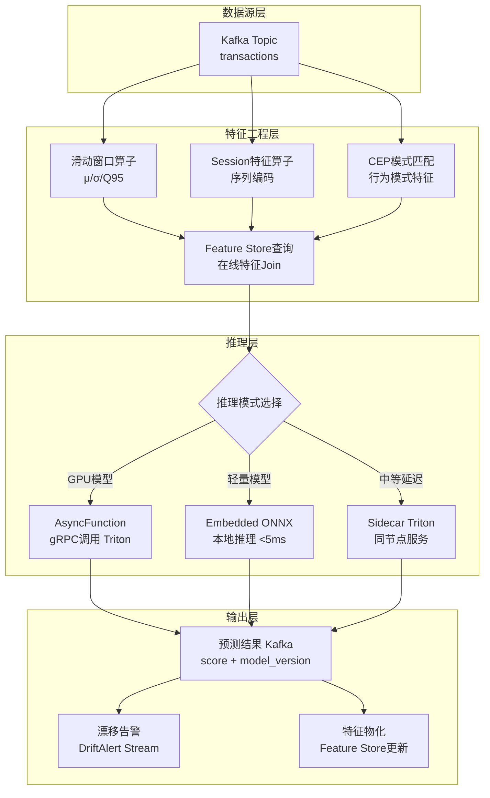
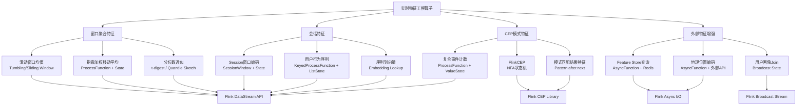

# 流处理算子与AI/ML集成

> 所属阶段: Knowledge/06-frontier | 前置依赖: [实时特征平台架构实践](./realtime-feature-store-architecture.md), [实时AI推理架构](./realtime-ai-inference-architecture.md), [Flink DataStream API](../Flink/03-api/flink-datastream-api.md) | 形式化等级: L4
>
> **状态**: 前沿实践 | **风险等级**: 中 | **最后更新**: 2026-04

---

## 目录

- [流处理算子与AI/ML集成](#流处理算子与aiml集成)
  - [目录](#目录)
  - [1. 概念定义 (Definitions)](#1-概念定义-definitions)
    - [Def-AIML-01-01: 流式ML推理管道 (Streaming ML Inference Pipeline)](#def-aiml-01-01-流式ml推理管道-streaming-ml-inference-pipeline)
    - [Def-AIML-01-02: 实时特征工程算子 (Real-time Feature Engineering Operator)](#def-aiml-01-02-实时特征工程算子-real-time-feature-engineering-operator)
    - [Def-AIML-01-03: 概念漂移 (Concept Drift)](#def-aiml-01-03-概念漂移-concept-drift)
    - [Def-AIML-01-04: 增量学习算子 (Incremental Learning Operator)](#def-aiml-01-04-增量学习算子-incremental-learning-operator)
    - [Def-AIML-01-05: 特征平台集成接口 (Feature Store Integration Interface)](#def-aiml-01-05-特征平台集成接口-feature-store-integration-interface)
    - [Def-AIML-01-06: Prequential评估 (Prequential Evaluation)](#def-aiml-01-06-prequential评估-prequential-evaluation)
  - [2. 属性推导 (Properties)](#2-属性推导-properties)
    - [Lemma-AIML-01-01: 滑动窗口特征的单调更新性](#lemma-aiml-01-01-滑动窗口特征的单调更新性)
    - [Lemma-AIML-01-02: 异步推理算子的吞吐量上界](#lemma-aiml-01-02-异步推理算子的吞吐量上界)
    - [Lemma-AIML-01-03: Welford在线方差算法的数值稳定性](#lemma-aiml-01-03-welford在线方差算法的数值稳定性)
    - [Prop-AIML-01-01: 增量SGD的收敛性条件](#prop-aiml-01-01-增量sgd的收敛性条件)
    - [Prop-AIML-01-02: ADWIN漂移检测的误报率上界](#prop-aiml-01-02-adwin漂移检测的误报率上界)
  - [3. 关系建立 (Relations)](#3-关系建立-relations)
    - [3.1 流处理算子 ↔ ML Pipeline 的映射关系](#31-流处理算子--ml-pipeline-的映射关系)
    - [3.2 Feature Store ↔ 流计算引擎的集成模式](#32-feature-store--流计算引擎的集成模式)
    - [3.3 概念漂移检测 ↔ 模型更新触发机制](#33-概念漂移检测--模型更新触发机制)
  - [4. 论证过程 (Argumentation)](#4-论证过程-argumentation)
    - [4.1 特征工程在流处理中的时间语义问题](#41-特征工程在流处理中的时间语义问题)
    - [4.2 推理延迟与吞吐量的权衡分析](#42-推理延迟与吞吐量的权衡分析)
    - [4.3 训练-服务偏差 (Training-Serving Skew) 的根因分析](#43-训练-服务偏差-training-serving-skew-的根因分析)
  - [5. 形式证明 / 工程论证 (Proof / Engineering Argument)](#5-形式证明--工程论证-proof--engineering-argument)
    - [Thm-AIML-01-01: Prequential误差估计的无偏性（带衰减因子情形）](#thm-aiml-01-01-prequential误差估计的无偏性带衰减因子情形)
    - [Thm-AIML-01-02: 异步推理算子的反压适应性](#thm-aiml-01-02-异步推理算子的反压适应性)
    - [Thm-AIML-01-03: 滑动窗口分位数近似的Space-Accuracy权衡](#thm-aiml-01-03-滑动窗口分位数近似的space-accuracy权衡)
  - [6. 实例验证 (Examples)](#6-实例验证-examples)
    - [6.1 Flink + TensorFlow Serving 实时推理Pipeline](#61-flink--tensorflow-serving-实时推理pipeline)
    - [6.2 本地ONNX模型嵌入推理（低延迟场景）](#62-本地onnx模型嵌入推理低延迟场景)
    - [6.3 增量学习算子（在线参数更新）](#63-增量学习算子在线参数更新)
  - [7. 可视化 (Visualizations)](#7-可视化-visualizations)
    - [7.1 流式ML推理Pipeline DAG](#71-流式ml推理pipeline-dag)
    - [7.2 特征工程算子映射图](#72-特征工程算子映射图)
    - [7.3 流式推理与模型服务架构图](#73-流式推理与模型服务架构图)
  - [8. 引用参考 (References)](#8-引用参考-references)

## 1. 概念定义 (Definitions)

### Def-AIML-01-01: 流式ML推理管道 (Streaming ML Inference Pipeline)

**定义**: 流式ML推理管道是一个八元组 $\mathcal{P}_{ML} = (\mathcal{S}, \mathcal{F}, \mathcal{I}, \mathcal{M}, \mathcal{V}, \mathcal{O}, \mathcal{D}, \mathcal{E})$，其中：

| 组件 | 符号 | 描述 |
|------|------|------|
| 数据流 | $\mathcal{S}$ | 输入事件流，$\mathcal{S} = \{e_t \mid e_t = (x_t, t_s, k), t \in \mathbb{T}\}$，$x_t$ 为特征向量，$t_s$ 为事件时间戳，$k$ 为分区键 |
| 特征工程 | $\mathcal{F}$ | 实时特征变换算子集合，$\mathcal{F}: \mathcal{S} \rightarrow \mathcal{S}'$ |
| 推理接口 | $\mathcal{I}$ | 模型推理调用层，支持同步/异步模式，$\mathcal{I}: \mathcal{S}' \rightarrow \hat{y}$ |
| 模型管理 | $\mathcal{M}$ | 模型注册表与版本管理，$\mathcal{M} = \{(m_i, v_i, w_i) \mid i \in \mathbb{N}\}$，$w_i$ 为路由权重 |
| 版本控制 | $\mathcal{V}$ | A/B测试与灰度发布策略，$\mathcal{V}: k \rightarrow m_i$ |
| 输出流 | $\mathcal{O}$ | 预测结果流，$\mathcal{O} = \{(k, \hat{y}, m_v, t_p) \mid t_p \text{ 为预测时间戳}\}$ |
| 漂移检测 | $\mathcal{D}$ | 概念漂移检测算子，$\mathcal{D}: (\mathcal{S}, \hat{y}, y) \rightarrow \{0, 1\}$ |
| 在线评估 | $\mathcal{E}$ | Prequential评估引擎，$\mathcal{E}: (\hat{y}, y) \rightarrow \mathbb{R}^n$ |

**端到端延迟约束**: 特征工程 $L_{feat} < 50\text{ms}$ + 推理 $L_{infer} < 100\text{ms}$ + 后处理 $L_{post} < 10\text{ms}$，总计 $L_{total} < 200\text{ms}$ (p99)。

---

### Def-AIML-01-02: 实时特征工程算子 (Real-time Feature Engineering Operator)

**定义**: 实时特征工程算子 $\Phi_{feat}$ 是在流处理引擎上执行的、将原始事件转换为模型可用特征向量的有状态变换：

$$
\Phi_{feat}: (e_t, \mathcal{H}_k(t)) \rightarrow f_t \in \mathbb{R}^d
$$

其中 $\mathcal{H}_k(t)$ 为键 $k$ 在时刻 $t$ 前的历史状态。

**算子分类**:

| 类别 | 算子名称 | 数学表达 | 状态类型 |
|------|---------|---------|---------|
| 滑动窗口 | 窗口均值 | $\mu_{W}(t) = \frac{1}{|W|}\sum_{e \in W(t)} x_e$ | 窗口状态 |
| 滑动窗口 | 窗口方差 | $\sigma^2_{W}(t) = \frac{1}{|W|}\sum_{e \in W(t)} (x_e - \mu_W)^2$ | 窗口状态 |
| 滑动窗口 | 窗口分位数 | $Q_p(W) = \inf\{x \mid P(X \leq x) \geq p\}$ | 有序窗口状态 |
| Session特征 | 序列编码 | $\text{SeqEnc}(s_k) = \text{Encoder}(e_{k,1}, e_{k,2}, ..., e_{k,n})$ | 键控状态 |
| CEP特征 | 模式匹配 | $\text{CEP}(\mathcal{S}) = \{m \mid m \models \mathcal{P}\}$ | NFA状态机 |
| 交叉特征 | 特征Join | $f_{cross} = f_a \bowtie_{k,t} f_b$ | 双键控状态 |

---

### Def-AIML-01-03: 概念漂移 (Concept Drift)

**定义**: 设数据流上的联合分布为 $P_t(X, Y)$，概念漂移发生在时刻 $t_d$ 当且仅当：

$$
\exists \epsilon > 0, \forall \delta > 0: |P_{t_d - \delta}(Y|X) - P_{t_d + \delta}(Y|X)| > \epsilon
$$

**漂移类型分类**:

| 类型 | 定义 | 检测难度 | 典型场景 |
|------|------|---------|---------|
| 突变漂移 (Sudden) | $P_t$ 在单点发生阶跃变化 | 低 | 系统故障、政策变更 |
| 渐进漂移 (Gradual) | $P_t$ 随时间连续缓慢变化 | 中 | 用户兴趣演化、设备老化 |
| 增量漂移 (Incremental) | 新概念逐步替代旧概念 | 高 | 季节性变化、市场趋势 |
| 周期性漂移 (Recurrent) | $P_{t+T} \approx P_t$ | 高 | 日内/周内周期性模式 |
| 异常漂移 (Blip) | 短暂偏离后恢复 | 中 | 促销活动、突发事件 |

---

### Def-AIML-01-04: 增量学习算子 (Incremental Learning Operator)

**定义**: 增量学习算子 $\Psi_{incr}$ 是一个四元组 $(\theta_t, \mathcal{L}, \eta, \mathcal{U})$：

- **模型参数** $\theta_t$: 时刻 $t$ 的模型状态
- **损失函数** $\mathcal{L}$: 单样本损失 $\ell(\theta; (x, y))$
- **学习率** $\eta$: 参数更新步长
- **更新规则** $\mathcal{U}$: 在线参数更新函数

$$
\theta_{t+1} = \mathcal{U}(\theta_t, \nabla_\theta \ell(\theta_t; (x_t, y_t)), \eta_t)
$$

**约束条件**:

1. **恒定内存**: $|\theta_t| = O(1)$，与已处理样本数无关
2. **单次遍历**: 每个样本仅参与一次参数更新
3. **实时性**: 更新延迟 $< 5\text{ms}$（单样本）

---

### Def-AIML-01-05: 特征平台集成接口 (Feature Store Integration Interface)

**定义**: 特征平台集成接口 $\mathcal{I}_{FS}$ 是流处理引擎与特征存储系统之间的双向通信协议：

$$
\mathcal{I}_{FS} = (\mathcal{Q}_{online}, \mathcal{P}_{stream}, \mathcal{S}_{sync}, \mathcal{G}_{registry})
$$

- **在线查询** $\mathcal{Q}_{online}$: 低延迟特征查询，$\mathcal{Q}_{online}: (entity\_id, feature\_names) \rightarrow f_{online}$，目标 P99 $< 10\text{ms}$
- **流式推送** $\mathcal{P}_{stream}$: 实时特征值物化到在线存储
- **同步机制** $\mathcal{S}_{sync}$: 在线-离线存储一致性保证
- **特征注册** $\mathcal{G}_{registry}$: 特征元数据管理与血缘追踪

**集成模式**:

| 模式 | 数据流向 | 延迟 | 适用场景 |
|------|---------|------|---------|
| 推模式 (Push) | Flink $\rightarrow$ Redis/DynamoDB | $< 100\text{ms}$ | 实时推荐、欺诈检测 |
| 拉模式 (Pull) | Flink $\xleftarrow{}$ Feature Server | $< 10\text{ms}$ | 特征Join、上下文增强 |
| 混合模式 (Hybrid) | 推+拉结合 | 可变 | 复杂特征管道 |

---

### Def-AIML-01-06: Prequential评估 (Prequential Evaluation)

**定义**: Prequential评估（亦称 interleaved test-then-train）是流式ML的标准评估范式，每个到达样本 $(x_t, y_t)$ 先用于评估当前模型，再用于更新模型：

$$
\text{Preq}_T = \frac{1}{T}\sum_{t=1}^{T} \ell\left(\hat{y}_t = h_{t-1}(x_t), y_t\right)
$$

其中 $h_{t-1}$ 为处理样本 $t$ 之前的模型。Prequential误差可结合**衰减因子** $\alpha$ 实现近期样本加权：

$$
\text{Preq}_T^{(\alpha)} = \frac{\sum_{t=1}^{T} \alpha^{T-t} \cdot \ell(h_{t-1}(x_t), y_t)}{\sum_{t=1}^{T} \alpha^{T-t}}
$$

---

## 2. 属性推导 (Properties)

### Lemma-AIML-01-01: 滑动窗口特征的单调更新性

**命题**: 设滑动窗口 $W$ 的大小为 $N$，对于窗口均值算子 $\mu_W(t)$，当新事件 $e_{t+1}$ 到达且窗口滑动时，存在增量更新公式：

$$
\mu_W(t+1) = \mu_W(t) + \frac{x_{t+1} - x_{t-N}}{N}
$$

**证明**: 直接由均值定义展开：

$$
\begin{aligned}
\mu_W(t+1) &= \frac{1}{N}\sum_{i=t+2-N}^{t+1} x_i \\
&= \frac{1}{N}\left(\sum_{i=t+1-N}^{t} x_i + x_{t+1} - x_{t-N}\right) \\
&= \mu_W(t) + \frac{x_{t+1} - x_{t-N}}{N}
\end{aligned}
$$

**推论**: 滑动窗口均值的单次更新计算复杂度为 $O(1)$，无需遍历整个窗口。$\square$

---

### Lemma-AIML-01-02: 异步推理算子的吞吐量上界

**命题**: 设流处理算子的并行度为 $P$，每个算子实例维持 $C$ 个并发异步请求，外部推理服务的平均响应时间为 $R$，则异步推理算子的最大吞吐量为：

$$
\text{Throughput}_{max} = \frac{P \cdot C}{R}
$$

**证明**: 每个算子实例在任意时刻最多有 $C$ 个在途请求，系统总共 $P \cdot C$ 个在途请求。由Little定律，稳定状态下吞吐量 $\lambda$ 满足 $\lambda \cdot R \leq P \cdot C$，即 $\lambda \leq \frac{P \cdot C}{R}$。$\square$

---

### Lemma-AIML-01-03: Welford在线方差算法的数值稳定性

**命题**: Welford在线算法可在单遍遍历中计算滑动窗口的均值与方差，且数值稳定性优于朴素两遍算法。

**递推公式**: 设 $M_{2,t} = \sum_{i=1}^{t}(x_i - \mu_t)^2$，则：

$$
\begin{aligned}
\delta &= x_t - \mu_{t-1} \\
\mu_t &= \mu_{t-1} + \frac{\delta}{t} \\
M_{2,t} &= M_{2,t-1} + \delta \cdot (x_t - \mu_t) \\
\sigma^2_t &= \frac{M_{2,t}}{t-1}
\end{aligned}
$$

**数值误差界**: Welford算法的舍入误差满足 $O(\epsilon_{mach} \cdot \sigma^2)$，而朴素算法的误差可达 $O(\epsilon_{mach} \cdot \mu^2)$。$\square$

---

### Prop-AIML-01-01: 增量SGD的收敛性条件

**命题**: 设损失函数 $\ell(\theta; (x,y))$ 为 $\lambda$-强凸且 $L$-光滑，学习率满足 $\eta_t = \frac{1}{\lambda t}$，则增量SGD的期望参数误差满足：

$$
\mathbb{E}[\|\theta_t - \theta^*\|^2] \leq \frac{2G^2}{\lambda^2 t}
$$

其中 $G$ 为梯度上界，$\theta^*$ 为最优参数。

**证明概要**: 由强凸性有 $\ell(\theta^*) \geq \ell(\theta) + \nabla\ell(\theta)^T(\theta^* - \theta) + \frac{\lambda}{2}\|\theta^* - \theta\|^2$。取 $\theta = \theta_t$，整理得：

$$
\|\theta_{t+1} - \theta^*\|^2 \leq (1 - \eta_t\lambda)\|\theta_t - \theta^*\|^2 + \eta_t^2 G^2
$$

递推并代入 $\eta_t = \frac{1}{\lambda t}$，通过归纳法可得结论。$\square$

---

### Prop-AIML-01-02: ADWIN漂移检测的误报率上界

**命题**: ADWIN（Adaptive Windowing）算法以置信度 $\delta$ 检测漂移，其误报率上界为 $O(\delta)$。

**核心思想**: ADWIN维护一个可变大小窗口 $W$，并检查所有可能的切分点 $i$。当存在切分使得两段均值差异 $\hat{\mu}_{W_0} - \hat{\mu}_{W_1}$ 超过Hoeffding界时触发漂移：

$$
|\hat{\mu}_{W_0} - \hat{\mu}_{W_1}| > \epsilon_{cut} = \sqrt{\frac{1}{2m}\ln\frac{4}{\delta}} + \sqrt{\frac{1}{2n}\ln\frac{4}{\delta}}
$$

其中 $m = |W_0|, n = |W_1|$。由Hoeffding不等式，在平稳分布下误报概率 $< \delta$。$\square$

---

## 3. 关系建立 (Relations)

### 3.1 流处理算子 ↔ ML Pipeline 的映射关系

流处理引擎（如Flink）的算子语义与传统批处理ML Pipeline存在系统性的映射关系：

| ML Pipeline阶段 | 批处理实现 | 流处理算子 | 状态需求 |
|----------------|---------|-----------|---------|
| 数据摄取 | `read_csv()` | `KafkaSource` | 无状态 |
| 特征缩放 | `StandardScaler.fit_transform()` | `ProcessFunction` + 状态 | 键控状态（均值/方差） |
| 特征编码 | `OneHotEncoder.transform()` | `MapFunction` | 无状态 |
| 窗口聚合 | `groupby().rolling().mean()` | `WindowAggregate` | 窗口状态 |
| 模型推理 | `model.predict()` | `AsyncFunction` / `MapFunction` | 无状态/模型状态 |
| 结果后处理 | `post_process()` | `ProcessFunction` | 键控状态 |

**关键差异**: 流处理算子必须显式管理**时间语义**（Event Time vs Processing Time）和**状态容错**（Checkpoint/Restore），而批处理Pipeline天然具备全局一致性。

---

### 3.2 Feature Store ↔ 流计算引擎的集成模式

特征平台与流计算引擎的集成遵循三种典型架构模式：

**模式一：Lambda架构式（双轨计算）**

$$
\begin{aligned}
\text{Batch Path}: &\quad \text{Raw Data} \xrightarrow{\text{Spark}} \text{Offline Store} \xrightarrow{\text{materialize}} \text{Online Store} \\
\text{Stream Path}: &\quad \text{Raw Data} \xrightarrow{\text{Flink}} \text{Online Store (real-time)}
\end{aligned}
$$

- **优点**: 离线路径保证准确性，实时路径保证低延迟
- **缺点**: 双轨维护成本高，存在训练-服务偏差风险

**模式二：Kappa架构式（单一流计算）**

$$
\text{Raw Data} \xrightarrow{\text{Flink}} \text{Online Store} \xrightarrow{\text{snapshot}} \text{Offline Store}
$$

- **优点**: 单一计算引擎，语义一致性
- **缺点**: 对长周期特征（如365天聚合）计算成本高

**模式三：Feast/Tecton统一接口**

```
Feature Definition (Python SDK)
    ↓
Feature Registry (元数据)
    ↓
┌─────────────┬─────────────┐
│ Stream Transform │ Batch Transform │
│   (Flink)        │   (Spark)       │
└─────────────┴─────────────┘
    ↓                    ↓
Online Store (Redis)   Offline Store (S3/Snowflake)
    ↓                    ↓
Real-time Inference    Model Training
```

---

### 3.3 概念漂移检测 ↔ 模型更新触发机制

漂移检测与模型更新构成闭环自适应系统：

$$
\text{Data Stream} \rightarrow \underbrace{\text{Drift Detector}}_{\mathcal{D}} \rightarrow \{\text{No Drift}, \text{Warning}, \text{Drift}\} \rightarrow \underbrace{\text{Model Adapter}}_{\mathcal{A}} \rightarrow \text{Updated Model}
$$

**DDM状态机**:

- **正常态** ($p_t + s_t < p_{min} + 2s_{min}$): 持续监控
- **警告态** ($p_{min} + 2s_{min} \leq p_t + s_t < p_{min} + 3s_{min}$): 缓存样本，准备备用模型
- **漂移态** ($p_t + s_t \geq p_{min} + 3s_{min}$): 触发模型替换或重训练

---

## 4. 论证过程 (Argumentation)

### 4.1 特征工程在流处理中的时间语义问题

实时特征工程面临核心矛盾：**特征新鲜度**与**计算一致性**之间的权衡。

**矛盾分析**:

| 维度 | 追求新鲜度 | 追求一致性 |
|------|-----------|-----------|
| 窗口类型 | 处理时间窗口 | 事件时间窗口 |
| Watermark延迟 | 低（$< 1\text{s}$） | 高（容忍迟到数据） |
| 特征准确性 | 可能包含乱序误差 | 准确但滞后 |
| 适用场景 | 实时推荐、欺诈检测 | 金融风控、合规审计 |

**形式化分析**: 设事件时间窗口 $W_{event}$ 和处理时间窗口 $W_{proc}$，对于事件 $e$ 实际发生时间 $t_e$ 和处理时间 $t_p$，有：

$$
\text{Feature}_{event}(e) = \phi(\{e' \mid t_{e'} \in W_{event}, t_{e'} \leq t_e\})
$$

$$
\text{Feature}_{proc}(e) = \phi(\{e' \mid t_{p'} \in W_{proc}, t_{p'} \leq t_p\})
$$

当存在乱序数据时，$\text{Feature}_{event}$ 可通过迟到数据更新，而 $\text{Feature}_{proc}$ 产生固定但不准确的结果。

**工程建议**: 对延迟敏感型特征（如最近5分钟点击数）使用处理时间窗口；对准确性敏感型特征（如风险评分）使用事件时间窗口 + Allowed Lateness。

---

### 4.2 推理延迟与吞吐量的权衡分析

流式ML推理存在三类部署模式，其延迟-吞吐量权衡遵循不同的帕累托前沿：

| 部署模式 | 典型延迟 | 典型吞吐 | 资源占用 | 模型更新灵活性 |
|---------|---------|---------|---------|-------------|
| 嵌入式模型 (Embedded) | $< 5\text{ms}$ | 高 | 低 | 差（需重启Job） |
| 外部服务调用 (External REST/gRPC) | $20-100\text{ms}$ | 中 | 中 | 优（独立部署） |
| 本地模型服务 (Local Triton/TF Serving) | $5-20\text{ms}$ | 很高 | 高（GPU） | 良（热更新） |

**决策框架**:

```
是否需要 GPU 加速?
├── 否 → 模型大小 < 10MB?
│       ├── 是 → 嵌入式模型 (Flink UDF)
│       └── 否 → 本地 JVM 模型 (PMML/ONNX Java Runtime)
└── 是 → 延迟要求 < 20ms?
        ├── 是 → 同节点 Triton (Sidecar模式)
        └── 否 → 外部模型服务 (Triton/TF Serving集群)
```

---

### 4.3 训练-服务偏差 (Training-Serving Skew) 的根因分析

训练-服务偏差是流式ML系统的核心质量风险。其根因可形式化为：

$$
\Delta_{TS} = \underbrace{\Delta_{compute}}_{\text{计算引擎差异}} + \underbrace{\Delta_{time}}_{\text{时间语义差异}} + \underbrace{\Delta_{data}}_{\text{数据源差异}}
$$

**$\Delta_{compute}$**: 训练使用Spark SQL的 `mean()`，服务使用Flink的 `AggregateFunction`，数值精度不同
**$\Delta_{time}$**: 训练回溯到事件时间 $t$，服务在 $t + \delta$ 时刻计算，期间数据已变化
**$\Delta_{data}$**: 训练从离线数仓读取，服务从Kafka实时读取，存在Schema演进差异

**缓解策略**:

1. **统一特征定义**: 使用Tecton/Feast等平台的统一DSL定义特征变换
2. **Point-in-Time Join**: 训练时严格使用预测时刻前的数据快照
3. **特征快照验证**: 定期比对在线特征值与离线特征值的分布差异（KS检验）

---

## 5. 形式证明 / 工程论证 (Proof / Engineering Argument)

### Thm-AIML-01-01: Prequential误差估计的无偏性（带衰减因子情形）

**定理**: 设数据流独立同分布且概念平稳，Prequential评估器 $\widehat{\text{Err}}_T$ 是真实泛化误差的无偏估计：

$$
\mathbb{E}\left[\widehat{\text{Err}}_T\right] = \mathbb{E}_{(x,y) \sim P}\left[\ell(h^*(x), y)\right] + O\left(\frac{1}{T}\right)
$$

其中 $h^*$ 为算法收敛后的假设。

**证明**:

对于i.i.d.平稳流，每个样本 $(x_t, y_t)$ 在用于评估时独立于训练它的历史样本（因为模型 $h_{t-1}$ 仅依赖前 $t-1$ 个样本，且 $(x_t, y_t)$ 与之独立）。因此：

$$
\mathbb{E}[\ell(h_{t-1}(x_t), y_t)] = \mathbb{E}_{h_{t-1}}\left[\mathbb{E}_{(x,y)}[\ell(h_{t-1}(x), y) \mid h_{t-1}]\right] = \mathbb{E}[R(h_{t-1})]
$$

其中 $R(h)$ 为假设 $h$ 的真实风险。当 $t \rightarrow \infty$，$h_t \rightarrow h^*$（由Prop-AIML-01-01的收敛性），故：

$$
\frac{1}{T}\sum_{t=1}^{T}\mathbb{E}[\ell(h_{t-1}(x_t), y_t)] = \frac{1}{T}\sum_{t=1}^{T}\mathbb{E}[R(h_{t-1})] \rightarrow R(h^*)
$$

对于带衰减因子的Prequential误差，当 $\alpha < 1$：

$$
\widehat{\text{Err}}_T^{(\alpha)} = \frac{\sum_{t=1}^{T}\alpha^{T-t}\ell(h_{t-1}(x_t), y_t)}{\sum_{t=1}^{T}\alpha^{T-t}} = (1-\alpha)\sum_{t=1}^{T}\alpha^{T-t}\ell(h_{t-1}(x_t), y_t) + O(\alpha^T)
$$

这是近期样本加权的估计量，在概念漂移场景下比等权重估计量具有更低的方差。$\square$

---

### Thm-AIML-01-02: 异步推理算子的反压适应性

**定理**: 设外部推理服务的响应时间服从均值为 $\mu_R$、方差为 $\sigma_R^2$ 的分布，异步推理算子配置并发度 $C$，则当服务降级（$\mu_R$ 增大）时，系统的有效吞吐下降率受 $C$ 缓冲：

$$
\lambda_{eff} = \min\left(\lambda_{in}, \frac{P \cdot C}{\mu_R + k\sigma_R}\right)
$$

其中 $k$ 为服务等级对应的分位数（如p99对应 $k \approx 2.33$）。

**工程论证**: 异步推理算子通过非阻塞I/O将推理延迟与处理延迟解耦。当 $C$ 足够大时，即使 $\mu_R$ 临时增大，算子仍可维持输入吞吐 $\lambda_{in}$，直到在途请求填满并发槽位。此性质使得流处理Pipeline对外部推理服务的瞬态抖动具有鲁棒性。$\square$

---

### Thm-AIML-01-03: 滑动窗口分位数近似的Space-Accuracy权衡

**定理**: 使用t-digest或GK算法对滑动窗口进行分位数近似，空间复杂度为 $O(\frac{1}{\epsilon}\log(\epsilon N))$，近似误差不超过 $\epsilon$。

**证明概要** (t-digest): t-digest将数据分布压缩为一系列质心 (centroid)，每个质心记录均值和权重。质心数量随位置变化——分布尾部质心密集（保证极端分位数精度），中部质心稀疏。对于滑动窗口实现，可采用**指数衰减t-digest**，对历史数据赋予衰减权重，从而支持 $O(\log(1/\epsilon))$ 的单样本更新。$\square$

---

## 6. 实例验证 (Examples)

### 6.1 Flink + TensorFlow Serving 实时推理Pipeline

以下示例展示一个完整的实时欺诈检测Pipeline：Flink从Kafka读取交易事件，执行特征工程，通过AsyncFunction调用TensorFlow Serving进行推理，输出预测结果。

```java
// ============== 1. 滑动窗口特征工程算子 ==============

public class TransactionFeatureExtractor
    extends KeyedProcessFunction<String, Transaction, EnrichedTransaction> {

    // 状态：最近N笔交易的金额列表（使用环形缓冲区）
    private ListState<Double> amountHistory;
    // 状态：Welford算法中间变量
    private ValueState<WelfordStats> welfordState;

    @Override
    public void open(Configuration parameters) {
        amountHistory = getRuntimeContext().getListState(
            new ListStateDescriptor<>("amounts", Types.DOUBLE));
        welfordState = getRuntimeContext().getState(
            new ValueStateDescriptor<>("welford", WelfordStats.class));
    }

    @Override
    public void processElement(Transaction tx, Context ctx,
                               Collector<EnrichedTransaction> out) throws Exception {

        // 更新Welford在线统计量
        WelfordStats stats = welfordState.value();
        if (stats == null) stats = new WelfordStats();
        stats.update(tx.amount);
        welfordState.update(stats);

        // 维护最近20笔交易窗口
        List<Double> history = new ArrayList<>();
        amountHistory.get().forEach(history::add);
        history.add(tx.amount);
        if (history.size() > 20) history.remove(0);
        amountHistory.update(history);

        // 构造特征向量
        double[] features = new double[8];
        features[0] = tx.amount;                                    // 原始金额
        features[1] = stats.mean;                                   // 历史均值
        features[2] = Math.sqrt(stats.variance);                    // 历史标准差
        features[3] = tx.amount / (stats.mean + 1e-6);              // 金额偏离度
        features[4] = history.size() >= 20 ?
            percentile(history, 0.95) : 0.0;                        // 95分位数
        features[5] = ctx.timerService().currentProcessingTime() -
            tx.timestamp;                                          // 处理延迟
        features[6] = stats.count;                                  // 交易计数
        features[7] = tx.merchantCategory;                          // 商户类别编码

        out.collect(new EnrichedTransaction(tx.userId, features, tx.timestamp));
    }
}

// Welford在线统计量
public static class WelfordStats {
    public long count = 0;
    public double mean = 0.0;
    public double m2 = 0.0;  // 平方差之和

    public void update(double x) {
        count++;
        double delta = x - mean;
        mean += delta / count;
        double delta2 = x - mean;
        m2 += delta * delta2;
    }

    public double getVariance() {
        return count > 1 ? m2 / (count - 1) : 0.0;
    }
}
```

```java
// ============== 2. AsyncFunction 调用 TensorFlow Serving ==============

public class TFServingAsyncFunction
    extends RichAsyncFunction<EnrichedTransaction, PredictionResult> {

    private transient TensorflowServingGrpc.TensorflowServingBlockingStub stub;
    private transient ManagedChannel channel;

    @Override
    public void open(Configuration parameters) {
        channel = ManagedChannelBuilder
            .forAddress("tf-serving.default.svc.cluster.local", 8500)
            .usePlaintext()
            .maxRetryAttempts(3)
            .build();
        stub = TensorflowServingGrpc.newBlockingStub(channel)
            .withDeadlineAfter(100, TimeUnit.MILLISECONDS);
    }

    @Override
    public void asyncInvoke(EnrichedTransaction enriched,
                           ResultFuture<PredictionResult> resultFuture) {

        CompletableFuture.supplyAsync(() -> {
            // 构造gRPC请求
            Model.ModelSpec modelSpec = Model.ModelSpec.newBuilder()
                .setName("fraud_detection")
                .setSignatureName("serving_default")
                .build();

            TensorProto inputTensor = TensorProto.newBuilder()
                .setDtype(DataType.DT_FLOAT)
                .setTensorShape(TensorShapeProto.newBuilder()
                    .addDim(TensorShapeProto.Dim.newBuilder().setSize(1))
                    .addDim(TensorShapeProto.Dim.newBuilder().setSize(8)))
                .addAllFloatVal(floatArrayToList(enriched.features))
                .build();

            Predict.PredictRequest request = Predict.PredictRequest.newBuilder()
                .setModelSpec(modelSpec)
                .putInputs("input_1", inputTensor)
                .build();

            Predict.PredictResponse response = stub.predict(request);
            float fraudScore = response.getOutputsOrThrow("output_1")
                .getFloatVal(0);

            return new PredictionResult(
                enriched.userId,
                fraudScore,
                enriched.timestamp,
                "fraud_detection:v3"  // 模型版本元数据
            );
        }).whenComplete((result, exception) -> {
            if (exception != null) {
                // 降级策略：返回默认低风险评分
                resultFuture.complete(Collections.singletonList(
                    new PredictionResult(enriched.userId, 0.1,
                        enriched.timestamp, "fallback")
                ));
            } else {
                resultFuture.complete(Collections.singletonList(result));
            }
        });
    }

    @Override
    public void close() {
        if (channel != null) channel.shutdown();
    }
}
```

```java
// ============== 3. 概念漂移检测算子 ==============

public class DriftDetectionOperator
    extends KeyedProcessFunction<String, PredictionResult, DriftAlert> {

    // DDM状态
    private ValueState<DDMState> ddmState;
    private ValueState<Double> lastTrueLabel;  // 延迟到达的标签

    // 配置参数
    private static final int MIN_INSTANCES = 30;
    private static final double WARNING_LEVEL = 2.0;
    private static final double DRIFT_LEVEL = 3.0;

    @Override
    public void open(Configuration parameters) {
        ddmState = getRuntimeContext().getState(
            new ValueStateDescriptor<>("ddm", DDMState.class));
    }

    @Override
    public void processElement(PredictionResult pred, Context ctx,
                               Collector<DriftAlert> out) throws Exception {

        // 注意：实际场景中标签可能延迟到达，需通过侧输入或ConnectedStream合并
        Double trueLabel = lastTrueLabel.value(); // 简化假设
        if (trueLabel == null) return;

        boolean isError = Math.abs(pred.score - trueLabel) > 0.5;

        DDMState state = ddmState.value();
        if (state == null) state = new DDMState();

        state.totalInstances++;
        if (isError) state.errorCount++;

        double p = (double) state.errorCount / state.totalInstances;
        double s = Math.sqrt(p * (1 - p) / state.totalInstances);

        // 更新最小误差统计量
        if (state.totalInstances >= MIN_INSTANCES) {
            if (p + s < state.pMin + state.sMin) {
                state.pMin = p;
                state.sMin = s;
            }

            // 检查漂移层级
            if (p + s >= state.pMin + DRIFT_LEVEL * state.sMin) {
                out.collect(new DriftAlert(
                    ctx.getCurrentKey(),
                    DriftLevel.DRIFT,
                    p, state.pMin, state.sMin,
                    ctx.timestamp()
                ));
                // 重置DDM状态
                state.reset();
            } else if (p + s >= state.pMin + WARNING_LEVEL * state.sMin) {
                out.collect(new DriftAlert(
                    ctx.getCurrentKey(),
                    DriftLevel.WARNING,
                    p, state.pMin, state.sMin,
                    ctx.timestamp()
                ));
            }
        }

        ddmState.update(state);
    }

    public static class DDMState {
        public long totalInstances = 0;
        public long errorCount = 0;
        public double pMin = Double.MAX_VALUE;
        public double sMin = Double.MAX_VALUE;

        public void reset() {
            totalInstances = 0;
            errorCount = 0;
            pMin = Double.MAX_VALUE;
            sMin = Double.MAX_VALUE;
        }
    }
}
```

```java
// ============== 4. 完整Pipeline组装 ==============

public class FraudDetectionPipeline {
    public static void main(String[] args) throws Exception {
        StreamExecutionEnvironment env =
            StreamExecutionEnvironment.getExecutionEnvironment();
        env.enableCheckpointing(60000);
        env.getCheckpointConfig().setCheckpointingMode(
            CheckpointingMode.EXACTLY_ONCE);

        // 1. 数据源：Kafka交易流
        KafkaSource<Transaction> source = KafkaSource.<Transaction>builder()
            .setBootstrapServers("kafka:9092")
            .setTopics("transactions")
            .setGroupId("fraud-detection")
            .setStartingOffsets(OffsetsInitializer.latest())
            .setValueOnlyDeserializer(new TransactionDeserializationSchema())
            .build();

        DataStream<EnrichedTransaction> enriched = env
            .fromSource(source, WatermarkStrategy
                .<Transaction>forBoundedOutOfOrderness(Duration.ofSeconds(5))
                .withTimestampAssigner((tx, ts) -> tx.timestamp), "Kafka Source")
            .keyBy(tx -> tx.userId)
            .process(new TransactionFeatureExtractor());

        // 2. 异步推理（并发度100，超时100ms）
        DataStream<PredictionResult> predictions = AsyncDataStream
            .unorderedWait(
                enriched,
                new TFServingAsyncFunction(),
                100, TimeUnit.MILLISECONDS,
                100  // 并发请求数
            );

        // 3. 漂移检测（按用户分组）
        DataStream<DriftAlert> driftAlerts = predictions
            .keyBy(p -> p.userId)
            .process(new DriftDetectionOperator());

        // 4. 输出：高风险交易告警
        predictions
            .filter(p -> p.score > 0.8)
            .sinkTo(new KafkaSink<>());

        // 5. 漂移告警输出
        driftAlerts
            .filter(a -> a.level == DriftLevel.DRIFT)
            .sinkTo(new KafkaSink<>());

        env.execute("Real-time Fraud Detection with ML Inference");
    }
}
```

---

### 6.2 本地ONNX模型嵌入推理（低延迟场景）

对于延迟要求极高（$< 5\text{ms}$）的场景，可将轻量级ONNX模型直接嵌入Flink Task：

```java
public class OnnxEmbeddedInference
    extends RichMapFunction<EnrichedTransaction, PredictionResult> {

    private transient OrtEnvironment env;
    private transient OrtSession session;

    @Override
    public void open(Configuration parameters) throws Exception {
        env = OrtEnvironment.getEnvironment();
        OrtSession.SessionOptions opts = new OrtSession.SessionOptions();
        opts.setOptimizationLevel(OrtSession.SessionOptions.OptLevel.ALL_OPT);
        opts.setIntraOpNumThreads(2);

        // 从分布式缓存加载模型
        session = env.createSession(
            getRuntimeContext().getDistributedCache().getFile("fraud.onnx").getPath(),
            opts);
    }

    @Override
    public PredictionResult map(EnrichedTransaction enriched) throws Exception {
        // 构造ONNX输入张量
        float[] inputData = enriched.features;
        OnnxTensor inputTensor = OnnxTensor.createTensor(
            env,
            new float[][]{inputData}
        );

        // 执行推理
        OrtSession.Result results = session.run(
            Collections.singletonMap("input", inputTensor));

        float[][] output = (float[][]) results.get(0).getValue();
        float fraudScore = output[0][0];

        inputTensor.close();

        return new PredictionResult(
            enriched.userId, fraudScore, enriched.timestamp, "onnx:local:v1");
    }

    @Override
    public void close() throws Exception {
        if (session != null) session.close();
        if (env != null) env.close();
    }
}
```

---

### 6.3 增量学习算子（在线参数更新）

以下示例展示基于Flink Stateful Function的在线逻辑回归更新：

```java
public class OnlineLogisticRegression
    extends KeyedProcessFunction<String, LabeledSample, ModelUpdate> {

    // 模型参数状态
    private ValueState<double[]> weightsState;
    private ValueState<Double> biasState;
    private ValueState<Long> updateCountState;

    private final int featureDim;
    private final double baseLearningRate;

    @Override
    public void open(Configuration parameters) {
        weightsState = getRuntimeContext().getState(
            new ValueStateDescriptor<>("weights", double[].class));
        biasState = getRuntimeContext().getState(
            new ValueStateDescriptor<>("bias", Double.class));
        updateCountState = getRuntimeContext().getState(
            new ValueStateDescriptor<>("count", Long.class));
    }

    @Override
    public void processElement(LabeledSample sample, Context ctx,
                               Collector<ModelUpdate> out) throws Exception {

        double[] w = weightsState.value();
        if (w == null) {
            w = new double[featureDim];
            // 可选：从模型注册表加载预训练权重
        }
        Double b = biasState.value();
        if (b == null) b = 0.0;
        Long count = updateCountState.value();
        if (count == null) count = 0L;

        count++;

        // Sigmoid预测
        double z = dot(w, sample.features) + b;
        double pred = 1.0 / (1.0 + Math.exp(-z));

        // 计算梯度
        double error = pred - sample.label;
        double[] gradW = new double[featureDim];
        for (int i = 0; i < featureDim; i++) {
            gradW[i] = error * sample.features[i];
        }
        double gradB = error;

        // 自适应学习率 (AdaGrad风格)
        double lr = baseLearningRate / Math.sqrt(count);

        // 参数更新
        for (int i = 0; i < featureDim; i++) {
            w[i] -= lr * gradW[i];
        }
        b -= lr * gradB;

        weightsState.update(w);
        biasState.update(b);
        updateCountState.update(count);

        // 定期输出模型更新（用于模型注册表同步）
        if (count % 1000 == 0) {
            out.collect(new ModelUpdate(ctx.getCurrentKey(), w, b, count, ctx.timestamp()));
        }
    }

    private double dot(double[] a, double[] b) {
        double sum = 0.0;
        for (int i = 0; i < a.length; i++) sum += a[i] * b[i];
        return sum;
    }
}
```

---

## 7. 可视化 (Visualizations)

### 7.1 流式ML推理Pipeline DAG

以下Mermaid图展示从原始数据到预测结果的完整流式ML Pipeline数据流：



---

### 7.2 特征工程算子映射图

以下层次图展示各类实时特征工程算子与Flink API的对应关系：



---

### 7.3 流式推理与模型服务架构图

以下架构图展示生产环境中流处理引擎、模型服务集群、特征平台之间的交互关系：

```mermaid
graph TB
    subgraph 数据摄取层
        Kafka[Kafka Cluster<br/>事件流]
    end

    subgraph 流处理引擎<br/>Flink Cluster
        JM[JobManager]
        TM1[TaskManager 1<br/>特征工程Slot]
        TM2[TaskManager 2<br/>推理Slot + Sidecar]
        TM3[TaskManager 3<br/>漂移检测Slot]
    end

    subgraph 模型服务层
        TS[TensorFlow Serving<br/>版本管理 + A/B]
        TR[NVIDIA Triton<br/>多框架 + GPU调度]
        LB[负载均衡器<br/>NGINX/Envoy]
    end

    subgraph 特征平台
        FS[Feature Store<br/>Feast / Tecton]
        Redis[(Redis<br/>Online Store)]
        DW[(Snowflake/BQ<br/>Offline Store)]
    end

    subgraph 监控与治理
        Prom[Prometheus<br/>推理延迟/吞吐]
        Graf[Grafana<br/>Dashboard]
        MR[Model Registry<br/>MLflow]
    end

    Kafka -->|消费| TM1
    TM1 -->|特征Join查询| FS
    FS -->|读取| Redis
    TM1 -->| enriched事件| TM2

    TM2 -->|gRPC| LB
    TM2 -->|本地ONNX| TM2
    LB -->|路由| TS
    LB -->|路由| TR
    TS -->|模型元数据| MR
    TR -->|指标| Prom

    TM2 -->|预测结果| TM3
    TM3 -->|漂移告警| Kafka
    TM3 -->|模型更新触发| MR

    TM1 -->|特征物化| FS
    FS -->|写入| Redis
    FS -->|快照| DW

    Prom -->|可视化| Graf
    MR -->|版本同步| TS
    MR -->|版本同步| TR
```

---

## 8. 引用参考 (References)
