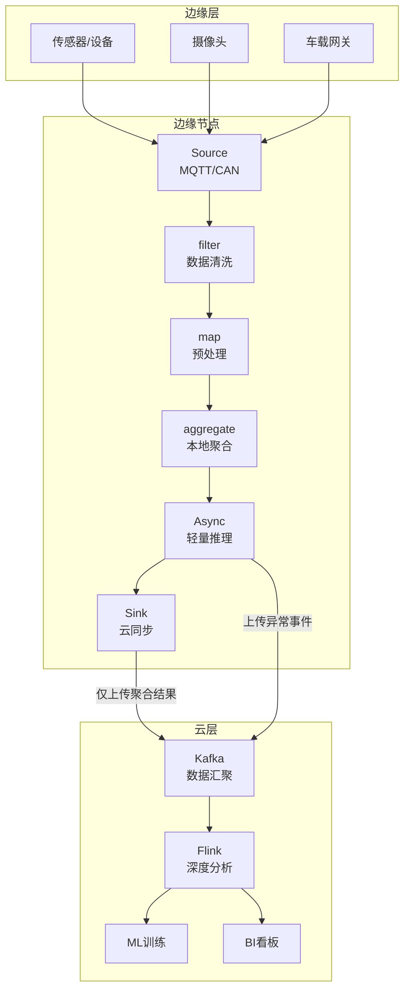
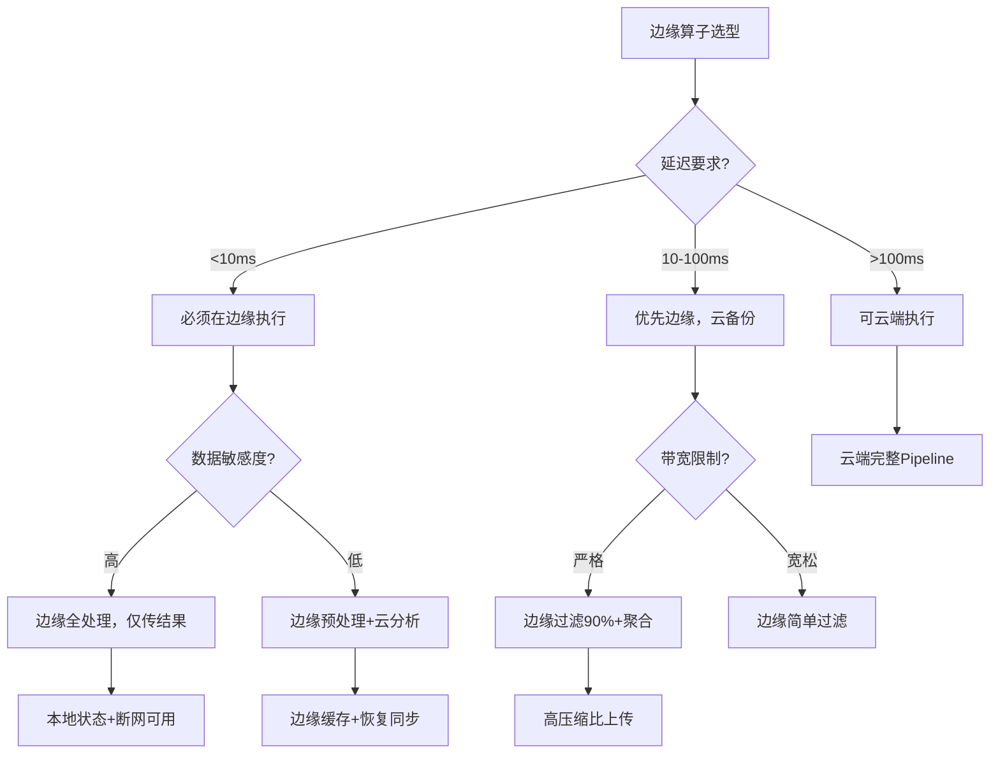

# 算子与边缘计算集成

> **所属阶段**: Knowledge/06-frontier | **前置依赖**: [01.06-single-input-operators.md](../01-concept-atlas/operator-deep-dive/01.06-single-input-operators.md), [operator-cost-model-and-resource-estimation.md](../07-best-practices/operator-cost-model-and-resource-estimation.md) | **形式化等级**: L3
> **文档定位**: 流处理算子在边缘计算环境中的部署、约束与优化策略
> **版本**: 2026.04

---

## 目录

- [算子与边缘计算集成](#算子与边缘计算集成)
  - [目录](#目录)
  - [1. 概念定义 (Definitions)](#1-概念定义-definitions)
    - [Def-EDGE-01-01: 边缘计算（Edge Computing）](#def-edge-01-01-边缘计算edge-computing)
    - [Def-EDGE-01-02: 边缘算子（Edge Operator）](#def-edge-01-02-边缘算子edge-operator)
    - [Def-EDGE-01-03: 边缘-云协同模型（Edge-Cloud Collaboration Model）](#def-edge-01-03-边缘-云协同模型edge-cloud-collaboration-model)
    - [Def-EDGE-01-04: 网络分区容忍度（Network Partition Tolerance）](#def-edge-01-04-网络分区容忍度network-partition-tolerance)
    - [Def-EDGE-01-05: 算子下沉（Operator Offloading）](#def-edge-01-05-算子下沉operator-offloading)
  - [2. 属性推导 (Properties)](#2-属性推导-properties)
    - [Lemma-EDGE-01-01: 边缘过滤的带宽节省比例](#lemma-edge-01-01-边缘过滤的带宽节省比例)
    - [Lemma-EDGE-01-02: 边缘聚合的状态上界](#lemma-edge-01-02-边缘聚合的状态上界)
    - [Prop-EDGE-01-01: 边缘-云延迟差](#prop-edge-01-01-边缘-云延迟差)
    - [Prop-EDGE-01-02: 边缘节点的能耗与算力权衡](#prop-edge-01-02-边缘节点的能耗与算力权衡)
  - [3. 关系建立 (Relations)](#3-关系建立-relations)
    - [3.1 算子类型与边缘适用性](#31-算子类型与边缘适用性)
    - [3.2 边缘-云算子分工矩阵](#32-边缘-云算子分工矩阵)
    - [3.3 边缘流处理框架对比](#33-边缘流处理框架对比)
  - [4. 论证过程 (Argumentation)](#4-论证过程-argumentation)
    - [4.1 为什么边缘计算需要流处理算子](#41-为什么边缘计算需要流处理算子)
    - [4.2 边缘算子的资源约束挑战](#42-边缘算子的资源约束挑战)
    - [4.3 边缘节点的故障独立性](#43-边缘节点的故障独立性)
  - [5. 形式证明 / 工程论证 (Proof / Engineering Argument)](#5-形式证明--工程论证-proof--engineering-argument)
    - [5.1 边缘过滤的ROI计算](#51-边缘过滤的roi计算)
    - [5.2 边缘流处理的轻量配置](#52-边缘流处理的轻量配置)
    - [5.3 断网续传的实现机制](#53-断网续传的实现机制)
  - [6. 实例验证 (Examples)](#6-实例验证-examples)
    - [6.1 实战：智能制造边缘质检](#61-实战智能制造边缘质检)
    - [6.2 实战：车联网边缘告警](#62-实战车联网边缘告警)
  - [7. 可视化 (Visualizations)](#7-可视化-visualizations)
    - [边缘-云协同架构图](#边缘-云协同架构图)
    - [边缘算子选型决策树](#边缘算子选型决策树)
  - [8. 引用参考 (References)](#8-引用参考-references)

---

## 1. 概念定义 (Definitions)

### Def-EDGE-01-01: 边缘计算（Edge Computing）

边缘计算是在数据源附近（网络边缘）执行计算的模式，与集中式云计算形成互补：

$$\text{Edge Computing} = (\text{Edge Nodes}, \text{Local Processing}, \text{Cloud Sync})$$

核心目标：降低延迟、减少带宽、保护隐私、增强可靠性。

### Def-EDGE-01-02: 边缘算子（Edge Operator）

边缘算子是在资源受限设备（ARM CPU、<4GB内存）上运行的流处理算子子集：

$$\text{EdgeOperator} \subset \text{CloudOperator}$$

约束条件：

- CPU: ≤ 2 cores
- Memory: ≤ 2GB
- Disk: 可选（优先内存状态）
- Network: 间歇性连接
- Power: 电池供电（需节能）

### Def-EDGE-01-03: 边缘-云协同模型（Edge-Cloud Collaboration Model）

边缘-云协同定义了数据在边缘和云之间的处理分工：

$$\text{Collaboration} = (\text{EdgeFilter} \circ \text{EdgeAggregate}) \xrightarrow{\text{Sync}} (\text{CloudDeepAnalyze})$$

**分层过滤原则**: 在边缘完成尽可能多的过滤和聚合，仅将必要数据同步到云端。

### Def-EDGE-01-04: 网络分区容忍度（Network Partition Tolerance）

边缘节点的网络分区容忍度定义了在断网情况下能维持本地处理的时间：

$$\mathcal{T}_{partition} = \frac{S_{local}}{R_{produce}}$$

其中 $S_{local}$ 为本地存储容量，$R_{produce}$ 为数据产生速率。

### Def-EDGE-01-05: 算子下沉（Operator Offloading）

算子下沉是将云端算子迁移到边缘执行的过程：

$$\text{Offload}(Op_{cloud}) \to Op_{edge}, \quad \text{if } \mathcal{L}_{edge} + \mathcal{C}_{edge} < \mathcal{L}_{cloud}$$

其中 $\mathcal{L}$ 为延迟，$\mathcal{C}$ 为成本。

---

## 2. 属性推导 (Properties)

### Lemma-EDGE-01-01: 边缘过滤的带宽节省比例

若在边缘部署filter算子，过滤比例为 $r$，则带宽节省为：

$$\text{BandwidthSaving} = r \times 100\%$$

**证明**: 设原始数据量为 $D$，边缘过滤后传输量为 $(1-r) \cdot D$。节省比例为 $(D - (1-r)D)/D = r$。∎

### Lemma-EDGE-01-02: 边缘聚合的状态上界

边缘节点执行窗口聚合时，状态大小受限于窗口大小和Key空间：

$$S_{edge} = |K| \times s_{accumulator} \times \frac{W}{\Delta t}$$

其中 $|K|$ 为Key数量，$s_{accumulator}$ 为累加器大小，$W$ 为窗口大小，$\Delta t$ 为数据到达间隔。

**工程推论**: 边缘节点应避免大窗口聚合（$W > 1$小时），以防止状态溢出。

### Prop-EDGE-01-01: 边缘-云延迟差

对于需要 < 10ms 响应的场景，边缘处理是唯一选择：

$$\mathcal{L}_{cloud} = \mathcal{L}_{network} + \mathcal{L}_{process}^{cloud} \gg 10ms$$

$$\mathcal{L}_{edge} = \mathcal{L}_{process}^{edge} \approx 1-5ms$$

典型云端延迟：数据中心内部 10-50ms，跨城 50-200ms，跨国 200-500ms。

### Prop-EDGE-01-02: 边缘节点的能耗与算力权衡

边缘设备的能耗 $E$ 与算力 $C$ 满足近似线性关系：

$$E = E_{idle} + \alpha \cdot C$$

其中 $E_{idle}$ 为空闲能耗（ARM设备约 1-5W），$\alpha$ 为算力能耗系数。

**优化策略**: 在低负载时降低算子并行度或进入休眠模式。

---

## 3. 关系建立 (Relations)

### 3.1 算子类型与边缘适用性

| 算子 | 边缘适用性 | 限制 | 替代方案 |
|------|-----------|------|---------|
| **map/filter** | ⭐⭐⭐⭐⭐ | 无 | 直接运行 |
| **flatMap** | ⭐⭐⭐⭐ | 输出膨胀可能OOM | 限制膨胀率 |
| **keyBy+aggregate** | ⭐⭐⭐ | 状态受限于内存 | 小窗口+本地RocksDB |
| **window** | ⭐⭐⭐ | 大窗口状态过大 | 微窗口（秒级） |
| **join** | ⭐⭐ | 双路状态内存压力 | 仅在边缘做单流join |
| **AsyncFunction** | ⭐⭐⭐ | 网络不可靠 | 本地缓存+降级 |
| **CEP** | ⭐⭐⭐ | 模式复杂时内存大 | 简化模式 |
| **ProcessFunction** | ⭐⭐⭐⭐ | 需手动管理资源 | 精简状态逻辑 |

### 3.2 边缘-云算子分工矩阵

| 处理阶段 | 边缘层 | 云层 | 理由 |
|---------|--------|------|------|
| **原始数据过滤** | ✅ 执行 | ❌ 不执行 | 减少90%无效数据传输 |
| **简单聚合** | ✅ 执行 | ❌ 不执行 | 秒级/分钟级聚合在边缘完成 |
| **异常检测** | ✅ 执行 | ⚠️ 辅助 | 边缘实时告警，云深度分析 |
| **复杂ML推理** | ⚠️ 轻量模型 | ✅ 大模型 | 边缘跑TinyML，云跑深度学习 |
| **跨设备关联** | ❌ 不执行 | ✅ 执行 | 需要全局视图 |
| **历史趋势分析** | ❌ 不执行 | ✅ 执行 | 需要大量历史数据 |
| **模型训练** | ❌ 不执行 | ✅ 执行 | 需要大量算力 |

### 3.3 边缘流处理框架对比

| 框架 | 资源占用 | 延迟 | 云集成 | 适用场景 |
|------|---------|------|--------|---------|
| **Apache Flink (Mini)** | 中高 | 低 | 强 | 复杂边缘计算 |
| **Apache Kafka Streams** | 中 | 低 | 强 | 轻量ETL |
| **Redis Streams** | 低 | 极低 | 中 | 简单消息处理 |
| **Node-RED** | 极低 | 极低 | 弱 | 快速原型 |
| **AWS Greengrass** | 中 | 低 | 强（AWS专属） | AWS生态 |
| **Azure IoT Edge** | 中 | 低 | 强（Azure专属） | Azure生态 |

---

## 4. 论证过程 (Argumentation)

### 4.1 为什么边缘计算需要流处理算子

传统边缘计算采用"采集-上传-处理"模式：

- 延迟高：数据需传到云端再处理
- 带宽浪费：大量原始数据上传
- 隐私风险：敏感数据离开本地

流处理算子下沉到边缘后：

- 实时响应：本地处理延迟 < 10ms
- 带宽优化：仅上传聚合结果
- 隐私保护：原始数据不出本地
- 离线可用：断网时继续本地处理

### 4.2 边缘算子的资源约束挑战

**挑战1: 内存限制**

- 边缘设备通常 1-4GB RAM
- Flink TaskManager默认需要 1.5GB+
- 解决方案：使用Flink的轻量配置或自定义微型运行时

**挑战2: CPU限制**

- ARM Cortex-A53 性能约为x86的30-50%
- 复杂序列化（Kryo）开销大
- 解决方案：使用Avro/Protobuf替代Kryo，避免反射

**挑战3: 网络 intermittency**

- 4G/5G/WiFi可能中断
- 解决方案：本地buffer + 断点续传

### 4.3 边缘节点的故障独立性

边缘节点的故障应不影响整体系统：

- 单个边缘节点故障 → 该节点数据暂时丢失，其他节点正常
- 云端故障 → 边缘节点继续本地处理，待恢复后同步
- 网络分区 → 边缘节点本地缓冲，网络恢复后批量上传

---

## 5. 形式证明 / 工程论证 (Proof / Engineering Argument)

### 5.1 边缘过滤的ROI计算

**问题**: 在边缘部署filter算子的投资回报率？

**输入**:

- 原始数据量: $D$ = 100GB/天
- 过滤比例: $r$ = 90%
- 云端传输成本: $c$ = $0.09/GB
- 边缘设备成本: $C_{edge}$ = $50/月

**计算**:
$$\text{CloudCost}_{before} = D \times c \times 30 = 100 \times 0.09 \times 30 = \\$270/月$$

$$\text{CloudCost}_{after} = D \times (1-r) \times c \times 30 = 100 \times 0.1 \times 0.09 \times 30 = \\$27/月$$

$$\text{Saving} = \\$270 - \\$27 = \\$243/月$$

$$\text{ROI} = \frac{\text{Saving} - C_{edge}}{C_{edge}} = \frac{243 - 50}{50} = 386\%$$

**结论**: 边缘过滤在第一个月即可收回设备成本。

### 5.2 边缘流处理的轻量配置

Flink在边缘设备上的最小配置：

```properties
# JVM配置
jobmanager.memory.process.size=512m
taskmanager.memory.process.size=1024m
taskmanager.memory.managed.fraction=0.1
taskmanager.numberOfTaskSlots=1

# 状态配置
state.backend=rocksdb
state.backend.rocksdb.memory.fixed-per-slot=64mb
state.backend.incremental=true

# Checkpoint配置（本地磁盘）
execution.checkpointing.interval=60s
state.checkpoints.dir=file:///tmp/flink-checkpoints

# 网络配置（最小化）
taskmanager.memory.network.min=32mb
taskmanager.memory.network.max=64mb
```

**总内存需求**: 约 1GB（可运行在 2GB RAM 的ARM设备上）。

### 5.3 断网续传的实现机制

**机制设计**:

```
边缘节点（断网期间）:
1. 数据正常摄入和处理
2. 输出结果写入本地WAL（Write-Ahead Log）
3. 定期尝试连接云端
4. 连接恢复后，按顺序重放WAL到云端

云端接收:
1. 检测数据流恢复
2. 处理边缘节点的积压数据
3. 去重（基于事件ID或offset）
```

**关键**: WAL需持久化到本地存储（eMMC/SD卡），防止边缘节点重启导致数据丢失。

---

## 6. 实例验证 (Examples)

### 6.1 实战：智能制造边缘质检

**场景**: 工厂生产线摄像头实时质检，需在边缘完成缺陷检测。

**边缘Pipeline**:

```java
// 边缘设备：NVIDIA Jetson Nano (4GB RAM)
StreamExecutionEnvironment env = StreamExecutionEnvironment.getExecutionEnvironment();
env.setParallelism(1);  // 单核设备

// 1. 从摄像头摄入图像帧
DataStream<ImageFrame> frames = env.addSource(new CameraSource("/dev/video0"));

// 2. 边缘预处理：缩放+灰度化（减少数据量）
DataStream<ProcessedImage> processed = frames
    .map(new ResizeAndGrayscale(224, 224));

// 3. 边缘推理：TensorFlow Lite模型
DataStream<DetectionResult> results = AsyncDataStream.unorderedWait(
    processed,
    new TFLiteInferenceFunction("defect_model.tflite"),
    Time.milliseconds(200),
    5
);

// 4. 过滤：仅保留缺陷帧
DataStream<DetectionResult> defects = results
    .filter(r -> r.getConfidence() > 0.8);

// 5. 边缘聚合：每分钟统计缺陷数
defects.keyBy(DetectionResult::getLineId)
    .window(TumblingProcessingTimeWindows.of(Time.minutes(1)))
    .aggregate(new DefectCountAggregate())
    .addSink(new CloudSyncSink("https://factory-cloud/api/metrics"));

// 6. 缺陷帧上传到云端（仅异常数据）
defects.map(r -> r.getImageBytes())
    .addSink(new CloudStorageSink("s3://defect-images/"));
```

**效果**:

- 边缘延迟: 50ms（推理+过滤）
- 带宽节省: 95%（仅上传缺陷帧）
- 离线可用: 断网时本地继续检测，恢复后同步统计

### 6.2 实战：车联网边缘告警

**场景**: 车辆传感器实时监测，边缘节点检测危险驾驶行为并立即告警。

**边缘算子设计**:

```java
// 边缘设备：车载ARM网关
DataStream<VehicleEvent> events = env.addSource(new CANBusSource());

// 危险行为检测（边缘实时）
events.keyBy(VehicleEvent::getVehicleId)
    .process(new KeyedProcessFunction<String, VehicleEvent, Alert>() {
        private ValueState<DrivingContext> contextState;

        @Override
        public void processElement(VehicleEvent event, Context ctx, Collector<Alert> out) {
            DrivingContext context = contextState.value();
            if (context == null) context = new DrivingContext();

            // 急刹车检测
            if (event.getDeceleration() > 8.0) {
                out.collect(new Alert("HARSH_BRAKING", event.getVehicleId(), ctx.timestamp()));
            }

            // 超速检测
            if (event.getSpeed() > 120) {
                out.collect(new Alert("OVERSPEED", event.getVehicleId(), ctx.timestamp()));
            }

            context.update(event);
            contextState.update(context);
        }
    })
    .addSink(new LTEUploadSink("tcp://edge-server:9999"));  // 仅上传告警
```

**关键约束**:

- 延迟要求: < 100ms（从事件发生到告警发出）
- 带宽约束: 4G网络，仅上传告警（< 1KB/条）
- 可靠性: 本地存储最近1000条事件，防止数据丢失

---

## 7. 可视化 (Visualizations)

### 边缘-云协同架构图



### 边缘算子选型决策树



---

## 8. 引用参考 (References)


---

*关联文档*: [operator-iot-stream-processing.md](operator-iot-stream-processing.md) | [operator-cost-model-and-resource-estimation.md](operator-cost-model-and-resource-estimation.md) | [operator-kubernetes-cloud-native-deployment.md](operator-kubernetes-cloud-native-deployment.md)
