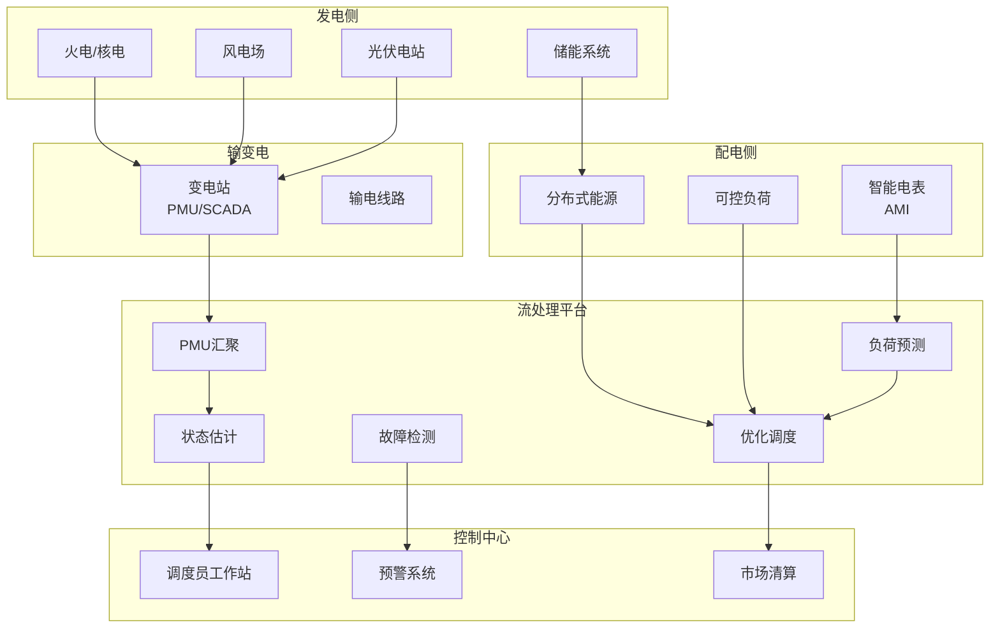
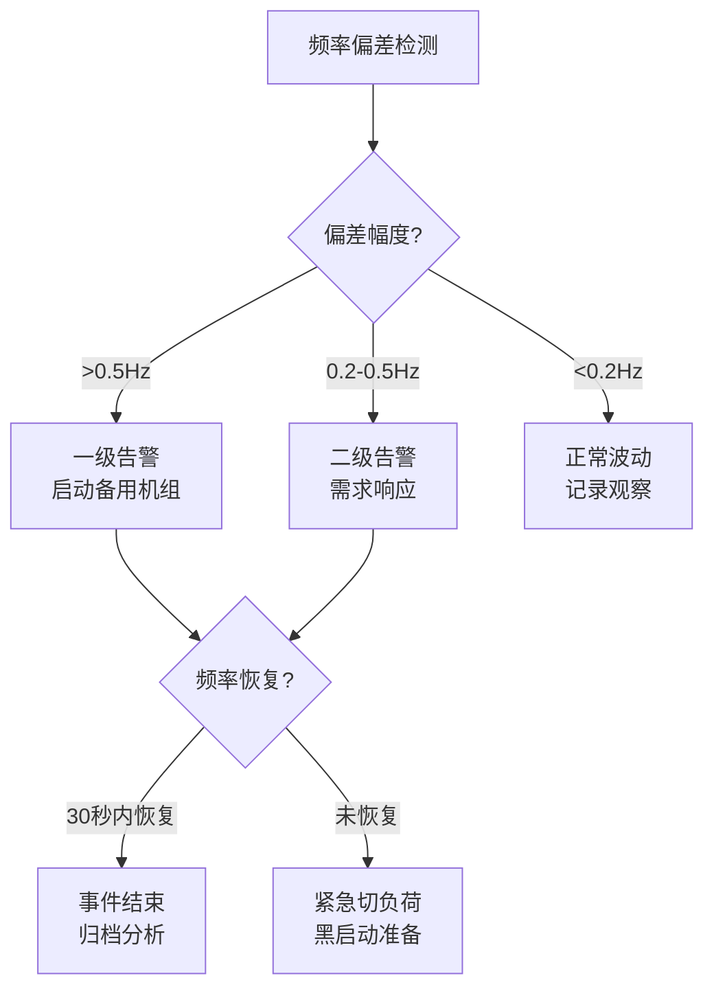

# 算子与实时能源电网监控

> **所属阶段**: Knowledge/06-frontier | **前置依赖**: [operator-iot-stream-processing.md](operator-iot-stream-processing.md), [operator-ai-ml-integration.md](operator-ai-ml-integration.md) | **形式化等级**: L3
> **文档定位**: 流处理算子在智能电网实时监控、负荷预测与故障检测中的算子指纹与Pipeline设计
> **版本**: 2026.04

---

## 目录

- [算子与实时能源电网监控](#算子与实时能源电网监控)
  - [目录](#目录)
  - [1. 概念定义 (Definitions)](#1-概念定义-definitions)
    - [Def-ENG-01-01: 智能电网（Smart Grid）](#def-eng-01-01-智能电网smart-grid)
    - [Def-ENG-01-02: 同步相量测量（Phasor Measurement Unit, PMU）](#def-eng-01-02-同步相量测量phasor-measurement-unit-pmu)
    - [Def-ENG-01-03: 负荷预测（Load Forecasting）](#def-eng-01-03-负荷预测load-forecasting)
    - [Def-ENG-01-04: 频率偏差与一次调频](#def-eng-01-04-频率偏差与一次调频)
    - [Def-ENG-01-05: 可再生能源波动性（Renewable Variability）](#def-eng-01-05-可再生能源波动性renewable-variability)
  - [2. 属性推导 (Properties)](#2-属性推导-properties)
    - [Lemma-ENG-01-01: PMU数据的Nyquist要求](#lemma-eng-01-01-pmu数据的nyquist要求)
    - [Lemma-ENG-01-02: 负荷预测的误差累积](#lemma-eng-01-02-负荷预测的误差累积)
    - [Prop-ENG-01-01: 可再生能源渗透率与调频难度](#prop-eng-01-01-可再生能源渗透率与调频难度)
    - [Prop-ENG-01-02: 需求响应的聚合效应](#prop-eng-01-02-需求响应的聚合效应)
  - [3. 关系建立 (Relations)](#3-关系建立-relations)
    - [3.1 电网监控Pipeline算子映射](#31-电网监控pipeline算子映射)
    - [3.2 算子指纹](#32-算子指纹)
    - [3.3 电网数据协议](#33-电网数据协议)
  - [4. 论证过程 (Argumentation)](#4-论证过程-argumentation)
    - [4.1 为什么电网需要流处理而非传统SCADA](#41-为什么电网需要流处理而非传统scada)
    - [4.2 可再生能源并网的实时挑战](#42-可再生能源并网的实时挑战)
    - [4.3 网络安全与物理安全的耦合](#43-网络安全与物理安全的耦合)
  - [5. 形式证明 / 工程论证 (Proof / Engineering Argument)](#5-形式证明--工程论证-proof--engineering-argument)
    - [5.1 频率跌落事件检测](#51-频率跌落事件检测)
    - [5.2 超短期负荷预测](#52-超短期负荷预测)
    - [5.3 需求响应信号广播](#53-需求响应信号广播)
  - [6. 实例验证 (Examples)](#6-实例验证-examples)
    - [6.1 实战：广域监测系统（WAMS）](#61-实战广域监测系统wams)
    - [6.2 实战：虚拟电厂（VPP）聚合调度](#62-实战虚拟电厂vpp聚合调度)
  - [7. 可视化 (Visualizations)](#7-可视化-visualizations)
    - [智能电网监控架构](#智能电网监控架构)
    - [频率事件响应流程](#频率事件响应流程)
  - [8. 引用参考 (References)](#8-引用参考-references)

---

## 1. 概念定义 (Definitions)

### Def-ENG-01-01: 智能电网（Smart Grid）

智能电网是将现代通信、计算与控制技术融入传统电力系统的下一代电网架构：

$$\text{SmartGrid} = (\text{Generation}, \text{Transmission}, \text{Distribution}, \text{Consumption}) \times \text{ICT}$$

核心特征：双向通信、自愈能力、分布式能源接入、需求侧响应。

### Def-ENG-01-02: 同步相量测量（Phasor Measurement Unit, PMU）

PMU是基于GPS同步时钟的电力系统测量装置，以高频率（30-120帧/秒）采集电压/电流相量：

$$\text{Phasor}_t = V \angle \theta = V \cdot e^{j\theta}, \quad \text{其中 } \theta = 2\pi f t + \phi$$

PMU数据是电力系统状态估计和稳定分析的金标准数据源。

### Def-ENG-01-03: 负荷预测（Load Forecasting）

负荷预测是基于历史负荷、气象和经济因素预测未来电力需求的时序预测问题：

$$\hat{L}_{t+h} = f(L_{[t-W, t]}, W_{[t, t+h]}, C_{[t, t+h]})$$

其中 $W$ 为气象因素（温度/湿度/风速），$C$ 为日历因素（工作日/节假日）。

### Def-ENG-01-04: 频率偏差与一次调频

电力系统频率 $f$ 与发电-负荷平衡直接相关：

$$\Delta f = f_{actual} - f_{nominal} = -\frac{\Delta P}{D + \frac{1}{R}}$$

其中 $\Delta P$ 为功率不平衡量，$D$ 为负荷阻尼系数，$R$ 为发电机调差系数。

一次调频要求频率偏差在 $\pm 0.5$ Hz 内恢复，响应时间 $< 30$ 秒。

### Def-ENG-01-05: 可再生能源波动性（Renewable Variability）

风能和太阳能的输出功率具有高度间歇性和不可控性：

$$P_{wind}(t) = \frac{1}{2} \rho A C_p v(t)^3$$

$$P_{solar}(t) = A \cdot \eta \cdot I(t) \cdot (1 - 0.005(T_{cell}(t) - 25))$$

其中 $v(t)$ 为风速，$I(t)$ 为太阳辐照度，$T_{cell}$ 为电池板温度。

---

## 2. 属性推导 (Properties)

### Lemma-ENG-01-01: PMU数据的Nyquist要求

PMU采样频率 $f_{PMU}$ 与电力系统动态的最高频率 $f_{max}$ 满足：

$$f_{PMU} \geq 2 \cdot f_{max}$$

电力系统机电振荡频率范围：0.1-2.5 Hz。因此 $f_{PMU} = 30-60$ Hz 足够捕获所有机电模式。

### Lemma-ENG-01-02: 负荷预测的误差累积

短期负荷预测的误差随预测 horizon $h$ 线性增长：

$$\text{RMSE}(h) \approx \text{RMSE}(1h) \cdot \sqrt{h}$$

**工程推论**: 超短期（5分钟-1小时）预测误差约 1-3%；日前预测误差约 5-10%。

### Prop-ENG-01-01: 可再生能源渗透率与调频难度

随着可再生能源渗透率 $R$ 增加，系统惯性 $H$ 降低，频率变化率增大：

$$\frac{df}{dt}\bigg|_{t=0} = -\frac{\Delta P}{2H_{eq}}$$

其中 $H_{eq} = (1-R) \cdot H_{conventional} + R \cdot H_{renewable}$，而 $H_{renewable} \approx 0$。

**工程意义**: 高渗透率系统需要虚拟惯量（Virtual Inertia）或储能快速响应来维持频率稳定。

### Prop-ENG-01-02: 需求响应的聚合效应

单个需求响应资源的容量小，但大规模聚合后可与传统发电机组媲美：

$$P_{DR}^{total} = \sum_{i=1}^{N} p_i \cdot \mathbb{1}_{respond}(i)$$

其中 $N$ 为参与资源数（可达百万级），$p_i$ 为单个资源功率，$\mathbb{1}_{respond}(i)$ 为响应指示函数。

---

## 3. 关系建立 (Relations)

### 3.1 电网监控Pipeline算子映射

| 应用场景 | 算子组合 | 数据源 | 延迟要求 |
|---------|---------|--------|---------|
| **PMU状态估计** | Source → filter → map | PMU (30-120Hz) | < 100ms |
| **频率监测** | window+aggregate | SCADA/PMU | < 1s |
| **负荷预测** | window+Async ML | 历史负荷+气象 | < 5分钟 |
| **风电预测** | window+Async ML | 风速+功率历史 | < 15分钟 |
| **故障检测** | CEP / ProcessFunction | PMU/保护装置 | < 100ms |
| **电能质量** | window+aggregate | 谐波/闪变数据 | < 1分钟 |
| **需求响应** | keyBy+aggregate+Broadcast | 负荷聚合+价格信号 | < 30秒 |

### 3.2 算子指纹

| 维度 | 电网监控特征 |
|------|-------------|
| **核心算子** | window+aggregate（负荷统计）、AsyncFunction（ML预测）、CEP（故障模式）、Broadcast（价格信号） |
| **状态类型** | ValueState（当前频率偏差）、MapState（区域负荷）、WindowState（预测特征） |
| **时间语义** | 事件时间（GPS同步）为主 |
| **数据特征** | 多源同步（PMU需GPS时钟）、高频（PMU 30-120Hz）、强周期性（日/周/季节） |
| **状态热点** | 主干线路/枢纽变电站key |
| **性能瓶颈** | ML模型推理（负荷预测）、PMU数据汇聚带宽 |

### 3.3 电网数据协议

| 协议 | 用途 | 数据速率 | Flink Source |
|------|------|---------|-------------|
| **IEC 61850** | 变电站自动化 | 1-10Hz | IEC 61850 Client |
| **IEEE C37.118** | PMU数据传输 | 30-120Hz | PMU Stream Source |
| **DNP3** | 配电SCADA | 1-5Hz | DNP3 Source |
| **Modbus** | RTU通信 | 1Hz | Modbus Source |
| **OpenADR** | 需求响应信号 | 事件触发 | HTTP/WebSocket |

---

## 4. 论证过程 (Argumentation)

### 4.1 为什么电网需要流处理而非传统SCADA

传统SCADA的问题：

- 扫描周期 2-10 秒，无法捕获快速动态（如频率跌落）
- 数据分散在各调度中心，难以全局分析
- 告警基于固定阈值，无法预测系统失稳

流处理的优势：

- PMU 30-120Hz 数据实时处理
- 广域监测：跨区域数据实时汇聚
- 预测性分析：从"故障后告警"到"失稳前预警"
- 需求响应：秒级负荷调度

### 4.2 可再生能源并网的实时挑战

**挑战1: 功率波动**

- 云层飘过：光伏电站出力在秒级内下降50%
- 阵风：风电出力在分钟级内变化20%

**挑战2: 系统惯性降低**

- 传统机组提供旋转惯量，新能源通过变流器并网不提供惯量
- 高渗透率下，频率变化率 $df/dt$ 增大3-5倍

**流处理解决方案**:

- 实时功率预测：基于气象雷达的云层运动预测
- 储能调度：预测误差 → 自动触发储能充放电
- 虚拟电厂：聚合分布式资源提供辅助服务

### 4.3 网络安全与物理安全的耦合

电网的数字化带来了网络安全风险：

- 乌克兰电网事件（2015/2016）：网络攻击导致大规模停电
- 流处理可用于实时检测异常控制指令

**检测模式**:

- 非工作时间远程操作指令
- 同一账户多地登录
- 频繁修改保护定值
- 与物理量变化不一致的控制指令

---

## 5. 形式证明 / 工程论证 (Proof / Engineering Argument)

### 5.1 频率跌落事件检测

```java
public class FrequencyNadirDetector extends KeyedProcessFunction<String, PMUFrame, FrequencyAlert> {
    private ValueState<Double> lastFrequency;
    private ValueState<Long> deviationStartTime;

    @Override
    public void processElement(PMUFrame frame, Context ctx, Collector<FrequencyAlert> out) {
        double freq = frame.getFrequency();
        double nominal = 50.0;  // 或60.0（美标）
        double deviation = Math.abs(freq - nominal);

        Double lastFreq = lastFrequency.value();
        Long devStart = deviationStartTime.value();

        // 频率偏差超过0.2Hz
        if (deviation > 0.2) {
            if (devStart == null) {
                deviationStartTime.update(ctx.timestamp());
            } else {
                long duration = ctx.timestamp() - devStart;

                // 持续5秒以上触发告警
                if (duration > 5000) {
                    double rocof = (freq - lastFreq) / (ctx.timestamp() - lastTimestamp);  // Hz/s
                    out.collect(new FrequencyAlert(
                        frame.getStationId(),
                        freq,
                        rocof,
                        duration,
                        deviation > 0.5 ? "CRITICAL" : "WARNING"
                    ));
                }
            }
        } else {
            deviationStartTime.clear();
        }

        lastFrequency.update(freq);
    }
}
```

### 5.2 超短期负荷预测

```java
// 特征工程：时间+气象+历史负荷
DataStream<LoadFeatures> features = env.addSource(new LoadDataSource())
    .map(new FeatureExtractor())
    .keyBy(LoadFeatures::getRegionId)
    .window(SlidingEventTimeWindows.of(Time.hours(1), Time.minutes(15)))
    .aggregate(new LoadFeatureAggregate());

// 异步ML推理
DataStream<LoadForecast> forecast = AsyncDataStream.unorderedWait(
    features,
    new LoadPredictionFunction(),  // 调用LSTM/XGBoost模型
    Time.milliseconds(500),
    50
);

// 预测误差反馈
forecast.keyBy(LoadForecast::getRegionId)
    .intervalJoin(actualLoadStream.keyBy(ActualLoad::getRegionId))
    .between(Time.minutes(-5), Time.minutes(5))
    .process(new ForecastErrorCalculator())
    .addSink(new ModelRetrainingTriggerSink());
```

### 5.3 需求响应信号广播

```java
// 电价信号广播
BroadcastStream<PriceSignal> priceBroadcast = env.addSource(new PriceSignalSource())
    .broadcast(PRICE_STATE_DESCRIPTOR);

// 负荷聚合器响应
aggregatedLoadStream.keyBy(RegionLoad::getRegionId)
    .connect(priceBroadcast)
    .process(new CoProcessFunction<RegionLoad, PriceSignal, LoadAdjustment>() {
        private ValueState<PriceSignal> currentPrice;

        @Override
        public void processElement1(RegionLoad load, Context ctx, Collector<LoadAdjustment> out) {
            PriceSignal price = currentPrice.value();
            if (price == null) return;

            // 价格升高 → 削减负荷
            if (price.getPrice() > price.getBaseline() * 1.5) {
                double reduction = calculateDemandResponse(load, price);
                out.collect(new LoadAdjustment(load.getRegionId(), -reduction, ctx.timestamp()));
            }
        }

        @Override
        public void processElement2(PriceSignal price, Context ctx, Collector<LoadAdjustment> out) {
            currentPrice.update(price);
        }
    });
```

---

## 6. 实例验证 (Examples)

### 6.1 实战：广域监测系统（WAMS）

```java
// 1. PMU数据摄入（IEEE C37.118协议）
DataStream<PMUFrame> pmuData = env.addSource(new PMUStreamSource("tcp://pmu-gateway:4712"));

// 2. 频率监测与告警
pmuData.keyBy(PMUFrame::getStationId)
    .process(new FrequencyNadirDetector())
    .addSink(new AlertSystemSink());

// 3. 振荡模式检测（Prony分析）
pmuData.filter(frame -> frame.getType().equals("VOLTAGE"))
    .keyBy(PMUFrame::getStationId)
    .window(TumblingEventTimeWindows.of(Time.seconds(10)))
    .apply(new PronyAnalysisWindowFunction())
    .filter(result -> result.getDampingRatio() < 0.03)  // 阻尼比<3%告警
    .addSink(new OscillationAlertSink());

// 4. 状态估计（加权最小二乘）
pmuData.windowAll(TumblingEventTimeWindows.of(Time.seconds(1)))
    .apply(new StateEstimator())
    .addSink(new SCADASyncSink());
```

### 6.2 实战：虚拟电厂（VPP）聚合调度

```java
// 分布式资源上报（EV/储能/可控负荷）
DataStream<DistributedResource> resources = env.addSource(new KafkaSource<>("der-status"));

// 实时聚合各区域可调容量
resources.keyBy(DistributedResource::getRegionId)
    .window(TumblingProcessingTimeWindows.of(Time.seconds(10)))
    .aggregate(new AvailableCapacityAggregate())
    .keyBy(CapacityReport::getRegionId)
    .connect(priceBroadcast)
    .process(new VPPOptimizationFunction())
    .addSink(new DispatchCommandSink());
```

---

## 7. 可视化 (Visualizations)

### 智能电网监控架构



### 频率事件响应流程



---

## 8. 引用参考 (References)


---

*关联文档*: [operator-iot-stream-processing.md](operator-iot-stream-processing.md) | [operator-ai-ml-integration.md](operator-ai-ml-integration.md) | [operator-edge-computing-integration.md](operator-edge-computing-integration.md)
