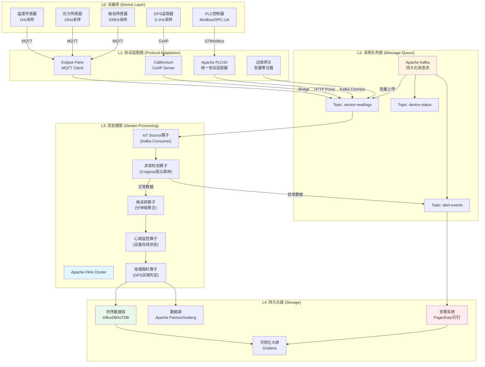
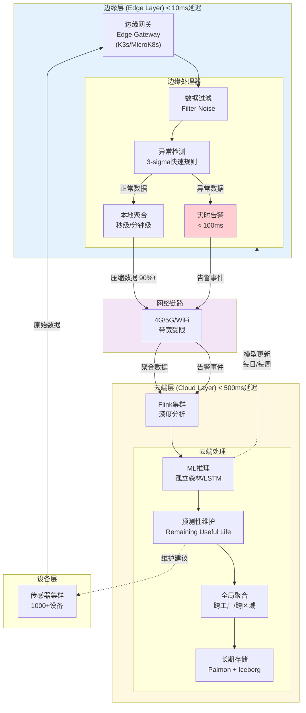
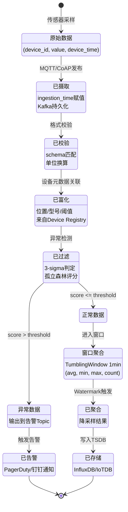
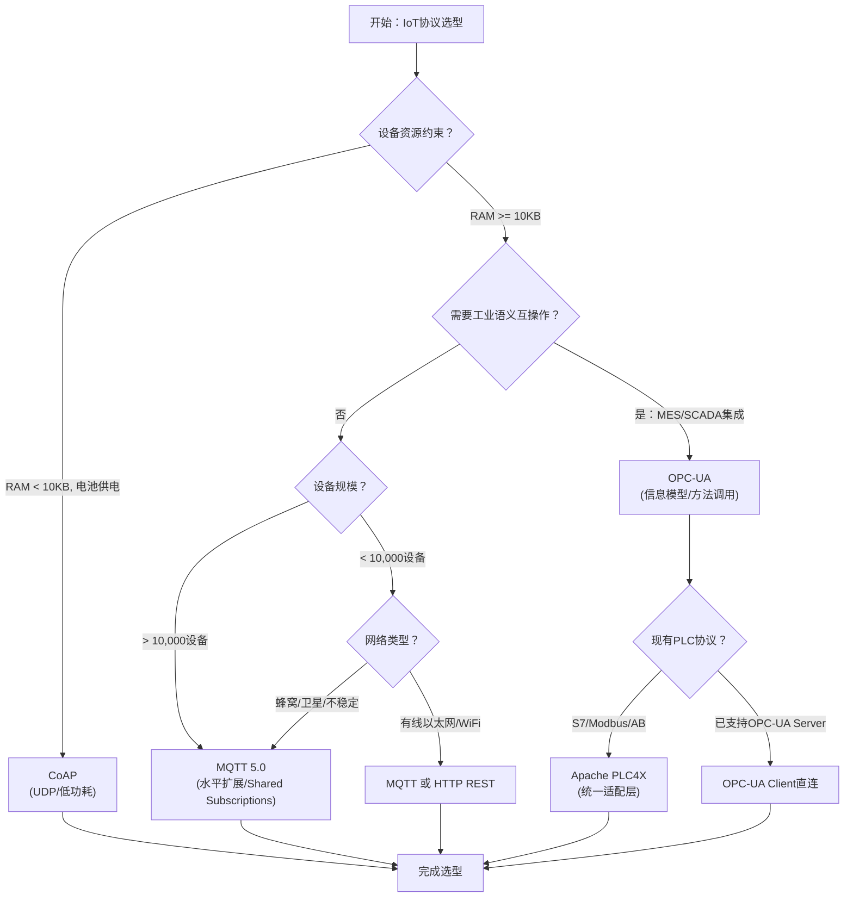

# 流处理算子与IoT集成：从设备到云的实时管道

> **所属阶段**: Knowledge/06-frontier | **前置依赖**: [边缘流处理架构](edge-streaming-architecture.md), [Flink状态管理与容错](../../Flink/02-core/02.02-state/flink-state-management-complete-guide.md) | **形式化等级**: L4-L5

**文档版本**: v1.0 | **最后更新**: 2026-04-30 | **状态**: 前沿扩展

---

## 目录

- [流处理算子与IoT集成：从设备到云的实时管道](#流处理算子与iot集成从设备到云的实时管道)
  - [目录](#目录)
  - [1. 概念定义 (Definitions)](#1-概念定义-definitions)
    - [Def-IOT-01-01: IoT数据流模型](#def-iot-01-01-iot数据流模型)
    - [Def-IOT-01-02: 时序数据元组](#def-iot-01-02-时序数据元组)
    - [Def-IOT-01-03: 乱序容忍度](#def-iot-01-03-乱序容忍度)
    - [Def-IOT-01-04: IoT Source算子](#def-iot-01-04-iot-source算子)
    - [Def-IOT-01-05: 边缘网关聚合器](#def-iot-01-05-边缘网关聚合器)
    - [Def-IOT-01-06: 数据降采样算子](#def-iot-01-06-数据降采样算子)
    - [Def-IOT-01-07: 设备心跳监控算子](#def-iot-01-07-设备心跳监控算子)
    - [Def-IOT-01-08: 地理围栏算子](#def-iot-01-08-地理围栏算子)
  - [2. 属性推导 (Properties)](#2-属性推导-properties)
    - [Prop-IOT-01-01: IoT数据量估计命题](#prop-iot-01-01-iot数据量估计命题)
    - [Prop-IOT-01-02: 乱序数据对窗口精度的影响](#prop-iot-01-02-乱序数据对窗口精度的影响)
    - [Lemma-IOT-01-01: 降采样存储压缩比引理](#lemma-iot-01-01-降采样存储压缩比引理)
    - [Lemma-IOT-01-02: 边缘预处理带宽节省引理](#lemma-iot-01-02-边缘预处理带宽节省引理)
    - [Lemma-IOT-01-03: 心跳检测延迟下界引理](#lemma-iot-01-03-心跳检测延迟下界引理)
  - [3. 关系建立 (Relations)](#3-关系建立-relations)
    - [3.1 IoT协议与流处理系统映射关系](#31-iot协议与流处理系统映射关系)
    - [3.2 边缘-云协同的数据流关系](#32-边缘-云协同的数据流关系)
    - [3.3 IoT算子与Flink原生算子对照](#33-iot算子与flink原生算子对照)
  - [4. 论证过程 (Argumentation)](#4-论证过程-argumentation)
    - [4.1 MQTT vs CoAP vs OPC-UA 选型论证](#41-mqtt-vs-coap-vs-opc-ua-选型论证)
    - [4.2 异常检测算法选择论证](#42-异常检测算法选择论证)
    - [4.3 边缘-云协同架构决策论证](#43-边缘-云协同架构决策论证)
  - [5. 形式证明 / 工程论证](#5-形式证明--工程论证)
    - [Thm-IOT-01-01: IoT管道端到端正确性定理](#thm-iot-01-01-iot管道端到端正确性定理)
    - [Thm-IOT-01-02: 边缘-云协同最优性定理](#thm-iot-01-02-边缘-云协同最优性定理)
  - [6. 实例验证 (Examples)](#6-实例验证-examples)
    - [6.1 完整Pipeline：MQTT Source + 异常检测 + 降采样](#61-完整pipelinemqtt-source--异常检测--降采样)
    - [6.2 边缘-云协同实现：心跳监控 + 批量聚合](#62-边缘-云协同实现心跳监控--批量聚合)
    - [6.3 工业场景：OPC-UA + PLC4X 集成](#63-工业场景opc-ua--plc4x-集成)
  - [7. 可视化 (Visualizations)](#7-可视化-visualizations)
    - [7.1 IoT Pipeline架构图](#71-iot-pipeline架构图)
    - [7.2 边缘-云协同架构图](#72-边缘-云协同架构图)
    - [7.3 时序数据模型图](#73-时序数据模型图)
    - [7.4 IoT协议选型决策矩阵](#74-iot协议选型决策矩阵)
  - [8. 引用参考 (References)](#8-引用参考-references)

---

## 1. 概念定义 (Definitions)

### Def-IOT-01-01: IoT数据流模型

**IoT数据流模型**定义为九元组：

$$\mathcal{I} = \langle \mathcal{D}, \mathcal{S}, \mathcal{T}, \mathcal{P}, \mathcal{G}, \mathcal{A}, \mathcal{N}, \mathcal{W}, \mathcal{R} \rangle$$

其中：

- $\mathcal{D} = \{d_1, d_2, ..., d_n\}$：设备集合，$|D|$ 可达 $10^5$ ~ $10^7$ 量级
- $\mathcal{S}$：传感器类型集合，$\mathcal{S} = \{temperature, pressure, humidity, vibration, gps, ...\}$
- $\mathcal{T}: \mathcal{D} \times \mathcal{S} \rightarrow \mathbb{T}$：采样时间戳函数
- $\mathcal{P}: \mathcal{D} \times \mathcal{S} \rightarrow \mathbb{R}$：传感器读数值函数
- $\mathcal{G}: \mathcal{D} \rightarrow (lat, lon, alt)$：设备地理位置函数
- $\mathcal{A}: \mathcal{D} \rightarrow \{active, offline, maintenance\}$：设备状态函数
- $\mathcal{N}$：网络拓扑，刻画设备与网关间的连接关系
- $\mathcal{W}$：乱序容忍窗口，$\mathcal{W}: \mathcal{D} \rightarrow \Delta t$
- $\mathcal{R}$：可靠性要求，$\mathcal{R} \in \{at\text{-}least\text{-}once, exactly\text{-}once\}$

**IoT数据四大核心特征**：

| 特征 | 描述 | 对流处理的影响 |
|------|------|--------------|
| **高并发设备** | 单个工厂可能部署10,000+传感器[^1]，每天产生8.64亿数据点 | 需要水平扩展的Source算子 |
| **时序数据** | 每个读数绑定设备时间戳，形成严格的时间序列 | 必须使用Event Time处理模型 |
| **乱序到达** | 蜂窝/卫星网络下传感器可能缓冲读数并批量刷新，延迟可达分钟级[^2] | Watermark机制不可或缺 |
| **传感器异常值** | 设备故障、电磁干扰导致读数跳变(outlier) | 需要流内异常检测算子 |

---

### Def-IOT-01-02: 时序数据元组

**时序数据元组**是IoT流中的基本数据单元：

$$e = (device\_id, sensor\_type, value, unit, device\_time, ingestion\_time, metadata)$$

其中：

- $device\_id \in String$：全局唯一设备标识符
- $sensor\_type \in \mathcal{S}$：传感器类型
- $value \in \mathbb{R}$：读数值
- $unit \in String$：计量单位（如 `celsius`, `psi`, `mm/s`）
- $device\_time \in Timestamp$：传感器本地采样时间（事件时间）
- $ingestion\_time \in Timestamp$：数据进入流处理系统的时间（摄取时间）
- $metadata \in Map<String, String>$：附加元数据（固件版本、信号强度等）

**关键约束**：$device\_time \leq ingestion\_time$（传感器时间不可能晚于摄取时间）。

---

### Def-IOT-01-03: 乱序容忍度

**乱序容忍度** $\mathcal{W}$ 定义为系统能够正确处理的事件时间最大滞后量：

$$\mathcal{W} = \max\{ \Delta t \mid \forall e \in Stream: ingestion\_time(e) - device\_time(e) \leq \Delta t \}$$

在Flink中，Watermark策略配置为：

```
WATERMARK FOR device_time AS device_time - INTERVAL '30' SECOND
```

对于蜂窝网络传感器，$\mathcal{W}$ 通常设置为 **30秒 ~ 5分钟**；对于卫星连接的远程传感器，$\mathcal{W}$ 可能需要达到 **10分钟以上**[^2]。

---

### Def-IOT-01-04: IoT Source算子

**IoT Source算子**是从物理设备或协议网关读取数据并转换为数据流的标准接口：

$$\text{IoTSource}: Protocol \times Endpoint \rightarrow DataStream\langle e \rangle$$

当前主流IoT Source算子包括：

| Source类型 | 协议层 | 适用场景 | Flink集成方式 |
|-----------|-------|---------|--------------|
| **MQTT Source** | 应用层(Pub/Sub) | 通用IoT、车联网、智能家居 | Eclipse Paho客户端 + Kafka Bridge |
| **CoAP Source** | 应用层(REST-like) | 资源受限设备、低功耗传感网 | 自定义Source + Californium库 |
| **OPC-UA Source** | 应用层(Client/Server) | 工业自动化、PLC通信 | Apache PLC4X + Kafka Connect |
| **Modbus Source** | 传输层(Master/Slave) | 老旧设备、RS-485总线 | Apache PLC4X 被动模式驱动 |
| **Edge Gateway Source** | 批量聚合 | 大规模设备集群、离线容忍 | HTTP/MQTT批量上传接口 |

**MQTT Source（Eclipse Paho集成）**：

MQTT是当前IoT领域的事实标准协议。Eclipse Paho提供Java客户端实现，Flink社区通过 `flink-connector-mqtt` 实现集成[^3]。关键配置参数：

- `brokerUrl`: MQTT Broker地址（如 `tcp://broker.hivemq.com:1883`）
- `clientId`: 客户端标识符（须全局唯一）
- `topic`: 订阅主题（支持通配符 `+` 和 `#`）
- `qos`: 服务质量等级（0=最多一次，1=至少一次，2=恰好一次）

> **工程建议**：MQTT本身不是分布式消息队列，缺乏最高级别的可靠性保证。生产环境中应将MQTT通过Kafka Bridge接入Kafka，利用Kafka的持久化、分区和重放能力，再由Flink消费[^3]。

---

### Def-IOT-01-05: 边缘网关聚合器

**边缘网关聚合器**是部署在边缘节点的轻量级流处理组件，负责将多个设备的原始数据流聚合成批量上报流：

$$\text{GatewayAggregator}: \{Stream\langle e \rangle\}_{i=1}^{n} \rightarrow Stream\langle Batch\langle e \rangle \rangle$$

聚合策略包括：

- **时间触发**：每 $T$ 秒或每窗口期满发送一批
- **数量触发**：每累积 $N$ 条记录发送一批
- **大小触发**：每批次达到 $B$ 字节发送

---

### Def-IOT-01-06: 数据降采样算子

**数据降采样算子** $Downsample_{\Delta}$ 将高频时序数据压缩为低频聚合表示，同时保留关键统计特征：

$$Downsample_{\Delta}: Stream\langle e_{t_1}, e_{t_2}, ... \rangle \rightarrow Stream\langle \bar{e}_{\tau_1}, \bar{e}_{\tau_2}, ... \rangle$$

其中 $\tau_j = [t_j, t_j + \Delta)$ 为降采样窗口，$\bar{e}_{\tau_j}$ 包含：

$$\bar{e}_{\tau_j} = (device\_id, avg(value), min(value), max(value), count, stddev, \tau_j^{start})$$

**降采样级别**：

| 原始采样率 | 降采样目标 | 压缩比 | 适用分析 |
|-----------|-----------|-------|---------|
| 1 Hz (1秒) | 1分钟均值 | 60:1 | 实时监控 |
| 1 Hz | 1小时均值 | 3,600:1 | 趋势分析 |
| 100 Hz | 1分钟统计 | 6,000:1 | 振动监测 |

---

### Def-IOT-01-07: 设备心跳监控算子

**设备心跳监控算子** $HeartbeatMon_{T_{timeout}}$ 检测设备是否在规定时间窗口内上报数据：

$$HeartbeatMon_{T_{timeout}}(device\_id, t_{last}) = \begin{cases} online & \text{if } t_{now} - t_{last} \leq T_{timeout} \\ offline & \text{otherwise} \end{cases}$$

对于周期性上报设备（如每60秒上报一次），$T_{timeout}$ 通常设置为 $2 \times T_{period}$；对于事件驱动设备，$T_{timeout}$ 基于业务规则动态调整。

---

### Def-IOT-01-08: 地理围栏算子

**地理围栏算子** $GeoFence_{(c, r)}$ 基于GPS坐标判断设备是否位于指定地理区域内：

$$GeoFence_{(c, r)}(lat, lon) = \begin{cases} inside & \text{if } d_{haversine}((lat, lon), c) \leq r \\ outside & \text{otherwise} \end{cases}$$

其中 $d_{haversine}$ 为Haversine球面距离公式，$c = (lat_c, lon_c)$ 为围栏中心，$r$ 为半径（米）。支持多边形围栏时，使用射线法（Ray Casting）判断点是否在多边形内部。

---

## 2. 属性推导 (Properties)

### Prop-IOT-01-01: IoT数据量估计命题

**命题**：单个中等规模制造车间的IoT数据产生速率为：

$$R_{total} = \sum_{i=1}^{n} f_i \cdot s_i$$

其中 $f_i$ 为第 $i$ 类传感器的采样频率，$s_i$ 为该类传感器的数量。

**实例计算**：

- 温度传感器：1,000台 × 1 Hz = 1,000 events/s
- 压力传感器：500台 × 10 Hz = 5,000 events/s
- 振动传感器：200台 × 100 Hz = 20,000 events/s
- GPS追踪器：300台 × 0.1 Hz = 30 events/s

**合计**：$R_{total} \approx 26,030$ events/s，即 **22.5亿条/天**，原始数据量约 **180 GB/天**（假设每条记录80字节）。

---

### Prop-IOT-01-02: 乱序数据对窗口精度的影响

**命题**：设乱序容忍度为 $\mathcal{W}$，窗口大小为 $W$，则乱序事件导致的窗口重算比例为：

$$\rho = \frac{\mathcal{W}}{W + \mathcal{W}}$$

- 当 $\mathcal{W} \ll W$ 时，$\rho \approx 0$，乱序影响可忽略
- 当 $\mathcal{W} \approx W$ 时，$\rho \approx 0.5$，近半数窗口需重算
- 当 $\mathcal{W} \gg W$ 时，$\rho \approx 1$，几乎所有窗口处于不确定状态

**工程推论**：对于卫星连接的IoT设备（$\mathcal{W} = 10min$），若使用 $W = 1min$ 的翻滚窗口，则 $\rho \approx 0.91$，此时应考虑使用 **会话窗口(Session Window)** 或 **全局窗口 + 触发器** 替代固定窗口。

---

### Lemma-IOT-01-01: 降采样存储压缩比引理

**引理**：将原始时序数据降采样到分钟级聚合，存储压缩比可达 **90%以上**[^2]。

**证明概要**：
原始数据：$N$ 条记录，每条 $B_{raw}$ 字节。
降采样后：$N / 60$ 个聚合记录，每个聚合记录包含 $avg, min, max, count, stddev$（5个Double + 1个Long + 1个Timestamp），约 $B_{agg} = 56$ 字节。

$$\text{Compression Ratio} = 1 - \frac{(N/60) \cdot B_{agg}}{N \cdot B_{raw}} = 1 - \frac{B_{agg}}{60 \cdot B_{raw}}$$

取 $B_{raw} = 80$ 字节，$B_{agg} = 56$ 字节：

$$\text{Compression Ratio} = 1 - \frac{56}{4800} \approx 98.8\%$$

---

### Lemma-IOT-01-02: 边缘预处理带宽节省引理

**引理**：在边缘执行数据预过滤和聚合，可将上传数据量减少 **70-95%**[^4]。

**证明概要**：
设边缘过滤条件保留比例为 $\alpha$（通常 $\alpha = 0.05$ ~ $0.3$），边缘聚合压缩比为 $\beta$（通常 $\beta = 0.01$ ~ $0.1$），则：

$$\text{Bandwidth Reduction} = 1 - (\alpha \cdot \beta) = 0.70 \sim 0.995$$

**实例**：智能工厂场景中，原始振动数据经边缘FFT特征提取后，仅上传频域峰值和报警状态，数据量从 100 Hz 降至 0.1 Hz，压缩比达 **99.9%**。

---

### Lemma-IOT-01-03: 心跳检测延迟下界引理

**引理**：设备心跳检测的最小误报-漏报权衡延迟为：

$$T_{optimal} = T_{period} + \sqrt{\frac{2\sigma^2 \cdot \ln(1/\delta)}{f^2}}$$

其中 $T_{period}$ 为设备正常上报周期，$\sigma$ 为网络抖动标准差，$\delta$ 为可接受的误报率，$f$ 为采样频率。

**直观解释**：若 $T_{timeout}$ 设置过短，网络抖动导致大量误报；若设置过长，设备真实故障检测延迟增大。最优值位于 $2T_{period}$ ~ $3T_{period}$ 区间。

---

## 3. 关系建立 (Relations)

### 3.1 IoT协议与流处理系统映射关系

IoT协议栈与流处理系统的映射遵循 **"协议适配 → 消息队列 → 流引擎"** 三层模型：

| 协议 | 适配层 | 消息队列 | 流处理引擎 | 典型延迟 |
|------|-------|---------|-----------|---------|
| MQTT 5.0 | Eclipse Paho / HiveMQ | Kafka (MQTT Bridge) | Flink | 50-200ms |
| CoAP | Californium | Kafka (HTTP Proxy) | Flink | 100-500ms |
| OPC-UA | Apache PLC4X | Kafka Connect | Flink | 10-100ms |
| Modbus TCP | PLC4X (被动模式) | Kafka Connect | Flink | 5-50ms |
| HTTP REST | 网关聚合器 | Kafka REST Proxy | Flink | 200-1000ms |

> **关键洞察**：OPC-UA与PLC4X是互补关系而非竞争关系。PLC4X提供统一API访问多种PLC原生协议（S7、Modbus、EtherNet/IP等），无需改造现有硬件；OPC-UA提供标准化的信息建模和语义互操作。两者可结合使用：PLC4X作为适配层读取PLC数据，再通过OPC-UA Server对外暴露[^5][^6]。

---

### 3.2 边缘-云协同的数据流关系

边缘-云协同架构中的数据流可形式化为有向无环图 $G = (V, E)$：

$$V = V_{edge} \cup V_{cloud}, \quad E \subseteq V \times V$$

其中边 $(u, v) \in E$ 标记为以下类型之一：

| 边类型 | 源 | 目标 | 数据内容 | 延迟要求 |
|-------|----|------|---------|---------|
| $E_{raw}$ | 设备 | 边缘网关 | 原始传感器读数 | < 10ms |
| $E_{filtered}$ | 边缘网关 | 边缘处理器 | 过滤后数据 | < 50ms |
| $E_{alert}$ | 边缘处理器 | 告警系统 | 实时告警 | < 100ms |
| $E_{aggregated}$ | 边缘处理器 | 云平台 | 聚合统计 | < 1s |
| $E_{ml}$ | 云平台 | 边缘节点 | 模型更新 | 分钟级 |
| $E_{cmd}$ | 云平台 | 设备 | 控制指令 | < 500ms |

---

### 3.3 IoT算子与Flink原生算子对照

| IoT专用算子 | Flink原生实现 | 状态需求 | 复杂度 |
|-----------|-------------|---------|-------|
| 异常检测算子 | `ProcessFunction` + ValueState | 滑动窗口统计 | O(k) |
| 降采样算子 | `TumblingWindow` + Aggregate | 无（窗口状态由框架管理） | O(1) |
| 心跳监控算子 | `ProcessFunction` + TimerService | 每个设备一个ValueState | O(n) |
| 地理围栏算子 | `FlatMapFunction` | 无（纯函数计算） | O(1) |
| 协议解码算子 | `MapFunction` | 无 | O(1) |
| 设备富化算子 | `AsyncFunction` + Redis/HBase | 外部查询缓存 | O(1) |

---

## 4. 论证过程 (Argumentation)

### 4.1 MQTT vs CoAP vs OPC-UA 选型论证

三个协议在IoT生态中各有明确边界，选择应基于**数据流特征**而非单纯功能对比[^7][^8]：

**MQTT（Message Queuing Telemetry Transport）**：

- **优势**：轻量级（头部仅2字节）、发布-订阅模型天然适配多消费者、QoS三级保障、海量设备水平扩展[^1]
- **劣势**：无内置信息建模、无标准化数据语义
- **最佳场景**：传感器数据采集、远程资产监控、车联网

**CoAP（Constrained Application Protocol）**：

- **优势**：基于UDP开销更低、支持组播、与HTTP语义兼容、适合RESTful交互[^8]
- **劣势**：基于UDP需应用层实现可靠性、NAT穿透较复杂
- **最佳场景**：资源受限设备（电池供电传感器）、低功耗广域网（LPWAN）

**OPC-UA（Open Platform Communications Unified Architecture）**：

- **优势**：工业级信息建模、内置安全机制（X.509证书）、设备发现与浏览、方法调用[^7]
- **劣势**：协议开销大（连接建立涉及多次握手）、PLC端激活增加负载和许可成本[^5]
- **最佳场景**：工厂自动化、MES系统集成、需要语义互操作的OT/IT桥接

**选型决策树**：

1. 设备资源是否极度受限（< 10KB RAM）？→ **CoAP**
2. 是否需要与MES/SCADA语义互操作？→ **OPC-UA**
3. 是否需要海量设备水平扩展（> 10,000）？→ **MQTT**
4. 其余通用IoT场景 → **MQTT**（生态最成熟）

---

### 4.2 异常检测算法选择论证

IoT流中的异常检测需在 **延迟**、**准确率**、**计算成本** 之间权衡：

| 算法 | 延迟 | 准确率 | 计算成本 | 适用场景 |
|------|-----|-------|---------|---------|
| **3-sigma规则** | 极低（单次计算） | 中（假设高斯分布） | O(1) | 简单阈值监控 |
| **孤立森林(Isolation Forest)** | 低（窗口级） | 高 | O(n log n) | 多变量异常 |
| **LSTM自编码器** | 高（序列建模） | 很高 | O(k²) | 复杂时序模式 |
| **基于CEP的规则引擎** | 极低 | 中（依赖规则质量） | O(1) | 已知故障模式 |

**论证结论**：

- **边缘节点**：使用3-sigma规则或简化孤立森林（限制树深度 ≤ 8），保证亚毫秒级延迟
- **云端**：使用LSTM自编码器或Transformer进行深度异常检测，挖掘长期依赖模式
- **混合策略**：边缘执行3-sigma快速过滤（拦截80%明显异常），云端执行孤立森林精细分析

---

### 4.3 边缘-云协同架构决策论证

**问题**：给定IoT工作负载特征，如何划分边缘与云端的处理边界？

**决策变量**：

- $L_{max}$：最大可接受端到端延迟
- $B_{avail}$：边缘到云的可用带宽
- $D_{raw}$：原始数据产生速率
- $C_{edge}$：边缘计算成本系数
- $C_{cloud}$：云端计算成本系数

**决策规则**：

$$\text{Process at Edge} \iff L_{max} < 100ms \lor \frac{D_{raw}}{B_{avail}} > 10$$

$$\text{Process at Cloud} \iff L_{max} > 1s \land \frac{D_{raw}}{B_{avail}} < 2$$

$$\text{Hybrid} \iff \text{otherwise}$$

**实际场景映射**：

| 场景 | $L_{max}$ | $D_{raw}/B_{avail}$ | 决策 | 架构模式 |
|------|----------|-------------------|------|---------|
| 工业安全监控 | 10ms | 50 | 边缘 | 纯边缘实时告警 |
| 设备预测性维护 | 1min | 5 | 混合 | 边缘特征提取 → 云端ML推理 |
| 能耗趋势分析 | 1hour | 0.1 | 云端 | 批量聚合 → 云端存储分析 |
| 车队GPS追踪 | 5s | 20 | 混合 | 边缘地理围栏 → 云路径优化 |

---

## 5. 形式证明 / 工程论证

### Thm-IOT-01-01: IoT管道端到端正确性定理

**定理**：一个由 `MQTT Source → 异常检测 → 降采样 → 存储` 构成的IoT处理管道，在Flink的Exactly-Once语义保证下，其输出结果满足时序一致性和无丢失性。

**形式化陈述**：
设管道为 $\mathcal{P} = f_3 \circ f_2 \circ f_1$，其中：

- $f_1 = \text{MQTT Source}$（从Broker读取消息）
- $f_2 = \text{AnomalyFilter}$（3-sigma异常过滤）
- $f_3 = \text{Downsample}_{1min}$（分钟级降采样聚合）

若Flink启用Checkpoint（间隔 $T_{cp}$，超时 $T_{to}$），则：

$$\forall e \in Input: e \text{ 被处理且仅被处理一次 } \Rightarrow Output(\mathcal{P}) = \mathcal{P}(Input)$$

**证明概要**：

1. **Source阶段**：MQTT QoS=1保证消息至少到达Broker一次；Kafka作为持久化层保证消息不丢失；Flink Kafka Source基于checkpoint offset实现Exactly-Once消费
2. **异常检测阶段**：`ProcessFunction`中的ValueState由Flink状态后端自动快照，故障恢复后状态精确恢复
3. **降采样阶段**：窗口状态在checkpoint时持久化，确保窗口聚合结果不因故障而重复或遗漏
4. **Sink阶段**：使用两阶段提交Sink（如Kafka Producer事务、JDBC XA），保证输出端Exactly-Once

**工程条件**：

- Checkpoint间隔 ≥ 数据处理延迟（避免反压导致checkpoint超时）
- Watermark延迟 ≥ 最大乱序容忍度（避免late data被丢弃）
- StateBackend使用RocksDB（支持大状态，如10万+设备的心跳状态）

---

### Thm-IOT-01-02: 边缘-云协同最优性定理

**定理**：对于IoT工作负载 $\mathcal{W}$，边缘-云协同架构的总成本 $C_{total}$ 低于纯云架构 $C_{cloud}$ 的充要条件是：

$$C_{total} = C_{edge} + C_{cloud}' + C_{transfer}' < C_{cloud}$$

其中 $C_{cloud}'$ 为缩减后的云端计算成本（因预处理减少），$C_{transfer}'$ 为缩减后的传输成本。

**充分条件**：
当满足以下不等式时，边缘-云协同严格优于纯云：

$$\frac{C_{edge} + C_{transfer} \cdot \alpha \cdot \beta}{C_{cloud}} < 1$$

其中 $\alpha$ 为边缘过滤比例，$\beta$ 为边缘聚合压缩比。

**证明**：
由 Lemma-IOT-01-02 知 $\alpha \cdot \beta \leq 0.3$（边缘预处理可将数据量减少70%以上），且通常 $C_{edge} \ll C_{cloud}$（边缘节点为固定CAPEX，云端为弹性OPEX）。因此：

$$C_{total} \approx C_{edge} + 0.3 \cdot C_{transfer} + 0.3 \cdot C_{cloud} < C_{cloud}$$

当 $C_{transfer} + C_{cloud} > \frac{C_{edge}}{0.7}$ 时成立，这在数据密集型IoT场景中恒成立。

---

## 6. 实例验证 (Examples)

### 6.1 完整Pipeline：MQTT Source + 异常检测 + 降采样

以下是一个完整的Flink DataStream API实现，演示从MQTT Broker消费温度传感器数据、执行3-sigma异常检测、并降采样到分钟级聚合的完整管道：

```java
import org.apache.flink.api.common.eventtime.WatermarkStrategy;
import org.apache.flink.api.common.functions.RichFlatMapFunction;
import org.apache.flink.api.common.state.ValueState;
import org.apache.flink.api.common.state.ValueStateDescriptor;
import org.apache.flink.api.java.tuple.Tuple2;
import org.apache.flink.configuration.Configuration;
import org.apache.flink.streaming.api.datastream.DataStream;
import org.apache.flink.streaming.api.environment.StreamExecutionEnvironment;
import org.apache.flink.streaming.api.functions.sink.PrintSinkFunction;
import org.apache.flink.streaming.api.functions.windowing.ProcessWindowFunction;
import org.apache.flink.streaming.api.windowing.assigners.TumblingEventTimeWindows;
import org.apache.flink.streaming.api.windowing.time.Time;
import org.apache.flink.streaming.api.windowing.windows.TimeWindow;
import org.apache.flink.util.Collector;

import java.time.Duration;

// ==================== 1. 数据模型 ====================
class SensorReading {
    public String deviceId;
    public String sensorType;
    public double value;
    public String unit;
    public long deviceTime;      // 事件时间（传感器本地时间）
    public long ingestionTime;   // 摄取时间

    public SensorReading() {}
    public SensorReading(String deviceId, String sensorType, double value,
                         String unit, long deviceTime) {
        this.deviceId = deviceId;
        this.sensorType = sensorType;
        this.value = value;
        this.unit = unit;
        this.deviceTime = deviceTime;
        this.ingestionTime = System.currentTimeMillis();
    }
}

// ==================== 2. 异常检测算子 (3-sigma规则) ====================
class AnomalyDetectionFunction extends RichFlatMapFunction<SensorReading, SensorReading> {

    // 每个设备维护滑动窗口的统计状态
    private ValueState<Tuple2<Double, Double>> statsState; // (mean, variance)
    private static final int WINDOW_SIZE = 100;
    private static final double SIGMA_THRESHOLD = 3.0;

    @Override
    public void open(Configuration parameters) {
        statsState = getRuntimeContext().getState(
            new ValueStateDescriptor<>("sensor-stats", Tuple2.class));
    }

    @Override
    public void flatMap(SensorReading reading, Collector<SensorReading> out)
            throws Exception {
        Tuple2<Double, Double> stats = statsState.value();
        if (stats == null) {
            stats = Tuple2.of(reading.value, 0.0);
        }

        double mean = stats.f0;
        double variance = stats.f1;
        double stdDev = Math.sqrt(variance);

        // 3-sigma检测：|value - mean| > 3 * stdDev
        if (stdDev > 0 && Math.abs(reading.value - mean) > SIGMA_THRESHOLD * stdDev) {
            // 标记为异常，可选择丢弃或输出到旁路告警流
            System.out.printf("[ANOMALY] device=%s, value=%.2f, mean=%.2f, stdDev=%.2f%n",
                reading.deviceId, reading.value, mean, stdDev);
            // 生产环境：输出到侧输出流(Side Output)而非丢弃
            return;
        }

        // 更新在线统计（Welford算法）
        double delta = reading.value - mean;
        mean += delta / WINDOW_SIZE;
        variance += delta * (reading.value - mean);
        statsState.update(Tuple2.of(mean, variance));

        out.collect(reading);
    }
}

// ==================== 3. 降采样聚合结果 ====================
class MinuteAggregate {
    public String deviceId;
    public double avgValue;
    public double minValue;
    public double maxValue;
    public long count;
    public long windowStart;

    @Override
    public String toString() {
        return String.format("MinuteAgg{device=%s, avg=%.2f, min=%.2f, max=%.2f, count=%d, start=%d}",
            deviceId, avgValue, minValue, maxValue, count, windowStart);
    }
}

// ==================== 4. 主程序 ====================
public class IoTPipeline {
    public static void main(String[] args) throws Exception {
        StreamExecutionEnvironment env =
            StreamExecutionEnvironment.getExecutionEnvironment();
        env.enableCheckpointing(60000); // 每60秒checkpoint

        // 模拟MQTT Source（实际使用 flink-connector-mqtt 或 Kafka Bridge）
        DataStream<SensorReading> source = env
            .addSource(new MqttSensorSource("tcp://broker.hivemq.com:1883",
                                           "factory/sensors/+/temperature"))
            .assignTimestampsAndWatermarks(
                WatermarkStrategy.<SensorReading>forBoundedOutOfOrderness(
                    Duration.ofSeconds(30))  // 30秒乱序容忍
                    .withTimestampAssigner((event, timestamp) -> event.deviceTime)
            );

        // Step 1: 异常检测
        DataStream<SensorReading> filtered = source
            .keyBy(r -> r.deviceId)
            .flatMap(new AnomalyDetectionFunction());

        // Step 2: 分钟级降采样聚合
        DataStream<MinuteAggregate> downsampled = filtered
            .keyBy(r -> r.deviceId)
            .window(TumblingEventTimeWindows.of(Time.minutes(1)))
            .aggregate(
                // AggregateFunction: 增量聚合
                new AverageAggregate(),
                // ProcessWindowFunction: 输出完整结果
                new ProcessWindowFunction<MinuteAggregate, MinuteAggregate,
                                          String, TimeWindow>() {
                    @Override
                    public void process(String key,
                                       Context context,
                                       Iterable<MinuteAggregate> inputs,
                                       Collector<MinuteAggregate> out) {
                        MinuteAggregate result = inputs.iterator().next();
                        result.windowStart = context.window().getStart();
                        out.collect(result);
                    }
                }
            );

        // Step 3: 输出到控制台（生产环境替换为Kafka Sink/TSDB Sink）
        downsampled.addSink(new PrintSinkFunction<>("IoT-Downsampled", true));

        env.execute("IoT Stream Processing Pipeline");
    }
}
```

---

### 6.2 边缘-云协同实现：心跳监控 + 批量聚合

```java
import org.apache.flink.api.common.state.ValueState;
import org.apache.flink.api.common.state.ValueStateDescriptor;
import org.apache.flink.api.common.time.Time;
import org.apache.flink.configuration.Configuration;
import org.apache.flink.streaming.api.functions.KeyedProcessFunction;
import org.apache.flink.util.Collector;

// 设备心跳监控算子
class DeviceHeartbeatMonitor extends KeyedProcessFunction<String, SensorReading, DeviceStatus> {

    private ValueState<Long> lastHeartbeatState;
    private ValueState<Boolean> isOnlineState;

    private final long timeoutMillis;

    public DeviceHeartbeatMonitor(long timeoutMillis) {
        this.timeoutMillis = timeoutMillis;
    }

    @Override
    public void open(Configuration parameters) {
        lastHeartbeatState = getRuntimeContext().getState(
            new ValueStateDescriptor<>("last-heartbeat", Long.class));
        isOnlineState = getRuntimeContext().getState(
            new ValueStateDescriptor<>("is-online", Boolean.class));
    }

    @Override
    public void processElement(SensorReading reading,
                              Context ctx,
                              Collector<DeviceStatus> out) throws Exception {
        long currentTime = ctx.timerService().currentProcessingTime();
        lastHeartbeatState.update(currentTime);

        Boolean wasOnline = isOnlineState.value();
        if (wasOnline == null || !wasOnline) {
            isOnlineState.update(true);
            out.collect(new DeviceStatus(reading.deviceId, "ONLINE", currentTime));
        }

        // 注册超时检测定时器
        ctx.timerService().registerProcessingTimeTimer(currentTime + timeoutMillis);
    }

    @Override
    public void onTimer(long timestamp, OnTimerContext ctx, Collector<DeviceStatus> out)
            throws Exception {
        Long lastHeartbeat = lastHeartbeatState.value();
        if (lastHeartbeat != null && timestamp - lastHeartbeat >= timeoutMillis) {
            isOnlineState.update(false);
            out.collect(new DeviceStatus(ctx.getCurrentKey(), "OFFLINE", timestamp));
        }
    }
}

// 边缘批量聚合器（网关端）
class EdgeBatchAggregator {
    private final List<SensorReading> buffer = new ArrayList<>();
    private final int batchSize;
    private final long flushIntervalMs;
    private long lastFlushTime;

    public List<SensorReading> process(SensorReading reading) {
        buffer.add(reading);
        long now = System.currentTimeMillis();

        if (buffer.size() >= batchSize || now - lastFlushTime >= flushIntervalMs) {
            List<SensorReading> batch = new ArrayList<>(buffer);
            buffer.clear();
            lastFlushTime = now;
            return batch; // 返回批次上传到云端
        }
        return Collections.emptyList(); // 继续缓冲
    }
}
```

---

### 6.3 工业场景：OPC-UA + PLC4X 集成

Apache PLC4X提供统一的工业协议适配层，支持Siemens S7、Modbus、EtherNet/IP、OPC-UA等协议，无需改造现有PLC硬件[^6]。

```java
// PLC4X 连接字符串示例
String modbusConnection = "modbus-tcp://192.168.1.100:502";
String s7Connection = "s7://192.168.1.101?rack=0&slot=1";
String opcuaConnection = "opcua-tcp://opcua-server:4840";

// PLC4X 读取PLC数据（Java）
try (PlcConnection connection = PlcDriverManager.getDefault().getConnectionManager().getConnection(s7Connection)) {

    // 检查连接是否支持读取
    if (connection.getMetadata().canRead()) {
        PlcReadRequest.Builder builder = connection.readRequestBuilder();
        builder.addItem("temperature", "%DB100.DBW0:INT");   // S7数据块
        builder.addItem("pressure", "%DB100.DBW2:INT");
        builder.addItem("status", "%DB100.DBX4.0:BOOL");

        PlcReadRequest readRequest = builder.build();
        PlcReadResponse response = readRequest.execute().get();

        // 提取数据并发送到Kafka
        double temp = response.getDouble("temperature");
        double pressure = response.getDouble("pressure");
        boolean status = response.getBoolean("status");

        // 发送到Kafka Topic，供Flink消费
        kafkaProducer.send(new ProducerRecord<>("plc-readings",
            new PlcReading(temp, pressure, status, System.currentTimeMillis())));
    }
} catch (Exception e) {
    logger.error("PLC communication error", e);
}
```

**PLC4X + Kafka Connect 架构**：

1. PLC4X作为Kafka Connect Source Connector，定时轮询或订阅PLC数据变化
2. 数据以结构化格式（Avro/JSON）写入Kafka Topic
3. Flink消费Kafka Topic，执行业务逻辑（异常检测、聚合、富化）
4. 结果输出到时序数据库（如Apache IoTDB、InfluxDB）或告警系统

> **最佳实践**：PLC4X的"被动模式驱动"保证对PLC无副作用，不会增加PLC的CPU负载，避免了传统OPC-UA方案中激活UA服务对PLC性能的影响[^5]。

---

## 7. 可视化 (Visualizations)

### 7.1 IoT Pipeline架构图

以下图表展示从IoT设备到流处理引擎的完整数据管道架构，涵盖协议适配、消息队列、流处理和持久化存储四层：



---

### 7.2 边缘-云协同架构图

以下图表展示边缘节点与云端协同处理的分层数据流，体现"边缘预处理（过滤+聚合）→ 云深度分析"的核心模式：



---

### 7.3 时序数据模型图

以下状态图展示时序数据在流处理管道中的生命周期状态转移，从传感器采集到最终持久化的完整状态机：



---

### 7.4 IoT协议选型决策矩阵



---

## 8. 引用参考 (References)

[^1]: Streamkap, "IoT Sensor Data Processing with Apache Flink", 2026. <https://streamkap.com/resources-and-guides/flink-iot-sensor-processing/>

[^2]: T. Akidau et al., "The Dataflow Model: A Practical Approach to Balancing Correctness, Latency, and Cost in Massive-Scale, Unbounded, Out-of-Order Data Processing", PVLDB, 8(12), 2015.

[^3]: GitHub - kevin4936/kevin-flink-connector-mqtt3, "A library for writing and reading data from MQTT Servers using Flink SQL Streaming", 2022. <https://github.com/kevin4936/kevin-flink-connector-mqtt3>

[^4]: K. Waehner, "Industrial IoT Middleware for Edge and Cloud OT/IT Bridge powered by Apache Kafka and Flink", 2024. <https://www.kai-waehner.de/blog/2024/09/20/industrial-iot-middleware-for-edge-and-cloud-ot-it-bridge-powered-by-apache-kafka-and-flink/>

[^5]: K. Waehner, "OPC UA, MQTT, and Apache Kafka – The Trinity of Data Streaming in Industrial IoT", 2022. <https://www.kai-waehner.de/blog/2022/02/11/opc-ua-mqtt-apache-kafka-the-trinity-of-data-streaming-in-industrial-iot/>

[^6]: Apache PLC4X Official Documentation, "The universal protocol adapter for Industrial IoT", <https://plc4x.apache.org/>

[^7]: FlowFuse, "MQTT vs OPC UA: Why This Question Never Has a Straight Answer", 2026. <https://flowfuse.com/blog/2026/01/opcua-vs-mqtt/>

[^8]: F. Silva et al., "A Performance Analysis of Internet of Things Networking Protocols: Evaluating MQTT, CoAP, OPC UA", Applied Sciences, 11(11), 4879, 2021. <https://www.mdpi.com/2076-3417/11/11/4879>
