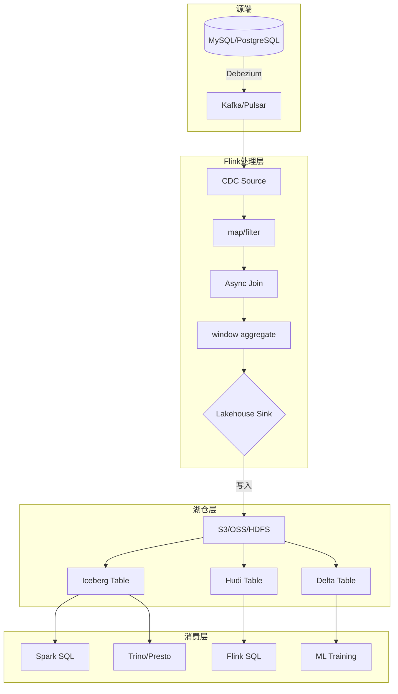
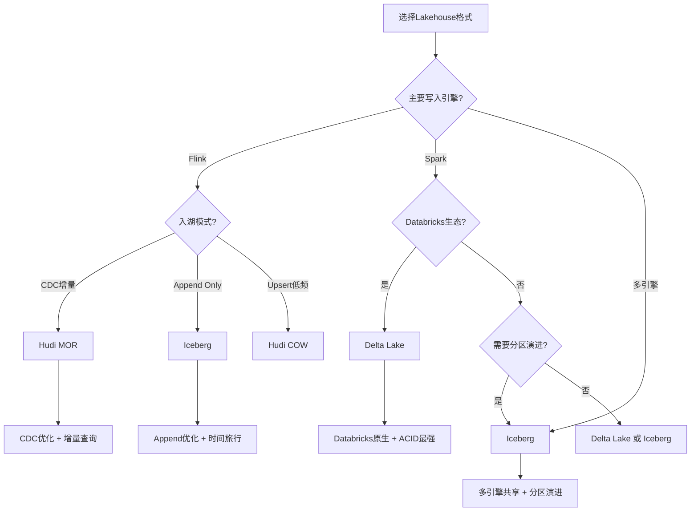
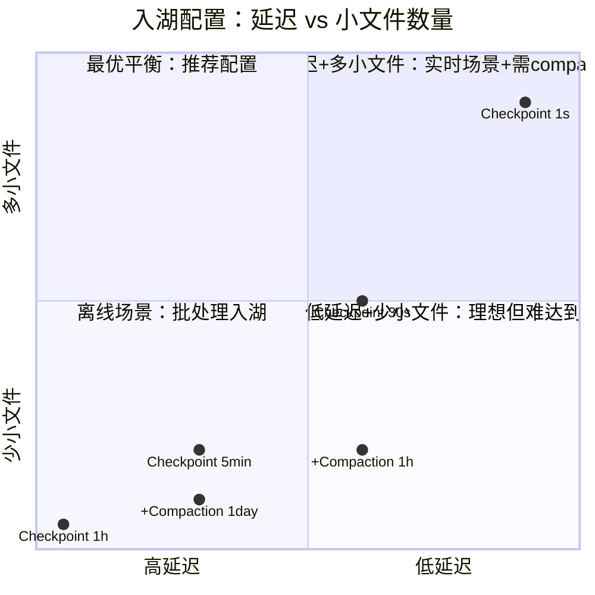

# 算子与湖仓一体（Lakehouse）集成

> **所属阶段**: Knowledge/06-frontier | **前置依赖**: [01.11-io-operators.md](../01-concept-atlas/operator-deep-dive/01.11-io-operators.md), [operator-data-lineage-and-impact-analysis.md](../07-best-practices/operator-data-lineage-and-impact-analysis.md) | **形式化等级**: L3-L4
> **文档定位**: 流处理算子与现代湖仓格式（Iceberg/Delta Lake/Hudi）的集成架构与最佳实践
> **版本**: 2026.04

---

## 目录

- [算子与湖仓一体（Lakehouse）集成](#算子与湖仓一体lakehouse集成)
  - [目录](#目录)
  - [1. 概念定义 (Definitions)](#1-概念定义-definitions)
    - [Def-LKH-01-01: 湖仓一体（Lakehouse）](#def-lkh-01-01-湖仓一体lakehouse)
    - [Def-LKH-01-02: 开放表格式（Open Table Format）](#def-lkh-01-02-开放表格式open-table-format)
    - [Def-LKH-01-03: 流式入湖算子（Streaming Sink to Lakehouse）](#def-lkh-01-03-流式入湖算子streaming-sink-to-lakehouse)
    - [Def-LKH-01-04: CDC入湖算子（CDC Source to Lakehouse）](#def-lkh-01-04-cdc入湖算子cdc-source-to-lakehouse)
    - [Def-LKH-01-05: 时间旅行查询（Time Travel Query）](#def-lkh-01-05-时间旅行查询time-travel-query)
  - [2. 属性推导 (Properties)](#2-属性推导-properties)
    - [Lemma-LKH-01-01: 流式入湖的幂等性条件](#lemma-lkh-01-01-流式入湖的幂等性条件)
    - [Lemma-LKH-01-02: 小文件数量与流批间隔的反比关系](#lemma-lkh-01-02-小文件数量与流批间隔的反比关系)
    - [Prop-LKH-01-01: CDC入湖的延迟下界](#prop-lkh-01-01-cdc入湖的延迟下界)
    - [Prop-LKH-01-02: Schema演化的向后兼容性](#prop-lkh-01-02-schema演化的向后兼容性)
  - [3. 关系建立 (Relations)](#3-关系建立-relations)
    - [3.1 三大表格式特性对比矩阵](#31-三大表格式特性对比矩阵)
    - [3.2 Flink算子与湖仓集成架构](#32-flink算子与湖仓集成架构)
    - [3.3 入湖模式与算子选择](#33-入湖模式与算子选择)
  - [4. 论证过程 (Argumentation)](#4-论证过程-argumentation)
    - [4.1 为什么流处理需要湖仓而非传统数仓](#41-为什么流处理需要湖仓而非传统数仓)
    - [4.2 Iceberg vs Delta Lake vs Hudi 的选型决策](#42-iceberg-vs-delta-lake-vs-hudi-的选型决策)
    - [4.3 小文件问题的根本原因与解决](#43-小文件问题的根本原因与解决)
  - [5. 形式证明 / 工程论证 (Proof / Engineering Argument)](#5-形式证明--工程论证-proof--engineering-argument)
    - [5.1 Exactly-Once入湖的实现原理](#51-exactly-once入湖的实现原理)
    - [5.2 流批一体架构的延迟-吞吐权衡](#52-流批一体架构的延迟-吞吐权衡)
    - [5.3 CDC入湖的数据一致性证明](#53-cdc入湖的数据一致性证明)
  - [6. 实例验证 (Examples)](#6-实例验证-examples)
    - [6.1 实战：Flink + Iceberg 实时入湖](#61-实战flink--iceberg-实时入湖)
    - [6.2 实战：CDC + Hudi 实时数仓](#62-实战cdc--hudi-实时数仓)
  - [7. 可视化 (Visualizations)](#7-可视化-visualizations)
    - [流式入湖架构图](#流式入湖架构图)
    - [湖仓选型决策树](#湖仓选型决策树)
    - [入湖延迟-小文件权衡象限](#入湖延迟-小文件权衡象限)
  - [8. 引用参考 (References)](#8-引用参考-references)

---

## 1. 概念定义 (Definitions)

### Def-LKH-01-01: 湖仓一体（Lakehouse）

湖仓一体是将数据湖（Data Lake）的低成本存储与数据仓库（Data Warehouse）的事务性、性能特性融合的统一架构。形式化定义为三元组：

$$\text{Lakehouse} = (\text{Object Storage}, \text{Open Table Format}, \text{SQL Engine})$$

其中 Open Table Format 提供 ACID 事务、Schema 演化、时间旅行（Time Travel）和元数据管理层。

### Def-LKH-01-02: 开放表格式（Open Table Format）

开放表格式是一种基于对象存储（S3/OSS/HDFS）的表格抽象，通过元数据层实现：

$$\text{Table} = \{S_1, S_2, ..., S_n\}$$

其中 $S_i$ 为第 $i$ 个 Snapshot，每个 Snapshot 指向一组不可变的 Parquet/ORC 数据文件和相关的元数据文件。

当前主流开放表格式：

- **Apache Iceberg**: Netflix/Apple主导，Catalog抽象最灵活
- **Delta Lake**: Databricks主导，与Spark生态最紧密
- **Apache Hudi**: Uber主导，增量处理优化最强

### Def-LKH-01-03: 流式入湖算子（Streaming Sink to Lakehouse）

流式入湖算子是将无界流数据持续写入开放表格式的Sink算子，需满足：

1. **Exactly-Once语义**: 每批数据通过事务提交，失败时回滚
2. **小文件管理**: 控制compaction策略，避免元数据爆炸
3. **Schema演化兼容**: 上游Schema变更时，下游表格式自动适配
4. **分区感知**: 按事件时间分区，支持高效的时间范围查询

### Def-LKH-01-04: CDC入湖算子（CDC Source to Lakehouse）

CDC（Change Data Capture）入湖算子是将数据库变更日志（binlog/WAL）解析为流事件，并写入湖仓的Source+Sink组合：

$$\text{CDC} \to \text{Stream} \xrightarrow{\text{Debezium}} \text{Kafka} \xrightarrow{\text{Flink}} \text{Lakehouse Table}$$

CDC事件类型：INSERT（$+R$）、UPDATE（$-R_{old}, +R_{new}$）、DELETE（$-R$）。

### Def-LKH-01-05: 时间旅行查询（Time Travel Query）

时间旅行查询是基于湖仓元数据层访问历史Snapshot的查询能力：

$$Q_{t}(T) = \{r \in T \mid r \text{ was visible at timestamp } t\}$$

其中 $T$ 为表，$t$ 为查询时间戳或Snapshot ID。流处理算子可利用时间旅行实现"回放"（Replay）能力。

---

## 2. 属性推导 (Properties)

### Lemma-LKH-01-01: 流式入湖的幂等性条件

若Lakehouse Sink算子满足：

1. 每批数据写入使用唯一标识符（如Flink Checkpoint ID）
2. 表格式支持事务性提交（ACID）
3. 相同标识符的重复提交被幂等处理

则该Sink算子满足Exactly-Once语义。

**证明概要**: 设第 $n$ 次checkpoint尝试写入数据 $D_n$，标识符为 $cid_n$。若第一次提交成功，则元数据层记录 $cid_n \to S_n$。若恢复后重试，再次提交 $D_n$ 带相同 $cid_n$，元数据层检测到 $cid_n$ 已存在，直接返回成功而不重复写入数据文件。∎

### Lemma-LKH-01-02: 小文件数量与流批间隔的反比关系

设流式入湖的checkpoint间隔为 $\Delta t$（秒），吞吐为 $\lambda$（records/s），则小文件数量增长率为：

$$\frac{dN_{files}}{dt} = \frac{\lambda \cdot s_{record}}{B_{target} \cdot \Delta t}$$

其中 $s_{record}$ 为平均记录大小，$B_{target}$ 为目标文件大小。

**工程推论**: checkpoint间隔越小（如1秒），小文件越多。需配合compaction策略（如Iceberg的RewriteDataFilesAction）定期合并。

### Prop-LKH-01-01: CDC入湖的延迟下界

CDC入湖端到端延迟 $\mathcal{L}_{CDC}$ 满足：

$$\mathcal{L}_{CDC} \geq \mathcal{L}_{db\_wal} + \mathcal{L}_{debezium} + \mathcal{L}_{kafka} + \mathcal{L}_{flink} + \mathcal{L}_{commit}$$

其中 $\mathcal{L}_{commit}$ 为湖仓事务提交时间（Iceberg约 100-500ms，Delta Lake约 50-300ms）。

**优化方向**: 减少Flink的buffer timeout和checkpoint间隔可降低 $\mathcal{L}_{flink}$，但会增加小文件数量。

### Prop-LKH-01-02: Schema演化的向后兼容性

湖仓表格式的Schema演化支持以下变更的向后兼容：

- 增加列（ADD COLUMN）: ✅ 兼容
- 删除列（DROP COLUMN）: ⚠️ 需旧数据填充NULL或默认值
- 修改列类型（ALTER COLUMN TYPE）: ⚠️ 需类型可安全转换
- 重命名列（RENAME COLUMN）: ❌ 通常不兼容（会破坏现有查询）

---

## 3. 关系建立 (Relations)

### 3.1 三大表格式特性对比矩阵

| 特性 | Apache Iceberg | Delta Lake | Apache Hudi |
|------|---------------|-----------|-------------|
| **ACID事务** | ✅ Snapshot隔离 | ✅ 乐观并发控制 | ✅ MVCC |
| **Schema演化** | ✅ 完整支持 | ✅ 完整支持 | ✅ 有限支持 |
| **时间旅行** | ✅ 完整Snapshot历史 | ✅ 完整版本历史 | ✅ 通过Commit时间戳 |
| **增量读取** | ✅ 通过Snapshot对比 | ✅ 通过版本对比 | ✅ 原生优化最强 |
| **流式写入** | ✅ Flink Iceberg Sink | ✅ Flink Delta Sink | ✅ Flink Hudi Sink |
| **Compaction** | ✅ Rewrite action | ✅ OPTIMIZE | ✅ 自动/手动 |
| **分区演进** | ✅ 动态分区变更 | ❌ 不支持 | ⚠️ 有限支持 |
| **隐藏分区** | ✅ 通过transform | ❌ 不支持 | ❌ 不支持 |
| **Flink集成成熟度** | ⭐⭐⭐⭐⭐ | ⭐⭐⭐⭐ | ⭐⭐⭐⭐ |

### 3.2 Flink算子与湖仓集成架构

```
数据源层
├── CDC Source (Debezium)
│   └── MySQL/PostgreSQL/Oracle → Kafka → Flink CDC Source
├── 消息队列 Source
│   └── Kafka/Pulsar → Flink Kafka Source
└── 文件 Source
    └── S3/OSS → Flink File Source

Flink处理层
├── 数据清洗 (map/filter/flatMap)
├── 维度关联 (AsyncFunction + HBase/Redis)
├── 窗口聚合 (window + aggregate)
└── 湖仓Sink
    ├── IcebergSink (Streaming Sink)
    ├── DeltaSink (ForSt / Streaming)
    └── HudiSink (Streamer / DeltaStreamer)

湖仓存储层
├── Object Storage (S3/OSS/HDFS)
│   ├── Data Files (Parquet/ORC/Avro)
│   └── Metadata Files (Avro/JSON)
└── Catalog (Hive/Hadoop/JDBC/REST)
```

### 3.3 入湖模式与算子选择

| 入湖模式 | 适用场景 | 关键算子 | 延迟 | 小文件 |
|---------|---------|---------|------|--------|
| **Append Only** | 日志/事件数据 | IcebergSink.append | 秒级 | 中 |
| **Upsert (Merge On Read)** | CDC/维度表 | Hudi MOR Sink | 秒级 | 高（需compaction） |
| **Upsert (Copy On Write)** | 低频率更新 | Hudi COW Sink | 分钟级 | 低 |
| **Overwrite Partition** | 离线补数 | IcebergSink.overwrite | 分钟级 | 低 |

---

## 4. 论证过程 (Argumentation)

### 4.1 为什么流处理需要湖仓而非传统数仓

传统数仓（如Hive）的批处理模式：

- 数据先落湖（HDFS），再定时ETL到数仓
- 延迟：小时级或天级
- Schema变更：需全量重跑

湖仓一体+流处理：

- 数据实时入湖，流批一体
- 延迟：秒级到分钟级
- Schema变更：在线演化，不影响历史数据

**关键差异**: 算子直接写入开放表格式，跳过传统ETL层。

### 4.2 Iceberg vs Delta Lake vs Hudi 的选型决策

**选择Iceberg如果**:

- 需要最灵活的Catalog管理和分区演进
- 多引擎共享同一套表（Flink/Spark/Trino/StarRocks）
- 对时间旅行和隐藏分区有强需求

**选择Delta Lake如果**:

- 主要在Databricks生态内
- 需要最强的ACID保证和并发控制
- 与MLflow等ML工具链集成

**选择Hudi如果**:

- CDC增量入湖是核心场景
- 需要最强的增量查询性能
- 对数据新鲜度要求极高（分钟级compaction）

### 4.3 小文件问题的根本原因与解决

流处理的高频写入（每秒checkpoint）天然产生大量小文件：

- 1秒checkpoint × 100并行度 = 每小时360,000个新文件
- 元数据层遍历这些文件的时间随文件数线性增长
- 查询引擎（Spark/Trino）打开大量小文件的overhead极高

**解决方案矩阵**:

- **Iceberg**: 定期运行 `RewriteDataFiles` action，合并小文件
- **Delta Lake**: `OPTIMIZE` 命令，Z-Ordering优化
- **Hudi**: 内置compaction调度，MOR表自动合并

---

## 5. 形式证明 / 工程论证 (Proof / Engineering Argument)

### 5.1 Exactly-Once入湖的实现原理

**Iceberg Streaming Sink的Exactly-Once保证**:

```
Checkpoint n 开始时:
  1. Flink算子积累数据到内存缓冲区
  2. 数据按partition组织，写入临时Parquet文件

Checkpoint n 成功时:
  3. 提交临时文件到对象存储的最终位置
  4. 通过Iceberg Catalog原子性更新元数据（新增Snapshot S_n）
  5. 将checkpoint ID写入Snapshot的summary属性

恢复时:
  6. 读取最新的Snapshot S_m
  7. 检查checkpoint ID是否已提交
  8. 若已提交，跳过该批次；若未提交，重新写入
```

**形式化论证**: 设 $W_n$ 为第 $n$ 次checkpoint的写入操作，$C_n$ 为元数据提交操作。由于 $C_n$ 是原子的（Catalog保证），且 $W_n$ 的幂等性由文件覆盖保证，因此：

$$\forall n: W_n \circ C_n = W_n \circ C_n \circ W_n \circ C_n$$

即重复执行相同的 $W_n \circ C_n$ 不改变最终状态。

### 5.2 流批一体架构的延迟-吞吐权衡

| 配置 | Checkpoint间隔 | 延迟 | 吞吐 | 小文件数/小时 |
|------|---------------|------|------|--------------|
| 实时模式 | 1s | 1-5s | 高 | 360K |
| 平衡模式 | 30s | 10-60s | 高 | 12K |
| 微批模式 | 5min | 分钟级 | 极高 | 1.2K |
| 离线模式 | 1h | 小时级 | 批处理级别 | 100 |

**推荐**: 实时分析场景用30s-1min平衡模式；离线补数用小时级批模式。

### 5.3 CDC入湖的数据一致性证明

**问题**: 如何保证CDC源（如MySQL binlog）与湖仓目标表的数据最终一致？

**证明**:

1. Debezium捕获binlog保证有序性（单分区内严格有序）
2. Kafka保证分区内的FIFO顺序
3. Flink Kafka Source按分区顺序消费
4. Lakehouse Sink按事件顺序应用变更（UPSERT语义）

由于 $binlog \to debezium \to kafka \to flink \to lakehouse$ 的每条链路都保持单分区内有序性，且Lakehouse的ACID事务保证每批变更原子可见，因此最终一致性成立。

**边界条件**: 若使用多分区并行消费，同一主键的变更可能乱序到达。解决方案：

- 按主键分区（确保同一主键的变更在同一分区）
- 或采用Hudi的预合并策略（在compaction时解决冲突）

---

## 6. 实例验证 (Examples)

### 6.1 实战：Flink + Iceberg 实时入湖

**场景**: 电商订单实时入湖，支持BI分析和ML特征工程。

```java
// Iceberg Sink配置
FlinkSink.forRowData(new HadoopCatalog("hdfs://namenode:8020/warehouse", "db"), TableIdentifier.of("db", "orders"))
    .setOverwrite(false)
    .setDistributionMode(DistributionMode.HASH)  // 按分区键分布
    .setWriteParallelism(16)
    .build();

// 流处理Pipeline
env.fromSource(kafkaSource, WatermarkStrategy.forBoundedOutOfOrderness(Duration.ofMinutes(5)), "orders")
    .map(new ParseOrder())
    .filter(order -> order.getAmount() > 0)
    .keyBy(Order::getRegion)
    .window(TumblingEventTimeWindows.of(Time.minutes(1)))
    .aggregate(new OrderStatsAggregate())
    .sinkTo(icebergSink);
```

**效果**: 订单数据延迟 < 30秒入湖，BI查询可直接访问Iceberg表，无需额外ETL。

### 6.2 实战：CDC + Hudi 实时数仓

**场景**: MySQL用户表实时同步到Hudi，支持增量查询。

```java
// Flink CDC Source
MySqlSource<String> mysqlSource = MySqlSource.<String>builder()
    .hostname("mysql")
    .databaseList("crm")
    .tableList("crm.users")
    .build();

// Hudi Sink（MOR模式）
HoodiePipeline.Builder builder = HoodiePipeline.newBuilder("users")
    .setPartitionFields("dt")
    .setRecordKeyFields("user_id")
    .setPreCombineFields("updated_at")
    .setTableType(HoodieTableType.MERGE_ON_READ);

env.fromSource(mysqlSource, WatermarkStrategy.noWatermarks(), "mysql-cdc")
    .map(new DebeziumToHudiRecord())
    .sinkTo(builder.build());
```

**效果**: MySQL变更秒级同步到Hudi，Spark/Trino可增量读取变更数据。

---

## 7. 可视化 (Visualizations)

### 流式入湖架构图



### 湖仓选型决策树



### 入湖延迟-小文件权衡象限



---

## 8. 引用参考 (References)


---

*关联文档*: [01.11-io-operators.md](../01-concept-atlas/operator-deep-dive/01.11-io-operators.md) | [operator-data-lineage-and-impact-analysis.md](../07-best-practices/operator-data-lineage-and-impact-analysis.md) | [operator-cost-model-and-resource-estimation.md](../07-best-practices/operator-cost-model-and-resource-estimation.md)
