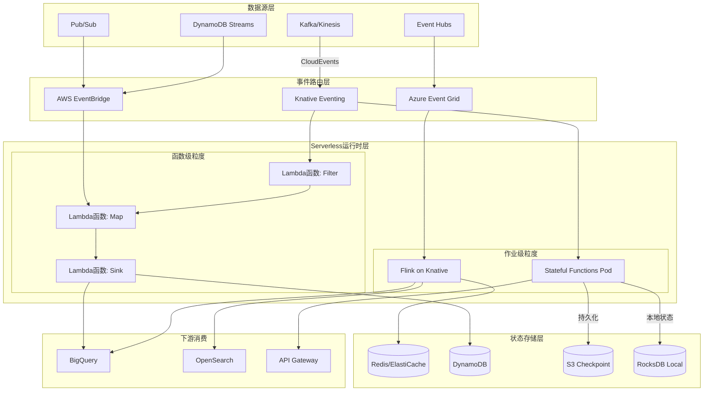
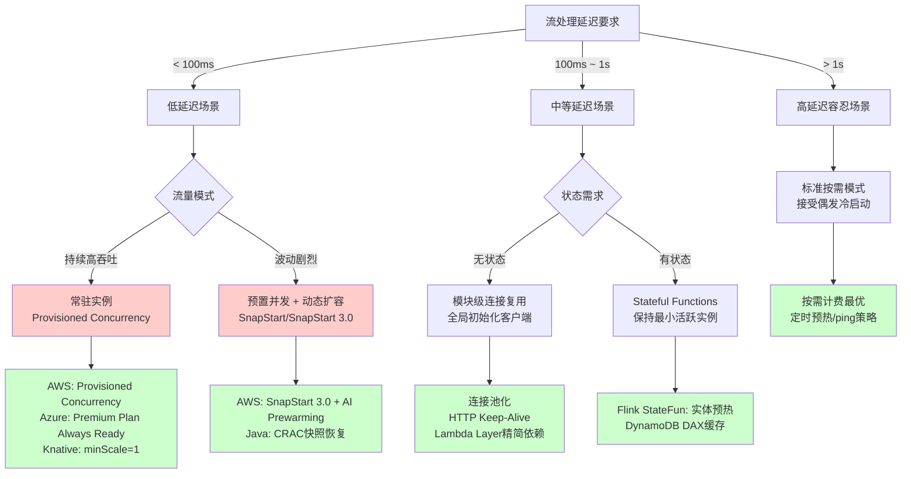
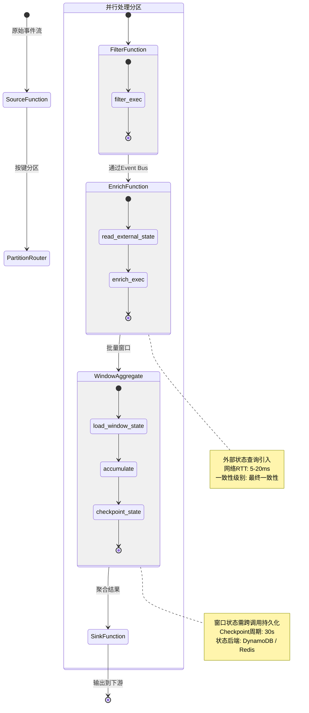

# 流处理算子与Serverless/FaaS集成

> 所属阶段: Knowledge/06-frontier | 前置依赖: [Flink运行时架构](../02-core/flink-runtime-architecture.md), [StateBackend设计](../02-core/statebackend-design.md) | 形式化等级: L4
> 最后更新: 2026-04-30

## 1. 概念定义 (Definitions)

**Def-FAAS-01-01** (Function-as-a-Service, FaaS). Function-as-a-Service是一种云计算执行模型，云提供商动态管理计算资源的分配，开发者只需部署独立的函数代码单元，按实际执行时间和资源消耗计费。典型代表包括AWS Lambda、Azure Functions、Google Cloud Functions。

**Def-FAAS-01-02** (事件驱动函数, Event-driven Functions). 事件驱动函数是指由外部事件触发执行的FaaS函数单元，事件源可以是消息队列（Kafka/SQS/Pub/Sub）、HTTP请求、数据库变更流（DynamoDB Streams/Debezium）或定时调度器。其执行语义可形式化为：

$$
\forall f \in \text{Functions}, \exists e \in \text{Events} : \text{trigger}(f) \iff \text{match}(e, \text{pattern}_f)
$$

其中 $\text{pattern}_f$ 定义了触发函数 $f$ 的事件模式。

**Def-FAAS-01-03** (Serverless流处理, Serverless Stream Processing). Serverless流处理是将流计算逻辑部署于Serverless运行时之上，利用FaaS的自动扩缩容能力处理无界数据流的计算范式。其核心特征包括：(a) 零服务器管理，(b) 事件级弹性伸缩，(c) 按调用付费，(d) 无状态执行假设。

**Def-FAAS-01-04** (函数冷启动, Function Cold Start). 函数冷启动指FaaS平台在函数长时间未被调用后，需要重新初始化执行环境（包括运行时加载、依赖初始化、网络连接建立）所带来的额外延迟。形式化定义为：

$$
\text{ColdStartLatency} = T_{\text{env-init}} + T_{\text{runtime-load}} + T_{\text{dependency-init}} + T_{\text{conn-establish}}
$$

**Def-FAAS-01-05** (算子级函数分解, Operator-level Function Decomposition). 将流处理作业中的每个逻辑算子（如Map、Filter、Aggregate、Join）映射为独立的Serverless函数，函数间通过事件总线或消息队列进行数据传递的架构模式。

**Def-FAAS-01-06** (有状态Serverless, Stateful Serverless). 突破传统FaaS无状态假设，允许函数在调用间保持状态或通过外部状态存储实现跨调用状态共享的Serverless计算模式。Apache Flink Stateful Functions、Azure Durable Functions属于此类框架。

## 2. 属性推导 (Properties)

**Lemma-FAAS-01-01** (事件粒度弹性下界). 设流处理系统的输入事件到达率为 $\lambda$（事件/秒），单个函数实例的处理能力为 $\mu$（事件/秒），则维持稳态所需的最小函数实例数为：

$$
N_{\min} = \left\lceil \frac{\lambda}{\mu} \right\rceil
$$

FaaS平台可在 $\Delta t_{\text{scale}} \approx 100\text{ms} \sim 10\text{s}$ 内完成从0到 $N_{\min}$ 的扩容，远快于传统容器编排（分钟级）。

**Lemma-FAAS-01-02** (冷启动延迟对吞吐率的影响). 设函数冷启动概率为 $p_c$，冷启动延迟为 $L_c$，暖启动处理延迟为 $L_w$，则有效平均处理延迟为：

$$
L_{\text{avg}} = p_c \cdot L_c + (1 - p_c) \cdot L_w
$$

对于实时流处理（要求端到端延迟 $< 1\text{s}$），若 $p_c > 0.1$ 且 $L_c > 5\text{s}$，则Serverless架构难以满足SLA。

**Lemma-FAAS-01-03** (函数间通信开销下界). 在算子级函数分解架构中，若相邻算子映射为独立函数并通过HTTP/gRPC通信，设单次网络往返延迟为 $R_{\text{net}}$，序列化/反序列化开销为 $S$，则每事件跨算子传递的额外开销至少为：

$$
O_{\text{comm}} = R_{\text{net}} + S \geq 2 \cdot T_{\text{RTT}} + S
$$

在同一数据中心内 $T_{\text{RTT}} \approx 0.5 \sim 2\text{ms}$，但跨可用区可达 $20 \sim 100\text{ms}$，显著高于Flink TaskManager间本地网络传输（$< 0.1\text{ms}$）。

**Prop-FAAS-01-01** (无状态假设与有状态流处理的本质冲突). 传统FaaS函数的无状态假设（$\forall t, \text{state}(f, t) = \emptyset$）与流处理算子的有状态需求（如窗口聚合需要维护 $\sum_{e \in w} e.\text{value}$）存在根本性矛盾。解决该矛盾需要引入外部状态存储或 Stateful Serverless 运行时。

## 3. 关系建立 (Relations)

### 3.1 事件驱动函数与流处理的映射关系

事件驱动函数与流处理算子之间存在多对多的映射关系：

| 维度 | 事件驱动函数 (FaaS) | 流处理算子 (Flink) |
|------|---------------------|-------------------|
| 触发粒度 | 单事件 / 微批次 | 连续数据流 / 事件时间窗口 |
| 执行模型 | 请求-响应 / 异步事件 | 持续运行 / 有界/无界流 |
| 状态管理 | 无状态（默认） | 本地状态（Keyed/Operator State） |
| 扩缩容单位 | 函数实例 | Task Slot / TaskManager |
| 容错机制 | 平台重试 / DLQ | Checkpoint / Savepoint |
| 延迟特性 | 冷启动可变延迟 | 亚秒级稳定延迟 |

### 3.2 Serverless流处理架构谱系

从控制流与数据流的耦合程度，Serverless流处理架构可分为三个层次：

1. **函数级（Function-level）**：每个算子对应独立函数（AWS Lambda + Kinesis），通过消息队列串联
2. **作业级（Job-level）**：整个流作业运行于Serverless容器（Knative Serving + Flink JobManager）
3. **混合级（Hybrid-level）**：有状态算子驻留Stateful Runtime，无状态算子卸载至FaaS（Flink Stateful Functions）

### 3.3 主要平台集成矩阵

| 平台 | Serverless运行时 | 流数据源 | 状态存储 | 集成模式 |
|------|------------------|----------|----------|----------|
| AWS | Lambda | Kinesis, MSK, DynamoDB Streams | DynamoDB, ElastiCache | 触发器/轮询 |
| Azure | Functions | Event Hubs, IoT Hub | Cosmos DB, Blob Storage | 绑定触发器 |
| GCP | Cloud Functions | Pub/Sub, Dataflow | Firestore, Bigtable | 原生集成 |
| K8s生态 | Knative | Kafka, NATS | Redis, Cassandra | Eventing桥接 |

## 4. 论证过程 (Argumentation)

### 4.1 有状态Serverless的核心挑战

传统FaaS架构假设函数是无状态的，每次调用都是独立的。然而流处理中的窗口聚合、会话分析、CEP模式匹配等核心算子本质上是有状态的。这一矛盾的解决路径包括：

**路径A：外部化状态（Externalized State）**
将状态存储于DynamoDB、Redis、Firestore等外部存储。优点是不依赖特定FaaS平台，缺点是引入网络RTT（通常 $5 \sim 20\text{ms}$）和一致性复杂性。

**路径B：Stateful Functions运行时**
Apache Flink Stateful Functions 提供了一种"有状态实体"抽象，每个实体具有唯一ID和持久化状态，函数调用通过消息路由到对应实体。其状态访问是本地的（与共置的StateBackend），避免了网络往返。

**路径C：Durable Functions / Durable Execution**
Azure Durable Functions 和 AWS Durable Functions（2026预览）提供了"持久执行"语义，允许函数在await点暂停、序列化状态、在后续事件中恢复。这适用于异步工作流，但对高吞吐流处理的支撑仍有限。

### 4.2 函数粒度 vs 作业粒度的权衡分析

将流作业分解为函数级粒度的利弊：

**优势**：

- 弹性更精细：瓶颈算子可独立扩容
- 多语言支持：每个函数可用不同语言实现
- 成本更优：非热点算子可按需缩容至零

**劣势**：

- 序列化开销：每个函数边界需序列化/反序列化事件
- 状态访问困难：窗口状态需在函数间同步
- 调试复杂度：分布式追踪必须贯穿函数链
- 语义完整性： exactly-once 保证难以在函数边界维持

**结论**：对于高吞吐（$> 10^4$ 事件/秒）、低延迟（$< 1\text{s}$）、有状态的流处理场景，作业级粒度（整个Flink作业运行于Serverless容器）优于函数级粒度。

## 5. 形式证明 / 工程论证 (Proof / Engineering Argument)

### 5.1 Serverless流处理成本模型

**Thm-FAAS-01-01** (Serverless流处理成本上界). 设流处理系统的事件到达率为 $\lambda$，每个事件的处理时间为 $t_p$，内存配置为 $M$，则AWS Lambda的月度处理成本上界为：

$$
C_{\text{monthly}} \leq \lambda \cdot t_p \cdot M \cdot c_{\text{GB-s}} \cdot T_{\text{month}} + N_{\text{warm}} \cdot c_{\text{provisioned}} \cdot T_{\text{month}}
$$

其中 $c_{\text{GB-s}}$ 为每GB-秒单价（约$0.0000166667），$N_{\text{warm}}$ 为预置并发实例数。当 $\lambda$ 波动剧烈（如日间10x峰值）时，Serverless的成本效益显著优于常驻集群。

**证明概要**：

1. Lambda按实际执行时间和内存配置计费，无请求时不产生费用
2. 常驻集群（EC2/K8s）需为峰值预配资源，低谷期产生闲置成本
3. 当峰值/谷值比 $> 5$ 时，Serverless的总拥有成本（TCO）低于常驻集群

### 5.2 冷启动延迟对实时性的约束

**Thm-FAAS-01-02** (冷启动约束定理). 对于要求端到端延迟不超过 $D_{\max}$ 的流处理管道，若函数链长度为 $k$，单次冷启动延迟为 $L_c$，暖调用延迟为 $L_w$，则允许的最大冷启动比例为：

$$
p_c \leq \frac{D_{\max} - k \cdot L_w}{k \cdot (L_c - L_w)}
$$

**推导**：
总延迟约束为 $k \cdot [p_c \cdot L_c + (1 - p_c) \cdot L_w] \leq D_{\max}$，整理即得上述不等式。

**实例**：设 $D_{\max} = 500\text{ms}$，$k = 5$，$L_w = 50\text{ms}$，$L_c = 2000\text{ms}$（Java函数），则：

$$
p_c \leq \frac{500 - 250}{5 \cdot 1950} = \frac{250}{9750} \approx 2.56\%
$$

即冷启动比例必须低于2.56%，这对突发流量场景构成严峻挑战。

## 6. 实例验证 (Examples)

### 6.1 Knative Eventing + Flink集成配置

以下示例展示如何使用Knative Eventing将Kafka事件路由至Flink Stateful Functions应用：

```yaml
# 1. KafkaSource: 从Kafka主题消费事件
apiVersion: sources.knative.dev/v1beta1
kind: KafkaSource
metadata:
  name: kafka-source-orders
  namespace: stream-processing
spec:
  consumerGroup: statefun-orders-consumer
  bootstrapServers:
    - kafka-cluster-kafka-bootstrap.kafka:9092
  topics:
    - orders-events
  sink:
    ref:
      apiVersion: serving.knative.dev/v1
      kind: Service
      name: statefun-orders-service

---
# 2. Knative Service: 运行Flink Stateful Functions模块
apiVersion: serving.knative.dev/v1
kind: Service
metadata:
  name: statefun-orders-service
  namespace: stream-processing
spec:
  template:
    metadata:
      annotations:
        autoscaling.knative.dev/minScale: "1"  # 保持至少1个实例避免冷启动
        autoscaling.knative.dev/maxScale: "50"
        autoscaling.knative.dev/targetConcurrency: "100"
    spec:
      containers:
        - image: myregistry/statefun-orders-module:v1.2.0
          ports:
            - containerPort: 8000
          env:
            - name: STATEFUL_FUNCTIONS_MODULE_NAME
              value: "orders-module"
            - name: FLINK_STATE_BACKEND
              value: "rocksdb"
            - name: FLINK_CHECKPOINT_DIR
              value: "s3://my-bucket/statefun-checkpoints"
          resources:
            requests:
              memory: "2Gi"
              cpu: "1000m"
            limits:
              memory: "4Gi"
              cpu: "2000m"

---
# 3. 状态存储配置 (Stateful Functions State Backend)
apiVersion: v1
kind: ConfigMap
metadata:
  name: statefun-state-config
  namespace: stream-processing
data:
  flink-conf.yaml: |
    state.backend: rocksdb
    state.backend.incremental: true
    state.checkpoints.dir: s3://my-bucket/statefun-checkpoints
    state.savepoints.dir: s3://my-bucket/statefun-savepoints
    execution.checkpointing.interval: 30s
    execution.checkpointing.min-pause-between-checkpoints: 10s
```

```java
// 4. Stateful Functions模块定义（Java）
public class OrderModule implements StatefulFunctionModule {
    @Override
    public void configure(Map<String, String> globalConfiguration, Binder binder) {
        // 注册函数类型与路由规则
        binder.bindFunctionProvider(
            FunctionType.of("orders", "order-aggregator"),
            new OrderAggregatorProvider()
        );

        // 从Kafka消息中提取目标函数地址
        binder.bindIngressRouter(
            KafkaIngressNames.ORDERS,
            new OrderRouter()
        );
    }
}

// 有状态函数实现
public class OrderAggregator implements StatefulFunction {
    @Persisted
    private final PersistedValue<OrderState> state = PersistedValue.of("order-state", OrderState.class);

    @Override
    public void invoke(Context context, Object input) {
        OrderEvent event = (OrderEvent) input;
        OrderState current = state.value();

        if (current == null) {
            current = new OrderState(event.getOrderId());
        }

        current.accumulate(event);
        state.update(current);

        // 当订单完成时向下游发送汇总结果
        if (current.isComplete()) {
            context.send(
                MessageBuilder.forAddress(FunctionType.of("orders", "order-sink"), event.getOrderId())
                    .withPayload(current.toSummary())
                    .build()
            );
        }
    }
}
```

### 6.2 AWS Lambda + Kinesis Data Streams无状态处理

```python
# Lambda函数处理Kinesis数据流（Python）
import json
import base64
import boto3
from aws_lambda_powertools import Logger, Tracer

logger = Logger()
tracer = Tracer()
dynamodb = boto3.resource('dynamodb')
metrics_table = dynamodb.Table('stream-metrics')

@logger.inject_lambda_context
@tracer.capture_lambda_handler
def lambda_handler(event, context):
    """
    处理Kinesis批量事件，执行轻量级过滤和转换。
    无状态设计：所有中间结果写入DynamoDB或发送至下游SNS。
    """
    processed = 0
    failed = 0

    for record in event['Records']:
        try:
            # Kinesis数据为Base64编码
            payload = base64.b64decode(record['kinesis']['data'])
            event_data = json.loads(payload)

            # 业务逻辑：过滤异常指标并写入DynamoDB
            if event_data.get('metric_value', 0) > 100:
                metrics_table.put_item(Item={
                    'metric_id': record['kinesis']['sequenceNumber'],
                    'timestamp': event_data['timestamp'],
                    'device_id': event_data['device_id'],
                    'value': event_data['metric_value'],
                    'alert_level': 'critical'
                })

            processed += 1

        except Exception as e:
            logger.error(f"Failed to process record: {e}")
            failed += 1

    logger.info(f"Batch complete: {processed} processed, {failed} failed")
    return {'processed': processed, 'failed': failed}
```

## 7. 可视化 (Visualizations)

### 7.1 Serverless流处理架构全景图

以下架构图展示了从数据源到Serverless处理再到状态存储的完整数据流：



### 7.2 冷启动优化策略决策树



### 7.3 函数编排与状态流转图

以下状态图展示了算子级函数分解中的事件路由和状态一致性挑战：



## 8. 引用参考 (References)
