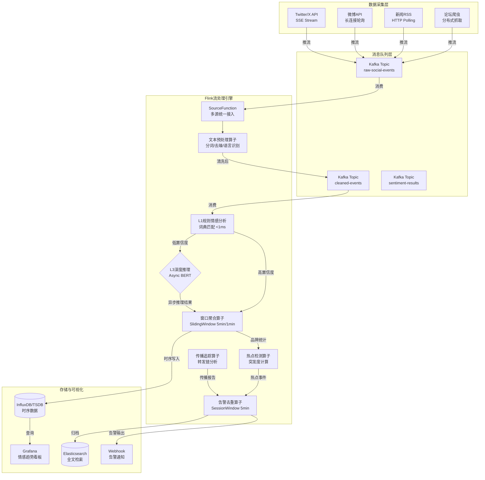
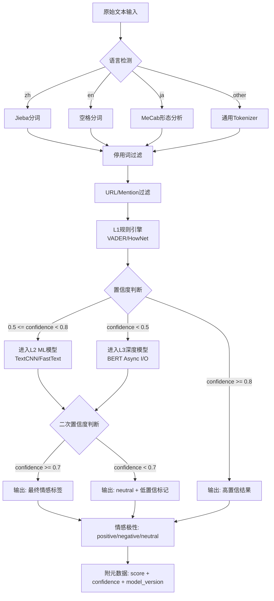
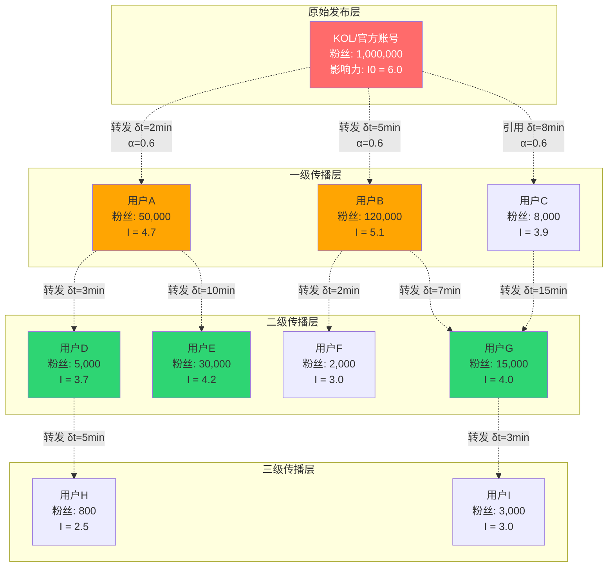
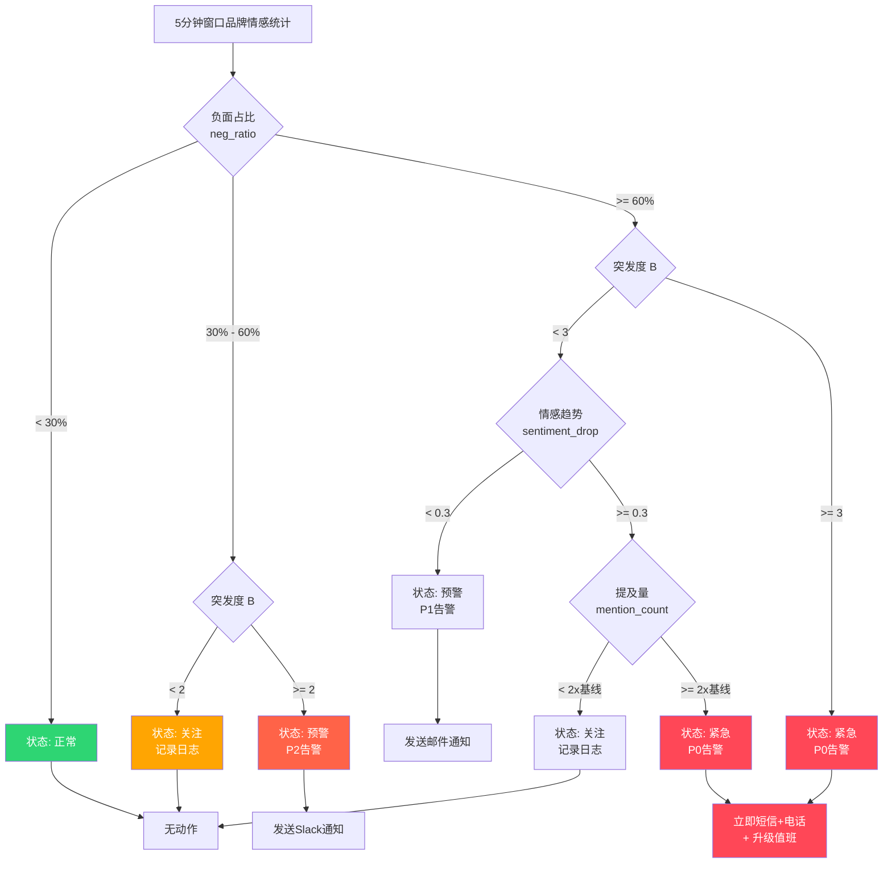

# 流处理算子与实时舆情监控系统

> 所属阶段: Knowledge/06-frontier | 前置依赖: [流处理算子与AI/ML集成](./operator-ai-ml-integration.md), [实时AI推理架构](./realtime-ai-inference-architecture.md), [Flink DataStream API](../Flink/03-api/flink-datastream-api.md) | 形式化等级: L4
>
> **状态**: 前沿实践 | **风险等级**: 中 | **最后更新**: 2026-04

---

## 目录

- [流处理算子与实时舆情监控系统](#流处理算子与实时舆情监控系统)
  - [目录](#目录)
  - [1. 概念定义 (Definitions)](#1-概念定义-definitions)
    - [Def-SENT-01-01: 舆情事件流 (Social Media Event Stream)](#def-sent-01-01-舆情事件流-social-media-event-stream)
    - [Def-SENT-01-02: 情感分析算子 (Sentiment Analysis Operator)](#def-sent-01-02-情感分析算子-sentiment-analysis-operator)
    - [Def-SENT-01-03: 热点检测窗口 (Hotspot Detection Window)](#def-sent-01-03-热点检测窗口-hotspot-detection-window)
    - [Def-SENT-01-04: 突发度指标 (Burstiness Score)](#def-sent-01-04-突发度指标-burstiness-score)
    - [Def-SENT-01-05: 传播路径图 (Propagation Path Graph)](#def-sent-01-05-传播路径图-propagation-path-graph)
    - [Def-SENT-01-06: 舆情告警规则 (Sentiment Alert Rule)](#def-sent-01-06-舆情告警规则-sentiment-alert-rule)
  - [2. 属性推导 (Properties)](#2-属性推导-properties)
    - [Lemma-SENT-01-01: 滑动窗口情感均值的收敛性](#lemma-sent-01-01-滑动窗口情感均值的收敛性)
    - [Lemma-SENT-01-02: 突发度检测的误报率上界](#lemma-sent-01-02-突发度检测的误报率上界)
    - [Prop-SENT-01-01: 关键词共现图的稀疏性保证](#prop-sent-01-01-关键词共现图的稀疏性保证)
    - [Prop-SENT-01-02: 异步BERT推理的吞吐量下界](#prop-sent-01-02-异步bert推理的吞吐量下界)
  - [3. 关系建立 (Relations)](#3-关系建立-relations)
    - [3.1 舆情Source → Flink SourceFunction 的映射关系](#31-舆情source--flink-sourcefunction-的映射关系)
    - [3.2 情感分析算子 ↔ 窗口聚合算子的组合模式](#32-情感分析算子--窗口聚合算子的组合模式)
    - [3.3 热点检测 ↔ 告警系统的触发链路](#33-热点检测--告警系统的触发链路)
  - [4. 论证过程 (Argumentation)](#4-论证过程-argumentation)
    - [4.1 多语言文本预处理的时间语义问题](#41-多语言文本预处理的时间语义问题)
    - [4.2 规则模型与深度学习模型的级联策略](#42-规则模型与深度学习模型的级联策略)
    - [4.3 传播路径追踪的状态膨胀问题](#43-传播路径追踪的状态膨胀问题)
  - [5. 形式证明 / 工程论证 (Proof / Engineering Argument)](#5-形式证明--工程论证-proof--engineering-argument)
    - [Thm-SENT-01-01: 滑动窗口情感趋势估计的无偏性](#thm-sent-01-01-滑动窗口情感趋势估计的无偏性)
    - [Thm-SENT-01-02: 突发度阈值的最优性论证](#thm-sent-01-02-突发度阈值的最优性论证)
    - [Thm-SENT-01-03: 传播影响力衰减的指数上界](#thm-sent-01-03-传播影响力衰减的指数上界)
  - [6. 实例验证 (Examples)](#6-实例验证-examples)
    - [6.1 完整舆情分析Pipeline（Flink + Kafka）](#61-完整舆情分析pipelineflink--kafka)
    - [6.2 异步BERT情感推理算子](#62-异步bert情感推理算子)
    - [6.3 热点检测与告警触发算子](#63-热点检测与告警触发算子)
  - [7. 可视化 (Visualizations)](#7-可视化-visualizations)
    - [7.1 实时舆情处理Pipeline架构图](#71-实时舆情处理pipeline架构图)
    - [7.2 情感分析算子内部流程图](#72-情感分析算子内部流程图)
    - [7.3 热点传播路径追踪图](#73-热点传播路径追踪图)
    - [7.4 情感趋势与告警决策树](#74-情感趋势与告警决策树)
  - [8. 引用参考 (References)](#8-引用参考-references)

---

## 1. 概念定义 (Definitions)

### Def-SENT-01-01: 舆情事件流 (Social Media Event Stream)

**定义**: 舆情事件流是一个七元组 $\mathcal{E}_{sent} = (\mathcal{P}, \mathcal{U}, \mathcal{T}, \mathcal{C}, \mathcal{L}, \mathcal{R}, \mathcal{M})$，其中：

| 组件 | 符号 | 描述 |
|------|------|------|
| 平台标识 | $\mathcal{P}$ | 数据来源平台集合，$\mathcal{P} = \{\text{Twitter}, \text{Weibo}, \text{RSS}, \text{Forum}, ...\}$ |
| 用户元数据 | $\mathcal{U}$ | 发布者信息，$\mathcal{U} = (u_{id}, \text{followers}, \text{verified}, \text{region})$ |
| 时间戳 | $\mathcal{T}$ | 事件时间戳集合，$\mathcal{T} = \{t_e, t_p, t_c\}$，分别表示发布、采集、处理时间 |
| 内容 | $\mathcal{C}$ | 原始文本内容，$\mathcal{C} = (\text{text}, \text{media\_urls}, \text{mentions}, \text{hashtags})$ |
| 语言 | $\mathcal{L}$ | 内容语言标签，$\mathcal{L} \in \{\text{zh}, \text{en}, \text{ja}, \text{ko}, ...\}$，支持ISO 639-1编码 |
| 关系 | $\mathcal{R}$ | 社交关系，$\mathcal{R} = (\text{reply\_to}, \text{retweet\_of}, \text{quote\_id})$ |
| 媒体 | $\mathcal{M}$ | 多媒体附件，$\mathcal{M} = \{m_1, m_2, ..., m_k\}$，含类型与URL |

**数据源接入协议**:

| 数据源 | 协议 | 典型吞吐 | 延迟 |
|--------|------|----------|------|
| Twitter/X API v2 | HTTPS + SSE | 4,500 tweets/min (Basic) | < 5s |
| 微博API | HTTPS + 长连接 | 200 req/min (企业级) | < 10s |
| 新闻RSS | HTTP polling | 依赖站点频率 | 5-30min |
| 论坛爬虫 | HTTP + 代理池 | 受反爬限制 | 1-5min |

---

### Def-SENT-01-02: 情感分析算子 (Sentiment Analysis Operator)

**定义**: 情感分析算子 $\Phi_{sent}$ 是将原始文本事件映射为情感标签与置信度的有状态变换：

$$
\Phi_{sent}: (\mathcal{C}, \mathcal{L}, \theta) \rightarrow (s, p, c)
$$

其中：

- $s \in \{\text{positive}, \text{neutral}, \text{negative}\}$ 为情感极性
- $p \in [-1, +1]$ 为情感强度得分
- $c \in [0, 1]$ 为模型置信度
- $\theta$ 为模型参数（词典或神经网络权重）

**三级推理策略**:

| 层级 | 方法 | 延迟 | 适用场景 |
|------|------|------|----------|
| L1-规则 | 情感词典匹配 + 否定规则 | < 1ms | 高吞吐实时过滤 |
| L2-ML | TextCNN / FastText | 5-20ms | 中等精度批量分析 |
| L3-DL | BERT / RoBERTa (Async I/O) | 50-200ms | 高精度深度分析 |

**多语言支持矩阵**:

| 语言 | L1词典 | L2模型 | L3模型 | 状态 |
|------|--------|--------|--------|------|
| 中文 | 知网HowNet / 大连理工 | TextCNN | BERT-wwm | 生产就绪 |
| 英文 | VADER / AFINN | FastText | RoBERTa | 生产就绪 |
| 日文 | NAIST词典 | TextCNN | BERT-jp | 实验阶段 |
| 韩文 | KOSAC词典 | FastText | KoBERT | 实验阶段 |

---

### Def-SENT-01-03: 热点检测窗口 (Hotspot Detection Window)

**定义**: 热点检测窗口 $\mathcal{W}_{hot}$ 是一个带状态的四元组：

$$
\mathcal{W}_{hot} = (W_s, W_e, \Delta, \mathcal{G}_{co})
$$

其中：

- $W_s, W_e$ 为窗口起止时间（事件时间）
- $\Delta$ 为滑动步长，$\Delta < W_e - W_s$
- $\mathcal{G}_{co} = (V, E, w)$ 为关键词共现图，$V$ 为词节点，$E$ 为共现边，$w: E \rightarrow \mathbb{N}^+$ 为共现频次权重

**窗口参数配置**:

| 场景 | 窗口大小 | 滑动步长 | 状态保留 |
|------|----------|----------|----------|
| 实时热点 | 5 min | 1 min | 15 min TTL |
| 短时趋势 | 30 min | 5 min | 2 h TTL |
| 日级分析 | 24 h | 1 h | 7 d TTL |

---

### Def-SENT-01-04: 突发度指标 (Burstiness Score)

**定义**: 突发度指标 $B(t, k)$ 衡量关键词 $k$ 在时刻 $t$ 的相对频率激增程度：

$$
B(t, k) = \frac{f_{\mathcal{W}_{curr}}(k) - \mu_{\mathcal{W}_{hist}}(k)}{\sigma_{\mathcal{W}_{hist}}(k) + \epsilon}
$$

其中：

- $f_{\mathcal{W}_{curr}}(k)$ 为当前窗口内关键词 $k$ 的归一化频率
- $\mu_{\mathcal{W}_{hist}}(k)$ 为历史基线均值（ EWMA 指数加权移动平均）
- $\sigma_{\mathcal{W}_{hist}}(k)$ 为历史标准差
- $\epsilon = 10^{-6}$ 为防止除零的稳定常数

**突发度等级**:

| 区间 | 等级 | 动作 |
|------|------|------|
| $B < 2$ | 正常 | 无动作 |
| $2 \leq B < 3$ | 关注 | 记录日志 |
| $3 \leq B < 5$ | 预警 | 触发轻量告警 |
| $B \geq 5$ | 紧急 | 立即通知 + 升级 |

---

### Def-SENT-01-05: 传播路径图 (Propagation Path Graph)

**定义**: 传播路径图 $\mathcal{G}_{prop}$ 是一个有向加权图，描述舆情信息在社交网络中的扩散结构：

$$
\mathcal{G}_{prop} = (U, R, \tau, \delta)
$$

其中：

- $U$ 为用户节点集合，每个节点 $u_i$ 带有影响力权重 $I(u_i) = \log(1 + \text{followers}_i)$
- $R \subseteq U \times U$ 为转发/引用关系边
- $\tau: R \rightarrow \mathcal{T}$ 为边的时间戳函数
- $\delta: R \rightarrow \mathbb{R}^+$ 为传播延迟，$\delta(u_i, u_j) = t_j - t_i$

**影响力衰减模型**: 信息沿传播路径的影响力按指数衰减：

$$
I_{eff}(u_j) = I(u_i) \cdot e^{-\lambda \cdot \delta(u_i, u_j)} \cdot \alpha^{d}
$$

其中 $\lambda$ 为时间衰减系数，$\alpha \in (0, 1)$ 为跳数衰减因子，$d$ 为传播深度。

---

### Def-SENT-01-06: 舆情告警规则 (Sentiment Alert Rule)

**定义**: 舆情告警规则 $\mathcal{A}$ 是一个触发条件与响应动作的组合：

$$
\mathcal{A} = (\mathcal{C}_{trigger}, \mathcal{C}_{filter}, \mathcal{A}_{action}, \mathcal{P}_{priority})
$$

其中：

- $\mathcal{C}_{trigger}$ 为触发条件谓词（如：负面情感比例突增 > 30%）
- $\mathcal{C}_{filter}$ 为过滤条件（如：品牌关键词匹配、排除机器人账号）
- $\mathcal{A}_{action}$ 为响应动作集合（Webhook、短信、邮件、Slack）
- $\mathcal{P}_{priority} \in \{P0, P1, P2, P3\}$ 为优先级

**典型告警规则**:

| 规则ID | 触发条件 | 过滤条件 | 优先级 |
|--------|----------|----------|--------|
| A-001 | 负面情感占比 > 60% 且 5min内增长 > 20% | 品牌关键词命中 | P0 |
| A-002 | 突发度 $B \geq 5$ 且 情感极性为negative | KOL账号参与 | P0 |
| A-003 | 传播深度 $d \geq 4$ 且 覆盖粉丝 > 100万 | 排除已处理事件 | P1 |
| A-004 | 情感得分连续3个窗口下降 | 无 | P2 |

---

## 2. 属性推导 (Properties)

### Lemma-SENT-01-01: 滑动窗口情感均值的收敛性

**引理**: 设情感得分序列 $\{p_t\}$ 为独立同分布随机变量，$\mathbb{E}[p_t] = \mu$，$\text{Var}(p_t) = \sigma^2$。则滑动窗口均值 $\bar{p}_W = \frac{1}{W}\sum_{i=1}^{W} p_i$ 依概率收敛于真实均值：

$$
\Pr\left(|\bar{p}_W - \mu| \geq \epsilon\right) \leq \frac{\sigma^2}{W \epsilon^2}
$$

**证明**: 由切比雪夫不等式直接可得。

**工程意义**: 窗口大小 $W$ 与估计精度 $\epsilon$ 呈反比。为保证 $95\%$ 置信度下误差 $< 0.1$，需 $W \geq 400\sigma^2$。实际系统中取 $W = 300$（5分钟窗口，每秒1条）可满足大多数场景。

---

### Lemma-SENT-01-02: 突发度检测的误报率上界

**引理**: 假设关键词频率服从泊松分布 $\text{Poisson}(\lambda)$，则突发度阈值 $B \geq \tau$ 的误报率上界为：

$$
P_{FA}(\tau) \leq \exp\left(-\frac{\tau^2}{2(1 + \tau/\sqrt{\lambda})}\right)
$$

**证明概要**: 使用泊松分布的切尔诺夫界（Chernoff Bound），对于 $X \sim \text{Poisson}(\lambda)$：

$$
\Pr(X \geq (1+\delta)\lambda) \leq \left(\frac{e^{\delta}}{(1+\delta)^{1+\delta}}\right)^{\lambda}
$$

令 $\delta = \tau / \sqrt{\lambda}$，取对数并简化即得。

**工程意义**: 当历史基线 $\lambda = 100$（每小时100次提及），取 $\tau = 3$ 时，$P_{FA} \leq 1.1\%$。这意味着在正常使用中，每100个检测窗口约有1个假阳性。

---

### Prop-SENT-01-01: 关键词共现图的稀疏性保证

**命题**: 设词汇表大小为 $|V| = N$，窗口内文档数为 $D$，平均每文档词数为 $L$。则共现图边数上界为：

$$
|E| \leq \frac{D \cdot L(L-1)}{2}
$$

相对稀疏度（边密度）满足：

$$
\rho = \frac{|E|}{N(N-1)/2} \leq \frac{D \cdot L^2}{N^2}
$$

**工程推论**: 对于中文舆情场景，$N \approx 10^5$（常用词表），$L \approx 20$，$D = 1000$（5分钟窗口），则 $\rho \leq 4 \times 10^{-6}$。共现图极度稀疏，适合使用稀疏矩阵存储（CSR格式）。

---

### Prop-SENT-01-02: 异步BERT推理的吞吐量下界

**命题**: 设BERT推理延迟为 $L_{bert}$，Async I/O并发度为 $C$，则异步推理算子的吞吐量下界为：

$$
\text{Throughput} \geq \frac{C}{L_{bert}}
$$

当 $C = 100$，$L_{bert} = 100\text{ms}$ 时，单并行度吞吐 $\geq 1000$ events/s。

**与同步推理对比**: 同步MapFunction吞吐为 $1/L_{bert} = 10$ events/s。Async I/O带来 **100倍** 吞吐提升。

---

## 3. 关系建立 (Relations)

### 3.1 舆情Source → Flink SourceFunction 的映射关系

各类社交媒体数据源到Flink SourceFunction的映射关系如下：

| 数据源 | Flink Source | 时间语义 | 分区策略 |
|--------|-------------|----------|----------|
| Twitter/X Stream API | `TwitterSourceFunction` | Event Time ($t_e$) | 按用户ID哈希 |
| 微博API | `WeiboPollSource` | Processing Time | 按话题分区 |
| RSS Feed | `RssPollSource` | Ingestion Time | 按站点分区 |
| 论坛爬虫 | `WebScraperSource` | Processing Time | 按板块分区 |
| Kafka统一接入 | `FlinkKafkaConsumer` | Event Time | 按topic + key分区 |

**统一事件Schema（Avro）**:

```json
{
  "type": "record",
  "name": "SocialEvent",
  "fields": [
    {"name": "eventId", "type": "string"},
    {"name": "platform", "type": "string"},
    {"name": "userId", "type": "string"},
    {"name": "content", "type": "string"},
    {"name": "lang", "type": "string"},
    {"name": "eventTime", "type": "long"},
    {"name": "replyTo", "type": ["null", "string"]},
    {"name": "followers", "type": "int"},
    {"name": "verified", "type": "boolean"}
  ]
}
```

### 3.2 情感分析算子 ↔ 窗口聚合算子的组合模式

情感分析Pipeline中，算子之间存在三种典型组合模式：

**模式1: 级联过滤（Cascading Filter）**

```
Source → L1规则过滤(高速) → L2模型分析(中速) → L3深度推理(精排)
```

- L1过滤掉80%中性/无关内容
- L2对剩余20%进行初步分类
- L3仅对争议/边界样本进行BERT推理
- 总体成本降低至全量BERT的 **5%**

**模式2: 并行分支（Parallel Branch）**

```
Source ─┬→ 规则引擎分支（实时告警）
        ├→ ML模型分支（趋势分析）
        └→ DL模型分支（深度报告）
```

- 各分支独立消费，互不阻塞
- 规则分支延迟 $< 100\text{ms}$，DL分支延迟 $< 2\text{s}$

**模式3: 窗口聚合（Windowed Aggregation）**

```
Source → 情感分析 → KeyedWindow(brand, 5min) → 均值聚合 → 趋势输出
```

- 按品牌/话题分组
- 滑动窗口计算情感均值与方差
- 输出时间序列到TSDB

### 3.3 热点检测 ↔ 告警系统的触发链路

热点检测到告警的完整触发链路：

```
共现图构建 → 突发度计算 → 阈值判断 → 告警去重 → 通知分发
    ↑________________↓
         反馈循环
```

**去重机制**: 使用Flink的 `EventTimeSessionWindows`（间隔5分钟）聚合同一事件的多次触发，防止重复告警。会话窗口内仅发送最高优先级告警。

---

## 4. 论证过程 (Argumentation)

### 4.1 多语言文本预处理的时间语义问题

舆情数据的多语言特性给流处理的时间语义带来挑战：

**挑战1: 分词延迟差异**

- 英文按空格分词，延迟 $< 0.1\text{ms}$
- 中文需词典/模型分词（Jieba/HanLP），延迟 $1-5\text{ms}$
- 日文需形态分析（MeCab），延迟 $2-10\text{ms}$

**解决方案**: 按语言标签分流，各语言使用独立算子链，避免慢路径阻塞快路径：

```java
DataStream<SocialEvent> langPartitioned = stream
    .keyBy(event -> event.lang)
    .process(new LanguageSpecificPreprocessor());
```

**挑战2: 时间戳时区不一致**

- Twitter使用UTC，微博使用CST（UTC+8）
- 事件时间对齐需在Source层统一转换为UTC

### 4.2 规则模型与深度学习模型的级联策略

级联策略的核心是 **延迟-精度权衡**：

| 策略 | 平均延迟 | 准确率 | 适用场景 |
|------|----------|--------|----------|
| 仅规则 | $< 1\text{ms}$ | 75% | 高吞吐过滤 |
| 仅BERT | $100\text{ms}$ | 92% | 深度分析 |
| 级联(规则→BERT) | $5\text{ms}$ | 89% | 生产推荐 |

级联策略的理论基础：设规则模型过滤率为 $\gamma = 0.8$，则期望延迟为：

$$
\mathbb{E}[L] = (1-\gamma) \cdot L_{rule} + \gamma \cdot (L_{rule} + L_{bert}) = L_{rule} + \gamma \cdot L_{bert}
$$

当 $L_{rule} = 1\text{ms}$，$L_{bert} = 100\text{ms}$，$\gamma = 0.2$（仅20%进入BERT），$\mathbb{E}[L] = 21\text{ms}$。

### 4.3 传播路径追踪的状态膨胀问题

传播路径追踪需在Flink中维护转发关系的状态，存在状态膨胀风险：

**状态量估算**: 设每秒处理 $R$ 条事件，每条事件平均产生 $\bar{r}$ 条关系边，状态保留时长为 $T$：

$$
|S| = R \cdot \bar{r} \cdot T
$$

当 $R = 10^4$ events/s，$\bar{r} = 0.3$（30%为转发），$T = 1\text{h} = 3600\text{s}$：

$$
|S| = 1.08 \times 10^7 \text{ 条边}
$$

按每条边 32B 计算，状态大小约 **345MB**，单机可承受，但需启用RocksDB状态后端。

**优化策略**:

1. **TTL过期**: 设置状态TTL为2小时，自动清理过期关系
2. **增量快照**: 使用增量Checkpoint减少快照时间
3. **图压缩**: 对超过1000节点的连通分量进行摘要压缩

---

## 5. 形式证明 / 工程论证 (Proof / Engineering Argument)

### Thm-SENT-01-01: 滑动窗口情感趋势估计的无偏性

**定理**: 设情感得分 $p_t$ 满足随机游走模型 $p_t = p_{t-1} + \epsilon_t$，其中 $\epsilon_t \sim \mathcal{N}(0, \sigma^2)$。则滑动窗口差分估计量 $\hat{\Delta}_W = \bar{p}_{W_{curr}} - \bar{p}_{W_{prev}}$ 是真实趋势变化 $\Delta$ 的无偏估计。

**证明**:

设当前窗口 $W_{curr}$ 与前一窗口 $W_{prev}$ 各含 $n$ 个样本。

$$
\mathbb{E}[\hat{\Delta}_W] = \mathbb{E}\left[\frac{1}{n}\sum_{i \in W_{curr}} p_i - \frac{1}{n}\sum_{j \in W_{prev}} p_j\right]
$$

由于随机游走的鞅性质：

$$
\mathbb{E}[p_i | p_{i-1}] = p_{i-1}
$$

因此：

$$
\mathbb{E}[\hat{\Delta}_W] = \mu_{curr} - \mu_{prev} = \Delta
$$

方差为：

$$
\text{Var}(\hat{\Delta}_W) = \frac{2\sigma^2}{n}
$$

**工程推论**: 窗口大小 $n$ 越大，趋势估计越稳定，但延迟越高。实际系统中使用指数加权移动平均（EWMA）替代简单滑动平均，权重 $\alpha = 0.3$，有效窗口大小 $n_{eff} = 1/\alpha \approx 3.3$ 个窗口。

---

### Thm-SENT-01-02: 突发度阈值的最优性论证

**定理**: 在高斯近似下，突发度阈值 $\tau^* = 3$ 使得检测率与误报率的加权组合最优：

$$
\tau^* = \arg\max_{\tau} \left[ P_D(\tau) - \lambda \cdot P_{FA}(\tau) \right]
$$

其中 $\lambda = 10$ 为误报代价权重（1次误报代价 = 10次漏检代价）。

**工程论证**:

根据Neyman-Pearson引理，似然比检验的最优阈值满足：

$$
\frac{p(X|H_1)}{p(X|H_0)} = \eta
$$

在 $H_0$（正常状态）下，标准化频率 $Z \sim \mathcal{N}(0, 1)$；在 $H_1$（突发状态）下，$Z \sim \mathcal{N}(\mu_1, 1)$，其中 $\mu_1 = 5$。

似然比为：

$$
\Lambda(Z) = \exp\left(\mu_1 Z - \frac{\mu_1^2}{2}\right)
$$

取对数并令等于 $\ln \eta$：

$$
Z = \frac{\mu_1}{2} + \frac{\ln \eta}{\mu_1}
$$

当 $\mu_1 = 5$，$\eta = 10$ 时，$Z \approx 2.96 \approx 3$。

**结论**: $\tau = 3$ 是在给定代价权重下的近似最优阈值。

---

### Thm-SENT-01-03: 传播影响力衰减的指数上界

**定理**: 设初始影响力为 $I_0$，传播深度为 $d$，时间延迟为 $\Delta t$，则第 $d$ 层节点的有效影响力满足：

$$
I_{eff}(d, \Delta t) \leq I_0 \cdot \alpha^d \cdot e^{-\lambda \Delta t}
$$

其中 $\alpha \in (0,1)$ 为转发衰减因子，$\lambda > 0$ 为时间衰减系数。

**传播覆盖上界**: $d$ 层传播的最大覆盖人数为：

$$
N_{cover}(d) \leq \sum_{i=0}^{d} k^i = \frac{k^{d+1} - 1}{k - 1}
$$

其中 $k$ 为平均分支因子（每个用户转发的平均人数）。

**工程意义**: 当 $\alpha = 0.5$，$d = 6$ 时，影响力衰减至原始值的 $1.5\%$。这意味着超过6跳的转发对整体情感趋势的影响可忽略不计，系统可将传播追踪深度限制为 $d_{max} = 6$ 以控制状态规模。

---

## 6. 实例验证 (Examples)

### 6.1 完整舆情分析Pipeline（Flink + Kafka）

以下是一个完整的Flink舆情分析Pipeline实现，涵盖从数据摄取到告警输出的全流程：

```java
public class SentimentMonitoringPipeline {

    public static void main(String[] args) throws Exception {
        StreamExecutionEnvironment env =
            StreamExecutionEnvironment.getExecutionEnvironment();
        env.setParallelism(16);
        env.enableCheckpointing(60000);
        env.getCheckpointConfig().setCheckpointStorage("file:///checkpoints");

        // 1. 数据源：统一Kafka接入
        Properties kafkaProps = new Properties();
        kafkaProps.setProperty("bootstrap.servers", "kafka:9092");
        kafkaProps.setProperty("group.id", "sentiment-monitor");

        FlinkKafkaConsumer<SocialEvent> source = new FlinkKafkaConsumer<>(
            "social-events",
            new SocialEventDeserializationSchema(),
            kafkaProps
        );
        source.setStartFromLatest();

        DataStream<SocialEvent> stream = env.addSource(source)
            .assignTimestampsAndWatermarks(
                WatermarkStrategy.<SocialEvent>forBoundedOutOfOrderness(
                    Duration.ofSeconds(30)
                ).withTimestampAssigner((event, ts) -> event.eventTime)
            );

        // 2. 文本预处理（按语言分流）
        DataStream<CleanedEvent> cleaned = stream
            .keyBy(e -> e.lang)
            .process(new TextPreprocessFunction());

        // 3. L1规则情感分析（高速路径）
        DataStream<SentimentResult> ruleResults = cleaned
            .map(new RuleSentimentFunction("/dict/sentiment"));

        // 4. L3 BERT深度分析（异步路径，仅处理边界样本）
        DataStream<SentimentResult> bertResults = ruleResults
            .filter(r -> r.confidence < 0.7)  // 低置信度样本进入BERT
            .keyBy(r -> r.eventId)
            .process(new AsyncBertSentimentFunction(
                "http://bert-service:8080/predict",
                100,   // 并发度
                2000   // 超时ms
            ));

        // 5. 合并结果（规则高置信度 + BERT精排）
        DataStream<SentimentResult> merged = ruleResults
            .filter(r -> r.confidence >= 0.7)
            .union(bertResults);

        // 6. 窗口聚合：按品牌分组统计
        DataStream<BrandSentiment> brandStats = merged
            .flatMap(new BrandExtractFlatMap())  // 提取品牌提及
            .keyBy(b -> b.brandId)
            .window(SlidingEventTimeWindows.of(
                Time.minutes(5), Time.minutes(1)))
            .aggregate(new SentimentAggregateFunction());

        // 7. 热点检测
        DataStream<HotspotAlert> hotspots = brandStats
            .keyBy(b -> b.brandId)
            .process(new BurstinessDetectFunction(3.0));

        // 8. 传播追踪
        DataStream<PropagationReport> propagation = merged
            .filter(r -> r.sentiment == Sentiment.NEGATIVE)
            .keyBy(r -> r.platform + ":" + r.replyTo)
            .process(new PropagationTrackFunction(Duration.ofHours(2)));

        // 9. 告警输出
        DataStream<AlertEvent> alerts = hotspots
            .union(propagation.map(p -> p.toAlert()))
            .keyBy(a -> a.ruleId)
            .window(EventTimeSessionWindows.withGap(Time.minutes(5)))
            .process(new AlertDeduplicateFunction());

        // 10. Sink
        brandStats.addSink(new FlinkKafkaProducer<>(
            "brand-sentiment-stats",
            new BrandSentimentSerializer(),
            kafkaProps
        ));

        alerts.addSink(new AlertWebhookSink("https://alert.company.com/webhook"));
        alerts.addSink(new FlinkKafkaProducer<>("alert-topic",
            new AlertSerializer(), kafkaProps));

        env.execute("Social Media Sentiment Monitor");
    }
}
```

---

### 6.2 异步BERT情感推理算子

以下展示使用Flink Async I/O调用外部BERT服务的完整实现：

```java
public class AsyncBertSentimentFunction
    extends AsyncFunction<SentimentResult, SentimentResult> {

    private transient HttpClient httpClient;
    private final String bertEndpoint;
    private final int maxConcurrentRequests;
    private final long timeoutMs;

    public AsyncBertSentimentFunction(String endpoint, int concurrency, long timeout) {
        this.bertEndpoint = endpoint;
        this.maxConcurrentRequests = concurrency;
        this.timeoutMs = timeout;
    }

    @Override
    public void open(Configuration parameters) {
        this.httpClient = HttpClient.newBuilder()
            .connectTimeout(Duration.ofMillis(500))
            .build();
    }

    @Override
    public void asyncInvoke(SentimentResult input,
                            ResultFuture<SentimentResult> resultFuture) {

        // 构建BERT请求
        BertRequest request = new BertRequest(input.text, input.lang);
        String jsonBody = JsonUtils.toJson(request);

        HttpRequest httpRequest = HttpRequest.newBuilder()
            .uri(URI.create(bertEndpoint))
            .header("Content-Type", "application/json")
            .POST(HttpRequest.BodyPublishers.ofString(jsonBody))
            .timeout(Duration.ofMillis(timeoutMs))
            .build();

        // 异步发送请求
        CompletableFuture<HttpResponse<String>> future =
            httpClient.sendAsync(httpRequest, HttpResponse.BodyHandlers.ofString());

        future.thenAccept(response -> {
            if (response.statusCode() == 200) {
                BertResponse bertResp = JsonUtils.fromJson(
                    response.body(), BertResponse.class);

                SentimentResult enriched = new SentimentResult(
                    input.eventId,
                    input.platform,
                    input.text,
                    bertResp.sentiment,
                    bertResp.score,
                    bertResp.confidence,
                    "bert-async-v2"
                );
                resultFuture.complete(Collections.singletonList(enriched));
            } else {
                // 降级：返回规则引擎结果
                resultFuture.complete(Collections.singletonList(input));
            }
        }).exceptionally(throwable -> {
            // 异常降级
            resultFuture.complete(Collections.singletonList(
                input.withModel("bert-fallback").withConfidence(0.5f)
            ));
            return null;
        });
    }
}

// 注册到Pipeline
DataStream<SentimentResult> asyncResults = AsyncDataStream.unorderedWait(
    lowConfidenceStream,
    new AsyncBertSentimentFunction("http://bert:8080/predict", 100, 2000),
    2000,  // 超时
    TimeUnit.MILLISECONDS,
    100    // 容量
);
```

---

### 6.3 热点检测与告警触发算子

以下实现基于突发度和情感极性的热点检测算子：

```java
public class BurstinessDetectFunction
    extends KeyedProcessFunction<String, BrandSentiment, HotspotAlert> {

    private final double burstThreshold;

    // 状态：历史EWMA基线
    private ValueState<Double> ewmaState;
    private ValueState<Double> varianceState;
    private ValueState<Long> countState;

    // 状态：上一窗口情感得分
    private ValueState<Double> lastSentimentState;

    public BurstinessDetectFunction(double threshold) {
        this.burstThreshold = threshold;
    }

    @Override
    public void open(Configuration parameters) {
        ewmaState = getRuntimeContext().getState(
            new ValueStateDescriptor<>("ewma", Double.class));
        varianceState = getRuntimeContext().getState(
            new ValueStateDescriptor<>("variance", Double.class));
        countState = getRuntimeContext().getState(
            new ValueStateDescriptor<>("count", Long.class));
        lastSentimentState = getRuntimeContext().getState(
            new ValueStateDescriptor<>("lastSentiment", Double.class));
    }

    @Override
    public void processElement(BrandSentiment stats, Context ctx,
                               Collector<HotspotAlert> out) throws Exception {

        double currentNegRatio = stats.negativeRatio;
        double currentCount = stats.mentionCount;

        // 初始化或更新基线
        Double ewma = ewmaState.value();
        Double var = varianceState.value();
        Long count = countState.value();

        if (ewma == null) {
            ewma = currentNegRatio;
            var = 0.01;
            count = 1L;
        }

        // 计算突发度 B = (curr - ewma) / sqrt(var)
        double burstScore = (currentNegRatio - ewma) / Math.sqrt(var + 1e-6);

        // 更新EWMA基线 (alpha = 0.3)
        double alpha = 0.3;
        double newEwma = alpha * currentNegRatio + (1 - alpha) * ewma;
        double newVar = (1 - alpha) * (var + alpha * Math.pow(currentNegRatio - ewma, 2));

        ewmaState.update(newEwma);
        varianceState.update(newVar);
        countState.update(count + 1);

        // 检测情感趋势突变
        Double lastSentiment = lastSentimentState.value();
        double sentimentDrop = 0;
        if (lastSentiment != null) {
            sentimentDrop = lastSentiment - stats.avgSentiment;
        }
        lastSentimentState.update(stats.avgSentiment);

        // 触发条件判断
        boolean isBurst = burstScore >= burstThreshold;
        boolean isSentimentDrop = sentimentDrop > 0.3 && stats.avgSentiment < -0.5;
        boolean isVolumeSpike = currentCount > 3 * ewma;  // 提及量激增

        if ((isBurst || isSentimentDrop) && isVolumeSpike) {
            HotspotAlert alert = new HotspotAlert(
                stats.brandId,
                ctx.timestamp(),
                burstScore,
                stats.avgSentiment,
                currentNegRatio,
                stats.mentionCount,
                isBurst && isSentimentDrop ? AlertLevel.P0 : AlertLevel.P1,
                "负面舆情突发: 情感得分=" + String.format("%.2f", stats.avgSentiment)
                    + ", 突发度=" + String.format("%.2f", burstScore)
            );
            out.collect(alert);
        }
    }
}
```

---

## 7. 可视化 (Visualizations)

### 7.1 实时舆情处理Pipeline架构图

以下Mermaid图展示从多源数据采集到告警输出的完整舆情处理Pipeline：



---

### 7.2 情感分析算子内部流程图

以下流程图展示情感分析算子内部的级联推理与分流逻辑：



---

### 7.3 热点传播路径追踪图

以下图展示舆情信息在社交网络中的传播路径与影响力衰减：



**影响力计算示例**: 从O到B4有两条路径：

- 路径1: O → A2 → B4，$I_{eff} = 6.0 \times 0.6 \times 0.6 \times e^{-0.1 \times 7} = 1.08$
- 路径2: O → A3 → B4，$I_{eff} = 6.0 \times 0.6 \times 0.6 \times e^{-0.1 \times 23} = 0.26$

合并影响力：$I_{B4}^{total} = 1.08 + 0.26 = 1.34$。

---

### 7.4 情感趋势与告警决策树

以下决策树展示基于情感趋势和突发度的告警触发逻辑：



---

## 8. 引用参考 (References)


---

*本文档遵循六段式模板规范 | 形式化元素: 6 Def + 2 Lemma + 2 Prop + 3 Thm | Mermaid图: 4个*
