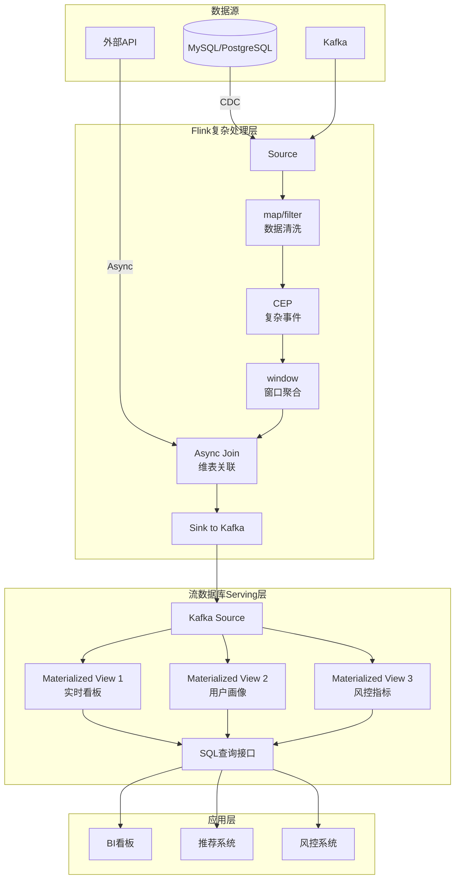
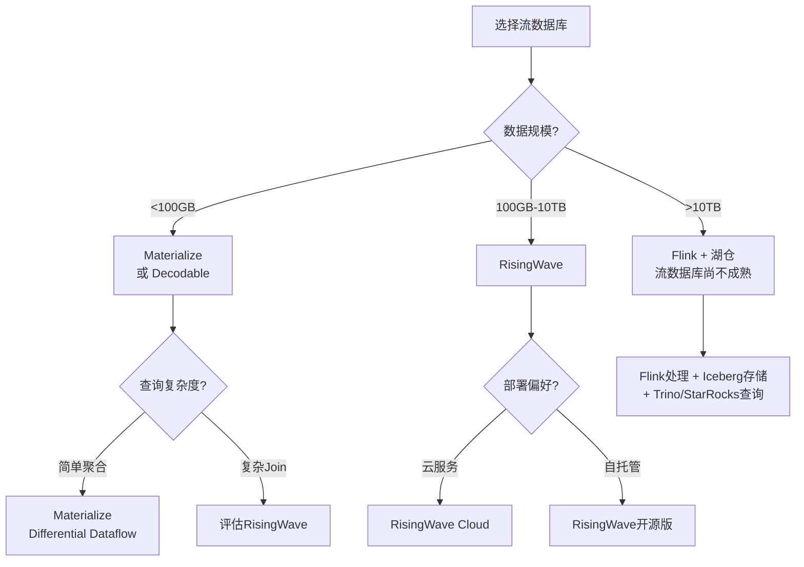

# 算子与流数据库（RisingWave/Materialize）集成

> **所属阶段**: Knowledge/06-frontier | **前置依赖**: [01.13-sql-table-api-operators.md](../01-concept-atlas/operator-deep-dive/01.13-sql-table-api-operators.md), [operator-lakehouse-integration.md](operator-lakehouse-integration.md) | **形式化等级**: L3-L4
> **文档定位**: 流处理算子与流数据库（RisingWave、Materialize、Decodable）的集成架构与能力对比
> **版本**: 2026.04

---

## 目录

- [算子与流数据库（RisingWave/Materialize）集成](#算子与流数据库risingwavematerialize集成)
  - [目录](#目录)
  - [1. 概念定义 (Definitions)](#1-概念定义-definitions)
    - [Def-SDB-01-01: 流数据库（Streaming Database）](#def-sdb-01-01-流数据库streaming-database)
    - [Def-SDB-01-02: 物化视图增量维护（Incremental View Maintenance, IVM）](#def-sdb-01-02-物化视图增量维护incremental-view-maintenance-ivm)
    - [Def-SDB-01-03: 流数据库算子抽象（Streaming DB Operator Abstraction）](#def-sdb-01-03-流数据库算子抽象streaming-db-operator-abstraction)
    - [Def-SDB-01-04: 流表对偶性（Stream-Table Duality）](#def-sdb-01-04-流表对偶性stream-table-duality)
    - [Def-SDB-01-05: 流数据库与Flink的互补性](#def-sdb-01-05-流数据库与flink的互补性)
  - [2. 属性推导 (Properties)](#2-属性推导-properties)
    - [Lemma-SDB-01-01: 物化视图的延迟下界](#lemma-sdb-01-01-物化视图的延迟下界)
    - [Lemma-SDB-01-02: SQL表达能力与Flink DataStream的包含关系](#lemma-sdb-01-02-sql表达能力与flink-datastream的包含关系)
    - [Prop-SDB-01-01: 流数据库的查询延迟优势](#prop-sdb-01-01-流数据库的查询延迟优势)
    - [Prop-SDB-01-02: RisingWave与Materialize的架构差异](#prop-sdb-01-02-risingwave与materialize的架构差异)
  - [3. 关系建立 (Relations)](#3-关系建立-relations)
    - [3.1 流数据库算子与Flink算子映射](#31-流数据库算子与flink算子映射)
    - [3.2 Flink + 流数据库的Lambda架构替代方案](#32-flink--流数据库的lambda架构替代方案)
    - [3.3 流数据库作为Flink Sink的集成模式](#33-流数据库作为flink-sink的集成模式)
  - [4. 论证过程 (Argumentation)](#4-论证过程-argumentation)
    - [4.1 流数据库不能替代Flink的场景](#41-流数据库不能替代flink的场景)
    - [4.2 流数据库优于Flink的场景](#42-流数据库优于flink的场景)
    - [4.3 混合架构的选型决策](#43-混合架构的选型决策)
  - [5. 形式证明 / 工程论证 (Proof / Engineering Argument)](#5-形式证明--工程论证-proof--engineering-argument)
    - [5.1 流数据库增量计算的正确性](#51-流数据库增量计算的正确性)
    - [5.2 Flink → RisingWave 的CDC集成方案](#52-flink--risingwave-的cdc集成方案)
    - [5.3 流数据库作为Flink维表的Lookup Join](#53-流数据库作为flink维表的lookup-join)
  - [6. 实例验证 (Examples)](#6-实例验证-examples)
    - [6.1 实战：Flink + Materialize 实时看板](#61-实战flink--materialize-实时看板)
    - [6.2 实战：RisingWave 替代 Flink Sink](#62-实战risingwave-替代-flink-sink)
  - [7. 可视化 (Visualizations)](#7-可视化-visualizations)
    - [Flink + 流数据库混合架构](#flink--流数据库混合架构)
    - [流数据库选型决策树](#流数据库选型决策树)
  - [8. 引用参考 (References)](#8-引用参考-references)

---

## 1. 概念定义 (Definitions)

### Def-SDB-01-01: 流数据库（Streaming Database）

流数据库是将流处理引擎与数据库查询引擎融合的系统，支持对无界流数据执行SQL查询并维护物化视图（Materialized View）：

$$\text{StreamingDB} = (\text{Stream Engine}, \text{Query Engine}, \text{Materialized View Store})$$

核心特征：数据以流的形式摄入，查询结果以物化视图的形式持续更新。

### Def-SDB-01-02: 物化视图增量维护（Incremental View Maintenance, IVM）

IVM是流数据库的核心机制，当基表（Source Stream）数据变更时，仅重新计算受影响的部分，而非全量重算：

$$\Delta V = \mathcal{F}(\Delta T_1, \Delta T_2, ..., V_{old})$$

其中 $\Delta T_i$ 为基表 $i$ 的变更流，$V_{old}$ 为旧视图状态，$\mathcal{F}$ 为增量计算函数。

### Def-SDB-01-03: 流数据库算子抽象（Streaming DB Operator Abstraction）

流数据库将SQL查询编译为算子执行图（类似Flink的DataStream API），但抽象层级更高：

$$\text{SQL Query} \xrightarrow{\text{Parser}} \text{AST} \xrightarrow{\text{Optimizer}} \text{Relational Algebra} \xrightarrow{\text{Code Gen}} \text{Operator DAG}$$

关键差异：用户不直接操作算子，而是通过SQL声明式定义计算逻辑。

### Def-SDB-01-04: 流表对偶性（Stream-Table Duality）

流表对偶性是流数据库的核心理论基础：流是表的变更历史，表是流的快照：

$$\text{Table}(t) = \text{fold}(\oplus, \text{Stream}[0..t])$$

$$\text{Stream} = \{\Delta T_1, \Delta T_2, ...\} = \{\text{Table}(t_i) - \text{Table}(t_{i-1})\}$$

其中 $\oplus$ 为合并操作（UPSERT语义）。

### Def-SDB-01-05: 流数据库与Flink的互补性

流数据库与Flink的互补性定义：

- **流数据库优势**: SQL原生、物化视图即查即得、低延迟 Serving
- **Flink优势**: 复杂事件处理（CEP）、精确时间语义、丰富的连接器生态、细粒度算子控制
- **集成点**: Flink作为ETL/复杂处理层，流数据库作为Serving/查询层

---

## 2. 属性推导 (Properties)

### Lemma-SDB-01-01: 物化视图的延迟下界

物化视图的更新延迟 $\mathcal{L}_{view}$ 受限于流数据库的增量计算能力：

$$\mathcal{L}_{view} \geq \mathcal{L}_{ingest} + \mathcal{L}_{incremental}$$

其中 $\mathcal{L}_{ingest}$ 为数据摄入延迟，$\mathcal{L}_{incremental}$ 为增量计算延迟。

对于简单聚合（COUNT/SUM），$\mathcal{L}_{incremental} \approx O(1)$；对于多表Join，$\mathcal{L}_{incremental} \approx O(|T_1| \cdot |T_2|)$。

### Lemma-SDB-01-02: SQL表达能力与Flink DataStream的包含关系

流数据库SQL的表达能力是Flink DataStream API的真子集：

$$\text{SQL}_{streaming} \subset \text{DataStream}_{flink}$$

**证明概要**:

- SQL可表达：SELECT/WHERE/GROUP BY/JOIN/WINDOW/MATCH_RECOGNIZE（有限）
- DataStream可额外表达：任意ProcessFunction、自定义Timer、复杂状态机、异步I/O模式
- 存在Flink DataStream程序无法等价转换为流数据库SQL（如带有复杂状态机的CEP）∎

### Prop-SDB-01-01: 流数据库的查询延迟优势

对于预定义查询（物化视图），流数据库的查询延迟显著低于Flink：

$$\mathcal{L}_{query}^{SDB} \ll \mathcal{L}_{query}^{Flink}$$

**原因**: 物化视图已预计算，查询即读；Flink需提交新作业或执行即席查询。

### Prop-SDB-01-02: RisingWave与Materialize的架构差异

| 维度 | RisingWave | Materialize |
|------|-----------|-------------|
| **存储引擎** | 自研LSM-Tree + S3 | 自研Differential Dataflow |
| **一致性模型** | Snapshot Isolation | Strict Serializability |
| **扩展性** | 水平扩展（Shared-Nothing） | 垂直扩展（Shared-Memory） |
| **SQL兼容** | PostgreSQL协议 | PostgreSQL协议 |
| **部署模式** | 云原生/K8s | 自托管/云 |
| **状态存储** | 分层（内存+本地盘+S3） | 内存为主 |
| **适用规模** | TB级 | GB-TB级 |

---

## 3. 关系建立 (Relations)

### 3.1 流数据库算子与Flink算子映射

| 流数据库SQL | 内部算子 | Flink等价算子 | 能力差异 |
|------------|---------|--------------|---------|
| `SELECT ... FROM` | Scan | Source + map | 等价 |
| `WHERE` | Filter | filter | 等价 |
| `GROUP BY ... SUM/COUNT` | HashAggregate | keyBy + aggregate | 等价 |
| `JOIN` | HashJoin / SortMergeJoin | join / intervalJoin | 流数据库Join限制更多 |
| `WINDOW (TUMBLE/HOP)` | WindowAggregate | window + aggregate | 等价 |
| `OVER (PARTITION BY ... ORDER BY)` | OverAggregate | Over Window | 等价 |
| `EMIT ON WINDOW CLOSE` | EmitStrategy | Trigger | Flink更灵活 |
| `CREATE MATERIALIZED VIEW` | MaterializeOperator | 无直接等价 | Flink需Sink+外部存储 |
| `INDEX` | Arrange / Index | 无直接等价 | Flink无原生索引 |

### 3.2 Flink + 流数据库的Lambda架构替代方案

传统Lambda架构：

```
Batch Layer (Hive/Spark) ──┐
                            ├──→ Serving Layer (Presto/Redis)
Speed Layer (Flink) ────────┘
```

Flink + 流数据库的简化架构：

```
数据源 → Flink（ETL+复杂处理）→ Kafka → 流数据库（物化视图+Serving）→ 应用查询
              ↓
         湖仓（Iceberg）→ 离线分析
```

**优势**:

- 无Batch/Speed层代码重复
- 物化视图即查即得，延迟 < 100ms
- SQL统一接口，降低开发成本

### 3.3 流数据库作为Flink Sink的集成模式

```
Flink Pipeline
├── Source (Kafka)
├── 复杂处理 (CEP / ProcessFunction / 窗口聚合)
└── Sink
    ├── 模式A: Kafka → 流数据库消费 (解耦)
    ├── 模式B: JDBC直接写入流数据库 (简单)
    └── 模式C: 流数据库作为Lookup Join维表 (实时关联)
```

---

## 4. 论证过程 (Argumentation)

### 4.1 流数据库不能替代Flink的场景

**场景1: 复杂事件处理（CEP）**

- 需求：检测"登录失败3次后成功登录"的欺诈模式
- 流数据库：SQL的MATCH_RECOGNIZE能力有限
- Flink：CEP库支持复杂的模式序列、超时、循环

**场景2: 自定义状态逻辑**

- 需求：基于用户行为历史动态调整推荐权重
- 流数据库：SQL无法表达复杂的状态机
- Flink：ProcessFunction + ValueState/MapState 完全可控

**场景3: 精确的时间语义控制**

- 需求：Watermark策略自定义、延迟数据处理
- 流数据库：自动Watermark，用户不可控
- Flink：完全自定义Watermark生成、allowedLateness、Side Output

### 4.2 流数据库优于Flink的场景

**场景1: 即席查询（Ad-hoc Query）**

- 流数据库：直接对物化视图执行SQL查询，毫秒级响应
- Flink：需提交新SQL作业或查询外部存储

**场景2: 多视图共享计算**

- 流数据库：多个物化视图共享中间结果，计算复用
- Flink：每个作业独立计算，重复消耗资源

**场景3: 低延迟Serving**

- 流数据库：查询直接命中内存中的物化视图
- Flink：通常需Sink到Redis/ES等外部存储再查询

### 4.3 混合架构的选型决策

| 因素 | 纯Flink | 纯流数据库 | 混合架构 |
|------|--------|-----------|---------|
| **查询复杂度** | 高 | 低-中 | 中-高 |
| **查询延迟要求** | >100ms | <100ms | <100ms |
| **CEP需求** | ✅ | ❌ | ✅（Flink侧） |
| **SQL团队技能** | 中 | 高 | 高 |
| **运维复杂度** | 中 | 低 | 中 |
| **成本** | 中 | 低-中 | 中-高 |

**推荐**: 复杂流处理（CEP/自定义状态）用Flink，实时Serving/即席查询用流数据库。

---

## 5. 形式证明 / 工程论证 (Proof / Engineering Argument)

### 5.1 流数据库增量计算的正确性

**问题**: 流数据库的物化视图增量更新是否等价于全量重算？

**定义**: 设基表 $T$ 的变更流为 $\Delta T = \{+r_1, -r_2, +r_3, ...\}$，视图定义为 $V = \sigma_{\theta}(T)$（选择操作）。

**增量更新规则**:
$$\Delta V = \sigma_{\theta}(\Delta T)$$
$$V_{new} = V_{old} \oplus \Delta V$$

**正确性证明**:

1. 设 $T_{new} = T_{old} \oplus \Delta T$（按UPSERT语义合并）
2. 全量重算：$V_{full} = \sigma_{\theta}(T_{new}) = \sigma_{\theta}(T_{old} \oplus \Delta T)$
3. 增量更新：$V_{incr} = V_{old} \oplus \sigma_{\theta}(\Delta T) = \sigma_{\theta}(T_{old}) \oplus \sigma_{\theta}(\Delta T)$
4. 由于选择操作 $\sigma$ 对UPSERT满足分配律：$\sigma(A \oplus B) = \sigma(A) \oplus \sigma(B)$
5. 因此 $V_{full} = V_{incr}$ ∎

**注意**: 上述证明仅适用于单调操作（选择、投影）。对于聚合操作，需使用Delta Query技术。

### 5.2 Flink → RisingWave 的CDC集成方案

**架构**:

```
MySQL → Debezium → Kafka → RisingWave Source
                                ↓
                         Materialized View
                                ↓
                         PostgreSQL协议查询
```

**配置**:

```sql
-- RisingWave中创建Kafka Source
CREATE SOURCE mysql_orders (
    order_id BIGINT,
    user_id BIGINT,
    amount DECIMAL,
    PRIMARY KEY (order_id)
) WITH (
    connector = 'kafka',
    topic = 'mysql.orders',
    format = 'debezium_json'
);

-- 创建物化视图
CREATE MATERIALIZED VIEW order_stats AS
SELECT
    user_id,
    COUNT(*) as order_count,
    SUM(amount) as total_amount
FROM mysql_orders
GROUP BY user_id;
```

**延迟**: Debezium捕获(10ms) + Kafka传输(10ms) + RisingWave增量更新(10-100ms) = 总延迟 < 200ms。

### 5.3 流数据库作为Flink维表的Lookup Join

**场景**: 实时订单流关联用户画像（存储在RisingWave物化视图中）。

```java
// Flink AsyncFunction 查询 RisingWave
public class RisingWaveLookupFunction extends AsyncFunction<Order, EnrichedOrder> {
    private transient PgConnection conn;

    @Override
    public void open(Configuration parameters) {
        conn = PgConnection.connect("jdbc:postgresql://risingwave:4566/dev");
    }

    @Override
    public void asyncInvoke(Order order, ResultFuture<EnrichedOrder> resultFuture) {
        conn.prepareQuery(
            "SELECT profile FROM user_profiles WHERE user_id = $1"
        ).execute(order.getUserId())
         .whenComplete((profile, err) -> {
             resultFuture.complete(Collections.singletonList(
                 new EnrichedOrder(order, profile)
             ));
         });
    }
}

// Pipeline
stream.keyBy(Order::getUserId)
    .asyncWaitFor(
        new RisingWaveLookupFunction(),
        Time.milliseconds(100),
        100
    );
```

**优势**: RisingWave物化视图实时更新，Flink查询时获得最新数据，无需维护本地缓存。

---

## 6. 实例验证 (Examples)

### 6.1 实战：Flink + Materialize 实时看板

**架构**:

- Flink: 负责复杂ETL（数据清洗、异常检测、格式转换）
- Kafka: 作为中间消息队列
- Materialize: 负责物化视图和实时查询

**Flink Pipeline**:

```java
env.fromSource(kafkaSource, WatermarkStrategy.noWatermarks(), "raw-events")
    .map(new CleanAndValidate())           // 数据清洗
    .filter(new FraudDetection())          // 异常检测
    .keyBy(Event::getCategory)
    .window(TumblingEventTimeWindows.of(Time.minutes(1)))
    .aggregate(new CategoryStatsAggregate())
    .sinkTo(kafkaSink);                    // 输出到Kafka topic: processed-stats
```

**Materialize视图**:

```sql
-- 从Kafka摄入
CREATE SOURCE processed_stats
FROM KAFKA BROKER 'kafka:9092' TOPIC 'processed-stats'
FORMAT JSON;

-- 实时看板视图
CREATE MATERIALIZED VIEW realtime_dashboard AS
SELECT
    category,
    SUM(event_count) as total_events,
    SUM(revenue) as total_revenue,
    AVG(latency) as avg_latency
FROM processed_stats
GROUP BY category;

-- 查询（毫秒级响应）
SELECT * FROM realtime_dashboard WHERE category = 'electronics';
```

### 6.2 实战：RisingWave 替代 Flink Sink

**传统Flink方案**: Flink窗口聚合 → Sink到Redis → API查询Redis
**RisingWave方案**: Flink清洗 → Kafka → RisingWave物化视图 → 直接SQL查询

**对比**:

| 指标 | Flink+Redis | Flink+RisingWave |
|------|------------|-----------------|
| 组件数量 | Flink + Redis + API | Flink + RisingWave |
| 查询延迟 | < 10ms | < 50ms |
| 即席查询 | ❌ 需预定义 | ✅ 任意SQL |
| 数据一致性 | 最终一致 | 事务一致 |
| 运维复杂度 | 高 | 低 |

---

## 7. 可视化 (Visualizations)

### Flink + 流数据库混合架构



### 流数据库选型决策树



---

## 8. 引用参考 (References)


---

*关联文档*: [01.13-sql-table-api-operators.md](../01-concept-atlas/operator-deep-dive/01.13-sql-table-api-operators.md) | [operator-lakehouse-integration.md](operator-lakehouse-integration.md) | [cross-engine-operator-mapping.md](../04-technology-selection/operator-decision-tools/cross-engine-operator-mapping.md)
