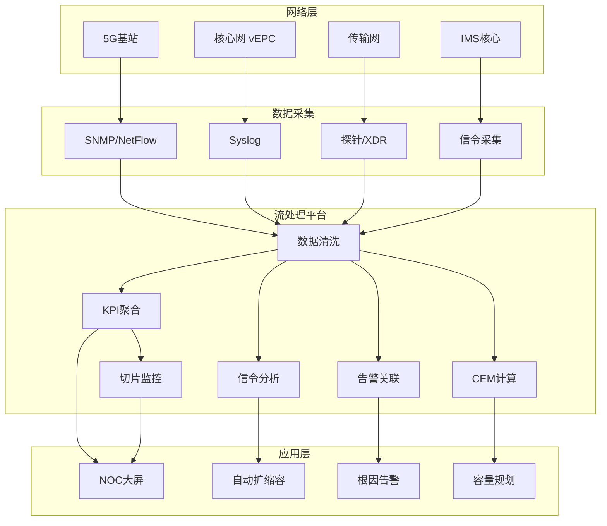
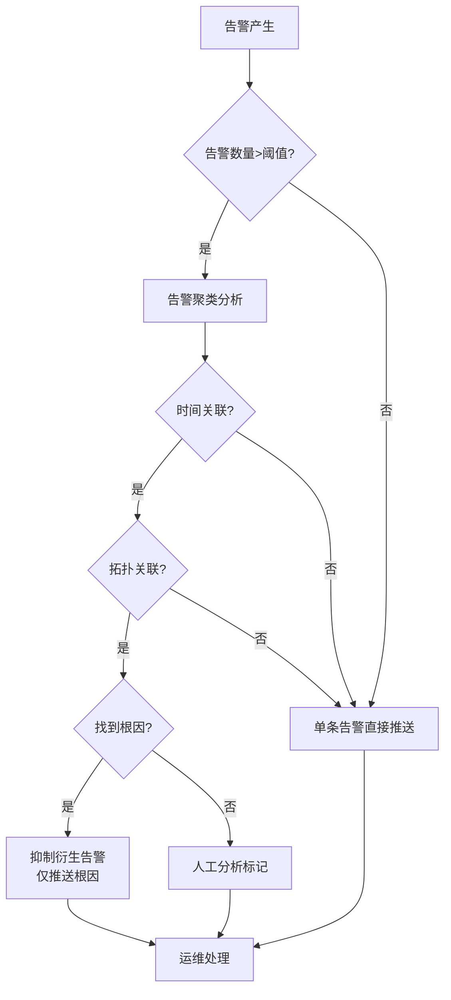

# 算子与实时电信网络监控

> **所属阶段**: Knowledge/06-frontier | **前置依赖**: [operator-observability-and-intelligent-ops.md](../07-best-practices/operator-observability-and-intelligent-ops.md), [operator-iot-stream-processing.md](operator-iot-stream-processing.md) | **形式化等级**: L3
> **文档定位**: 流处理算子在电信网络实时监控、告警关联与容量规划中的算子指纹与Pipeline设计
> **版本**: 2026.04

---

## 目录

- [算子与实时电信网络监控](#算子与实时电信网络监控)
  - [目录](#目录)
  - [1. 概念定义 (Definitions)](#1-概念定义-definitions)
    - [Def-TEL-01-01: 电信网络数据流（Telecom Network Data Stream）](#def-tel-01-01-电信网络数据流telecom-network-data-stream)
    - [Def-TEL-01-02: 网络功能虚拟化（NFV）](#def-tel-01-02-网络功能虚拟化nfv)
    - [Def-TEL-01-03: 告警风暴（Alarm Storm）](#def-tel-01-03-告警风暴alarm-storm)
    - [Def-TEL-01-04: 信令风暴（Signaling Storm）](#def-tel-01-04-信令风暴signaling-storm)
    - [Def-TEL-01-05: 用户体验管理（Customer Experience Management, CEM）](#def-tel-01-05-用户体验管理customer-experience-management-cem)
  - [2. 属性推导 (Properties)](#2-属性推导-properties)
    - [Lemma-TEL-01-01: 电信数据的时间局部性](#lemma-tel-01-01-电信数据的时间局部性)
    - [Lemma-TEL-01-02: 告警压缩率](#lemma-tel-01-02-告警压缩率)
    - [Prop-TEL-01-01: 5G网络切片的服务质量隔离](#prop-tel-01-01-5g网络切片的服务质量隔离)
    - [Prop-TEL-01-02: 信令数据的峰均比](#prop-tel-01-02-信令数据的峰均比)
  - [3. 关系建立 (Relations)](#3-关系建立-relations)
    - [3.1 电信监控Pipeline算子映射](#31-电信监控pipeline算子映射)
    - [3.2 算子指纹](#32-算子指纹)
    - [3.3 电信协议与Source算子](#33-电信协议与source算子)
  - [4. 论证过程 (Argumentation)](#4-论证过程-argumentation)
    - [4.1 为什么电信需要流处理而非传统网管](#41-为什么电信需要流处理而非传统网管)
    - [4.2 告警关联的根因分析](#42-告警关联的根因分析)
    - [4.3 5G网络切片的独立监控](#43-5g网络切片的独立监控)
  - [5. 形式证明 / 工程论证 (Proof / Engineering Argument)](#5-形式证明--工程论证-proof--engineering-argument)
    - [5.1 告警关联的CEP实现](#51-告警关联的cep实现)
    - [5.2 KPI实时聚合](#52-kpi实时聚合)
    - [5.3 信令风暴检测](#53-信令风暴检测)
  - [6. 实例验证 (Examples)](#6-实例验证-examples)
    - [6.1 实战：5G核心网实时监控](#61-实战5g核心网实时监控)
    - [6.2 实战：用户体验实时监控](#62-实战用户体验实时监控)
  - [7. 可视化 (Visualizations)](#7-可视化-visualizations)
    - [电信网络监控架构](#电信网络监控架构)
    - [告警关联决策树](#告警关联决策树)
  - [8. 引用参考 (References)](#8-引用参考-references)

---

## 1. 概念定义 (Definitions)

### Def-TEL-01-01: 电信网络数据流（Telecom Network Data Stream）

电信网络数据流是从核心网、无线接入网和传输网产生的多维度监控数据：

$$\text{NetworkStream} = \{S_{call}, S_{data}, S_{signal}, S_{fault}, S_{performance}\}$$

- $S_{call}$: 呼叫详细记录（CDR），包含通话起止时间、持续时间、位置等
- $S_{data}$: 数据流量记录（XDR），包含上下行流量、应用类型、QoS等级
- $S_{signal}$: 信令数据（SS7/Diameter/GTP），用于网络控制和用户跟踪
- $S_{fault}$: 设备告警（SNMP Trap/Syslog），包含硬件故障、链路中断等
- $S_{performance}$: KPI指标（计数器），如掉话率、切换成功率、吞吐率

### Def-TEL-01-02: 网络功能虚拟化（NFV）

NFV是将传统专用电信设备功能以软件形式运行在通用服务器上的架构：

$$\text{NFV} = (\text{VNF}, \text{NFVI}, \text{MANO})$$

其中 VNF（Virtual Network Function）包括 vEPC、vIMS、vRAN 等，流处理算子负责 VNF 的实时监控与弹性伸缩。

### Def-TEL-01-03: 告警风暴（Alarm Storm）

告警风暴是网络故障触发的级联告警泛滥现象：

$$\text{AlarmStorm} = \{a_1, a_2, ..., a_n\}, \quad n \gg \text{normal}$$

根因：单点故障（如光缆中断）导致数百个下游设备同时告警。

### Def-TEL-01-04: 信令风暴（Signaling Storm）

信令风暴是大量终端同时触发网络信令导致的控制面过载：

$$\lambda_{signaling} = N_{devices} \cdot f_{event} \gg C_{controlPlane}$$

典型案例：iPhone 4S iMessage bug 导致大量终端反复附着网络。

### Def-TEL-01-05: 用户体验管理（Customer Experience Management, CEM）

CEM是通过分析网络侧和用户侧数据评估服务质量的综合方法：

$$\text{QoE} = f(\text{NetworkKPIs}, \text{DeviceMetrics}, \text{UserComplaints})$$

目标：从网络性能指标推导用户主观体验评分。

---

## 2. 属性推导 (Properties)

### Lemma-TEL-01-01: 电信数据的时间局部性

电信网络事件在时间上呈现强局部性：

$$P(\text{event}_{t+1} \mid \text{event}_t) \gg P(\text{event}_{t+1})$$

**工程意义**: 基于滑动窗口的聚合分析比全局分析更高效。

### Lemma-TEL-01-02: 告警压缩率

通过根因分析，告警数量可压缩为：

$$N_{root} = N_{raw} \cdot (1 - r_{compress})$$

其中 $r_{compress}$ 为压缩率，优秀系统可达 80-95%。

### Prop-TEL-01-01: 5G网络切片的服务质量隔离

5G网络切片要求不同切片的资源隔离：

$$\text{Resource}_{slice_i} \cap \text{Resource}_{slice_j} = \emptyset, \quad i \neq j$$

流处理算子需按切片ID keyBy，独立统计各切片的KPI。

### Prop-TEL-01-02: 信令数据的峰均比

信令流量的峰值与均值之比（PAPR）远高于用户面数据：

$$\text{PAPR}_{signaling} = \frac{\lambda_{peak}}{\lambda_{avg}} \in [10, 100]$$

**原因**: 定时器同步（如周期性TAU更新）、突发事件（如地震后的呼叫潮）。

---

## 3. 关系建立 (Relations)

### 3.1 电信监控Pipeline算子映射

| 应用场景 | 算子组合 | 数据源 | 延迟要求 |
|---------|---------|--------|---------|
| **KPI实时计算** | window+aggregate | 性能计数器 | < 1分钟 |
| **告警关联** | CEP / ProcessFunction | SNMP Trap/Syslog | < 5秒 |
| **信令分析** | keyBy+aggregate | GTP/Diameter | < 1分钟 |
| **fraud检测** | CEP+Async ML | CDR/XDR | < 5分钟 |
| **容量预警** | window+map | 资源利用率 | < 5分钟 |
| **用户体验** | join+aggregate | 网络+应用探针 | < 5分钟 |
| **网络切片监控** | keyBy(sliceId)+window | 切片KPI | < 1分钟 |

### 3.2 算子指纹

| 维度 | 电信监控特征 |
|------|-------------|
| **核心算子** | window+aggregate（KPI统计）、CEP（告警关联）、ProcessFunction（状态机：设备状态跟踪）、AsyncFunction（CEM查询） |
| **状态类型** | MapState（设备当前状态）、ValueState（阈值配置）、WindowState（KPI历史） |
| **时间语义** | 事件时间为主（网络设备UTC时钟同步） |
| **数据特征** | 多源异构（计数器+日志+信令+CDR）、高并发（千万级设备）、强峰谷（晚高峰） |
| **状态热点** | 热门小区/基站key |
| **性能瓶颈** | 信令解码（ASN.1/GTP）、海量计数器聚合 |

### 3.3 电信协议与Source算子

| 协议 | 用途 | 数据格式 | Flink Source |
|------|------|---------|-------------|
| **SNMP** | 设备监控 | MIB/Trap | SNMP4J Source |
| **Syslog** | 日志收集 | 文本 | Syslog Source |
| **NetFlow/IPFIX** | 流量分析 | 二进制 | NetFlow Source |
| **Kafka** | 企业总线 | 二进制/JSON | Kafka Source |
| **gRPC** | VNF内部通信 | Protobuf | gRPC Source |

---

## 4. 论证过程 (Argumentation)

### 4.1 为什么电信需要流处理而非传统网管

传统网管系统（OSS）的问题：

- 轮询周期 5-15 分钟，无法捕获秒级故障
- 各子系统独立，告警关联依赖人工
- 报表T+1生成，无法支持实时决策

流处理的优势：

- 秒级KPI刷新：实时掌握网络健康度
- 智能告警关联：自动识别根因，减少90%无效告警
- 实时容量管理：分钟级发现拥塞并自动扩容

### 4.2 告警关联的根因分析

**场景**: 核心路由器故障导致下游100+基站告警。

**传统方式**: 运维人员逐个查看告警，耗时数小时。

**流处理方式**:

1. 收集所有告警，按时间窗口分组
2. 构建告警拓扑图（设备依赖关系）
3. 识别根因：最早发生+影响范围最大的告警
4. 自动抑制衍生告警，仅推送根因告警

**算法**:

- 时间关联：5分钟内同一区域的告警聚类
- 拓扑关联：基于CMDB（配置管理数据库）的设备依赖图
- 频率关联：罕见告警优先（基于历史频率）

### 4.3 5G网络切片的独立监控

**挑战**: 同一物理基础设施承载多个虚拟切片（eMBB/URLLC/mMTC），需独立监控。

**方案**:

- 数据层面：所有KPI记录包含sliceId字段
- 算子层面：按sliceId keyBy，独立聚合
- 展示层面：每个切片独立的监控看板

**关键KPI**:

- eMBB（增强移动宽带）：吞吐率、峰值速率
- URLLC（超可靠低延迟）：端到端延迟、可靠性
- mMTC（海量机器通信）：连接密度、能耗

---

## 5. 形式证明 / 工程论证 (Proof / Engineering Argument)

### 5.1 告警关联的CEP实现

```java
Pattern<AlarmEvent, ?> rootCausePattern = Pattern
    .<AlarmEvent>begin("root")
    .where(evt -> evt.getSeverity().equals("CRITICAL"))
    .next("children")
    .where(new IterativeCondition<AlarmEvent>() {
        @Override
        public boolean filter(AlarmEvent event, Context<AlarmEvent> ctx) {
            // 获取根告警
            List<AlarmEvent> roots = ctx.getEventsForPattern("root");
            if (roots.isEmpty()) return false;

            AlarmEvent root = roots.get(0);

            // 时间关联：5分钟内
            boolean timeRelated = event.getTimestamp() - root.getTimestamp() < 300000;

            // 拓扑关联：子告警设备依赖根告警设备
            boolean topoRelated = isDependent(event.getDeviceId(), root.getDeviceId());

            // 频率关联：子告警类型罕见
            boolean rareEvent = getHistoricalFrequency(event.getType()) < 0.01;

            return timeRelated && topoRelated && rareEvent;
        }
    })
    .timesOrMore(3)  // 至少3个子告警
    .within(Time.minutes(5));
```

### 5.2 KPI实时聚合

```java
// 小区级KPI聚合（1分钟窗口）
DataStream<KPIRecord> kpis = env.addSource(new KafkaSource<>("network-kpis"));

kpis.keyBy(KPIRecord::getCellId)
    .window(TumblingEventTimeWindows.of(Time.minutes(1)))
    .aggregate(new KPIAggregateFunction())
    .keyBy(KPIStats::getRegionId)
    .process(new ThresholdCheckFunction())
    .addSink(new AlertSink());

public class KPIAggregateFunction implements AggregateFunction<KPIRecord, KPIAccumulator, KPIStats> {
    @Override
    public KPIAccumulator createAccumulator() { return new KPIAccumulator(); }

    @Override
    public KPIAccumulator add(KPIRecord record, KPIAccumulator acc) {
        acc.callAttempts += record.getCallAttempts();
        acc.callDrops += record.getCallDrops();
        acc.dataVolume += record.getDataVolume();
        acc.userCount += record.getActiveUsers();
        return acc;
    }

    @Override
    public KPIStats getResult(KPIAccumulator acc) {
        return new KPIStats(
            acc.cellId,
            (double) acc.callDrops / acc.callAttempts,  // 掉话率
            acc.dataVolume / 60.0,  // 平均吞吐
            acc.userCount
        );
    }
}
```

### 5.3 信令风暴检测

```java
// 检测异常附着请求（可能的信令风暴）
DataStream<SignalingEvent> signaling = env.addSource(new KafkaSource<>("signaling"));

signaling.filter(evt -> evt.getType().equals("ATTACH_REQUEST"))
    .keyBy(SignalingEvent::getCellId)
    .window(SlidingEventTimeWindows.of(Time.minutes(1), Time.seconds(10)))
    .aggregate(new AttachCountAggregate())
    .filter(count -> count > getBaseline(count.getCellId()) * 5)  // 超过基线5倍
    .addSink(new SignalingStormAlertSink());
```

---

## 6. 实例验证 (Examples)

### 6.1 实战：5G核心网实时监控

```java
// 1. 多源数据摄入
DataStream<NFMetric> vnfMetrics = env.addSource(new PrometheusSource("vnf-metrics"));
DataStream<AlarmEvent> alarms = env.addSource(new SNMPTrapSource("udp://0.0.0.0:162"));
DataStream<SignalingEvent> signaling = env.addSource(new KafkaSource<>("signaling"));

// 2. VNF性能监控（CPU/内存/吞吐）
vnfMetrics.keyBy(NFMetric::getVnfId)
    .window(TumblingProcessingTimeWindows.of(Time.minutes(1)))
    .aggregate(new VNFAggregate())
    .filter(stats -> stats.getCpuUsage() > 80 || stats.getMemoryUsage() > 85)
    .addSink(new VNFScalingTriggerSink());  // 触发自动扩缩容

// 3. 告警关联与根因分析
alarms.keyBy(AlarmEvent::getRegionId)
    .pattern(rootCausePattern)
    .process(new RootCauseHandler())
    .addSink(new ConsolidatedAlertSink());

// 4. 网络切片KPI监控
vnfMetrics.keyBy(NFMetric::getSliceId)
    .window(TumblingEventTimeWindows.of(Time.minutes(1)))
    .aggregate(new SliceKPIAggregate())
    .addSink(new SliceDashboardSink());
```

### 6.2 实战：用户体验实时监控

```java
// XDR（详细通话记录）分析
DataStream<XDRRecord> xdr = env.addSource(new KafkaSource<>("xdr"));

// 计算每个用户的体验评分
xdr.keyBy(XDRRecord::getUserId)
    .window(TumblingEventTimeWindows.of(Time.minutes(5)))
    .aggregate(new UserExperienceAggregate())
    .filter(qoe -> qoe.getScore() < 3.0)  // 体验评分<3（满分5）
    .map(qoe -> new PoorExperienceEvent(qoe.getUserId(), qoe.getCellId(), qoe.getReason()))
    .keyBy(PoorExperienceEvent::getCellId)
    .window(TumblingEventTimeWindows.of(Time.minutes(5)))
    .aggregate(new CellIssueAggregate())
    .filter(issue -> issue.getAffectedUsers() > 100)  // 影响>100用户
    .addSink(new NetworkOptimizationSink());
```

---

## 7. 可视化 (Visualizations)

### 电信网络监控架构



### 告警关联决策树



---

## 8. 引用参考 (References)


---

*关联文档*: [operator-observability-and-intelligent-ops.md](../07-best-practices/operator-observability-and-intelligent-ops.md) | [operator-iot-stream-processing.md](operator-iot-stream-processing.md) | [operator-chaos-engineering-and-resilience.md](../07-best-practices/operator-chaos-engineering-and-resilience.md)
