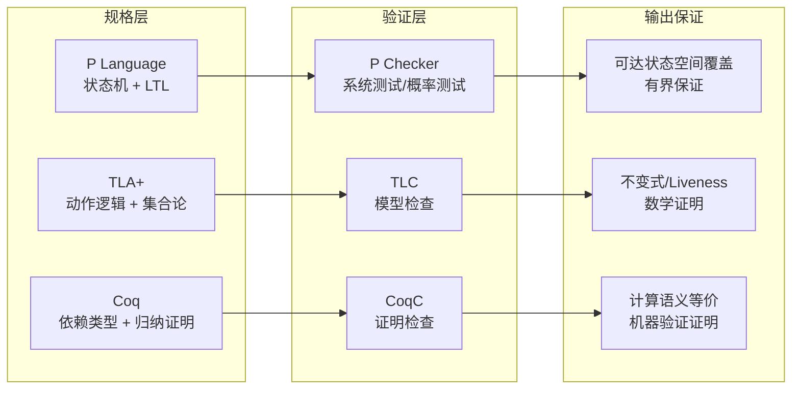
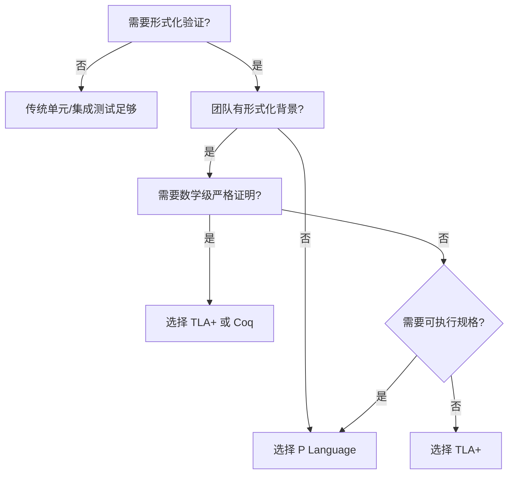
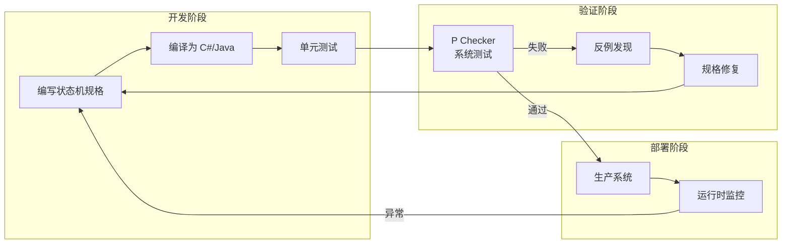

# P Programming Language: 状态机驱动的形式化验证实践

> **所属阶段**: Knowledge/06-frontier | **前置依赖**: [Struct/07-tools/tla-for-flink.md](../../Struct/07-tools/tla-for-flink.md)、[Struct/07-tools/coq-mechanization.md](../../Struct/07-tools/coq-mechanization.md) | **形式化等级**: L3-L5 | **最后更新**: 2026-04

---

## 1. 概念定义 (Definitions)

### Def-K-P-01: P Language (P 语言)

P 是一种由微软研究院和 AWS 共同发展的**领域特定语言 (DSL)**，用于以**事件驱动状态机 (Event-Driven State Machines)** 的形式建模和验证异步分布式系统。P 的核心抽象包含三个层次：

1. **事件 (Events)**: 异步消息的类型化定义
2. **状态机 (Machines)**: 响应事件的计算实体，具有显式状态和转换函数
3. **规格 (Specifications)**: 使用线性时序逻辑 (LTL) 或计算树逻辑 (CTL) 表达的 Safety/Liveness 断言

形式化地，P 规格是一个四元组 $\mathcal{P} = (E, M, S, \Phi)$，其中：

- $E$: 有限事件类型集合
- $M$: 状态机集合，每个 $m \in M$ 具有局部状态 $s_m \in S_m$ 和事件处理函数 $\delta_m: S_m \times E \rightarrow S_m \times (E \cup \{\epsilon\})^*$
- $S$: 全局状态空间 $S = \prod_{m \in M} S_m \times \mathcal{B}$，其中 $\mathcal{B}$ 为消息缓冲区状态
- $\Phi$: 时序逻辑断言集合

### Def-K-P-02: 测试驱动的形式化验证 (Test-Driven Formal Verification)

P 采用独特的**"可执行规格 (Executable Specifications)"**范式：规格本身是可编译、可执行、可测试的程序。开发者通过以下循环进行验证：

```
编写状态机规格 → 编译为 C#/Java → 运行系统测试 → 调用模型检查器 (P Checker) → 发现反例 → 修复规格
```

这与 TLA+ 的**"规格与实现分离"**范式形成对比：TLA+ 规格通常不可直接执行，需人工保证实现与规格的一致性。

### Def-K-P-03: P Checker 的两种模式

| 模式 | 机制 | 适用场景 | 复杂度 |
|------|------|---------|--------|
| **系统测试模式 (Systematic Testing)** | 对状态空间进行**有界深度优先搜索 (DFS)**，探索所有可能的交错执行 | 中等规模状态机 (< $10^6$ 状态) | $O(b^d)$，$b$ 为分支因子，$d$ 为搜索深度 |
| **概率测试模式 (Probabilistic Testing)** | 引入随机调度器和概率事件选择，进行蒙特卡洛式采样 | 大规模状态机、长时间运行验证 | 多项式时间，但无完备保证 |

---

## 2. 属性推导 (Properties)

### Prop-K-P-01: P 规格的可编译性保证

由于 P 规格编译为目标语言（C#、Java、C）的**类型正确程序**，编译器前端保证：

- 所有事件处理函数**穷尽匹配 (Exhaustive Pattern Matching)** 其声明接收的事件类型
- 所有状态转换**类型安全**：目标状态与当前状态机声明的状态集一致
- 无**悬挂事件 (Orphaned Events)**：发送事件的类型必须在接收状态机的输入事件集中声明

这与 TLA+ 的**无类型 (Untyped)** 规格形成对比：TLA+ 中错误的事件类型仅在模型检查阶段被发现。

### Prop-K-P-02: 系统测试模式的覆盖率下界

设状态机集合 $M$ 的总状态数为 $|S| = \prod_{m \in M} |S_m|$，P Checker 的 DFS 搜索深度为 $d$，则覆盖的状态转移比例：

$$
Coverage_{transitions} \geq \frac{d}{|S|} \quad \text{(当 $d \ll |S|$ 时)}
$$

在实践中，P Checker 通过**偏序归约 (POR)** 和**状态哈希 (State Hashing)** 将有效搜索空间压缩 2-3 个数量级。

### Prop-K-P-03: P 与 TLA+ 的表达力等价性

对于有限状态异步系统，P 的规格表达力与 TLA+ **等价**（均可编码为 Buchi 自动机上的 LTL 验证）。但 P 在以下方面受限：

- **连续数学**: P 不支持实数运算和连续动力学（TLA+ 通过 Reals 模块支持）
- **高阶量词**: P 的规格语言不支持高阶逻辑量词（TLA+ 支持）
- **组合推理**: P 缺乏 TLA+ 的模块化证明结构（INSTANCE/EXTENDS 层次）

---

## 3. 关系建立 (Relations)

### 关系 1: P Language ↔ TLA+ ↔ Coq 的形式化工具谱系



| 维度 | P Language | TLA+ | Coq |
|------|-----------|------|-----|
| **学习曲线** | 低（类C语法） | 中（数学符号） | 高（函数式+证明） |
| **验证延迟** | 分钟级 | 分钟-小时级 | 小时-天级 |
| **工程师参与度** | 高（可执行规格） | 中（规格与实现分离） | 低（需形式化专家） |
| **代码生成** | ✅ 原生支持 | ❌ 不支持 | ❌ 不支持 |
| **工业验证规模** | AWS S3/DynamoDB/EFS | AWS/DynamoDB/Azure | CompCert/Iris |
| **流处理适用性** | ⭐⭐⭐⭐（事件驱动天然契合） | ⭐⭐⭐（需手动建模流语义） | ⭐⭐（过于底层） |

### 关系 2: P Language ↔ 流处理系统的映射

P 的事件驱动状态机模型与流处理系统存在**结构性同构**：

| P 概念 | Flink 概念 | 映射关系 |
|--------|-----------|---------|
| 事件 (Event) | 记录 (Record) | 1:1 类型化消息 |
| 状态机 (Machine) | 算子实例 (Operator Instance) | 有状态计算单元 |
| 状态 (State) | Keyed State / Operator State | 持久化本地状态 |
| 事件队列 (Event Queue) | 网络缓冲区 (Network Buffer) | 异步消息传递 |
| 规格断言 (Specification) | 端到端一致性检查 | 系统级不变式 |

这一同构意味着：**P 可直接用于建模 Flink 作业的状态机语义**，验证 Checkpoint、Failover、Watermark 传播等核心机制的正确性。

---

## 4. 论证过程 (Argumentation)

### 论证: AWS S3 强一致性迁移中的 P 验证

AWS S3 在 2020 年完成从最终一致性到强一致性的架构升级，这是分布式存储领域最具挑战性的工程之一。P 在该项目中的核心作用：

1. **规格建模**: 将 S3 的元数据服务 (S3 Index) 建模为 40+ 个交互状态机，覆盖 PUT/GET/LIST/DELETE 的完整状态空间。
2. **Bug 发现**: P Checker 在开发早期发现了 **16 个一致性缺陷**，包括：
   - 并发 DELETE 和 LIST 的幽灵读取 (Phantom Read)
   - 跨区域复制中的因果逆序 (Causal Inversion)
   - 故障恢复后的元数据分歧 (Metadata Divergence)
3. **回归防护**: 将 P 规格集成至 CI/CD，每次代码变更后自动运行系统测试，防止一致性回归。

**对比**: 同一团队估算，若使用 TLA+ 完成同等覆盖的规格，需额外 3-4 人月的**规格→实现一致性维护**工作（因为 TLA+ 规格不可执行）。

### 论证: P 在流处理场景下的适用边界

**优势场景**:

- 状态机数量可控（< 100 个交互状态机）
- 事件类型有限且类型化
- 需要**可执行规格**作为系统测试基础
- 团队缺乏形式化数学背景

**劣势场景**:

- 连续数学模型（如 Watermark 的实数时间语义）
- 需要数学级严格证明（如 Exactly-Once 的等价性证明）
- 状态空间爆炸（如千级分区 × 万级键的状态组合）

---

## 5. 形式证明 / 工程论证 (Proof / Engineering Argument)

### 工程论证: P Language 生产选型决策

#### 决策树



#### 与 TLA+ 的量化对比

| 指标 | P Language | TLA+ | 备注 |
|------|-----------|------|------|
| 规格编写时间 (100状态机系统) | 2-3 周 | 3-4 周 | P 的类C语法降低认知负荷 |
| 验证运行时间 | 5-30 分钟 | 10 分钟 - 2 小时 | P Checker 的 POR 优化显著 |
| 反例可读性 | 高（可调试执行轨迹） | 中（需理解 TLA+ 状态表示） | P 反例可复现为单元测试 |
| 实现一致性维护 | 低（规格即代码） | 高（规格与实现分离） | P 编译生成目标语言代码 |
| 数学证明能力 | 无 | 强 | TLA+ 支持逐步精化证明 |
| 流处理原生支持 | 强 | 中 | P 的事件驱动模型契合流语义 |

---

## 6. 实例验证 (Examples)

### 示例 1: 用 P 建模 Flink Checkpoint 协调器

```p
// FlinkCheckpoint.p
// 建模 Checkpoint 协调器与 Task 的交互

event eInitiateCheckpoint : int;  // checkpoint ID
event eAckCheckpoint : (int, int); // (checkpointID, taskID)
event eAbortCheckpoint : int;

event eBarrierReceived : int;
event eTaskFailed : int;

machine CheckpointCoordinator {
  var pendingAcks: map[int, set[int]];  // checkpointID -> {taskIDs}
  var completedCheckpoints: seq[int];
  start state WaitForTrigger {
    on eInitiateCheckpoint do (cid: int) {
      pendingAcks[cid] = default(set[int]);
      // 广播 Barrier 给所有 Task
      foreach (task in registeredTasks) {
        send task, eBarrierReceived, cid;
      }
      goto WaitForAcks, cid;
    }
  }

  state WaitForAcks {
    entry (cid: int) {
      // 超时或全部收到 Ack 时完成
    }
    on eAckCheckpoint do (payload: (int, int)) {
      var cid = payload.0;
      var tid = payload.1;
      pendingAcks[cid] += (tid);
      if (sizeof(pendingAcks[cid]) == totalTasks) {
        completedCheckpoints += (cid);
        goto WaitForTrigger;
      }
    }
    on eTaskFailed do (tid: int) {
      // 触发 Checkpoint 回滚
      announce eCheckpointFailed, tid;
      goto WaitForTrigger;
    }
  }
}

// 规格断言：完成的 Checkpoint 必须收到所有 Task 的 Ack
spec ConsistentCheckpoint observes eAckCheckpoint, eInitiateCheckpoint {
  assert (forall cid in completedCheckpoints ::
    sizeof(pendingAcks[cid]) == totalTasks);
}
```

### 示例 2: P Checker 反例复现

```bash
# 运行系统测试
p check --target FlinkCheckpoint.p --mode systematic --max-steps 10000

# 输出：发现反例 - Task 在发送 Ack 后崩溃，Coordinator 未处理
# Counterexample trace written to: ./PCheckerOutput/FlinkCheckpoint_0_0.txt

# 将反例转换为 C# 单元测试
p testgen --counterexample ./PCheckerOutput/FlinkCheckpoint_0_0.txt \
  --output ./Tests/CheckpointConsistencyTest.cs
```

### 示例 3: 与 TLA+ 规格的等价性对比

| 概念 | P Language | TLA+ |
|------|-----------|------|
| 状态声明 | `start state WaitForTrigger` | `Init == coordinatorState = "WaitForTrigger"` |
| 事件处理 | `on eInitiateCheckpoint do` | `TriggerCheckpoint == ...` |
| 不变式 | `spec ConsistentCheckpoint` | `Consistent == ...` |
| 消息传递 | `send task, eBarrierReceived, cid` | `task' = [task EXCEPT !.inbox = ...]` |

---

## 7. 可视化 (Visualizations)

### P Language 验证工作流



### P vs TLA+ vs Coq 能力雷达

```mermaid
radar
    title 形式化验证工具能力对比
    axis 学习曲线, 验证速度, 数学严格性, 可执行性, 流处理契合度, 工业规模验证
    P_Language: 0.8, 0.7, 0.4, 0.9, 0.8, 0.7
    TLA+: 0.5, 0.6, 0.9, 0.2, 0.5, 0.8
    Coq: 0.2, 0.3, 1.0, 0.3, 0.3, 0.6
```

---

## 8. 引用参考 (References)
