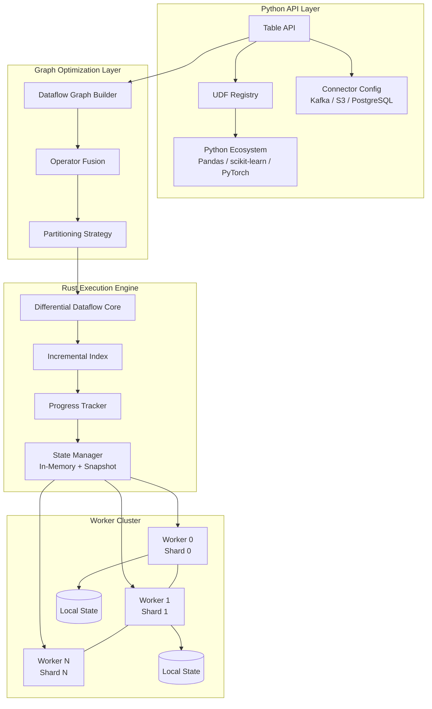
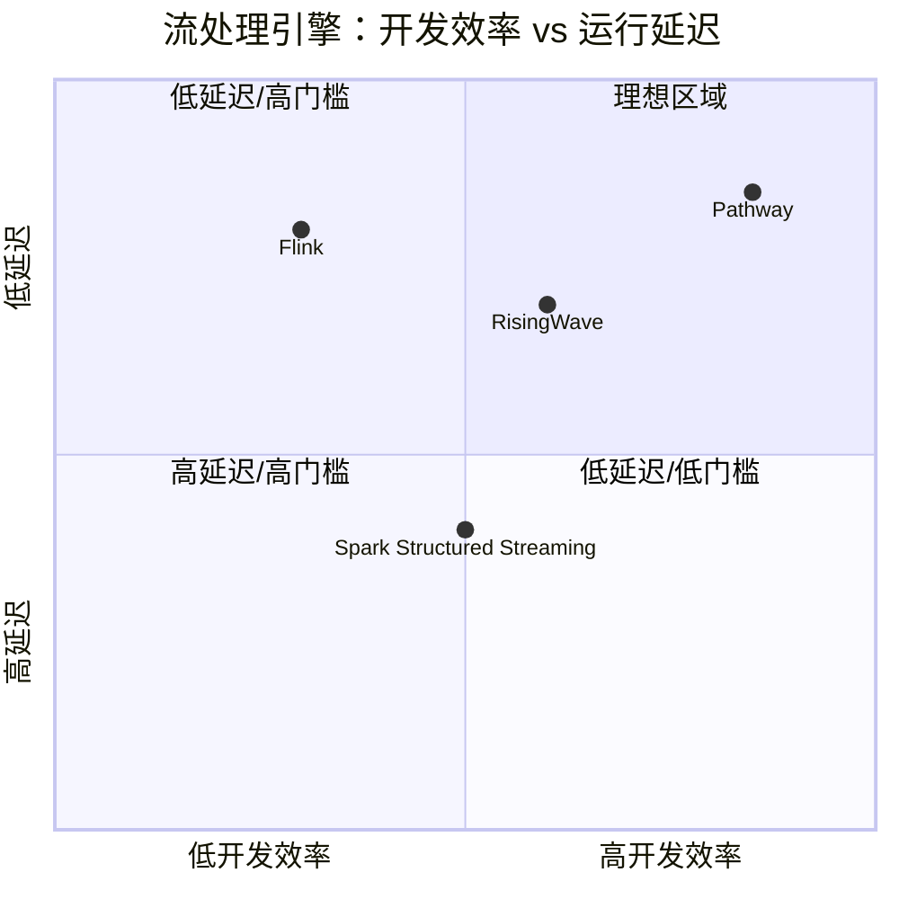

# Pathway：Python-Native 统一批流处理引擎深度解析

> 所属阶段: Knowledge/06-frontier | 前置依赖: [rust-streaming-ecosystem.md](./rust-streaming-ecosystem.md), [risingwave-deep-dive.md](./risingwave-deep-dive.md), [streaming-databases.md](./streaming-databases.md) | 形式化等级: L4

## 目录

- [Pathway：Python-Native 统一批流处理引擎深度解析](#pathwaypython-native-统一批流处理引擎深度解析)
  - [目录](#目录)
  - [1. 概念定义 (Definitions)](#1-概念定义-definitions)
    - [1.1 Pathway 系统核心形式化定义](#11-pathway-系统核心形式化定义)
    - [1.2 时间模型与一致性定义](#12-时间模型与一致性定义)
  - [2. 属性推导 (Properties)](#2-属性推导-properties)
    - [2.1 批流语义等价性](#21-批流语义等价性)
    - [2.2 Python API / Rust 引擎性能隔离](#22-python-api--rust-引擎性能隔离)
  - [3. 关系建立 (Relations)](#3-关系建立-relations)
    - [3.1 Pathway 与 Differential Dataflow 的关系](#31-pathway-与-differential-dataflow-的关系)
    - [3.2 Pathway 与 Flink 的架构映射](#32-pathway-与-flink-的架构映射)
    - [3.3 Pathway 与 RisingWave 的定位差异](#33-pathway-与-risingwave-的定位差异)
  - [4. 论证过程 (Argumentation)](#4-论证过程-argumentation)
    - [4.1 统一批流模型的工程价值论证](#41-统一批流模型的工程价值论证)
    - [4.2 全内存状态的边界讨论](#42-全内存状态的边界讨论)
  - [5. 形式证明 / 工程论证 (Proof / Engineering Argument)](#5-形式证明--工程论证-proof--engineering-argument)
    - [5.1 统一批流模型语义等价性定理](#51-统一批流模型语义等价性定理)
  - [6. 实例验证 (Examples)](#6-实例验证-examples)
    - [6.1 实时 ETL 管道（Python API 示例）](#61-实时-etl-管道python-api-示例)
    - [6.2 RAG 管道增量索引更新](#62-rag-管道增量索引更新)
    - [6.3 Kubernetes 部署配置](#63-kubernetes-部署配置)
  - [7. 可视化 (Visualizations)](#7-可视化-visualizations)
    - [7.1 Pathway 系统架构层次图](#71-pathway-系统架构层次图)
    - [7.2 统一批流执行模型流程图](#72-统一批流执行模型流程图)
    - [7.3 Pathway 与主流引擎对比矩阵](#73-pathway-与主流引擎对比矩阵)
  - [8. 引用参考 (References)](#8-引用参考-references)

## 1. 概念定义 (Definitions)

### 1.1 Pathway 系统核心形式化定义

**Def-K-06-500** (Pathway 统一流处理引擎). Pathway 是一个 Python-native、Rust-core 的统一数据流处理引擎，其系统架构可形式化定义为六元组：

$$
\mathcal{PW} = \langle \mathcal{P}_{api}, \mathcal{E}_{rust}, \mathcal{G}_{df}, \mathcal{W}, \mathcal{S}, \mathcal{C} \rangle
$$

其中各组件定义如下：

| 组件 | 符号 | 形式化定义 | 功能描述 |
|------|------|------------|----------|
| Python API 层 | $\mathcal{P}_{api}$ | $\langle \mathcal{T}_{table}, \mathcal{O}_{udf}, \mathcal{L}_{py} \rangle$ | 表抽象、UDF 注册、Python 生态集成 |
| Rust 执行引擎 | $\mathcal{E}_{rust}$ | $\langle \mathcal{T}_{thread}, \mathcal{M}_{mem}, \mathcal{L}_{lockfree} \rangle$ | 多线程调度、内存管理、无锁数据结构 |
| Dataflow 计算图 | $\mathcal{G}_{df}$ | $\langle V, E, \Sigma, \Delta \rangle$ | 算子节点、数据流边、状态空间、时间模型 |
| Worker 集群 | $\mathcal{W}$ | $\{w_1, w_2, \ldots, w_n\}$ | 同构计算节点集合，各运行相同 dataflow |
| 状态存储 | $\mathcal{S}$ | $\langle \mathcal{S}_{mem}, \mathcal{S}_{snap}, \mathcal{O}_{persist} \rangle$ | 内存状态、快照、持久化后端 |
| 连接器层 | $\mathcal{C}$ | $\langle \mathcal{C}_{in}, \mathcal{C}_{out} \rangle$ | 输入/输出数据源连接器集合 |

**Def-K-06-501** (增量计算模型). Pathway 基于 Differential Dataflow 的增量计算模型可定义为映射：

$$
\mathcal{I}: \Delta D \times S_{t-1} \rightarrow \Delta R \times S_t
$$

其中：

- $\Delta D$: 输入数据集的变更流（插入/更新/删除三元组）
- $S_{t-1}$: 时刻 $t-1$ 的累积状态
- $\Delta R$: 输出结果的增量更新
- $S_t$: 更新后的累积状态

增量计算的核心约束为**最小工作量原则**：对于任意算子 $v \in V$，有

$$
\text{Cost}(\mathcal{I}(\Delta D, S_{t-1})) \leq \text{Cost}(\text{Recompute}(D_t, \emptyset))
$$

即增量更新的计算成本不超过全量重算的成本[^1]。

**Def-K-06-502** (Worker 分布式执行架构). Pathway 的 Worker 架构遵循 Naiad (SOSP 2013) 的设计原则[^2]，每个 Worker $w_i \in \mathcal{W}$ 被定义为四元组：

$$
w_i = \langle \text{ID}_i, \mathcal{G}_{df}^{(i)}, \mathcal{S}_{local}^{(i)}, \mathcal{C}_{io}^{(i)} \rangle
$$

其中：

- $\text{ID}_i \in \mathbb{N}$: Worker 唯一序号，用于数据分片定位
- $\mathcal{G}_{df}^{(i)}$: Worker $i$ 上运行的完整 dataflow 副本
- $\mathcal{S}_{local}^{(i)}$: 本地状态存储（有状态算子的分区状态）
- $\mathcal{C}_{io}^{(i)}$: 负责的分区输入/输出连接器

Worker 间通信方式取决于部署模式：

- 同进程线程：共享内存（shared memory）
- 跨进程：Unix Domain Socket / TCP
- 跨机器：网络套接字

### 1.2 时间模型与一致性定义

**Def-K-06-503** (统一时间戳模型). Pathway 采用统一的时间戳模型处理批处理和流处理：

$$
\mathcal{T} = \langle T, \leq, \bot, \top \rangle
$$

其中：

- $T$: 时间戳集合（批处理中为离散批次号 $\mathbb{N}$，流处理中为事件时间 $\mathbb{R}^+$）
- $\leq$: 全序关系
- $\bot$: 最小元（初始状态）
- $\top$: 最大元（流处理中永不可达，批处理中对应批次结束）

对于批处理输入 $D_{batch}$，时间戳被统一编码为单点集合 $\{t_{batch}\}$；对于流处理输入 $D_{stream}$，时间戳为事件时间 $t_{event}$。算子语义对两种模式保持一致。

## 2. 属性推导 (Properties)

### 2.1 批流语义等价性

**Prop-K-06-500** (批流语义等价性). 设同一处理逻辑 $f$ 分别应用于批处理数据集 $D_{batch}$ 和流处理数据集 $D_{stream}$，若满足：

$$
\bigcup_{\tau} D_{stream}(\tau) = D_{batch}
$$

即流数据按时间累积后等价于批数据集，则 Pathway 保证：

$$
\text{Result}_{streaming}(\top) = \text{Result}_{batch}(t_{batch})
$$

**论证概要**：由 Def-K-06-501 的增量计算模型，批处理可视为时间戳 $\tau = t_{batch}$ 的单点输入，其计算路径为 $\mathcal{I}(D_{batch}, \emptyset)$；流处理为 $\tau$ 的序列输入，其最终状态为 $\mathcal{I}(\Delta D_{\top}, S_{\top-1})$。由于 Differential Dataflow 的单调性保证，累积应用所有增量变更等价于对全集的一次性应用。因此两种模式在终止时刻的输出一致。$\square$

### 2.2 Python API / Rust 引擎性能隔离

**Prop-K-06-501** (GIL 无关性). 设 Pathway 管道的 Python UDF 执行时间为 $T_{py}$，Rust 引擎执行时间为 $T_{rust}$，则系统的总吞吐量满足：

$$
\text{Throughput} \geq \frac{1}{\max(T_{rust}, T_{py}^{parallel}/N_{workers})}
$$

其中 $N_{workers}$ 为 Worker 数量。

**论证概要**：Pathway 的 Python 层仅用于**描述**计算图（build phase），实际执行（run phase）完全由 Rust 引擎承担。Python UDF 通过 PyO3 绑定以无 GIL 模式调用[^3]。因此 Python 层的执行不持有 GIL，多 Worker 可并行执行不同分片的 UDF。Rust 引擎本身不受 GIL 限制，其吞吐量瓶颈为数据依赖和状态访问局部性，而非 Python 运行时。$\square$

## 3. 关系建立 (Relations)

### 3.1 Pathway 与 Differential Dataflow 的关系

Pathway 的计算核心直接基于 Microsoft Research 提出的 Differential Dataflow 框架[^2]。二者的关系可形式化为实现-规范关系：

$$
\mathcal{PW}_{engine} \models \mathcal{DD}_{spec}
$$

即 Pathway 的 Rust 引擎满足 Differential Dataflow 的规范语义。关键继承点包括：

- **嵌套迭代**：支持在 dataflow 中嵌套循环计算（如 PageRank 迭代）
- **增量索引维护**：自动维护 Join/GroupBy 算子的增量索引结构
- **时间维度追踪**：每个数据点携带多维度时间戳（logical time 和 physical time）

与 Timely Dataflow 的原生 Rust API 不同，Pathway 通过 Python API 层将其封装为类 Pandas 的表操作接口，显著降低了使用门槛。

### 3.2 Pathway 与 Flink 的架构映射

Pathway 与 Flink 在架构层面存在多对多映射关系：

| Pathway 概念 | Flink 概念 | 差异 |
|-------------|-----------|------|
| Table ($\mathcal{T}$) | DataStream / Table API | Pathway 统一为表抽象 |
| Worker ($w_i$) | TaskManager | Pathway Worker 为同构全副本 |
| Progress Tracking | Checkpoint / Watermark | Pathway 使用 Naiad 式进度追踪 |
| Connector | Source / Sink Function | Pathway 连接器生态较 Flink 有限 |
| State ($\mathcal{S}$) | KeyedState / OperatorState | Pathway 状态全内存，依赖快照持久化 |

### 3.3 Pathway 与 RisingWave 的定位差异

Pathway 与 RisingWave 代表了流处理领域的两种不同范式：

- **Pathway** = 流处理引擎 + Python 生态桥接：核心定位是通用数据流计算，强调与 Python ML/AI 生态的无缝集成，不提供内置的持久化存储和 SQL 查询服务。
- **RisingWave** = 流数据库：核心定位是"流处理即数据库"，提供物化视图、SQL 接口、持久化存储，但计算模型限于声明式 SQL[^4]。

形式化地，二者的功能剖面关系为：

$$
\mathcal{PW}_{features} \cap \mathcal{RW}_{features} = \{\text{stream processing}, \text{incremental computation}\}
$$

$$
\mathcal{PW}_{features} \setminus \mathcal{RW}_{features} = \{\text{Python UDF}, \text{ML integration}, \text{imperative API}\}
$$

$$
\mathcal{RW}_{features} \setminus \mathcal{PW}_{features} = \{\text{persistent storage}, \text{SQL interface}, \text{ad-hoc query}\}
$$

## 4. 论证过程 (Argumentation)

### 4.1 统一批流模型的工程价值论证

传统 Lambda 架构需要维护两条独立 pipeline：

- **Speed Layer**: Storm/Flink 处理实时流
- **Batch Layer**: Spark/Hadoop 处理历史批数据

其问题可形式化为**语义漂移风险**：设批处理逻辑为 $f_B$，流处理逻辑为 $f_S$，在实践中几乎必然有 $f_B \neq f_S$（不同 API、不同语义细节），导致：

$$
\exists d: f_B(d) \neq f_S(d)
$$

Pathway 的统一模型通过强制 $f_B \equiv f_S$（同一套 Python 代码）从根本上消除了这一风险。其代价是：

- 批处理场景下无法利用某些批处理专属优化（如全局排序、静态分区裁剪）
- 流处理场景下需承受统一抽象带来的轻微性能开销

工程权衡分析表明，对于绝大多数 AI/ML 管道和实时 ETL 场景，语义一致性的价值远高于极致的批处理性能。

### 4.2 全内存状态的边界讨论

Pathway 当前采用全内存状态管理（Def-K-06-500 中的 $\mathcal{S}_{mem}$），其状态规模上限为：

$$
|\mathcal{S}_{total}| \leq \sum_{i=1}^{N_{workers}} \text{RAM}(w_i)
$$

这与 Flink 的 RocksDB 状态后端形成对比，后者可将状态溢出到磁盘，支持 TB 级状态。Pathway 的全内存设计带来了：

- **优势**：更低的单条记录状态访问延迟（~100ns vs ~10μs for RocksDB）
- **劣势**：状态规模受限于集群总内存，超大规模状态场景需要水平扩展 Worker 数量

Pathway 通过快照持久化（snapshot to S3）实现故障恢复，但运行时状态必须驻留内存。这一设计选择使其在状态规模中等（< 数百 GB）的场景具有显著延迟优势，但在超大规模状态场景面临扩展挑战。

## 5. 形式证明 / 工程论证 (Proof / Engineering Argument)

### 5.1 统一批流模型语义等价性定理

**Thm-K-06-500** (批流语义等价性). 设 Pathway 计算图为 $\mathcal{G}_{df} = (V, E)$，其中每个算子 $v \in V$ 满足增量计算语义（Def-K-06-501）。对于任意批处理输入 $D_{batch}$ 和对应的流处理输入序列 $\{\Delta D_{\tau}\}_{\tau=1}^{T}$，若满足：

$$
D_{batch} = \bigsqcup_{\tau=1}^{T} \Delta D_{\tau}
$$

其中 $\bigsqcup$ 为数据集的累积合并操作，则最终输出满足：

$$
\text{Output}_{batch}(\mathcal{G}_{df}, D_{batch}) = \text{Output}_{stream}(\mathcal{G}_{df}, \{\Delta D_{\tau}\})
$$

**工程论证**：

1. **基例**（$|V| = 1$，单算子）：设唯一算子为 $v$，其增量函数为 $f_v^{\Delta}$，全量函数为 $f_v$。由 Differential Dataflow 的定义[^2]，增量函数满足正确性条件：

$$
   f_v(D_{batch}) = f_v^{\Delta}(\Delta D_{\tau}, S_{\tau-1}) \oplus \text{Output}_{\tau-1}
   $$

其中 $\oplus$ 为结果合并操作。对 $\tau$ 归纳可得累积输出等于全量计算。

1. **归纳步**：假设对于子图 $\mathcal{G}' \subset \mathcal{G}$ 定理成立。对于新增算子 $v_{new}$，其输入为子图输出的增量流 $\Delta \text{Output}(\mathcal{G}')$。由归纳假设，$\Delta \text{Output}(\mathcal{G}')$ 在批流两种模式下语义等价，因此 $v_{new}$ 的输入等价，输出亦等价。

2. **时间模型一致性**：由 Def-K-06-503，批处理的时间戳 $\{t_{batch}\}$ 与流处理的终止时间戳 $T$ 在算子语义中等价。算子对时间戳的处理（如窗口、Join 的 as-of 条件）仅依赖于时间戳的序关系，不依赖于其来源。

3. **状态持久化无关性**：Pathway 的快照机制仅用于故障恢复，不影响算子的语义输出。批处理和流处理使用相同的快照/恢复协议，确保在故障场景下语义仍保持一致。

综上，对于任意合法输入和计算图，Pathway 的批处理模式与流处理模式产生语义等价的结果。$\square$

## 6. 实例验证 (Examples)

### 6.1 实时 ETL 管道（Python API 示例）

以下示例展示 Pathway 如何以类 Pandas API 构建实时 ETL 管道，同一套代码可无缝切换批处理/流处理模式：

```python
import pathway as pw

# 统一连接器：批处理时读取文件，流处理时替换为 Kafka 连接器
users = pw.io.csv.read(
    "./users.csv",
    schema=pw.schema_from_csv("./users.csv"),
    mode="static"  # 改为 "streaming" 即可切换
)

clicks = pw.io.kafka.read(
    "localhost:9092",
    topic="user_clicks",
    schema=ClickSchema,
    mode="streaming"
)

# 类 Pandas 的转换逻辑
enriched = clicks.join(users, clicks.user_id == users.id) \
    .select(clicks.timestamp, users.name, clicks.page)

# 窗口聚合：实时统计每用户每分钟的点击数
result = enriched.groupby(
    pw.this.name,
    window=pw.temporal.tumbling(duration=60)
).reduce(
    name=pw.this.name,
    count=pw.reducers.count()
)

# 输出到目标系统
pw.io.jsonlines.write(result, "./output.jsonl")

# 运行引擎（Rust 核心接管执行）
pw.run()
```

关键观察：转换逻辑 `enriched` 和 `result` 的定义完全不依赖输入模式（`static`/`streaming`），体现了统一模型的简洁性。

### 6.2 RAG 管道增量索引更新

Pathway 在 RAG（检索增强生成）场景中的核心优势是**增量向量索引维护**：

```python
import pathway as pw
from pathway.xpacks.llm import embedders, parsers, splitters

# 监控数据源变更（如 S3 文件夹、SharePoint）
docs = pw.io.fs.read(
    "s3://bucket/docs/",
    format="binary",
    mode="streaming"
)

# 解析、分块、生成 Embedding
parser = parsers.UnstructuredParser()
chunks = docs.select(text=parser(pw.this.data)) \
    .flatten(pw.this.text) \
    .select(chunk=splitters.token_split(pw.this.text))

# 增量更新向量索引（自动处理新增/修改/删除）
index = chunks.select(
    data=pw.this.chunk,
    embedding=embedders.OpenAIEmbedder()(pw.this.chunk)
)

# 实时同步到向量数据库
pw.io.vector_store.write(index, "qdrant", host="localhost")
```

与传统 batch RAG 相比，Pathway 在文档变更时仅更新受影响的 chunk 和 embedding，而非重建全量索引[^5]。

### 6.3 Kubernetes 部署配置

Pathway 支持通过 Kubernetes 进行分布式部署，以下为核心配置片段：

```yaml
apiVersion: apps/v1
kind: StatefulSet
metadata:
  name: pathway-workers
spec:
  replicas: 4
  serviceName: pathway-headless
  template:
    spec:
      containers:
      - name: pathway
        image: pathwaycom/pathway:latest
        env:
        - name: PATHWAY_PROCESS_ID
          valueFrom:
            fieldRef:
              fieldPath: metadata.name
        - name: PATHWAY_TOTAL_PROCESSES
          value: "4"
        resources:
          requests:
            memory: "8Gi"
            cpu: "4"
          limits:
            memory: "16Gi"
            cpu: "8"
```

Worker 通过 `PATHWAY_PROCESS_ID` 和 `PATHWAY_TOTAL_PROCESSES` 环境变量自动发现集群拓扑，无需外部服务发现[^6]。

## 7. 可视化 (Visualizations)

### 7.1 Pathway 系统架构层次图

Pathway 采用 Python API 层与 Rust 引擎层分离的架构设计，开发者以 Python 描述计算图，Rust 引擎负责优化与执行。



### 7.2 统一批流执行模型流程图

Pathway 的统一模型通过统一的时间戳抽象，使同一套代码在批处理和流处理模式下产生语义等价的执行计划。

```mermaid
flowchart TD
    A[用户代码<br/>Python Table API] --> B{输入模式}
    B -->|static| C[批处理时间戳<br/>t_batch ∈ &#123;t0&#125;]
    B -->|streaming| D[流处理时间戳<br/>t_event ∈ R+]
    C --> E[统一 Dataflow Graph]
    D --> E
    E --> F[增量计算引擎<br/>Differential Dataflow]
    F --> G{输出模式}
    G -->|batch| H[一次性全量输出]
    G -->|streaming| I[连续增量更新]
    style E fill:#e1f5fe
    style F fill:#fff3e0
```



### 7.3 Pathway 与主流引擎对比矩阵

以下矩阵从多个维度对比 Pathway 与 Flink、Spark Structured Streaming、RisingWave 的定位差异：



| 维度 | Pathway | Apache Flink | Spark Structured Streaming | RisingWave |
|------|---------|-------------|---------------------------|------------|
| 核心语言 | Python API + Rust 引擎 | Java/Scala (JVM) | Java/Scala/Python (JVM) | Rust (存储) + Java (计算) |
| 批流统一 | 同一引擎/同一 API | 统一引擎/不同 API | 同一 API/微批底层 | 流数据库/SQL 统一 |
| 真实流处理 | 是（事件级增量） | 是（事件级） | 否（微批 ~100ms） | 是（事件级） |
| Python 生态 | 原生集成（无 GIL） | PyFlink 包装层 | PySpark 包装层 | 有限 UDF 支持 |
| 状态规模 | 内存限制（~TB 级） | 磁盘扩展（PB 级） | 磁盘扩展（PB 级） | 云存储扩展（EB 级） |
| 延迟 | 亚毫秒 ~ 毫秒 | 毫秒级 | 秒级（微批） | 毫秒级 |
| 连接器丰富度 | 中等（~20+） | 极高（100+） | 高（50+） | 中等（~15+） |
| SQL 支持 | 无原生 SQL | Table API + SQL | Spark SQL | 原生 SQL |
| 运维成熟度 | 新兴（~2022起） | 极高（10年+） | 高（8年+） | 中等（~2021起） |
| 典型场景 | AI 管道、RAG、实时 ETL | 大规模流分析、CEP | 批流混合 ETL | 实时数仓、物化视图 |

## 8. 引用参考 (References)

[^1]: Pathway Documentation, "Why Pathway", 2025. <https://pathway.com/developers/user-guide/introduction/why-pathway>
[^2]: F. McSherry et al., "Differential Dataflow", CIDR, 2013; F. McSherry et al., "Naiad: A Timely Dataflow System", SOSP, 2013. <https://doi.org/10.1145/2517349.2522738>
[^3]: Pathway GitHub Repository, "pathwaycom/pathway", 2022-2025. <https://github.com/pathwaycom/pathway>
[^4]: RisingWave Labs, "RisingWave Architecture Documentation", 2025. <https://docs.risingwave.com/>
[^5]: Skywork.ai, "Pathway Comprehensive Guide 2025: Everything You Need to Know", 2025. <https://skywork.ai/blog/pathway-comprehensive-guide-2025-everything-you-need-to-know/>
[^6]: Pathway Documentation, "Worker Architecture", 2025. <https://pathway.com/developers/user-guide/advanced/worker-architecture>

---

*文档版本: v1.0 | 创建日期: 2026-05-06 | 定理注册: Def-K-06-500~503, Prop-K-06-500~501, Thm-K-06-500*
