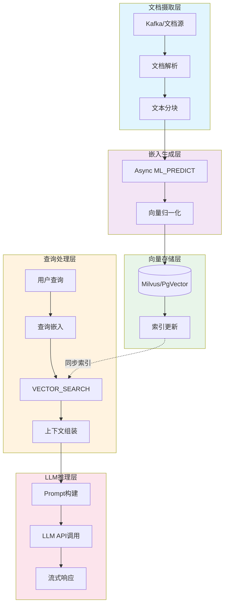
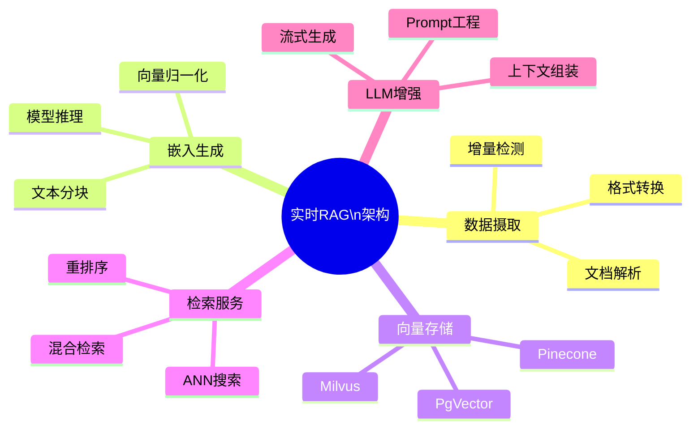
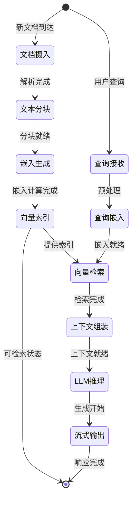
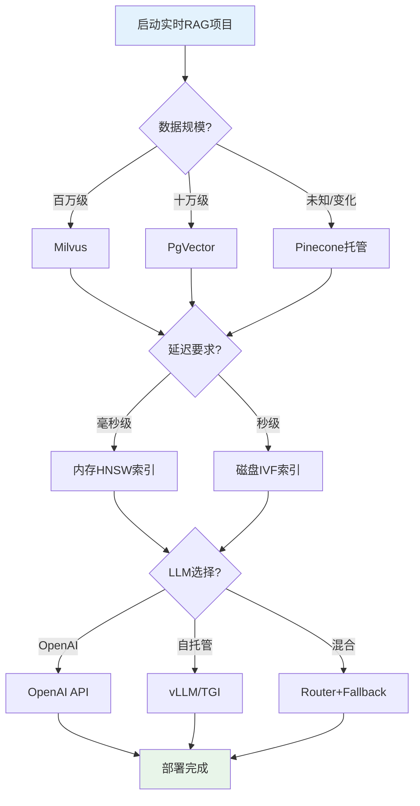
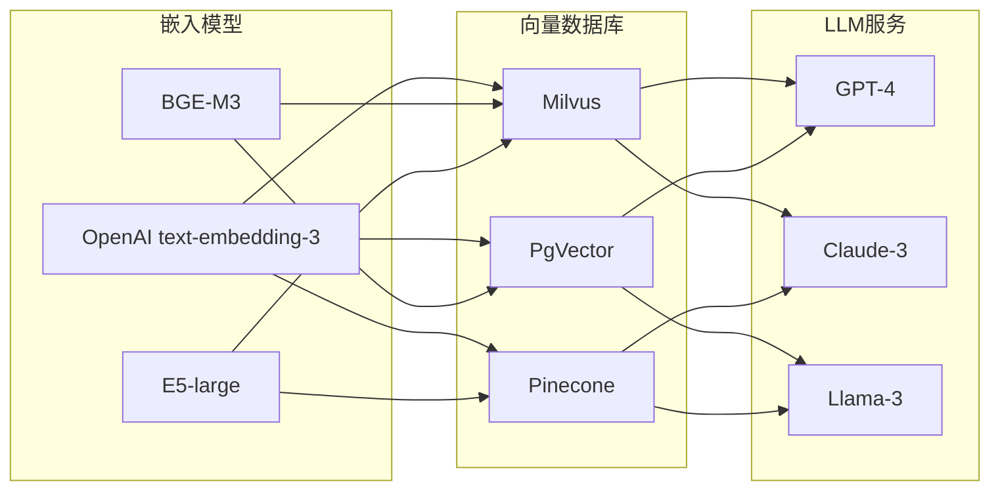

# 实时RAG架构

> 所属阶段: Knowledge/06-frontier | 前置依赖: [Flink 架构概述](../../Flink/01-concepts/deployment-architectures.md), [流处理模式](../02-design-patterns/pattern-event-time-processing.md) | 形式化等级: L3

## 1. 概念定义 (Definitions)

### Def-K-06-26: RAG管道 (RAG Pipeline)

**定义**: RAG管道是一个四元组 $\mathcal{P}_{RAG} = (\mathcal{D}, \mathcal{E}, \mathcal{V}, \mathcal{L})$，其中：

- $\mathcal{D}$: 文档流，$\mathcal{D} = \{d_1, d_2, ..., d_n\}$，每个文档 $d_i = (\text{content}_i, \text{metadata}_i, t_i)$
- $\mathcal{E}$: 嵌入函数，$\mathcal{E}: \mathcal{D} \rightarrow \mathbb{R}^k$，将文档映射到 $k$ 维向量空间
- $\mathcal{V}$: 向量存储，$\mathcal{V} \subset \mathbb{R}^k$，支持近似最近邻(ANN)查询
- $\mathcal{L}$: LLM推理函数，$\mathcal{L}: (q, \mathcal{C}) \rightarrow \text{response}$，其中 $q$ 为查询，$\mathcal{C}$ 为检索上下文

**直观解释**: RAG管道将实时流入的文档转换为向量表示，存储在向量数据库中，当用户查询时，系统检索相关上下文并增强LLM的生成能力。

---

### Def-K-06-27: 实时嵌入生成 (Real-time Embedding Generation)

**定义**: 实时嵌入生成是一个流处理算子 $\Phi_{embed}$，定义为：

$$\Phi_{embed}: \text{Stream}(\mathcal{D}) \rightarrow \text{Stream}(\mathbb{R}^k)$$

$$\Phi_{embed}(d_t) = \text{ML\_PREDICT}(\text{model}_{emb}, \text{chunk}(d_t))$$

其中：

- $\text{chunk}(\cdot)$: 文档分块函数，将长文档分割为语义连贯的片段
- $\text{model}_{emb}$: 预训练嵌入模型（如text-embedding-3、BGE、E5）
- $\text{ML\_PREDICT}$: 模型推理操作，延迟约束为 $L_{embed} < 100\text{ms}$

**关键属性**:

- **流式处理**: 单条文档处理延迟与批量大小无关
- **版本控制**: 模型版本变更触发向量重新计算
- **维度对齐**: 输出维度必须与向量存储 schema 一致

---

### Def-K-06-28: 流式上下文检索 (Streaming Context Retrieval)

**定义**: 流式上下文检索是一个状态ful算子 $\Phi_{retrieve}$：

$$\Phi_{retrieve}: (q_t, \mathcal{V}_t) \rightarrow \mathcal{C}_t$$

$$\mathcal{C}_t = \text{TOP\_K}\left\{ v \in \mathcal{V}_t \mid \text{sim}(\mathcal{E}(q_t), v) \geq \theta \right\}$$

其中：

- $q_t$: 时间 $t$ 的查询请求
- $\mathcal{V}_t$: 时间 $t$ 的向量存储状态
- $\text{sim}(\cdot, \cdot)$: 相似度函数（余弦相似度或点积）
- $\theta$: 相关性阈值
- $\text{TOP\_K}$: 返回前 $k$ 个最相关结果

**检索策略**:

| 策略 | 适用场景 | 复杂度 |
|------|----------|--------|
| 精确KNN | 小数据集(<10K) | $O(n)$ |
| HNSW | 大规模在线查询 | $O(\log n)$ |
| IVF | 平衡精度与速度 | $O(\sqrt{n})$ |
| 混合检索 | 关键词+语义 | $O(\log n + m)$ |

---

### Def-K-06-29: 向量存储同步 (Vector Store Synchronization)

**定义**: 向量存储同步是一个一致性协议 $\mathcal{S}_{vec}$，确保：

$$\forall t, \mathcal{V}_t = \bigcup_{t' \leq t} \Phi_{embed}(d_{t'})$$

**同步模式**:

1. **强一致性同步**: 嵌入生成完成后立即写入，等待确认
2. **最终一致性同步**: 异步批量写入，容忍短暂不一致
3. **增量同步**: 仅传播变更(delta)，减少网络开销

**一致性级别**:

- **Write-Through**: 写入主存储同时更新向量索引
- **Write-Behind**: 缓冲批量写入，优化吞吐量
- **CQRS模式**: 读写分离，独立扩展检索和更新路径

---

## 2. 属性推导 (Properties)

### Prop-K-06-10: 端到端延迟上界

**命题**: 实时RAG系统的端到端延迟 $L_{total}$ 满足：

$$L_{total} \leq L_{embed} + L_{index} + L_{retrieve} + L_{llm}$$

**典型值** (p99):

| 组件 | 延迟 | 优化手段 |
|------|------|----------|
| 嵌入生成 | 50-150ms | 模型量化、批处理 |
| 向量索引 | 10-50ms | 内存索引、分区策略 |
| 上下文检索 | 20-100ms | HNSW索引、预过滤 |
| LLM推理 | 500-2000ms | 流式生成、缓存 |
| **总计** | **580-2300ms** | 并行化、预取 |

---

### Prop-K-06-11: 检索质量边界

**命题**: 设真实相关文档集为 $\mathcal{C}^*$，检索结果为 $\mathcal{C}$，则：

$$\text{Recall} = \frac{|\mathcal{C} \cap \mathcal{C}^*|}{|\mathcal{C}^*|}$$

$$\text{Precision} = \frac{|\mathcal{C} \cap \mathcal{C}^*|}{|\mathcal{C}|}$$

**质量保障条件**:

1. **嵌入质量**: $\text{rank-sim}(d_{relevant}, d_{query}) < \text{rank-sim}(d_{irrelevant}, d_{query})$
2. **索引覆盖**: 向量存储包含全部候选文档的嵌入
3. **阈值调优**: $\theta$ 根据业务容忍度动态调整

---

### Lemma-K-06-07: 向量一致性引理

**引理**: 在最终一致性模型下，向量存储 $\mathcal{V}_t$ 与文档流 $\mathcal{D}_t$ 的偏差有界：

$$|\mathcal{D}_t \setminus \mathcal{V}_t| \leq \lambda \cdot \Delta t$$

其中 $\lambda$ 为文档到达率，$\Delta t$ 为同步窗口。

**证明概要**:

1. 文档到达服从泊松过程，速率为 $\lambda$
2. 同步窗口 $\Delta t$ 内积累的未同步文档期望为 $\lambda \Delta t$
3. 批量同步机制确保窗口结束时完成写入 $\square$

---

## 3. 关系建立 (Relations)

### 与流计算模型的映射

```
┌─────────────────────────────────────────────────────────────┐
│                    实时RAG × 流计算映射                      │
├─────────────────────────────────────────────────────────────┤
│  RAG概念              │  Flink抽象                          │
├───────────────────────┼─────────────────────────────────────┤
│  文档流 (D)           │  DataStream<Document>               │
│  嵌入生成             │  AsyncFunction<ML_PREDICT>（实验性）│
│  向量存储             │  KeyedStateStore<Vector>            │
│  查询流               │  BroadcastStream<Query>             │
│  检索算子             │  ProcessFunction<VECTOR_SEARCH>（规划中）│
│  LLM推理              │  ExternalSystemCall(OpenAI API)     │
│  结果流               │  DataStream<Response>               │
└───────────────────────┴─────────────────────────────────────┘
```

### 架构层次关系

```
┌──────────────────────────────────────────────────────────────┐
│                    应用层 (Application)                       │
│  ┌─────────────┐  ┌─────────────┐  ┌─────────────────────┐  │
│  │ 智能客服    │  │ 实时推荐    │  │ 动态知识库问答      │  │
│  └─────────────┘  └─────────────┘  └─────────────────────┘  │
└──────────────────────────────────────────────────────────────┘
                              ▼
┌──────────────────────────────────────────────────────────────┐
│                    服务层 (Service)                           │
│  ┌─────────────┐  ┌─────────────┐  ┌─────────────────────┐  │
│  │ LLM Gateway │  │ RAG Engine  │  │ Query Orchestrator  │  │
│  └─────────────┘  └─────────────┘  └─────────────────────┘  │
└──────────────────────────────────────────────────────────────┘
                              ▼
┌──────────────────────────────────────────────────────────────┐
│                    计算层 (Compute)                           │
│  ┌───────────────────────────────────────────────────────┐  │
│  │            Apache Flink / Stateful Functions           │  │
│  │  ┌─────────┐  ┌─────────┐  ┌─────────┐  ┌─────────┐  │  │
│  │  │Document │→ │ Embedding│→ │ Vector  │→ │  LLM    │  │  │
│  │  │  Source │  │  Async  │  │  Index  │  │  Sink   │  │  │
│  │  └─────────┘  └─────────┘  └─────────┘  └─────────┘  │  │
│  └───────────────────────────────────────────────────────┘  │
└──────────────────────────────────────────────────────────────┘
                              ▼
┌──────────────────────────────────────────────────────────────┐
│                    存储层 (Storage)                           │
│  ┌─────────────┐  ┌─────────────┐  ┌─────────────────────┐  │
│  │ Vector DB   │  │  Document   │  │   Cache Layer       │  │
│  │(Milvus/     │  │   Store     │  │  (Redis/Guava)      │  │
│  │PgVector)    │  │             │  │                     │  │
│  └─────────────┘  └─────────────┘  └─────────────────────┘  │
└──────────────────────────────────────────────────────────────┘
```

---

## 4. 论证过程 (Argumentation)

### 4.1 架构选型论证

**Q: 为何选择Flink而非批处理系统？**

**论证**:

| 维度 | 批处理方案 | Flink流式方案 |
|------|------------|---------------|
| 延迟 | 分钟级(T+1) | 秒级/毫秒级 |
| 新鲜度 | 文档可见性延迟高 | 近实时可见 |
| 资源利用 | 周期性峰值 | 平滑持续 |
| 复杂度 | 需要调度+存储ETL | 统一流处理语义 |

**结论**: 实时交互场景（如客服对话）要求文档立即可检索，流式架构是必要条件。

---

### 4.2 向量数据库选型矩阵

| 特性 | Milvus | PgVector | Pinecone | Weaviate |
|------|--------|----------|----------|----------|
| 部署模式 | 自托管/云 | PostgreSQL插件 | 全托管 | 自托管/云 |
| 最大维度 | 32768 | 16000 | 20000 | 65535 |
| ANN算法 | HNSW/IVF | HNSW/IVF | 私有实现 | HNSW |
| 混合检索 | 支持 | 支持 | 有限 | 原生支持 |
| 实时更新 | 优秀 | 良好 | 优秀 | 良好 |
| 与Flink集成 | 官方Connector | JDBC | REST API | REST API |

**推荐策略**:

- **企业级**: Milvus（功能完整、生态丰富）
- **轻量级**: PgVector（已有PostgreSQL基础设施）
- **快速启动**: Pinecone（零运维、按量付费）

---

### 4.3 反例分析：纯缓存方案的局限性

**场景**: 尝试仅用Redis缓存预计算嵌入

**问题**:

1. **内存爆炸**: 千万级文档 × 1536维 × 4字节 = 60GB+ RAM
2. **更新延迟**: 缓存失效策略难以保证一致性
3. **检索精度**: Redis无原生ANN支持，需全量扫描

**教训**: 向量数据库的专门化索引结构(HNSW/IVF)是大规模检索的必要条件。

---

## 5. 工程论证 (Engineering Argument)

### 5.1 Flink集成架构设计



### 5.2 端到端延迟优化策略

**优化1: 嵌入并行化**

```java
// Flink AsyncFunction实现
class EmbeddingAsyncFn extends AsyncFunction<Document, Vector> {
    @Override
    public void asyncInvoke(Document doc, ResultFuture<Vector> future) {
        CompletableFuture.supplyAsync(() -> {
            return embeddingService.predict(doc.getText());
        }).thenAccept(future::complete);
    }
}
```

**优化2: 向量批处理写入**

```java
// 批量Sink减少网络RTT
class VectorBulkSink extends RichSinkFunction<Vector> {
    private List<Vector> buffer = new ArrayList<>();
    private static final int BATCH_SIZE = 100;

    @Override
    public void invoke(Vector value) {
        buffer.add(value);
        if (buffer.size() >= BATCH_SIZE) {
            milvusClient.insert(buffer);
            buffer.clear();
        }
    }
}
```

**优化3: 查询-索引分离**

- 写路径：Flink实时更新向量
- 读路径：独立服务集群处理查询
- 优势：读写独立扩缩容，避免资源争抢

---

## 6. 实例验证 (Examples)

### 6.1 实例：实时技术支持RAG系统

**场景**: SaaS产品技术支持，要求基于最新文档回答用户问题

**数据流**:

```
产品文档(Git) → Webhook → Kafka → Flink → Milvus
                              ↓
用户问题 → API Gateway → Flink SQL → 检索+生成 → 响应
```

**Flink SQL实现**:

```sql
-- 文档流表
CREATE TABLE document_stream (
    doc_id STRING,
    content STRING,
    metadata MAP<STRING, STRING>,
    event_time TIMESTAMP(3),
    WATERMARK FOR event_time AS event_time - INTERVAL '5' SECOND
) WITH (
    'connector' = 'kafka',
    'topic' = 'documents',
    'properties.bootstrap.servers' = 'kafka:9092'
);

-- 向量存储Sink (通过UDF)
CREATE TABLE vector_store (
    doc_id STRING,
    vector ARRAY<FLOAT>,
    metadata STRING
) WITH (
    'connector' = 'jdbc',
    'url' = 'jdbc:postgresql://db/vectors',
    'table-name' = 'document_embeddings'
);

-- 嵌入生成Pipeline
INSERT INTO vector_store
SELECT
    doc_id,
    ML_PREDICT('text-embedding-3', content) as vector,
    TO_JSON(metadata) as metadata
FROM document_stream;
```

**性能指标**:

- 文档可见延迟: < 3秒
- 查询响应时间(p99): 800ms
- 支持文档规模: 100万+

---

### 6.2 实例：金融文档实时分析

**场景**: 实时解析上市公司公告，回答分析师查询

**架构特点**:

1. **多模态输入**: 支持PDF、HTML、表格解析
2. **增量更新**: 仅处理变更部分，避免全量重算
3. **权限控制**: 基于文档metadata的检索过滤

**关键代码**:

```java
public class FinancialDocProcessor {

    // 文档分块策略
    public List<Chunk> chunkDocument(Document doc) {
        if (doc.getType() == DocumentType.TABLE) {
            return tableChunker.chunk(doc);  // 保留表格结构
        } else {
            return semanticChunker.chunk(doc, 512);  // 语义分块
        }
    }

    // 带权限的检索
    public List<Vector> searchWithAuth(Query query, User user) {
        return vectorStore.search(
            query.getEmbedding(),
            filter -> filter
                .eq("company_id", user.getCompanyId())
                .in("doc_type", user.getAllowedDocTypes())
        );
    }
}
```

---

## 7. 可视化 (Visualizations)

### 7.1 RAG架构思维导图



### 7.2 实时RAG执行树



### 7.3 技术选型决策树



### 7.4 组件对比矩阵



---

## 8. 引用参考 (References)


---

## 附录: 核心参数速查表

| 参数 | 推荐值 | 说明 |
|------|--------|------|
| 嵌入维度 | 768/1024/1536 | 根据模型选择 |
| 分块大小 | 256-512 tokens | 平衡语义完整性与粒度 |
| 分块重叠 | 20% | 保留上下文连续性 |
| HNSW M参数 | 16 | 精度-速度权衡 |
| HNSW efConstruction | 200 | 构建时搜索深度 |
| 检索TOP-K | 5-10 | 上下文窗口限制 |
| 相似度阈值 | 0.7-0.85 | 过滤低质量结果 |
| 批处理大小 | 50-100 | 写入吞吐量优化 |
