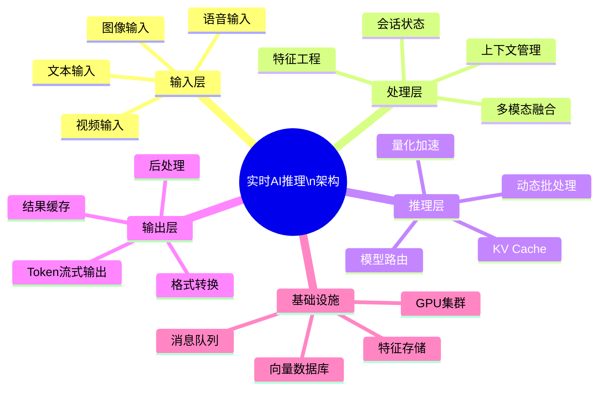
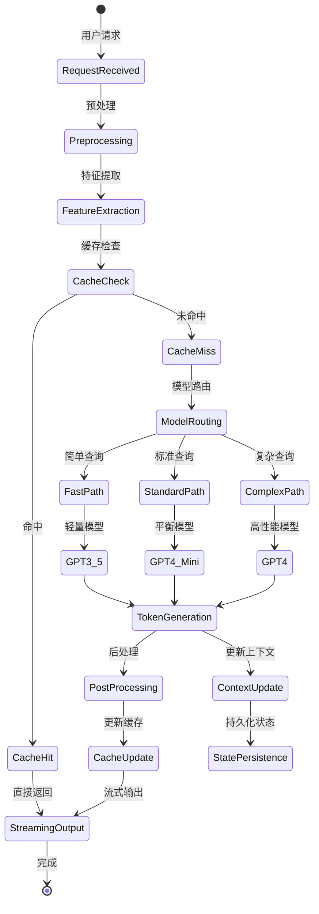
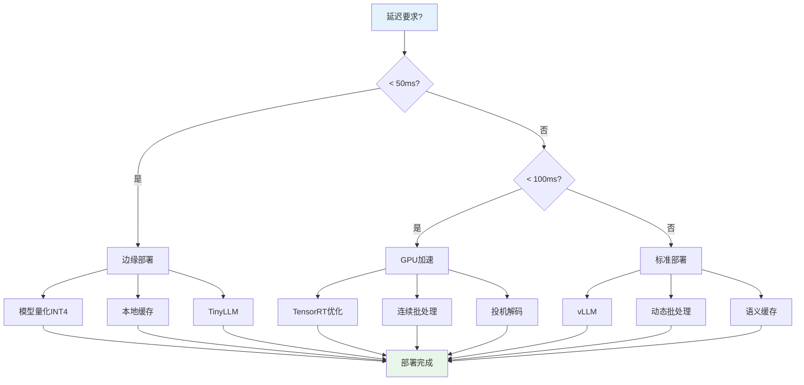

# 实时AI推理架构

> **状态**: 前瞻 | **预计发布时间**: 2026-06 | **最后更新**: 2026-04-12
> 
> ⚠️ 本文档描述的特性处于早期讨论阶段，尚未正式发布。实现细节可能变更。

> 所属阶段: Knowledge/06-frontier | 前置依赖: [实时RAG架构](./real-time-rag-architecture.md), [多模态AI流处理](./multimodal-ai-streaming-architecture.md), [A2A协议与Agent通信](./a2a-protocol-agent-communication.md) | 形式化等级: L4

---

## 1. 概念定义 (Definitions)

### Def-K-06-50: 流式LLM推理管道 (Streaming LLM Inference Pipeline)

**定义**: 流式LLM推理管道是一个七元组 $\mathcal{P}_{LLM} = (\mathcal{I}, \mathcal{F}, \mathcal{M}, \mathcal{L}, \mathcal{O}, \mathcal{C}, \mathcal{R})$，其中：

| 组件 | 符号 | 描述 |
|------|------|------|
| 输入流 | $\mathcal{I}$ | 用户请求流，$\mathcal{I} = \{r_t | r_t = (q_t, u_t, c_t), t \in \mathbb{T}\}$ |
| 特征工程 | $\mathcal{F}$ | 实时特征提取与增强函数，$\mathcal{F}: \mathcal{I} \rightarrow \mathcal{F}'$ |
| 模型服务 | $\mathcal{M}$ | LLM推理服务集群，支持动态路由与负载均衡 |
| 推理层 | $\mathcal{L}$ | LLM推理函数，$\mathcal{L}: (q, ctx) \rightarrow \{token_i\}_{i=1}^{n}$ |
| 输出流 | $\mathcal{O}$ | 生成结果流，支持token级流式输出 |
| 上下文管理 | $\mathcal{C}$ | 多轮对话状态与长期记忆管理 |
| 资源调度 | $\mathcal{R}$ | GPU/CPU计算资源动态调度器 |

**延迟约束**: 首token延迟 $L_{first} \leq 100\text{ms}$，后续token流式输出间隔 $\Delta t \leq 50\text{ms}$。

---

### Def-K-06-51: 实时模型服务 (Real-time Model Serving)

**定义**: 实时模型服务是一个五元组 $\mathcal{S}_{model} = (\mathcal{P}, \mathcal{V}, \mathcal{B}, \mathcal{Q}, \mathcal{W})$：

- **模型池** ($\mathcal{P}$): 部署的模型集合，$\mathcal{P} = \{m_1, m_2, ..., m_n\}$，每个模型 $m_i = (\text{weights}_i, \text{config}_i, \text{version}_i)$
- **版本管理** ($\mathcal{V}$): 模型版本控制与灰度发布机制
- **批处理策略** ($\mathcal{B}$): 动态批处理大小 $B^* = \arg\max_{B} \frac{B}{L(B) \cdot C}$，其中 $L(B)$ 为批处理延迟，$C$ 为并发度
- **请求队列** ($\mathcal{Q}$): 优先级队列，支持抢占式调度
- **预热机制** ($\mathcal{W}$): 模型预热与KV Cache预分配

**服务等级目标 (SLO)**:

| 指标 | p50 | p99 | 目标 |
|------|-----|-----|------|
| 首token延迟 | 50ms | 100ms | < 100ms |
| 吞吐率 | 1000 TPS | - | > 500 TPS |
| 可用性 | - | - | 99.99% |

---

### Def-K-06-52: 多模态流处理 (Multimodal Stream Processing)

**定义**: 多模态流处理算子 $\Phi_{multimodal}$ 将异构数据流统一编码为语义向量空间：

$$\Phi_{multimodal}: \mathcal{S}_{text} \cup \mathcal{S}_{image} \cup \mathcal{S}_{video} \rightarrow \mathcal{S}_{unified}$$

**模态编码器**:

| 模态 | 编码器 | 输出维度 | 典型延迟 |
|------|--------|----------|----------|
| 文本 | Transformer (BERT/CLIP) | 768-1536 | 10-50ms |
| 图像 | Vision Transformer | 512-1024 | 30-100ms |
| 视频 | 时空编码器 | 768-2048 | 100-500ms |
| 音频 | Wave2Vec/Whisper | 768 | 50-200ms |

**统一表示**: 所有模态映射到共享语义空间 $\mathbb{R}^d$，支持跨模态检索与推理。

---

### Def-K-06-53: 流式RAG (Streaming RAG)

**定义**: 流式RAG是实时RAG的增强形式，支持增量知识更新与连续查询流：

$$\text{StreamingRAG}(q_t, \mathcal{K}_t) = \mathcal{L}\left(q_t, \text{TOP\_K}\left(\text{sim}\left(\mathcal{E}(q_t), \mathcal{V}_t\right)\right)\right)$$

其中知识库状态 $\mathcal{K}_t = (\mathcal{V}_t, \mathcal{D}_t)$ 随时间持续演进。

**增量更新协议**:

1. **变更捕获**: CDC捕获文档变更 $\Delta \mathcal{D}$
2. **嵌入计算**: 仅更新变更片段的嵌入 $\Delta \mathcal{V} = \mathcal{E}(\Delta \mathcal{D})$
3. **索引合并**: 向量索引增量更新 $\mathcal{V}_{t+1} = \mathcal{V}_t \oplus \Delta \mathcal{V}$
4. **一致性保证**: 查询时间戳对齐，避免读取部分更新

---

### Def-K-06-54: 低延迟推理优化 (Low-Latency Inference Optimization)

**定义**: 低延迟优化策略集合 $\mathcal{O}_{latency} = \{\text{量化}, \text{缓存}, \text{并行}, \text{预取}\}$：

**量化优化** ($\mathcal{O}_{quant}$):

| 精度 | 存储节省 | 精度损失 | 适用场景 |
|------|----------|----------|----------|
| FP16 | 50% | < 1% | 通用推理 |
| INT8 | 75% | 1-3% | 边缘部署 |
| INT4 | 87.5% | 3-5% | 资源受限 |
| GPTQ/AWQ | 75% | < 2% | 大模型服务 |

**KV Cache管理**:

$$\text{Cache}_{kv} = \{(k_i, v_i) | i \in [1, n_{context}]\}$$

缓存命中率 $\eta$ 与上下文复用率正相关，有效降低重复计算。

---

### Def-K-06-55: GPU加速流处理 (GPU-Accelerated Stream Processing)

**定义**: GPU加速流处理架构 $\mathcal{A}_{gpu} = (\mathcal{K}, \mathcal{M}_{gpu}, \mathcal{T}, \mathcal{S}_{mem})$：

- **内核融合** ($\mathcal{K}$): 将多个算子融合为单个CUDA内核，减少内存搬运
- **内存分层** ($\mathcal{M}_{gpu}$): HBM → L2 → L1 → 寄存器，数据局部性优化
- **张量并行** ($\mathcal{T}$): 模型切分 $M = \bigcup_{i=1}^{N} M_i$，多卡并行推理
- **流式内存** ($\mathcal{S}_{mem}$): CUDA Stream异步内存拷贝与计算重叠

**GPU-CPU协同**: 数据预处理在CPU，推理计算在GPU，结果后处理在CPU，通过Zero-Copy减少延迟。

---

## 2. 属性推导 (Properties)

### Prop-K-06-20: 端到端延迟分解定理

**命题**: 流式LLM推理的端到端延迟可分解为：

$$L_{e2e} = L_{network} + L_{queue} + L_{preprocess} + L_{first\_token} + L_{decode} \cdot n_{tokens}$$

**各组件上界** (p99):

| 组件 | 上界 | 优化手段 |
|------|------|----------|
| $L_{network}$ | 50ms | 边缘部署、连接池 |
| $L_{queue}$ | 20ms | 动态批处理、优先级调度 |
| $L_{preprocess}$ | 30ms | 并行tokenization、缓存 |
| $L_{first\_token}$ | 100ms | 量化、KV Cache、投机解码 |
| $L_{decode}$ | 20ms/token | 连续批处理、PagedAttention |

---

### Prop-K-06-21: 吞吐量-延迟权衡

**命题**: 在固定GPU资源下，系统吞吐量 $\Theta$ 与平均延迟 $\bar{L}$ 存在如下权衡关系：

$$\Theta = \frac{C \cdot B}{\bar{L}(B) + L_{overhead}}$$

其中 $C$ 为并发度，$B$ 为批大小，$L_{overhead}$ 为批处理开销。

**最优操作点**: 当边际吞吐量增益等于边际延迟成本时：

$$\frac{\partial \Theta}{\partial B}\bigg|_{B=B^*} = \frac{\partial \bar{L}}{\partial B}\bigg|_{B=B^*}$$

---

### Lemma-K-06-15: 模型切换延迟引理

**引理**: 模型热切换延迟 $L_{switch}$ 满足：

$$L_{switch} \leq L_{unload} + L_{load} + L_{warmup}$$

在预加载配置下，可实现无缝切换：$L_{switch} \approx 0$。

**证明概要**:

1. 预加载所有候选模型到GPU内存，采用LRU淘汰策略
2. 模型权重共享底层存储，切换仅更新指针
3. KV Cache预热复用历史会话 $\square$

---

### Lemma-K-06-16: 多模态对齐引理

**引理**: 多模态编码器在共享语义空间中的对齐误差有界：

$$\|\mathcal{E}_{text}(t) - \mathcal{E}_{image}(v)\|_2 \leq \epsilon_{align}$$

当 $(t, v)$ 为语义对应对时，$\epsilon_{align} < 0.1$ (归一化后)。

---

## 3. 关系建立 (Relations)

### 3.1 与流计算模型的映射

```
┌─────────────────────────────────────────────────────────────────┐
│                  实时AI推理 × 流计算映射                          │
├─────────────────────────────────────────────────────────────────┤
│  AI推理概念              │  Flink抽象                            │
├──────────────────────────┼───────────────────────────────────────┤
│  用户请求流              │  DataStream<Request>                  │
│  特征工程管道            │  ProcessFunction<FeatureExtraction>   │
│  模型推理                │  AsyncFunction<ML_PREDICT>            │
│  结果流                  │  DataStream<Response>                 │
│  上下文状态              │  KeyedStateStore<Conversation>        │
│  模型版本路由            │  BroadcastStream<ModelConfig>         │
│  A2A Agent通信           │  ConnectedStreams<AgentMessage>       │
└──────────────────────────┴───────────────────────────────────────┘
```

### 3.2 架构层次关系

```
┌──────────────────────────────────────────────────────────────────────┐
│                        应用层 (Application)                           │
│  ┌─────────────┐  ┌─────────────┐  ┌─────────────┐  ┌─────────────┐ │
│  │ 智能客服    │  │ 代码补全    │  │ 内容生成    │  │ 实时分析    │ │
│  └─────────────┘  └─────────────┘  └─────────────┘  └─────────────┘ │
└──────────────────────────────────────────────────────────────────────┘
                                    ▼
┌──────────────────────────────────────────────────────────────────────┐
│                        服务层 (Service Layer)                         │
│  ┌─────────────┐  ┌─────────────┐  ┌─────────────┐  ┌─────────────┐ │
│  │ LLM Gateway │  │ RAG Engine  │  │ Agent Hub   │  │ MCP Server  │ │
│  │  (路由/限流) │  │ (检索增强)  │  │ (A2A协作)   │  │ (工具接口)  │ │
│  └─────────────┘  └─────────────┘  └─────────────┘  └─────────────┘ │
└──────────────────────────────────────────────────────────────────────┘
                                    ▼
┌──────────────────────────────────────────────────────────────────────┐
│                        计算层 (Compute Layer)                         │
│  ┌───────────────────────────────────────────────────────────────┐  │
│  │              Apache Flink / Stateful Functions                 │  │
│  │  ┌─────────┐  ┌─────────┐  ┌─────────┐  ┌─────────────────┐  │  │
│  │  │ Feature │→ │  LLM    │→ │ Post    │→ │  Response       │  │  │
│  │  │ Extract │  │ Inference│  │ Process │  │  Streaming      │  │  │
│  │  └─────────┘  └─────────┘  └─────────┘  └─────────────────┘  │  │
│  └───────────────────────────────────────────────────────────────┘  │
└──────────────────────────────────────────────────────────────────────┘
                                    ▼
┌──────────────────────────────────────────────────────────────────────┐
│                        模型层 (Model Layer)                           │
│  ┌─────────────┐  ┌─────────────┐  ┌─────────────┐  ┌─────────────┐ │
│  │ OpenAI API  │  │ Claude API  │  │ 自托管vLLM  │  │ TensorRT-LLM│ │
│  │ (GPT-4/o3)  │  │ (Sonnet)    │  │ (Llama3)    │  │ (优化推理)  │ │
│  └─────────────┘  └─────────────┘  └─────────────┘  └─────────────┘ │
└──────────────────────────────────────────────────────────────────────┘
                                    ▼
┌──────────────────────────────────────────────────────────────────────┐
│                        基础设施层 (Infrastructure)                    │
│  ┌─────────────┐  ┌─────────────┐  ┌─────────────┐  ┌─────────────┐ │
│  │ GPU Cluster │  │ Vector DB   │  │ Feature Store│  │ Message Queue│ │
│  │ (A100/H100) │  │ (Milvus)    │  │ (Feast)      │  │ (Kafka)     │ │
│  └─────────────┘  └─────────────┘  └─────────────┘  └─────────────┘ │
└──────────────────────────────────────────────────────────────────────┘
```

### 3.3 A2A/MCP与流处理集成关系

| 协议 | 功能 | 流处理集成方式 |
|------|------|----------------|
| A2A | Agent间通信 | Flink ConnectedStreams实现消息路由 |
| MCP | 模型上下文协议 | 自定义Source/Sink连接MCP Server |
| Function Calling | 工具调用 | AsyncFunction异步调用外部API |
| Streaming Response | 流式响应 | Flink ProcessFunction逐token输出 |

---

## 4. 论证过程 (Argumentation)

### 4.1 架构选型论证：实时 vs 批处理

**Q: 为何选择流式架构而非批处理？**

| 维度 | 批处理方案 | 流式方案 |
|------|------------|----------|
| 用户感知延迟 | 秒级/分钟级 | 毫秒级/亚秒级 |
| 上下文连续性 | 断开 | 保持对话状态 |
| 资源利用 | 周期性峰值 | 平滑持续 |
| 复杂度 | 需调度+存储ETL | 统一流处理语义 |
| 成本效益 | 按需启动有冷启动 | 常驻服务无延迟 |

**结论**: 实时交互场景（客服、代码补全）要求即时响应，流式架构是必要条件。

### 4.2 模型提供商选型矩阵

| 提供商 | 延迟(p99) | 成本/1M tokens | 适用场景 |
|--------|-----------|----------------|----------|
| OpenAI GPT-4o | 150ms | $30 (输入) | 通用推理、复杂任务 |
| OpenAI GPT-4o-mini | 80ms | $0.60 | 简单任务、高吞吐 |
| Claude 3.5 Sonnet | 200ms | $3 (输入) | 长上下文、推理任务 |
| Claude 3 Haiku | 100ms | $0.25 | 实时应用、边缘场景 |
| Azure OpenAI | 120ms | $30 (输入) | 企业合规、私有化 |
| 自托管vLLM | 50ms | 硬件成本 | 高频推理、数据隐私 |

### 4.3 反例分析：纯API调用的局限性

**场景**: 直接调用OpenAI API，无流处理层

**问题**:

1. **无状态**: 每次请求独立，无法维护用户会话上下文
2. **无缓存**: 重复查询产生冗余成本和延迟
3. **无熔断**: API故障直接导致服务中断
4. **无优化**: 无法实施批处理、量化等优化

**教训**: 生产级AI推理需要流处理层提供状态管理、缓存、容错等能力。

---

## 5. 形式证明 / 工程论证 (Proof / Engineering Argument)

### Thm-K-06-10: 流式推理正确性定理

**定理**: 在满足以下条件时，流式LLM推理系统输出与批处理等价：

1. **顺序性**: 请求按事件时间顺序处理
2. **确定性**: 相同输入产生相同输出（温度=0）
3. **状态隔离**: 不同用户会话状态严格隔离
4. **原子性**: 状态更新与输出生成原子执行

**证明**:

设批处理输出为 $Y_{batch} = \{y_1, y_2, ..., y_n\}$，流式处理输出为 $Y_{stream}$。

由条件1，请求顺序一致；由条件3，各请求处理独立；由条件4，每请求处理原子。

对任意请求 $r_i$，批处理计算 $y_i = f(r_i, s_i)$，流式计算 $y_i' = f(r_i, s_i')$。

由条件2和4，$s_i = s_i'$（状态一致），故 $y_i = y_i'$。

由数学归纳法，$\forall i \in [1,n], y_i = y_i'$，即 $Y_{batch} = Y_{stream}$ $\square$

### Thm-K-06-11: 延迟优化上限定理

**定理**: 在硬件资源约束下，首token延迟存在理论下界：

$$L_{first}^{min} = \frac{|M| \cdot d_{model}}{B_{mem}} + L_{compute}$$

其中 $|M|$ 为模型参数量，$d_{model}$ 为数据精度字节数，$B_{mem}$ 为内存带宽，$L_{compute}$ 为计算延迟。

**工程推论**:

- 量化降低 $d_{model}$，可直接减少内存传输时间
- 模型切分提高并行度，降低单卡计算延迟
- 投机解码(Speculative Decoding)可降低平均 $L_{first}$

### Thm-K-06-12: 成本效益优化定理

**定理**: 设总请求量为 $N$，分层模型路由策略的成本为：

$$C_{total} = \sum_{i=1}^{k} N_i \cdot c_i$$

其中 $N_i$ 为路由到第 $i$ 层模型的请求数，$c_i$ 为单位成本，$\sum N_i = N$。

在准确率约束 $Acc \geq Acc_{min}$ 下，最优路由策略满足：

$$\min C_{total} \quad \text{s.t.} \quad \sum_{i=1}^{k} N_i \cdot acc_i \geq N \cdot Acc_{min}$$

**解法**: 动态阈值路由，简单查询用低成本模型，复杂查询路由到高性能模型。

---

## 6. 实例验证 (Examples)

### 6.1 实例：实时智能客服系统

**场景**: 电商平台7×24小时智能客服，处理订单查询、退换货、产品咨询

**架构设计**:

```
用户消息 → Kafka → Flink Agent → 意图识别 → 路由策略
                                      ↓
                    ┌─────────────────┼─────────────────┐
                    ↓                 ↓                 ↓
                [FAQ检索]      [订单查询]          [人工转接]
                    ↓                 ↓                 ↓
                向量检索 → LLM生成   SQL查询           工单创建
                    ↓                 ↓                 ↓
                    └─────────────────┴─────────────────┘
                                      ↓
                              响应流式输出
```

**核心代码**:

```java
import org.apache.flink.streaming.api.environment.StreamExecutionEnvironment;

import org.apache.flink.streaming.api.datastream.DataStream;


public class CustomerServiceAgent {

    public static void main(String[] args) throws Exception {
        StreamExecutionEnvironment env =
            StreamExecutionEnvironment.getExecutionEnvironment();

        // 用户消息流
        DataStream<UserMessage> messages = env
            .fromSource(kafkaSource, WatermarkStrategy.noWatermarks(), "messages")
            .keyBy(UserMessage::getSessionId);

        // Agent处理流程
        DataStream<Response> responses = messages
            .process(new IntentRecognitionFunction())      // 意图识别
            .keyBy(ClassifiedRequest::getSessionId)
            .process(new ContextEnrichmentFunction())      // 上下文增强
            .process(new LLMInferenceFunction())           // LLM推理
            .process(new ResponseFormattingFunction());    // 响应格式化

        // 输出到WebSocket
        responses.addSink(websocketSink);

        env.execute("Customer Service Agent");
    }
}
```

**性能数据**:

| 指标 | 数值 | 说明 |
|------|------|------|
| 并发会话 | 10,000+ | 同时在线对话 |
| 平均响应时间 | 800ms | 首字符到首响应 |
| 问题解决率 | 85% | 无需人工介入 |
| 日均处理量 | 500,000+ | 消息数 |

---

### 6.2 实例：实时代码补全系统

**场景**: IDE插件，基于上下文提供代码补全建议

**延迟要求**: p99 < 100ms（用户感知阈值）

**优化策略**:

```python
# 延迟优化架构
class CodeCompletionService:
    def __init__(self):
        self.cache = LRUCache(maxsize=10000)  # 语义缓存
        self.model_pool = ModelPool()          # 多模型池

    async def complete(self, context: CodeContext) -> List[Suggestion]:
        # 1. 缓存检查 (5ms)
        cache_key = self.hash_context(context)
        if cached := self.cache.get(cache_key):
            return cached

        # 2. 模型选择 (2ms)
        model = self.model_pool.select(
            complexity=context.complexity,
            latency_budget=90  # ms
        )

        # 3. 并行推理 (50ms)
        suggestions = await asyncio.gather(*[
            self.infer(model, context, temperature=t)
            for t in [0.0, 0.3, 0.7]  # 多温度采样
        ])

        # 4. 后处理与缓存 (10ms)
        result = self.deduplicate_and_rank(suggestions)
        self.cache[cache_key] = result

        return result
```

**性能优化效果**:

| 优化手段 | 延迟降低 | 实现复杂度 |
|----------|----------|------------|
| 语义缓存 | -60% | 低 |
| 模型量化(INT8) | -40% | 中 |
| 投机解码 | -30% | 高 |
| 连续批处理 | +200%吞吐 | 中 |

---

### 6.3 实例：实时内容生成流水线

**场景**: 营销文案自动生成，基于产品数据流实时生成描述

**数据流**:

```
产品数据(CDC) → Flink → 特征工程 → 多模态生成 → 人工审核 → 发布
                            ↓
                    ┌───────┴───────┐
                    ↓               ↓
              [文案生成]      [图片生成]
                    ↓               ↓
                    └───────┬───────┘
                            ↓
                      一致性校验
```

**Flink SQL实现**:

```sql
-- 产品数据流
CREATE TABLE product_stream (
    product_id STRING,
    name STRING,
    category STRING,
    attributes MAP<STRING, STRING>,
    image_url STRING,
    event_time TIMESTAMP(3),
    WATERMARK FOR event_time AS event_time - INTERVAL '5' SECOND
) WITH (
    'connector' = 'kafka',
    'topic' = 'product_updates',
    'format' = 'json'
);

-- 文案生成结果
CREATE TABLE content_output (
    product_id STRING,
    title STRING,
    description STRING,
    generated_image_url STRING,
    confidence FLOAT,
    status STRING
) WITH (
    'connector' = 'jdbc',
    'url' = 'jdbc:postgresql://db/content'
);

-- 生成流水线
INSERT INTO content_output
SELECT
    product_id,
    ML_PREDICT('text-generation',
        CONCAT('生成商品标题：', name, ' 类别：', category)) as title,
    ML_PREDICT('text-generation',
        CONCAT('生成商品描述：', name, ' 属性：', TO_JSON(attributes))) as description,
    ML_PREDICT('image-generation', image_url) as generated_image_url,
    0.95 as confidence,
    'pending_review' as status
FROM product_stream
WHERE category IN ('electronics', 'fashion', 'home');
```

---

## 7. 可视化 (Visualizations)

### 7.1 实时AI推理架构思维导图



### 7.2 流式LLM推理Pipeline执行树



### 7.3 低延迟优化决策树



### 7.4 多模态流处理架构图

```mermaid
graph TB
    subgraph Input[输入层]
        T[文本流]
        I[图像流]
        V[视频流]
        A[音频流]
    end

    subgraph Encode[编码层]
        TE[Text Encoder<br/>BERT/CLIP]
        IE[Image Encoder<br/>ViT]
        VE[Video Encoder<br/>TimeSformer]
        AE[Audio Encoder<br/>Whisper]
    end

    subgraph Fusion[融合层]
        F[Cross-Modal Fusion<br/>注意力机制]
        AF[Alignment Function<br/>投影到统一空间]
    end

    subgraph Storage[存储层]
        VS[Vector Store<br/>Milvus]
        FS[Feature Store
        KS[Knowledge Graph]
    end

    subgraph Inference[推理层]
        LLM[Multi-Modal LLM<br/>GPT-4V/Claude 3]
        OUT[统一输出]
    end

    T --> TE
    I --> IE
    V --> VE
    A --> AE

    TE --> AF
    IE --> AF
    VE --> AF
    AE --> AF

    AF --> F
    F --> VS
    F --> FS
    F --> KS

    VS --> LLM
    FS --> LLM
    KS --> LLM

    LLM --> OUT
```

---

## 8. 引用参考 (References)


---

## 附录A: 核心参数速查表

| 参数 | 推荐值 | 说明 |
|------|--------|------|
| 批处理大小 | 16-64 | 动态调整范围 |
| KV Cache块大小 | 16-32 tokens | PagedAttention配置 |
| 量化精度 | INT8/FP16 | 平衡精度与速度 |
| 最大并发 | 100-1000 | 根据GPU显存调整 |
| 请求超时 | 30s | 含队列等待 |
| 流式缓冲区 | 4 tokens | 平滑输出 |
| 语义缓存TTL | 1小时 | 根据业务调整 |

## 附录B: 成本估算模型

**月度成本构成** (100万请求/天):

| 组件 | 配置 | 成本(USD/月) |
|------|------|--------------|
| GPU实例 | 4×A100 | $4,000 |
| Flink集群 | 10节点 | $800 |
| 向量数据库 | Milvus集群 | $600 |
| OpenAI API | 约500M tokens | $3,000 |
| 缓存层 | Redis集群 | $200 |
| 监控运维 | - | $400 |
| **总计** | - | **$9,000** |

**单位请求成本**: ~$0.0003/请求
