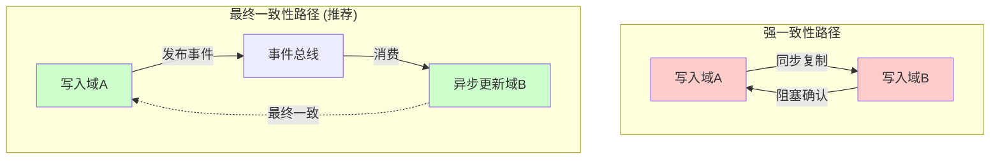
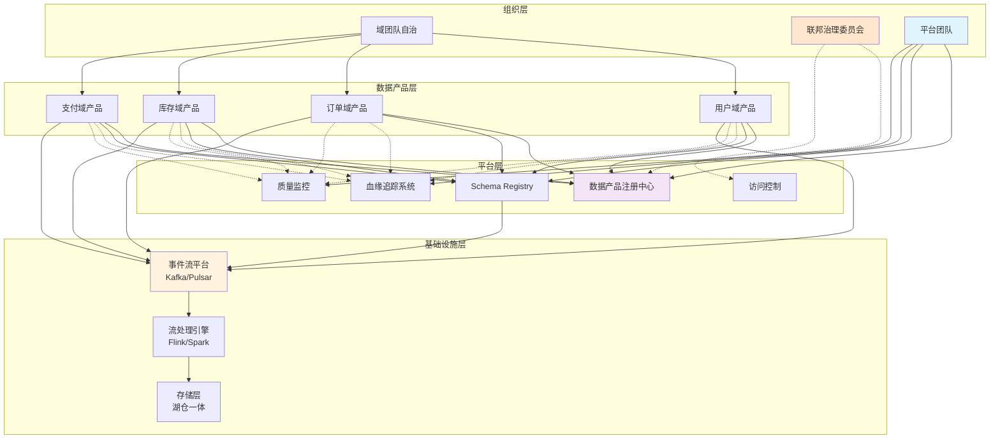
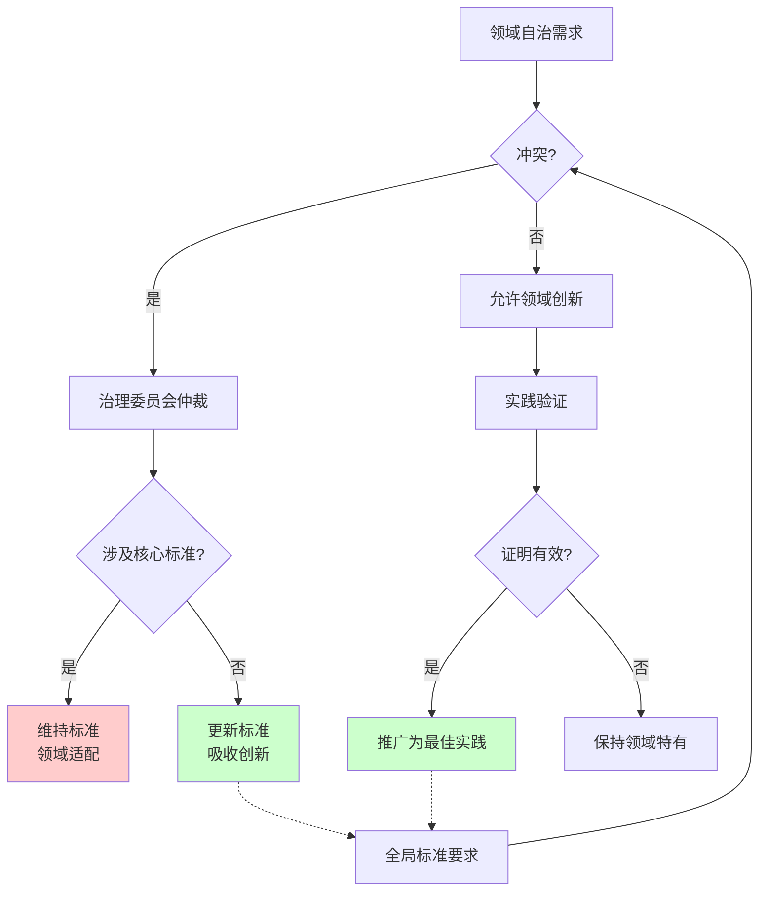
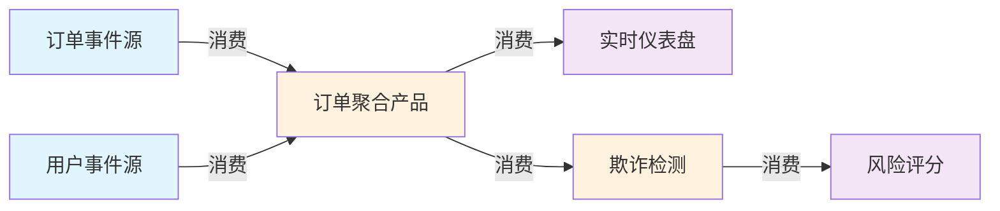
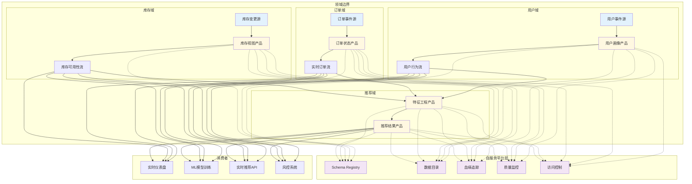
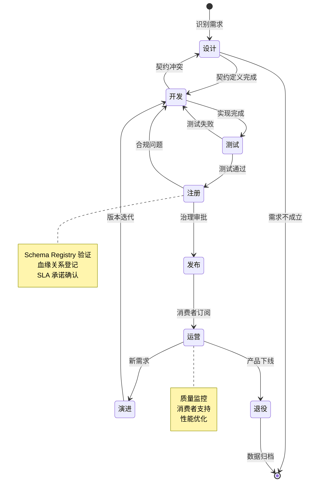
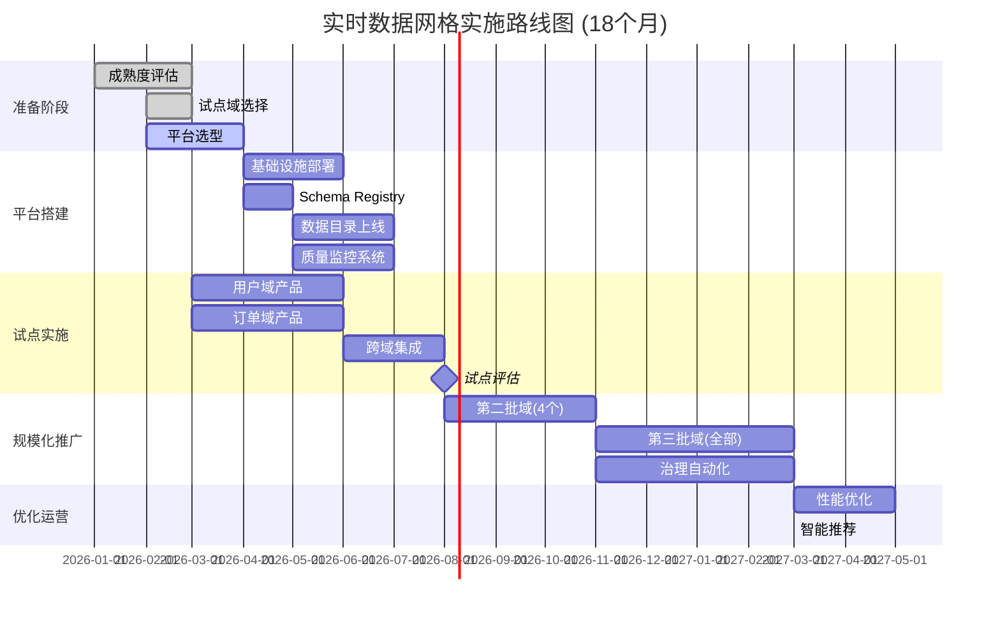
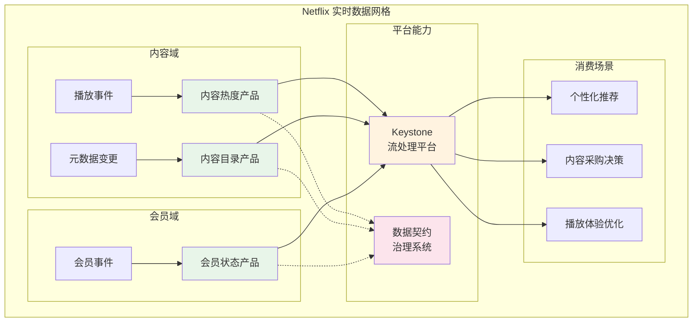

# 实时数据网格 (Data Mesh) 架构实践

> **所属阶段**: Knowledge/06-frontier | **前置依赖**: [streaming-data-mesh-architecture.md](./streaming-data-mesh-architecture.md), [data-mesh-streaming-architecture-2026.md](../03-business-patterns/data-mesh-streaming-architecture-2026.md), [realtime-data-product-architecture.md](./realtime-data-product-architecture.md) | **形式化等级**: L4 (工程实践级)

---

## 1. 概念定义 (Definitions)

### Def-K-06-201: 实时数据网格 (Real-time Data Mesh)

> **数据网格**是一种去中心化的数据架构范式，将数据视为产品，由领域团队拥有，通过自服务平台实现联邦式治理。实时数据网格特指以**事件流**为主要数据产品接口，支持低延迟数据消费的数据网格实现。

```
传统数据架构          vs.        数据网格架构
┌──────────────────┐          ┌────────────────────────────────┐
│   中央数据湖/仓    │          │  域A产品 │ 域B产品 │ 域C产品  │
│  (集中式ETL管道)   │   →→→   │    ↓    │   ↓    │   ↓     │
│   单一团队瓶颈     │          │  自服务平台 + 联邦治理层        │
└──────────────────┘          └────────────────────────────────┘
```

### Def-K-06-202: 域数据产品 (Domain Data Product)

> **域数据产品**是数据网格中的基本构建单元，包含三个核心组件：
>
> - **数据**: 领域业务实体的实时/批量数据集
> - **元数据**: 描述数据语义、质量、血缘的上下文信息
> - **接口**: 标准化的数据访问端点（事件流、API、文件等）

数据产品遵循**"代码优先"(Code-First)**原则，将数据 Schema、处理逻辑、质量规则作为版本化制品管理。

### Def-K-06-203: 数据契约 (Data Contract)

> **数据契约**是数据提供者与消费者之间的正式协议，定义：
>
> - Schema 结构（字段、类型、约束）
> - 服务质量指标（延迟、可用性、新鲜度）
> - 兼容性规则（向前/向后兼容策略）
> - 语义定义（业务术语、计算逻辑）

```yaml
# 数据契约示例 (data-contract.yaml)
contract:
  id: "user-profile-v2"
  owner: "customer-domain@company.com"

  schema:
    type: "avro"
    definition: |
      {
        "type": "record",
        "name": "UserProfile",
        "fields": [
          {"name": "userId", "type": "string"},
          {"name": "tier", "type": {"type": "enum", "name": "Tier", "symbols": ["FREE", "PREMIUM"]}},
          {"name": "updatedAt", "type": "long", "logicalType": "timestamp-millis"}
        ]
      }

  sla:
    freshness: "PT5S"           # 5秒新鲜度
    availability: "99.99%"      # 四个9可用性
    latency_p99: "100ms"        # P99延迟

  compatibility:
    policy: "BACKWARD_FORWARD"  # 双向兼容
    deprecation_period: "90d"   # 90天弃用期
```

### Def-K-06-204: 联邦治理 (Federated Governance)

> **联邦治理**是一种分布式治理模式，在保持领域自治的前提下，通过**全局标准**实现跨域互操作性。核心治理维度包括：
>
> - **互操作性标准**: 通用数据格式、标识符、协议
> - **可发现性标准**: 统一的元数据目录、数据产品注册
> - **可访问性标准**: 认证授权、数据安全分级
> - **质量期望**: 可观测性指标、SLA 基线

### Def-K-06-205: 自服务数据平台 (Self-serve Data Platform)

> **自服务数据平台**是赋能领域团队独立构建、发布、运维数据产品的技术基础设施，提供：
>
> - **基础设施抽象**: 隐藏底层存储、计算复杂性
> - **数据产品生命周期管理**: 从开发到退役的完整工具链
> - **治理自动化**: 策略即代码、合规检查流水线

---

## 2. 属性推导 (Properties)

### Lemma-K-06-201: 数据网格的去中心化优势

> 去中心化架构在以下维度具有系统性优势：
>
> 1. **可扩展性**: 消除中央数据团队的瓶颈，领域可独立演进
> 2. **领域对齐**: 数据模型与业务边界一致，语义保真度高
> 3. **变革速度**: 领域团队直接响应业务需求，缩短交付周期

**证明概要**: 设中央数据团队处理 N 个领域的需求，处理时间为 O(N)。去中心化后，每个领域独立处理，复杂度降为 O(1)（领域内部），整体吞吐量为 N × O(1) = O(N)，但消除了队列等待延迟。

### Prop-K-06-130: 事件流作为数据产品接口的必要性

> 在实时数据网格中，**事件流(Event Stream)**是唯一满足以下全部要求的数据产品接口：
>
> - 低延迟推送（< 1秒）
> - 解耦生产与消费
> - 支持多消费者并发订阅
> - 天然的时间序列语义

**论证**: 请求-响应 API 需要消费者轮询，增加延迟；文件接口需要批量积累，违背实时性；只有事件流通过发布-订阅模式，在保持低延迟的同时实现多消费者解耦。

### Prop-K-06-131: 数据契约的兼容性传播

> 设数据产品 DP 有 n 个下游消费者 {C₁, C₂, ..., Cₙ}。若 DP 的契约变更遵循声明的兼容性策略，则下游消费者可在**零协调成本**下平滑升级。

| 兼容性策略 | Schema 变更示例 | 消费者影响 |
|-----------|----------------|-----------|
| BACKWARD | 新增可选字段 | 旧消费者忽略新字段，继续运行 |
| FORWARD | 删除可选字段 | 新消费者不依赖该字段，旧数据可读 |
| FULL | 新增可选字段 + 删除可选字段 | 新旧版本互操作 |
| NONE | 字段类型变更 | 需所有消费者同步升级 |

### Thm-K-06-130: 实时数据网格的 CAP 权衡

> 实时数据网格在分区容忍性(P)的前提下，选择**可用性(A)**优先于**强一致性(C)**，通过**最终一致性**保证数据正确性。

**工程论证**:

- **分区容忍性(P)**: 跨域数据产品的分布式本质决定了 P 不可放弃
- **可用性(A)**: 实时业务决策依赖持续的数据流，不可用代价高昂
- **一致性(C)**: 采用事件溯源(Event Sourcing)和 CQRS 模式，通过异步投影实现最终一致



---

## 3. 关系建立 (Relations)

### 数据网格与既有架构范式的映射

| 架构范式 | 核心抽象 | 与数据网格的关系 | 适用场景 |
|---------|---------|----------------|---------|
| **Data Lake** | 集中式存储 | 数据网格可建立在数据湖之上，但将所有权分散 | 批处理分析 |
| **Data Fabric** | 元数据驱动的自动化 | 数据网格关注组织治理，两者可互补 | 跨云数据集成 |
| **Lambda架构** | 批流分离 | 数据网格中的域产品可独立选择处理模式 | 混合负载 |
| **Kappa架构** | 纯流处理 | 与实时数据网格理念高度一致 | 纯实时场景 |
| **Event Sourcing** | 事件为真相源 | 数据网格数据产品的内部实现模式 | 审计追踪 |
| **CQRS** | 读写分离 | 数据产品接口设计的模式参考 | 高读负载 |

### 数据网格层级结构



---

## 4. 论证过程 (Argumentation)

### 4.1 为什么传统数据架构无法满足实时需求

**问题分析**:

1. **ETL 瓶颈**: 传统架构中，中央数据团队维护复杂的 ETL 管道，任何新数据源接入都需要排队等待
2. **语义漂移**: 领域数据经多次转换后，业务语义丢失，数据消费者难以理解
3. **延迟累积**: 批处理模式下的 T+1 延迟无法满足实时决策需求

**数据网格的解决思路**:

```
传统模式:
业务系统 → [ETL管道 - 领域A等待] → 中央数据湖 → [ETL管道 - 领域B等待] → 数据仓库 → 分析应用

数据网格模式:
业务系统 → 领域A数据产品(实时流) ─┬─→ 分析应用A
                                 ├─→ 分析应用B
                                 └─→ 领域B数据产品(消费并增强) ──→ 分析应用C
```

### 4.2 实时数据产品的反模式

| 反模式 | 描述 | 后果 | 改进方案 |
|-------|------|------|---------|
| **巨数据产品** | 单个数据产品暴露过多实体 | 消费者难以理解，变更影响面广 | 按业务子域拆分 |
| **私有协议** | 使用非标准格式/协议 | 互操作性差，集成成本高 | 采用 Avro/Protobuf + Kafka |
| **无版本契约** | Schema 变更无通知、无兼容策略 | 下游消费者频繁中断 | 强制执行数据契约 |
| **暗数据** | 数据产品存在但无法被发现 | 重复建设，资源浪费 | 强制注册到数据目录 |
| **过度实时** | 所有数据都追求毫秒级延迟 | 成本过高，收益递减 | 按 SLA 分级设计 |

### 4.3 联邦治理的边界讨论

**自治 vs. 标准的张力**:



---

## 5. 形式证明 / 工程论证 (Proof / Engineering Argument)

### Thm-K-06-131: 数据契约验证的完备性

> 通过 Schema Registry 实现的自动化契约验证，可**完全阻止**违反兼容性策略的数据发布。

**工程论证**:

设兼容性检查函数为 `validate(schema_old, schema_new, policy)`，返回布尔值表示是否允许注册。

```python
# 伪代码:兼容性验证算法
def validate(old_schema, new_schema, policy):
    if policy == "BACKWARD":
        # 新 schema 必须能读取旧数据
        return can_read(new_schema, old_schema)
    elif policy == "FORWARD":
        # 旧 schema 必须能读取新数据
        return can_read(old_schema, new_schema)
    elif policy == "FULL":
        return (can_read(new_schema, old_schema) and
                can_read(old_schema, new_schema))
    else:  # NONE
        return True

def can_read(reader_schema, writer_schema):
    # Avro 规范:字段匹配规则
    # 1. writer 字段,reader 必须有同名字段
    # 2. 类型必须兼容
    # 3. 无默认值字段不能缺失
    return avro_compatibility_check(reader_schema, writer_schema)
```

**证明要点**:

1. Schema Registry 作为数据发布的**必经网关**
2. 兼容性检查在**注册阶段**完成，而非消费阶段
3. 违规 schema 被拒绝，无法传播到下游

### Thm-K-06-132: 血缘追踪的传递闭包

> 若数据网格的血缘追踪系统记录每个数据产品的**直接依赖**，则通过传递闭包可**完整重建**任意数据产品的全部上游血缘。

**工程实现**:



**血缘查询示例**:

```sql
-- 递归查询:获取 F(风险评分) 的完整上游
WITH RECURSIVE lineage AS (
    -- 锚点:目标数据产品
    SELECT product_id, product_name, source_product_id
    FROM data_products
    WHERE product_id = 'risk-score-v1'

    UNION ALL

    -- 递归:向上追溯
    SELECT dp.product_id, dp.product_name, dp.source_product_id
    FROM data_products dp
    JOIN lineage l ON dp.product_id = l.source_product_id
)
SELECT * FROM lineage;

-- 结果: F → E → B → [A, C]
```

---

## 6. 实例验证 (Examples)

### 6.1 技术实现：端到端数据产品流水线

```yaml
# data-product-definition.yaml
apiVersion: datamesh.company.io/v1
kind: DataProduct
metadata:
  name: user-behavior-stream
  domain: customer-experience
  owner: team-ce@company.com
spec:
  inputs:
    - source: kafka://events/user-clicks
      format: json
    - source: kafka://events/page-views
      format: json

  processing:
    engine: flink
    sql: |
      CREATE TABLE user_behavior (
        user_id STRING,
        event_type STRING,
        page_url STRING,
        event_time TIMESTAMP(3),
        WATERMARK FOR event_time AS event_time - INTERVAL '5' SECOND
      ) WITH (...);

      INSERT INTO output_stream
      SELECT
        user_id,
        event_type,
        COUNT(*) OVER (
          PARTITION BY user_id
          ORDER BY event_time
          RANGE BETWEEN INTERVAL '10' MINUTE PRECEDING AND CURRENT ROW
        ) as event_count_10m
      FROM user_behavior;

  output:
    topic: dataproduct.customer-experience.user-behavior
    format: avro
    schemaRegistry: https://schema-registry.company.io

  quality:
    freshness_sla: "PT30S"
    completeness_threshold: 0.999
    schema_compatibility: BACKWARD_FORWARD

  access:
    auth: mTLS
    consumers:
      - domain: personalization
        permissions: [read]
      - domain: analytics
        permissions: [read]
```

### 6.2 组织变革：域团队结构模板

```
┌─────────────────────────────────────────────────────────────┐
│                    用户域 (User Domain)                      │
│                     数据产品团队结构                          │
├─────────────────────────────────────────────────────────────┤
│                                                             │
│  ┌─────────────────┐  ┌─────────────────┐  ┌─────────────┐ │
│  │   数据产品负责人  │  │  领域工程师 x2   │  │  数据工程师  │ │
│  │  (Data Product   │  │  (Domain         │  │  (Data      │ │
│  │   Owner)         │  │   Engineers)     │  │   Engineer) │ │
│  │                  │  │                  │  │             │ │
│  │ • 产品愿景        │  │ • 业务规则实现    │  │ • 管道开发   │ │
│  │ • 优先级决策      │  │ • 质量规则定义    │  │ • 性能优化   │ │
│  │ • 消费者对接      │  │ • 语义验证        │  │ • 监控告警   │ │
│  │ • 治理协调        │  │ • 消费者支持      │  │ • 故障响应   │ │
│  └─────────────────┘  └─────────────────┘  └─────────────┘ │
│                                                             │
│  平台支持: 数据平台团队提供基础设施、工具链、最佳实践指导        │
└─────────────────────────────────────────────────────────────┘
```

### 6.3 实施路径：成熟度模型

| 维度 | Level 1 (初始) | Level 2 (可重复) | Level 3 (定义) | Level 4 (管理) | Level 5 (优化) |
|-----|---------------|-----------------|---------------|---------------|---------------|
| **数据产品** | 少数试点 | 多个域有产品 | 全产品线覆盖 | 产品化运营 | 自动优化推荐 |
| **契约管理** | 文档约定 | Schema 版本化 | 自动化验证 | SLA 监控 | 智能兼容性建议 |
| **血缘追踪** | 手动记录 | 部分自动化 | 全链路自动 | 影响分析 | 预测性血缘 |
| **治理模式** | 集中审批 | 联邦初建 | 标准成熟 | 自治+监督 | 自适应治理 |
| **平台能力** | 基础工具 | 自助上线 | 全生命周期 | 智能运维 | 平台即产品 |

---

## 7. 可视化 (Visualizations)

### 图1: 实时数据网格整体架构



### 图2: 数据产品生命周期



### 图3: 实施路线图甘特图



### 图4: Netflix 数据网格简化架构



---

## 8. 引用参考 (References)


---

*文档版本: v1.0 | 最后更新: 2026-04-03 | 状态: 完整*
