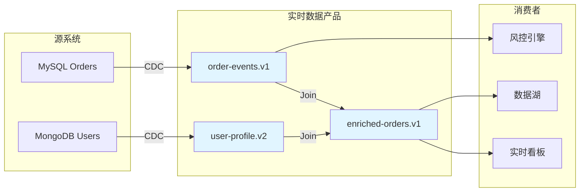
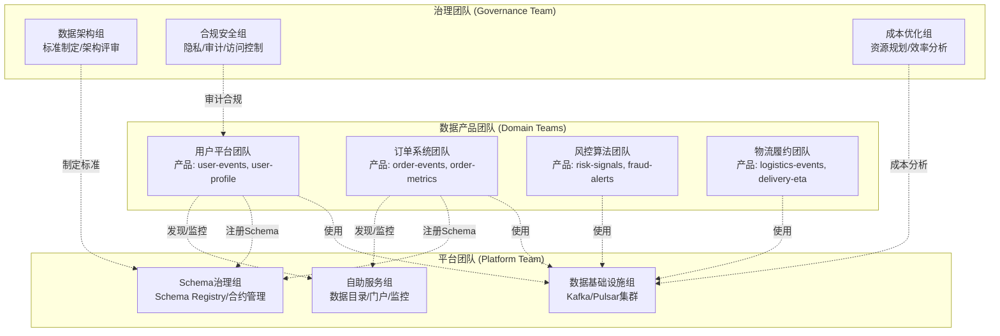
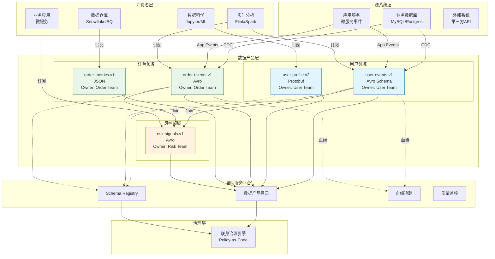
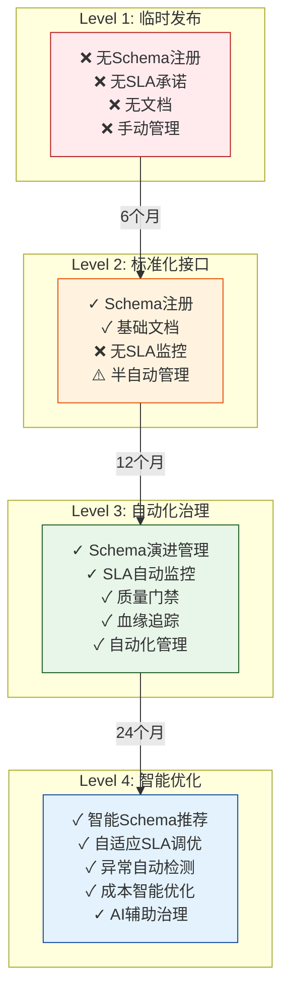
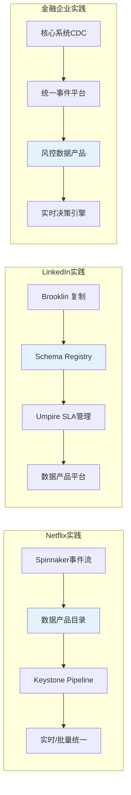

# 实时数据产品架构：Data Mesh + Streaming

> 所属阶段: Knowledge | 前置依赖: [Data Mesh架构](./streaming-data-mesh-architecture.md), [流计算系统设计](../01-concept-atlas/streaming-models-mindmap.md) | 形式化等级: L4

---

## 1. 概念定义 (Definitions)

### Def-K-06-101: 实时数据产品 (Real-time Data Product)

实时数据产品是一个**自治的领域边界内**，以**流式接口**为核心暴露机制，具备**自描述契约**、**质量SLA保障**和**全生命周期可观测性**的数据资产单元。

形式化定义：

```
DataProduct := ⟨Domain, Schema, Interface, SLA, Metadata, Lineage⟩

其中:
- Domain ⊆ Organization: 领域边界,满足 Domain ≠ ∅
- Schema ∈ Avro|Protobuf|JSON-Schema: 结构化契约
- Interface := {StreamingAPI, QueryAPI, FileAPI} 的幂等组合
- SLA := ⟨Availability, Latency, Freshness, Accuracy⟩ ∈ ℝ⁴
- Metadata ∈ DCAT|DataHub|OpenMetadata: 可发现性元数据
- Lineage: 血缘图,表示为 DAG(Inputs → Transform → Output)
```

### Def-K-06-102: 流式数据产品接口 (Streaming Data Product Interface)

流式数据产品接口是数据产品通过**事件流**向消费者暴露数据的契约化端点，具备有序性、持久性和可重放性。

```
StreamingInterface := ⟨Topic, Schema, Retention, Policy, ACL⟩

其中:
- Topic: 逻辑流标识符,格式为 {domain}.{product}.{version}
- Schema: 结构化数据契约,包含字段定义、类型约束、演进规则
- Retention ∈ {TimeBased(t), SizeBased(s), Compact}: 数据保留策略
- Policy: 消费策略,包含 Backpressure、RateLimit、OrderingGuarantee
- ACL: 访问控制列表,基于RBAC/ABAC模型
```

### Def-K-06-103: 领域数据所有权 (Domain Data Ownership)

领域数据所有权是将数据产品的**全生命周期责任**（创建、维护、演进、废弃）明确分配给特定领域团队的原则。

```
Ownership := ⟨Domain, Team, Responsibilities, Accountability⟩

其中 Responsibilities 包含:
- Schema定义与演进管理
- 数据质量监控与SLA达成
- 接口稳定性保证(兼容性承诺)
- 消费者支持与文档维护
- 安全合规与隐私保护
```

### Def-K-06-104: 联邦计算治理 (Federated Computational Governance)

联邦计算治理是在分布式领域自治基础上，通过**自动化策略引擎**实现全局一致性、互操作性和合规性的治理模式。

```
FederatedGovernance := ⟨GlobalPolicies, DomainPolicies, Enforcement, Automation⟩

其中:
- GlobalPolicies: 组织级强制策略(命名规范、安全等级、合规要求)
- DomainPolicies: 领域级自定义策略(业务规则、质量阈值)
- Enforcement ∈ {Preventive, Detective, Corrective}: 策略执行时机
- Automation: 策略即代码(Policy-as-Code)自动化机制
```

---

## 2. 属性推导 (Properties)

### Lemma-K-06-71: 流式接口的幂等性边界

**命题**: 若数据产品接口满足 exactly-once 语义，则其消费操作在幂等处理器上具有确定性结果。

**证明概要**:
设接口 $I$ 产生事件序列 $E = \{e_1, e_2, ..., e_n\}$，消费者处理器 $P$ 满足幂等性 $\forall x: P(P(x)) = P(x)$。

由 exactly-once 语义：
$$\forall e_i \in E: \text{delivery-count}(e_i) = 1 \lor (\text{delivery-count}(e_i) > 1 \Rightarrow P(e_i) \text{ 幂等})$$

因此无论底层传输重试多少次，最终状态收敛于：
$$S_{final} = P(e_n) \circ P(e_{n-1}) \circ ... \circ P(e_1)(S_0)$$

∎

### Lemma-K-06-72: Schema演进兼容性传递性

**命题**: 若 Schema $S_{v1} \to S_{v2}$ 为向前兼容，且 $S_{v2} \to S_{v3}$ 为向前兼容，则 $S_{v1} \to S_{v3}$ 为向前兼容。

**证明概要**:
向前兼容定义：新Schema可解析旧数据，即 $\forall d \in D_{old}: parse_{new}(d) \neq \bot$

由假设：

- $\forall d_1 \in D_{v1}: parse_{v2}(d_1) \neq \bot$
- $\forall d_2 \in D_{v2}: parse_{v3}(d_2) \neq \bot$

由于 $D_{v1} \subseteq D_{v2}$（向前兼容的语义包含关系），有：
$$\forall d_1 \in D_{v1}: parse_{v3}(d_1) = parse_{v3}(parse_{v2}(d_1)) \neq \bot$$

因此 $S_{v1} \to S_{v3}$ 向前兼容。

∎

### Prop-K-06-73: 数据产品自洽性条件

**命题**: 数据产品 $DP$ 处于自洽状态，当且仅当其元数据、实际数据Schema和接口契约三者一致。

$$\text{SelfConsistent}(DP) \iff \text{Schema}_{metadata} = \text{Schema}_{actual} = \text{Schema}_{contract}$$

**实际含义**:

- 注册中心的Schema定义与实际Topic的Schema一致
- 文档描述的字段与代码生成的模型一致
- SLA承诺与实际监控指标匹配

---

## 3. 关系建立 (Relations)

### 3.1 与Data Mesh的关系

实时数据产品是Data Mesh架构的**核心原子单元**：

| Data Mesh原则 | 实时数据产品实现 |
|--------------|----------------|
| 领域所有权 | 每个数据产品归属单一领域团队 |
| 数据即产品 | 流式接口作为产品化交付物 |
| 自助服务平台 | 数据产品目录 + 自动化基础设施 |
| 联邦计算治理 | Schema治理 + SLA治理 + 访问治理 |

### 3.2 与微服务架构的关系

实时数据产品与微服务形成**正交互补**关系：

```
┌─────────────────────────────────────────────────────────┐
│                     业务能力层                           │
│  ┌──────────┐  ┌──────────┐  ┌──────────┐              │
│  │ 微服务 A  │  │ 微服务 B  │  │ 微服务 C  │              │
│  │ (命令端)  │  │ (查询端)  │  │ (事件源)  │              │
│  └────┬─────┘  └────┬─────┘  └────┬─────┘              │
│       │             │             │                     │
│       ▼             ▼             ▼                     │
│  ┌─────────────────────────────────────────────────┐   │
│  │           实时数据产品层 (事件流)                  │   │
│  │  ┌─────────────┐    ┌─────────────┐             │   │
│  │  │ user-events │◄──►│ order-stream│             │   │
│  │  │  (领域A)     │    │  (领域B)     │             │   │
│  │  └─────────────┘    └─────────────┘             │   │
│  └─────────────────────────────────────────────────┘   │
└─────────────────────────────────────────────────────────┘
```

**关键洞察**:

- 微服务处理**命令**（写操作），数据产品暴露**事件**（状态变更）
- 微服务关注业务逻辑，数据产品关注数据契约与质量
- 两者通过事件流解耦，形成CQRS/Event Sourcing模式

### 3.3 与传统数据仓库的关系

实时数据产品不是数据仓库的替代，而是其**前置补充**：

```
┌─────────────┐    ┌─────────────────┐    ┌─────────────┐
│  源系统      │───►│  实时数据产品     │───►│  实时分析    │
│             │    │  (流式接口)       │    │  (Flink/    │
└─────────────┘    └────────┬────────┘    │   Spark)     │
                            │             └─────────────┘
                            ▼
                     ┌─────────────┐
                     │  数据湖/仓库  │
                     │  (批量分析)   │
                     └─────────────┘
```

---

## 4. 论证过程 (Argumentation)

### 4.1 数据产品化的必要性论证

**问题背景**: 传统数据集成模式面临三大痛点

1. **集成成本指数增长**: N个源系统 × M个消费者 = O(N×M) 集成点
2. **Schema失控**: 消费者直接连接源系统，Schema变更引发级联故障
3. **质量无法问责**: 数据问题无法追溯到责任方

**数据产品化的解决方案**:

```
传统模式:        数据产品模式:
┌───┐   ┌───┐   ┌───┐         ┌───┐         ┌───┐   ┌───┐
│ A │──►│ C │◄──│ B │         │ A │────────►│DP │◄──────┤ C │
└───┘   └───┘   └───┘         └───┘         └─┬─┘   └───┘
   ▲            ▲                             │
   └────────────┘                         ┌───┴───┐
   网状依赖 (O(N²))                       │   B   │  星型拓扑 (O(N))
                                         └───────┘
```

**量化收益**:

- 集成复杂度从 O(N×M) 降至 O(N+M)
- Schema变更影响范围从 M 个消费者降至 1 个数据产品团队
- 数据质量问题MTTR（平均修复时间）从数天降至数小时

### 4.2 实时性的业务价值论证

| 业务场景 | 批处理延迟 | 实时流延迟 | 价值差异 |
|---------|-----------|-----------|---------|
| 欺诈检测 | T+1 天 | <100ms | 挽回损失 99.5% vs 60% |
| 推荐系统 | 小时级 | <1s | CTR 提升 15-25% |
| 库存管理 | 分钟级 | <5s | 超卖率降低 80% |
| 用户运营 | 小时级 | <10s | 转化率提升 30%+ |

---

## 5. 工程论证 / 组织架构设计

### 5.1 实时数据产品四要素

```
┌──────────────────────────────────────────────────────────────┐
│                    实时数据产品架构                             │
├──────────────────────────────────────────────────────────────┤
│                                                              │
│   ┌─────────────────────────────────────────────────────┐   │
│   │                    联邦治理层                         │   │
│   │   Schema治理 │ SLA治理 │ 安全合规 │ 成本治理          │   │
│   └─────────────────────────────────────────────────────┘   │
│                              ▲                               │
│   ┌──────────────┐  ┌────────┴────────┐  ┌──────────────┐   │
│   │   领域A       │  │   自助服务平台    │  │   领域B       │   │
│   │  ┌────────┐  │  │                 │  │  ┌────────┐  │   │
│   │  │数据产品1 │──┼──►│ 数据产品目录     │◄─┼──│数据产品2 │  │   │
│   │  └────────┘  │  │ Schema注册中心   │  │  └────────┘  │   │
│   │  ┌────────┐  │  │ 血缘追踪系统     │  │  ┌────────┐  │   │
│   │  │数据产品2 │──┼──►│ 质量监控面板     │◄─┼──│数据产品3 │  │   │
│   │  └────────┘  │  │ 访问控制网关     │  │  └────────┘  │   │
│   └──────────────┘  └─────────────────┘  └──────────────┘   │
│                                                              │
│   ┌─────────────────────────────────────────────────────┐   │
│   │                    流式接口层                         │   │
│   │   Kafka Topics │ Pulsar Queues │ Kinesis Streams      │   │
│   └─────────────────────────────────────────────────────┘   │
│                                                              │
└──────────────────────────────────────────────────────────────┘
```

### 5.2 技术实现详解

#### 5.2.1 Kafka Topic作为数据产品接口

**命名规范** (联邦治理策略):

```
{org}.{domain}.{product-name}.{version}.{data-type}

示例:
- com.retail.user.events.v1.avro      # 用户领域事件流
- com.retail.order.snapshots.v2.json  # 订单领域快照流
- com.finance.risk.signals.v1.proto   # 风控领域信号流
```

**Schema契约定义** (Avro示例):

```json
{
  "type": "record",
  "name": "UserEvent",
  "namespace": "com.retail.user",
  "doc": "用户行为事件,v1版本,向后兼容",
  "fields": [
    {"name": "eventId", "type": "string", "doc": "事件唯一标识"},
    {"name": "userId", "type": "string", "doc": "用户标识"},
    {"name": "eventType", "type": {"type": "enum", "name": "EventType", "symbols": ["LOGIN", "LOGOUT", "PURCHASE"]}},
    {"name": "timestamp", "type": "long", "logicalType": "timestamp-millis"},
    {"name": "payload", "type": ["null", "bytes"], "default": null}
  ],
  "metadata": {
    "owner": "user-platform-team@company.com",
    "sla": {"latency_ms": 100, "availability": 99.99},
    "retention_days": 30,
    "classification": "internal"
  }
}
```

#### 5.2.2 数据质量SLA体系

| SLA维度 | 定义 | 测量方法 | 典型阈值 |
|--------|------|---------|---------|
| 可用性 (Availability) | 接口可访问时间比例 | 健康检查探针 | 99.9% - 99.99% |
| 延迟 (Latency) | 事件产生到可消费的端到端延迟 | 水印追踪 | p99 < 1s |
| 新鲜度 (Freshness) | 最新事件的时间偏移 | 事件时间戳差 | < 5s |
| 完整性 (Completeness) | 预期事件与实际事件比例 | 对账计数 | > 99.99% |
| 准确性 (Accuracy) | 数据正确性校验通过率 | 质量规则引擎 | > 99.9% |

#### 5.2.3 血缘追踪实现



### 5.3 组织模式设计

#### 5.3.1 团队拓扑



#### 5.3.2 角色与职责矩阵

| 角色 | 所属团队 | 核心职责 | 关键技能 |
|-----|---------|---------|---------|
| 数据产品经理 | 领域团队 | 定义产品边界、SLA、优先级 | 领域知识、产品思维 |
| 数据工程师 | 领域团队 | 实现数据管道、Schema设计 | Flink/Kafka、数据建模 |
| 数据产品经理 | 平台团队 | 平台能力规划、用户体验 | 平台产品、技术架构 |
| 平台工程师 | 平台团队 | 基础设施运维、性能优化 | 分布式系统、SRE |
| 数据架构师 | 治理团队 | 标准制定、架构评审 | 数据架构、治理框架 |
| 数据治理专员 | 治理团队 | 合规检查、质量审计 | 法规知识、审计方法 |

---

## 6. 实例验证

### 6.1 完整数据产品定义示例

**产品名称**: `com.finance.risk.realtime-fraud-signals.v1`

**产品描述**: 实时欺诈风险信号流，整合设备指纹、行为序列、关联图谱特征，为风控决策引擎提供毫秒级风险评分。

**完整定义文档**:

```yaml
# data-product-definition.yaml
apiVersion: datamesh.io/v1
kind: DataProduct
metadata:
  name: realtime-fraud-signals
  domain: finance.risk
  version: v1
  owner: risk-platform-team@company.com

spec:
  description: |
    实时欺诈风险信号流,基于用户行为序列、设备指纹和关联图谱
    生成风险评分,支持实时风控决策。

  interfaces:
    streaming:
      type: kafka
      topic: com.finance.risk.realtime-fraud-signals.v1
      schema:
        format: avro
        registry: https://schema-registry.company.com
        id: fraud-signals-v1
        compatibility: BACKWARD_AND_FORWARD

  sla:
    availability:
      target: 99.99%
      measurement: monthly_uptime
    latency:
      target: p99 < 50ms
      measurement: end_to_end_latency
    freshness:
      target: < 1s
      measurement: watermark_delay
    completeness:
      target: > 99.999%
      measurement: event_count_reconciliation

  quality:
    checks:
      - name: schema_validation
        type: automatic
        threshold: 100%
      - name: outlier_detection
        type: statistical
        threshold: 3-sigma
      - name: referential_integrity
        type: relational
        reference: user-device-mapping

  lineage:
    sources:
      - com.userplatform.behavior.events.v2
      - com.security.device-fingerprint.v1
      - com.graph.relation-features.v3
    transformation: |
      Flink SQL: 实时特征工程 + LightGBM模型推理
    consumers:
      - 实时风控决策引擎
      - 风控监控看板
      - 案件调查系统

  governance:
    classification: highly_confidential
    pii_fields: [user_id, device_id]
    retention: 90d
    access_control:
      - role: risk-engine
        permission: read
      - role: risk-analyst
        permission: read-with-masking

  metadata:
    tags: [fraud, realtime, risk-score, ml-inference]
    domain_expert: risk-data-lead@company.com
    documentation: https://wiki.company.com/data-products/fraud-signals
```

### 6.2 消费者接入示例

```python
# 消费者接入代码示例 (Python + Kafka)
from dataproduct_sdk import DataProductConsumer

# 初始化数据产品消费者
consumer = DataProductConsumer(
    product="com.finance.risk.realtime-fraud-signals.v1",
    consumer_group="fraud-engine-prod",
    credentials=CredentialLoader.from_env()
)

# 自动发现Schema并反序列化
for event in consumer.stream():
    # event 已根据数据产品Schema自动解析为类型化对象
    risk_score = event.risk_score
    user_id = event.user_id
    features = event.model_features

    # 业务逻辑处理
    if risk_score > 0.9:
        trigger_intervention(user_id, event)
```

---

## 7. 可视化

### 7.1 实时数据产品架构全景图



### 7.2 成熟度模型



### 7.3 数据产品成熟度详细矩阵

| 维度 | Level 1 | Level 2 | Level 3 | Level 4 |
|-----|---------|---------|---------|---------|
| **Schema管理** | 无注册/人工传递 | Schema Registry注册 | 自动化兼容性检查 | 智能Schema推荐 |
| **SLA管理** | 无承诺 | 文档承诺 | 自动监控/告警 | 自适应调优 |
| **质量保证** | 无检查 | 人工抽检 | 自动化质量门禁 | 智能异常检测 |
| **血缘追踪** | 无 | 手动文档 | 自动血缘采集 | 影响分析自动化 |
| **访问控制** | 共享凭证 | 基于Topic的ACL | RBAC/ABAC | 动态权限策略 |
| **成本管理** | 无感知 | 基础监控 | 成本归因 | 智能成本优化 |
| **治理自动化** | 0% | 20% | 70% | 90%+ |

### 7.4 案例对比图



---

## 8. 引用参考


---

*文档版本: v1.0 | 创建日期: 2026-04-03 | 状态: 已发布*
