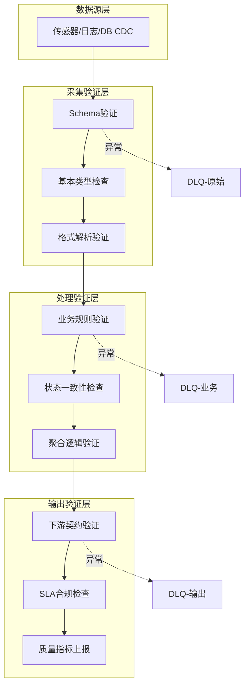
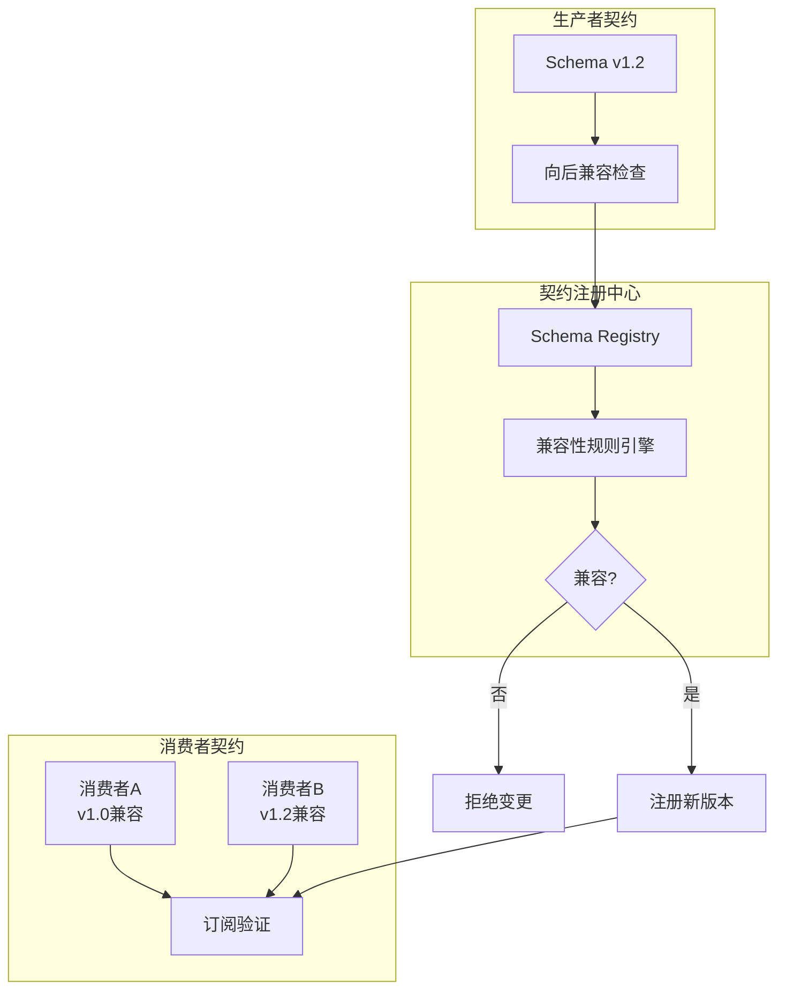
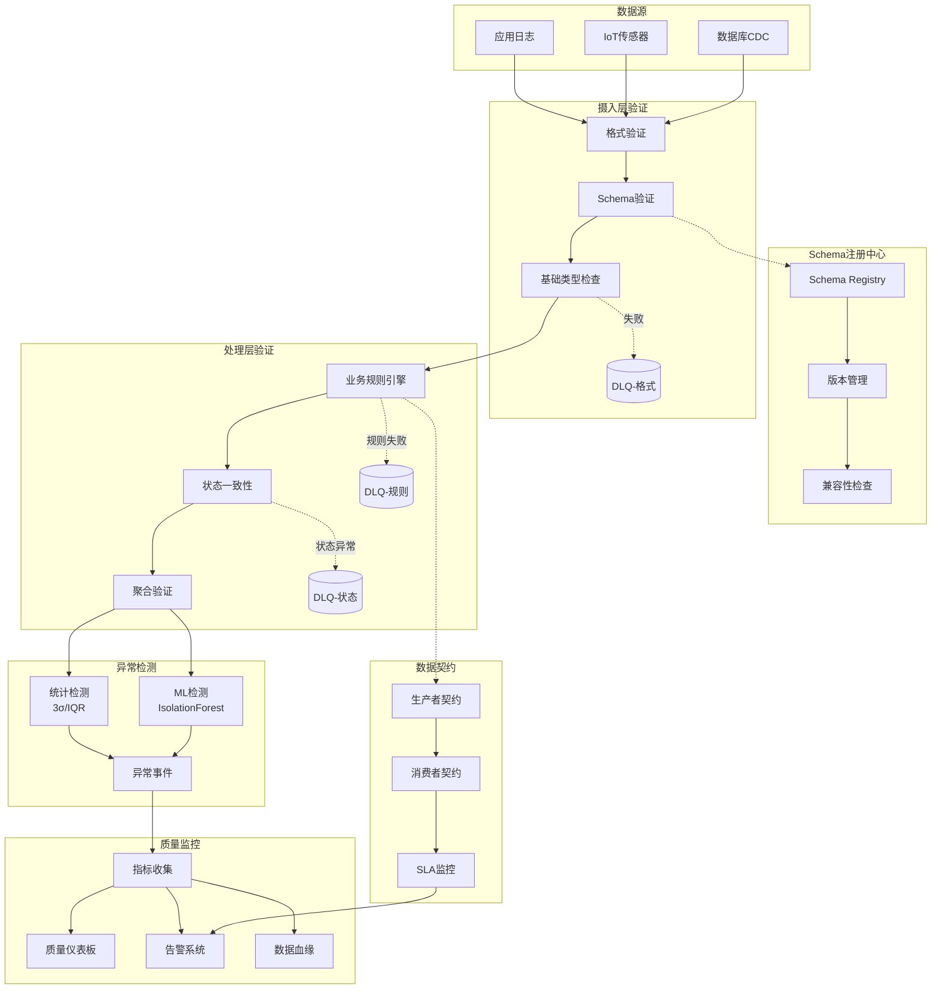
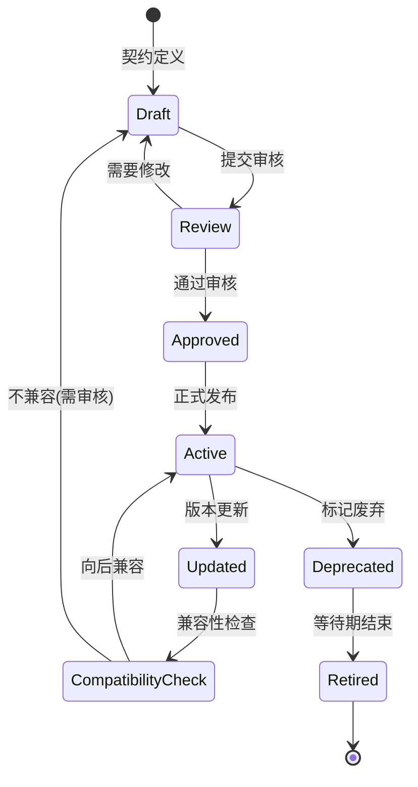
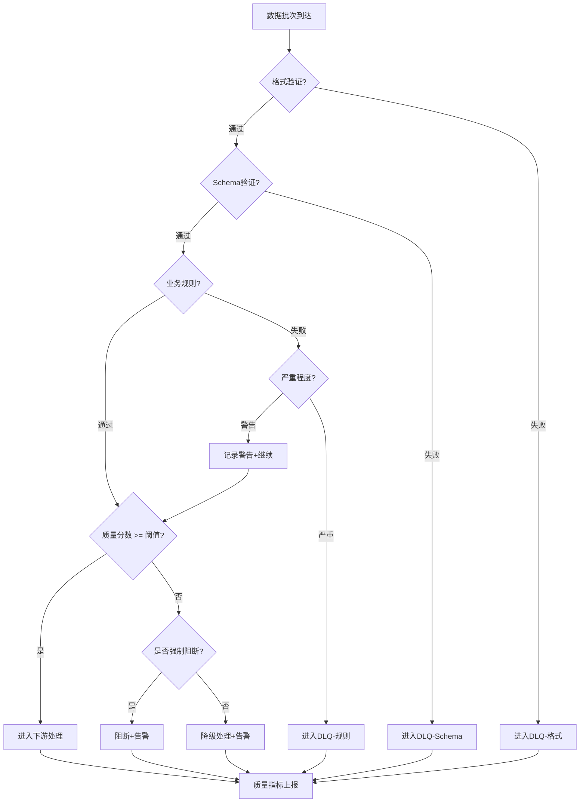
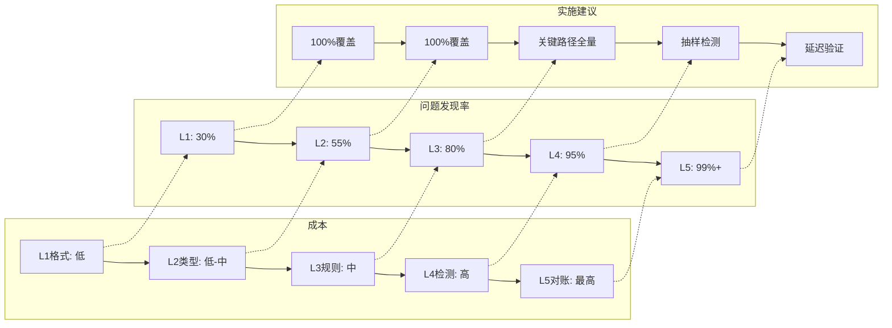

# 实时流处理数据质量与验证

> **所属阶段**: Knowledge | **前置依赖**: [05-streaming-design-patterns.md](../02-design-patterns/pattern-event-time-processing.md), [Flink/04-state-checkpoint/exactly-once-semantics.md](../../Flink/02-core-mechanisms/exactly-once-end-to-end.md) | **形式化等级**: L3

---

## 1. 概念定义 (Definitions)

### 1.1 数据质量五大维度

**Def-K-06-140 (数据质量维度)**

数据质量维度是衡量数据满足业务需求程度的可测量属性。在流处理场景中，五个核心维度定义如下：

| 维度 | 定义 | 流处理度量指标 |
|------|------|----------------|
| **完整性** (Completeness) | 数据记录和字段的缺失程度 | 空值率、字段填充率、到达率 |
| **准确性** (Accuracy) | 数据与真实世界或参考源的符合程度 | 校验通过率、异常值比例、匹配率 |
| **一致性** (Consistency) | 跨系统、跨时间的数据逻辑一致性 | 跨源一致性、时序一致性、约束违反率 |
| **及时性** (Timeliness) | 数据到达的延迟程度 | 端到端延迟、水印延迟、新鲜度 |
| **有效性** (Validity) | 数据符合预定义格式和业务规则的程度 | Schema符合率、规则通过率、类型错误率 |

### 1.2 流处理数据质量挑战

**Def-K-06-141 (流数据质量损失函数)**

设流 $S$ 在时间窗口 $[t_0, t_1]$ 内的质量损失函数 $L(S)$ 定义为：

$$L(S) = \sum_{d \in D} w_d \cdot l_d(S, [t_0, t_1])$$

其中：

- $D = \{\text{完整性}, \text{准确性}, \text{一致性}, \text{及时性}, \text{有效性}\}$
- $w_d$ 为维度 $d$ 的权重系数，$\sum w_d = 1$
- $l_d$ 为维度 $d$ 在窗口内的损失度量

### 1.3 数据契约

**Def-K-06-142 (数据契约)**

数据契约是生产者与消费者之间关于数据格式、语义、SLA 的正式协议，包含四元组：

$$\text{Contract} = (\text{Schema}, \text{Semantics}, \text{SLA}, \text{Version})$$

- **Schema**: 结构化类型定义（字段、类型、约束）
- **Semantics**: 业务语义描述（字段含义、取值范围、业务规则）
- **SLA**: 服务等级协议（延迟上限、可用性目标、质量阈值）
- **Version**: 语义化版本号（遵循 SemVer: MAJOR.MINOR.PATCH）

### 1.4 数据可观测性

**Def-K-06-143 (数据可观测性)**

数据可观测性是通过系统外部输出推断数据内部状态的实践，核心能力包括：

| 能力 | 描述 | 关键问题 |
|------|------|----------|
| **Metrics** | 量化指标收集 | 数据量、延迟、错误率、质量分数 |
| **Logging** | 结构化日志 | 谁在何时做了什么、数据变更轨迹 |
| **Tracing** | 分布式追踪 | 数据从哪来到哪去、处理路径 |
| **Profiling** | 数据剖析 | 数据的统计特征、分布变化 |
| **Lineage** | 数据血缘 | 数据依赖关系、影响分析 |

**数据质量 vs 数据可观测性**:

- **数据质量**: 关注"数据是否正确"（What）
- **数据可观测性**: 关注"为什么出问题"（Why）
- **关系**: 可观测性是质量治理的基础设施

---

## 2. 属性推导 (Properties)

### 2.1 实时验证的及时性约束

**Lemma-K-06-001 (验证延迟不等式)**

设流处理系统的端到端延迟为 $L_{e2e}$，质量验证延迟为 $L_{val}$，则有效验证的必要条件为：

$$L_{val} \ll L_{e2e}$$

即验证延迟必须远小于端到端延迟，否则质量反馈将失去时效性。

**证明**:
若 $L_{val} \geq L_{e2e}$，则质量问题发现时，脏数据已影响下游消费者，验证失去预防价值。证毕。

### 2.2 质量验证的吞吐量影响

**Prop-K-06-001 (验证吞吐量上界)**

设系统基准吞吐量为 $T_{base}$，引入验证后的吞吐量为 $T_{validated}$，验证开销为 $\alpha$，则：

$$T_{validated} \leq \frac{T_{base}}{1 + \alpha}$$

其中 $\alpha$ 取决于验证复杂度：

- Schema验证: $\alpha \approx 0.05$ (5%)
- 业务规则验证: $\alpha \approx 0.15$ (15%)
- ML异常检测: $\alpha \approx 0.50$ (50%+)

### 2.3 死信队列的完备性

**Lemma-K-06-002 (DLQ完备性条件)**

死信队列机制保证所有无法处理的数据都被捕获的充分必要条件：

$$\forall e \in \text{Stream}: \text{Process}(e) = \bot \Rightarrow e \in \text{DLQ}$$

即任何处理失败的事件必须进入死信队列，否则系统将产生**静默数据丢失**。

---

## 3. 关系建立 (Relations)

### 3.1 验证架构层次



### 3.2 验证策略的时空权衡

| 验证类型 | 空间复杂度 | 时间复杂度 | 适用场景 |
|----------|-----------|-----------|----------|
| 无状态验证 | $O(1)$ | $O(1)$ | Schema、格式、基本规则 |
| 窗口验证 | $O(W)$ | $O(W)$ | 时序一致性、窗口聚合校验 |
| 状态验证 | $O(S)$ | $O(1)$ | 去重、状态依赖规则 |
| 全量验证 | $O(N)$ | $O(N)$ | 端到端一致性、延迟加载 |

其中 $W$ 为窗口大小，$S$ 为状态大小，$N$ 为数据总量。

### 3.3 数据契约的变更传播



---

## 4. 论证过程 (Argumentation)

### 4.1 分层验证策略设计

**设计原则**: 验证成本应与数据质量风险成反比

```
┌─────────────────────────────────────────────┐
│  L1: 格式验证 (低成本, 100%覆盖)            │
│  - JSON/Avro/Protobuf解析                   │
│  - 必填字段存在性检查                       │
├─────────────────────────────────────────────┤
│  L2: 类型验证 (低-中成本, 100%覆盖)         │
│  - 数据类型匹配                             │
│  - 范围约束检查                             │
├─────────────────────────────────────────────┤
│  L3: 业务规则 (中成本, 抽样/全量)           │
│  - 交叉字段验证                             │
│  - 状态依赖规则                             │
├─────────────────────────────────────────────┤
│  L4: 异常检测 (高成本, 抽样)                │
│  - 统计异常检测                             │
│  - ML异常检测                               │
├─────────────────────────────────────────────┤
│  L5: 端到端验证 (最高成本, 延迟)            │
│  - 与源系统对账                             │
│  - 业务结果验证                             │
└─────────────────────────────────────────────┘
```

### 4.2 异常检测方法对比

| 方法 | 延迟 | 准确率 | 解释性 | 适用场景 |
|------|------|--------|--------|----------|
| 阈值规则 | 实时 | 中 | 高 | 已知边界条件 |
| 统计检测 (3σ) | 实时 | 中-高 | 高 | 正态分布数据 |
| IQR方法 | 实时 | 中 | 中 | 有偏分布数据 |
| 移动平均偏差 | 分钟级 | 高 | 中 | 趋势性数据 |
| Isolation Forest | 分钟级 | 高 | 低 | 多维异常 |
| LSTM Autoencoder | 小时级 | 很高 | 低 | 复杂时序模式 |

### 4.3 数据质量度量指标设计

**核心指标矩阵**:

```
                 高影响
                    │
    ┌───────────────┼───────────────┐
    │   立即修复    │   立即修复    │
    │   (数据丢失)  │   (核心业务)  │
低 ─┤───────────────┼───────────────┤─ 高
频  │   计划修复    │   紧急评估    │  频
    │   (边缘场景)  │   (新发现)    │
    └───────────────┼───────────────┘
                    │
                 低影响
```

---

## 5. 形式证明 / 工程论证 (Proof / Engineering Argument)

### 5.1 分层验证的完备性定理

**Thm-K-06-100 (分层验证完备性)**

设分层验证系统 $\mathcal{V} = \{V_1, V_2, ..., V_n\}$，其中 $V_i$ 为第 $i$ 层验证器。若满足：

1. **全覆盖性**: $\bigcup_{i=1}^{n} \text{Dom}(V_i) = \text{AllData}$
2. **无遗漏性**: $\forall i < j: \text{Dom}(V_i) \cap \text{Dom}(V_j) = \emptyset$ 或 $V_j \text{增强} V_i$
3. **故障隔离**: $\forall V_i: \text{Failure}(V_i) \Rightarrow \text{NoCascade}$

则该系统在质量损失上界 $L_{max}$ 下保证数据质量。

**工程论证**:

在实际流处理系统中，通过以下机制实现上述条件：

```java
// Flink 分层验证模式
DataStream<Event> validatedStream = source
    // L1: 格式验证 (100%覆盖, 失败进DLQ)
    .map(new SchemaValidationMapper())
    .split(new OutputSelector<Event>() {
        @Override
        public Iterable<String> selectOutputs(Event event) {
            return event.isValid()
                ? Collections.singleton("valid")
                : Collections.singleton("dlq-format");
        }
    })
    // L2: 业务规则验证
    .map(new BusinessRuleValidator())
    // L3: 异常检测 (Side Output模式)
    .process(new AnomalyDetectionProcessFunction());
```

### 5.2 数据契约的向后兼容性

**Thm-K-06-101 (契约兼容性)**

设契约版本 $C_v = (S_v, Sem_v, SLA_v)$，版本升级 $C_v \to C_{v'}$ 为向后兼容的充分条件：

$$\forall c \in \text{Consumers}: c \text{兼容} S_v \Rightarrow c \text{兼容} S_{v'}$$

**兼容规则矩阵**:

| 变更类型 | Schema兼容 | 语义兼容 | SLA兼容 | 版本影响 |
|----------|-----------|----------|---------|----------|
| 添加可选字段 | ✓ | ✓ | - | MINOR |
| 扩展枚举值 | ✓ | ⚠️ | - | MINOR |
| 放宽约束 | ✓ | ⚠️ | - | MINOR |
| 添加必填字段 | ✗ | ✗ | - | MAJOR |
| 删除字段 | ✗ | ✗ | - | MAJOR |
| 修改字段类型 | ✗ | ✗ | - | MAJOR |
| 收紧SLA | - | - | ✗ | MAJOR |
| 放宽SLA | - | - | ✓ | MINOR |

### 5.3 死信队列的数据完整性保证

**Thm-K-06-102 (DLQ完整性)**

在至少一次语义下，DLQ机制保证数据零丢失的充要条件：

$$\forall e: \text{ProcessFail}(e) \Rightarrow (e \in DLQ \land \text{Ack}(e) = \text{false})$$

**Flink实现模式**:

```java
// 带DLQ的ProcessFunction
public class ValidatedProcessFunction extends ProcessFunction<Event, Result> {
    private final OutputTag<Event> dlqTag =
        new OutputTag<Event>("dlq"){};

    @Override
    public void processElement(Event event, Context ctx,
                               Collector<Result> out) {
        try {
            ValidationResult result = validate(event);
            if (result.isSuccess()) {
                out.collect(result.getValue());
            } else {
                // 路由到DLQ而不抛出异常
                ctx.output(dlqTag, enrichWithError(event, result));
            }
        } catch (Exception e) {
            // 意外错误进入DLQ
            ctx.output(dlqTag, enrichWithException(event, e));
        }
    }
}
```

---

## 6. 实例验证 (Examples)

### 6.1 Flink SQL DDL Constraints

```sql
-- 带约束的Flink DDL示例
CREATE TABLE user_events (
    user_id STRING NOT NULL,
    event_type STRING NOT NULL,
    timestamp TIMESTAMP(3) NOT NULL,
    amount DECIMAL(10, 2),

    -- 行级约束
    CONSTRAINT valid_amount CHECK (amount >= 0),
    CONSTRAINT valid_event CHECK (event_type IN ('click', 'purchase', 'logout')),

    -- 水印定义（及时性保证）
    WATERMARK FOR timestamp AS timestamp - INTERVAL '5' SECOND
) WITH (
    'connector' = 'kafka',
    'topic' = 'user-events',
    'format' = 'json',
    'json.fail-on-missing-field' = 'false',
    'json.ignore-parse-errors' = 'true'
);

-- 质量指标收集表
CREATE TABLE quality_metrics (
    window_start TIMESTAMP(3),
    validation_type STRING,
    total_count BIGINT,
    passed_count BIGINT,
    failed_count BIGINT,
    PRIMARY KEY (window_start, validation_type) NOT ENFORCED
) WITH (
    'connector' = 'jdbc',
    'url' = 'jdbc:postgresql://...',
    'table-name' = 'quality_metrics'
);

-- 质量指标聚合
INSERT INTO quality_metrics
SELECT
    TUMBLE_START(timestamp, INTERVAL '1' MINUTE) as window_start,
    'schema_validation' as validation_type,
    COUNT(*) as total_count,
    COUNT(*) FILTER (WHERE user_id IS NOT NULL) as passed_count,
    COUNT(*) FILTER (WHERE user_id IS NULL) as failed_count
FROM user_events
GROUP BY TUMBLE(timestamp, INTERVAL '1' MINUTE);
```

### 6.2 Data Quality Operator 实现

```java
/**
 * 通用数据质量验证算子
 * 支持：Schema验证、规则验证、异常检测
 */
public class DataQualityOperator<T> extends
    ProcessFunction<T, T> implements CheckpointedFunction {

    private final List<ValidationRule<T>> rules;
    private final OutputTag<QualityViolation> violationTag;
    private final OutputTag<T> dlqTag;

    // 质量指标状态
    private transient MapState<String, ValidationMetrics> metricsState;

    @Override
    public void processElement(T element, Context ctx, Collector<T> out) {
        boolean allPassed = true;

        for (ValidationRule<T> rule : rules) {
            ValidationResult result = rule.validate(element);

            if (!result.isPassed()) {
                allPassed = false;

                // 发送违规事件到Side Output
                ctx.output(violationTag, new QualityViolation(
                    rule.getName(),
                    result.getSeverity(),
                    result.getMessage(),
                    System.currentTimeMillis()
                ));

                // 严重错误直接进DLQ
                if (result.getSeverity() == Severity.CRITICAL) {
                    ctx.output(dlqTag, element);
                    return; // 不再继续处理
                }
            }

            // 更新指标
            updateMetrics(rule.getName(), result.isPassed());
        }

        if (allPassed) {
            out.collect(element);
        }
    }

    private void updateMetrics(String ruleName, boolean passed) {
        ValidationMetrics metrics = metricsState.get(ruleName);
        if (metrics == null) {
            metrics = new ValidationMetrics(ruleName);
        }
        metrics.increment(passed);
        metricsState.put(ruleName, metrics);
    }
}
```

### 6.3 Schema Registry 集成

```java
/**
 * 基于Confluent Schema Registry的验证
 */
public class SchemaRegistryValidation implements
    DeserializationSchema<GenericRecord> {

    private final String subject;
    private transient SchemaRegistryClient client;
    private transient DatumReader<GenericRecord> reader;

    @Override
    public GenericRecord deserialize(byte[] message) throws IOException {
        // 读取schema ID (Confluent格式: magic byte + 4 bytes ID)
        int schemaId = ((message[1] & 0xFF) << 24) |
                       ((message[2] & 0xFF) << 16) |
                       ((message[3] & 0xFF) << 8) |
                       (message[4] & 0xFF);

        // 从Registry获取Schema
        Schema schema = client.getSchemaById(schemaId);

        // 验证并反序列化
        reader = new SpecificDatumReader<>(schema);
        Decoder decoder = DecoderFactory.get().binaryDecoder(
            message, 5, message.length - 5, null);

        return reader.read(null, decoder);
    }

    // 兼容性检查
    public Compatibility checkCompatibility(String subject,
                                           Schema newSchema) {
        return client.testCompatibility(subject, newSchema);
    }
}
```

### 6.4 实时质量仪表板配置

```yaml
# Grafana Dashboard配置片段
apiVersion: 1
datasources:
  - name: QualityMetrics
    type: postgres
    url: postgres:5432
    database: data_quality

dashboards:
  - title: "实时数据质量监控"
    panels:
      - title: "质量分数趋势"
        type: graph
        targets:
          - rawSql: |
              SELECT
                time_bucket('1 minute', window_start) as time,
                AVG(passed_count::float / total_count) as quality_score
              FROM quality_metrics
              WHERE $__timeFilter(window_start)
              GROUP BY 1

      - title: "验证失败分布"
        type: pie
        targets:
          - rawSql: |
              SELECT
                validation_type,
                SUM(failed_count) as failures
              FROM quality_metrics
              WHERE $__timeFilter(window_start)
              GROUP BY validation_type

      - title: "数据延迟热力图"
        type: heatmap
        targets:
          - rawSql: |
              SELECT
                time_bucket('5 minutes', event_time) as time,
                EXTRACT(EPOCH FROM (processing_time - event_time)) / 60
                  as lag_minutes
              FROM event_lag_metrics
              WHERE $__timeFilter(event_time)
```

---

## 7. 可视化 (Visualizations)

### 7.1 实时数据质量架构全景



### 7.2 数据契约生命周期



### 7.3 质量门控决策树



### 7.4 分层验证成本效益分析



---

## 8. 引用参考 (References)


---

## 附录：定理/定义索引

| 编号 | 名称 | 章节 |
|------|------|------|
| Def-K-06-140 | 数据质量维度 | 1.1 |
| Def-K-06-141 | 流数据质量损失函数 | 1.2 |
| Def-K-06-142 | 数据契约 | 1.3 |
| Def-K-06-143 | 数据可观测性 | 1.4 |
| Lemma-K-06-001 | 验证延迟不等式 | 2.1 |
| Prop-K-06-001 | 验证吞吐量上界 | 2.2 |
| Lemma-K-06-002 | DLQ完备性条件 | 2.3 |
| Thm-K-06-100 | 分层验证完备性 | 5.1 |
| Thm-K-06-101 | 契约兼容性 | 5.2 |
| Thm-K-06-102 | DLQ完整性 | 5.3 |
