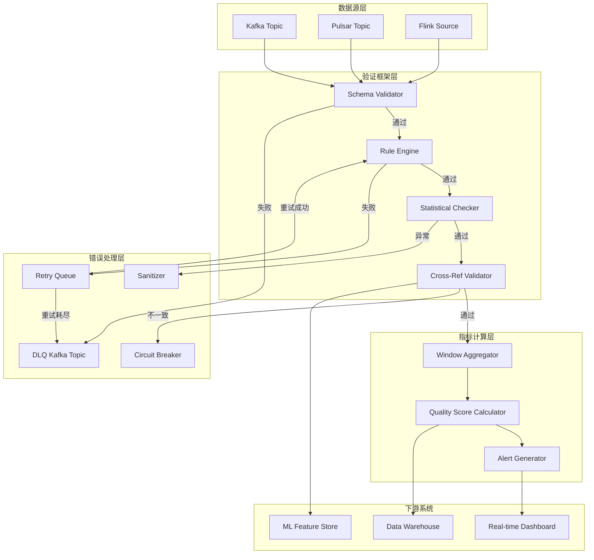
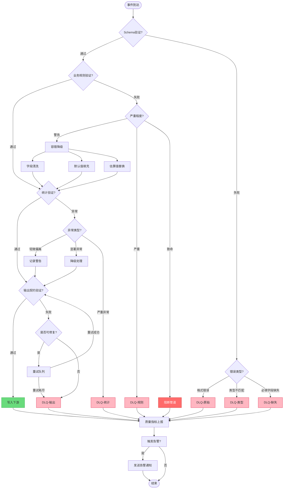
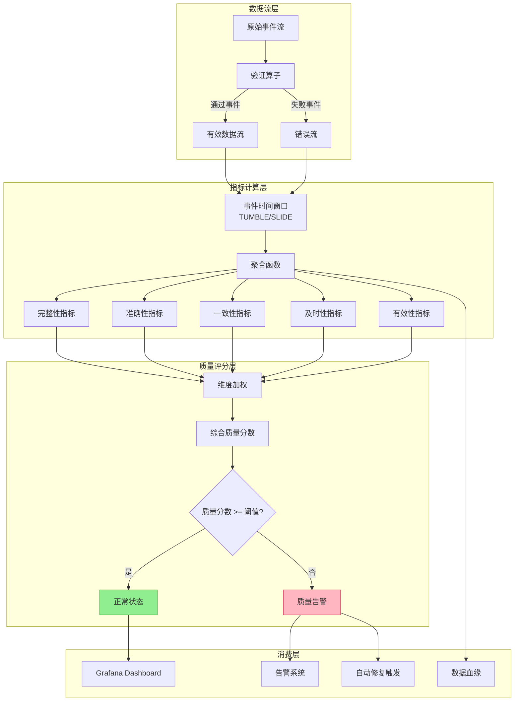

# 实时数据质量验证框架

> **所属阶段**: Knowledge | **前置依赖**: [05-streaming-design-patterns.md](../02-design-patterns/pattern-event-time-processing.md), [Flink/04-state-checkpoint/exactly-once-semantics.md](../../Flink/02-core/exactly-once-end-to-end.md) | **形式化等级**: L4

---

## 1. 概念定义 (Definitions)

### 1.1 实时数据质量验证框架

**Def-K-06-60 (实时数据质量验证框架)**

实时数据质量验证框架是在无界数据流上持续执行数据质量检查的形式化系统，定义为六元组：

$$\mathcal{QVF} = (S, \mathcal{V}, \mathcal{T}, \mathcal{W}, \mathcal{H}, \mathcal{M})$$

其中各分量的含义为：

- $S = \{e_1, e_2, ..., e_n, ...\}$：无界事件流，$e_i = (k_i, v_i, t_i)$ 为带键、值、时间戳的事件
- $\mathcal{V} = \{V_1, V_2, ..., V_m\}$：验证器集合，每个 $V_j: S \to \{\top, \bot\}$ 判定事件是否通过验证
- $\mathcal{T} = \{\text{Ingestion}, \text{InFlight}, \text{Sink}\}$：验证时机策略集合
- $\mathcal{W} = \{\text{Tumbling}, \text{Sliding}, \text{Session}, \text{Global}\}$：窗口化验证策略集合
- $\mathcal{H} = \{\text{DLQ}, \text{Fallback}, \text{Retry}, \text{Block}\}$：错误处理模式集合
- $\mathcal{M} = \{\text{Completeness}, \text{Accuracy}, \text{Consistency}, \text{Timeliness}, \text{Validity}\}$：质量指标维度集合

该框架的核心约束为：**质量验证必须在数据产生影响的决策时间窗口内完成**，否则验证结果将失去业务价值。

### 1.2 验证时机策略

**Def-K-06-61 (验证时机策略)**

验证时机策略定义了质量检查在数据生命周期中的执行时间点，三种策略的形式化定义为：

**摄入时验证 (At Ingestion)**：

$$V_{ingest}(e) = \text{SchemaCheck}(e) \land \text{FormatCheck}(e) \land \text{BasicConstraint}(e)$$

在数据进入流处理系统的前置边界执行，特点为：

- 延迟最低（亚毫秒级）
- 只能访问事件本身的字段
- 无法利用状态或上下文信息
- 适合 Schema 验证、格式解析、必填字段检查

**处理中验证 (In-Flight)**：

$$V_{flight}(e) = V_{ingest}(e) \land \text{BusinessRule}(e, \text{State}(e.k)) \land \text{CrossReference}(e, \text{Window}(e.t))$$

在数据流经处理管道的过程中执行，特点为：

- 可访问键控状态 (Keyed State) 和窗口状态
- 可执行跨事件、跨时间的复杂规则
- 延迟中等（毫秒-秒级）
- 适合业务规则验证、状态一致性检查、时序约束

**输出时验证 (At Sink)**：

$$V_{sink}(e) = V_{flight}(e) \land \text{DownstreamContract}(e) \land \text{SLACompliance}(e)$$

在数据写入下游系统前执行最终检查，特点为：

- 可访问完整的处理上下文
- 可执行端到端一致性校验
- 延迟最高（秒-分钟级）
- 适合下游契约验证、SLA 合规检查、最终一致性确认

### 1.3 验证方法分类

**Def-K-06-62 (验证方法分类)**

验证方法是判定数据质量的具体技术手段，分为四大类：

**Schema 验证 (Schema Validation)**：

$$V_{schema}(e) = \forall f \in \text{RequiredFields}: f \in e.fields \land \text{type}(e.f) = \text{schema}(f) $$

检查事件结构是否符合预定义的数据模式，包括字段存在性、类型匹配、格式合规。

**业务规则验证 (Business Rule Validation)**：

$$V_{rule}(e) = \bigwedge_{r \in R} r(e, \text{Context}(e))$$

其中 $R$ 为业务规则集合，每条规则 $r$ 可引用事件字段、键控状态、窗口聚合结果。例如：

- 字段间约束：`amount >= 0 AND (type = 'refund' IMPLIES amount < 0)`
- 状态依赖规则：`current_balance - previous_balance = transaction_amount`
- 时序规则：`event_time > last_event_time`

**统计验证 (Statistical Validation)**：

$$V_{stat}(W) = \forall m \in \text{Metrics}: \text{lower}_m \leq m(W) \leq \text{upper}_m$$

在窗口 $W$ 上计算统计量（均值、方差、分位数、空值率等），并与预期区间比较。适用于：

- 异常值检测（3σ 原则、IQR 方法）
- 分布漂移检测（KL 散度、Wasserstein 距离）
- 数据量异常（流量突增/突降）

**交叉引用验证 (Cross-Reference Validation)**：

$$V_{xref}(e) = \forall s \in \text{Sources}: \text{Consistency}(e, \text{Lookup}(s, e.k))$$

将当前事件与外部数据源或历史数据进行交叉比对，验证一致性。包括：

- 参照完整性：`user_id` 必须在用户维度表中存在
- 时序一致性：`order_time >= create_time`
- 跨源一致性：同一指标在不同数据源中的值偏差在阈值内

### 1.4 窗口化验证策略

**Def-K-06-63 (窗口化验证策略)**

窗口化验证策略定义了在有限数据子集上执行质量检查的计算模型：

**滚动窗口验证 (Tumbling Window Validation)**：

$$V_{tumble}(S, \Delta) = \{V(W_i) : W_i = \{e \in S | i\Delta \leq e.t < (i+1)\Delta\}\}_{i=0}^{\infty}$$

将无界流切分为不重叠、等大小的窗口，在每个窗口结束时执行验证。适用于：

- 固定周期的质量报告（每分钟质量分数）
- 批量统计验证（每小时空值率检测）
- 周期性对账（每日数据量核对）

**滑动窗口验证 (Sliding Window Validation)**：

$$V_{slide}(S, \Delta, \delta) = \{V(W_i) : W_i = \{e \in S | i\delta \leq e.t < i\delta + \Delta\}\}_{i=0}^{\infty}$$

其中 $\Delta$ 为窗口大小，$\delta$ 为滑动步长。窗口间可重叠，提供更高时间分辨率的验证。适用于：

- 连续质量监控（每10秒报告过去1分钟的质量）
- 趋势检测（检测质量指标的渐变）
- 告警抑制（避免窗口边界处的抖动）

**会话窗口验证 (Session Window Validation)**：

$$V_{session}(S, g) = \{V(W_s) : W_s = \text{Sessionize}(S, g)\}$$

其中 $g$ 为会话间隙超时参数。按用户活动会话聚合同质事件进行验证。适用于：

- 用户行为质量检查（单个会话内的行为一致性）
- 时序异常检测（检测会话内的异常模式）
- 业务过程完整性（验证完整业务流程的数据质量）

**全局累积验证 (Global Cumulative Validation)**：

$$V_{global}(S, t) = V(\{e \in S | e.t \leq t\})$$

从流起始到当前时刻的全量数据上执行验证。适用于：

- 全局唯一性约束（全量去重验证）
- 累积统计量校验（累计金额核对）
- 端到端一致性检查（与批处理结果比对）

### 1.5 错误处理模式

**Def-K-06-64 (错误处理模式)**

错误处理模式定义了验证失败事件的处置策略：

**死信队列 (Dead Letter Queue, DLQ)**：

$$\text{DLQ}(e) = \{(e, r, t, m) | V(e) = \bot \land r = \text{rule}(e) \land t = \text{timestamp} \land m = \text{metadata}\}$$

将失败事件路由到独立队列，附带失败原因、时间戳和上下文元数据，供后续人工审查或自动重处理。DLQ 的核心属性：

- **不可变性**：DLQ 中的记录一旦写入不可修改
- **可追溯性**：每条记录关联原始事件和处理上下文
- **可重放性**：支持按原始顺序重新处理

**容错降级 (Graceful Degradation)**：

$$\text{Degrade}(e) = \begin{cases} e & V_{critical}(e) = \top \\ \text{sanitize}(e) & V_{critical}(e) = \bot \land \text{recoverable}(e) \\ \text{default}(e) & \text{otherwise} \end{cases}$$

对非关键验证失败的事件进行清洗或填充默认值后继续处理，而非直接丢弃。降级策略包括：

- 字段清洗：去除非法字符、截断超长字符串
- 默认值填充：对缺失字段使用预定义默认值
- 估算填充：基于统计模型估算缺失值

**修复重试 (Retry with Backoff)**：

$$\text{Retry}(e, n) = \begin{cases} \text{Process}(e) & \text{success} \\ \text{Retry}(e, n+1)_{|t = t_0 + \text{backoff}(n)} & n < N_{max} \\ \text{DLQ}(e) & n \geq N_{max} \end{cases}$$

对可能由瞬态错误导致的验证失败进行指数退避重试。重试策略参数：

- $N_{max}$：最大重试次数（通常 3-5 次）
- $\text{backoff}(n) = \min(2^n \cdot b_{base}, b_{max})$：指数退避间隔
- 可重试错误类型：网络超时、外部服务不可用、锁冲突

**阻断模式 (Blocking Mode)**：

$$\text{Block}(e) = \text{HaltPipeline} \iff V_{critical}(e) = \bot$$

当关键验证失败时暂停整个处理管道，阻止脏数据污染下游。适用于：

- 金融交易数据的强一致性要求
- 监管合规场景的零容忍策略
- 数据血缘完整性约束

### 1.6 实时数据质量指标

**Def-K-06-65 (实时数据质量指标)**

实时数据质量指标是在流上连续计算的量化质量度量，定义为：

$$\text{DQ Metric}(W) = (\text{dimension}, \text{value}, \text{timestamp}, \text{window}, \text{confidence})$$

核心指标类型及其计算方式：

**完整性指标 (Completeness Metrics)**：

$$C_{complete}(W) = 1 - \frac{\sum_{e \in W} \sum_{f \in F} \mathbb{1}[e.f = \text{null}]}{|W| \cdot |F|}$$

字段填充率，值域 $[0, 1]$，1 表示所有字段均无缺失。

**准确性指标 (Accuracy Metrics)**：

$$C_{accurate}(W) = \frac{|\{e \in W : V_{rule}(e) = \top\}|}{|W|}$$

规则验证通过率，反映数据符合业务规则的程度。

**一致性指标 (Consistency Metrics)**：

$$C_{consistent}(W) = 1 - \frac{|\{e \in W : V_{xref}(e) = \bot\}|}{|W|}$$

交叉引用验证通过率，反映跨系统数据一致性。

**及时性指标 (Timeliness Metrics)**：

$$C_{timely}(W) = 1 - \frac{\sum_{e \in W} \max(0, \text{processing_time}(e) - \text{event_time}(e) - \text{threshold})}{|W| \cdot \text{threshold}}$$

事件处理延迟合规率，值域 $[0, 1]$。

**有效性指标 (Validity Metrics)**：

$$C_{valid}(W) = \frac{|\{e \in W : V_{schema}(e) = \top\}|}{|W|}$$

Schema 验证通过率，反映数据格式合规性。

**综合质量分数**：

$$\text{QualityScore}(W) = \sum_{d \in \mathcal{M}} w_d \cdot C_d(W), \quad \sum_{d} w_d = 1$$

其中 $w_d$ 为各维度权重，可根据业务场景调整。例如金融交易场景可设置：$w_{accurate} = 0.4, w_{consistent} = 0.3, w_{timely} = 0.2, w_{complete} = 0.1$。

---

## 2. 属性推导 (Properties)

### 2.1 验证时机延迟约束

**Lemma-K-06-003 (验证时机延迟约束)**

设数据从产生到被消费的总可用时间窗口为 $T_{available}$，验证延迟为 $L_v$，业务决策延迟为 $L_{decision}$，则有效验证的时序约束为：

$$L_v + L_{decision} \leq T_{available}$$

**证明**：

若 $L_v + L_{decision} > T_{available}$，则当验证结果产出时，下游业务决策已基于未验证数据完成，验证结果无法影响该决策。此时验证仅具审计价值，不具备预防价值。因此有效验证必须满足上述不等式。证毕。

**推论**：对于实时风控场景（$T_{available} \approx 100ms$），验证必须在摄入时完成（$L_v < 10ms$）；对于离线报表场景（$T_{available} \approx 24h$），验证可在输出时完成（$L_v < 1h$）。

### 2.2 窗口化验证的完备性

**Lemma-K-06-004 (窗口化验证完备性)**

设全局验证器 $V_{global}$ 在完整数据集 $S$ 上的判定结果为 $\mathcal{R}$，窗口验证器序列 $\{V(W_i)\}$ 在各窗口 $W_i$ 上的判定结果为 $\{\mathcal{R}_i\}$。若验证器 $V$ 满足窗口可加性（Window Additivity）：

$$V(S) = \bigwedge_{i} V(W_i) \iff \forall i: W_i \subseteq S \land \bigcup_{i} W_i = S \land W_i \cap W_j = \emptyset \ (i \neq j)$$

则窗口化验证与全局验证等价。

**证明**：

**充分性**：若 $V$ 满足窗口可加性，且所有 $V(W_i) = \top$，则 $V(S) = \bigwedge_i \top = \top$。

**必要性**：若 $V(S) = \top$，由窗口可加性定义，$\bigwedge_i V(W_i) = \top$，故 $\forall i: V(W_i) = \top$。

**适用条件**：

- Schema 验证、格式验证满足窗口可加性（无状态、单事件）
- 全局唯一性约束不满足窗口可加性（需跨窗口比较）
- 统计验证在窗口粒度上满足近似可加性（依赖中心极限定理）

### 2.3 验证方法组合覆盖性

**Prop-K-06-002 (验证方法组合覆盖性)**

设单一验证方法 $V_j$ 的漏检率为 $\epsilon_j$（即 $P(V_j(e) = \top | e \text{ 为脏数据})$），则 $n$ 个独立验证方法的组合漏检率为：

$$\epsilon_{combined} = \prod_{j=1}^{n} \epsilon_j$$

组合验证的召回率为：

$$\text{Recall}_{combined} = 1 - \prod_{j=1}^{n} (1 - \text{Recall}_j)$$

**证明**：

假设各验证方法对脏数据的检测相互独立，则脏数据同时通过所有验证的概率为各漏检率的乘积。因此组合漏检率 $\epsilon_{combined} = \prod_j \epsilon_j$。

**实例**：设 Schema 验证漏检率 $\epsilon_1 = 0.05$（5%），业务规则验证漏检率 $\epsilon_2 = 0.10$（10%），统计验证漏检率 $\epsilon_3 = 0.15$（15%），则三层验证组合漏检率为 $0.05 \times 0.10 \times 0.15 = 0.00075$（0.075%），召回率从单层的 85%-95% 提升至 99.925%。

---

## 3. 关系建立 (Relations)

### 3.1 验证时机与验证能力的映射关系

验证时机策略决定了可用的验证能力范围，形成严格的层次包含关系：

```
摄入时验证 ⊂ 处理中验证 ⊂ 输出时验证

摄入时验证: {Schema, Format, BasicConstraint}
处理中验证: 摄入时能力 ∪ {BusinessRule, StateCheck, WindowAggregate}
输出时验证: 处理中能力 ∪ {DownstreamContract, EndToEndConsistency, SLACompliance}
```

| 验证能力 | 摄入时 | 处理中 | 输出时 |
|----------|--------|--------|--------|
| Schema 验证 | ✓ | ✓ | ✓ |
| 格式验证 | ✓ | ✓ | ✓ |
| 必填字段检查 | ✓ | ✓ | ✓ |
| 业务规则验证 | ✗ | ✓ | ✓ |
| 状态一致性检查 | ✗ | ✓ | ✓ |
| 窗口聚合校验 | ✗ | ✓ | ✓ |
| 交叉引用验证 | ✗ | △（有限） | ✓（完整） |
| 下游契约验证 | ✗ | ✗ | ✓ |
| 端到端一致性 | ✗ | ✗ | ✓ |
| SLA 合规检查 | ✗ | ✗ | ✓ |

*△ 表示受限支持（如基于缓存的有限引用）*

### 3.2 验证方法与质量维度的覆盖矩阵

| 验证方法 | 完整性 | 准确性 | 一致性 | 及时性 | 有效性 |
|----------|--------|--------|--------|--------|--------|
| Schema 验证 | △（空值检查） | ✗ | ✗ | ✗ | ✓ |
| 业务规则验证 | △（字段依赖） | ✓ | △（状态规则） | △（时间规则） | ✓ |
| 统计验证 | ✓（空值率） | ✓（异常值） | ✓（分布漂移） | ✓（延迟分布） | ✓（格式异常率） |
| 交叉引用验证 | ✓（参照完整性） | ✓（值比对） | ✓（跨源一致性） | ✓（时间戳比对） | △（编码一致性） |

**关系分析**：

- 没有单一验证方法能覆盖全部质量维度
- 统计验证覆盖维度最广，但解释性较弱
- 业务规则验证准确性最高，但需要领域知识
- 交叉引用验证一致性最强，但延迟最高

### 3.3 与流处理引擎的集成关系



**集成模式对应关系**：

| 引擎 | 内联验证 | 旁路验证 | 聚合验证 | 状态访问 |
|------|----------|----------|----------|----------|
| Flink DataStream | ProcessFunction | Async I/O + Side Output | Window Aggregation | KeyedState |
| Flink SQL | CHECK CONSTRAINT | MATCH_RECOGNIZE | GROUP BY WINDOW | Temporal Table |
| Kafka Streams | Processor API | Topology Branch | KGroupedStream | State Store |
| Pulsar Functions | Function.process | Side Output Topic | Window Function | State Storage |
| Spark Structured Streaming | map/filter | foreachBatch | window/agg | Stateful Operator |

---

## 4. 论证过程 (Argumentation)

### 4.1 流数据质量验证的独特挑战

流数据质量验证面临与批处理截然不同的挑战，根源于数据的**无界性 (Unboundedness)**、**延迟 (Latency)** 和 **乱序 (Disorder)**。

**挑战一：无界性导致的资源约束**

批处理验证可加载全量数据到内存，执行全局去重、全表一致性检查等操作。流数据的无界性使得：

$$\lim_{t \to \infty} |S_{[0,t]}| = \infty$$

任何需要 $O(N)$ 空间复杂度的验证（如全局唯一性）在严格意义上不可行，必须依赖近似算法或窗口化约束。

**应对策略**：

- 布隆过滤器（Bloom Filter）：以可控的假阳性率实现 $O(1)$ 空间复杂度的近似去重
- HyperLogLog：以亚线性空间估算基数（cardinality），用于数据量异常检测
- Count-Min Sketch：估算元素频次，用于高频异常模式检测

**挑战二：低延迟要求与验证深度的矛盾**

实时场景（如实时竞价、欺诈检测）要求端到端延迟低于 100ms，而深度验证（如交叉引用外部数据库）可能需要数百毫秒：

$$L_{deep\_validation} \gg T_{SLA}$$

**应对策略**：

- **分级验证**：将验证分为快速路径（Fast Path，< 10ms）和慢速路径（Slow Path，异步执行）
- **预计算缓存**：对交叉引用数据建立本地缓存，将 $O(\text{network})$ 降为 $O(\text{memory})$
- **异步验证**：非关键验证异步执行，不阻塞主处理流

**挑战三：乱序数据导致的时序一致性验证困难**

事件时间（Event Time）与处理时间（Processing Time）的差异导致：

$$\forall e \in S: \text{processing\_time}(e) - \text{event\_time}(e) \geq 0$$

且乱序程度服从某种分布。时序规则验证（如 `event_time > last_event_time`）在乱序场景下失效，因为"最后事件"的定义依赖于水印（Watermark）进度而非真实时间。

**应对策略**：

- 基于水印的验证窗口：只在 `watermark >= event_time` 后触发验证
- 时序容忍区间：定义 `event_time` 的合理范围 `[watermark - max_delay, watermark]`
- 状态版本化：维护事件时间上的状态快照，支持乱序事件的时序验证

### 4.2 验证架构模式对比

三种架构模式的选择取决于延迟要求、验证复杂度、吞吐量需求和系统耦合度。

| 维度 | 内联验证 (Inline) | 旁路验证 (Sidecar) | 聚合验证 (Aggregate) |
|------|-------------------|-------------------|---------------------|
| **延迟** | 最低（同步） | 低（异步） | 高（窗口结束） |
| **吞吐量影响** | 直接降低 | 间接降低 | 可控 |
| **验证复杂度** | 简单-中等 | 简单-复杂 | 复杂 |
| **状态依赖** | 键控状态 | 外部服务/缓存 | 窗口状态 |
| **错误隔离** | 弱（同一进程） | 强（独立进程） | 强（独立算子） |
| **部署独立性** | 与业务耦合 | 可独立部署 | 与聚合逻辑耦合 |
| **适用场景** | 低延迟、简单规则 | 复杂规则、外部依赖 | 统计验证、报表 |

**模式选择的决策矩阵**：

```
IF 延迟要求 < 50ms AND 规则复杂度 == 简单:
    → 内联验证
ELSE IF 需要外部服务调用 OR 需要独立部署:
    → 旁路验证
ELSE IF 验证依赖窗口聚合 OR 容忍秒级延迟:
    → 聚合验证
ELSE:
    → 混合模式（内联快速规则 + 旁路深度规则 + 聚合统计验证）
```

### 4.3 错误处理策略的选择论证

错误处理策略的选择取决于数据重要性、错误类型和下游容忍度：

**死信队列 (DLQ) 的适用场景**：

- 格式解析错误（不可修复）
- 业务规则严重违反（如负数金额）
- 需要人工审查的异常（如疑似欺诈）
- 需要离线修复后重放的数据（如缺失参照数据）

**容错降级的适用场景**：

- 非关键字段缺失（可填充默认值）
- 格式轻微违规（可清洗修复）
- 下游可容忍近似值（估算填充）
- 高吞吐量场景下无法承受全部阻断

**修复重试的适用场景**：

- 外部服务瞬态不可用（如参照表查询超时）
- 并发冲突导致的暂时性失败（如状态更新冲突）
- 网络抖动导致的临时异常
- 资源限制导致的暂时性拒绝（如限流）

**阻断模式的适用场景**：

- 金融交易等强一致性场景
- 监管合规的零容忍要求
- 数据血缘完整性约束（防止污染传播）
- 调试和排障阶段（快速失败）

---

## 5. 形式证明 / 工程论证 (Proof / Engineering Argument)

### 5.1 内联验证的一致性保证

**Thm-K-06-103 (内联验证一致性)**

设流处理系统采用内联验证模式，验证器 $V$ 在算子 $O$ 中同步执行。若 $V$ 满足：

1. **确定性**：$\forall e: V(e)$ 的判定结果在相同输入下恒定
2. **幂等性**：$\forall e: V(V(e)) = V(e)$
3. **单调性**：若 $V(e) = \bot$，则对 $e$ 的任何变换 $e'$ 都有 $V(e') = \bot$ 或 $e'$ 不再被验证

则在 Exactly-Once 语义下，内联验证保证：**所有通过验证的事件满足 $V$，且不存在重复验证导致的判定不一致**。

**工程论证**：

Flink 的 Exactly-Once 语义基于 Checkpoint 机制实现。内联验证在 ProcessFunction 中同步执行，其判定结果与事件处理原子性绑定：

```java
// Flink ProcessFunction 中的内联验证
@Override
public void processElement(Event event, Context ctx, Collector<Result> out) {
    // 验证与输出在同一事务中
    if (validator.validate(event).isPassed()) {
        // 验证通过才收集结果
        out.collect(transform(event));
        // 更新状态（状态更新与输出原子性由Checkpoint保证）
        state.update(event);
    } else {
        // 验证失败路由到Side Output（DLQ）
        ctx.output(dlqTag, event);
    }
}
```

在 Checkpoint 周期内，状态更新和输出到下游的操作被原子性地快照。若发生故障恢复，从上一个 Checkpoint 重启时：

- 已验证并输出的事件不会被重新处理（因为下游已接收且 Checkpoint 已确认）
- 未确认的事件会重新处理，验证器 $V$ 的确定性保证重新处理的结果一致
- 验证失败进入 DLQ 的事件也会被原子性地快照

### 5.2 旁路验证的因果一致性

**Thm-K-06-104 (旁路验证因果一致性)**

设旁路验证系统中，主处理流延迟为 $L_{main}$，旁路验证延迟为 $L_{side}$。若旁路验证结果需要影响主处理（如阻断或标记），则必须满足：

$$L_{side} \leq L_{main} + \Delta_{tolerance}$$

其中 $\Delta_{tolerance}$ 为业务容忍的验证结果滞后时间。否则将出现**验证结果落后于数据处理**的因果不一致。

**工程论证**：

旁路验证通过异步 Side Output 或独立服务实现：

```
主流: Source → [Process] → Sink
            ↓
旁路:      [Async Validate] → Result Queue
            ↑（反馈信号）
```

若旁路验证慢于主处理（如外部 API 调用超时），反馈信号到达时主数据已写入下游。此时有三种应对策略：

1. **补偿事务 (Compensating Transaction)**：若旁路验证失败，触发下游数据修正或删除。适用于可修改的存储系统。

2. **延迟确认 (Delayed Acknowledgment)**：主处理不立即确认写入，等待旁路验证通过后才 ACK。这实际上将旁路验证转换为同步模式。

3. **事后审计 (Post-hoc Audit)**：接受可能的脏数据写入，通过离线对账发现并修复。适用于低严重性场景。

### 5.3 聚合验证的统计显著性

**Thm-K-06-105 (聚合验证统计显著性)**

设窗口 $W$ 内的事件数为 $n$，质量指标 $C(W)$ 的估计值为 $\hat{C}(W)$。在置信水平 $1-\alpha$ 下，$C(W)$ 的置信区间为：

$$\hat{C}(W) \pm z_{\alpha/2} \cdot \sqrt{\frac{\hat{C}(W)(1-\hat{C}(W))}{n}}$$

其中 $z_{\alpha/2}$ 为标准正态分布的分位数。当窗口大小 $n$ 增加时，置信区间宽度以 $O(1/\sqrt{n})$ 收敛。

**工程意义**：

- 小窗口（$n < 100$）的质量指标估计方差大，易产生误报
- 大窗口（$n > 10000$）的估计稳定，但延迟增加
- 建议设置最小样本量阈值 $n_{min}$，在 $n < n_{min}$ 时使用历史基线作为先验

---

## 6. 实例验证 (Examples)

### 6.1 Flink SQL 校验规则实现

```sql
-- ============================================
-- 实时数据质量验证：Flink SQL 实现
-- ============================================

-- 1. 定义带校验约束的源表
CREATE TABLE raw_transactions (
    transaction_id STRING NOT NULL,
    user_id STRING NOT NULL,
    amount DECIMAL(18, 2),
    currency STRING,
    event_time TIMESTAMP(3),
    region STRING,

    -- 行级约束检查
    CONSTRAINT chk_amount_positive CHECK (amount >= 0),
    CONSTRAINT chk_currency_valid CHECK (currency IN ('CNY', 'USD', 'EUR', 'JPY')),
    CONSTRAINT chk_region_not_empty CHECK (region IS NOT NULL AND LENGTH(region) > 0),

    -- 水印定义
    WATERMARK FOR event_time AS event_time - INTERVAL '30' SECOND
) WITH (
    'connector' = 'kafka',
    'topic' = 'raw-transactions',
    'properties.bootstrap.servers' = 'kafka:9092',
    'format' = 'json',
    'json.fail-on-missing-field' = 'false',
    'json.ignore-parse-errors' = 'true'
);

-- 2. 定义质量指标目标表
CREATE TABLE quality_metrics (
    window_start TIMESTAMP(3),
    window_end TIMESTAMP(3),
    validation_type STRING,
    total_count BIGINT,
    passed_count BIGINT,
    failed_count BIGINT,
    failure_rate DECIMAL(5, 4),
    quality_score DECIMAL(5, 4),
    PRIMARY KEY (window_start, validation_type) NOT ENFORCED
) WITH (
    'connector' = 'jdbc',
    'url' = 'jdbc:postgresql://postgres:5432/data_quality',
    'table-name' = 'quality_metrics',
    'username' = 'flink',
    'password' = 'flink'
);

-- 3. Schema 验证指标（滚动窗口）
INSERT INTO quality_metrics
SELECT
    TUMBLE_START(event_time, INTERVAL '1' MINUTE) AS window_start,
    TUMBLE_END(event_time, INTERVAL '1' MINUTE) AS window_end,
    'schema_validation' AS validation_type,
    COUNT(*) AS total_count,
    COUNT(*) FILTER (WHERE transaction_id IS NOT NULL
                     AND user_id IS NOT NULL
                     AND amount IS NOT NULL) AS passed_count,
    COUNT(*) FILTER (WHERE transaction_id IS NULL
                     OR user_id IS NULL
                     OR amount IS NULL) AS failed_count,
    CAST(COUNT(*) FILTER (WHERE transaction_id IS NULL
                          OR user_id IS NULL
                          OR amount IS NULL) AS DECIMAL) / CAST(NULLIF(COUNT(*), 0) AS DECIMAL) AS failure_rate,
    CAST(COUNT(*) FILTER (WHERE transaction_id IS NOT NULL
                          AND user_id IS NOT NULL
                          AND amount IS NOT NULL) AS DECIMAL) / CAST(NULLIF(COUNT(*), 0) AS DECIMAL) AS quality_score
FROM raw_transactions
GROUP BY TUMBLE(event_time, INTERVAL '1' MINUTE);

-- 4. 业务规则验证指标（滑动窗口，更高时间分辨率）
INSERT INTO quality_metrics
SELECT
    HOP_START(event_time, INTERVAL '10' SECOND, INTERVAL '1' MINUTE) AS window_start,
    HOP_END(event_time, INTERVAL '10' SECOND, INTERVAL '1' MINUTE) AS window_end,
    'business_rule' AS validation_type,
    COUNT(*) AS total_count,
    COUNT(*) FILTER (WHERE amount >= 0
                     AND currency IN ('CNY', 'USD', 'EUR', 'JPY')
                     AND region IS NOT NULL) AS passed_count,
    COUNT(*) FILTER (WHERE amount < 0
                     OR currency NOT IN ('CNY', 'USD', 'EUR', 'JPY')
                     OR region IS NULL) AS failed_count,
    CAST(COUNT(*) FILTER (WHERE amount < 0
                          OR currency NOT IN ('CNY', 'USD', 'EUR', 'JPY')
                          OR region IS NULL) AS DECIMAL) / CAST(NULLIF(COUNT(*), 0) AS DECIMAL) AS failure_rate,
    CAST(COUNT(*) FILTER (WHERE amount >= 0
                          AND currency IN ('CNY', 'USD', 'EUR', 'JPY')
                          AND region IS NOT NULL) AS DECIMAL) / CAST(NULLIF(COUNT(*), 0) AS DECIMAL) AS quality_score
FROM raw_transactions
GROUP BY HOP(event_time, INTERVAL '10' SECOND, INTERVAL '1' MINUTE);

-- 5. 带质量标记的净化数据流（用于下游消费）
CREATE VIEW validated_transactions AS
SELECT
    transaction_id,
    user_id,
    amount,
    currency,
    event_time,
    region,
    CASE
        WHEN amount >= 0 AND currency IN ('CNY', 'USD', 'EUR', 'JPY') AND region IS NOT NULL
        THEN 'VALID'
        WHEN amount < 0 OR currency NOT IN ('CNY', 'USD', 'EUR', 'JPY')
        THEN 'RULE_VIOLATION'
        WHEN region IS NULL
        THEN 'INCOMPLETE'
        ELSE 'UNKNOWN'
    END AS quality_status,
    CASE
        WHEN amount >= 0 AND currency IN ('CNY', 'USD', 'EUR', 'JPY') AND region IS NOT NULL
        THEN 1.0
        WHEN region IS NULL
        THEN 0.8
        ELSE 0.0
    END AS quality_score
FROM raw_transactions;

-- 6. 时序一致性检查（检测乱序和延迟异常）
CREATE TABLE latency_metrics (
    window_start TIMESTAMP(3),
    avg_latency_ms BIGINT,
    p95_latency_ms BIGINT,
    p99_latency_ms BIGINT,
    late_event_count BIGINT,
    out_of_order_count BIGINT
) WITH (
    'connector' = 'jdbc',
    'url' = 'jdbc:postgresql://postgres:5432/data_quality',
    'table-name' = 'latency_metrics'
);

INSERT INTO latency_metrics
SELECT
    TUMBLE_START(PROCTIME(), INTERVAL '1' MINUTE) AS window_start,
    AVG(TIMESTAMPDIFF(SECOND, event_time, PROCTIME()) * 1000) AS avg_latency_ms,
    PERCENTILE_CONT(0.95) WITHIN GROUP (ORDER BY TIMESTAMPDIFF(SECOND, event_time, PROCTIME()) * 1000) AS p95_latency_ms,
    PERCENTILE_CONT(0.99) WITHIN GROUP (ORDER BY TIMESTAMPDIFF(SECOND, event_time, PROCTIME()) * 1000) AS p99_latency_ms,
    COUNT(*) FILTER (WHERE event_time < PROCTIME() - INTERVAL '5' MINUTE) AS late_event_count,
    COUNT(*) FILTER (WHERE event_time < LAG(event_time) OVER (ORDER BY event_time)) AS out_of_order_count
FROM raw_transactions
GROUP BY TUMBLE(PROCTIME(), INTERVAL '1' MINUTE);
```

### 6.2 Kafka Streams 验证拓扑实现

```java
// ============================================
// Kafka Streams 数据质量验证拓扑
// ============================================

package com.example.dataquality;

import org.apache.kafka.streams.*;
import org.apache.kafka.streams.kstream.*;
import org.apache.kafka.streams.state.*;
import org.apache.kafka.common.serialization.*;
import com.fasterxml.jackson.databind.JsonNode;
import com.fasterxml.jackson.databind.ObjectMapper;

import java.time.Duration;
import java.util.*;

public class DataQualityValidationTopology {

    private static final ObjectMapper mapper = new ObjectMapper();

    // 质量违规 Side Output Topic
    private static final String DLQ_TOPIC = "transactions.dlq";
    private static final String VIOLATION_TOPIC = "transactions.violations";
    private static final String METRICS_TOPIC = "quality.metrics";

    public static Topology build() {
        StreamsBuilder builder = new StreamsBuilder();

        // 1. 定义 Schema 验证的 Serde
        Serde<JsonNode> jsonSerde = new JsonSerde<>(JsonNode.class, mapper);

        // 2. 源数据流
        KStream<String, JsonNode> source = builder.stream(
            "raw-transactions",
            Consumed.with(Serdes.String(), jsonSerde)
        );

        // 3. L1: Schema 验证（内联验证）
        KStream<String, JsonNode>[] schemaBranches = source.branch(
            // 通过 Schema 验证
            (key, value) -> validateSchema(value),
            // Schema 验证失败
            (key, value) -> true
        );

        KStream<String, JsonNode> schemaValid = schemaBranches[0];
        KStream<String, JsonNode> schemaInvalid = schemaBranches[1];

        // Schema 失败写入 DLQ
        schemaInvalid.to(DLQ_TOPIC, Produced.with(Serdes.String(), jsonSerde));

        // 4. L2: 业务规则验证（状态依赖）
        KStream<String, JsonNode>[] ruleBranches = schemaValid.branch(
            (key, value) -> validateBusinessRules(value),
            (key, value) -> true
        );

        KStream<String, JsonNode> ruleValid = ruleBranches[0];
        KStream<String, JsonNode> ruleInvalid = ruleBranches[1];

        // 规则失败写入违规 Topic（带原因）
        ruleInvalid
            .mapValues(value -> enrichWithViolationReason(value, "BUSINESS_RULE"))
            .to(VIOLATION_TOPIC, Produced.with(Serdes.String(), jsonSerde));

        // 5. L3: 统计验证（窗口聚合）
        // 按区域分组，检测金额异常
        KGroupedStream<String, JsonNode> groupedByRegion = ruleValid
            .selectKey((key, value) -> value.get("region").asText());

        // 滑动窗口：每 10 秒统计过去 1 分钟的金额分布
        TimeWindowedKStream<String, JsonNode> windowed = groupedByRegion
            .windowedBy(TimeWindows.ofSizeWithNoGrace(Duration.ofMinutes(1))
                .advanceBy(Duration.ofSeconds(10)));

        // 计算窗口统计量
        KTable<Windowed<String>, ValidationMetrics> metrics = windowed
            .aggregate(
                ValidationMetrics::new,
                (key, value, aggregate) -> aggregate.update(value),
                Materialized.<String, ValidationMetrics, WindowStore<Bytes, byte[]>>
                    as("validation-metrics-store")
                    .withKeySerde(Serdes.String())
                    .withValueSerde(new ValidationMetricsSerde())
            );

        // 检测统计异常（3σ 原则）
        KStream<Windowed<String>, ValidationMetrics> metricsStream = metrics.toStream();

        KStream<String, JsonNode>[] statBranches = ruleValid
            .selectKey((key, value) -> value.get("region").asText())
            .leftJoin(
                metrics,
                (transaction, metric) -> {
                    if (metric == null) return true; // 无基线时通过
                    double amount = transaction.get("amount").asDouble();
                    double mean = metric.getMean();
                    double std = metric.getStdDev();
                    return Math.abs(amount - mean) <= 3 * std; // 3σ 检查
                },
                JoinWindows.ofTimeDifferenceWithNoGrace(Duration.ofMinutes(1)),
                StreamJoined.with(Serdes.String(), jsonSerde, new ValidationMetricsSerde())
            )
            .branch(
                (key, isValid) -> isValid,
                (key, isValid) -> true
            );

        // 6. 有效数据写入下游
        statBranches[0].to("validated-transactions",
            Produced.with(Serdes.String(), jsonSerde));

        // 7. 质量指标输出
        metricsStream
            .map((windowedKey, metric) -> {
                String region = windowedKey.key();
                long windowStart = windowedKey.window().start();
                JsonNode metricJson = mapper.valueToTree(Map.of(
                    "region", region,
                    "window_start", windowStart,
                    "mean", metric.getMean(),
                    "std_dev", metric.getStdDev(),
                    "count", metric.getCount(),
                    "quality_score", metric.qualityScore()
                ));
                return KeyValue.pair(region + "-" + windowStart, metricJson);
            })
            .to(METRICS_TOPIC, Produced.with(Serdes.String(), jsonSerde));

        return builder.build();
    }

    // Schema 验证实现
    private static boolean validateSchema(JsonNode event) {
        return event.hasNonNull("transaction_id")
            && event.hasNonNull("user_id")
            && event.hasNonNull("amount")
            && event.hasNonNull("currency")
            && event.hasNonNull("event_time")
            && event.get("amount").isNumber()
            && event.get("amount").asDouble() >= 0;
    }

    // 业务规则验证实现
    private static boolean validateBusinessRules(JsonNode event) {
        Set<String> validCurrencies = Set.of("CNY", "USD", "EUR", "JPY");
        String currency = event.get("currency").asText();
        return validCurrencies.contains(currency);
    }

    // 违规信息增强
    private static JsonNode enrichWithViolationReason(JsonNode event, String reason) {
        ObjectNode enriched = event.deepCopy();
        enriched.put("violation_type", reason);
        enriched.put("violation_timestamp", System.currentTimeMillis());
        enriched.put("processing_stage", "BUSINESS_RULE_VALIDATION");
        return enriched;
    }

    // 统计指标类
    public static class ValidationMetrics {
        private double sum = 0;
        private double sumSq = 0;
        private long count = 0;
        private long failures = 0;

        public ValidationMetrics update(JsonNode event) {
            double amount = event.get("amount").asDouble();
            sum += amount;
            sumSq += amount * amount;
            count++;
            return this;
        }

        public double getMean() { return count > 0 ? sum / count : 0; }

        public double getStdDev() {
            if (count < 2) return 0;
            double mean = getMean();
            return Math.sqrt((sumSq / count) - (mean * mean));
        }

        public long getCount() { return count; }

        public double qualityScore() {
            return count > 0 ? 1.0 - ((double) failures / count) : 1.0;
        }
    }

    // Serde 实现（省略）
    public static class ValidationMetricsSerde implements Serde<ValidationMetrics> {
        // 序列化/反序列化实现
    }

    public static class JsonSerde<T> implements Serde<T> {
        // JSON 序列化/反序列化实现
    }
}
```

### 6.3 Pulsar Function 验证器实现

```java
// ============================================
// Pulsar Function 实时数据质量验证
// ============================================

package com.example.dataquality;

import org.apache.pulsar.functions.api.Context;
import org.apache.pulsar.functions.api.Function;
import org.apache.pulsar.functions.api.Record;
import org.apache.pulsar.functions.api.StateStore;

import com.fasterxml.jackson.databind.JsonNode;
import com.fasterxml.jackson.databind.ObjectMapper;
import com.fasterxml.jackson.databind.node.ObjectNode;

import java.util.*;
import java.util.concurrent.TimeUnit;

/**
 * Pulsar Function 实现的多层数据质量验证器
 * 特性：
 * 1. 内联 Schema + 业务规则验证
 * 2. 使用 Pulsar State Storage 维护键控状态
 * 3. 支持窗口化统计验证
 * 4. 输出质量指标到独立 Topic
 */
public class DataQualityValidatorFunction
    implements Function<JsonNode, DataQualityValidatorFunction.ValidationResult> {

    private static final ObjectMapper mapper = new ObjectMapper();

    // 配置参数（通过 function config 注入）
    private static final String CFG_SCHEMA_REQUIRED_FIELDS = "schema.requiredFields";
    private static final String CFG_RULE_AMOUNT_MIN = "rule.amountMin";
    private static final String CFG_RULE_AMOUNT_MAX = "rule.amountMax";
    private static final String CFG_STAT_WINDOW_SIZE = "stat.windowSizeMs";
    private static final String CFG_DLQ_TOPIC = "output.dlqTopic";
    private static final String CFG_METRICS_TOPIC = "output.metricsTopic";

    private List<String> requiredFields;
    private double amountMin;
    private double amountMax;
    private long windowSizeMs;
    private String dlqTopic;
    private String metricsTopic;

    @Override
    public void initialize(Context context) {
        Map<String, Object> config = context.getUserConfigMap();

        this.requiredFields = Arrays.asList(
            ((String) config.getOrDefault(CFG_SCHEMA_REQUIRED_FIELDS,
                "transaction_id,user_id,amount,currency")).split(",")
        );
        this.amountMin = Double.parseDouble(
            config.getOrDefault(CFG_RULE_AMOUNT_MIN, "0").toString());
        this.amountMax = Double.parseDouble(
            config.getOrDefault(CFG_RULE_AMOUNT_MAX, "1000000").toString());
        this.windowSizeMs = Long.parseLong(
            config.getOrDefault(CFG_STAT_WINDOW_SIZE, "60000").toString());
        this.dlqTopic = (String) config.getOrDefault(CFG_DLQ_TOPIC,
            "persistent://public/default/transactions-dlq");
        this.metricsTopic = (String) config.getOrDefault(CFG_METRICS_TOPIC,
            "persistent://public/default/quality-metrics");
    }

    @Override
    public ValidationResult process(JsonNode input, Context context) {
        String recordKey = context.getCurrentRecord().getKey().orElse("unknown");
        long processingTime = System.currentTimeMillis();

        List<String> violations = new ArrayList<>();

        // ===== L1: Schema 验证 =====
        SchemaValidationResult schemaResult = validateSchema(input);
        if (!schemaResult.isValid()) {
            violations.addAll(schemaResult.getErrors());
            sendToDLQ(context, input, violations, "SCHEMA_VALIDATION");
            return new ValidationResult(false, violations, 0.0);
        }

        // ===== L2: 业务规则验证 =====
        RuleValidationResult ruleResult = validateBusinessRules(input);
        if (!ruleResult.isValid()) {
            violations.addAll(ruleResult.getErrors());

            // 严重违规进 DLQ，轻微违规仅记录
            if (ruleResult.getSeverity() == Severity.CRITICAL) {
                sendToDLQ(context, input, violations, "CRITICAL_RULE");
                return new ValidationResult(false, violations, 0.0);
            }
        }

        // ===== L3: 统计验证（基于 Pulsar State Store） =====
        String userId = input.get("user_id").asText();
        double amount = input.get("amount").asDouble();

        StatisticalValidationResult statResult = validateStatistics(
            context, userId, amount, processingTime
        );
        if (!statResult.isValid()) {
            violations.add(statResult.getError());
            // 统计异常不阻断，仅降低质量分数
        }

        // ===== 计算质量分数 =====
        double qualityScore = calculateQualityScore(schemaResult, ruleResult, statResult);

        // ===== 输出质量指标 =====
        emitQualityMetrics(context, recordKey, schemaResult, ruleResult,
            statResult, qualityScore, processingTime);

        // ===== 更新键控状态 =====
        updateUserState(context, userId, amount, processingTime);

        // 返回带质量标记的结果
        return new ValidationResult(violations.isEmpty(), violations, qualityScore);
    }

    // Schema 验证
    private SchemaValidationResult validateSchema(JsonNode event) {
        List<String> errors = new ArrayList<>();

        for (String field : requiredFields) {
            if (!event.hasNonNull(field)) {
                errors.add("Missing required field: " + field);
            }
        }

        if (event.has("amount") && !event.get("amount").isNumber()) {
            errors.add("Field 'amount' must be numeric");
        }

        if (event.has("event_time") && !event.get("event_time").isTextual()) {
            errors.add("Field 'event_time' must be string (ISO-8601)");
        }

        return new SchemaValidationResult(errors.isEmpty(), errors);
    }

    // 业务规则验证
    private RuleValidationResult validateBusinessRules(JsonNode event) {
        List<String> errors = new ArrayList<>();
        Severity severity = Severity.WARNING;

        double amount = event.get("amount").asDouble();
        if (amount < amountMin) {
            errors.add("Amount below minimum: " + amount + " < " + amountMin);
            severity = Severity.CRITICAL;
        }
        if (amount > amountMax) {
            errors.add("Amount exceeds maximum: " + amount + " > " + amountMax);
            severity = Severity.CRITICAL;
        }

        String currency = event.get("currency").asText();
        Set<String> validCurrencies = Set.of("CNY", "USD", "EUR", "JPY", "GBP");
        if (!validCurrencies.contains(currency)) {
            errors.add("Invalid currency: " + currency);
            severity = Severity.CRITICAL;
        }

        return new RuleValidationResult(errors.isEmpty(), errors, severity);
    }

    // 统计验证（基于 Pulsar State）
    private StatisticalValidationResult validateStatistics(
            Context context, String userId, double amount, long timestamp) {
        try {
            // 读取用户历史统计状态
            byte[] stateBytes = context.getState(userId + "_stats");
            UserTransactionStats stats;

            if (stateBytes != null) {
                stats = mapper.readValue(stateBytes, UserTransactionStats.class);
            } else {
                stats = new UserTransactionStats();
            }

            // 清理过期窗口数据
            stats.evictOldEntries(timestamp - windowSizeMs);

            // 计算统计量
            if (stats.getCount() >= 10) {
                double mean = stats.getMean();
                double stdDev = stats.getStdDev();

                // 3σ 异常检测
                if (stdDev > 0 && Math.abs(amount - mean) > 3 * stdDev) {
                    return new StatisticalValidationResult(false,
                        String.format("Statistical anomaly: amount=%.2f, mean=%.2f, std=%.2f",
                            amount, mean, stdDev));
                }

                // 频率异常检测（过去窗口内交易次数）
                if (stats.getCountInWindow(timestamp - 60000, timestamp) > 100) {
                    return new StatisticalValidationResult(false,
                        "Frequency anomaly: >100 transactions in last minute");
                }
            }

            return new StatisticalValidationResult(true, null);

        } catch (Exception e) {
            // 状态读取失败不阻断处理
            return new StatisticalValidationResult(true,
                "State access failed: " + e.getMessage());
        }
    }

    // 计算质量分数
    private double calculateQualityScore(SchemaValidationResult schema,
                                         RuleValidationResult rule,
                                         StatisticalValidationResult stat) {
        double score = 1.0;

        if (!schema.isValid()) return 0.0;

        if (!rule.isValid()) {
            score -= 0.3; // 规则违规扣 0.3
        }
        if (!stat.isValid()) {
            score -= 0.2; // 统计异常扣 0.2
        }

        return Math.max(0.0, score);
    }

    // 发送数据到 DLQ
    private void sendToDLQ(Context context, JsonNode event,
                          List<String> violations, String stage) {
        try {
            ObjectNode dlqRecord = event.deepCopy();
            dlqRecord.put("dlq_timestamp", System.currentTimeMillis());
            dlqRecord.put("failure_stage", stage);
            dlqRecord.putPOJO("violations", violations);

            context.newOutputMessage(dlqTopic, context.getSchema(JsonNode.class))
                .value(dlqRecord)
                .sendAsync();
        } catch (Exception e) {
            context.getLogger().error("Failed to send to DLQ: " + e.getMessage());
        }
    }

    // 输出质量指标
    private void emitQualityMetrics(Context context, String recordKey,
                                    SchemaValidationResult schema,
                                    RuleValidationResult rule,
                                    StatisticalValidationResult stat,
                                    double qualityScore,
                                    long timestamp) {
        try {
            Map<String, Object> metrics = new HashMap<>();
            metrics.put("record_key", recordKey);
            metrics.put("timestamp", timestamp);
            metrics.put("schema_passed", schema.isValid());
            metrics.put("rule_passed", rule.isValid());
            metrics.put("stat_passed", stat.isValid());
            metrics.put("quality_score", qualityScore);
            metrics.put("processing_latency_ms",
                System.currentTimeMillis() - timestamp);

            context.newOutputMessage(metricsTopic, context.getSchema(JsonNode.class))
                .value(mapper.valueToTree(metrics))
                .sendAsync();
        } catch (Exception e) {
            context.getLogger().error("Failed to emit metrics: " + e.getMessage());
        }
    }

    // 更新用户状态
    private void updateUserState(Context context, String userId,
                                 double amount, long timestamp) {
        try {
            byte[] stateBytes = context.getState(userId + "_stats");
            UserTransactionStats stats;

            if (stateBytes != null) {
                stats = mapper.readValue(stateBytes, UserTransactionStats.class);
            } else {
                stats = new UserTransactionStats();
            }

            stats.addTransaction(amount, timestamp);
            context.putState(userId + "_stats", mapper.writeValueAsBytes(stats));

        } catch (Exception e) {
            context.getLogger().error("Failed to update state: " + e.getMessage());
        }
    }

    // ===== 内部数据类 =====

    public static class ValidationResult {
        public boolean passed;
        public List<String> violations;
        public double qualityScore;

        public ValidationResult(boolean passed, List<String> violations,
                                double qualityScore) {
            this.passed = passed;
            this.violations = violations;
            this.qualityScore = qualityScore;
        }
    }

    enum Severity { WARNING, CRITICAL }

    static class SchemaValidationResult {
        private boolean valid;
        private List<String> errors;
        SchemaValidationResult(boolean valid, List<String> errors) {
            this.valid = valid; this.errors = errors;
        }
        boolean isValid() { return valid; }
        List<String> getErrors() { return errors; }
    }

    static class RuleValidationResult {
        private boolean valid;
        private List<String> errors;
        private Severity severity;
        RuleValidationResult(boolean valid, List<String> errors, Severity severity) {
            this.valid = valid; this.errors = errors; this.severity = severity;
        }
        boolean isValid() { return valid; }
        List<String> getErrors() { return errors; }
        Severity getSeverity() { return severity; }
    }

    static class StatisticalValidationResult {
        private boolean valid;
        private String error;
        StatisticalValidationResult(boolean valid, String error) {
            this.valid = valid; this.error = error;
        }
        boolean isValid() { return valid; }
        String getError() { return error; }
    }

    static class UserTransactionStats {
        private List<TransactionEntry> entries = new ArrayList<>();

        void addTransaction(double amount, long timestamp) {
            entries.add(new TransactionEntry(amount, timestamp));
        }

        void evictOldEntries(long cutoff) {
            entries.removeIf(e -> e.timestamp < cutoff);
        }

        int getCount() { return entries.size(); }

        int getCountInWindow(long start, long end) {
            return (int) entries.stream()
                .filter(e -> e.timestamp >= start && e.timestamp <= end)
                .count();
        }

        double getMean() {
            return entries.stream().mapToDouble(e -> e.amount).average().orElse(0);
        }

        double getStdDev() {
            double mean = getMean();
            double variance = entries.stream()
                .mapToDouble(e -> Math.pow(e.amount - mean, 2))
                .average().orElse(0);
            return Math.sqrt(variance);
        }
    }

    static class TransactionEntry {
        double amount;
        long timestamp;
        TransactionEntry(double amount, long timestamp) {
            this.amount = amount; this.timestamp = timestamp;
        }
    }
}
```

---

## 7. 可视化 (Visualizations)

### 7.1 三种验证架构模式对比

三种架构模式在延迟、吞吐量、耦合度和验证能力上的差异：

```mermaid
graph TB
    subgraph "模式1: 内联验证 (Inline)"
        I1[Source] --> I2[ProcessFunction]
        I2 -->|验证通过| I3[Valid Stream]
        I2 -->|验证失败| I4[DLQ/Side Output]
        I3 --> I5[Sink]

        style I2 fill:#90EE90,stroke:#228B22
        style I4 fill:#FFB6C1,stroke:#DC143C
    end

    subgraph "模式2: 旁路验证 (Sidecar)"
        S1[Source] --> S2[Main Processor]
        S2 --> S3[Sink]
        S2 -->|异步验证请求| S4[Validation Service]
        S4 -->|验证结果| S5[Result Queue]
        S5 -->|反馈信号| S6[Enrichment/Router]
        S6 -->|通过| S7[Final Sink]
        S6 -->|失败| S8[DLQ]
        S3 --> S6

        style S4 fill:#87CEEB,stroke:#4169E1
        style S8 fill:#FFB6C1,stroke:#DC143C
    end

    subgraph "模式3: 聚合验证 (Aggregate)"
        A1[Source] --> A2[Windowed Stream]
        A2 -->|窗口数据| A3[Validation Aggregator]
        A3 -->|质量指标| A4[Metrics Store]
        A3 -->|异常窗口| A5[Alert/DLQ]
        A2 -->|原始数据| A6[Buffered Stream]
        A6 -->|质量标记| A7[Conditional Sink]
        A4 -->|阈值检查| A7

        style A3 fill:#DDA0DD,stroke:#8B008B
        style A5 fill:#FFB6C1,stroke:#DC143C
    end
```



**架构模式特性对比表**：

| 特性 | 内联验证 | 旁路验证 | 聚合验证 |
|------|----------|----------|----------|
| **延迟** | < 10ms | 10-100ms | > 1s（窗口结束） |
| **吞吐量损耗** | 5-20% | 5-15%（异步） | < 5%（批量） |
| **状态访问** | 键控状态 | 外部服务/缓存 | 窗口状态 |
| **部署耦合** | 高（同进程） | 低（独立服务） | 中（同集群） |
| **故障隔离** | 弱 | 强 | 中 |
| **验证深度** | 简单-中等 | 中等-复杂 | 复杂（统计） |
| **适用引擎** | Flink, Kafka Streams | Flink Async I/O, Kafka Streams RPC | Flink Window, Spark Streaming |

### 7.2 错误处理流程与决策树



**错误处理策略速查表**：

| 验证阶段 | 错误类型 | 推荐策略 | 延迟影响 |
|----------|----------|----------|----------|
| Schema | 格式错误 | DLQ | 无 |
| Schema | 类型不匹配 | 容错降级（类型转换） | < 1ms |
| 业务规则 | 轻微违规 | 容错降级（清洗） | < 5ms |
| 业务规则 | 严重违规 | DLQ + 告警 | 无 |
| 业务规则 | 致命违规 | 阻断 | 全管道停止 |
| 统计验证 | 轻微异常 | 记录警告 | 无 |
| 统计验证 | 显著异常 | 降级 + 告警 | < 10ms |
| 输出契约 | 临时失败 | 重试（指数退避） | 退避延迟 |
| 输出契约 | 永久失败 | DLQ | 无 |

### 7.3 实时质量指标计算架构



**实时质量指标计算的关键设计**：

1. **水印驱动**：质量指标窗口使用事件时间而非处理时间，确保乱序数据被正确归属
2. **增量计算**：使用增量聚合（如 Flink 的 Incremental Aggregation）减少状态大小和计算量
3. **迟到数据策略**：定义迟到数据处理方式（更新先前窗口 vs 丢弃 vs 独立统计）
4. **指标层级**：从原始指标（计数器）→ 派生指标（比率）→ 综合指标（加权分数）的层次聚合

---

## 8. 引用参考 (References)


---

## 附录：定理/定义索引

| 编号 | 名称 | 章节 |
|------|------|------|
| Def-K-06-60 | 实时数据质量验证框架 | 1.1 |
| Def-K-06-61 | 验证时机策略 | 1.2 |
| Def-K-06-62 | 验证方法分类 | 1.3 |
| Def-K-06-63 | 窗口化验证策略 | 1.4 |
| Def-K-06-64 | 错误处理模式 | 1.5 |
| Def-K-06-65 | 实时数据质量指标 | 1.6 |
| Lemma-K-06-003 | 验证时机延迟约束 | 2.1 |
| Lemma-K-06-004 | 窗口化验证完备性 | 2.2 |
| Prop-K-06-002 | 验证方法组合覆盖性 | 2.3 |
| Thm-K-06-103 | 内联验证一致性 | 5.1 |
| Thm-K-06-104 | 旁路验证因果一致性 | 5.2 |
| Thm-K-06-105 | 聚合验证统计显著性 | 5.3 |
