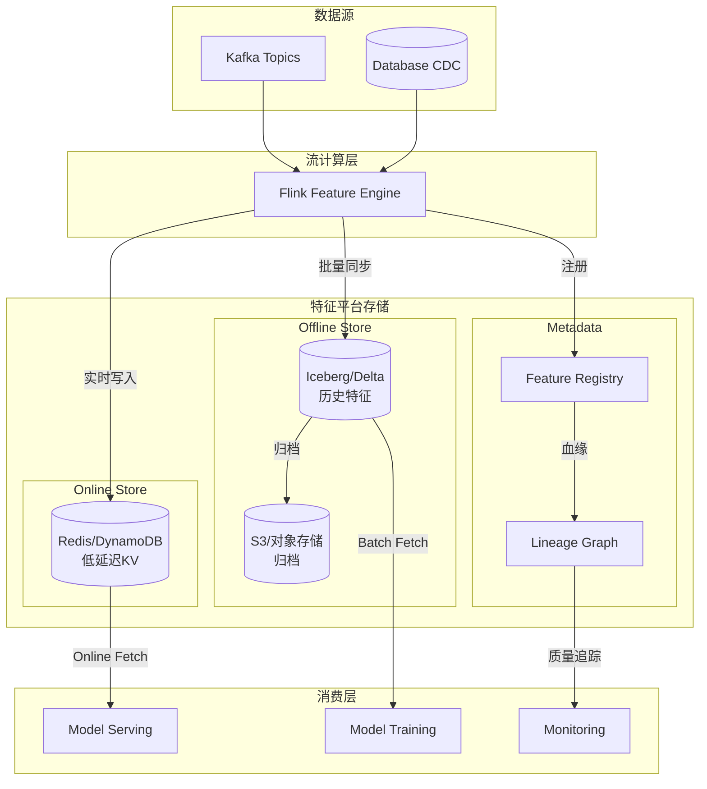
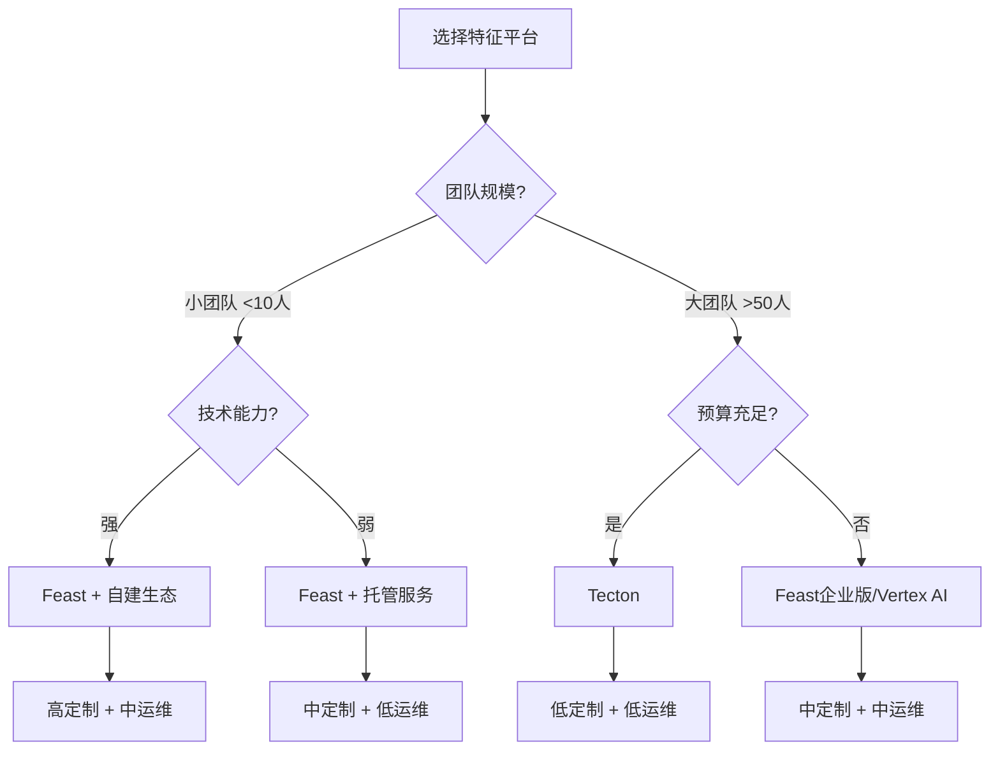
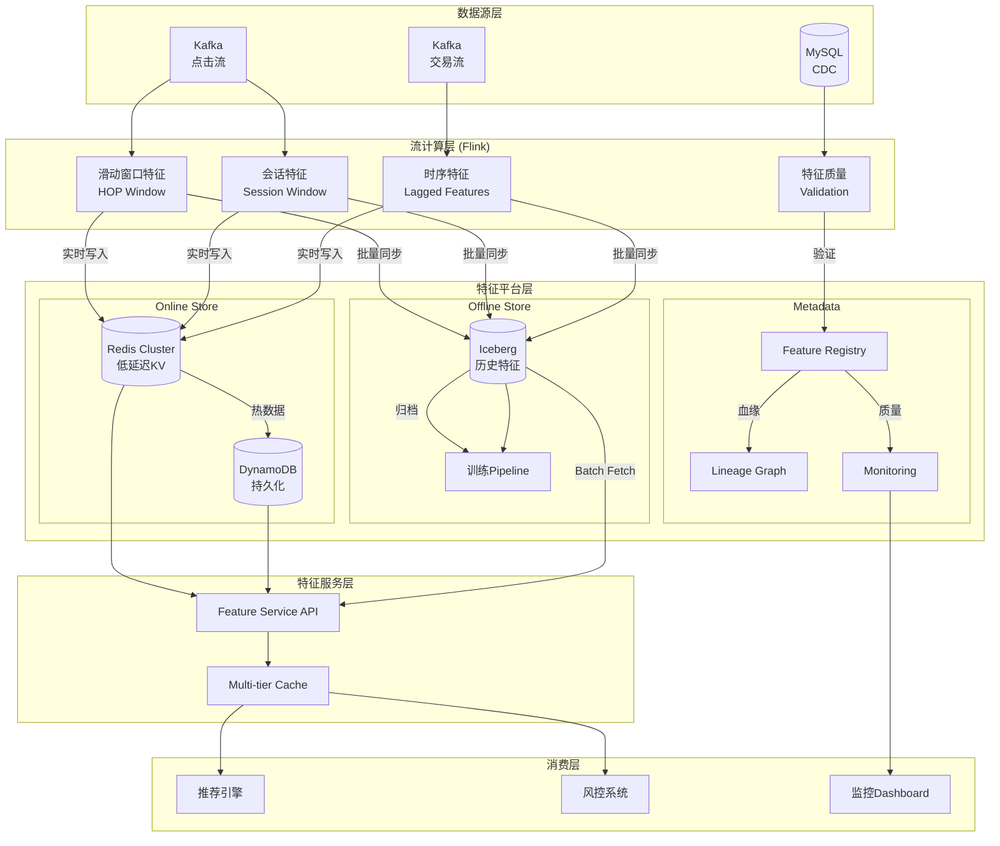
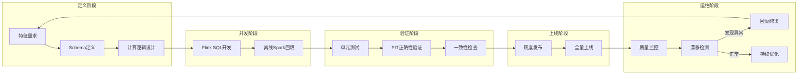
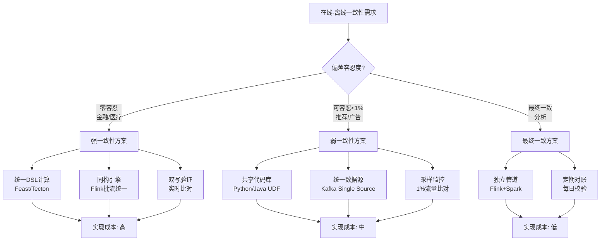
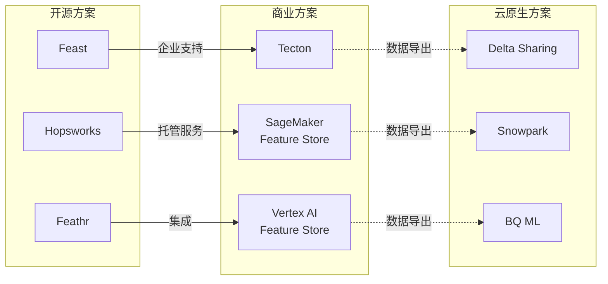
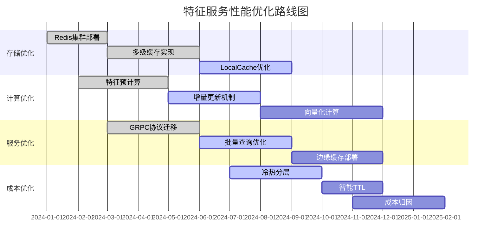

# 实时特征平台架构实践 (Real-time Feature Store Architecture)

> 所属阶段: Knowledge/06-frontier | 前置依赖: [pattern-realtime-feature-engineering.md](../02-design-patterns/pattern-realtime-feature-engineering.md), [streaming-lakehouse-iceberg-delta.md](streaming-lakehouse-iceberg-delta.md) | 形式化等级: L4

---

## 1. 概念定义 (Definitions)

### Def-K-06-210: 特征平台 (Feature Store)

**特征平台**是MLOps基础设施中统一管理特征生命周期的核心组件，提供特征的标准化定义、计算、存储、发现和访问能力。

$$
\mathcal{FS} = \langle \mathcal{D}, \mathcal{C}, \mathcal{S}, \mathcal{M}, \mathcal{G} \rangle
$$

其中：

- $\mathcal{D}$: 特征定义层 (Feature Definitions) —— 特征的元数据、Schema、版本控制
- $\mathcal{C}$: 计算引擎层 (Computation) —— 在线/离线特征计算逻辑
- $\mathcal{S}$: 存储层 (Storage) —— 在线存储 $\mathcal{S}_{\text{online}}$ 与离线存储 $\mathcal{S}_{\text{offline}}$
- $\mathcal{M}$: 元数据管理 (Metadata) —— 血缘追踪、数据质量监控、特征发现
- $\mathcal{G}$: 治理层 (Governance) —— 访问控制、成本管理、SLA保障

**特征平台的核心价值**：将特征工程从**临时脚本**转变为**可复用、可治理、可共享**的基础设施资产。

---

### Def-K-06-211: 实时特征 vs 离线特征

**特征新鲜度分类**基于数据时效性需求：

| 类型 | 延迟要求 | 计算引擎 | 存储介质 | 典型场景 |
|-----|---------|---------|---------|---------|
| **实时特征** (Real-time) | $\mathcal{F} < 1s$ | Flink/Spark Streaming | Redis/DynamoDB | 高频交易、实时推荐 |
| **近实时特征** (Near-real-time) | $1s \leq \mathcal{F} < 60s$ | Flink/Kafka Streams | Redis/Cassandra | 内容推荐、广告投放 |
| **准实时特征** (Quasi-real-time) | $60s \leq \mathcal{F} < 5min$ | Mini-batch | Iceberg/Delta | 风控决策、用户画像 |
| **离线特征** (Batch) | $\mathcal{F} \geq 5min$ | Spark/Hive | HDFS/S3 + Parquet | 模型训练、报表分析 |

**形式化定义**：

$$
\text{Feature}_{\text{realtime}} = \{ f \mid \mathcal{F}(f, t) < \tau_{\text{threshold}} \}
$$

其中 $\mathcal{F}(f, t)$ 为特征 $f$ 在时刻 $t$ 的新鲜度，$\tau_{\text{threshold}}$ 为业务定义的阈值。

---

### Def-K-06-212: 在线-离线一致性 (Training-Serving Skew)

**在线-离线一致性**要求同一特征在在线服务（推理）和离线训练时的数值分布保持一致，避免训练-服务偏差 (Training-Serving Skew)。

$$
\Delta_{TS} = \mathbb{E}[f_{\text{online}}] - \mathbb{E}[f_{\text{offline}}]
$$

**一致性等级**：

| 等级 | 偏差容忍 | 实现复杂度 | 适用场景 |
|-----|---------|-----------|---------|
| 强一致 (Strong) | $\Delta_{TS} = 0$ | 高 | 金融风控、医疗诊断 |
| 弱一致 (Weak) | $|\Delta_{TS}| < \epsilon$ | 中 | 推荐系统、广告投放 |
| 最终一致 (Eventual) | $\lim_{t \to \infty} \Delta_{TS}(t) = 0$ | 低 | 用户画像、日志分析 |

**关键挑战**：

1. 计算引擎差异 (Flink vs Spark 的语义差异)
2. 数据源时滞 (Kafka vs 离线日志的延迟差异)
3. 时间语义差异 (Event Time vs Processing Time)

---

### Def-K-06-213: Point-in-Time 正确性

**Point-in-Time (PIT) 正确性**是防止特征泄露 (Data Leakage) 的核心机制，确保在训练时使用的特征值是**预测时刻之前**实际可见的数据。

$$
\text{PIT-Correct}(f, e) \iff \tau_{\text{compute}}(f) \leq \tau_{\text{event}}(e)
$$

其中：

- $\tau_{\text{compute}}(f)$: 特征 $f$ 的计算/更新时间
- $\tau_{\text{event}}(e)$: 事件 $e$ 的发生时间 (预测目标)

**PIT 回填 (Backfill)**：

对于历史训练数据，需要按时间点重新计算特征：

$$
f_{\text{backfill}}(e, t) = \bigoplus \{ x \mid x \in \mathcal{D} \land \tau(x) \leq t \}
$$

---

### Def-K-06-214: 特征血缘 (Feature Lineage)

**特征血缘**是特征从数据源到最终消费的全链路追踪关系，表示为有向无环图：

$$
\mathcal{L}_{\text{feature}} = (V, E), \quad V = \text{DataSources} \cup \text{Transformations} \cup \text{Features}
$$

其中边 $E$ 表示数据依赖关系：

- **上游依赖**：原始数据源、上游特征
- **计算逻辑**：特征转换、聚合、Join操作
- **下游消费**：模型服务、分析报表、其他特征

**血缘追踪价值**：

1. 变更影响分析：Schema变更时识别受影响特征
2. 根因分析：特征异常时追溯上游数据源
3. 合规审计：满足数据溯源要求

---

### Def-K-06-215: 特征服务 API (Feature Service)

**特征服务 API**是特征平台向模型推理服务暴露的统一访问接口：

$$
\text{FeatureService}(\text{entity\_ids}, \text{feature\_names}, t) \to \{ (f, v, \tau) \}
$$

**API 设计原则**：

| 维度 | 设计要求 | 典型值 |
|-----|---------|--------|
| 延迟 (Latency) | P99 响应时间 | < 10ms (在线), < 100ms (批量) |
| 可用性 (Availability) | 服务可用时间 | 99.99% |
| 吞吐 (Throughput) | QPS 容量 | 100K+ req/s |
| 一致性 (Consistency) | 读写一致性 | 最终一致 / 强一致 |

**接口模式**：

- **Online Fetch**: 实时获取单个实体特征 (低延迟)
- **Batch Fetch**: 批量获取特征用于离线训练/批量推理
- **Stream Push**: 推送特征更新到消费方

---

## 2. 属性推导 (Properties)

### Lemma-K-06-201: 特征新鲜度与模型效果的正相关性

**命题**: 对于时序敏感的预测任务，特征新鲜度 $\mathcal{F}$ 与模型效果指标 $M$ 呈正相关：

$$
\frac{\partial M}{\partial \mathcal{F}} < 0 \quad \text{(新鲜度越高，效果越好)}
$$

**证明概要**:

设模型输入 $X_t$ 包含特征 $f_t$，真实分布为 $P(Y|X_t)$。由于数据分布随时间漂移：

$$
P_t(Y|X) \neq P_{t+\Delta}(Y|X)
$$

使用过时特征 $f_{t-\mathcal{F}}$ 相当于在分布漂移后的数据上训练：

$$
\mathbb{E}[\mathcal{L}(Y, \hat{Y}(f_{t-\mathcal{F}}))] \geq \mathbb{E}[\mathcal{L}(Y, \hat{Y}(f_t))]
$$

因此 $\mathcal{F} \downarrow \Rightarrow \text{Loss} \uparrow \Rightarrow M \downarrow$。

**经验数据** (电商推荐场景)：

| 特征新鲜度 | CTR相对提升 | 延迟成本 |
|-----------|------------|---------|
| 5分钟 | 基准 (0%) | 低 |
| 1分钟 | +8% | 中 |
| 10秒 | +15% | 高 |
| 实时 (<1s) | +22% | 很高 |

---

### Lemma-K-06-202: 在线存储容量边界

**命题**: 在线存储容量 $C_{\text{online}}$ 受特征维度 $D$ 和实体数量 $N$ 约束：

$$
C_{\text{online}} \geq N \times D \times \bar{s} \times (1 + \alpha)
$$

其中：

- $\bar{s}$: 特征平均字节大小
- $\alpha$: 索引和元数据开销系数 (通常 0.2-0.5)

**容量优化策略**：

1. **分层存储**：热特征 (Redis) + 温特征 (SSD) + 冷特征 (对象存储)
2. **特征 TTL**：设置特征过期时间，自动淘汰低频访问特征
3. **压缩编码**：使用字典编码、差分编码减少存储占用

---

### Prop-K-06-203: 特征计算复用率

**命题**: 对于滑动窗口特征，计算复用率 $\eta$ 与窗口重叠度正相关：

$$
\eta = 1 - \frac{S}{L} = \rho
$$

其中：

- $L$: 窗口长度
- $S$: 滑动步长
- $\rho$: 窗口重叠度

**工程意义**:

- 当 $\rho \geq 0.5$ 时，增量计算可降低 50%+ 算力消耗
- 推荐配置：$S = 0.1 \times L$ 到 $0.25 \times L$ 以平衡新鲜度与成本

---

## 3. 关系建立 (Relations)

### 3.1 特征平台与MLOps的关系

```
┌─────────────────────────────────────────────────────────────────┐
│                        MLOps Pipeline                           │
├─────────────────────────────────────────────────────────────────┤
│                                                                 │
│   Data Ingestion ──► Feature Engineering ──► Model Training    │
│         │                    ▲                    │            │
│         │                    │                    ▼            │
│         │           ┌────────┴────────┐      Model Registry    │
│         │           │  Feature Store  │            │            │
│         │           │   (特征平台)     │◄───────────┘            │
│         │           └────────┬────────┘                         │
│         │                    │                                  │
│         ▼                    ▼                    ▼            │
│   Raw Data ──► Online Features ──► Model Serving (Inference)   │
│   Sources      Offline Features      Feature Service API       │
│                                                                 │
└─────────────────────────────────────────────────────────────────┘
```

**关系说明**：

| MLOps阶段 | 特征平台角色 | 核心功能 |
|----------|-------------|---------|
| 数据摄取 | 数据接收 | 从Kafka/CDC接收实时数据 |
| 特征工程 | 计算引擎 | 执行特征变换、聚合、Join |
| 模型训练 | 离线特征源 | 提供PIT正确的历史特征 |
| 模型服务 | 在线特征源 | 低延迟特征查询服务 |
| 监控 | 质量守门 | 特征分布监控、漂移检测 |

---

### 3.2 与流计算系统的关系映射

| 特征平台概念 | Flink/Spark对应物 | 关系类型 |
|-------------|------------------|---------|
| 实时特征计算 | Window Operator + State | 直接映射 |
| 特征新鲜度 | Watermark 延迟 | 等价约束 |
| 在线特征服务 | Queryable State | 运行时暴露 |
| 离线特征回填 | Batch Job / 历史数据处理 | 批流统一 |
| 特征血缘 | Lineage API | 元数据集成 |

---

### 3.3 与Data Lakehouse的关系



---

## 4. 论证过程 (Argumentation)

### 4.1 特征平台 vs 临时特征工程：必要性论证

**传统临时方案的痛点**：

| 痛点 | 影响 | 量化指标 |
|-----|------|---------|
| 重复开发 | 同一特征被多个团队重复计算 | 3-5x 资源浪费 |
| 版本混乱 | 特征定义不一致导致模型效果波动 | AUC波动 5-10% |
| 追溯困难 | 特征异常时无法快速定位根因 | MTTR > 4小时 |
| 治理缺失 | 敏感特征无访问控制 | 合规风险 |

**特征平台的解决方案**：

```
传统模式:                    特征平台模式:
┌───────┐                    ┌───────────────┐
│ Team A │──┐                │               │
└───────┘  │                │   Feature     │◄──┐
           ├─► Kafka ──►    │   Store       │   │
┌───────┐  │                │   (统一)       │───┼──► Model
│ Team B │──┘                │               │◄──┘
└───────┘                    └───────────────┘
      │                           │
      ▼                           ▼
  重复计算                      复用共享
```

---

### 4.2 实时特征计算的技术选型

**问题**：如何选择实时特征计算引擎？

**决策矩阵**：

| 引擎 | 延迟 | 吞吐 | 状态管理 | 适用场景 |
|-----|-----|------|---------|---------|
| **Flink** | <100ms | 极高 | 完善 | 复杂窗口、Exactly-Once |
| **Spark Streaming** | 1-10s | 高 | 中等 | 已有Spark生态 |
| **ksqlDB** | 10-100ms | 中等 | 有限 | 简单SQL转换 |
| **RisingWave** | <10ms | 高 | 原生 | 物化视图场景 |
| **Kafka Streams** | <10ms | 中等 | RocksDB | 轻量级嵌入 |

**选型建议**：

```
特征复杂度:
┌─────────────────────────────────────────────┐
│  简单聚合 (COUNT/SUM)  ──► ksqlDB/Streams  │
│  中等复杂度 ─────────────► RisingWave       │
│  复杂窗口/Join ──────────► Flink           │
│  批流统一 ───────────────► Flink/Spark      │
└─────────────────────────────────────────────┘
```

---

### 4.3 训练-服务偏差的根因分析

**偏差来源分类**：

```
Training-Serving Skew Root Causes:
┌──────────────────────────────────────────────────────────────┐
│                                                              │
│  ┌─────────────┐    ┌─────────────┐    ┌─────────────┐      │
│  │ Code Path   │    │ Data Source │    │  Time       │      │
│  │ Difference  │    │  Lag        │    │  Semantic   │      │
│  │             │    │             │    │             │      │
│  │ Spark UDF   │    │ Kafka vs    │    │ Event Time  │      │
│  │ ≠ Flink UDF │    │ Offline Log │    │ ≠ Proc Time │      │
│  │             │    │             │    │             │      │
│  └──────┬──────┘    └──────┬──────┘    └──────┬──────┘      │
│         │                  │                  │              │
│         └──────────────────┼──────────────────┘              │
│                            ▼                                 │
│                    ┌───────────────┐                         │
│                    │ ΔTS > 0       │                         │
│                    │ (Consistency  │                         │
│                    │  Violation)   │                         │
│                    └───────────────┘                         │
│                                                              │
└──────────────────────────────────────────────────────────────┘
```

**缓解策略**：

| 根因 | 缓解策略 | 实现成本 |
|-----|---------|---------|
| Code Path | 统一特征计算DSL (Feast/Hopsworks) | 高 |
| Data Source | Kafka作为Single Source of Truth | 中 |
| Time Semantic | 统一使用Event Time + Watermark | 中 |

---

## 5. 形式证明 / 工程论证 (Proof / Engineering Argument)

### Thm-K-06-140: 在线-离线一致性保证定理

**定理**: 若特征平台满足以下条件，则可保证训练-服务偏差 $\Delta_{TS} = 0$：

1. **计算逻辑一致**: $\forall f: \text{Code}_{\text{online}}(f) = \text{Code}_{\text{offline}}(f)$
2. **数据源一致**: $\text{Source}_{\text{online}} = \text{Source}_{\text{offline}}$ (相同Kafka Topic)
3. **时间语义一致**: 统一使用 Event Time 和相同 Watermark 策略
4. **PIT正确性**: 离线训练使用 PIT 回填策略

**证明**:

设在线特征计算为：

$$
f_{\text{online}}(e, t) = C_{\text{online}}(D_{\text{online}}^{[0, t]})
$$

离线训练特征计算为：

$$
f_{\text{offline}}(e, t) = C_{\text{offline}}(D_{\text{offline}}^{[0, t]})
$$

由条件1: $C_{\text{online}} = C_{\text{offline}} = C$

由条件2: $D_{\text{online}} = D_{\text{offline}} = D$

由条件4: 离线计算在时间点 $t$ 使用数据 $D^{[0, t]}$，与在线计算相同

因此：

$$
f_{\text{online}}(e, t) = C(D^{[0, t]}) = f_{\text{offline}}(e, t)
$$

$$
\Rightarrow \Delta_{TS} = \mathbb{E}[f_{\text{online}}] - \mathbb{E}[f_{\text{offline}}] = 0
$$

∎

---

### Thm-K-06-141: 特征服务延迟下界定理

**定理**: 特征服务 API 的 P99 延迟下界为：

$$
\text{Latency}_{\text{P99}} \geq \max(\text{RTT}_{\text{network}}, \text{Latency}_{\text{storage}}) + \text{Overhead}_{\text{serialization}}
$$

**证明**:

特征服务调用链：

$$
\text{Client} \xrightarrow{t_1} \text{FeatureService} \xrightarrow{t_2} \text{Storage} \xrightarrow{t_3} \text{FeatureService} \xrightarrow{t_4} \text{Client}
$$

其中：

- $t_1 + t_4 \geq \text{RTT}_{\text{network}}$ (网络往返不可压缩)
- $t_2 + t_3 \geq \text{Latency}_{\text{storage}}$ (存储访问延迟)

因此：

$$
\text{TotalLatency} = t_1 + t_2 + t_3 + t_4 \geq \text{RTT}_{\text{network}} + \text{Latency}_{\text{storage}}
$$

加上序列化/反序列化开销：

$$
\text{Latency}_{\text{P99}} \geq \max(\text{RTT}_{\text{network}}, \text{Latency}_{\text{storage}}) + \text{Overhead}_{\text{serialization}}
$$

**实际数值参考** (AWS环境)：

| 组件 | 典型延迟 | P99延迟 |
|-----|---------|--------|
| 同AZ网络RTT | 0.1ms | 0.5ms |
| Redis (单key) | 0.5ms | 1ms |
| DynamoDB (DAX缓存) | 1ms | 5ms |
| DynamoDB (直连) | 10ms | 50ms |

因此，**Redis方案**可实现 P99 < 5ms，**DynamoDB+DAX**可实现 P99 < 10ms。

---

### Thm-K-06-142: 特征血缘变更传播定理

**定理**: 对于特征血缘图 $\mathcal{L}_{\text{feature}} = (V, E)$，当上游数据源 $v_u \in V$ 发生变更时，受影响特征集合为：

$$
\text{Impact}(v_u) = \{ v \in V \mid \exists \text{ path } v_u \leadsto v \text{ in } \mathcal{L}_{\text{feature}} \}
$$

**变更传播复杂度**: 若平均出度为 $d$，最大深度为 $h$，则：

$$
|\text{Impact}(v_u)| \leq \sum_{i=0}^{h} d^i = \frac{d^{h+1} - 1}{d - 1}
$$

**工程意义**:

- 深度 $h$ 越大，变更影响范围越大
- 扁平化特征血缘（减少中间层）可降低变更传播范围
- 自动化血缘追踪工具可在 $O(|E|)$ 时间内计算影响范围

---

### 5.4 生产实践：Tecton vs Feast 对比

**架构对比**：

| 维度 | Tecton (企业级) | Feast (开源) |
|-----|-----------------|-------------|
| **部署模式** | SaaS / 托管 | 自托管 |
| **计算引擎** | Spark/Flink (内置) | 需外部集成 |
| **在线存储** | Redis/DynamoDB (托管) | Redis/Cassandra/SQLite |
| **离线存储** | S3/Snowflake/BigQuery | S3/GCS/BigQuery/Snowflake |
| **PIT回填** | 自动 | 需手动配置 |
| **特征监控** | 内置 | 需集成外部工具 |
| **成本** | 高 (企业定价) | 低 (开源免费) |
| **适用场景** | 大型组织、全流程MLOps | 中小团队、灵活定制 |

**选型决策树**：



---

### 5.5 特征缓存策略

**多级缓存架构**：

```
┌─────────────────────────────────────────────────────────────┐
│                    特征服务缓存层级                          │
├─────────────────────────────────────────────────────────────┤
│                                                             │
│   L1: 本地缓存 (进程内)                                      │
│   ├── 存储: Caffeine/Guava Cache                            │
│   ├── 容量: 10K-100K 特征                                   │
│   ├── TTL: 1-10秒                                          │
│   └── 命中率: 60-80%                                       │
│                                                             │
│   L2: 分布式缓存 (Redis Cluster)                            │
│   ├── 存储: Redis Hash                                     │
│   ├── 容量: GB-TB级                                        │
│   ├── TTL: 1-60分钟                                        │
│   └── 命中率: 90-95%                                       │
│                                                             │
│   L3: 特征平台在线存储                                       │
│   ├── 存储: DynamoDB/Cassandra                             │
│   ├── 容量: 无限制                                          │
│   └── 持久化: 100%                                         │
│                                                             │
└─────────────────────────────────────────────────────────────┘
```

**缓存一致性策略**：

| 策略 | 一致性 | 复杂度 | 适用场景 |
|-----|-------|-------|---------|
| Cache-Aside | 最终一致 | 低 | 读多写少 |
| Write-Through | 强一致 | 中 | 读写均衡 |
| Write-Behind | 最终一致 | 高 | 写多读少 |
| Read-Through | 强一致 | 中 | 缓存穿透保护 |

---

## 6. 实例验证 (Examples)

### 6.1 完整特征平台架构示例

**场景**: 电商实时推荐系统

```yaml
# feature_store_config.yaml project: ecommerce_recommendation
provider: aws

# 数据源定义 entities:
  - name: user
    join_keys: [user_id]
    description: 用户实体
  - name: item
    join_keys: [item_id]
    description: 商品实体

# 实时特征视图 feature_views:
  - name: user_behavior_features
    entities: [user]
    ttl: 3600  # 1小时过期

    # 在线特征 (Flink实时计算)
    online:
      source: kafka_clickstream
      processing: flink_sql

    # 离线特征 (Spark历史回填)
    offline:
      source: iceberg_events
      processing: spark_sql

    features:
      - name: click_count_5m
        dtype: INT64
        description: 最近5分钟点击次数

      - name: category_affinity
        dtype: STRING
        description: 当前偏好类目

      - name: session_duration
        dtype: FLOAT
        description: 当前会话时长(秒)

  - name: item_realtime_features
    entities: [item]

    features:
      - name: ctr_1h
        dtype: FLOAT
        description: 1小时CTR

      - name: stock_level
        dtype: INT64
        description: 实时库存

# 存储配置 online_store:
  type: redis
  connection_string: redis://cluster:6379

offline_store:
  type: iceberg
  warehouse: s3://data-lake/feature-store/

# 特征服务配置 feature_service:
  name: recommendation_service
  features:
    - user_behavior_features:click_count_5m
    - user_behavior_features:category_affinity
    - item_realtime_features:ctr_1h
```

---

### 6.2 Flink SQL 特征计算实现

```sql
-- 1. 定义Kafka源表 (实时事件流)
CREATE TABLE user_events (
    user_id STRING,
    item_id STRING,
    event_type STRING,  -- 'click', 'view', 'purchase'
    category STRING,
    event_time TIMESTAMP(3),
    WATERMARK FOR event_time AS event_time - INTERVAL '5' SECOND
) WITH (
    'connector' = 'kafka',
    'topic' = 'user_events',
    'properties.bootstrap.servers' = 'kafka:9092',
    'format' = 'json',
    'scan.startup.mode' = 'latest-offset'
);

-- 2. 定义Redis特征存储表
CREATE TABLE user_features_online (
    user_id STRING,
    click_count_5m BIGINT,
    category_affinity STRING,
    session_duration FLOAT,
    window_start TIMESTAMP(3),
    PRIMARY KEY (user_id) NOT ENFORCED
) WITH (
    'connector' = 'redis',
    'host' = 'redis-cluster',
    'port' = '6379',
    'command' = 'SET',
    'ttl' = '3600'
);

-- 3. 定义Iceberg离线特征表
CREATE TABLE user_features_offline (
    user_id STRING,
    click_count_5m BIGINT,
    category_affinity STRING,
    session_duration FLOAT,
    window_start TIMESTAMP(3),
    ds STRING  -- 分区日期
) PARTITIONED BY (ds) WITH (
    'connector' = 'iceberg',
    'catalog-name' = 'hive_catalog',
    'catalog-database' = 'feature_store',
    'catalog-table' = 'user_features',
    'write-mode' = 'append'
);

-- 4. 滑动窗口特征计算
INSERT INTO user_features_online
SELECT
    user_id,
    COUNT(*) as click_count_5m,
    MODE(category) as category_affinity,  -- 众数
    TIMESTAMPDIFF(SECOND,
        MIN(event_time),
        MAX(event_time)
    ) as session_duration,
    HOP_START(event_time, INTERVAL '10' SECOND, INTERVAL '5' MINUTE) as window_start
FROM user_events
WHERE event_type = 'click'
GROUP BY
    user_id,
    HOP(event_time, INTERVAL '10' SECOND, INTERVAL '5' MINUTE);

-- 5. 同时写入离线存储 (双写模式)
INSERT INTO user_features_offline
SELECT
    user_id,
    click_count_5m,
    category_affinity,
    session_duration,
    window_start,
    DATE_FORMAT(window_start, 'yyyy-MM-dd') as ds
FROM user_features_online;
```

---

### 6.3 特征服务API实现 (Python)

```python
# feature_service.py from typing import List, Dict, Optional
import redis
import pandas as pd
from dataclasses import dataclass
import time

@dataclass
class FeatureValue:
    value: any
    timestamp: float
    freshness_ms: float

class FeatureStoreClient:
    def __init__(self,
                 redis_client: redis.Redis,
                 offline_store: 'IcebergStore',
                 cache_ttl: int = 60):
        self.redis = redis_client
        self.offline = offline_store
        self.cache_ttl = cache_ttl
        self.local_cache = {}

    def get_online_features(
        self,
        entity_ids: List[str],
        feature_names: List[str],
        consistency: str = "eventual"
    ) -> Dict[str, Dict[str, FeatureValue]]:
        """
        获取在线特征 (低延迟路径)

        Args:
            entity_ids: 实体ID列表
            feature_names: 特征名称列表
            consistency: "eventual" | "strong"

        Returns:
            {entity_id: {feature_name: FeatureValue}}
        """
        results = {}

        for entity_id in entity_ids:
            entity_features = {}
            cache_key = f"fs:{entity_id}"

            # L1: 本地缓存
            if entity_id in self.local_cache:
                cached = self.local_cache[entity_id]
                if time.time() - cached['ts'] < 1:  # 1秒本地缓存
                    entity_features = cached['data']

            # L2: Redis缓存
            if not entity_features:
                cached = self.redis.hmget(cache_key, feature_names)
                if all(cached):
                    entity_features = {
                        name: FeatureValue(
                            value=val,
                            timestamp=time.time(),
                            freshness_ms=0
                        )
                        for name, val in zip(feature_names, cached)
                    }
                    # 回填本地缓存
                    self.local_cache[entity_id] = {
                        'data': entity_features,
                        'ts': time.time()
                    }

            # L3: 特征存储 (缓存未命中)
            if not entity_features:
                entity_features = self._fetch_from_store(
                    entity_id, feature_names
                )

            results[entity_id] = entity_features

        return results

    def get_historical_features(
        self,
        entity_df: pd.DataFrame,  # [entity_id, timestamp]
        feature_names: List[str]
    ) -> pd.DataFrame:
        """
        获取历史特征 (PIT正确性保证)

        使用Point-in-Time Join确保没有数据泄露
        """
        # 构建PIT查询
        pit_query = """
        SELECT
            e.entity_id,
            e.timestamp as request_timestamp,
            {feature_cols}
        FROM entity_df e
        LEFT JOIN (
            SELECT *,
                ROW_NUMBER() OVER (
                    PARTITION BY entity_id
                    ORDER BY window_start DESC
                ) as rn
            FROM user_features_offline
            WHERE window_start <= e.timestamp
        ) f ON e.entity_id = f.entity_id AND f.rn = 1
        """

        return self.offline.query(pit_query, entity_df=entity_df)

    def _fetch_from_store(self, entity_id: str,
                         feature_names: List[str]) -> Dict[str, FeatureValue]:
        """从底层存储获取特征"""
        # 实际实现会查询DynamoDB/Cassandra等
        pass


# 使用示例 if __name__ == "__main__":
    client = FeatureStoreClient(
        redis_client=redis.Redis(host='localhost', port=6379),
        offline_store=IcebergStore("s3://data-lake/feature-store/")
    )

    # 在线推理:获取实时特征
    features = client.get_online_features(
        entity_ids=["user_123", "user_456"],
        feature_names=["click_count_5m", "category_affinity"]
    )

    # 离线训练:获取历史特征 (PIT正确)
    entity_df = pd.DataFrame({
        'entity_id': ['user_123', 'user_456'],
        'timestamp': ['2024-01-15 10:00:00', '2024-01-15 10:05:00']
    })

    historical_features = client.get_historical_features(
        entity_df=entity_df,
        feature_names=["click_count_5m", "category_affinity"]
    )
```

---

### 6.4 特征监控与告警配置

```yaml
# feature_monitoring.yaml monitoring:
  # 特征质量检查
  quality_checks:
    - name: null_rate_check
      threshold: 0.05  # NULL值率 < 5%
      severity: warning

    - name: range_check
      features: [click_count_5m, session_duration]
      min_value: 0
      severity: critical

    - name: distribution_drift
      method: psi  # Population Stability Index
      threshold: 0.2
      baseline: last_7_days
      severity: warning

  # 新鲜度监控
  freshness_alerts:
    - feature_view: user_behavior_features
      max_delay: 30s  # 最大延迟30秒
      severity: critical

    - feature_view: item_realtime_features
      max_delay: 60s
      severity: warning

  # 在线-离线一致性检查
  consistency_checks:
    - feature: click_count_5m
      sample_rate: 0.01  # 1%采样
      tolerance: 0.001   # 允许0.1%差异

  # 成本监控
  cost_alerts:
    - resource: redis_online_store
      daily_budget: $500
      alert_at: 80%
```

---

## 7. 可视化 (Visualizations)

### 7.1 实时特征平台架构全景图



---

### 7.2 特征生命周期流程图



---

### 7.3 在线-离线一致性架构决策树



---

### 7.4 特征平台技术栈对比矩阵



---

### 7.5 特征服务性能优化路线图



---

## 8. 引用参考 (References)


---

*文档版本: v1.0 | 创建日期: 2026-04-03 | 形式化等级: L4*

---

*文档版本: v1.0 | 创建日期: 2026-04-18*
