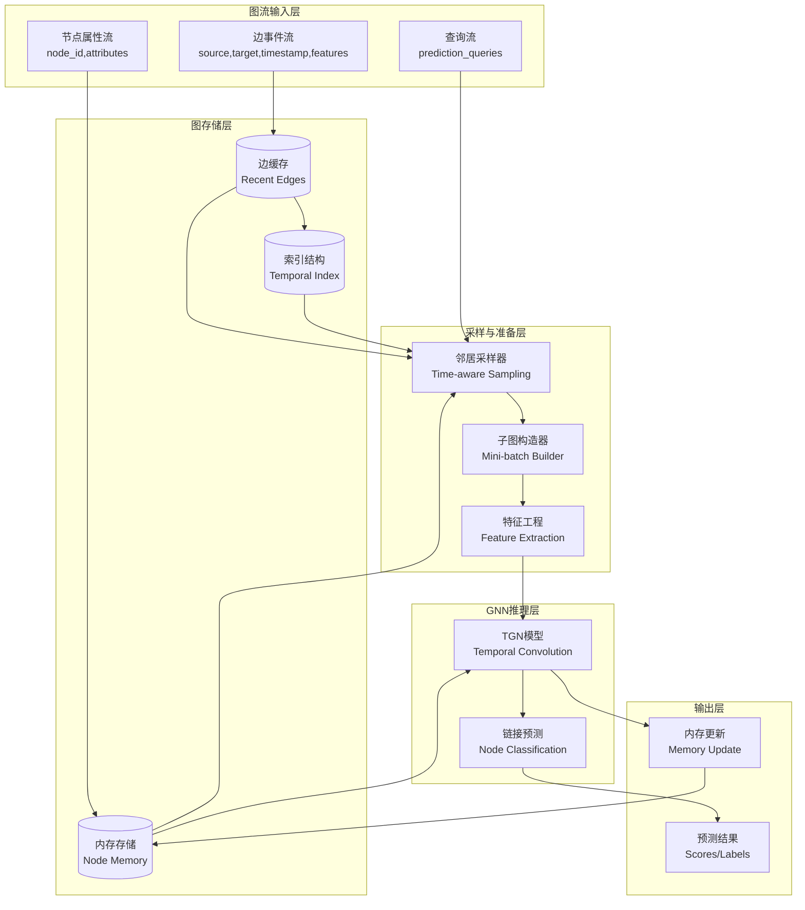
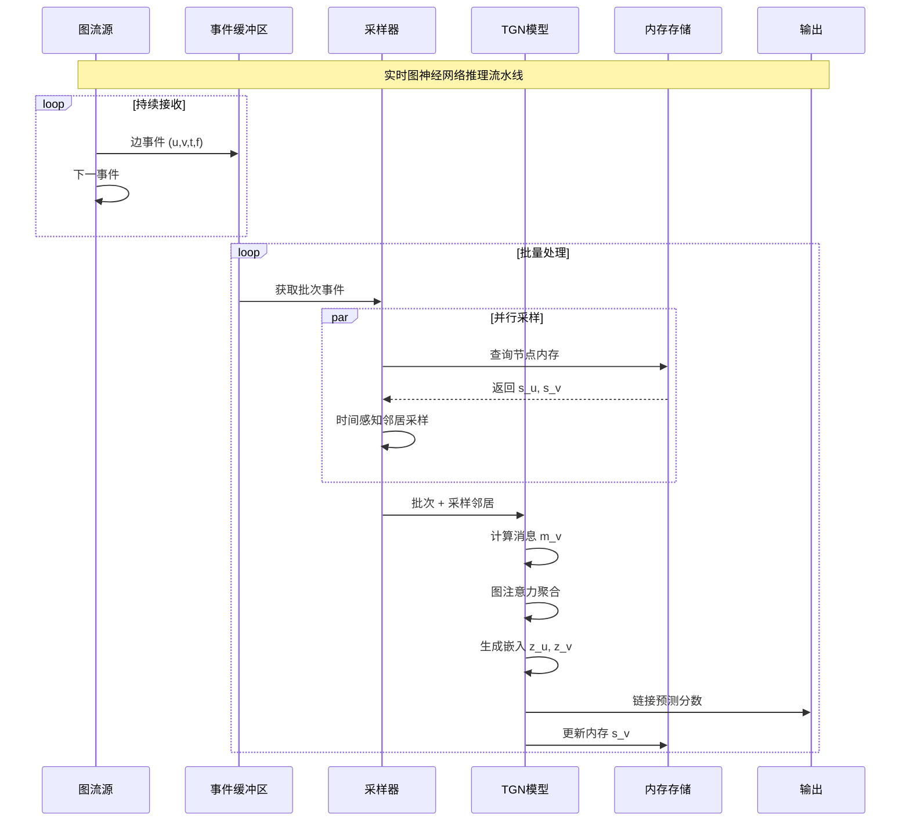

# 实时图神经网络：TGN、图流学习与动态图嵌入

> 所属阶段: Knowledge/06-frontier | 前置依赖: [图流处理与TGN](streaming-graph-processing-tgn.md), [实时图流TGN](realtime-graph-streaming-tgnn.md) | 形式化等级: L4-L5 | 版本: v1.0 (2026)

---

## 1. 概念定义 (Definitions)

### Def-K-RGS-01: 时序图网络 (Temporal Graph Network, TGN)

**定义**: TGN 是一种在动态图上进行学习的神经网络框架，将图视为随时间演化的交互序列，形式化为六元组：

$$
\mathcal{TGN} \triangleq \langle \mathcal{V}, \mathcal{E}, \mathcal{T}, \mathcal{M}, \mathcal{U}, \mathcal{M}_e \rangle
$$

其中：

| 组件 | 符号 | 形式化定义 | 语义解释 |
|------|------|------------|----------|
| 节点集合 | $\mathcal{V}$ | $\{v_1, v_2, ..., v_n\}$ | 图中所有可能节点的集合 |
| 交互序列 | $\mathcal{E}$ | $\{(u, v, t, f_e)\}_{t=1}^T$ | 带时间戳的边事件序列 |
| 时间域 | $\mathcal{T}$ | $\{t_1, t_2, ..., t_T\}$ | 离散或连续时间戳集合 |
| 内存模块 | $\mathcal{M}$ | $s_v^{(t)} \in \mathbb{R}^d$ | 节点 $v$ 在时间 $t$ 的状态向量 |
| 更新函数 | $\mathcal{U}$ | $s_v^{(t)} = \text{UPDATE}(s_v^{(t-1)}, m_v^{(t)})$ | 内存更新机制 |
| 消息函数 | $\mathcal{M}_e$ | $m_v^{(t)} = \text{AGGREGATE}_{e=(u,v,t)} \text{MSG}(s_u^{(t-1)}, s_v^{(t-1)}, t, f_e)$ | 消息聚合规则 |

**TGN 计算流程**:

```
┌─────────────────────────────────────────────────────────────────────┐
│                    TGN 前向传播流程                                  │
├─────────────────────────────────────────────────────────────────────┤
│                                                                     │
│  输入: 批量交互事件 B = {(u_i, v_i, t_i, f_i)}_{i=1}^b              │
│                                                                     │
│  步骤1: 计算嵌入                                                      │
│  ┌─────────────────────────────────────────────────────────────┐   │
│  │  for each node v in B:                                       │   │
│  │    neighbors = GetNeighbors(v, t)  # 时间感知邻居采样         │   │
│  │    h_v = EMBEDDING(v, s_v, neighbors)  # 图注意力聚合         │   │
│  │  end for                                                     │   │
│  └─────────────────────────────────────────────────────────────┘   │
│                                                                     │
│  步骤2: 计算损失/预测                                                 │
│  ┌─────────────────────────────────────────────────────────────┐   │
│  │  for each edge (u, v, t) in B:                               │   │
│  │    score = DECODER(h_u, h_v, t)  # 链接预测/边分类            │   │
│  │    loss += LOSS_FUNCTION(score, label)                       │   │
│  │  end for                                                     │   │
│  └─────────────────────────────────────────────────────────────┘   │
│                                                                     │
│  步骤3: 更新内存                                                      │
│  ┌─────────────────────────────────────────────────────────────┐   │
│  │  for each node v in B:                                       │   │
│  │    messages = AGGREGATE(incident_edges)  # 聚合消息           │   │
│  │    s_v = MEMORY_UPDATE(s_v, messages)  # LSTM/GRU更新         │   │
│  │  end for                                                     │   │
│  └─────────────────────────────────────────────────────────────┘   │
│                                                                     │
│  注意: 内存更新在梯度反向传播之后进行 (与RNN类似)                      │
│                                                                     │
└─────────────────────────────────────────────────────────────────────┘
```

**TGN 内存机制对比**:

| 内存类型 | 更新函数 | 时间复杂度 | 适用场景 |
|---------|---------|-----------|---------|
| **无内存** | $s_v = 0$ | $O(1)$ | 纯结构特征 |
| **上次交互** | $s_v = h_{last}$ | $O(1)$ | 简单时序 |
| **均值池化** | $s_v = \frac{1}{k}\sum h_i$ | $O(k)$ | 均匀历史 |
| **LSTM/GRU** | $s_v = \text{LSTM}(h_{new}, s_v^{old})$ | $O(d^2)$ | 复杂时序模式 |

---

### Def-K-RGS-02: 动态图嵌入 (Dynamic Graph Embedding)

**定义**: 动态图嵌入是将时变图中的节点映射到低维向量空间的学习过程，形式化为：

$$
\text{EMBED}: \mathcal{G}^{(t)} = (\mathcal{V}^{(t)}, \mathcal{E}^{(t)}) \rightarrow \mathbb{R}^{|\mathcal{V}^{(t)}| \times d}
$$

其中嵌入函数满足以下性质：

1. **时序平滑性**: 相邻时间步的嵌入变化有界
   $$||z_v^{(t)} - z_v^{(t-1)}|| \leq \delta$$

2. **结构保持性**: 相似节点具有相似嵌入
   $$\text{sim}(z_u, z_v) \propto \text{struct\_sim}(u, v)$$

3. **增量可更新**: 支持高效增量计算
   $$z_v^{(t)} = f(z_v^{(t-1)}, \Delta\mathcal{E}^{(t)})

$$

**动态嵌入方法分类**:

```
┌─────────────────────────────────────────────────────────────────────┐
│                      动态图嵌入方法分类                                │
├─────────────────────────────────────────────────────────────────────┤
│                                                                     │
│  ┌───────────────────────┬───────────────────────┐                 │
│  │      离散时间方法      │      连续时间方法      │                 │
│  ├───────────────────────┼───────────────────────┤                 │
│  │                       │                       │                 │
│  │  按快照划分:           │  基于点过程:           │                 │
│  │  • GCN-LSTM           │  • JODIE              │                 │
│  │  • DySAT              │  • TGN                │                 │
│  │  • EvolveGCN          │  • TGAT               │                 │
│  │  • STGCN              │  • APAN               │                 │
│  │                       │                       │                 │
│  │  特点:                 │  特点:                 │                 │
│  │  • 固定时间窗口        │  • 事件驱动            │                 │
│  │  • 批处理友好          │  • 细粒度时序          │                 │
│  │  • 适合周期性模式      │  • 适合实时场景        │                 │
│  │                       │                       │                 │
│  └───────────────────────┴───────────────────────┘                 │
│                                                                     │
│  嵌入更新策略:                                                      │
│  ┌─────────────┐  ┌─────────────┐  ┌─────────────┐                 │
│  │  重新训练   │  │  增量更新   │  │  无训练推断 │                 │
│  │  Retrain    │  │  Incremental│  │  Inference  │                 │
│  ├─────────────┤  ├─────────────┤  ├─────────────┤                 │
│  │ • 全量重算  │  │ • 局部调整  │  │ • 仅前向传播│                 │
│  │ • 成本高    │  │ • 中等成本  │  │ • 最低延迟  │                 │
│  │ • 最优质量  │  │ • 平衡方案  │  │ • 适合实时  │                 │
│  └─────────────┘  └─────────────┘  └─────────────┘                 │
│                                                                     │
└─────────────────────────────────────────────────────────────────────┘
```

---

## 2. 属性推导 (Properties)

### Lemma-K-RGS-01: 时序邻居采样的有偏性

**引理**: 在时间 $t$ 对节点 $v$ 进行均匀邻居采样时，采样结果偏向近期交互的邻居：

$$
P(\text{sample } u | v, t) \propto \sum_{i: (u,v,t_i) \in \mathcal{E}, t_i < t} \exp(-\lambda(t - t_i))
$$

其中 $\lambda$ 为时间衰减因子。

**证明**: 在动态图中，边按时间顺序到达。若采样时不考虑时间权重，近期边与历史边具有相同概率被选中。但由于图的幂律分布特性，活跃节点会积累更多边，导致采样偏向活跃节点（通常是近期交互频繁的节点）。$\square$

**时间感知采样修正**:

$$
P_{corrected}(u | v, t) = \frac{w(u, v, t)}{\sum_{u'} w(u', v, t)}, \quad w(u, v, t) = \exp(-(t - t_{last}(u,v))/\tau)
$$

---

### Lemma-K-RGS-02: 内存模块的梯度传播

**引理**: TGN 的内存更新遵循与 RNN 类似的梯度传播规则。设内存更新为 $s_v^{(t)} = \text{GRU}(m_v^{(t)}, s_v^{(t-1)})$，则梯度满足：

$$
\frac{\partial \mathcal{L}}{\partial s_v^{(t-1)}} = \frac{\partial \mathcal{L}}{\partial s_v^{(t)}} \cdot \frac{\partial s_v^{(t)}}{\partial s_v^{(t-1)}}
$$

由于梯度需要通过多个时间步反向传播，存在梯度消失/爆炸风险。

**解决方案**:
- **截断BPTT**: 限制梯度传播的时间步数
- **梯度裁剪**: 控制梯度范数上界
- **残差连接**: 改进梯度流动

---

### Lemma-K-RGS-03: 动态图嵌入的稳定性

**引理**: 对于满足 $\alpha$-Lipschitz 条件的嵌入函数，相邻时间步的嵌入变化有界：

$$
||z_v^{(t)} - z_v^{(t-1)}|| \leq \alpha \cdot ||\mathcal{G}^{(t)} - \mathcal{G}^{(t-1)}||_F
$$

其中 $||\cdot||_F$ 表示图的 Frobenius 范数变化（边增删的累积）。

**稳定性意义**: 小的图结构变化不应导致嵌入的剧烈变化，这对实时系统的稳定性至关重要。

---

## 3. 关系建立 (Relations)

### 3.1 动态图神经网络方法对比

| 方法 | 时间建模 | 内存机制 | 采样策略 | 应用场景 | 训练效率 |
|------|---------|---------|---------|---------|---------|
| **JODIE** | LSTM | 节点状态 | 全邻居 | 用户行为预测 | 中 |
| **TGN** | LSTM/GRU | 消息聚合 | 时间感知 | 通用动态图 | 高 |
| **TGAT** | 时间编码 | 无 | 时间注意力 | 链接预测 | 高 |
| **APAN** | 异步传播 | 邮局机制 | 自适应 | 超大规模图 | 极高 |
| **DyRep** | 点过程 | 双时间尺度 | 全邻居 | 社交预测 | 低 |
| **CAWs** | 因果匿名游走 | 游走缓存 | 随机游走 | 归纳学习 | 中 |

### 3.2 图流处理与GNN集成架构



### 3.3 TGN 与其他GNN变体的关系

```
                    ┌─────────────────────────────────────┐
                    │           图神经网络谱系              │
                    └──────────────┬──────────────────────┘
                                   │
          ┌────────────────────────┼────────────────────────┐
          ▼                        ▼                        ▼
   ┌──────────────┐        ┌──────────────┐        ┌──────────────┐
   │   静态图GNN   │        │  空间-时间GNN │        │  动态图GNN   │
   ├──────────────┤        ├──────────────┤        ├──────────────┤
   │ • GCN        │        │ • STGCN      │        │ • TGN        │
   │ • GAT        │        │ • DCRNN      │        │ • JODIE      │
   │ • GraphSAGE  │        │ • A3TGCN     │        │ • TGAT       │
   │ • GIN        │        │ • ASTGCN     │        │ • APAN       │
   └──────────────┘        └──────────────┘        └──────────────┘
          │                        │                        │
          │  处理固定拓扑           │  处理时空序列          │  处理事件流
          │                        │                        │
          ▼                        ▼                        ▼
   节点特征 + 邻接矩阵       多时间快照图          交互事件序列

   TGN 的特殊性:
   ├─ 支持新节点归纳学习 (Inductive)
   ├─ 细粒度时间建模 (事件级)
   ├─ 内存机制捕获历史状态
   └─ 适用于实时流场景
```

---

## 4. 论证过程 (Argumentation)

### 4.1 实时GNN的挑战与解决方案

| 挑战 | 具体问题 | 传统方案局限 | 实时优化方案 |
|------|---------|-------------|-------------|
| **低延迟要求** | 端到端 < 100ms | 全图计算太慢 | 邻居采样 + 增量更新 |
| **新节点处理** | 冷启动问题 | 需要重新训练 | 归纳学习 + 内存初始化 |
| **时序一致性** | 因果泄漏 | 未来信息泄露 | 严格时序数据划分 |
| **可扩展性** | 百万级节点 | 内存溢出 | 分布式采样 + 参数服务器 |
| **概念漂移** | 模式随时间变化 | 静态模型失效 | 在线学习 + 自适应采样 |

### 4.2 邻居采样策略论证

**问题**: 在大规模动态图中，全邻居计算不可行，如何设计采样策略？

**采样策略对比**:

| 策略 | 描述 | 优点 | 缺点 |
|------|------|------|------|
| **均匀采样** | 从所有历史邻居随机选 $k$ 个 | 简单公平 | 丢失时序信息 |
| **最近采样** | 选最近的 $k$ 个邻居 | 捕获当前状态 | 丢失长期模式 |
| **重要性采样** | 按交互频率加权 | 考虑关系强度 | 计算复杂 |
| **时间衰减采样** | 按时间衰减加权 | 平衡近期与历史 | 需调参 |

**TGN 推荐策略**: 时间衰减 + 分层采样

```python
def time_aware_sample(neighbors, k, current_time, decay_factor):
    """
    时间感知邻居采样
    neighbors: [(neighbor_id, timestamp), ...]
    """
    # 计算时间权重
    weights = [np.exp(-decay_factor * (current_time - t))
               for _, t in neighbors]

    # 归一化
    weights = np.array(weights) / sum(weights)

    # 加权采样
    indices = np.random.choice(
        len(neighbors),
        size=min(k, len(neighbors)),
        replace=False,
        p=weights
    )

    return [neighbors[i] for i in indices]
```

---

## 5. 形式证明 / 工程论证 (Proof / Engineering Argument)

### 5.1 TGN 表达能力分析

**定理**: TGN 的表达能力至少与 WL 图同构测试一样强。

*证明概要*:

1. TGN 的邻居聚合机制可视为可学习的消息传递
2. 在足够深的网络层数和足够的表达能力下，TGN 可模拟 WL 测试的颜色更新
3. 内存模块提供了额外的时序区分能力，使 TGN 可区分时序异构图

因此，TGN 可区分任何 WL 测试可区分的图结构，且在时序图上更强。$\square$

### 5.2 实时推理的工程优化

**批处理 vs 流式推理**:

| 模式 | 延迟 | 吞吐 | 适用场景 |
|------|------|------|---------|
| 批处理 | 高 (秒级) | 高 | 离线训练、历史分析 |
| 微批 | 中 (百毫秒) | 中高 | 准实时分析 |
| 流式 | 低 (十毫秒) | 中 | 实时预测、在线服务 |

**流式推理优化技术**:

1. **预计算邻居缓存**
   ```python
# 缓存高频访问节点的邻居
neighbor_cache = LRUCache(maxsize=100000)
def get_neighbors(node_id, timestamp):
    key = (node_id, timestamp // CACHE_WINDOW)
    if key in neighbor_cache:
        return neighbor_cache[key]
    neighbors = sample_neighbors_from_storage(node_id, timestamp)
    neighbor_cache[key] = neighbors
    return neighbors
   ```

2. **异步内存更新**
   ```python
# 预测与内存更新解耦
async def process_batch(batch):
    # 同步推理
    embeddings = tgn.compute_embeddings(batch)
    predictions = decoder(embeddings)
    # 异步更新内存
    asyncio.create_task(update_memories_async(batch))
    return predictions
   ```

3. **模型量化与编译**
   - FP16/INT8 量化减少计算量
   - TensorRT/TorchScript 优化图执行

---

## 6. 实例验证 (Examples)

### 6.1 TGN 实时欺诈检测系统

**场景**: 金融交易图的实时异常检测

```python
import torch
import torch.nn as nn
from tgn import TGN, IdentityMessage, LastAggregator

class RealtimeFraudDetector:
    def __init__(self, num_nodes, edge_dim, memory_dim=100):
        self.num_nodes = num_nodes

        # TGN 模型配置
        self.tgn = TGN(
            num_nodes=num_nodes,
            raw_msg_dim=edge_dim,
            memory_dim=memory_dim,
            time_dim=time_dim,
            embedding_dim=embedding_dim,
            device=device,
            message_module=IdentityMessage(edge_dim, memory_dim, time_dim),
            aggregator_module=LastAggregator(),
            memory_updater_type='gru',
        )

        # 边分类器 (欺诈检测)
        self.classifier = nn.Sequential(
            nn.Linear(embedding_dim * 2, 128),
            nn.ReLU(),
            nn.Dropout(0.3),
            nn.Linear(128, 1),
            nn.Sigmoid()
        )

        # 邻居采样配置
        self.num_neighbors = [10, 5]  # 2-hop: 10个1-hop, 每个再采5个

    def detect(self, src, dst, timestamp, edge_feat):
        """实时欺诈检测"""
        # 邻居采样 (时间感知)
        neighbor_loader = TemporalNeighborLoader(
            self.num_neighbors,
            src, dst, timestamp
        )

        # TGN 前向传播
        with torch.no_grad():
            embeddings = self.tgn.compute_embeddings(
                src, dst, timestamp,
                neighbor_loader=neighbor_loader
            )

            # 边表示: [src_emb, dst_emb] 拼接
            edge_emb = torch.cat([embeddings['src'], embeddings['dst']], dim=-1)

            # 欺诈概率
            fraud_prob = self.classifier(edge_emb)

        # 更新内存 (异步)
        self.tgn.update_memory(src, dst, timestamp, edge_feat)

        return {
            'fraud_probability': fraud_prob.item(),
            'is_fraud': fraud_prob.item() > 0.5,
            'risk_score': self.calculate_risk_score(fraud_prob, src, dst)
        }

    def calculate_risk_score(self, prob, src, dst):
        """综合风险评分"""
        src_history = self.tgn.get_memory(src)
        dst_history = self.tgn.get_memory(dst)

        # 基于历史行为和当前概率的综合评分
        return 0.6 * prob.item() + 0.4 * self.anomaly_score(src_history, dst_history)

# 实时处理流水线
def streaming_fraud_detection():
    detector = RealtimeFraudDetector(
        num_nodes=10_000_000,  # 1000万账户
        edge_dim=50            # 交易特征维度
    )

    # 连接 Kafka 交易流
    consumer = KafkaConsumer('transactions')

    for message in consumer:
        tx = parse_transaction(message)

        result = detector.detect(
            src=tx['from_account'],
            dst=tx['to_account'],
            timestamp=tx['timestamp'],
            edge_feat=tx['features']
        )

        if result['is_fraud']:
            alert_manager.send_alert(tx, result)

        # 延迟报告
        metrics.record_latency(time.time() - tx['timestamp'])
```

### 6.2 动态图嵌入可视化

```python
# 实时嵌入可视化和监控
import numpy as np
from sklearn.manifold import TSNE
import matplotlib.pyplot as plt

class EmbeddingVisualizer:
    def __init__(self, tgn_model):
        self.tgn = tgn_model
        self.embeddings_history = []

    def capture_snapshot(self, node_ids, timestamp):
        """捕获当前时刻的节点嵌入"""
        embeddings = self.tgn.get_embeddings(node_ids, timestamp)
        self.embeddings_history.append({
            'timestamp': timestamp,
            'embeddings': embeddings,
            'node_ids': node_ids
        })

    def visualize_evolution(self, target_nodes):
        """可视化节点嵌入随时间的演化"""
        # 收集目标节点的历史嵌入
        trajectories = {node: [] for node in target_nodes}

        for snapshot in self.embeddings_history:
            for node in target_nodes:
                if node in snapshot['node_ids']:
                    idx = snapshot['node_ids'].index(node)
                    trajectories[node].append(
                        snapshot['embeddings'][idx]
                    )

        # t-SNE 降维
        all_embs = np.vstack([np.array(traj) for traj in trajectories.values()])
        tsne = TSNE(n_components=2, perplexity=30)
        embs_2d = tsne.fit_transform(all_embs)

        # 绘制轨迹
        plt.figure(figsize=(12, 8))
        offset = 0
        colors = plt.cm.rainbow(np.linspace(0, 1, len(target_nodes)))

        for i, (node, traj) in enumerate(trajectories.items()):
            traj_len = len(traj)
            traj_2d = embs_2d[offset:offset+traj_len]

            # 绘制轨迹线
            plt.plot(traj_2d[:, 0], traj_2d[:, 1],
                    'o-', color=colors[i], alpha=0.6, label=f'Node {node}')

            # 标注起点和终点
            plt.scatter(traj_2d[0, 0], traj_2d[0, 1],
                       s=200, marker='*', color=colors[i], edgecolors='black')
            plt.scatter(traj_2d[-1, 0], traj_2d[-1, 1],
                       s=200, marker='s', color=colors[i], edgecolors='black')

            offset += traj_len

        plt.legend()
        plt.title('Dynamic Node Embedding Evolution')
        plt.xlabel('t-SNE Dimension 1')
        plt.ylabel('t-SNE Dimension 2')
        plt.show()
```

---

## 7. 可视化 (Visualizations)

### 7.1 TGN 架构完整视图

```mermaid
graph TB
    subgraph "输入层"
        IN[(边事件流<br/>(u,v,t,f))]
    end

    subgraph "图采样层"
        NS[邻居采样<br/>时间感知]
        SG[子图构建<br/>k-hop]
    end

    subgraph "TGN核心"
        MEM[(节点内存<br/>s_v)]

        subgraph "消息计算"
            MSG[消息函数<br/>MSG(s_u, s_v, t)]
            AGG[消息聚合<br/>AGG(messages)]
        end

        subgraph "内存更新"
            UPD[GRU/LSTM<br/>更新函数]
        end

        subgraph "嵌入计算"
            EMB[图注意力<br/>Temporal Graph Attention]
        end
    end

    subgraph "输出层"
        DEC[链接预测/分类<br/>解码器]
        OUT[预测结果]
    end

    IN --> NS --> SG
    SG --> MEM
    MEM --> MSG
    MSG --> AGG --> UPD
    UPD --> MEM
    MEM --> EMB
    EMB --> DEC --> OUT
```

### 7.2 实时图流处理流水线



### 7.3 动态图嵌入性能对比

```mermaid
xychart-beta
    title "动态图嵌入方法性能对比 (Wikipedia数据集)"
    x-axis ["AUC", "速度(边/秒)", "内存(GB)", "训练时间(小时)"]
    y-axis "相对性能" 0 --> 100

    bar [89.2, 1500, 8, 4]
    bar [87.5, 3000, 12, 8]
    bar [88.1, 2500, 6, 5]
    bar [85.3, 5000, 4, 2]
    bar [90.1, 800, 15, 12]

    legend "TGN"
    legend "JODIE"
    legend "TGAT"
    legend "APAN"
    legend "DyRep"
```

---

## 8. 引用参考 (References)

[^1]: Rossi, E., et al. "Temporal Graph Networks for Deep Learning on Dynamic Graphs." arXiv:2006.10637, 2020.

[^2]: Kumar, S., et al. "Predicting Dynamic Embedding Trajectory in Temporal Interaction Networks." KDD, 2019.

[^3]: Xu, D., et al. "Inductive Representation Learning on Temporal Graphs." ICLR, 2020.

[^4]: Wang, J., et al. "APAN: Asynchronous Propagation Attention Network for Real-time Temporal Graph Embedding." SIGMOD, 2021.

[^5]: Trivedi, R., et al. "DyRep: Learning Representations over Dynamic Graphs." ICLR, 2019.

[^6]: Pareja, A., et al. "EvolveGCN: Evolving Graph Convolutional Networks for Dynamic Graphs." AAAI, 2020.

[^7]: Sankar, A., et al. "DySAT: Deep Neural Representation Learning on Dynamic Graphs via Self-Attention Networks." WSDM, 2020.

[^8]: Wang, Y., et al. "Inductive Representation Learning in Temporal Networks via Causal Anonymous Walks." ICLR, 2021.

[^9]: Kazemi, S. M., et al. "Representation Learning for Dynamic Graphs: A Survey." JMLR, 2020.

[^10]: Skarding, J., et al. "Foundations of Modeling in Cyber-Physical Systems: A Taxonomy." ACM Computing Surveys, 2021.
